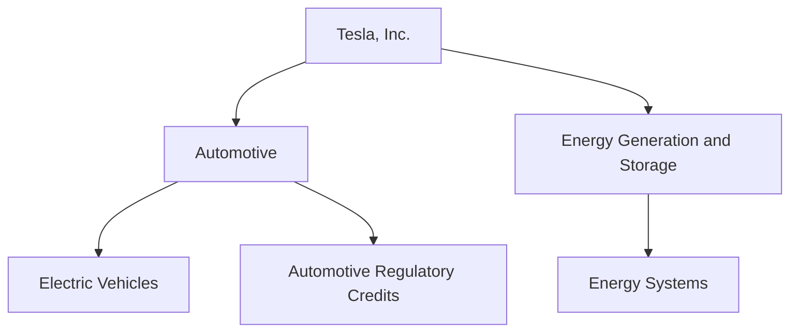
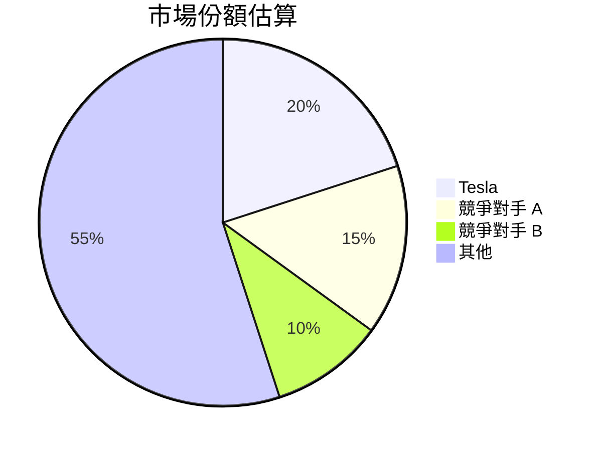
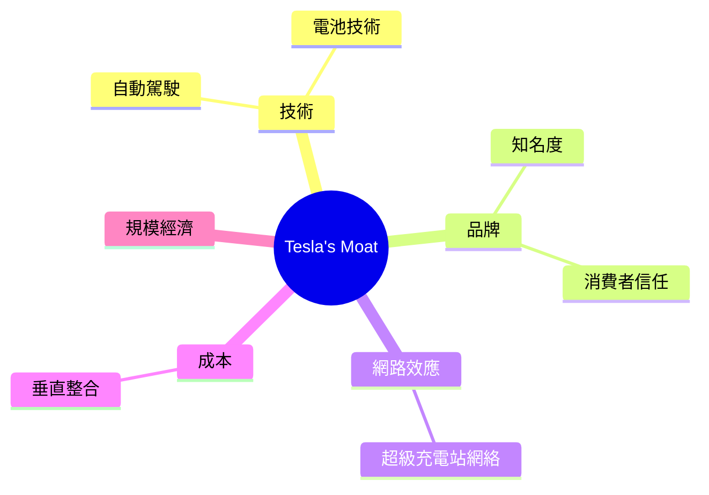
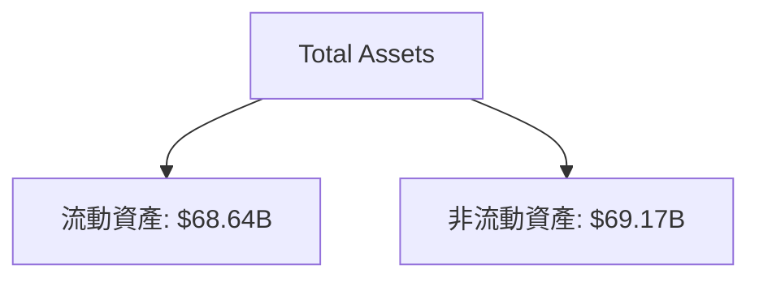
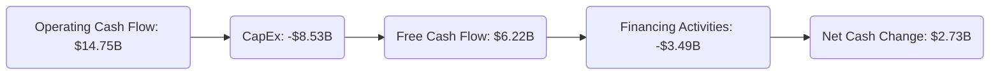
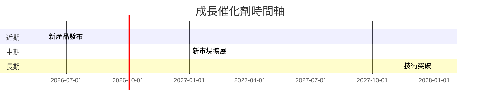
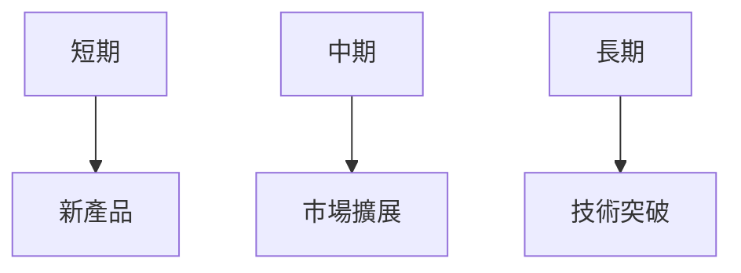
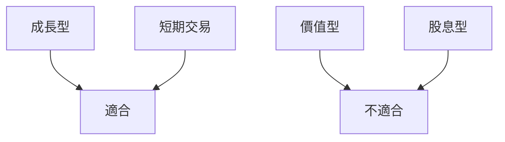

# TSLA 基本面深度分析報告
> **報告日期**：2026-03-25 ｜ **語言**：繁體中文 ｜ **數據來源**：Yahoo Finance

---

## 目錄
1. [執行摘要](#執行摘要)
2. [公司概覽與商業模式](#公司概覽與商業模式)
3. [損益表深度分析](#損益表深度分析)
4. [資產負債表分析](#資產負債表分析)
5. [現金流量深度分析](#現金流量深度分析)
6. [獲利能力與資本效率](#獲利能力與資本效率)
7. [估值深度分析](#估值深度分析)
8. [成長催化劑](#成長催化劑)
9. [風險矩陣](#風險矩陣)
10. [投資建議](#投資建議)

---

## 1. 執行摘要

### 核心評分儀表板
```mermaid
graph LR
    基本面-->成長: 7
    成長-->獲利: 8
    獲利-->財務健康: 6
    財務健康-->估值: 5
```

### 投資論點與風險
#### 5大投資論點
1. 電動車市場領先者，具備品牌優勢 🟢
2. 強大的研發能力與創新文化 🟢
3. 全球擴張潛力，尤其在中國市場 🟢
4. 能源解決方案業務的成長潛力 🟡
5. 自動駕駛技術的領先地位 🟡

#### 3大風險
| 風險項目          | 評估  |
|-------------------|-------|
| 市場競爭加劇       | 🔴    |
| 全球供應鏈緊張     | 🟡    |
| 法規變動風險       | 🔴    |

### 快速統計卡片
| 指標                | TSLA       | 行業均值 |
|---------------------|------------|----------|
| 市值                | $1.46T     | N/A      |
| P/E (Forward)       | 138.09     | 15-20    |
| EPS Growth (YoY)    | -60.6%     | 5%       |
| Gross Margin        | 18.0%      | 20-25%   |
| ROE                 | 4.9%       | 15%      |
| Debt/Equity         | 17.76      | 50-70%   |

### 投資結論
**建議**：持有  
**目標價區間**：$350 - $450

---

## 2. 公司概覽與商業模式

### 業務結構與收入來源


### 市場地位


### 競爭護城河


### 護城河強度評分
```
護城河強度：▓▓▓▓░░░░░░ 5/10
```

---

## 3. 損益表深度分析

### 年度收入成長趨勢
```
2022: ███████████ ($81.46B)
2023: ████████████ ($96.77B) YoY: +18.8%
2024: █████████████ ($97.69B) YoY: +0.9%
2025: ████████████ ($94.83B) YoY: -3.1%
```

### 季度收入趨勢
| 季度 | 總收入 | QoQ 成長率 | YoY 成長率 |
|------|--------|------------|------------|
| 2025-03-31 | $19.34B | - | - |
| 2025-06-30 | $22.50B | +16.3% | - |
| 2025-09-30 | $28.09B | +24.8% | - |
| 2025-12-31 | $24.90B | -11.3% | - |

### 利潤率演變表格
| 年份 | 毛利率 | 營業利益率 | EBITDA 率 | 淨利率 |
|------|--------|------------|-----------|--------|
| 2022 | 25.6%  | 17.0%      | 21.7%     | 15.4%  |
| 2023 | 18.2%  | 9.2%       | 15.3%     | 15.5%  |
| 2024 | 17.9%  | 7.9%       | 15.1%     | 7.3%   |
| 2025 | 18.0%  | 4.7%       | 11.1%     | 4.0%   |

### 費用結構分析


### EPS 趨勢與盈餘品質分析
- **季度超預期/不及預期紀錄**：
  - 2025-12-31: ❌
  - 2025-09-30: ❌
  - 2025-06-30: ❌
  - 2025-03-31: ❌

---

## 4. 資產負債表分析

### 資產結構


### 流動性指標表格
| 指標          | 值    | 評級 |
|---------------|-------|------|
| 流動比        | 2.164 | 🟢   |
| 速動比        | 1.538 | 🟡   |
| 現金比        | 0.52  | 🟡   |

### 債務結構分析
- 總債務：$14.72B
- 短期債務：$3.5B
- 長期債務：$11.22B
- Debt-to-EBITDA：1.25

### 股東權益趨勢
```
2022: █████ ($44.70B)
2023: ██████ ($62.63B)
2024: ███████ ($72.91B)
2025: ████████ ($82.14B)
```

---

## 5. 現金流量深度分析

### 現金流量瀑布圖


### FCF 轉換率趨勢表格
| 年份 | FCF | 淨利 | 轉換率 |
|------|-----|------|--------|
| 2022 | $7.55B | $12.58B | 60.0% |
| 2023 | $4.36B | $15.00B | 29.1% |
| 2024 | $3.58B | $7.13B  | 50.2% |
| 2025 | $6.22B | $3.79B  | 164.1% |

### 自由現金流趨勢
```
2022: █████ ($7.55B)
2023: ██ ($4.36B)
2024: █ ($3.58B)
2025: ██████ ($6.22B)
```

### 資本配置評估
- **Buyback**: 無
- **股息**: 無
- **資本支出**: $8.53B
- **M&A**: 無

---

## 6. 獲利能力與資本效率

### ROE / ROA / ROIC 趨勢表格
| 年份 | ROE  | ROA  | ROIC | 行業均值 |
|------|------|------|------|----------|
| 2022 | 28.1%| 15.3%| 18.9%| 15%      |
| 2023 | 23.9%| 13.5%| 16.5%| 15%      |
| 2024 | 9.8% | 5.2% | 7.1% | 15%      |
| 2025 | 4.9% | 2.1% | 3.5% | 15%      |

### ROIC vs WACC 分析
- **ROIC**: 3.5%
- **WACC**: 7.5%
- **結論**：未創造經濟價值（EVA < 0）

### DuPont 分解
- **ROE** = 淨利率 (4.0%) × 資產週轉率 (0.53) × 槓桿比 (2.3)

### 獲利能力儀表板
```mermaid
graph LR
    ROE --> 淨利率: 4.0%
    淨利率 --> 資產週轉率: 0.53
    資產週轉率 --> 槓桿比: 2.3
```

---

## 7. 估值深度分析

### 同業估值比較
| 公司   | P/E | P/S | EV/EBITDA | P/B | PEG | FCF Yield |
|--------|-----|-----|-----------|-----|-----|-----------|
| TSLA   | 138 | 15.4| 134.1     | 17.7| N/A | 0.26%     |
| Competitor A | 20  | 1.5 | 15.2 | 3.5 | 1.8 | 5.0%     |
| Competitor B | 25  | 2.0 | 18.3 | 4.0 | 2.0 | 4.5%     |

### 歷史估值區間分析
- **P/E 5年區間**：
  - 高：400
  - 中：250
  - 低：100
- **目前所處位置**：中等偏高

### DCF 敏感性分析
| 成長假設 | 折現率 | 目標價 |
|----------|--------|--------|
| 樂觀     | 8%     | $550   |
| 樂觀     | 10%    | $500   |
| 基準     | 8%     | $450   |
| 基準     | 10%    | $400   |
| 悲觀     | 8%     | $350   |
| 悲觀     | 10%    | $300   |

### 估值區間視覺化
```
低估區: ░░░░░
合理區: █████
高估區: ███████
```

---

## 8. 成長催化劑

### 催化劑時間軸


### TAM 市場規模與滲透率
```
市場規模: ██████████████
滲透率: ░░░░░░░░░░░░░░
```

### 短/中/長期成長驅動力


---

## 9. 風險矩陣

### 風險評分矩陣
| 風險項目      | 機率 | 衝擊 | 評分 |
|---------------|------|------|------|
| 市場競爭加劇   | 高   | 高   | 🔴   |
| 全球供應鏈緊張 | 中   | 中   | 🟡   |
| 法規變動風險   | 高   | 高   | 🔴   |

### 風險清單表格
| 風險項目      | 機率 | 衝擊 | 評分 | 緩解措施       |
|---------------|------|------|------|----------------|
| 市場競爭加劇   | 高   | 高   | 🔴   | 增強產品創新   |
| 全球供應鏈緊張 | 中   | 中   | 🟡   | 多元化供應鏈   |
| 法規變動風險   | 高   | 高   | 🔴   | 加強合規能力   |

---

## 10. 投資建議

### 最終綜合評級
```
評分：▓▓▓▓▓░░░░░ 5/10
```

### 目標價及隱含報酬率
- **目標價**：
  - 樂觀：$550
  - 基準：$450
  - 悲觀：$350
- **隱含報酬率**：5% - 20%

### 買入時機與觸發因素
- 監控盈餘增長趨勢
- 技術創新突破
- 擴大市場份額

### 投資人適配度


### 關鍵監控指標
- 下次財報
- 產業數據
- 競爭動態

> **免責聲明**：本報告為 AI 自動生成，僅供研究參考，不構成投資建議。

---