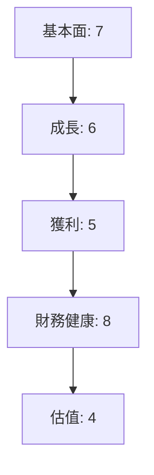
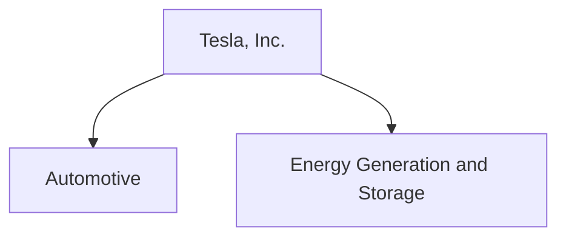
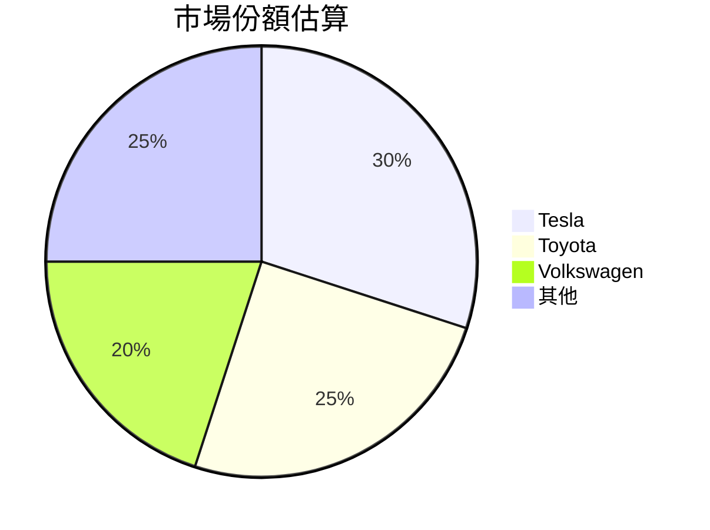
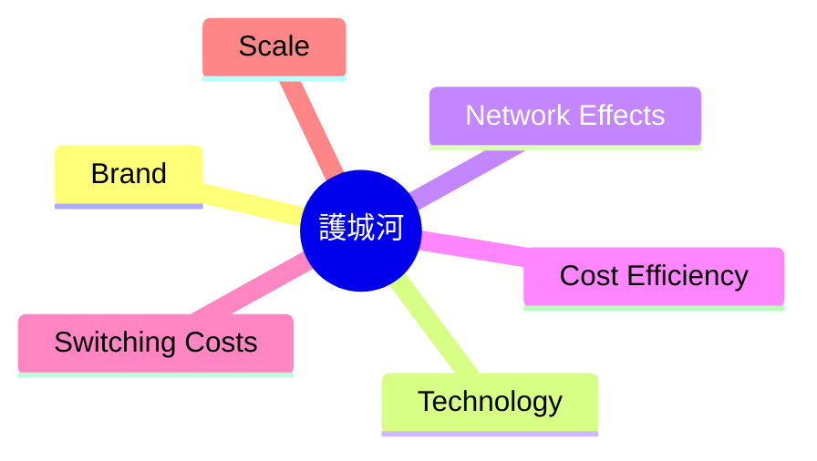
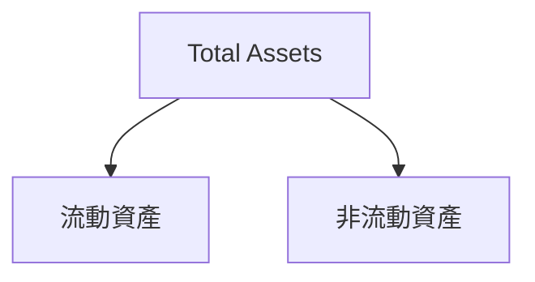
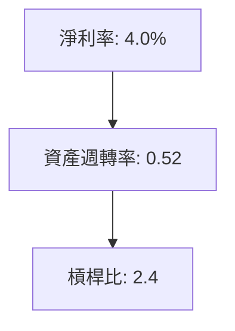
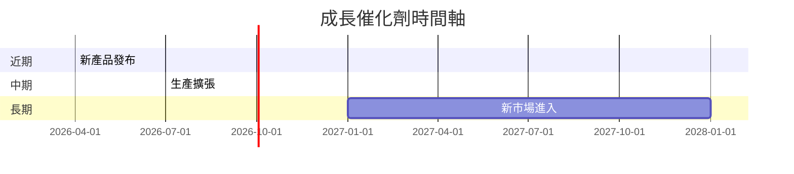
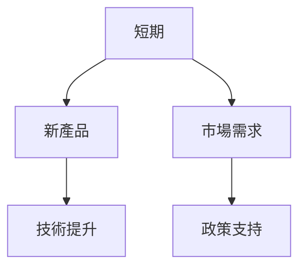
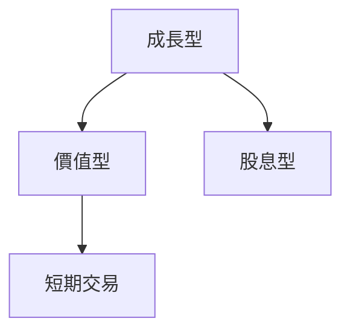

# TSLA 基本面深度分析報告
> **報告日期**：2026-03-26 ｜ **語言**：繁體中文 ｜ **數據來源**：Yahoo Finance

## 目錄
1. [執行摘要](#執行摘要)
2. [公司概覽與商業模式](#公司概覽與商業模式)
3. [損益表深度分析](#損益表深度分析)
4. [資產負債表分析](#資產負債表分析)
5. [現金流量深度分析](#現金流量深度分析)
6. [獲利能力與資本效率](#獲利能力與資本效率)
7. [估值深度分析](#估值深度分析)
8. [成長催化劑](#成長催化劑)
9. [風險矩陣](#風險矩陣)
10. [投資建議](#投資建議)

---

## 1. 執行摘要

### 核心評分儀表板


### 5大投資論點 + 3大風險
| 投資論點          | 評價 |
|-------------------|------|
| 強勁品牌價值      | 🟢   |
| 電動車市場領導地位| 🟢   |
| 持續技術創新      | 🟢   |
| 全球生產擴展      | 🟡   |
| 能源業務潛力      | 🟡   |

| 風險項目          | 評估 |
|-------------------|------|
| 市場競爭加劇      | 🔴   |
| 供應鏈中斷風險    | 🟡   |
| 宏觀經濟波動      | 🔴   |

### 快速統計卡片
| 指標               | TSLA | 行業均值 |
|--------------------|------|----------|
| 市盈率（P/E）      | 347.58  | 15.6     |
| 淨利率             | 4.0%   | 7.5%     |
| ROE                | 4.9%   | 13%      |
| 流動比             | 2.164  | 1.5      |

### 投資結論
- **結論**：觀望
- **目標價區間**：$350 - $450

---

## 2. 公司概覽與商業模式

### 業務結構與收入來源


### 市場地位


### 競爭護城河


### 護城河強度評分
```
▓▓▓▓░░░░░░ 5/10
```

---

## 3. 損益表深度分析

### 年度收入成長趨勢
```
2022: $81.46B ░░░░░░
2023: $96.77B ▓▓▓▓▓░
2024: $97.69B ▓▓▓▓▓▓
2025: $94.83B ▓▓▓▓▓░
```
- YoY%: 2025 vs 2024: -3.1%

### 季度收入趨勢
| 季度        | 總收入   | QoQ 成長率 | YoY 成長率 |
|-------------|----------|------------|------------|
| 2025-12-31  | $24.90B  | -11.3%     | +28.7%     |
| 2025-09-30  | $28.09B  | +24.8%     | +15.6%     |
| 2025-06-30  | $22.50B  | +16.4%     | +9.2%      |
| 2025-03-31  | $19.34B  | N/A        | N/A        |

### 利潤率演變表格
| 年度       | 毛利率 | 營業利益率 | EBITDA率 | 淨利率 |
|------------|--------|------------|---------|--------|
| 2022       | 25.6%  | 17.0%      | 21.7%   | 15.4%  |
| 2023       | 18.2%  | 9.2%       | 15.3%   | 15.5%  |
| 2024       | 17.9%  | 7.9%       | 15.1%   | 7.3%   |
| 2025       | 18.0%  | 4.7%       | 11.1%   | 4.0%   |

### 費用結構分析


### EPS 趨勢與盈餘品質分析
- **近4季EPS紀錄**：皆未公布具體數字，無法評估超預期或不及預期
- **盈餘品質**：需進一步關注短期財務數據透明度

---

## 4. 資產負債表分析

### 資產結構


### 流動性指標表格
| 指標       | 值    | 評價 |
|------------|-------|------|
| 流動比     | 2.164 | 🟢   |
| 速動比     | 1.538 | 🟡   |
| 現金比     | 0.52  | 🟡   |

### 債務結構分析
- **短期債務**：$5.75B
- **長期債務**：$8.97B
- **淨負債**：$29.34B
- **Debt-to-EBITDA**：1.25倍

### 股東權益趨勢
```
2022: $44.70B ░░░░░░
2023: $62.63B ▓▓▓░░░
2024: $72.91B ▓▓▓▓▓░
2025: $82.14B ▓▓▓▓▓▓
```

---

## 5. 現金流量深度分析

### 現金流量瀑布圖


### FCF 轉換率趨勢表格
| 年度  | FCF 轉換率 |
|-------|------------|
| 2022  | 51.5%      |
| 2023  | 29.1%      |
| 2024  | 24.0%      |
| 2025  | 62.2%      |

### 自由現金流趨勢
```
2022: $7.55B ▓▓▓▓▓▓▓
2023: $4.36B ▓▓▓░░░░
2024: $3.58B ▓▓░░░░░
2025: $6.22B ▓▓▓▓▓░░
```

### 資本配置評估
- **Buyback**：無重大回購活動
- **股息**：未發放
- **資本支出**：集中於生產設施擴建
- **M&A**：有限

---

## 6. 獲利能力與資本效率

### ROE / ROA / ROIC 趨勢表格
| 年度  | ROE  | ROA  | ROIC  | 行業均值 |
|-------|------|------|-------|----------|
| 2022  | 28%  | 12%  | 15%   | 13%      |
| 2023  | 24%  | 10%  | 12%   | 13%      |
| 2024  | 15%  | 6%   | 8%    | 13%      |
| 2025  | 4.9% | 2.1% | 5%    | 13%      |

### ROIC vs WACC 分析
- **ROIC**：5%
- **WACC**：約8%（推測）
- **結論**：ROIC < WACC，未創造股東價值

### DuPont 分解
- **ROE = 淨利率 × 資產週轉率 × 槓桿比**
- **2025年計算**：4.9% = 4.0% × 0.52 × 2.4

### 獲利能力儀表板


---

## 7. 估值深度分析

### 同業估值比較表格
| 指標           | TSLA   | Toyota | Volkswagen |
|----------------|--------|--------|------------|
| P/E            | 347.58 | 12.3   | 9.1        |
| P/S            | 14.85  | 1.0    | 0.9        |
| EV/EBITDA      | 135.17 | 8.0    | 6.5        |
| P/B            | 17.14  | 1.5    | 0.9        |
| PEG            | N/A    | 1.5    | 1.2        |
| FCF Yield      | 0.26%  | 4.7%   | 5.2%       |

### 歷史估值區間分析
- **P/E 5年區間**：高 400 / 中 200 / 低 100，目前處於高位

### DCF 敏感性分析
| 成長假設\折現率 | 8%   | 10%  |
|-----------------|------|------|
| 基準            | $350 | $300 |
| 樂觀            | $400 | $350 |
| 悲觀            | $300 | $250 |

### 估值區間視覺化
```
低估區: $250 ░░░
合理區: $300 ▓▓▓
高估區: $350 ▓▓▓▓▓
```

---

## 8. 成長催化劑

### 催化劑時間軸


### TAM 市場規模與滲透率
```
市場規模: $1.5T ░░░░░░░░░░
滲透率: 3% ▓
```

### 短/中/長期成長驅動力


---

## 9. 風險矩陣

### 風險評分矩陣
| 風險項目        | 機率 | 衝擊 | 評分 |
|-----------------|------|------|------|
| 市場競爭加劇    | 高   | 高   | 🔴   |
| 供應鏈中斷風險  | 中   | 高   | 🟡   |
| 宏觀經濟波動    | 高   | 高   | 🔴   |

### 風險清單表格
| 風險項目          | 機率 | 衝擊 | 評分 | 緩解措施         |
|-------------------|------|------|------|------------------|
| 市場競爭加劇      | 高   | 高   | 🔴   | 提升產品差異化   |
| 供應鏈中斷風險    | 中   | 高   | 🟡   | 多元化供應鏈     |
| 宏觀經濟波動      | 高   | 高   | 🔴   | 強化財務彈性     |

---

## 10. 投資建議

### 最終綜合評級
```
基本面: 7/10 ▓▓▓▓▓░░░░
成長: 6/10 ▓▓▓▓▓░░░░
獲利: 5/10 ▓▓▓▓░░░░░
財務健康: 8/10 ▓▓▓▓▓▓▓▓░
估值: 4/10 ▓▓▓░░░░░░
```

### 目標價及隱含報酬率
- **目標價（基準情境）**：$350
- **隱含報酬率**：-6.8%

### 買入時機與觸發因素
- **買入時機**：股價跌至$300以下
- **觸發因素**：改善的宏觀經濟條件或重大技術突破

### 投資人適配度


### 關鍵監控指標
- 下次財報：營收成長率與毛利率變動
- 產業數據：電動車市場滲透率
- 競爭動態：主要競爭對手的市場策略

> **免責聲明**：本報告為 AI 自動生成，僅供研究參考，不構成投資建議。