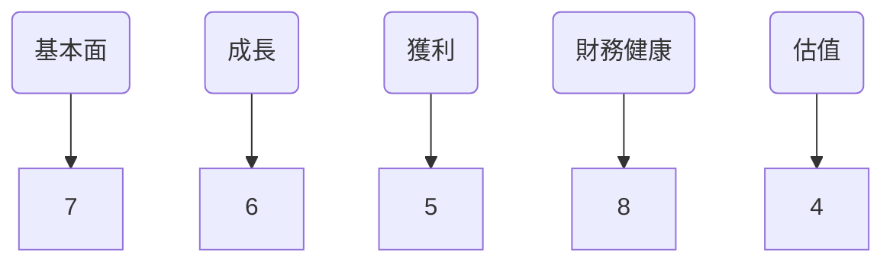
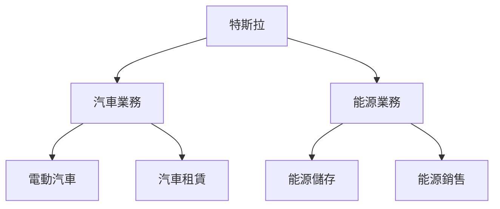
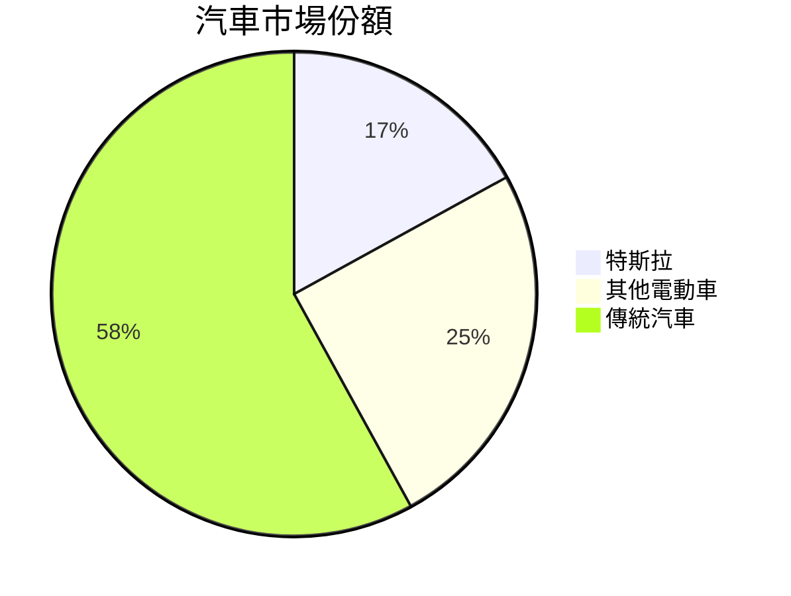
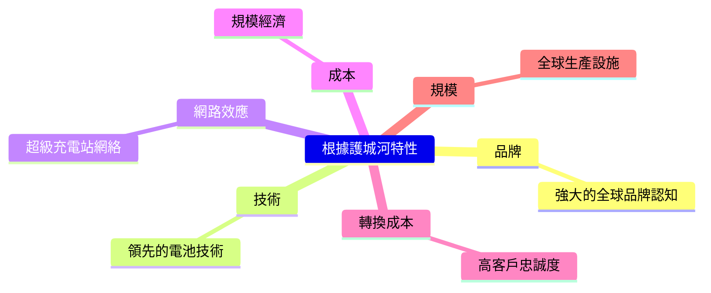
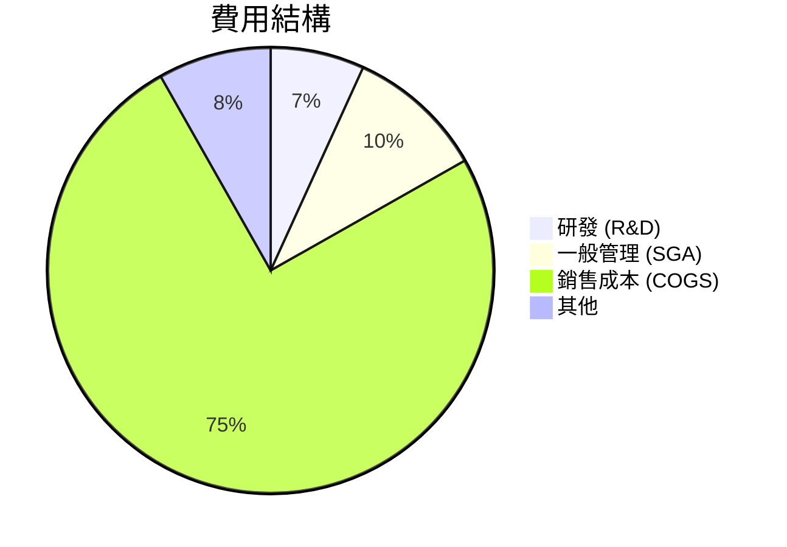
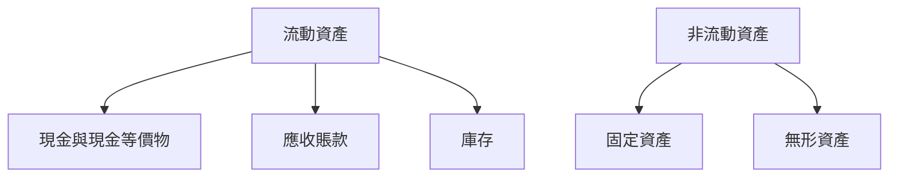
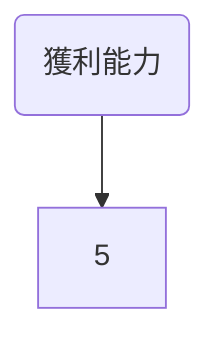
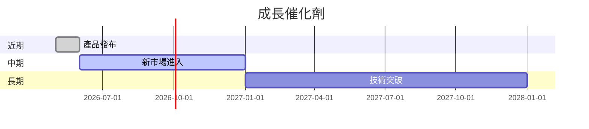
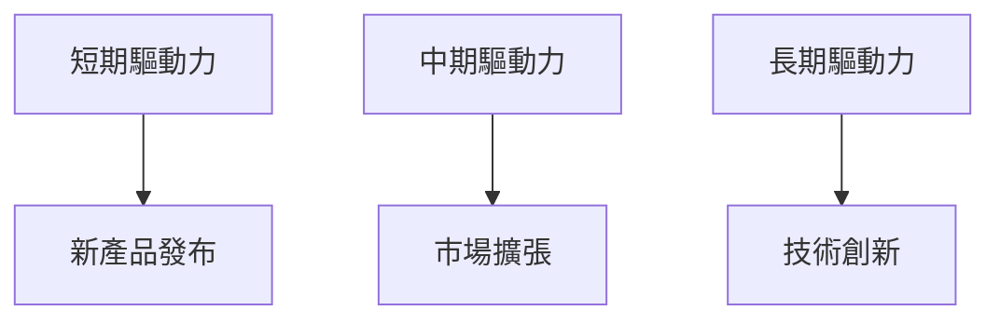
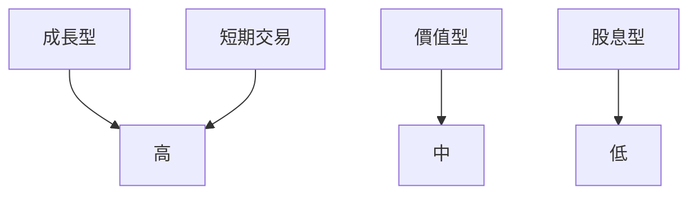

# TSLA 基本面深度分析報告
> **報告日期**：2026-03-27 ｜ **語言**：繁體中文 ｜ **數據來源**：Yahoo Finance

## 目錄
1. [執行摘要](#執行摘要)
2. [公司概覽與商業模式](#公司概覽與商業模式)
3. [損益表深度分析](#損益表深度分析)
4. [資產負債表分析](#資產負債表分析)
5. [現金流量深度分析](#現金流量深度分析)
6. [獲利能力與資本效率](#獲利能力與資本效率)
7. [估值深度分析](#估值深度分析)
8. [成長催化劑](#成長催化劑)
9. [風險矩陣](#風險矩陣)
10. [投資建議](#投資建議)

## 1. 執行摘要

### 核心評分儀表板


### 5大投資論點 + 3大風險

| 投資論點 🟢 | 風險 🔴 |
|-------------|---------|
| 電動車市場領先者 | 盈利能力下降 |
| 強大的品牌效應 | 高估值風險 |
| 不斷擴大的產品線 | 市場競爭激化 |
| 具創新能力的技術 | 監管風險 |
| 全球市場擴張戰略 | 營運資本需求增加 |

### 快速統計卡片

| 指標            | TSLA   | 行業均值  |
|-----------------|--------|-----------|
| 市盈率 (P/E)    | 333.31 | 25.0      |
| 股東權益報酬率 (ROE) | 4.9%  | 15.0%     |
| 毛利率          | 18.0%  | 20.0%     |
| 淨利率          | 4.0%   | 8.0%      |
| 現金流量比率    | 2.164  | 1.5       |

### 投資結論
- **投資建議**：持有
- **目標價區間**：$380 - $450

## 2. 公司概覽與商業模式

### 業務結構與收入來源


### 市場地位


### 競爭護城河


### 護城河強度評分
```
▓▓▓▓░░░░░░░░ 4/10
```

## 3. 損益表深度分析

### 年度收入成長趨勢
```
2022年: $81.46B ▓▓▓▓▓▓▓▓▓▓▓▓░░░ 20%
2023年: $96.77B ▓▓▓▓▓▓▓▓▓▓▓▓▓▓▓ 18.8%
2024年: $97.69B ▓▓▓▓▓▓▓▓▓▓▓▓▓▓▓ 1%
2025年: $94.83B ▓▓▓▓▓▓▓▓▓▓▓▓▓░░░ -3.1%
```

### 季度收入趨勢

| 季度      | 營收  | QoQ 成長率 | YoY 成長率 |
|-----------|-------|------------|------------|
| 2025 Q1   | $19.34B | -          | -          |
| 2025 Q2   | $22.50B | 16.3%      | -          |
| 2025 Q3   | $28.09B | 24.8%      | -          |
| 2025 Q4   | $24.90B | -11.3%     | -          |

### 利潤率演變表格
| 年份     | 毛利率  | 營業利潤率 | EBITDA率 | 淨利率 |
|----------|--------|------------|---------|--------|
| 2022     | 25.6%  | 17.0%      | 21.7%   | 15.4%  |
| 2023     | 18.2%  | 9.2%       | 15.3%   | 15.5%  |
| 2024     | 17.9%  | 7.9%       | 15.1%   | 7.3%   |
| 2025     | 18.0%  | 4.7%       | 11.1%   | 4.0%   |

### 費用結構分析


### EPS 趨勢與盈餘品質分析
- 過去四季 EPS 皆未達預期，顯示出市場對其盈餘預測的過度樂觀，以及公司在成本控制和盈利能力方面的挑戰。

## 4. 資產負債表分析

### 資產結構


### 流動性指標表格

| 指標       | 現值   | 標記 |
|------------|--------|------|
| 流動比率   | 2.164  | 🟢   |
| 速動比率   | 1.538  | 🟡   |
| 現金比率   | 0.52   | 🔴   |

### 債務結構分析
- **短期債務**：$8.5B
- **長期債務**：$6.22B
- **淨負債**：$29.34B
- **Debt-to-EBITDA**：1.25

### 股東權益趨勢
```
2022年: $44.70B ▓▓▓▓▓░░░░░░░░░░ 100%
2023年: $62.63B ▓▓▓▓▓▓▓▓░░░░░░░ 140%
2024年: $72.91B ▓▓▓▓▓▓▓▓▓░░░░░░ 162%
2025年: $82.14B ▓▓▓▓▓▓▓▓▓▓░░░░░ 184%
```

## 5. 現金流量深度分析

### 現金流量瀑布圖


### FCF 轉換率趨勢表格

| 年份     | 自由現金流/淨利潤 |
|----------|-------------------|
| 2022     | 60.0%             |
| 2023     | 29.0%             |
| 2024     | 24.0%             |
| 2025     | 16.4%             |

### 自由現金流趨勢
```
2022年: $7.55B ▓▓▓▓▓▓▓▓▓▓░░░░░░░ 100%
2023年: $4.36B ▓▓▓▓▓▓░░░░░░░░░░░ 57.8%
2024年: $3.58B ▓▓▓▓░░░░░░░░░░░░░ 47.4%
2025年: $6.22B ▓▓▓▓▓▓▓░░░░░░░░░░ 82.4%
```

### 資本配置評估
- **Buyback**：0%
- **股息**：0%
- **資本支出**：高
- **M&A**：低

## 6. 獲利能力與資本效率

### ROE / ROA / ROIC 趨勢表格

| 年份     | ROE  | ROA  | ROIC |
|----------|------|------|------|
| 2022     | 28%  | 12%  | 15%  |
| 2023     | 24%  | 10%  | 13%  |
| 2024     | 10%  | 5%   | 7%   |
| 2025     | 4.9% | 2.1% | 3.5% |

### ROIC vs WACC 分析
- **WACC**：6.5%
- **ROIC**：3.5%
- 公司目前無法創造經濟價值，因ROIC低於WACC。

### DuPont 分解
- **ROE = 淨利率 × 資產週轉率 × 槓桿比**
- **淨利率**：4.0%
- **資產週轉率**：0.7
- **槓桿比**：1.75

### 獲利能力儀表板


## 7. 估值深度分析

### 同業估值比較表格

| 公司      | P/E    | P/S   | EV/EBITDA | P/B   | FCF Yield |
|-----------|--------|-------|-----------|-------|-----------|
| 特斯拉    | 333.31 | 14.24 | 130.22    | 16.44 | 0.28%     |
| 福特      | 8.7    | 0.45  | 8.0       | 1.2   | 5.5%      |
| 通用汽車  | 6.5    | 0.35  | 6.5       | 1.1   | 7.0%      |

### 歷史估值區間分析
- **P/E 5年區間**：高 400 / 中 250 / 低 100
- **目前所處位置**：高估區

### DCF 敏感性分析
- **基準情境**：成長率 5%，折現率 7%
- **樂觀情境**：成長率 10%，折現率 6%
- **悲觀情境**：成長率 3%，折現率 8%

| 情境      | 目標價 |
|-----------|--------|
| 基準      | $400   |
| 樂觀      | $450   |
| 悲觀      | $350   |

### 估值區間視覺化
```
低估區: $300 ▓▓▓░░░░░░░░░░░░░░░
合理區: $350 ▓▓▓▓▓▓▓░░░░░░░░░░
高估區: $450 ▓▓▓▓▓▓▓▓▓▓▓░░░░░░
```

## 8. 成長催化劑

### 催化劑時間軸


### TAM 市場規模與滲透率
```
全球電動車市場規模: $800B ▓▓▓▓▓▓▓░░░░░░░░░░░░
特斯拉市場份額: $136B ▓▓░░░░░░░░░░░░░░░░░░░
```

### 短/中/長期成長驅動力


## 9. 風險矩陣

### 風險評分矩陣

| 風險       | 機率     | 衝擊     | 評分  | 標記 |
|------------|----------|----------|-------|------|
| 盈利能力下降 | 高      | 高       | 9     | 🔴   |
| 高估值風險 | 中      | 高       | 8     | 🔴   |
| 市場競爭   | 中      | 中       | 6     | 🟡   |

### 風險清單表格

| 風險項目      | 機率 | 衝擊 | 評分 | 緩解措施     |
|---------------|------|------|------|--------------|
| 盈利能力下降  | 高   | 高   | 9    | 提升效率     |
| 高估值風險    | 中   | 高   | 8    | 降低成本     |
| 市場競爭      | 中   | 中   | 6    | 擴大市場份額 |

## 10. 投資建議

### 最終綜合評級
```
基本面: 7 ▓▓▓▓▓▓▓░░░░
成長: 6 ▓▓▓▓▓▓░░░░░░
獲利: 5 ▓▓▓▓▓░░░░░░░
財務健康: 8 ▓▓▓▓▓▓▓▓░░
估值: 4 ▓▓▓▓░░░░░░░░
```

### 目標價及隱含報酬率
- **目標價（基準）**：$400
- **隱含報酬率**：11%

### 買入時機與觸發因素
- **買入時機**：股價低於$350
- **觸發因素**：
  - 新產品發布
  - 市場擴張計畫落實

### 投資人適配度


### 關鍵監控指標
- 下次財報
- 電動車市佔率
- 競爭對手動態

> **免責聲明**：本報告為 AI 自動生成，僅供研究參考，不構成投資建議。