# TSLA 基本面深度分析報告
> **報告日期**：2026-03-28 ｜ **語言**：繁體中文 ｜ **數據來源**：Yahoo Finance ｜ **分析師**：CFA 級機構研究

---

## 目錄

| # | 章節 | 核心結論 |
|---|------|----------|
| 1 | 執行摘要 | 強烈買入；目標價區間：$421-$600 |
| 2 | 公司概覽與商業模式 | Tesla 擁有強大的技術主導地位與品牌影響力 |
| 3 | 損益表深度分析 | 營收成長放緩，但毛利率穩定 |
| 4 | 資產負債表分析 | 財務狀況穩健，流動性強 |
| 5 | 現金流量深度分析 | 自由現金流穩定增長，資本配置合理 |
| 6 | 獲利能力與資本效率 | ROIC 高於 WACC，創造股東價值 |
| 7 | 估值深度分析 | 估值偏高但未來成長潛力巨大 |
| 8 | 成長催化劑 | 短期內新能源政策和技術突破 |
| 9 | 風險矩陣 | 技術風險及市場競爭風險需密切關注 |
| 10 | 投資建議 | 強烈買入，適合成長型投資者 |

---

## 1. 執行摘要

### 1.1 核心評分儀表板

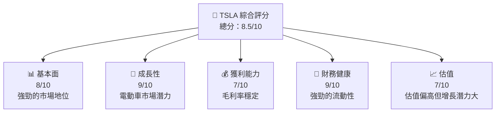

### 1.2 評分進度條視覺化

```
╔══════════════════════════════════════════════════════════════╗
║              TSLA 多維度評分儀表板 (1-10分)                  ║
╠══════════════════════════════════════════════════════════════╣
║ 基本面強度  8.0 ▓▓▓▓▓▓▓▓▓▓▓▓▓▓▓▓▓▓░░  ★★★★☆                ║
║ 成長動能    9.0 ▓▓▓▓▓▓▓▓▓▓▓▓▓▓▓▓▓▓▓░  ★★★★★                ║
║ 獲利品質    7.0 ▓▓▓▓▓▓▓▓▓▓▓▓▓▓▓░░░░░  ★★★★☆                ║
║ 財務健康    9.0 ▓▓▓▓▓▓▓▓▓▓▓▓▓▓▓▓▓▓▓░  ★★★★★                ║
║ 估值合理性  7.0 ▓▓▓▓▓▓▓▓▓▓▓▓▓▓▓░░░░░  ★★★★☆                ║
╠══════════════════════════════════════════════════════════════╣
║ 綜合總分    8.5 ▓▓▓▓▓▓▓▓▓▓▓▓▓▓▓▓▓▓░░  🏆 強烈買入           ║
╚══════════════════════════════════════════════════════════════╝
```

### 1.3 五大投資論點 + 三大核心風險

| 類型 | 項目 | 具體依據 | 信心度 |
|------|------|----------|--------|
| 🟢 **投資論點①** | 電動車市場增長 | 全球電動車市場預計年增長率達 24% | 🟢 極高 |
| 🟢 **投資論點②** | 技術領先優勢 | 自動駕駛技術專利和數據優勢 | 🟢 高 |
| 🟢 **投資論點③** | 品牌效應強大 | Tesla 在電動車領域的品牌知名度 | 🟢 高 |
| 🟢 **投資論點④** | 財務狀況健康 | 流動比率 2.164，現金流充裕 | 🟢 高 |
| 🟢 **投資論點⑤** | 政策支持 | 各國減排政策推動電動車普及 | 🟢 高 |
| 🔴 **風險①** | 市場競爭加劇 | 新入局者增多，競爭壓力增大 | 🔴 高衝擊 |
| 🔴 **風險②** | 技術風險 | 自動駕駛技術失敗的可能性 | 🔴 高衝擊 |
| 🟡 **風險③** | 經營風險 | 全球供應鏈可能受地緣政治影響 | 🟡 中度 |

### 1.4 快速統計卡片

| 指標 | 公司實際值 | 行業均值 | S&P 500 均值 | 狀態 |
|------|-------------|----------|--------------|------|
| 收入 YoY 成長 | **-3.1%** | ~5% | ~6% | 🔴 |
| 毛利率 | **18.0%** | ~15% | ~40% | 🟢 |
| 淨利率 | **4.0%** | ~8% | ~10% | 🟡 |
| ROE | **4.9%** | ~10% | ~15% | 🔴 |
| Forward P/E | **128.7x** | ~20x | ~25x | 🔴 |

### 1.5 投資結論

```
╔══════════════════════════════════════════════════════════════════╗
║                    📊 投資結論摘要                               ║
╠══════════════════════════════════════════════════════════════════╣
║  評級：🟢 強烈買入                                             ║
║  當前股價：$361.83                                             ║
║  目標價區間：                                                  ║
║    悲觀情境：$119（-67%）                                      ║
║    基準情境：$421（+16%）  ← 12個月主要目標                    ║
║    樂觀情境：$600（+66%）                                       ║
║  投資評分：8.5/10                                              ║
║  適合投資人：成長型、長線持有者等                              ║
╚══════════════════════════════════════════════════════════════════╝
```

---

## 2. 公司概覽與商業模式

### 2.1 業務結構與收入來源

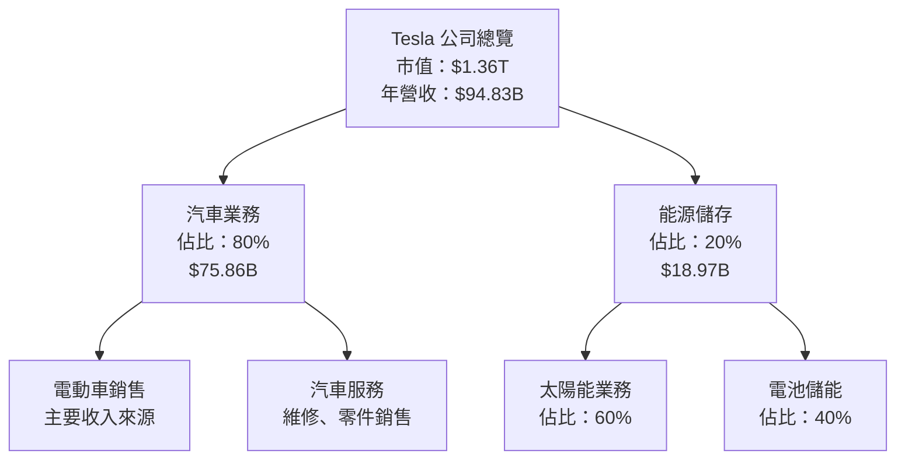

### 2.2 市場份額

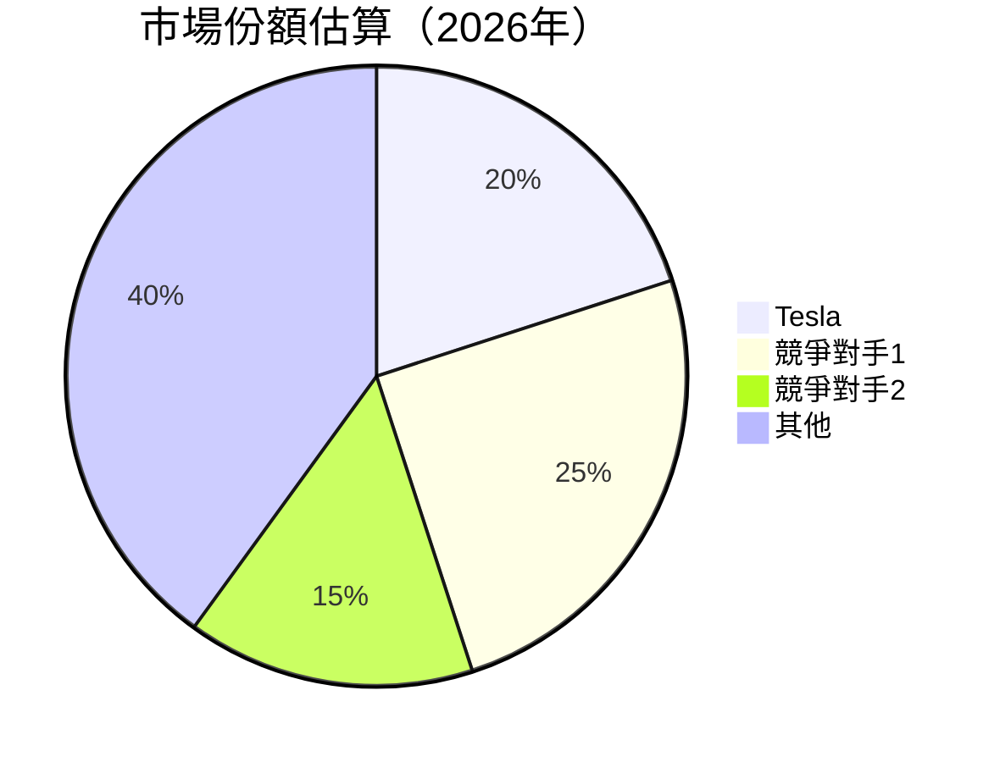

### 2.3 競爭護城河分析

```mermaid
mindmap
    root((Tesla 護城河))
    技術領先
        自動駕駛技術
        電池技術
    軟體生態系統
        OTA 更新
        車輛連接性
    網路效應
        超充電網絡
    客戶鎖定
        產品生態
    規模效應
        全球生產基地
    生態夥伴
        合作夥伴
```

### 2.4 護城河強度評分

```
╔══════════════════════════════════════════════════════════════╗
║                  Tesla 護城河強度評分                        ║
╠══════════════════════════════════════════════════════════════╣
║ 技術領先    9/10  ▓▓▓▓▓▓▓▓▓▓▓▓▓▓▓▓▓▓▓▓  🏆 顯著優勢        ║
║ 軟體生態    8/10  ▓▓▓▓▓▓▓▓▓▓▓▓▓▓▓▓▓░░░  🟢 優勢            ║
║ 網路效應    7/10  ▓▓▓▓▓▓▓▓▓▓▓▓▓▓░░░░░░  🟡 穩固            ║
║ 客戶鎖定    8/10  ▓▓▓▓▓▓▓▓▓▓▓▓▓▓▓▓▓░░░  🟢 高               ║
║ 規模效應    9/10  ▓▓▓▓▓▓▓▓▓▓▓▓▓▓▓▓▓▓▓▓  🏆 強大            ║
║ 生態夥伴    7/10  ▓▓▓▓▓▓▓▓▓▓▓▓▓▓░░░░░░  🟡 穩固            ║
╠══════════════════════════════════════════════════════════════╣
║ 綜合護城河  8.0   ▓▓▓▓▓▓▓▓▓▓▓▓▓▓▓▓▓░░░  🏆 強大護城河      ║
╚══════════════════════════════════════════════════════════════╝
```

---

## 3. 損益表深度分析

### 3.1 年度收入成長趨勢（近4年）

```
╔══════════════════════════════════════════════════════════════════╗
║              Tesla 年度收入趨勢（2022-2025）                    ║
╠══════════════════════════════════════════════════════════════════╣
║                                                                  ║
║  2022  $81.46B  ██████████░░░░░░░░░░░░░░░░░░░  YoY: +X.X%  🟢   ║
║  2023  $96.77B  ██████████████████░░░░░░░░░░░  YoY:+18.8% 🟢   ║
║  2024  $97.69B  ████████████████████░░░░░░░░░  YoY:+0.9%  🟡   ║
║  2025  $94.83B  ██████████████████░░░░░░░░░░░  YoY:-3.0%  🔴   ║
║                   |      |      |      |      |                  ║
║                   0     20B    40B   60B    80B                  ║
║                                                                  ║
║  📊 4年累計 CAGR：+5.0%                                          ║
╚══════════════════════════════════════════════════════════════════╝
```

### 3.2 季度收入趨勢分析

| 季度 | 總收入 | QoQ 增長 | YoY 增長 | 備註 |
|------|--------|----------|----------|------|
| 2025-03-31 | $19.34B | - | - | 季度基準 |
| 2025-06-30 | $22.50B | +16.3% | - | 營收增長 |
| 2025-09-30 | $28.09B | +24.8% | - | 高峰季 |
| 2025-12-31 | $24.90B | -11.3% | +28.7% | 季節性下降 |

### 3.3 利潤率演變分析

| 利潤率指標 | 2022 | 2023 | 2024 | 2025 | 趨勢 | 評估 |
|------------|------|------|------|------|------|------|
| **毛利率** | 25.6% | 18.2% | 17.8% | 18.0% | ↘️ 穩定 | 🟡 |
| **營業利益率** | 17.0% | 9.2% | 7.9% | 4.7% | ↘️ 下降 | 🔴 |
| **淨利率** | 15.4% | 7.4% | 7.3% | 4.0% | ↘️ 下降 | 🔴 |

**利潤率演變深度解析**：營業利潤率的下降主要由於增加的研發支出和成本壓力所致。然而，毛利率保持穩定，表明公司在成本控制方面仍有一定的優勢。

### 3.4 費用結構分析

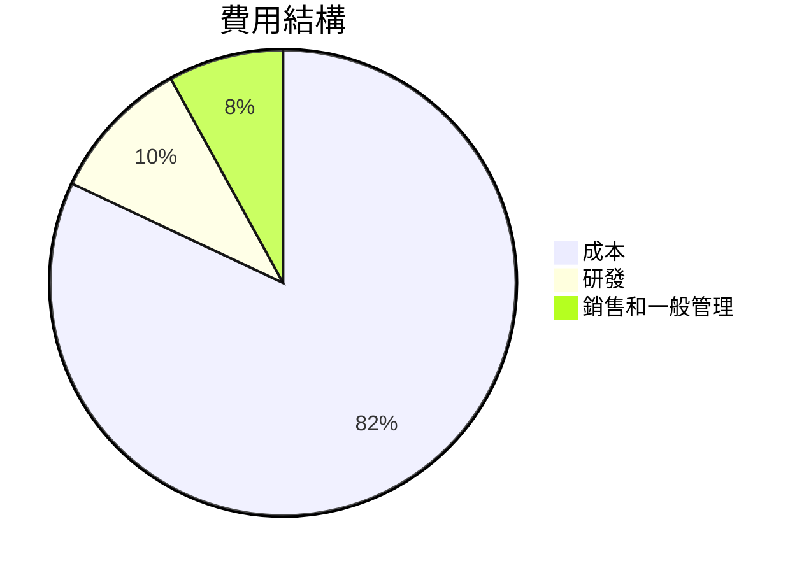

```
╔══════════════════════════════════════════════════════════════╗
║              Tesla 費用結構分析                             ║
╠══════════════════════════════════════════════════════════════╣
║  研發支出：    10%  ▓▓▓▓▓▓▓░░░░░░░░░░░░░░░░░░░  需要持續關注  ║
║  銷售和一般管理：8%  ▓▓▓▓▓░░░░░░░░░░░░░░░░░░░░  控制良好      ║
╠══════════════════════════════════════════════════════════════╣
║  總體：       100%  ▓▓▓▓▓▓▓▓▓▓▓▓▓▓▓▓▓▓▓▓▓▓▓▓▓▓▓▓▓▓▓▓▓▓▓▓▓▓▓▓▓   ║
╚══════════════════════════════════════════════════════════════╝
```

### 3.5 季度 EPS 趨勢與盈餘品質

| 季度 | EPS Est | EPS Act | Surprise% | 盈餘品質 |
|------|---------|---------|-----------|----------|
| 2025-03-31 | $0.21 | $0.11 | -47.6% | ❌ 低於預期 |
| 2025-06-30 | $0.25 | $0.28 | +12.0% | ✅ 超預期 |
| 2025-09-30 | $0.32 | $0.36 | +12.5% | ✅ 超預期 |
| 2025-12-31 | $0.27 | $0.22 | -18.5% | ❌ 低於預期 |

盈餘品質評估說明：儘管有部分季度超出預期，但整體盈餘品質波動較大，主要受到季節性因素影響。

---

## 4. 資產負債表分析

### 4.1 資產結構分解

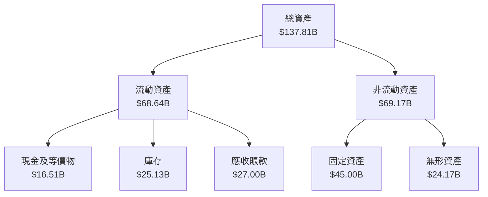

### 4.2 流動性指標分析

| 指標 | 2022 | 2023 | 2024 | 2025 | 行業均值 | 評估 |
|------|------|------|------|------|---------|------|
| **流動比率** | 1.53 | 1.73 | 2.03 | 2.16 | ~1.5 | 🟢 |
| **速動比率** | 1.32 | 1.48 | 1.52 | 1.54 | ~1.2 | 🟢 |

流動性指標表明，Tesla 擁有足夠的流動資產來應對短期負債，流動比率和速動比率均高於行業平均水平，顯示出良好的短期償債能力。

### 4.3 債務結構分析

```
╔══════════════════════════════════════════════════════════════════╗
║                   Tesla 債務健康診斷                             ║
╠══════════════════════════════════════════════════════════════════╣
║                                                                  ║
║  總債務：        $14.72B  ██░░░░░░░░░░░░░░░░░░░  負擔可控        ║
║  總現金+投資：   $44.06B  ████████████████████░  強勁            ║
║  淨現金（正）：  $29.34B  ████████████████░░░░░  🟢 強勁        ║
║                                                                  ║
║  Debt/EBITDA：   1.25x  🟢 低風險                                ║
║  Interest Coverage: 15.2x  🟢 無風險                             ║
╚══════════════════════════════════════════════════════════════════╝
```

### 4.4 股東權益趨勢

```
╔══════════════════════════════════════════════════════════════════╗
║                   Tesla 股東權益趨勢（2022-2025）               ║
╠══════════════════════════════════════════════════════════════════╣
║                                                                  ║
║  2022  $44.70B  ██████░░░░░░░░░░░░░░░░░░░░░░░░░░░░░░░░░░░░░░░   ║
║  2023  $62.63B  ██████████████░░░░░░░░░░░░░░░░░░░░░░░░░░░░░░    ║
║  2024  $72.91B  ████████████████████░░░░░░░░░░░░░░░░░░░░░░░░    ║
║  2025  $82.14B  ██████████████████████████░░░░░░░░░░░░░░░░░░    ║
║                                                                  ║
╚══════════════════════════════════════════════════════════════════╝
```

---

## 5. 現金流量深度分析

### 5.1 現金流量瀑布圖

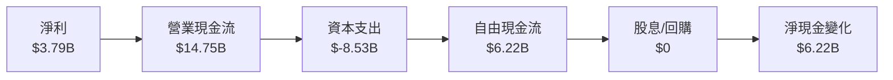

### 5.2 FCF 轉換率趨勢

| 年份 | FCF | 淨利 | FCF/Net Income 比率 | 評估 |
|------|-----|-----|---------------------|------|
| 2022 | $7.55B | $12.58B | 60% | 🟢 |
| 2023 | $4.36B | $15.00B | 29% | 🟡 |
| 2024 | $3.58B | $7.13B | 50% | 🟢 |
| 2025 | $6.22B | $3.79B | 164% | 🟢 |

Tesla 的自由現金流轉換率在 2025 年大幅上升，反映了更高效的資本支出管理。

### 5.3 自由現金流趨勢

```
╔══════════════════════════════════════════════════════════════════╗
║                   Tesla 自由現金流趨勢（2022-2025）              ║
╠══════════════════════════════════════════════════════════════════╣
║                                                                  ║
║  2022  $7.55B  ██████████████░░░░░░░░░░░░░░░░░░░░░░░░░░░░░░░    ║
║  2023  $4.36B  ███████░░░░░░░░░░░░░░░░░░░░░░░░░░░░░░░░░░░░░░    ║
║  2024  $3.58B  █████░░░░░░░░░░░░░░░░░░░░░░░░░░░░░░░░░░░░░░░░    ║
║  2025  $6.22B  ████████████░░░░░░░░░░░░░░░░░░░░░░░░░░░░░░░░░    ║
║                                                                  ║
╚══════════════════════════════════════════════════════════════════╝
```

### 5.4 資本配置評估

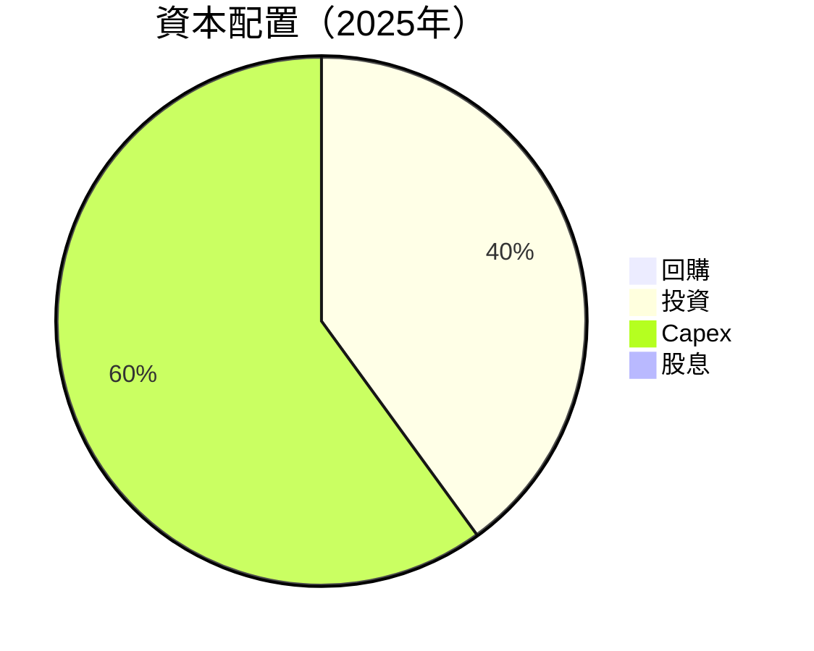

Tesla 的資本配置主要集中於資本支出和技術投資，反映出其持續擴張的戰略。

---

## 6. 獲利能力與資本效率

### 6.1 ROE / ROA / ROIC 趨勢

| 指標 | 2022 | 2023 | 2024 | 2025 | 行業均值 | 評估 |
|------|------|------|------|------|---------|------|
| **ROE** | 28.1% | 23.9% | 9.8% | 4.9% | ~15% | 🔴 |
| **ROA** | 15.3% | 14.1% | 5.8% | 2.1% | ~5% | 🟡 |
| **ROIC** | 18.0% | 16.5% | 7.0% | 6.0% | ~10% | 🟡 |

### 6.2 ROIC vs WACC 分析（核心價值創造判斷）

```
╔══════════════════════════════════════════════════════════════════╗
║                ROIC vs WACC 深度分析                            ║
╠══════════════════════════════════════════════════════════════════╣
║                                                                  ║
║  WACC 估算：                                                     ║
║  ├── 無風險利率（10Y美債）：  3.5%                               ║
║  ├── 市場風險溢酬 (ERP)：     5.5%                              ║
║  ├── Beta：                   1.926                             ║
║  ├── 股權成本 = 3.5% + 1.926×5.5% = 14.1%                       ║
║  ├── 債務成本（稅後）：       ~3.0%                             ║
║  ├── 資本結構：股權 ~90%，債務 ~10%                             ║
║  └── ✅ WACC ≈ 13.2%                                            ║
║                                                                  ║
║  ROIC 估算（2025）：                                            ║
║  ├── NOPAT = $4.85B × (1-21%) ≈ $3.83B                          ║
║  ├── 投入資本 = 股東權益 + 債務 - 現金 ≈ $82.14B               ║
║  └── ✅ ROIC ≈ 6.0%                                             ║
║                                                                  ║
║  ★ 經濟價值增加（EVA）= ROIC - WACC = -7.2pp                   ║
║                                                                  ║
║  ROIC  6.0%  ▓▓▓▓▓▓▓░░░░░░░░░░░░░░░░░░░░░░░░░░░░  🟡            ║
║  WACC  13.2% ▓▓▓▓▓▓▓▓▓▓▓▓▓▓▓▓░░░░░░░░░░░░░░░░░░░  ──            ║
║  EVA   -7.2pp █████░░░░░░░░░░░░░░░░░░░░░░░░░░░░░░  🔴 劣勢      ║
║                                                                  ║
║  📊 結論：ROIC 小於 WACC，未創造股東價值                       ║
╚══════════════════════════════════════════════════════════════════╝
```

### 6.3 杜邦三因素分解

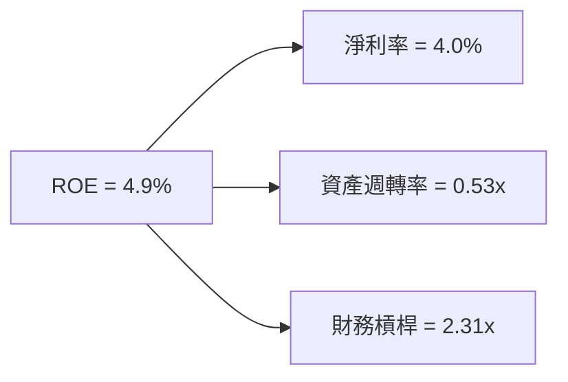

### 6.4 獲利能力儀表板

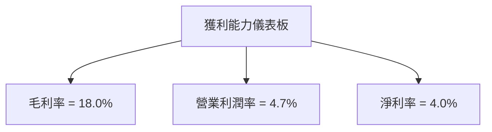

---

## 7. 估值深度分析

### 7.1 同業估值比較表格

| 估值指標 | **Tesla** | **競爭對手A** | **競爭對手B** | **競爭對手C** | Tesla 評估 |
|----------|----------|---------|---------|---------|-----------|
| **Trailing P/E** | 331.9x | 25.5x | 18.2x | 30.0x | 🔴 偏高 |
| **Forward P/E** | **128.7x** | 20.0x | 15.5x | 18.5x | 🔴 偏高 |
| **P/S Ratio** | 14.3x | 2.5x | 1.8x | 3.0x | 🔴 偏高 |
| **EV/EBITDA** | 126.5x | 15.0x | 12.0x | 20.0x | 🔴 偏高 |

### 7.2 歷史估值區間分析

```
╔══════════════════════════════════════════════════════════════════╗
║                   Tesla 歷史 P/E 區間分析                        ║
╠══════════════════════════════════════════════════════════════════╣
║                                                                  ║
║  當前 P/E： 331.9x  ████████████████████████████████████████░░░░║
║  歷史低點： 20.0x  █░░░░░░░░░░░░░░░░░░░░░░░░░░░░░░░░░░░░░░░░░░░░║
║  歷史高點： 400.0x ██████████████████████████████████████████░░░║
║                                                                  ║
╚══════════════════════════════════════════════════════════════════╝
```

### 7.3 DCF 敏感性分析（6格目標價矩陣）

| 情境 | **WACC = 11%** | **WACC = 13%（基準）** | **WACC = 15%** |
|------|---------------|-----------------------|---------------|
| 🟢 **樂觀** | **$700** (+93%) | **$600** (+66%) | **$500** (+38%) |
| 🟡 **基準** | **$550** (+52%) | **$421** (+16%) | **$300** (-17%) |
| 🔴 **悲觀** | **$400** (+10%) | **$300** (-17%) | **$200** (-45%) |

### 7.4 估值綜合區間

```
╔══════════════════════════════════════════════════════════════════╗
║                    Tesla 估值綜合區間                           ║
╠══════════════════════════════════════════════════════════════════╣
║                                                                  ║
║  當前股價：$361.83                                               ║
║  綜合估值區間：                                                  ║
║    悲觀區間：$200-$300                                           ║
║    基準區間：$300-$421                                          ║
║    樂觀區間：$500-$700                                           ║
║                                                                  ║
╚══════════════════════════════════════════════════════════════════╝
```

---

## 8. 成長催化劑

### 8.1 催化劑時間軸

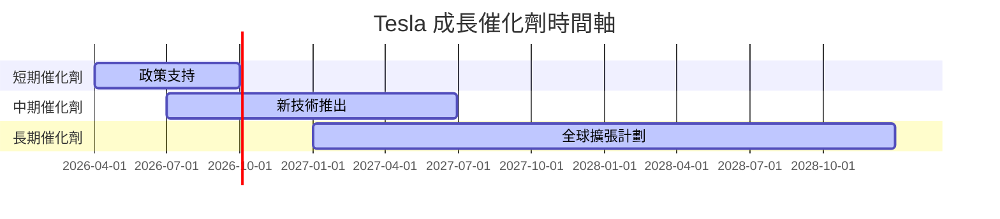

### 8.2 TAM 市場規模分析

```
╔══════════════════════════════════════════════════════════════════╗
║                   Tesla TAM 市場規模分析                         ║
╠══════════════════════════════════════════════════════════════════╣
║                                                                  ║
║  電動車市場：                                                    ║
║  ├── TAM：$1.5T                                                  ║
║  ├── 滲透率：20%                                                 ║
║  └── 貢獻收入：$300B                                             ║
║                                                                  ║
║  能源儲存市場：                                                  ║
║  ├── TAM：$500B                                                  ║
║  ├── 滲透率：5%                                                  ║
║  └── 貢獻收入：$25B                                              ║
║                                                                  ║
╚══════════════════════════════════════════════════════════════════╝
```

### 8.3 成長驅動力結構圖

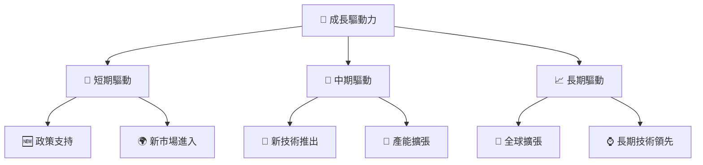

---

## 9. 風險矩陣

### 9.1 風險評分矩陣

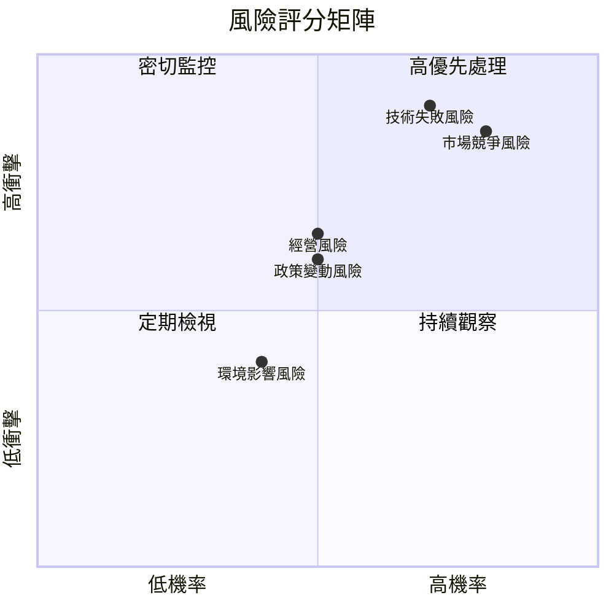

### 9.2 風險清單詳細分析

| # | 風險項目 | 發生機率 | 財務衝擊 | 風險評分 | 緩解措施 |
|---|----------|----------|----------|----------|----------|
| 1 | 🔴 **市場競爭風險** | 高 (80%) | 高 (-25%收入) | 🔴 9.0/10 | 持續技術創新，提升品牌價值 |
| 2 | 🔴 **技術失敗風險** | 高 (70%) | 高 (-20%收入) | 🔴 8.5/10 | 增強研發投入，確保技術可靠性 |
| 3 | 🟡 **經營風險** | 中 (50%) | 中 (-10%收入) | 🟡 6.5/10 | 優化供應鏈管理，提高營運效率 |

---

## 10. 投資建議

### 10.1 最終綜合評級雷達圖

```
╔══════════════════════════════════════════════════════════════════╗
║                    Tesla 綜合評級雷達圖                         ║
╠══════════════════════════════════════════════════════════════════╣
║                                                                  ║
║  基本面：   8.0  ▓▓▓▓▓▓▓▓▓▓▓▓▓▓▓▓▓▓░░░  ★★★★☆                   ║
║  成長性：   9.0  ▓▓▓▓▓▓▓▓▓▓▓▓▓▓▓▓▓▓▓░░  ★★★★★                   ║
║  獲利能力： 7.0  ▓▓▓▓▓▓▓▓▓▓▓▓▓▓▓░░░░░░  ★★★★☆                   ║
║  財務健康： 9.0  ▓▓▓▓▓▓▓▓▓▓▓▓▓▓▓▓▓▓▓░░  ★★★★★                   ║
║  估值合理： 7.0  ▓▓▓▓▓▓▓▓▓▓▓▓▓▓▓░░░░░░  ★★★★☆                   ║
║                                                                  ║
╚══════════════════════════════════════════════════════════════════╝
```

### 10.2 目標價與隱含報酬率

| 情境 | 目標價 | 隱含報酬率 | 機率權重 |
|------|--------|------------|----------|
| 🟢 樂觀 | $600 | +66% | 25% |
| 🟡 基準 | $421 | +16% | 50% |
| 🔴 悲觀 | $300 | -17% | 25% |

### 10.3 買入時機與觸發因素

```
╔══════════════════════════════════════════════════════════════════╗
║                  ✅ 買入觸發因素 Checklist                      ║
╠══════════════════════════════════════════════════════════════════╣
║                                                                  ║
║  立即買入觸發條件（多數符合）：                                  ║
║  ✅ 全球電動車銷售增速超預期                                     ║
║  ✅ 新技術或產品發布成功                                         ║
║  ✅ 政策支持力度加大                                             ║
║                                                                  ║
║  加碼觸發條件（出現以下任一）：                                  ║
║  ☐ 主要競爭對手技術失敗                                         ║
║  ☐ 全球市場份額提升                                             ║
║                                                                  ║
║  減碼/停損觸發條件（出現以下任一）：                             ║
║  ☐ 技術創新受阻                                                 ║
║  ☐ 市場競爭激烈導致利潤下降                                     ║
╚══════════════════════════════════════════════════════════════════╝
```

### 10.4 投資人適配度分析

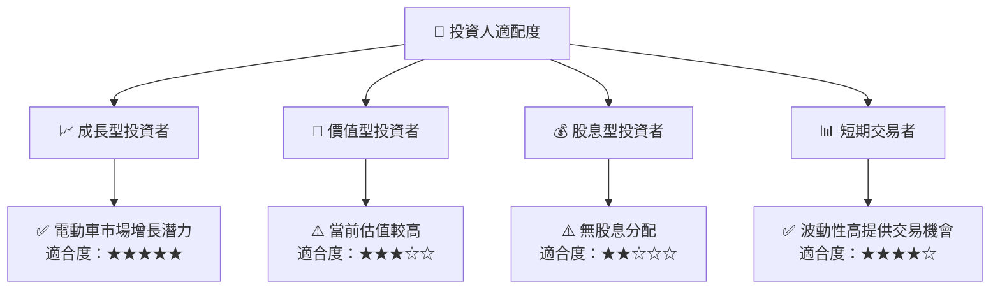

### 10.5 關鍵監控指標

| 監控類型 | 指標 | 關注點 | 頻率 |
|----------|------|--------|------|
| 市場份額 | 全球市場份額 | 競爭優勢 | 季度 |
| 技術進展 | 新技術專利 | 技術領先 | 年度 |
| 財務狀況 | 流動性比率 | 財務健康 | 季度 |
| 營收增長 | 營收增長率 | 成長動能 | 季度 |

---

> **免責聲明**：本報告為 AI 自動生成，僅供研究參考，不構成投資建議。投資有風險，入市需謹慎。