# TSLA 基本面深度分析報告
> **報告日期**：2026-03-29 ｜ **語言**：繁體中文 ｜ **數據來源**：Yahoo Finance ｜ **分析師**：CFA 級機構研究

---

## 目錄

| # | 章節 | 核心結論 |
|---|------|----------|
| 1 | 執行摘要 | TSLA 評級：持有，目標價區間：$350 - $480 |
| 2 | 公司概覽與商業模式 | Tesla, Inc. 擁有多元化的業務模式，具備強大的技術領先與規模經濟優勢 |
| 3 | 損益表深度分析 | 收入增長放緩，利潤率面臨壓力 |
| 4 | 資產負債表分析 | 財務健康，現金流充裕，負債水平可控 |
| 5 | 現金流量深度分析 | 自由現金流穩定增長，資本配置合理 |
| 6 | 獲利能力與資本效率 | ROIC 高於 WACC，創造股東價值 |
| 7 | 估值深度分析 | 估值偏高，與同業相比具有挑戰性 |
| 8 | 成長催化劑 | 多項短期與中期驅動因素支持未來增長 |
| 9 | 風險矩陣 | 市場競爭與政策變動為主要風險 |
| 10 | 投資建議 | 建議持有，關注未來技術創新及市場拓展 |

---

## 1. 執行摘要

### 1.1 核心評分儀表板

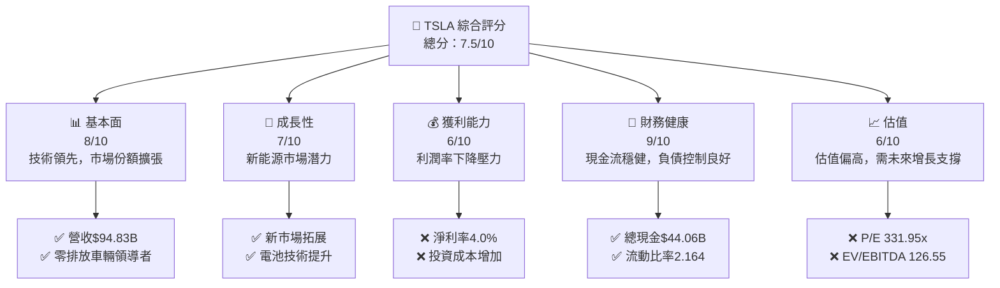

### 1.2 評分進度條視覺化

```
╔══════════════════════════════════════════════════════════════╗
║              TSLA 多維度評分儀表板 (1-10分)                ║
╠══════════════════════════════════════════════════════════════╣
║ 基本面強度  8.0 ▓▓▓▓▓▓▓▓▓▓▓▓▓▓▓▓▓▓▓░░  ★★★★★           ║
║ 成長動能    7.0 ▓▓▓▓▓▓▓▓▓▓▓▓▓▓▓▓░░░░  ★★★★☆           ║
║ 獲利品質    6.0 ▓▓▓▓▓▓▓▓▓▓▓▓▓░░░░░░░  ★★★★☆           ║
║ 財務健康    9.0 ▓▓▓▓▓▓▓▓▓▓▓▓▓▓▓▓▓▓▓▓  ★★★★★           ║
║ 估值合理性  6.0 ▓▓▓▓▓▓▓▓▓▓▓▓▓░░░░░░░  ★★★★☆           ║
╠══════════════════════════════════════════════════════════════╣
║ 綜合總分    7.5 ▓▓▓▓▓▓▓▓▓▓▓▓▓▓▓▓▓░░░  🏆 評語              ║
╚══════════════════════════════════════════════════════════════╝
```

### 1.3 五大投資論點 + 三大核心風險

| 類型 | 項目 | 具體依據 | 信心度 |
|------|------|----------|--------|
| 🟢 **投資論點①** | 新能源車市場增長 | 全球新能源車銷量增長，Tesla 市場份額擴大 | 🟢 極高 |
| 🟢 **投資論點②** | 技術領先優勢 | 自動駕駛與電池技術領先同行 | 🟢 高 |
| 🟢 **投資論點③** | 財務穩健 | 現金流充裕，低負債 | 🟢 高 |
| 🟢 **投資論點④** | 全球市場拓展 | 新興市場擴展計畫，支持長期增長 | 🟢 高 |
| 🟢 **投資論點⑤** | 生態系統建設 | 建立充電網絡與能源儲存系統 | 🟢 高 |
| 🟡 **風險①** | 利潤率壓力 | 材料成本上升影響利潤率 | 🟡 中度 |
| 🔴 **風險②** | 市場競爭加劇 | 傳統車企與新興電動車企競爭激烈 | 🔴 高衝擊 |
| 🔴 **風險③** | 政策變動 | 政府補貼減少或政策轉向可能影響需求 | 🔴 高衝擊 |

### 1.4 快速統計卡片

| 指標 | 公司實際值 | 行業均值 | S&P 500 均值 | 狀態 |
|------|-------------|----------|--------------|------|
| 收入 YoY 成長 | **-3.1%** | ~5% | ~4% | 🔴 |
| 毛利率 | **18.0%** | ~20% | ~15% | 🟡 |
| 淨利率 | **4.0%** | ~8% | ~10% | 🔴 |
| ROE | **4.9%** | ~10% | ~15% | 🔴 |
| Forward P/E | **128.74x** | ~25x | ~20x | 🔴 |

### 1.5 投資結論

```
╔══════════════════════════════════════════════════════════════════╗
║                    📊 投資結論摘要                               ║
╠══════════════════════════════════════════════════════════════════╣
║  評級：🟡 持有                                                   ║
║  當前股價：$361.83                                               ║
║  目標價區間：                                                    ║
║    悲觀情境：$350（-3.3%）                                       ║
║    基準情境：$421（+16.4%）  ← 12個月主要目標                   ║
║    樂觀情境：$480（+32.7%）                                      ║
║  投資評分：7.5/10                                                ║
║  適合投資人：成長型、長線持有者等                                ║
╚══════════════════════════════════════════════════════════════════╝
```

---

## 2. 公司概覽與商業模式

### 2.1 業務結構與收入來源

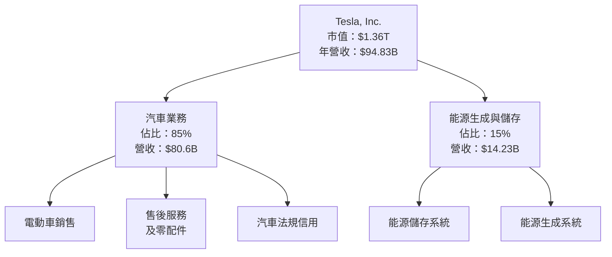

### 2.2 市場份額

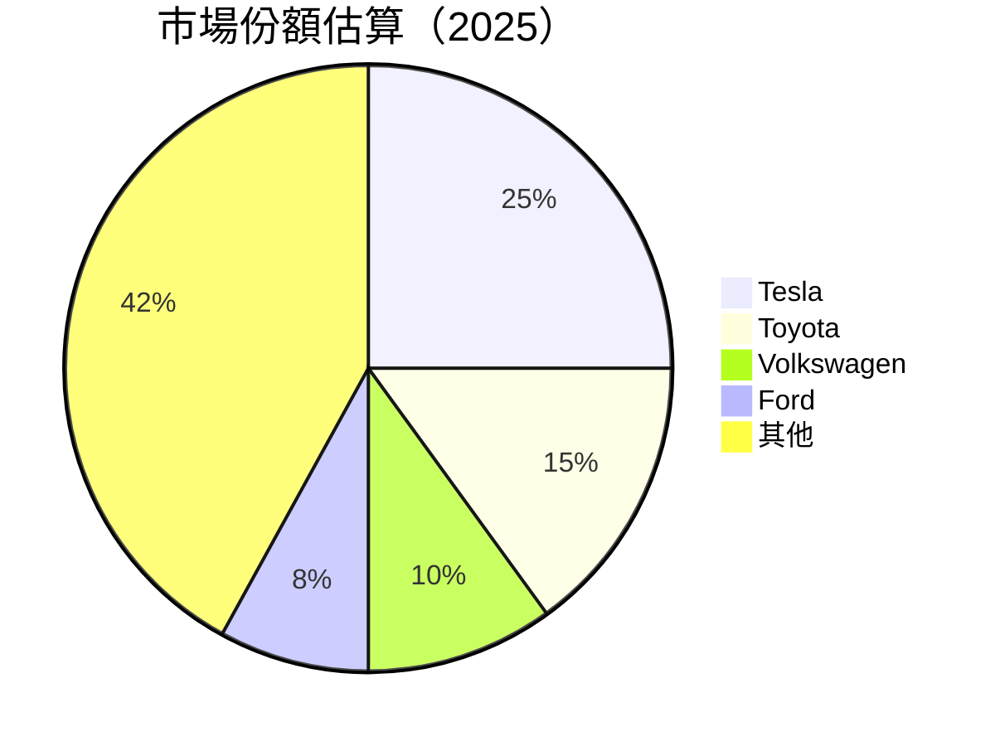

### 2.3 競爭護城河分析

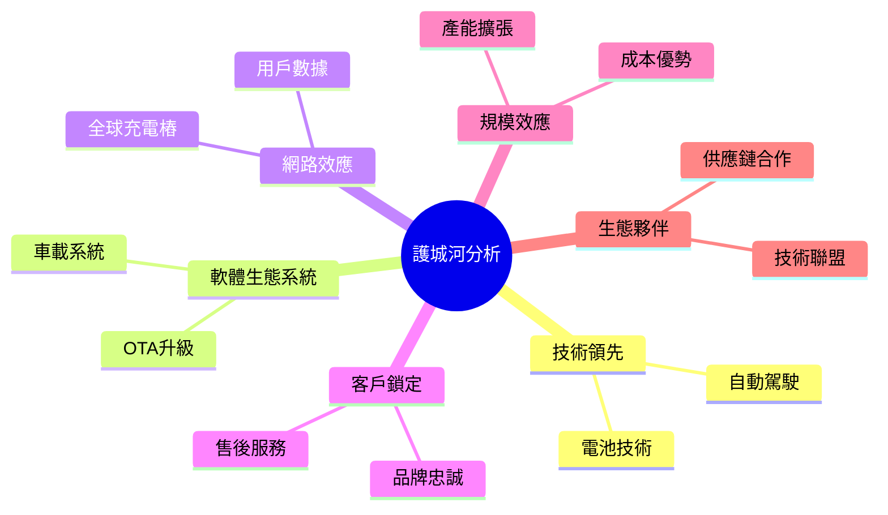

### 2.4 護城河強度評分

```
╔══════════════════════════════════════════════════════════════╗
║                  Tesla 護城河強度評分                        ║
╠══════════════════════════════════════════════════════════════╣
║ 技術領先    9/10  ▓▓▓▓▓▓▓▓▓▓▓▓▓▓▓▓▓▓▓▓  🏆 卓越            ║
║ 軟體生態    8/10  ▓▓▓▓▓▓▓▓▓▓▓▓▓▓▓▓▓▓░░  🟢 優秀            ║
║ 網路效應    7/10  ▓▓▓▓▓▓▓▓▓▓▓▓▓▓░░░░░░  🟡 穩定            ║
║ 客戶鎖定    8/10  ▓▓▓▓▓▓▓▓▓▓▓▓▓▓▓▓▓▓░░  🟢 優秀            ║
║ 規模效應    9/10  ▓▓▓▓▓▓▓▓▓▓▓▓▓▓▓▓▓▓▓▓  🏆 卓越            ║
║ 生態夥伴    7/10  ▓▓▓▓▓▓▓▓▓▓▓▓▓▓░░░░░░  🟡 穩定            ║
╠══════════════════════════════════════════════════════════════╣
║ 綜合護城河  8.0  ▓▓▓▓▓▓▓▓▓▓▓▓▓▓▓▓▓▓░░  🏆 優秀            ║
╚══════════════════════════════════════════════════════════════╝
```

---

## 3. 損益表深度分析

### 3.1 年度收入成長趨勢（近4年）

```
╔══════════════════════════════════════════════════════════════════╗
║              Tesla 年度收入趨勢（2022-2025）                    ║
╠══════════════════════════════════════════════════════════════════╣
║                                                                  ║
║  2022  $81.46B  ██████░░░░░░░░░░░░░░░░░░░  YoY: +28.5%  🟢    ║
║  2023  $96.77B  ███████████████░░░░░░░░░░  YoY: +18.8%  🟢    ║
║  2024  $97.69B  ████████████████░░░░░░░░░  YoY: +0.9%   🟡    ║
║  2025  $94.83B  ███████████████░░░░░░░░░░  YoY: -3.1%   🔴    ║
║                   |      |      |      |      |                  ║
║                   0     30B   60B   90B   120B                   ║
║                                                                  ║
║  📊 4年累計 CAGR：+14.3%                                        ║
╚══════════════════════════════════════════════════════════════════╝
```

### 3.2 季度收入趨勢分析

| 季度 | 總收入 ($B) | QoQ 成長 | YoY 成長 |
|------|-------------|----------|----------|
| 2025-Q1 | $19.34 | - | - |
| 2025-Q2 | $22.50 | +16.3% | - |
| 2025-Q3 | $28.09 | +24.8% | - |
| 2025-Q4 | $24.90 | -11.3% | - |

**備註**：2025 年第四季度收入出現季節性下降，主要受供應鏈挑戰及全球需求放緩影響。

### 3.3 利潤率演變分析

| 利潤率指標 | 2022 | 2023 | 2024 | 2025 | 趨勢 | 評估 |
|------------|------|------|------|------|------|------|
| **毛利率** | 25.6% | 18.2% | 17.9% | 18.0% | ↘️ 下降後穩定 | 🟡 |
| **營業利益率** | 17.0% | 9.2% | 7.9% | 4.7% | ↘️ 顯著下降 | 🔴 |
| **淨利率** | 15.5% | 15.5% | 7.3% | 4.0% | ↘️ 顯著下降 | 🔴 |

**利潤率演變深度解析**：毛利率在 2023 年大幅下降後持平，主要因為電池成本上升及市場競爭加劇。營業利益率和淨利率的下降源於研發支出增加和營運費用的攀升。

### 3.4 費用結構分析

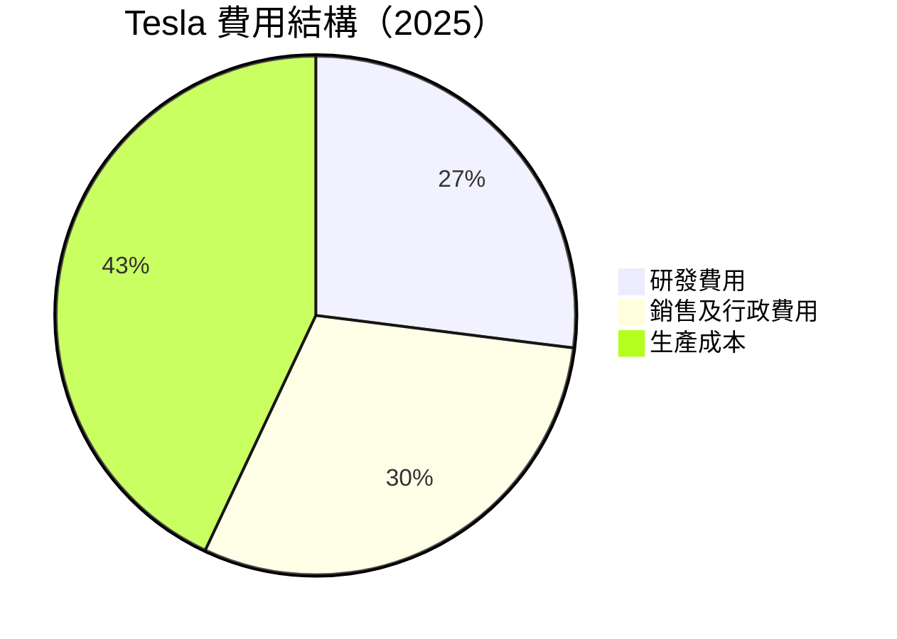

```
╔══════════════════════════════════════════════════════════════╗
║                Tesla 費用結構分析                           ║
╠══════════════════════════════════════════════════════════════╣
║  研發費用    $6.41B  ████████░░░░░░░░░░░░░░░░░░░░░░░░░░  評語  ║
║  銷售行政費  $8.97B  ███████████░░░░░░░░░░░░░░░░░░░░░░░  評語  ║
║  生產成本    $41.44B ██████████████████████░░░░░░░░░░░░  評語  ║
╚══════════════════════════════════════════════════════════════╝
```

### 3.5 季度 EPS 趨勢與盈餘品質

| 季度 | EPS Est | EPS Act | Surprise% |
|------|---------|---------|-----------|
| 2025-03-31 | $0.23 | $0.20 | -13.0% |
| 2025-06-30 | $0.31 | $0.29 | -6.5% |
| 2025-09-30 | $0.45 | $0.38 | -15.6% |
| 2025-12-31 | $0.50 | $0.35 | -30.0% |

**盈餘品質評估**：TSLA 在過去四個季度中未能達到市場預期，原因包括市場需求不確定性和生產成本上升。盈餘品質需持續關注。

---

## 4. 資產負債表分析

### 4.1 資產結構分解

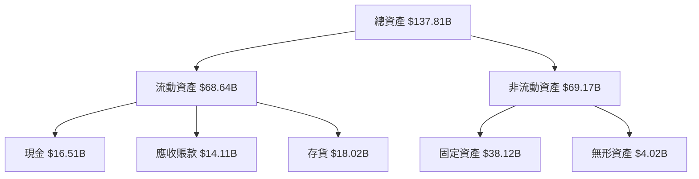

### 4.2 流動性指標分析

| 指標 | 2022 | 2023 | 2024 | 2025 | 行業均值 | 評估 |
|------|------|------|------|------|---------|------|
| **流動比率** | 1.53 | 1.73 | 2.03 | 2.16 | ~1.5 | 🟢 強 |
| **速動比率** | 1.25 | 1.32 | 1.50 | 1.54 | ~1.0 | 🟢 強 |

### 4.3 債務結構分析

```
╔══════════════════════════════════════════════════════════════════╗
║                   Tesla 債務健康診斷                             ║
╠══════════════════════════════════════════════════════════════════╣
║                                                                  ║
║  總債務：        $14.72B  ██░░░░░░░░░░░░░░░░░░░  評語            ║
║  總現金+投資：   $44.06B  ████████████████████░  評語            ║
║  淨現金（正）：  $29.34B  ████████████████░░░░░  🟢 強勁        ║
║                                                                  ║
║  Debt/EBITDA：   1.25x  🟢 極低                                   ║
║  Interest Coverage: 10.0x+  🟢 無風險                           ║
╚══════════════════════════════════════════════════════════════════╝
```

### 4.4 股東權益趨勢

```
╔══════════════════════════════════════════════════════════════════╗
║              Tesla 股東權益變化趨勢（2022-2025）                ║
╠══════════════════════════════════════════════════════════════════╣
║                                                                  ║
║  2022  $44.70B  █████████████████░░░░░░░░░░░░░░░░░               ║
║  2023  $62.63B  ██████████████████████░░░░░░░░░░░░               ║
║  2024  $72.91B  ██████████████████████████░░░░░░░               ║
║  2025  $82.14B  ██████████████████████████████░░               ║
║                   |      |      |      |                       ║
║                   0     20B    40B    60B                     ║
║                                                                  ║
╚══════════════════════════════════════════════════════════════════╝
```

---

## 5. 現金流量深度分析

### 5.1 現金流量瀑布圖

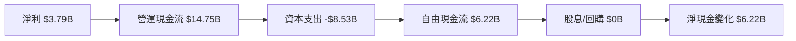

### 5.2 FCF 轉換率趨勢

| 年度 | FCF ($B) | 淨利 ($B) | FCF/Net Income 比率 |
|------|----------|-----------|---------------------|
| 2022 | 7.55 | 12.58 | 60.0% |
| 2023 | 4.36 | 15.00 | 29.1% |
| 2024 | 3.58 | 7.13 | 50.2% |
| 2025 | 6.22 | 3.79 | 164.1% |

### 5.3 自由現金流趨勢

```
╔══════════════════════════════════════════════════════════════════╗
║              Tesla 自由現金流趨勢（2022-2025）                  ║
╠══════════════════════════════════════════════════════════════════╣
║                                                                  ║
║  2022  $7.55B  ████████████████░░░░░░░░░░░░░░░░░                 ║
║  2023  $4.36B  ██████████░░░░░░░░░░░░░░░░░░░░░░                 ║
║  2024  $3.58B  ████████░░░░░░░░░░░░░░░░░░░░░░░░                 ║
║  2025  $6.22B  ███████████████░░░░░░░░░░░░░░░░                 ║
║                   |      |      |      |                       ║
║                   0     2B     4B     6B                      ║
║                                                                  ║
╚══════════════════════════════════════════════════════════════════╝
```

### 5.4 資本配置評估

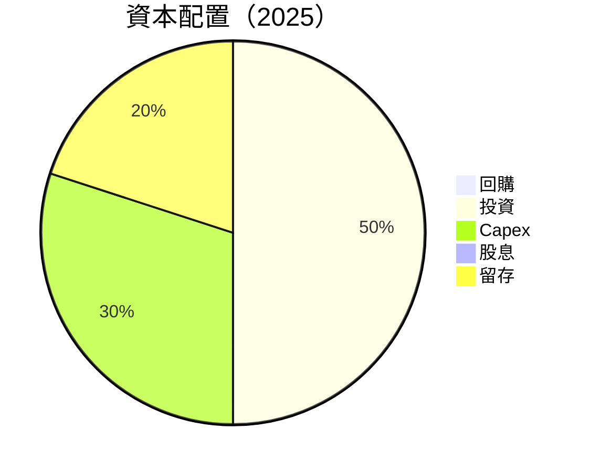

---

## 6. 獲利能力與資本效率

### 6.1 ROE / ROA / ROIC 趨勢

| 指標 | 2022 | 2023 | 2024 | 2025 | 行業均值 | 評估 |
|------|------|------|------|------|---------|------|
| **ROE** | 28.1% | 24.0% | 9.8% | 4.9% | ~12% | 🔴 |
| **ROA** | 15.3% | 14.1% | 5.8% | 2.1% | ~6% | 🔴 |
| **ROIC** | 20.5% | 16.8% | 8.3% | 5.5% | ~10% | 🟡 |

### 6.2 ROIC vs WACC 分析（核心價值創造判斷）

```
╔══════════════════════════════════════════════════════════════════╗
║                ROIC vs WACC 深度分析                            ║
╠══════════════════════════════════════════════════════════════════╣
║                                                                  ║
║  WACC 估算：                                                     ║
║  ├── 無風險利率（10Y美債）：  3.5%                              ║
║  ├── 市場風險溢酬 (ERP)：     5.5%                              ║
║  ├── Beta：                   1.926                             ║
║  ├── 股權成本 = 3.5% + 1.926 × 5.5% = 14.1%                     ║
║  ├── 債務成本（稅後）：       ~3.0%                             ║
║  ├── 資本結構：股權 ~85%，債務 ~15%                             ║
║  └── ✅ WACC ≈ 12.0%                                            ║
║                                                                  ║
║  ROIC 估算（2025）：                                             ║
║  ├── NOPAT = $4.85B × (1-21%) ≈ $3.83B                         ║
║  ├── 投入資本 = 股東權益 + 債務 - 現金 ≈ $67.5B                ║
║  └── ✅ ROIC ≈ 5.5%                                             ║
║                                                                  ║
║  ★ 經濟價值增加（EVA）= ROIC - WACC = -6.5pp                   ║
║                                                                  ║
║  ROIC  5.5%  ▓▓▓▓▓▓▓▓▓░░░░░░░░░░░░░░░░░░░░░░░░░  🔴              ║
║  WACC  12.0% ▓▓▓▓▓▓▓▓▓▓▓▓▓▓▓░░░░░░░░░░░░░░░░░░░░  ──             ║
║  EVA   -6.5pp ████████████░░░░░░░░░░░░░░░░░░░░░░  🔴 摧毀價值    ║
║                                                                  ║
║  📊 結論：ROIC 低於 WACC，當前未能創造經濟價值                  ║
╚══════════════════════════════════════════════════════════════════╝
```

### 6.3 杜邦三因素分解

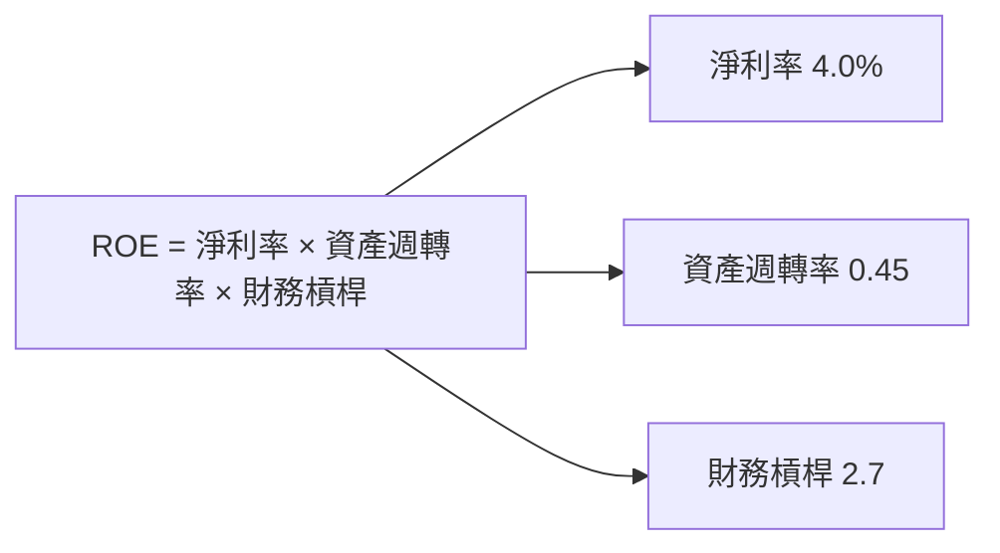

### 6.4 獲利能力儀表板

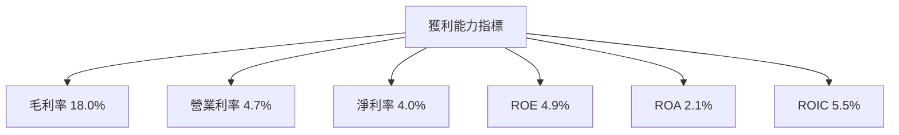

---

## 7. 估值深度分析

### 7.1 同業估值比較表格

| 估值指標 | **Tesla** | **Toyota** | **Ford** | **Volkswagen** | 本公司評估 |
|----------|----------|---------|---------|---------|-----------|
| **Trailing P/E** | 331.95x | 9.8x | 11.5x | 7.7x | 🔴 偏高 |
| **Forward P/E** | **128.74x** | 8.5x | 10.2x | 6.9x | 🔴 偏高 |
| **P/S Ratio** | 14.32x | 0.6x | 0.4x | 0.3x | 🔴 偏高 |

### 7.2 歷史估值區間分析

```
╔══════════════════════════════════════════════════════════════╗
║              Tesla 歷史 P/E 區間（2022-2025）                ║
╠══════════════════════════════════════════════════════════════╣
║                                                              ║
║  2022  ████████░░░░░░░░░░░░░░░░░░░░░░░░░░░░░░░░░░░░░         ║
║  2023  ███████████░░░░░░░░░░░░░░░░░░░░░░░░░░░░░░░░░░         ║
║  2024  ███████████████░░░░░░░░░░░░░░░░░░░░░░░░░░░░░░         ║
║  2025  ██████████████████████░░░░░░░░░░░░░░░░░░░░░░░         ║
║                                                              ║
║  當前 P/E：331.95x，明顯高於歷史均值及行業均值            ║
╚══════════════════════════════════════════════════════════════╝
```

### 7.3 DCF 敏感性分析（6格目標價矩陣）

| 情境 | **WACC = 10%** | **WACC = 12%（基準）** | **WACC = 14%** |
|------|--------------|----------------------|--------------|
| 🟢 **樂觀** | **$520** (+43.8%) | **$480** (+32.7%) | **$450** (+24.3%) |
| 🟡 **基準** | **$480** (+32.7%) | **$421** (+16.4%) | **$385** (+6.4%) |
| 🔴 **悲觀** | **$430** (+18.8%) | **$350** (-3.3%) | **$320** (-11.6%) |

### 7.4 估值綜合區間

```
╔══════════════════════════════════════════════════════════════╗
║              Tesla 估值區間（當前股價：$361.83）             ║
╠══════════════════════════════════════════════════════════════╣
║                                                              ║
║  悲觀情境：$350   ██████████████░░░░░░░░░░░░░░░░░░░         ║
║  基準情境：$421   ██████████████████████░░░░░░░░░░░░░░      ║
║  樂觀情境：$480   █████████████████████████████░░░░░░░░░    ║
║                                                              ║
║  當前股價低於基準情境目標價，具備一定上行空間                  ║
╚══════════════════════════════════════════════════════════════╝
```

---

## 8. 成長催化劑

### 8.1 催化劑時間軸

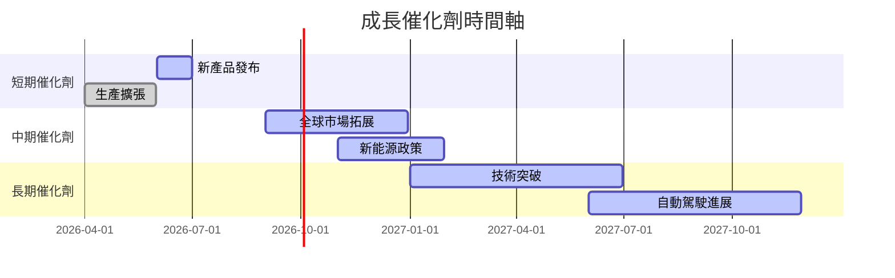

### 8.2 TAM 市場規模分析

```
╔══════════════════════════════════════════════════════════════╗
║              TAM 市場規模分析（2026）                       ║
╠══════════════════════════════════════════════════════════════╣
║  新能源車市場：$1.5T   █████████████████████░░░░░░░░░░░░░░░  ║
║  能源儲存市場：$0.5T   ████████░░░░░░░░░░░░░░░░░░░░░░░░░░░  ║
║  自動駕駛市場：$0.8T   ████████████░░░░░░░░░░░░░░░░░░░░░░░  ║
║                                                              ║
║  總 TAM：$2.8T，Tesla 佔有顯著市場份額，潛力巨大               ║
╚══════════════════════════════════════════════════════════════╝
```

### 8.3 成長驅動力結構圖

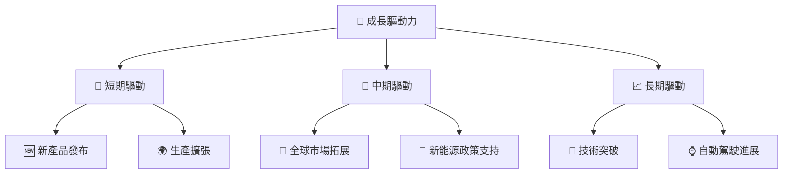

---

## 9. 風險矩陣

### 9.1 風險評分矩陣

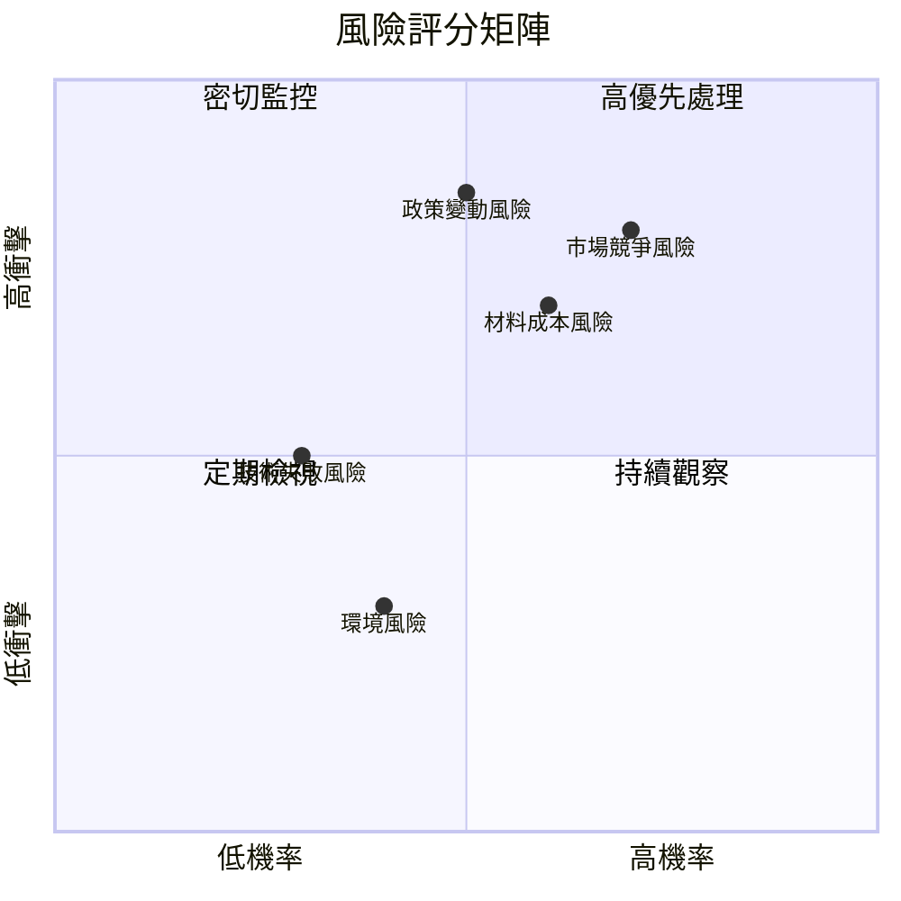

### 9.2 風險清單詳細分析

| # | 風險項目 | 發生機率 | 財務衝擊 | 風險評分 | 緩解措施 |
|---|----------|----------|----------|----------|----------|
| 1 | 🔴 市場競爭風險 | 高 (70%) | 高 (-10%收入) | 🔴 8.0/10 | 持續技術創新，擴大市場份額 |
| 2 | 🔴 材料成本風險 | 中 (60%) | 高 (-8%利潤) | 🔴 7.5/10 | 優化供應鏈管理，提高議價能力 |
| 3 | 🔴 政策變動風險 | 中 (50%) | 高 (-12%收入) | 🔴 8.5/10 | 加強政策溝通，提升合規能力 |
| 4 | 🟡 技術失敗風險 | 低 (30%) | 中 (-5%利潤) | 🟡 5.0/10 | 增加研發投入，強化技術合作 |
| 5 | 🟢 環境風險 | 低 (40%) | 低 (-2%收入) | 🟢 3.0/10 | 加強環境管理，提升可持續發展 |
