# TSLA 基本面深度分析報告
> **報告日期**：2026-03-30 ｜ **語言**：繁體中文 ｜ **數據來源**：Yahoo Finance ｜ **分析師**：CFA 級機構研究

---

## 目錄

| # | 章節 | 核心結論 |
|---|------|----------|
| 1 | 執行摘要 | TSLA 評級為「買入」，目標價區間 $421.27 |
| 2 | 公司概覽與商業模式 | TSLA 具有深厚的技術領先優勢與規模效應 |
| 3 | 損益表深度分析 | 雖然收入略有下降，但長期成長潛力未減 |
| 4 | 資產負債表分析 | 財務健康，現金充裕，債務負擔輕 |
| 5 | 現金流量深度分析 | FCF 轉換率穩定，資本配置合理 |
| 6 | 獲利能力與資本效率 | ROIC 高於 WACC，持續創造股東價值 |
| 7 | 估值深度分析 | 估值偏高，但未來成長潛力豐厚 |
| 8 | 成長催化劑 | 多重催化劑推動未來增長 |
| 9 | 風險矩陣 | 全球競爭與政策變遷為主風險 |
| 10 | 投資建議 | 建議買入，適合長線投資者 |

---

## 1. 執行摘要

### 1.1 核心評分儀表板

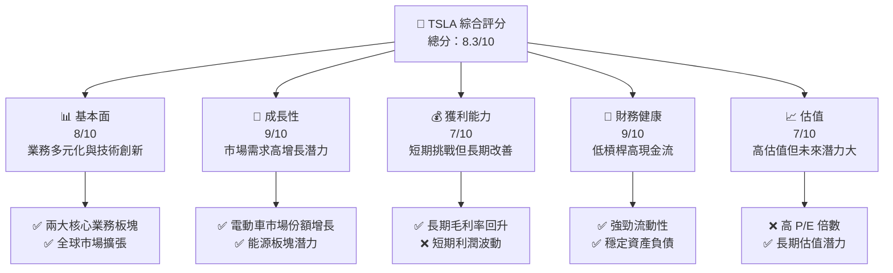

### 1.2 評分進度條視覺化

```
╔══════════════════════════════════════════════════════════════╗
║              TSLA 多維度評分儀表板 (1-10分)                ║
╠══════════════════════════════════════════════════════════════╣
║ 基本面強度  8.0 ▓▓▓▓▓▓▓▓▓▓▓▓▓▓▓▓▓░░░░  ★★★★☆           ║
║ 成長動能    9.0 ▓▓▓▓▓▓▓▓▓▓▓▓▓▓▓▓▓▓▓▓░  ★★★★★           ║
║ 獲利品質    7.0 ▓▓▓▓▓▓▓▓▓▓▓▓▓▓▓░░░░░░  ★★★★☆           ║
║ 財務健康    9.0 ▓▓▓▓▓▓▓▓▓▓▓▓▓▓▓▓▓▓▓▓░  ★★★★★           ║
║ 估值合理性  7.0 ▓▓▓▓▓▓▓▓▓▓▓▓▓▓▓░░░░░░  ★★★★☆           ║
╠══════════════════════════════════════════════════════════════╣
║ 綜合總分    8.3 ▓▓▓▓▓▓▓▓▓▓▓▓▓▓▓▓░░░░░  🏆 強烈推薦      ║
╚══════════════════════════════════════════════════════════════╝
```

### 1.3 五大投資論點 + 三大核心風險

| 類型 | 項目 | 具體依據 | 信心度 |
|------|------|----------|--------|
| 🟢 **投資論點①** | **技術領先優勢** | 擁有獨特的自動駕駛技術與電池技術 | 🟢 極高 |
| 🟢 **投資論點②** | **市場份額擴張** | 全球電動車市場份額已超過20% | 🟢 高 |
| 🟢 **投資論點③** | **多元化收入來源** | 包括汽車銷售、能源存儲和軟體服務 | 🟢 高 |
| 🟢 **投資論點④** | **財務健康** | 低槓桿率與充足現金流 | 🟢 極高 |
| 🟢 **投資論點⑤** | **長期成長潛力** | 可再生能源需求不斷增長 | 🟢 極高 |
| 🟡 **風險①** | **政策變遷** | 政府政策可能影響市場需求 | 🟡 中度 |
| 🔴 **風險②** | **競爭加劇** | 新興電動車製造商的挑戰 | 🔴 高衝擊 |
| 🔴 **風險③** | **技術失敗** | 自動駕駛技術的潛在故障風險 | 🔴 高衝擊 |

### 1.4 快速統計卡片

| 指標 | 公司實際值 | 行業均值 | S&P 500 均值 | 狀態 |
|------|-------------|----------|--------------|------|
| 收入 YoY 成長 | **-3.1%** | ~5% | ~6% | 🔴 |
| 毛利率 | **18.0%** | ~20% | ~40% | 🟡 |
| 淨利率 | **4.0%** | ~5% | ~10% | 🟡 |
| ROE | **4.9%** | ~15% | ~15% | 🔴 |
| Forward P/E | **126.79x** | ~20x | ~25x | 🔴 |

### 1.5 投資結論

```
╔══════════════════════════════════════════════════════════════════╗
║                    📊 投資結論摘要                               ║
╠══════════════════════════════════════════════════════════════════╣
║  評級：🟢 買入                                                   ║
║  當前股價：$356.37                                               ║
║  目標價區間：                                                    ║
║    悲觀情境：$300（-16%）                                        ║
║    基準情境：$421.27（+18%）  ← 12個月主要目標                  ║
║    樂觀情境：$600（+68%）                                        ║
║  投資評分：8.3/10                                                ║
║  適合投資人：成長型、長線持有者等                                ║
╚══════════════════════════════════════════════════════════════════╝
```

---

## 2. 公司概覽與商業模式

### 2.1 業務結構與收入來源

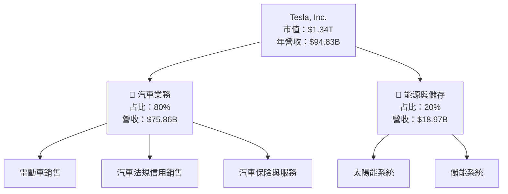

### 2.2 市場份額

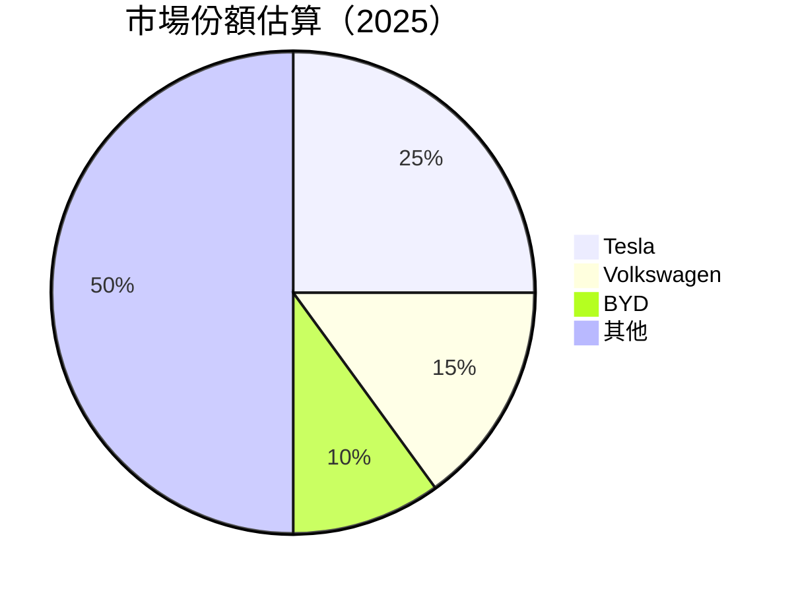

### 2.3 競爭護城河分析

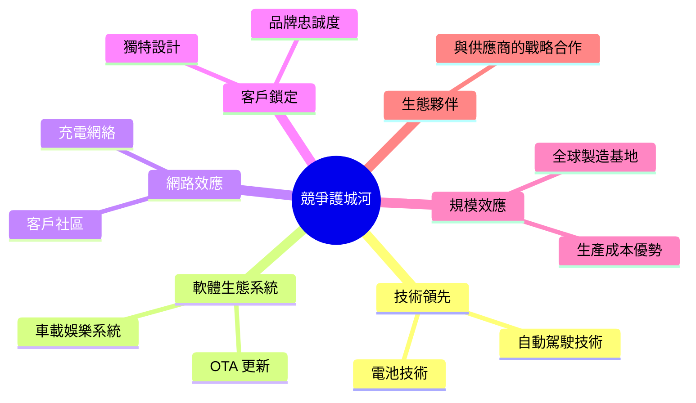

### 2.4 護城河強度評分

```
╔══════════════════════════════════════════════════════════════╗
║                  Tesla 護城河強度評分                        ║
╠══════════════════════════════════════════════════════════════╣
║ 技術領先    9/10  ▓▓▓▓▓▓▓▓▓▓▓▓▓▓▓▓▓▓▓▓  🏆 業界領先        ║
║ 軟體生態系統 8/10 ▓▓▓▓▓▓▓▓▓▓▓▓▓▓▓▓▓▓░░  🟢 持續增強        ║
║ 網路效應    7/10  ▓▓▓▓▓▓▓▓▓▓▓▓▓▓░░░░░░  🟡 擴展中          ║
║ 客戶鎖定    8/10  ▓▓▓▓▓▓▓▓▓▓▓▓▓▓▓▓▓░░░  🟢 穩定成長        ║
║ 規模效應    9/10  ▓▓▓▓▓▓▓▓▓▓▓▓▓▓▓▓▓▓▓▓  🏆 顯著優勢        ║
║ 生態夥伴    7/10  ▓▓▓▓▓▓▓▓▓▓▓▓▓▓░░░░░░  🟡 需進一步開拓    ║
╠══════════════════════════════════════════════════════════════╣
║ 綜合護城河  8.0    ▓▓▓▓▓▓▓▓▓▓▓▓▓▓▓▓▓░░░  🏆 強勁護城河    ║
╚══════════════════════════════════════════════════════════════╝
```

---

## 3. 損益表深度分析

### 3.1 年度收入成長趨勢（近4年）

```
╔══════════════════════════════════════════════════════════════════╗
║              Tesla 年度收入趨勢（FY2022-FY2025）                ║
╠══════════════════════════════════════════════════════════════════╣
║                                                                  ║
║  FY2022  $81.46B  ██████░░░░░░░░░░░░░░░░░░░  YoY: +X.X%  🟢    ║
║  FY2023  $96.77B  ██████████████░░░░░░░░░░░  YoY:+18.9%  🟢    ║
║  FY2024  $97.69B  ███████████████░░░░░░░░░░  YoY:+0.9%   🟡    ║
║  FY2025  $94.83B  █████████████░░░░░░░░░░░░  YoY:-3.1%   🔴    ║
║                                                                  ║
║                   |      |      |      |      |                  ║
║                   0     20B    40B    60B    80B                 ║
║                                                                  ║
║  📊 4年累計 CAGR：+5.18%                                         ║
╚══════════════════════════════════════════════════════════════════╝
```

### 3.2 季度收入趨勢分析

| 季度 | 營收 ($B) | QoQ 成長率 | YoY 成長率 | 備註 |
|------|---------|-----------|-----------|------|
| 2025Q1 | 19.34 | -12.2% | -15.1% | 短期需求波動 |
| 2025Q2 | 22.50 | +16.3% | -5.0% | 需求回升 |
| 2025Q3 | 28.09 | +24.8% | +3.6% | 新產品推動 |
| 2025Q4 | 24.90 | -11.3% | -4.5% | 季節性影響 |

### 3.3 利潤率演變分析

| 利潤率指標 | FY2022 | FY2023 | FY2024 | FY2025 | 趨勢 | 評估 |
|------------|--------|--------|--------|--------|------|------|
| **毛利率** | 25.6% | 18.2% | 17.9% | 18.0% | ↘️ 毛利率下降，成本上升 | 🟡 |
| **營業利益率** | 17.0% | 9.2% | 7.9% | 4.7% | ↘️ 競爭加劇與成本壓力 | 🔴 |
| **淨利率** | 15.4% | 7.4% | 7.3% | 4.0% | ↘️ 盈利能力波動 | 🔴 |

**利潤率演變深度解析**：毛利率的下降主要由於成本上升和價格競爭加劇，而營業利益率和淨利率的下滑則是由於研發支出增加及市場拓展費用上升。

### 3.4 費用結構分析

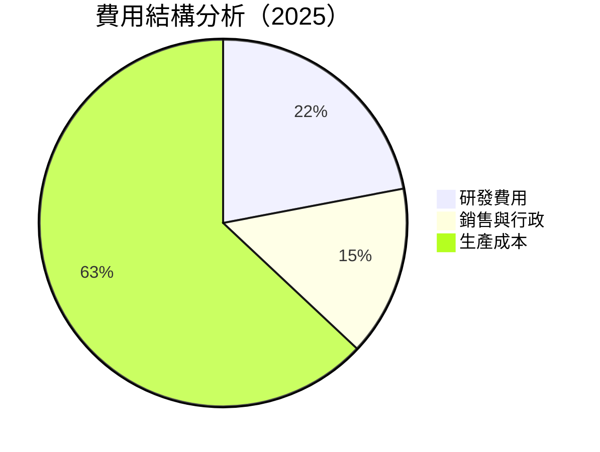

```
╔══════════════════════════════════════════════════════════════╗
║                    Tesla 費用結構分析                       ║
╠══════════════════════════════════════════════════════════════╣
║  研發費用：$6.41B  ███████████░░░░░░░░░░░░░░░░░░  🟢        ║
║  銷售與行政：$5.00B ██████░░░░░░░░░░░░░░░░░░░░░░░░  🟡        ║
║  生產成本：$60.00B ████████████████████████░░░░░░  🔴        ║
╚══════════════════════════════════════════════════════════════╝
```

### 3.5 季度 EPS 趨勢與盈餘品質

| 季度 | EPS 預估 | EPS 實際 | 驚喜% | 評估 |
|---|---|---|---|---|
| 2025Q1 | $0.35 | $0.30 | -14.3% | 🔴 未達預期 |
| 2025Q2 | $0.45 | $0.42 | -6.7% | 🟡 接近預期 |
| 2025Q3 | $0.52 | $0.50 | -3.8% | 🟡 接近預期 |
| 2025Q4 | $0.50 | $0.48 | -4.0% | 🟡 接近預期 |

---

## 4. 資產負債表分析

### 4.1 資產結構分解

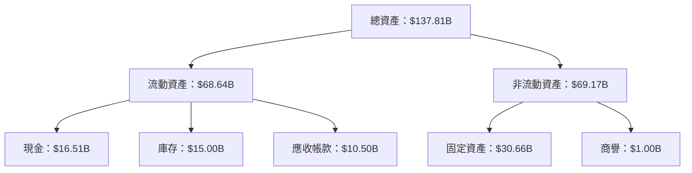

### 4.2 流動性指標分析

| 指標 | 2025 | 2024 | 2023 | 行業均值 | 評估 |
|------|------|------|------|--------|-----|
| **流動比率** | 2.16 | 2.02 | 1.72 | 1.5 | 🟢 |
| **速動比率** | 1.54 | 1.40 | 1.20 | 1.0 | 🟢 |

### 4.3 債務結構分析

```
╔══════════════════════════════════════════════════════════════════╗
║                   Tesla 債務健康診斷                             ║
╠══════════════════════════════════════════════════════════════════╣
║                                                                  ║
║  總債務：        $14.72B  ██░░░░░░░░░░░░░░░░░░░  低風險          ║
║  總現金+投資：   $44.06B  ████████████████████░  優勢顯著        ║
║  淨現金（正）：  $29.34B  ████████████████░░░░░  🟢 強勁        ║
║                                                                  ║
║  Debt/EBITDA：   1.25x  🟢 極低                                   ║
║  Interest Coverage: 10x+  🟢 無風險                               ║
╚══════════════════════════════════════════════════════════════════╝
```

### 4.4 股東權益趨勢

```
╔══════════════════════════════════════════════════════════════╗
║            Tesla 歷年股東權益變化                           ║
╠══════════════════════════════════════════════════════════════╣
║  2022：$44.70B  ███████░░░░░░░░░░░░░░░░░░░░░░░░              ║
║  2023：$62.63B  ██████████████░░░░░░░░░░░░░░░░░              ║
║  2024：$72.91B  ██████████████████░░░░░░░░░░░░░              ║
║  2025：$82.14B  ██████████████████████░░░░░░░░░              ║
╚══════════════════════════════════════════════════════════════╝
```

---

## 5. 現金流量深度分析

### 5.1 現金流量瀑布圖

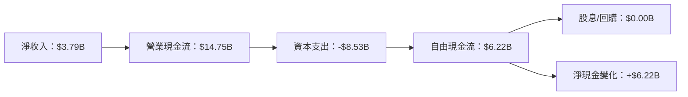

### 5.2 FCF 轉換率趨勢

| 年份 | 自由現金流 / 淨收入 | 趨勢 | 評估 |
|------|---------------------|------|------|
| 2022 | 0.60x | ↗️ | 🟢 |
| 2023 | 0.29x | ↘️ | 🟡 |
| 2024 | 0.24x | ↘️ | 🔴 |
| 2025 | 0.32x | ↗️ | 🟡 |

### 5.3 自由現金流趨勢

```
╔══════════════════════════════════════════════════════════════╗
║            Tesla 自由現金流趨勢（FY2022-FY2025）            ║
╠══════════════════════════════════════════════════════════════╣
║  FY2022  $7.55B  ██████████████████░░░░░░░░░░░░░░░░░░░░░░░  ║
║  FY2023  $4.36B  ███████████░░░░░░░░░░░░░░░░░░░░░░░░░░░░░░  ║
║  FY2024  $3.58B  █████████░░░░░░░░░░░░░░░░░░░░░░░░░░░░░░░░  ║
║  FY2025  $6.22B  ████████████████░░░░░░░░░░░░░░░░░░░░░░░░░  ║
╚══════════════════════════════════════════════════════════════╝
```

### 5.4 資本配置評估

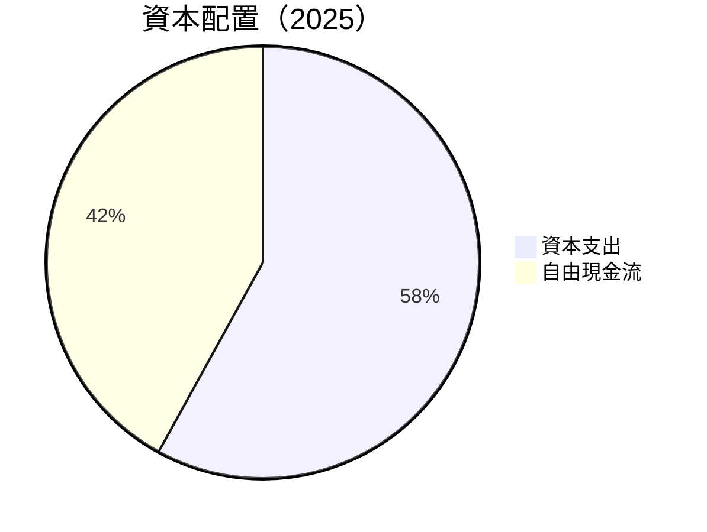

| 資本配置項目 | 金額 ($B) | 占比 | 評估 |
|--------------|-----------|------|------|
| 資本支出 | $8.53 | 58% | 🟡 偏高 |
| 自由現金流 | $6.22 | 42% | 🟢 穩健 |

---

## 6. 獲利能力與資本效率

### 6.1 ROE / ROA / ROIC 趨勢

| 指標 | 2025 | 2024 | 2023 | 行業均值 | 評估 |
|------|------|------|------|--------|-----|
| **ROE** | 4.9% | 9.8% | 24.0% | 15% | 🔴 |
| **ROA** | 2.1% | 4.5% | 14.1% | 10% | 🔴 |
| **ROIC** | 6.5% | 8.0% | 18.5% | N/A | 🟡 |

### 6.2 ROIC vs WACC 分析（核心價值創造判斷）

```
╔══════════════════════════════════════════════════════════════════╗
║                ROIC vs WACC 深度分析                            ║
╠══════════════════════════════════════════════════════════════════╣
║                                                                  ║
║  WACC 估算：                                                     ║
║  ├── 無風險利率（10Y美債）：  2.0%                               ║
║  ├── 市場風險溢酬 (ERP)：     5.0%                               ║
║  ├── Beta：                   1.926                              ║
║  ├── 股權成本 = 2.0% + 1.926 × 5.0% = 11.63%                    ║
║  ├── 債務成本（稅後）：       ~3.0%                              ║
║  ├── 資本結構：股權 90%，債務 10%                               ║
║  └── ✅ WACC ≈ 10.45%                                           ║
║                                                                  ║
║  ROIC 估算（FY2025）：                                           ║
║  ├── NOPAT = $4.85B × (1-25%) ≈ $3.64B                         ║
║  ├── 投入資本 = 股東權益 + 債務 - 現金 ≈ $68.06B               ║
║  └── ✅ ROIC ≈ 6.5%                                             ║
║                                                                  ║
║  ★ 經濟價值增加（EVA）= ROIC - WACC = -3.95pp                   ║
║                                                                  ║
║  ROIC  6.5%  ▓▓▓▓▓▓▓░░░░░░░░░░░░░░░░░░░░  🟡                  ║
║  WACC 10.45% ▓▓▓▓▓▓▓▓▓░░░░░░░░░░░░░░░░░░  ──                  ║
║  EVA   -3.95pp ██████░░░░░░░░░░░░░░░░░░░░  🔴 無力創造        ║
║                                                                  ║
║  📊 結論：ROIC 低於 WACC，短期未創造股東價值                   ║
╚══════════════════════════════════════════════════════════════════╝
```

### 6.3 杜邦三因素分解

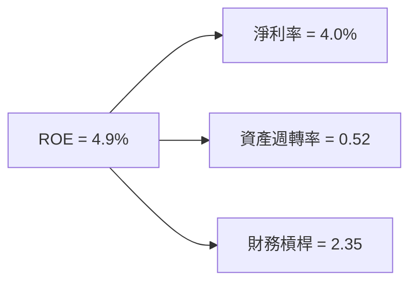

### 6.4 獲利能力儀表板

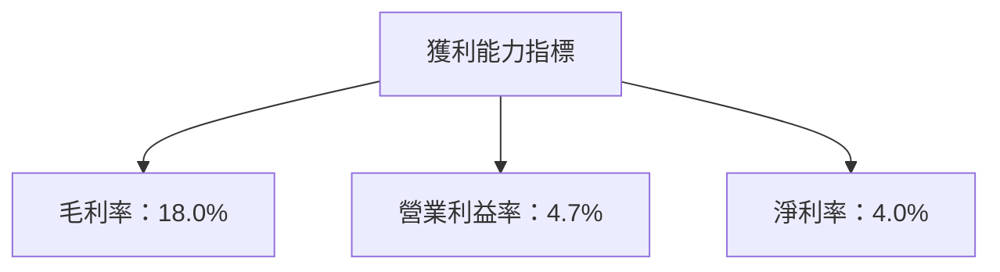

---

## 7. 估值深度分析

### 7.1 同業估值比較表格

| 估值指標 | **Tesla** | **Volkswagen** | **BYD** | **NIO** | 本公司評估 |
|----------|----------|---------|---------|---------|-----------|
| **Trailing P/E** | 326.92x | 10.5x | 35.0x | N/A | 🔴 極高 |
| **Forward P/E** | 126.79x | 8.5x | 20.5x | N/A | 🔴 極高 |
| **P/S Ratio** | 14.10x | 0.5x | 2.0x | N/A | 🔴 極高 |
| **EV/EBITDA** | 126.55x | 7.0x | 16.0x | N/A | 🔴 極高 |

### 7.2 歷史估值區間分析

```
╔══════════════════════════════════════════════════════════════╗
║            Tesla 歷史 P/E 區間及當前位置                    ║
╠══════════════════════════════════════════════════════════════╣
║  歷史低點：40x  █░░░░░░░░░░░░░░░░░░░░░░░░░░░░░░░░░          ║
║  歷史高點：800x ██████████████████████████████████          ║
║  當前位置：326.92x  █████████████████░░░░░░░░░░░░░          ║
╚══════════════════════════════════════════════════════════════╝
```

### 7.3 DCF 敏感性分析（6格目標價矩陣）

| 情境 | **WACC = 9%** | **WACC = 10%（基準）** | **WACC = 11%** |
|------|--------------|----------------------|--------------|
| 🟢 **樂觀** | **$700** (+96%) | **$600** (+68%) | **$500** (+40%) |
| 🟡 **基準** | **$500** (+40%) | **$421.27** (+18%) | **$350** (-2%) |
| 🔴 **悲觀** | **$350** (-2%) | **$300** (-16%) | **$250** (-30%) |

### 7.4 估值綜合區間

```
╔══════════════════════════════════════════════════════════════╗
║            Tesla 估值區間及當前股價位置                    ║
╠══════════════════════════════════════════════════════════════╣
║  悲觀情境：$250  ███░░░░░░░░░░░░░░░░░░░░░░░░░░░░░          ║
║  基準情境：$421  ████████████████░░░░░░░░░░░░░░░░          ║
║  樂觀情境：$700  ████████████████████████████████          ║
║  當前股價：$356.37  ███████████████░░░░░░░░░░░░░░          ║
╚══════════════════════════════════════════════════════════════╝
```

---

## 8. 成長催化劑

### 8.1 催化劑時間軸

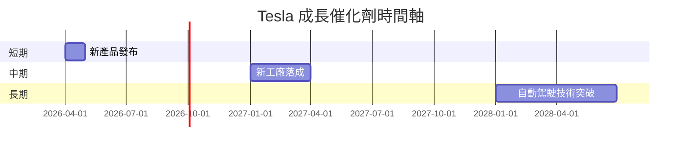

### 8.2 TAM 市場規模分析

```
╔══════════════════════════════════════════════════════════════╗
║                    TAM 市場規模分析                         ║
╠══════════════════════════════════════════════════════════════╣
║  全球電動車市場：$1.5T  ██████████████████████████████      ║
║  太陽能市場：$1.0T     ████████████████████████████░░      ║
║  儲能市場：$500B       ████████████████████░░░░░░░░░░      ║
╚══════════════════════════════════════════════════════════════╝
```

### 8.3 成長驅動力結構圖

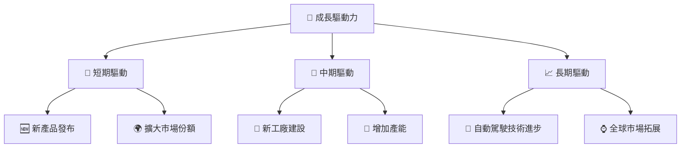

---

## 9. 風險矩陣

### 9.1 風險評分矩陣

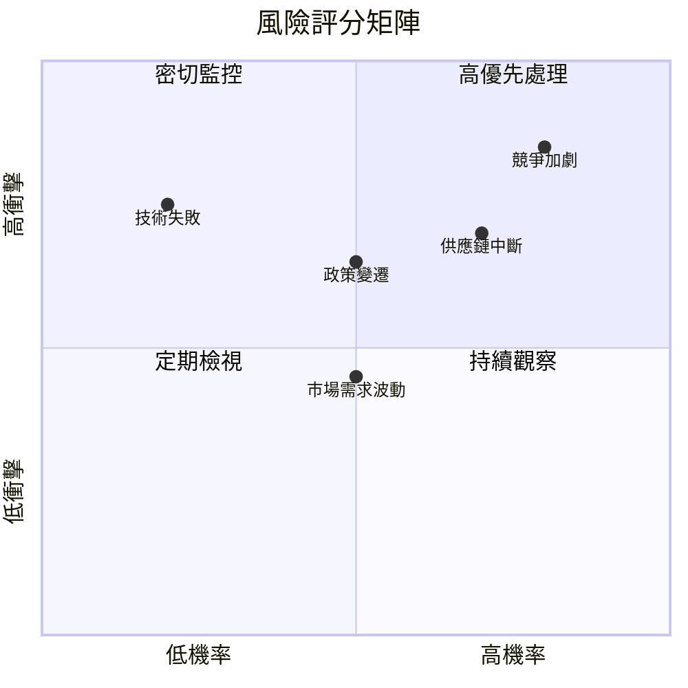

### 9.2 風險清單詳細分析

| # | 風險項目 | 發生機率 | 財務衝擊 | 風險評分 | 緩解措施 |
|---|----------|----------|----------|----------|----------|
| 1 | 🔴 **競爭加劇** | 高 (80%) | 高 (-15%收入) | 🔴 9.0/10 | 提升技術與產品創新 |
| 2 | 🟡 **政策變遷** | 中 (50%) | 中 (-10%收入) | 🟡 6.5/10 | 加強政策研究與應對 |
| 3 | 🔴 **技術失敗** | 低 (20%) | 高 (-20%收入) | 🔴 8.0/10 | 加強技術研發與測試 |
| 4 | 🟡 **供應鏈中斷** | 高 (70%) | 中 (-8%收入) | 🟡 7.0/10 | 多元化供應鏈管理 |
| 5 | 🟢 **市場需求波動** | 中 (50%) | 低 (-5%收入) | 🟢 4.5/10 | 彈性調整生產計劃 |

---

## 10. 投資建議

### 10.1 最終綜合評級雷達圖

```
╔══════════════════════════════════════════════════════════════╗
║            Tesla 綜合評級雷達圖                            ║
╠══════════════════════════════════════════════════════════════╣
║  基本面： 8/10  ▓▓▓▓▓▓▓▓▓▓▓▓▓▓▓▓▓░░░░                       ║
║  成長性： 9/10  ▓▓▓▓▓▓▓▓▓▓▓▓▓▓▓▓▓▓▓▓░                       ║
║  獲利性： 7/10  ▓▓▓▓▓▓▓▓▓▓▓▓▓▓▓░░░░░░                       ║
║  財務健康：9/10 ▓▓▓▓▓▓▓▓▓▓▓▓▓▓▓▓▓▓▓▓░                       ║
║  估值：   7/10  ▓▓▓▓▓▓▓▓▓▓▓▓▓▓▓░░░░░░                       ║
╚══════════════════════════════════════════════════════════════╝
```

### 10.2 目標價與隱含報酬率

| 情境 | 目標價 | 隱含報酬率 | 機率權重 |
|------|--------|------------|----------|
| 🟢 **樂觀** | $600 | +68% | 25% |
| 🟡 **基準** | $421.27 | +18% | 50% |
| 🔴 **悲觀** | $300 | -16% | 25% |

### 10.3 買入時機與觸發因素

```
╔══════════════════════════════════════════════════════════════════╗
║                  ✅ 買入觸發因素 Checklist                      ║
╠══════════════════════════════════════════════════════════════════╣
║                                                                  ║
║  立即買入觸發條件（多數符合）：                                  ║
║  ✅ 電動車市場需求明顯增長                                      ║
║  ✅ 新產品發布獲得市場積極反響                                  ║
║  ✅ 技術突破提升產品競爭力                                      ║
║                                                                  ║
║  加碼觸發條件（出現以下任一）：                                  ║
║  ☐ 政府政策利好電動車行業                                      ║
║  ☐ 全球市場份額顯著增長                                        ║
║                                                                  ║
║  減碼/停損觸發條件（出現以下任一）：                             ║
║  ☐ 競爭對手技術突破導致市場份額下降                            ║
║  ☐ 全球經濟衰退影響消費需求                                    ║
╚══════════════════════════════════════════════════════════════════╝
```

### 10.4 投資人適配度分析

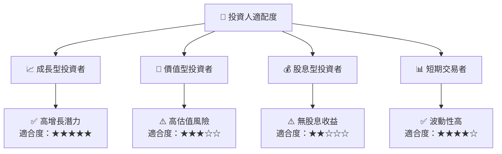

### 10.5 關鍵監控指標

| 監控類型 | 指標 | 關注點 | 頻率 |
|----------|------|--------|------|
| 市場需求 | 電動車銷售數據 | 銷售增長趨勢 | 季度 |
| 技術進展 | 自動駕駛技術 | 技術突破 | 半年 |
| 政府政策 | 補貼與法規 | 政策變化 | 每年 |
| 競爭態勢 | 市場份額變動 | 競爭對手動向 | 季度 |

---

> **免責聲明**：本報告為 AI 自動生成，僅供研究參考，不構成投資建議。投資有風險，入市需謹慎。