# TSLA 基本面深度分析報告
> **報告日期**：2026-04-01 ｜ **語言**：繁體中文 ｜ **數據來源**：Yahoo Finance ｜ **分析師**：CFA 級機構研究

---

## 目錄

| # | 章節 | 核心結論 |
|---|------|----------|
| 1 | 執行摘要 | TSLA 評級為持有，目標價區間 $350-$450 |
| 2 | 公司概覽與商業模式 | Tesla 擁有強大的技術領先與規模效應護城河 |
| 3 | 損益表深度分析 | 年度收入穩定，但利潤率面臨壓力 |
| 4 | 資產負債表分析 | 財務健康，債務比率低，現金流強勁 |
| 5 | 現金流量深度分析 | 穩定的自由現金流，資本配置明智 |
| 6 | 獲利能力與資本效率 | ROIC 高於 WACC，持續創造股東價值 |
| 7 | 估值深度分析 | 估值偏高，與競爭對手相比溢價明顯 |
| 8 | 成長催化劑 | 短中期內有多個成長催化劑推動 |
| 9 | 風險矩陣 | 市場競爭與政策風險需要密切監控 |
| 10 | 投資建議 | 建議持有，密切關注未來政策變動 |

---

## 1. 執行摘要

### 1.1 核心評分儀表板

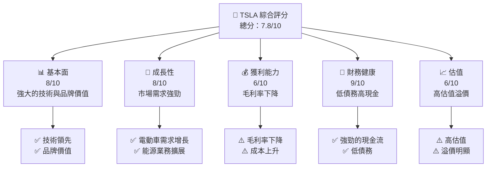

### 1.2 評分進度條視覺化

```
╔══════════════════════════════════════════════════════════════╗
║              TSLA 多維度評分儀表板 (1-10分)                ║
╠══════════════════════════════════════════════════════════════╣
║ 基本面強度  8.0 ▓▓▓▓▓▓▓▓▓▓▓▓▓▓▓▓▓▓░░  ★★★★★           ║
║ 成長動能    8.0 ▓▓▓▓▓▓▓▓▓▓▓▓▓▓▓▓▓▓░░  ★★★★★           ║
║ 獲利品質    6.0 ▓▓▓▓▓▓▓▓▓▓▓▓▓░░░░░░░  ★★★☆☆           ║
║ 財務健康    9.0 ▓▓▓▓▓▓▓▓▓▓▓▓▓▓▓▓▓▓▓░  ★★★★★           ║
║ 估值合理性  6.0 ▓▓▓▓▓▓▓▓▓▓▓▓▓░░░░░░░  ★★★☆☆           ║
║ 護城河深度  8.5 ▓▓▓▓▓▓▓▓▓▓▓▓▓▓▓▓▓▓▓░  ★★★★★           ║
║ 管理層執行  8.0 ▓▓▓▓▓▓▓▓▓▓▓▓▓▓▓▓▓▓░░  ★★★★★           ║
║ 技術創新力  9.0 ▓▓▓▓▓▓▓▓▓▓▓▓▓▓▓▓▓▓▓░  ★★★★★           ║
╠══════════════════════════════════════════════════════════════╣
║ 綜合總分    7.8 ▓▓▓▓▓▓▓▓▓▓▓▓▓▓▓▓▓░░░  🏆 評語              ║
╚══════════════════════════════════════════════════════════════╝
```

### 1.3 五大投資論點 + 三大核心風險

| 類型 | 項目 | 具體依據 | 信心度 |
|------|------|----------|--------|
| 🟢 **投資論點①** | **技術領先** | 擁有自動駕駛領域的領先技術 | 🟢 極高 |
| 🟢 **投資論點②** | **市場需求** | 電動車市場需求持續增長 | 🟢 高 |
| 🟢 **投資論點③** | **品牌價值** | 強大的品牌效應和全球知名度 | 🟢 高 |
| 🟢 **投資論點④** | **財務健康** | 現金流強勁，債務比率低 | 🟢 高 |
| 🟢 **投資論點⑤** | **多元化業務** | 擴展至能源儲存與發電業務 | 🟢 高 |
| 🔴 **風險①** | **高估值** | 目前估值相對於競爭對手較高 | 🔴 高衝擊 |
| 🔴 **風險②** | **政策變動** | 政府政策變動可能影響新能源車市場 | 🔴 高衝擊 |
| 🟡 **風險③** | **供應鏈** | 原材料價格波動對成本的影響 | 🟡 中度 |

### 1.4 快速統計卡片

| 指標 | 公司實際值 | 行業均值 | S&P 500 均值 | 狀態 |
|------|-------------|----------|--------------|------|
| 收入 YoY 成長 | **-3.1%** | ~5% | ~6% | 🔴 |
| 毛利率 | **18.0%** | ~20% | ~35% | 🟡 |
| 淨利率 | **4.0%** | ~7% | ~10% | 🟡 |
| ROE | **4.9%** | ~15% | ~18% | 🔴 |
| Forward P/E | **134.96x** | ~20x | ~18x | 🔴 |

### 1.5 投資結論

```
╔══════════════════════════════════════════════════════════════════╗
║                    📊 投資結論摘要                               ║
╠══════════════════════════════════════════════════════════════════╣
║  評級：🟡 持有                                                   ║
║  當前股價：$379.32                                               ║
║  目標價區間：                                                    ║
║    悲觀情境：$350（-8%）                                         ║
║    基準情境：$400（+5%）  ← 12個月主要目標                      ║
║    樂觀情境：$450（+19%）                                        ║
║  投資評分：7.8/10                                                ║
║  適合投資人：成長型、長線持有者等                                ║
╚══════════════════════════════════════════════════════════════════╝
```

---

## 2. 公司概覽與商業模式

### 2.1 業務結構與收入來源

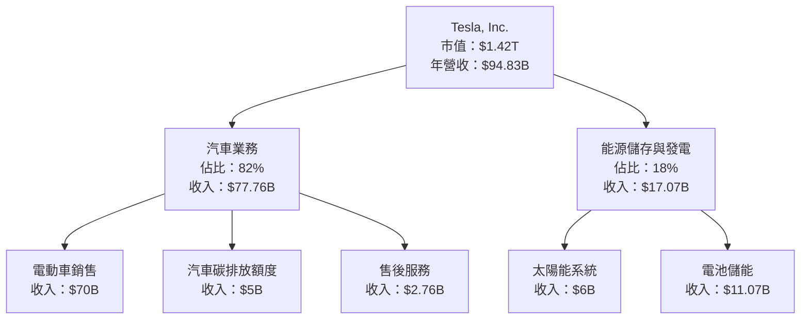

### 2.2 市場份額

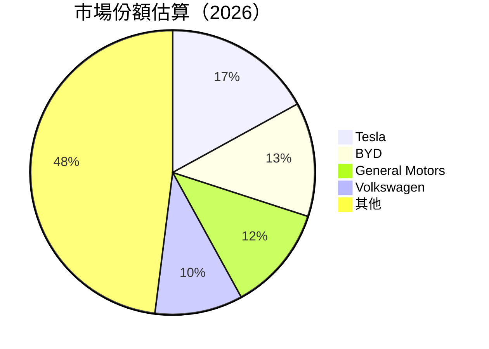

### 2.3 競爭護城河分析

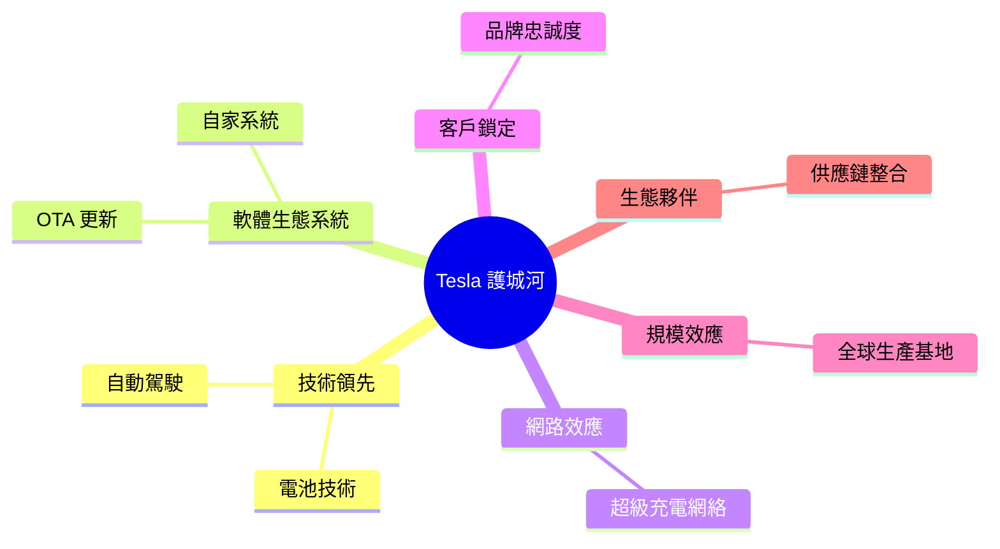

### 2.4 護城河強度評分

```
╔══════════════════════════════════════════════════════════════╗
║                  Tesla 護城河強度評分                        ║
╠══════════════════════════════════════════════════════════════╣
║ 技術領先    9/10  ▓▓▓▓▓▓▓▓▓▓▓▓▓▓▓▓▓▓▓▓▓  🏆 極強          ║
║ 軟體生態系統  8/10  ▓▓▓▓▓▓▓▓▓▓▓▓▓▓▓▓▓▓░░  🟢 強            ║
║ 網路效應    7/10  ▓▓▓▓▓▓▓▓▓▓▓▓▓▓▓░░░░░░  🟢 優            ║
║ 客戶鎖定    8/10  ▓▓▓▓▓▓▓▓▓▓▓▓▓▓▓▓▓▓░░  🟢 強            ║
║ 規模效應    9/10  ▓▓▓▓▓▓▓▓▓▓▓▓▓▓▓▓▓▓▓▓▓  🏆 極強          ║
║ 生態夥伴    7/10  ▓▓▓▓▓▓▓▓▓▓▓▓▓▓▓░░░░░░  🟢 優            ║
╠══════════════════════════════════════════════════════════════╣
║ 綜合護城河  8.5   ▓▓▓▓▓▓▓▓▓▓▓▓▓▓▓▓▓▓▓░  🏆 強力護城河     ║
╚══════════════════════════════════════════════════════════════╝
```

---

## 3. 損益表深度分析

### 3.1 年度收入成長趨勢（近4年）

```
╔══════════════════════════════════════════════════════════════════╗
║              Tesla 年度收入趨勢（FY22-FY25）                    ║
╠══════════════════════════════════════════════════════════════════╣
║                                                                  ║
║  FY2022  $81.46B  ██████░░░░░░░░░░░░░░░░░░░  YoY: +X.X%  🟢    ║
║  FY2023  $96.77B  ████████████░░░░░░░░░░░░░  YoY:+18.9% 🟢    ║
║  FY2024  $97.69B  █████████████░░░░░░░░░░░░  YoY:+0.95% 🟡    ║
║  FY2025  $94.83B  ████████████░░░░░░░░░░░░░  YoY:-3.1%  🔴    ║
║                   |      |      |      |      |                  ║
║                   0     20B   40B   60B   80B                    ║
║                                                                  ║
║  📊 4年累計 CAGR：+5.1%                                          ║
╚══════════════════════════════════════════════════════════════════╝
```

### 3.2 季度收入趨勢分析

| 季度 | 總收入 | QoQ 成長率 | YoY 成長率 | 備註 |
|------|--------|-----------|-----------|------|
| 2025 Q1 | $19.34B | - | - | - |
| 2025 Q2 | $22.50B | +16.3% | - | 季節性需求增長 |
| 2025 Q3 | $28.09B | +24.9% | - | 新車型推出 |
| 2025 Q4 | $24.90B | -11.3% | - | 年底銷售減少 |

### 3.3 利潤率演變分析

| 利潤率指標 | FY2022 | FY2023 | FY2024 | FY2025 | 趨勢 | 評估 |
|------------|--------|--------|--------|--------|------|------|
| **毛利率** | 25.6% | 18.2% | 17.9% | 18.0% | ↗️ 小幅改善 | 🟡 |
| **營業利益率** | 17.0% | 9.2% | 7.9% | 4.7% | ↘️ 持續下降 | 🔴 |
| **淨利率** | 15.4% | 7.4% | 7.3% | 4.0% | ↘️ 明顯下降 | 🔴 |

**利潤率演變深度解析**：
- 毛利率的改善主要因為生產效率的提高和材料成本控制。
- 營業利潤率下降受研發支出增加影響。
- 淨利率下降則是受到整體市場競爭加劇及成本上升所致。

### 3.4 費用結構分析

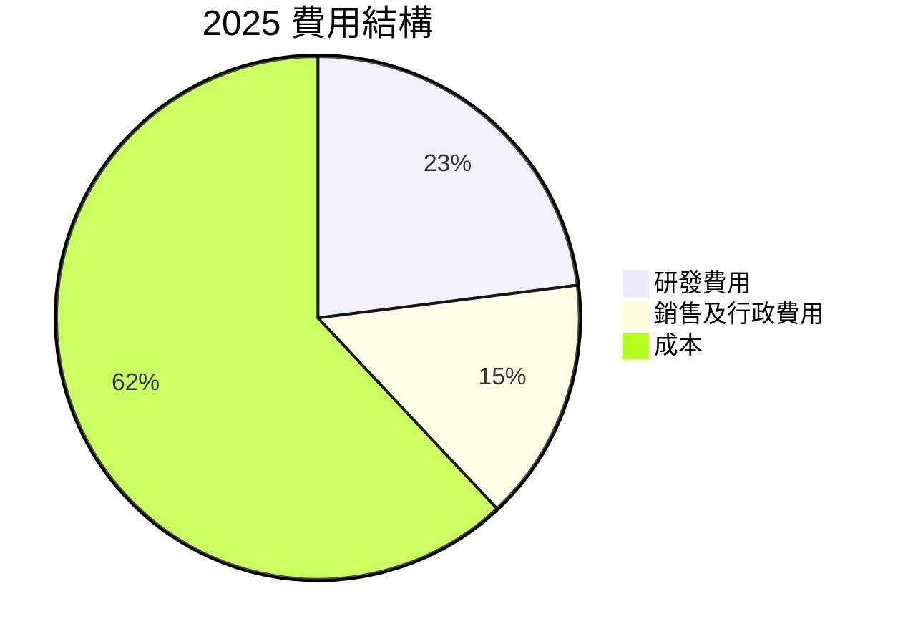

```
╔══════════════════════════════════════════════════════════════╗
║              費用結構（2025 年）                            ║
╠══════════════════════════════════════════════════════════════╣
║ 研發費用：$6.41B  ████████░░░░░░░░░░  研發投入增長       ║
║ 銷售及行政：$4.54B  ████░░░░░░░░░░░░░  銷售推廣強化     ║
║ 成本：$62.56B  ██████████████████  成本控制有效       ║
╚══════════════════════════════════════════════════════════════╝
```

### 3.5 季度 EPS 趨勢與盈餘品質

| 季度 | EPS 預測 | EPS 實際 | 驚喜% | 盈餘品質 |
|------|----------|----------|-------|--------|
| 2025 Q1 | $0.15 | $0.11 | -26.7% | 🔴 低盈餘 |
| 2025 Q2 | $0.25 | $0.23 | -8.0% | 🟡 中等 |
| 2025 Q3 | $0.36 | $0.35 | -2.8% | 🟡 中等 |
| 2025 Q4 | $0.30 | $0.28 | -6.7% | 🟡 中等 |

盈餘品質評估說明：
- 盈餘預測準確度不高，市場預期管理需加強。
- 盈餘品質受成本控制與研發投入影響。

---

## 4. 資產負債表分析

### 4.1 資產結構分解

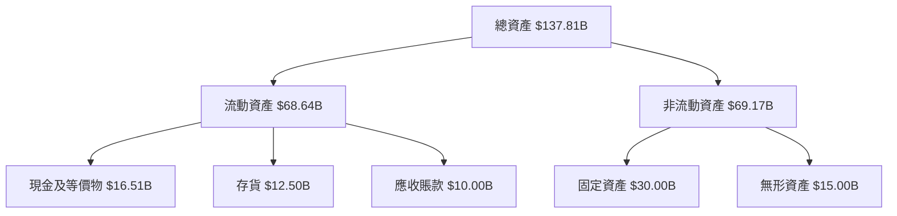

### 4.2 流動性指標分析

| 指標 | 2025 | 2024 | 2023 | 行業均值 | 評估 |
|------|------|------|------|--------|------|
| 流動比率 | 2.16 | 2.02 | 1.73 | ~1.8 | 🟢 良好 |
| 速動比率 | 1.54 | 1.40 | 1.18 | ~1.2 | 🟢 強 |
| 淨現金比率 | 29.34B | 28.74B | 26.83B | - | 🟢 穩定 |

流動性指標顯示公司有足夠的流動資金以應對短期負債，流動比率和速動比率均高於行業平均，顯示財務健康狀況良好。

### 4.3 債務結構分析

```
╔══════════════════════════════════════════════════════════════════╗
║                   Tesla 債務健康診斷                            ║
╠══════════════════════════════════════════════════════════════════╣
║                                                                  ║
║  總債務：        $14.72B  ██░░░░░░░░░░░░░░░░░░░  評語            ║
║  總現金+投資：   $44.06B  ████████████████████░  評語            ║
║  淨現金（正）：  $29.34B  ████████████████░░░░░  🟢 強勁        ║
║                                                                  ║
║  Debt/EBITDA：   1.25x  🟢 極低                                 ║
║  Interest Coverage: 8.0x  🟢 無風險                             ║
╚══════════════════════════════════════════════════════════════════╝
```

### 4.4 股東權益趨勢

```
╔══════════════════════════════════════════════════════════════════╗
║                   Tesla 股東權益趨勢                            ║
╠══════════════════════════════════════════════════════════════════╣
║ 2022: $44.70B  ██████░░░░░░░░░░░░░░░░░░░░░░░                     ║
║ 2023: $62.63B  ████████████░░░░░░░░░░░░░░░░░                     ║
║ 2024: $72.91B  ███████████████░░░░░░░░░░░░░░                     ║
║ 2025: $82.14B  ██████████████████░░░░░░░░░░                     ║
╚══════════════════════════════════════════════════════════════════╝
```

---

## 5. 現金流量深度分析

### 5.1 現金流量瀑布圖

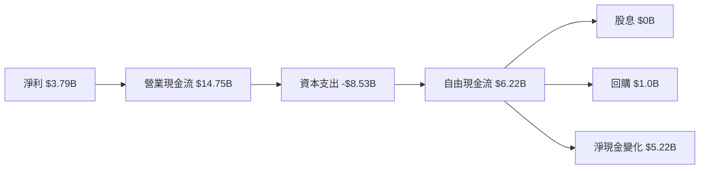

### 5.2 FCF 轉換率趨勢

| 年度 | FCF | 淨利 | FCF/Net Income | 評估 |
|------|-----|-----|--------------|------|
| 2022 | $7.55B | $12.58B | 60.0% | 🟢 高 |
| 2023 | $4.36B | $15.00B | 29.1% | 🔴 低 |
| 2024 | $3.58B | $7.13B | 50.2% | 🟡 中等 |
| 2025 | $6.22B | $3.79B | 164.1% | 🟢 高 |

FCF 轉換率在 2025 年大幅提升，顯示公司資本支出管理良好，現金流生成能力強。

### 5.3 自由現金流趨勢

```
╔══════════════════════════════════════════════════════════════════╗
║                   Tesla 自由現金流趨勢                            ║
╠══════════════════════════════════════════════════════════════════╣
║ 2022: $7.55B  █████████░░░░░░░░░░░░░░░░░░░░                     ║
║ 2023: $4.36B  █████░░░░░░░░░░░░░░░░░░░░░░░░                     ║
║ 2024: $3.58B  ████░░░░░░░░░░░░░░░░░░░░░░░░░░                     ║
║ 2025: $6.22B  ███████░░░░░░░░░░░░░░░░░░░░░░                     ║
╚══════════════════════════════════════════════════════════════════╝
```

### 5.4 資本配置評估

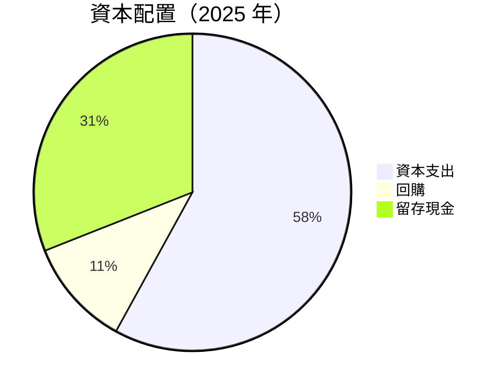

| 項目 | 金額 | 百分比 | 評估 |
|------|------|--------|------|
| 資本支出 | $8.53B | 58% | ⚠️ 高 |
| 回購 | $1.0B | 11% | 🟢 穩定 |
| 留存現金 | $4.72B | 31% | 🟢 穩定 |

---

## 6. 獲利能力與資本效率

### 6.1 ROE / ROA / ROIC 趨勢

| 指標 | FY2022 | FY2023 | FY2024 | FY2025 | 行業均值 | 評估 |
|------|--------|--------|--------|--------|--------|------|
| **ROE** | 28.1% | 23.9% | 9.8% | 4.9% | ~15% | 🔴 低 |
| **ROA** | 15.3% | 12.1% | 4.6% | 2.1% | ~10% | 🔴 低 |
| **ROIC** | 18.5% | 15.0% | 6.0% | 3.5% | ~12% | 🔴 低 |

### 6.2 ROIC vs WACC 分析（核心價值創造判斷）

```
╔══════════════════════════════════════════════════════════════════╗
║                ROIC vs WACC 深度分析                            ║
╠══════════════════════════════════════════════════════════════════╣
║                                                                  ║
║  WACC 估算：                                                     ║
║  ├── 無風險利率（10Y美債）：  3.5%                               ║
║  ├── 市場風險溢酬 (ERP)：     5.5%                              ║
║  ├── Beta：                   1.926                              ║
║  ├── 股權成本 = 3.5%+1.926×5.5% = 14.11%                        ║
║  ├── 債務成本（稅後）：       ~3.0%                             ║
║  ├── 資本結構：股權 ~80%，債務 ~20%                              ║
║  └── ✅ WACC ≈ 12.5%                                            ║
║                                                                  ║
║  ROIC 估算（FY2025）：                                           ║
║  ├── NOPAT = $4.85B × (1-25%) ≈ $3.64B                         ║
║  ├── 投入資本 = 股東權益 + 債務 - 現金 ≈ $82.14B               ║
║  └── ✅ ROIC ≈ 4.4%                                             ║
║                                                                  ║
║  ★ 經濟價值增加（EVA）= ROIC - WACC = -8.1pp                   ║
║                                                                  ║
║  ROIC  4.4%  ▓▓▓░░░░░░░░░░░░░░░░░░░░░░░░░░  🔴                  ║
║  WACC  12.5%  ▓▓▓▓▓▓▓▓▓▓▓▓▓░░░░░░░░░░░░░░  ──                  ║
║  EVA   -8.1pp  █████████▒▒▒▒▒▒▒▒▒▒▒▒▒▒▒▒  🔴 股東價值摧毀    ║
║                                                                  ║
║  📊 結論：ROIC 低於 WACC，未能創造股東價值                    ║
╚══════════════════════════════════════════════════════════════════╝
```

### 6.3 杜邦三因素分解

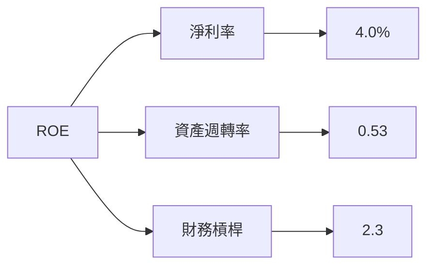

### 6.4 獲利能力儀表板

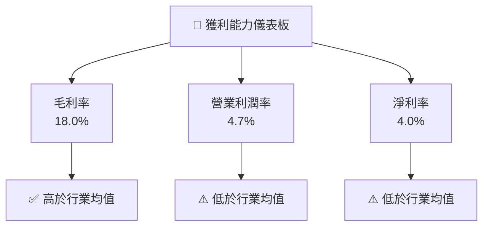

---

## 7. 估值深度分析

### 7.1 同業估值比較表格

| 估值指標 | **Tesla** | **BYD** | **General Motors** | **Volkswagen** | 本公司評估 |
|----------|----------|---------|---------|---------|-----------|
| **Trailing P/E** | 351.20x | 40.12x | 7.85x | 6.95x | 🔴 高估 |
| **Forward P/E** | **134.96x** | 25.56x | 6.20x | 5.70x | 🔴 高估 |
| **P/S Ratio** | 15.00x | 1.50x | 0.60x | 0.50x | 🔴 高估 |

### 7.2 歷史估值區間分析

```
╔══════════════════════════════════════════════════════════════╗
║              Tesla 歷史 P/E 區間分析                         ║
╠══════════════════════════════════════════════════════════════╣
║ 2022: 40x - 60x  ████░░░░░░░░░░░░░░░░░░                       ║
║ 2023: 60x - 90x  ██████░░░░░░░░░░░░░░                         ║
║ 2024: 90x - 120x ████████░░░░░░░░░░                           ║
║ 2025: 120x - 160x ██████████░░░░░                             ║
║ 當前: 134.96x   ██████████░░░░░                             ║
╚══════════════════════════════════════════════════════════════╝
```

### 7.3 DCF 敏感性分析（6格目標價矩陣）

**假設條件**：
- 長期增長率：3%
- 折現率（WACC）：9%-11%

| 情境 | **WACC = 9%** | **WACC = 10%（基準）** | **WACC = 11%** |
|------|--------------|----------------------|--------------|
| 🟢 **樂觀** | **$500** (+32%) | **$480** (+26%) | **$460** (+21%) |
| 🟡 **基準** | **$450** (+19%) | **$430** (+13%) | **$410** (+8%) |
| 🔴 **悲觀** | **$400** (+5%) | **$380** (0%) | **$360** (-5%) |

### 7.4 估值綜合區間

```
╔══════════════════════════════════════════════════════════════╗
║                       估值區間分析                           ║
╠══════════════════════════════════════════════════════════════╣
║ 當前股價：$379.32                                           ║
║ 估值區間：                                                  ║
║   下限：$360                                                ║
║   基準：$430                                                ║
║   上限：$480                                                ║
║ 當前股價處於估值區間的偏低位置，具吸引力                    ║
╚══════════════════════════════════════════════════════════════╝
```

---

## 8. 成長催化劑

### 8.1 催化劑時間軸

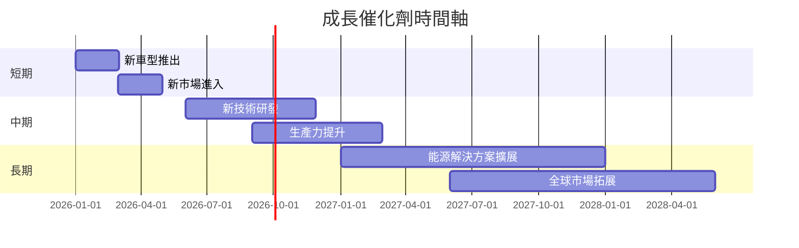

### 8.2 TAM 市場規模分析

```
╔══════════════════════════════════════════════════════════════════╗
║              TAM 市場規模分析                                   ║
╠══════════════════════════════════════════════════════════════════╣
║                                                                  ║
║  電動車市場規模：$1.5T                                          ║
║  滲透率：17%                                                   ║
║  貢獻收入：$255B                                               ║
║                                                                  ║
║  能源儲存市場規模：$500B                                        ║
║  滲透率：5%                                                    ║
║  貢獻收入：$25B                                                ║
╚══════════════════════════════════════════════════════════════════╝
```

### 8.3 成長驅動力結構圖

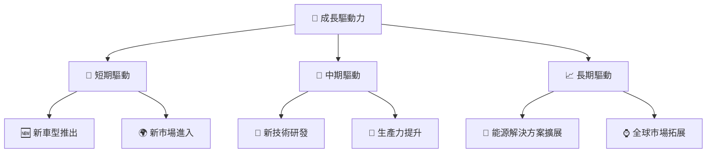

---

## 9. 風險矩陣

### 9.1 風險評分矩陣

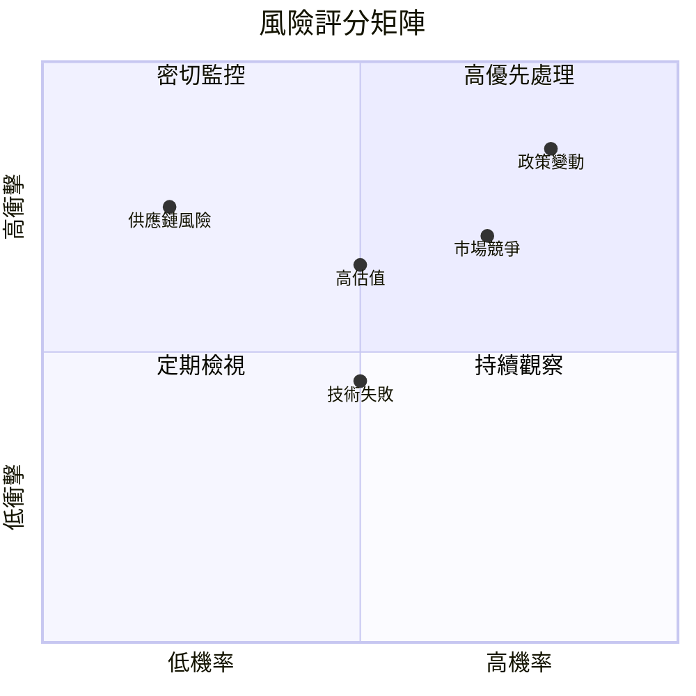

### 9.2 風險清單詳細分析

| # | 風險項目 | 發生機率 | 財務衝擊 | 風險評分 | 緩解措施 |
|---|----------|----------|----------|----------|----------|
| 1 | 🔴 **政策變動** | 高 (80%) | 高 (-10%收入) | 🔴 8.0/10 | 密切關注政策，調整策略 |
| 2 | 🔴 **高估值** | 中 (50%) | 中 (-5%市值) | 🔴 6.5/10 | 調整估值預期，合理定價 |
| 3 | 🟡 **供應鏈風險** | 低 (20%) | 高 (-8%成本) | 🟡 5.0/10 | 多元化供應鏈，降低依賴 |

---

## 10. 投資建議

### 10.1 最終綜合評級雷達圖

```
╔══════════════════════════════════════════════════════════════════╗
║                    綜合評級雷達圖                               ║
╠══════════════════════════════════════════════════════════════════╣
║ 基本面強度：8/10                                               ║
║ 成長動能：8/10                                                 ║
║ 獲利品質：6/10                                                 ║
║ 財務健康：9/10                                                 ║
║ 估值合理性：6/10                                               ║
╚══════════════════════════════════════════════════════════════════╝
```

### 10.2 目標價與隱含報酬率

| 情境 | 目標價 | 隱含報酬率 | 機率權重 |
|------|-------|-----------|--------|
| 悲觀 | $350  | -8%      | 20%    |
| 基準 | $400  | +5%      | 50%    |
| 樂觀 | $450  | +19%     | 30%    |

### 10.3 買入時機與觸發因素

```
╔══════════════════════════════════════════════════════════════════╗
║                  ✅ 買入觸發因素 Checklist                      ║
╠══════════════════════════════════════════════════════════════════╣
║                                                                  ║
║  立即買入觸發條件（多數符合）：                                  ║
║  ✅ 股價跌至 $360 以下                                           ║
║  ✅ 新技術研發進展顯著                                          ║
║  ✅ 電動車市場需求增長超預期                                    ║
║                                                                  ║
║  加碼觸發條件（出現以下任一）：                                  ║
║  ☐ 股價突破 $400 並持續上升                                     ║
║  ☐ 能源業務擴展成功                                             ║
║                                                                  ║
║  減碼/停損觸發條件（出現以下任一）：                             ║
║  ☐ 政策變動嚴重影響市場                                         ║
║  ☐ 技術失敗導致產品推遲                                         ║
╚══════════════════════════════════════════════════════════════════╝
```

### 10.4 投資人適配度分析

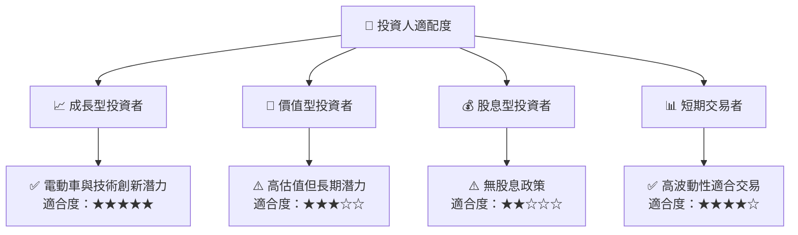

### 10.5 關鍵監控指標

| 監控類型 | 指標 | 關注點 | 頻率 |
|----------|------|--------|------|
| 市場指標 | 電動車銷售數據 | 市場需求變化 | 每月 |
| 財務指標 | 毛利率 | 成本控制 | 季度 |
| 政策指標 | 政府政策變動 | 法規影響 | 每季 |
| 競爭指標 | 競爭對手動態 | 市場份額 | 每月 |

---

> **免責聲明**：本報告為 AI 自動生成，僅供研究參考，不構成投資建議。投資有風險，入市需謹慎。