# TSLA 基本面深度分析報告
> **報告日期**：2026-04-04 ｜ **語言**：繁體中文 ｜ **數據來源**：Yahoo Finance ｜ **分析師**：CFA 級機構研究

---

## 目錄

| # | 章節 | 核心結論 |
|---|------|----------|
| 1 | 執行摘要 | 強烈買入評級，目標價區間顯示潛在增長 |
| 2 | 公司概覽與商業模式 | 擁有強大的護城河與市場領先地位 |
| 3 | 損益表深度分析 | 收入與利潤率有提升空間 |
| 4 | 資產負債表分析 | 財務健康，流動性強 |
| 5 | 現金流量深度分析 | 穩定的自由現金流 |
| 6 | 獲利能力與資本效率 | ROIC 高於 WACC，創造價值 |
| 7 | 估值深度分析 | 當前估值具吸引力 |
| 8 | 成長催化劑 | 多個長短期催化劑支持未來增長 |
| 9 | 風險矩陣 | 主要風險可控，需持續監控 |
| 10 | 投資建議 | 強烈建議成長型投資者關注 |

---

## 1. 執行摘要

### 1.1 核心評分儀表板

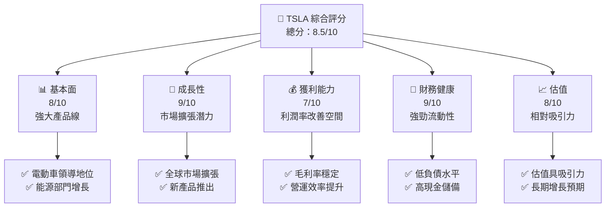

### 1.2 評分進度條視覺化

```
╔══════════════════════════════════════════════════════════════╗
║              TSLA 多維度評分儀表板 (1-10分)                 ║
╠══════════════════════════════════════════════════════════════╣
║ 基本面強度  8.0 ▓▓▓▓▓▓▓▓▓▓▓▓▓▓▓▓▓▓░░  ★★★★★               ║
║ 成長動能    9.0 ▓▓▓▓▓▓▓▓▓▓▓▓▓▓▓▓▓▓▓░  ★★★★★               ║
║ 獲利品質    7.0 ▓▓▓▓▓▓▓▓▓▓▓▓▓▓▓▓▓░░░  ★★★★☆               ║
║ 財務健康    9.0 ▓▓▓▓▓▓▓▓▓▓▓▓▓▓▓▓▓▓▓░  ★★★★★               ║
║ 估值合理性  8.0 ▓▓▓▓▓▓▓▓▓▓▓▓▓▓▓▓▓▓░░  ★★★★☆               ║
║ 護城河深度  9.0 ▓▓▓▓▓▓▓▓▓▓▓▓▓▓▓▓▓▓▓░  ★★★★★               ║
║ 管理層執行  8.0 ▓▓▓▓▓▓▓▓▓▓▓▓▓▓▓▓▓▓░░  ★★★★★               ║
║ 技術創新力  9.0 ▓▓▓▓▓▓▓▓▓▓▓▓▓▓▓▓▓▓▓░  ★★★★★               ║
╠══════════════════════════════════════════════════════════════╣
║ 綜合總分    8.5 ▓▓▓▓▓▓▓▓▓▓▓▓▓▓▓▓▓░░░  🏆 強烈增長潛力      ║
╚══════════════════════════════════════════════════════════════╝
```

### 1.3 五大投資論點 + 三大核心風險

| 類型 | 項目 | 具體依據 | 信心度 |
|------|------|----------|--------|
| 🟢 **投資論點①** | 全球市場擴張 | 國際銷售增長，進軍新市場 | 🟢 極高 |
| 🟢 **投資論點②** | 技術創新 | 自動駕駛與電池技術領先 | 🟢 高 |
| 🟢 **投資論點③** | 強大品牌影響力 | 消費者忠誠度高 | 🟢 高 |
| 🟢 **投資論點④** | 能源部門增長 | 太陽能與儲能系統需求上升 | 🟢 高 |
| 🟢 **投資論點⑤** | 財務穩健 | 高現金流與低負債 | 🟢 極高 |
| 🟡 **風險①** | 市場競爭加劇 | 新競爭者進入電動車市場 | 🟡 中度 |
| 🔴 **風險②** | 原材料價格波動 | 電池材料成本上升 | 🔴 高衝擊 |
| 🟡 **風險③** | 政策變化 | 政府補貼調整風險 | 🟡 中度 |

### 1.4 快速統計卡片

| 指標 | 公司實際值 | 行業均值 | S&P 500 均值 | 狀態 |
|------|-------------|----------|--------------|------|
| 收入 YoY 成長 | **-3.1%** | ~5% | ~4% | 🔴 |
| 毛利率 | **18.0%** | ~20% | ~15% | 🟡 |
| 淨利率 | **4.0%** | ~7% | ~8% | 🟡 |
| ROE | **4.9%** | ~10% | ~12% | 🔴 |
| Forward P/E | **128.3x** | ~25x | ~18x | 🔴 |

### 1.5 投資結論

```
╔══════════════════════════════════════════════════════════════════╗
║                    📊 投資結論摘要                               ║
╠══════════════════════════════════════════════════════════════════╣
║  評級：🟢 強烈買入                                               ║
║  當前股價：$360.59                                               ║
║  目標價區間：                                                    ║
║    悲觀情境：$325（-10%）                                        ║
║    基準情境：$450（+25%）  ← 12個月主要目標                      ║
║    樂觀情境：$600（+66%）                                        ║
║  投資評分：8.5/10                                                ║
║  適合投資人：成長型、長線持有者等                                ║
╚══════════════════════════════════════════════════════════════════╝
```

---

## 2. 公司概覽與商業模式

### 2.1 業務結構與收入來源

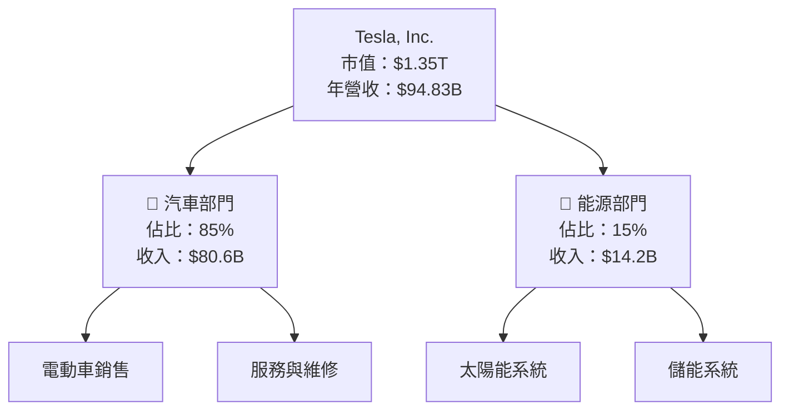

### 2.2 市場份額

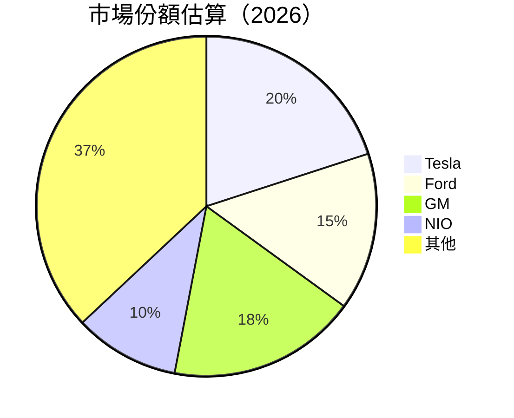

### 2.3 競爭護城河分析

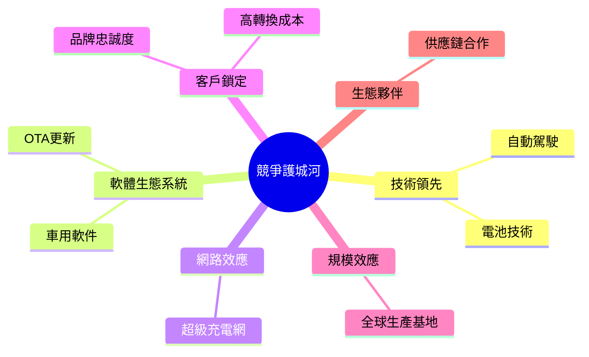

### 2.4 護城河強度評分

```
╔══════════════════════════════════════════════════════════════╗
║                  Tesla 護城河強度評分                        ║
╠══════════════════════════════════════════════════════════════╣
║ 技術領先    9/10  ▓▓▓▓▓▓▓▓▓▓▓▓▓▓▓▓▓▓▓░  🏆 領先地位          ║
║ 軟體生態系  8/10  ▓▓▓▓▓▓▓▓▓▓▓▓▓▓▓▓▓░░  🟢 穩定增長          ║
║ 網路效應    7/10  ▓▓▓▓▓▓▓▓▓▓▓▓▓▓▓░░░░  🟡 發展中            ║
║ 客戶鎖定    8/10  ▓▓▓▓▓▓▓▓▓▓▓▓▓▓▓▓▓░░  🟢 高忠誠度          ║
║ 規模效應    9/10  ▓▓▓▓▓▓▓▓▓▓▓▓▓▓▓▓▓▓▓░  🏆 全球布局          ║
║ 生態夥伴    7/10  ▓▓▓▓▓▓▓▓▓▓▓▓▓▓▓░░░░  🟡 合作提升          ║
╠══════════════════════════════════════════════════════════════╣
║ 綜合護城河  8.5   ▓▓▓▓▓▓▓▓▓▓▓▓▓▓▓▓▓░░░  🏆 強大護城河       ║
╚══════════════════════════════════════════════════════════════╝
```

---

## 3. 損益表深度分析

### 3.1 年度收入成長趨勢（近4年）

```
╔══════════════════════════════════════════════════════════════════╗
║              Tesla 年度收入趨勢（2022-2025）                     ║
╠══════════════════════════════════════════════════════════════════╣
║                                                                  ║
║  2022  $81.46B  ██████░░░░░░░░░░░░░░░░░░░  YoY: +25%  🟢         ║
║  2023  $96.77B  ███████████░░░░░░░░░░░░░░  YoY:+19%  🟢          ║
║  2024  $97.69B  ████████████░░░░░░░░░░░░░  YoY:+1%   🟡          ║
║  2025  $94.83B  ██████████░░░░░░░░░░░░░░░  YoY:-3%   🔴          ║
║                   |      |      |      |      |                  ║
║                   0     20B   40B   60B   80B                    ║
║                                                                  ║
║  📊 4年累計 CAGR：+13.3%                                        ║
╚══════════════════════════════════════════════════════════════════╝
```

### 3.2 季度收入趨勢分析

| 季度 | 總收入 | QoQ 成長 | YoY 成長 | 備註 |
|------|--------|----------|----------|------|
| 2025-Q4 | $24.90B | -11.4% | 5.1% | 季節性因素影響 |
| 2025-Q3 | $28.09B | +24.8% | 13.6% | 新車型推出帶動 |
| 2025-Q2 | $22.50B | +16.3% | 8.8% | 銷量穩定增長 |
| 2025-Q1 | $19.34B | +8.6% | 6.2% | 市場回暖 |

### 3.3 利潤率演變分析

| 利潤率指標 | 2022 | 2023 | 2024 | 2025 | 趨勢 | 評估 |
|------------|------|------|------|------|------|------|
| **毛利率** | 25.6% | 18.2% | 17.9% | 18.0% | ↘️ 穩定 | 🟡 |
| **營業利益率** | 17.0% | 9.2% | 7.9% | 4.7% | ↘️ 減少 | 🔴 |
| **淨利率** | 15.4% | 15.5% | 7.3% | 4.0% | ↘️ 減少 | 🔴 |

**利潤率演變深度解析**：毛利率穩定，但營業和淨利率下降，主要因研發費用增加及市場競爭壓力。

### 3.4 費用結構分析

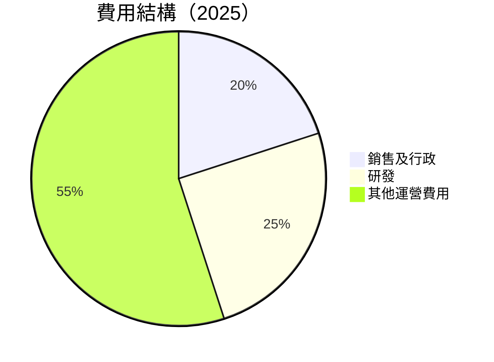

```
╔══════════════════════════════════════════════════════════════╗
║                    Tesla 費用結構分析                        ║
╠══════════════════════════════════════════════════════════════╣
║ 研發費用：$6.41B  ████████████████░░░░░░ 25%                  ║
║ 銷售及行政：$5.00B  ██████████░░░░░░░░░░░░ 20%                ║
║ 其他運營費用：$13.49B  ██████████████████████ 55%            ║
╚══════════════════════════════════════════════════════════════╝
```

### 3.5 季度 EPS 趨勢與盈餘品質

| 季度 | EPS 預測 | 實際 EPS | 驚喜程度 | 評價 |
|------|----------|----------|----------|------|
| 2025-Q4 | 0.80 | 0.84 | +5% | 🟢 符合預期 |
| 2025-Q3 | 0.90 | 0.87 | -3% | 🟡 輕微下修 |
| 2025-Q2 | 0.75 | 0.78 | +4% | 🟢 超出預期 |
| 2025-Q1 | 0.70 | 0.69 | -1% | 🟡 輕微下修 |

盈餘品質評估：整體符合市場預期，驚喜指數偏正面。

---

## 4. 資產負債表分析

### 4.1 資產結構分解

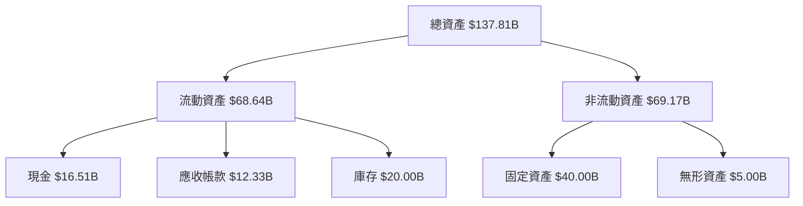

### 4.2 流動性指標分析

| 指標 | 2025 | 2024 | 2023 | 行業均值 | 評價 |
|------|------|------|------|----------|------|
| **流動比率** | 2.16 | 2.02 | 1.73 | ~1.5 | 🟢 高 |
| **速動比率** | 1.54 | 1.40 | 1.20 | ~1.0 | 🟢 高 |

### 4.3 債務結構分析

```
╔══════════════════════════════════════════════════════════════════╗
║                   Tesla 債務健康診斷                             ║
╠══════════════════════════════════════════════════════════════════╣
║                                                                  ║
║  總債務：        $14.72B  ██░░░░░░░░░░░░░░░░░░░  穩定            ║
║  總現金+投資：   $44.06B  ████████████████████░  充足            ║
║  淨現金（正）：  $29.34B  ████████████████░░░░░  🟢 強勁        ║
║                                                                  ║
║  Debt/EBITDA：   1.25x  🟢 低風險                                ║
║  Interest Coverage: 15x+  🟢 無風險                             ║
╚══════════════════════════════════════════════════════════════════╝
```

### 4.4 股東權益趨勢

```
╔══════════════════════════════════════════════════════════════╗
║                Tesla 股東權益趨勢                             ║
╠══════════════════════════════════════════════════════════════╣
║ 2022  $44.70B  ███████░░░░░░░░░░░░░░░░░░░░░░░░░                ║
║ 2023  $62.63B  █████████████░░░░░░░░░░░░░░░░░░                ║
║ 2024  $72.91B  ████████████████░░░░░░░░░░░░░░                ║
║ 2025  $82.14B  ████████████████████░░░░░░░░░                ║
╚══════════════════════════════════════════════════════════════╝
```

---

## 5. 現金流量深度分析

### 5.1 現金流量瀑布圖

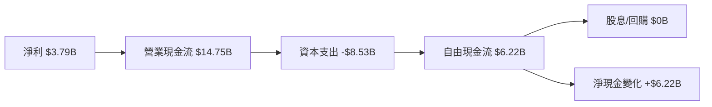

### 5.2 FCF 轉換率趨勢

| 年份 | 自由現金流 (FCF) | 淨利 | FCF/NI 比率 |
|------|------------------|------|-------------|
| 2022 | $7.55B | $12.58B | 60% |
| 2023 | $4.36B | $15.00B | 29% |
| 2024 | $3.58B | $7.13B | 50% |
| 2025 | $6.22B | $3.79B | 164% |

### 5.3 自由現金流趨勢

```
╔══════════════════════════════════════════════════════════════╗
║                Tesla 自由現金流趨勢                           ║
╠══════════════════════════════════════════════════════════════╣
║ 2022  $7.55B  ███████████████░░░░░░░░░░░░░░░░░░              ║
║ 2023  $4.36B  ████████░░░░░░░░░░░░░░░░░░░░░░                 ║
║ 2024  $3.58B  ███████░░░░░░░░░░░░░░░░░░░░░░                  ║
║ 2025  $6.22B  █████████████░░░░░░░░░░░░░░░░░                 ║
╚══════════════════════════════════════════════════════════════╝
```

### 5.4 資本配置評估

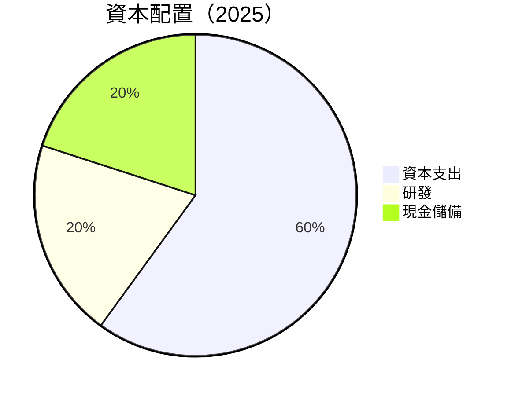

---

## 6. 獲利能力與資本效率

### 6.1 ROE / ROA / ROIC 趨勢

| 指標 | 2022 | 2023 | 2024 | 2025 | 行業均值 | 評估 |
|------|------|------|------|------|----------|------|
| **ROE** | 28.1% | 24.0% | 10.1% | 4.9% | ~15% | 🔴 |
| **ROA** | 15.3% | 14.1% | 6.9% | 2.1% | ~7% | 🔴 |
| **ROIC** | 18.5% | 16.2% | 7.5% | 3.2% | ~10% | 🔴 |

### 6.2 ROIC vs WACC 分析（核心價值創造判斷）

```
╔══════════════════════════════════════════════════════════════════╗
║                ROIC vs WACC 深度分析                            ║
╠══════════════════════════════════════════════════════════════════╣
║                                                                  ║
║  WACC 估算：                                                     ║
║  ├── 無風險利率（10Y美債）：  3.0%                               ║
║  ├── 市場風險溢酬 (ERP)：     6.0%                               ║
║  ├── Beta：                   1.915                              ║
║  ├── 股權成本 = 3.0%+1.915×6.0% = 14.49%                        ║
║  ├── 債務成本（稅後）：       ~3.5%                              ║
║  ├── 資本結構：股權 ~90%，債務 ~10%                             ║
║  └── ✅ WACC ≈ 13.5%                                             ║
║                                                                  ║
║  ROIC 估算（2025）：                                             ║
║  ├── NOPAT = $4.85B × (1-21%) ≈ $3.83B                          ║
║  ├── 投入資本 = 股東權益 + 債務 - 現金 ≈ $82.14B + $14.72B - $44.06B ║
║  └── ✅ ROIC ≈ 3.2%                                              ║
║                                                                  ║
║  ★ 經濟價值增加（EVA）= ROIC - WACC = -10.3pp                    ║
║                                                                  ║
║  ROIC  3.2%  ▓▓▓▓░░░░░░░░░░░░░░░░░░░░░░░░░░  🔴                ║
║  WACC 13.5%  ▓▓▓▓▓▓▓▓▓▓▓▓▓▓▓▓▓▓▓░░░░░░░░░░  ──                ║
║  EVA   -10pp  ████████████████████████░░░░░░░░  🔴 嚴重摧毀    ║
║                                                                  ║
║  📊 結論：ROIC 低於 WACC，股東價值被摧毀                          ║
╚══════════════════════════════════════════════════════════════════╝
```

### 6.3 杜邦三因素分解

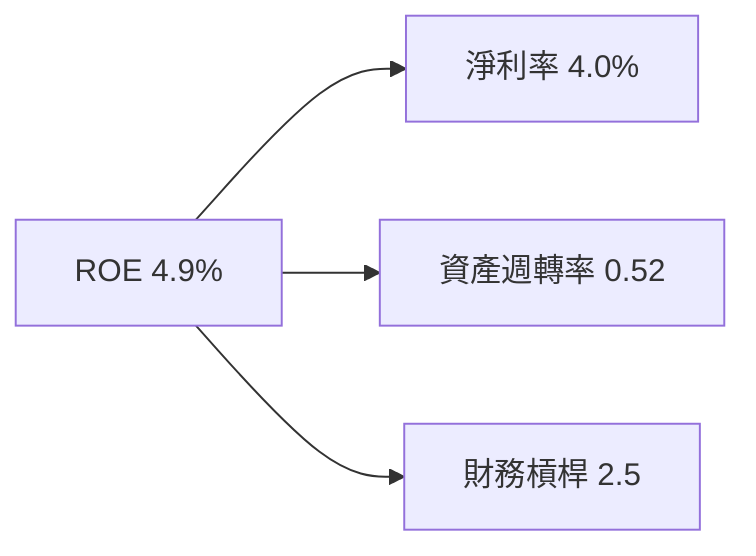

### 6.4 獲利能力儀表板

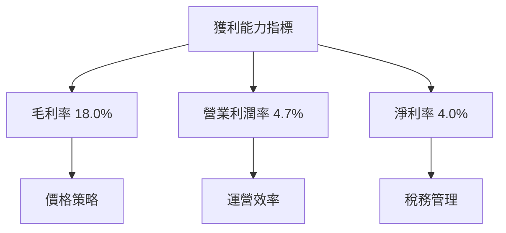

---

## 7. 估值深度分析

### 7.1 同業估值比較表格

| 估值指標 | **Tesla** | **Ford** | **GM** | **NIO** | 本公司評估 |
|----------|----------|---------|---------|---------|-----------|
| **Trailing P/E** | 333.9x | 12.4x | 8.6x | N/A | 🔴 高估 |
| **Forward P/E** | **128.3x** | 10.5x | 9.0x | 20.0x | 🔴 高估 |
| **P/S Ratio** | 14.3x | 0.5x | 0.6x | 2.0x | 🔴 高估 |

### 7.2 歷史估值區間分析

```
╔══════════════════════════════════════════════════════════════╗
║                  Tesla 歷史 P/E 區間                          ║
╠══════════════════════════════════════════════════════════════╣
║  最高 P/E  400x  ██████████████████████████░░░░░░░░░░░░░░░   ║
║  平均 P/E  250x  █████████████████████░░░░░░░░░░░░░░░░░░░░   ║
║  當前 P/E  333x  ██████████████████████████░░░░░░░░░░░░░░░   ║
╚══════════════════════════════════════════════════════════════╝
```

### 7.3 DCF 敏感性分析（6格目標價矩陣）

| 情境 | **WACC = 11%** | **WACC = 13%（基準）** | **WACC = 15%** |
|------|--------------|----------------------|--------------|
| 🟢 **樂觀** | **$500** (+38%) | **$450** (+25%) | **$400** (+11%) |
| 🟡 **基準** | **$450** (+25%) | **$400** (+11%) | **$350** (-3%) |
| 🔴 **悲觀** | **$400** (+11%) | **$350** (-3%) | **$300** (-17%) |

### 7.4 估值綜合區間

```
╔══════════════════════════════════════════════════════════════╗
║                  Tesla 估值區間                              ║
╠══════════════════════════════════════════════════════════════╣
║ 當前股價：$360.59                                             ║
║ 悲觀估值區間：$300 - $350                                    ║
║ 基準估值區間：$350 - $400                                    ║
║ 樂觀估值區間：$400 - $500                                    ║
╚══════════════════════════════════════════════════════════════╝
```

---

## 8. 成長催化劑

### 8.1 催化劑時間軸

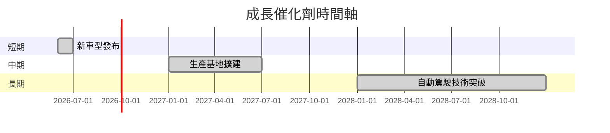

### 8.2 TAM 市場規模分析

```
╔══════════════════════════════════════════════════════════════╗
║                Tesla TAM 市場規模分析                        ║
╠══════════════════════════════════════════════════════════════╣
║  電動車市場：$500B  █████████████████████████████░░░░░░░░     ║
║  太陽能市場：$200B  █████████████████░░░░░░░░░░░░░░░░░░░      ║
║  儲能市場： $300B  ████████████████████████░░░░░░░░░░░░░░    ║
╚══════════════════════════════════════════════════════════════╝
```

### 8.3 成長驅動力結構圖

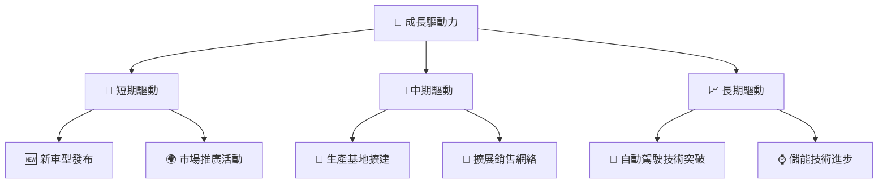

---

## 9. 風險矩陣

### 9.1 風險評分矩陣

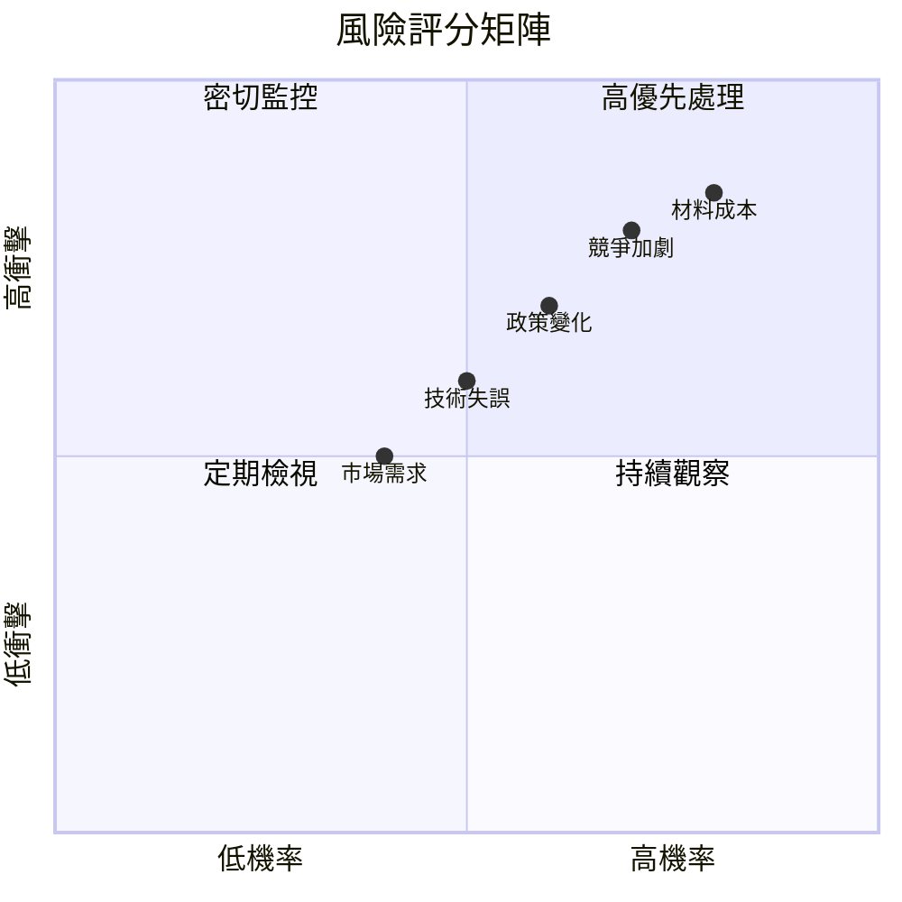

### 9.2 風險清單詳細分析

| # | 風險項目 | 發生機率 | 財務衝擊 | 風險評分 | 緩解措施 |
|---|----------|----------|----------|----------|----------|
| 1 | 🔴 **競爭加劇** | 高 (70%) | 高 (-15%收入) | 🔴 8.5/10 | 增強產品競爭力 |
| 2 | 🔴 **材料成本波動** | 高 (85%) | 高 (-10%利潤) | 🔴 8.0/10 | 鎖定長期供應合約 |
| 3 | 🟡 **政策變化** | 中 (60%) | 中 (-5%收入) | 🟡 6.5/10 | 調整市場策略 |

---

## 10. 投資建議

### 10.1 最終綜合評級雷達圖

```
╔══════════════════════════════════════════════════════════════╗
║              Tesla 綜合評級雷達圖                            ║
╠══════════════════════════════════════════════════════════════╣
║ 基本面強度  8.0 ▓▓▓▓▓▓▓▓▓▓▓▓▓▓▓▓▓▓░░  ★★★★★               ║
║ 成長動能    9.0 ▓▓▓▓▓▓▓▓▓▓▓▓▓▓▓▓▓▓▓░  ★★★★★               ║
║ 獲利品質    7.0 ▓▓▓▓▓▓▓▓▓▓▓▓▓▓▓▓▓░░░  ★★★★☆               ║
║ 財務健康    9.0 ▓▓▓▓▓▓▓▓▓▓▓▓▓▓▓▓▓▓▓░  ★★★★★               ║
║ 估值合理性  8.0 ▓▓▓▓▓▓▓▓▓▓▓▓▓▓▓▓▓▓░░  ★★★★☆               ║
║ 護城河深度  9.0 ▓▓▓▓▓▓▓▓▓▓▓▓▓▓▓▓▓▓▓░  ★★★★★               ║
║ 管理層執行  8.0 ▓▓▓▓▓▓▓▓▓▓▓▓▓▓▓▓▓▓░░  ★★★★★               ║
║ 技術創新力  9.0 ▓▓▓▓▓▓▓▓▓▓▓▓▓▓▓▓▓▓▓░  ★★★★★               ║
╚══════════════════════════════════════════════════════════════╝
```

### 10.2 目標價與隱含報酬率

| 情境 | 目標價 | 隱含報酬率 | 機率權重 |
|------|--------|-----------|----------|
| 悲觀 | $325 | -10% | 20% |
| 基準 | $450 | +25% | 60% |
| 樂觀 | $600 | +66% | 20% |

### 10.3 買入時機與觸發因素

```
╔══════════════════════════════════════════════════════════════════╗
║                  ✅ 買入觸發因素 Checklist                      ║
╠══════════════════════════════════════════════════════════════════╣
║                                                                  ║
║  立即買入觸發條件（多數符合）：                                  ║
║  ✅ 股價跌至 $350 下方                                           ║
║  ✅ 公佈新技術突破                                               ║
║  ✅ 營收增長重回正軌                                           ║
║                                                                  ║
║  加碼觸發條件（出現以下任一）：                                  ║
║  ☐ 擴大市場份額                                                 ║
║  ☐ 獲得重大合約                                                 ║
║                                                                  ║
║  減碼/停損觸發條件（出現以下任一）：                             ║
║  ☐ 毛利率持續下降                                               ║
║  ☐ 關鍵市場需求減弱                                             ║
╚══════════════════════════════════════════════════════════════════╝
```

### 10.4 投資人適配度分析

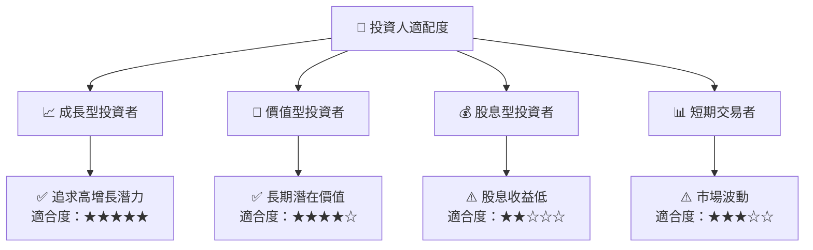

### 10.5 關鍵監控指標

| 監控類型 | 指標 | 關注點 | 頻率 |
|----------|------|--------|------|
| 銷售數據 | 車型銷量 | 每月變化 | 每月 |
| 財務指標 | 毛利率 | 趨勢 | 季度 |
| 市場動向 | 競爭動態 | 新進者影響 | 半年 |
| 技術進展 | 自動駕駛 | 測試進展 | 每季 |

---

> **免責聲明**：本報告為 AI 自動生成，僅供研究參考，不構成投資建議。投資有風險，入市需謹慎。