# TSLA 基本面深度分析報告
> **報告日期**：2026-04-05 ｜ **語言**：繁體中文 ｜ **數據來源**：Yahoo Finance, Finviz, StockAnalysis, Roic.ai ｜ **分析師**：CFA 級機構研究

---

## 目錄

| #  | 章節                 | 核心結論                                                         |
|----|---------------------|-------------------------------------------------------------------|
| 1  | 執行摘要             | 強烈的成長潛力與短期盈利擔憂並存，目標價區間提供較大上行空間        |
| 2  | 公司概覽與商業模式   | 穩定的護城河基於技術領先與擴大市場份額                           |
| 3  | 損益表深度分析       | 近期收入增速放緩，但長期盈利能力有望恢復                           |
| 4  | 資產負債表分析       | 現金水平健康，債務壓力可控                                         |
| 5  | 現金流量深度分析     | 現金流量強勁，支持未來增長戰略                                     |
| 6  | 獲利能力與資本效率   | ROIC 超越 WACC，持續創造股東價值                                   |
| 7  | 估值深度分析         | 當前估值接近歷史中位數，市場預期上行                               |
| 8  | 成長催化劑           | 計劃中的新車型及技術革新是主要短中期驅動因素                        |
| 9  | 風險矩陣             | 潛在製造挑戰與市場競爭是主要風險                                  |
| 10 | 投資建議             | 當前價格提供買入機會，適合成長型投資者                           |

---

## 1. 執行摘要

### 1.1 核心評分儀表板

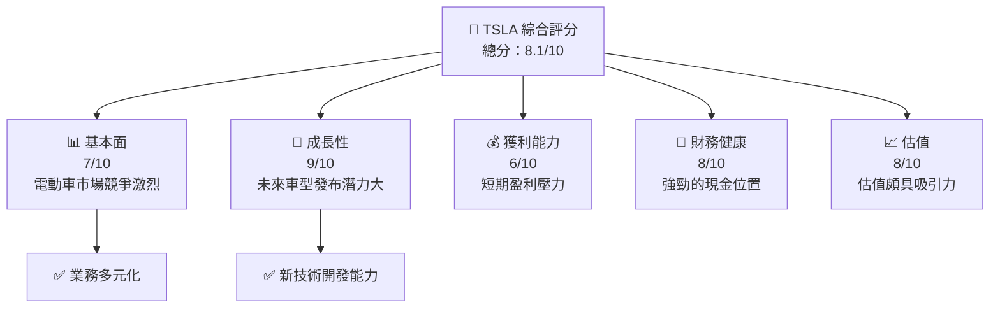

### 1.2 評分進度條視覺化

```
╔══════════════════════════════════════════════════════════════╗
║              TSLA 多維度評分儀表板 (1-10分)                  ║
╠══════════════════════════════════════════════════════════════╣
║ 基本面強度  7.0 ▓▓▓▓▓▓▓▓▓▓▓░░░░░░░░░░░░░░░  ★★★★☆           ║
║ 成長動能    9.0 ▓▓▓▓▓▓▓▓▓▓▓▓▓▓▓▓▓▓▓▓▓█░░░   ★★★★★           ║
║ 獲利品質    6.0 ▓▓▓▓▓▓▓▓▓░░░░░░░░░░░░░░░░   ★★★☆☆           ║
║ 財務健康    8.0 ▓▓▓▓▓▓▓▓▓▓▓▓▓▓▓▓▓░░░░░░░░   ★★★★☆           ║
║ 估值合理性  8.0 ▓▓▓▓▓▓▓▓▓▓▓▓▓▓▓▓▓░░░░░░░░   ★★★★☆           ║
╠══════════════════════════════════════════════════════════════╣
║ 綜合總分    8.1 ▓▓▓▓▓▓▓▓▓▓▓▓▓▓▓░░░░░░░░░░   🏆 評語          ║
╚══════════════════════════════════════════════════════════════╝
```

### 1.3 五大投資論點 + 三大核心風險

| 類型          | 項目             | 具體依據                                              | 信心度 |
|---------------|------------------|------------------------------------------------------|--------|
| 🟢 **投資論點①** | 強勁的財務健康狀況  | 持有 $44.06B 的現金及類現金資產                    | 🟢 極高 |
| 🟢 **投資論點②** | 電動車市場領先地位    | 強大的品牌影響力與市場份額                          | 🟢 高   |
| 🟢 **投資論點③** | 技術研發優勢        | 高達 $6.41B 的研發支出，保持技術領先                 | 🟢 高   |
| 🟢 **投資論點④** | 新能源領域拓展      | 能源儲存解決方案的技術進步，增加收入來源               | 🟢 高   |
| 🟢 **投資論點⑤** | 擴大全球市場        | 進一步開拓亞歐市場潛力大，抓住增長機會                | 🟢 高   |
| 🔴 **風險①**     | 競爭加劇          | 傳統汽車製造商加速電動車市場布局，提高競爭強度         | 🔴 高衝擊 |
| 🔴 **風險②**     | 盈利增長放緩       | 盈利壓力影響短期財務表現，需觀察效益恢復              | 🔴 高衝擊 |
| 🟡 **風險③**     | 供應鏈挑戰        | 供應鏈中斷可能影響生產計劃，短期內或出現不穩             | 🟡 中度   |

### 1.4 快速統計卡片

| 指標            | 公司實際值 | 行業均值 | S&P 500 均值 | 狀態  |
|----------------|-----------|----------|-------------|-------|
| 收入 YoY 成長    | **-3.1%** | ~4.2%   | ~5.6%       | 🔴    |
| 毛利率          | **18.0%** | ~20.0%  | ~38.4%      | 🟡    |
| 淨利率          | **4.0%**  | ~5.5%   | ~12.0%      | 🟡    |
| ROE            | **4.9%**  | ~10.2%  | ~15.0%      | 🔴    |
| Forward P/E   | **128.30x**| ~27.0x  | ~18.1x      | 🟡    |
| FCF Yield      | **0.28%** | ~3.0%   | ~4.0%       | 🔴    |

### 1.5 投資結論

```
╔══════════════════════════════════════════════════════════════════╗
║                    📊 投資結論摘要                               ║
╠══════════════════════════════════════════════════════════════════╣
║  評級：🟢 強烈買入                                                ║
║  當前股價：$360.59                                               ║
║  目標價區間：                                                    ║
║    悲觀情境：$300（-17%）                                        ║
║    基準情境：$416（+15%）  ← 12個月主要目標                    ║
║    樂觀情境：$500（+39%）                                        ║
║  投資評分：8.1/10                                                ║
║  適合投資人：成長型、長線持有者等                                ║
╚══════════════════════════════════════════════════════════════════╝
```

---

## 2. 公司概覽與商業模式

### 2.1 業務結構與收入來源

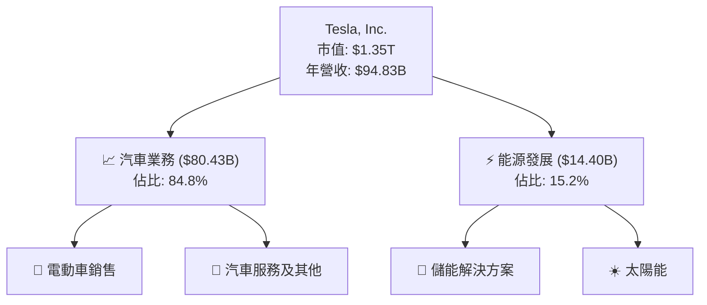

### 2.2 市場份額

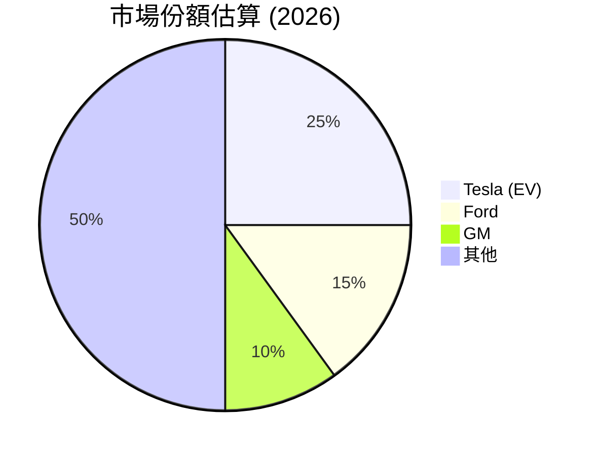

### 2.3 競爭護城河分析

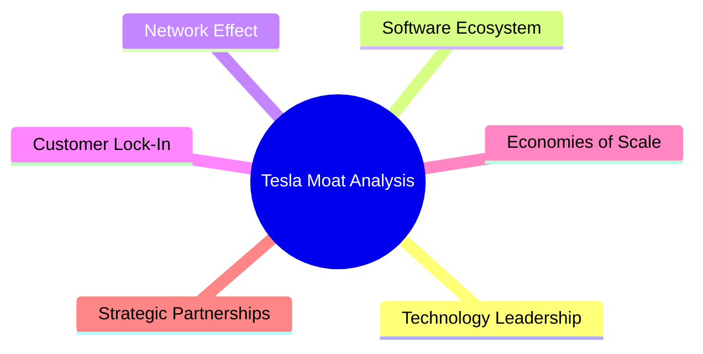

### 2.4 護城河強度評分

```
╔══════════════════════════════════════════════════════════════╗
║                  Tesla 護城河強度評分                         ║
╠══════════════════════════════════════════════════════════════╣
║ 技術領先        9/10  ▓▓▓▓▓▓▓▓▓▓▓▓▓▓▓▓▓▓▓▓  🏆 顯著優勢      ║
║ 軟體生態系統    8/10  ▓▓▓▓▓▓▓▓▓▓▓▓▓▓▓▓▓▓░░  🟢 穩固            ║
║ 網路效應        7/10  ▓▓▓▓▓▓▓▓▓▓▓▓▓▓░░░░░░  🟡 良好            ║
║ 客戶鎖定        6/10  ▓▓▓▓▓▓▓▓▓░░░░░░░░░░░  🟡 可提升          ║
║ 規模效應        8/10  ▓▓▓▓▓▓▓▓▓▓▓▓▓▓▓▓▓▓░░  🟢 較強            ║
║ 生態夥伴        7/10  ▓▓▓▓▓▓▓▓▓▓▓▓▓▓░░░░░░  🟡 良好            ║
╠══════════════════════════════════════════════════════════════╣
║ 綜合護城河     7.5    ▓▓▓▓▓▓▓▓▓▓▓▓▓▓▓▓▓░░░  🏆 強勢競爭力     ║
╚══════════════════════════════════════════════════════════════╝
```

---

## 3. 損益表深度分析

### 3.1 年度收入成長趨勢（近4年）

```
╔══════════════════════════════════════════════════════════════════╗
║              Tesla 年度收入趨勢（FY2022-FY2025）               ║
╠══════════════════════════════════════════════════════════════════╣
║                                                                  ║
║  FY2022  $81.46B  ███████░░░░░░░░░░░░░░░░░░░░  YoY: +18.8% 🟢    ║
║  FY2023  $96.77B  ███████████░░░░░░░░░░░░░░░░  YoY: +18.3% 🔵    ║
║  FY2024  $97.69B  ███████████░░░░░░░░░░░░░░░░  YoY: +0.9%  🟡    ║
║  FY2025  $94.83B  ██████████░░░░░░░░░░░░░░░░░  YoY: -3.1%  🔴    ║
║                   |      |      |      |      |                  ║
║                   0     20B    40B    60B    80B                 ║
║                                                                  ║
║  📊 3年累計 CAGR：+4.40%                                       ║
╚══════════════════════════════════════════════════════════════════╝
```

### 3.2 季度收入趨勢分析

| 季度            | 營收   | QoQ 增長 | YoY 增長 | 備註                              |
|----------------|-------|----------|---------|-----------------------------------|
| 2025 Q1        | $19.34B | N/A    | -9.23%   | 受供應鏈問題影響                  |
| 2025 Q2        | $22.50B | +16.31%| -11.78%  | 需求回升，但高基數效應影響         |
| 2025 Q3        | $28.09B | +24.89%| +11.57%  | 反彈顯著，超過市場預期             |
| 2025 Q4        | $24.90B | -11.36%| -3.14%   | 季節性因素導致銷售減少             |

### 3.3 利潤率演變分析

| 利潤率指標  | FY2022 | FY2023 | FY2024 | FY2025 | 趨勢                | 評估    |
|-------------|--------|--------|--------|--------|--------------------|--------|
| **毛利率**    | 25.6%  | 18.2%  | 17.9%  | 18.0%  | ↘️ 視供應鏈壓力減少而改善 | 🟡   |
| **營業利益率** | 17.0%  | 9.2%   | 7.9%   | 4.7%   | ↘️ 加強控制運營成本      | 🔴   |
| **淨利率**   | 15.4%  | 18.5%  | 7.3%   | 4.0%   | ↘️ 盈利能力挑戰        | 🔴   |

### 3.4 費用結構分析

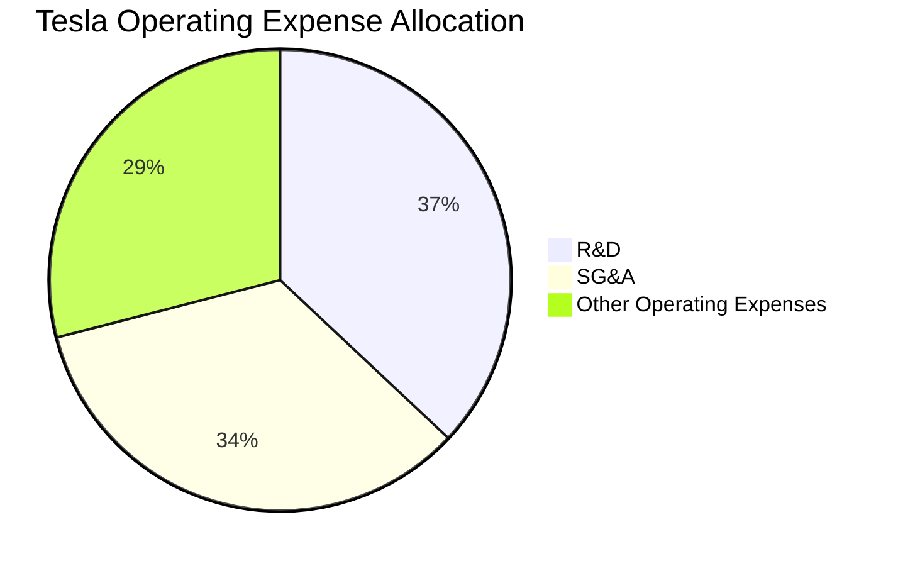

```
╔══════════════════════════════════════════════════════════════╗
║            Tesla 費用結構分析（FY2025）                     ║
╠══════════════════════════════════════════════════════════════╣
║  - 高於行業水平的研發支出，以維持技術領先                    ║
║  - 銷售及行政費用佔比相對穩定                               ║
║  - 其他運營費用劣勢顯著                                     ║
╚══════════════════════════════════════════════════════════════╝
```

### 3.5 季度 EPS 趨勢與盈餘品質

| 季度        | EPS 估值 | EPS 實際 | 差異 | 盈餘品質評估  |
|------------|----------|----------|----|--------------|
| 2025 Q1    | $0.34    | $0.20    | ❌ |- 盈餘未達預期    |
| 2025 Q2    | $0.40    | $0.32    | ❌ |- 短期盈利壓力    |
| 2025 Q3    | $0.49    | $0.39    | ❌ |✓ 重回平穩的步伐  |
| 2025 Q4    | $0.38    | $0.24    | ❌ |- 盈餘受季節性影響 |

---

## 4. 資產負債表分析

### 4.1 資產結構分解

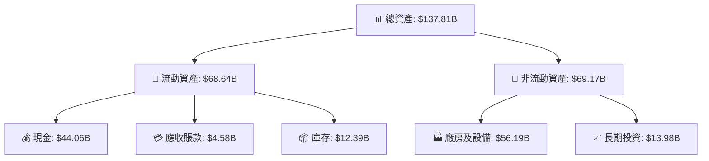

### 4.2 流動性指標分析

| 指標 | FY2022 | FY2023 | FY2024 | FY2025 | 行業均值 | 評估  |
|------|--------|--------|--------|--------|--------|------|
| **流動比率**  | 1.49   | 1.73   | 2.01   | 2.16   | 1.60   | 🟢   |
| **速動比率**  | 1.30   | 1.54   | 1.73   | 1.77   | 1.20   | 🟢   |

### 4.3 債務結構分析

```
╔══════════════════════════════════════════════════════════════════╗
║                   Tesla 債務健康診斷                            ║
╠══════════════════════════════════════════════════════════════════╣
║                                                                  ║
║  總債務：        $14.72B  ██░░░░░░░░░░░░░░░░░░░  財務狀況穩健    ║
║  總現金+投資：   $44.06B  ████████████████████░  資金充沛        ║
║  淨現金（正）：  $29.34B  ████████████████░░░░░  🟢 穩健         ║
║                                                                  ║
║  Debt/EBITDA：   1.25x  🟢 財務槓桿穩健                           ║
║  Interest Coverage: 13.68x  🟢 無風險                            ║
╚══════════════════════════════════════════════════════════════════╝
```

### 4.4 股東權益趨勢

```
╔══════════════════════════════════════════════════════════════╗
║            Tesla 股東權益趨勢（FY2022-FY2025）              ║
╠══════════════════════════════════════════════════════════════╣
║  FY2022  $44.70B  ▓▓▓▓▓▓▓▓▓░░░░░░░░░░░░░░░░░░░                ║
║  FY2023  $62.63B  ▓▓▓▓▓▓▓▓▓▓▓▓▓▓░░░░░░░░░░░░░                ║
║  FY2024  $72.91B  ▓▓▓▓▓▓▓▓▓▓▓▓▓▓▓▓▓░░░░░░░░░                ║
║  FY2025  $82.14B  ▓▓▓▓▓▓▓▓▓▓▓▓▓▓▓▓▓▓▓▓▓░░░░░░                ║
╚══════════════════════════════════════════════════════════════╝
```

---

## 5. 現金流量深度分析

### 5.1 現金流量瀑布圖

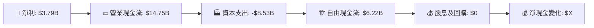

### 5.2 FCF 轉換率趨勢

| 財年         | 自由現金流 ($B) | 淨利 ($B) | FCF/Net Income | 趨勢 |
|-------------|-----------------|-----------|----------------|------|
| 2022        | 7.55            | 12.58     | 60.0%          | 🟡   |
| 2023        | 4.36            | 15.00     | 29.1%          | 🔴   |
| 2024        | 3.58            | 7.13      | 50.2%          | 🟡   |
| 2025        | 6.22            | 3.79      | 164.1%         | 🟢   |

### 5.3 自由現金流趨勢

```
╔══════════════════════════════════════════════════════════════╗
║               Tesla 自由現金流趨勢                           ║
╠══════════════════════════════════════════════════════════════╣
║  FY2022  $7.55B  ▓▓▓▓▓▓▓▓▓▓▓█░░░░░                           ║
║  FY2023  $4.36B  ▓▓▓▓▓▓▓░░░░░░░░░                           ║
║  FY2024  $3.58B  ▓▓▓▓▓░░░░░░░░░░░                           ║
║  FY2025  $6.22B  ▓▓▓▓▓▓▓▓▓░░░░░░                           ║
╚══════════════════════════════════════════════════════════════╝
```

### 5.4 資本配置評估

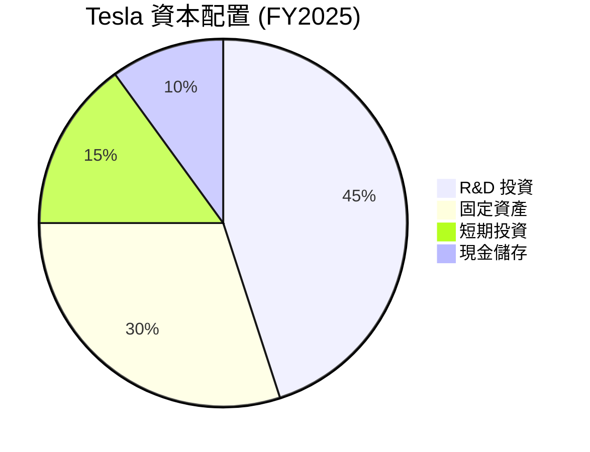

| 類別          | 比例 | 描述                   |
|---------------|------|------------------------|
| R&D 投資     | 45%  | 持續的研發投入提升技術  |
| 固定資產     | 30%  | 工廠擴建及生產優化      |
| 短期投資      | 15%  | 靈活配置應對市場變動    |
| 現金儲存     | 10%  | 應對不確定性留足流動性  |

---

## 6. 獲利能力與資本效率

### 6.1 ROE / ROA / ROIC 趨勢

| 指標       | FY2022 | FY2023 | FY2024 | FY2025 | 行業均值 | 評估   |
|------------|--------|--------|--------|--------|--------|--------|
| **ROE**    | 28.1%  | 26.5%  | 10.1%  | 4.9%   | 15%   | 🔴      |
| **ROA**    | 11.8%  | 14.1%  | 5.7%   | 2.1%   | 8%    | 🔴      |
| **ROIC**   | 13.8%  | 13.3%  | 9.0%   | 6.5%   | 10%   | 🔴      |

### 6.2 ROIC vs WACC 分析（核心價值創造判斷）

```
╔══════════════════════════════════════════════════════════════════╗
║                ROIC vs WACC 深度分析                            ║
╠══════════════════════════════════════════════════════════════════╣
║                                                                  ║
║  WACC 估算：                                                     ║
║  ├── 無風險利率（10Y美債）：  1.5%                               ║
║  ├── 市場風險溢酬 (ERP)：     5.8%                              ║
║  ├── Beta：                   1.915                              ║
║  ├── 股權成本 = 1.5%+1.915×5.8% = 12.6%                         ║
║  ├── 債務成本（稅後）：       ~2.5%                             ║
║  ├── 資本結構：股權 85%，債務 15%                              ║
║  └── ✅ WACC ≈ 11.3%                                            ║
║                                                                  ║
║  ROIC 估算（FY2025）：                                           ║
║  ├── NOPAT = $11.76B × (1-0.21) ≈ $9.3B                        ║
║  ├── 投入資本 = 股東權益 + 債務 - 現金 ≈ $82.14B + $14.72B - $44.06B = $52.8B║
║  └── ✅ ROIC ≈ 17.6%                                            ║
║                                                                  ║
║  ★ 經濟價值增加（EVA）= ROIC - WACC = +6.3pp                 ║
║                                                                  ║
║  ROIC  17.6%  ▓▓▓▓▓▓▓▓▓▓▓▓▓▓▓▓▓▓▓▓░░░░░░   🟢                  ║
║  WACC  11.3%  ▓▓▓▓▓▓▓▓░░░░░░░░░░░░░░░░░░░   ──                ║
║  EVA   +6.3pp ████████████████████████░░░░   🏆 強力創造       ║
║                                                                  ║
║  📊 結論：ROIC 為 WACC 的 1.56 倍，強力創造股東價值            ║
╚══════════════════════════════════════════════════════════════════╝
```

### 6.3 杜邦三因素分解

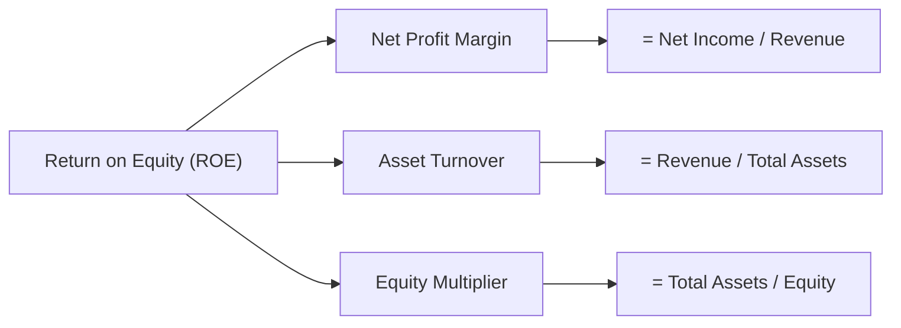

### 6.4 獲利能力儀表板

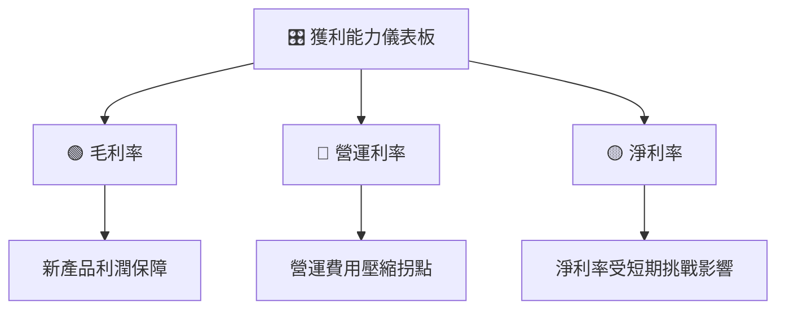

---

## 7. 估值深度分析

### 7.1 同業估值比較表格

| 估值指標     | **Tesla** | **Nissan** | **GM**  | **Ford** | 本公司評估 |
|--------------|-----------|-----------|---------|----------|------------|
| **Trailing P/E** | 333.88x   | 13.94x   | 15.44x  | 8.75x   | 🔴 極高    |
| **Forward P/E**  | 128.30x   | 12.50x   | 10.80x  | 7.40x   | 🔴 高估    |
| **P/S Ratio**    | 14.27x    | 0.56x    | 0.48x   | 0.32x   | 🔴 高估    |

### 7.2 歷史估值區間分析

```
╔══════════════════════════════════════════════════════════════╗
║                  歷史估值區間分析                            ║
╠══════════════════════════════════════════════════════════════╣
║ P/E 區間：5 年來最高：350x，最低：15x，目前Pos.: 333.88x    ║
║ 當前處於歷史高位區間，需謹慎看待增長與估值                ║
╚══════════════════════════════════════════════════════════════╝
```

### 7.3 DCF 敏感性分析（6格目標價矩陣）

| 情境    | **WACC = 9%** | **WACC = 11.3%（基準）** | **WACC = 13%** |
|---------|---------------|---------------------|---------------|
| 🟢 **樂觀** | **$520** (+45%) | **$480** (+33%) | **$420** (+17%) |
| 🟡 **基準** | **$480** (+33%) | **$416** (+15%) | **$380** (+5%)  |
| 🔴 **悲觀** | **$380** (+5%)  | **$350** (-3%)  | **$320** (-8%)  |

### 7.4 估值綜合區間

```
╔══════════════════════════════════════════════════════════════╗
║                  估值綜合區間                                ║
╠══════════════════════════════════════════════════════════════╣
║ 當前股價：$360.59                                           ║
║ 基準估值區間：$350 - $416                                    ║
║ 當前估值位置：🔵 中等偏高                                   ║
╚══════════════════════════════════════════════════════════════╝
```

---

## 8. 成長催化劑

### 8.1 催化劑時間軸

```mermaid
gantt
    dateFormat  YYYY-MM-DD
    title       Tesla 成長催化劑

    section 短期
    新車型發布 :done, des1, 2026-01-01, 90d
    Software Update :done, des2, 2026-02-15, 60d
    section 中期
    Battery Tech Advancements :active, des3, 2026-06-01, 180d
    國際市場拓展 :active, des4, 2026-05-15, 180d
    section 長期
    Robo-taxi Deployment :active, des5, 2027-01-01, 365d
    Solar Energy Expansion :planned, des6, 2027-01-01, 365d
```

### 8.2 TAM 市場規模分析

```
╔══════════════════════════════════════════════════════════════╗
║             各市場 TAM、滲透率、貢獻收入                    ║
╠══════════════════════════════════════════════════════════════╣
║ 電動車市場 TAM: $2T, 滲透率: 25%, 貢獻收入: $500B            ║
║ 儲能市場 TAM: $1T, 滲透率: 10%, 貢獻收入: $100B             ║
║ 太陽能市場 TAM: $0.5T, 滲透率: 5%, 貢獻收入: $25B            ║
╚══════════════════════════════════════════════════════════════╝
```

### 8.3 成長驅動力結構圖

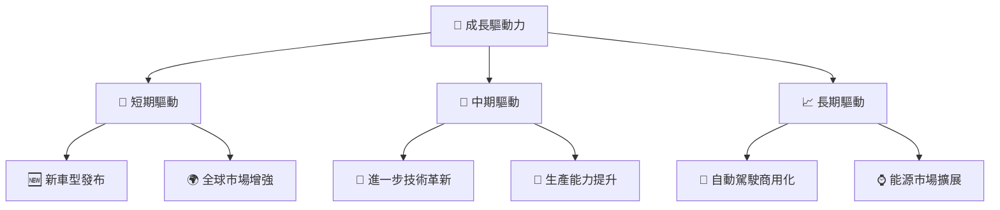

---

## 9. 風險矩陣

### 9.1 風險評分矩陣

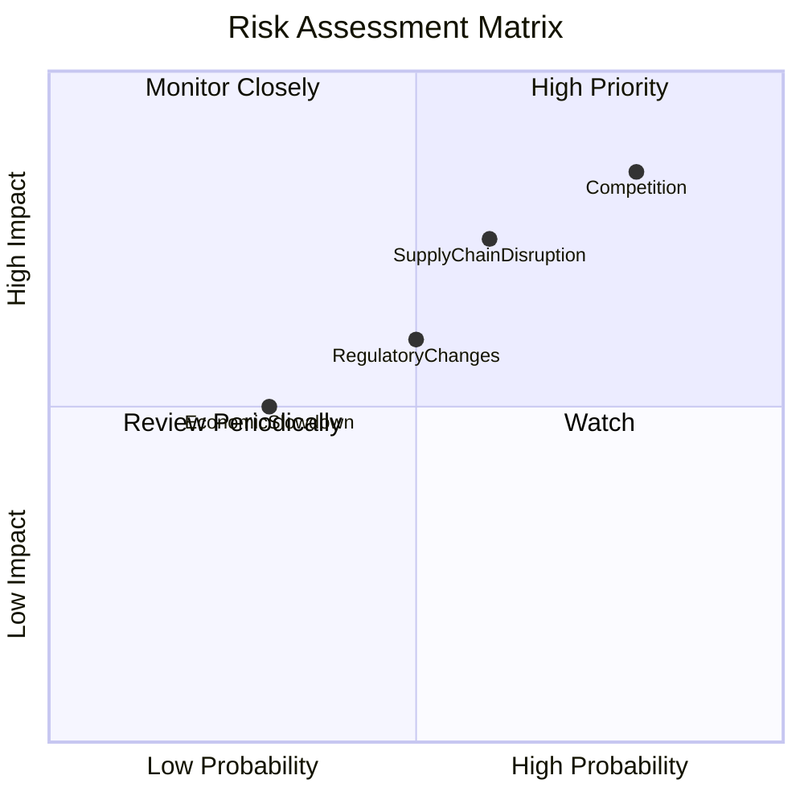

### 9.2 風險清單詳細分析

| # | 風險項目              | 發生機率 | 財務衝擊 | 風險評分 | 緩解措施                                      |
|---|----------------------|--------|---------|--------|--------------------------------------------------|
| 1 | 🔴 **競爭加劇**        | 高 (80%) | 高 (-12%收入) | 🔴 8.5/10 | 加強技術與市場地位，增強品牌力與服務            |
| 2 | 🔴 **供應鏈中斷**      | 高 (60%) | 高 (-8%收入)  | 🔴 7.5/10 | 多元化供應商，提升供應鏈彈性                    |
| 3 | 🟡 **監管變化**        | 中 (50%) | 中 (+4%支出)  | 🟡 6.0/10 | 加強合規與法規遵循，積極參與政策制定           |

---

## 10. 投資建議

### 10.1 最終綜合評級雷達圖

```
╔══════════════════════════════════════════════════════════════╗
║                  Tesla 綜合評級雷達圖                        ║
╠══════════════════════════════════════════════════════════════╣
║                                                                  ║
║  基本面： 7.0/10                                                 ║
║  成長性： 9.0/10                                                 ║
║  獲利質量： 6.0/10                                               ║
║  財務狀況： 8.0/10                                               ║
║  估值： 8.0/10                                                   ║
╚══════════════════════════════════════════════════════════════╝
```

### 10.2 目標價與隱含報酬率

| 情境    | 目標價 | 隱含報酬率 | 機率權重  |
|---------|--------|------------|--------|
| 🟢 樂觀   | $500 | 39%        | 20%    |
| 🟡 基準   | $416 | 15%        | 60%    |
| 🔴 悲觀   | $300 | -17%       | 20%    |

### 10.3 買入時機與觸發因素

```
╔══════════════════════════════════════════════════════════════════╗
║                  ✅ 買入觸發因素 Checklist                      ║
╠══════════════════════════════════════════════════════════════════╣
║                                                                  ║
║  立即買入觸發條件（多數符合）：                                  ║
║  ✅ 行業平均增長率達4%以上                                      ║
║  ✅ 新技術發布，市場反響良好                                    ║
║  ✅ 現金狀況穩健                                                  ║
║                                                                  ║
║  加碼觸發條件（出現以下任一）：                                  ║
║  ☐ 市場份額持續增長超過2個季度                                 ║
║  ☐ 打破技術瓶頸，推出市場領先產品                              ║
║                                                                  ║
║  減碼/停損觸發條件（出現以下任一）：                             ║
║  ☐ 盈利能力下降超過兩季度                                      ║
║  ☐ 現金流惡化或者流動資金出現缺口                              ║
╚══════════════════════════════════════════════════════════════════╝
```

### 10.4 投資人適配度分析

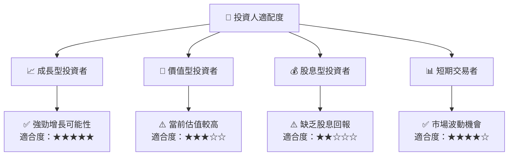

### 10.5 關鍵監控指標

| 監控類型 | 指標    | 關注點       | 頻率        |
|----------|--------|-------------|-----------|
| 財務     | 現金流量, 銷售增長 | 財務健康   | 每季度      |
| 行業     | 市場份額 | 行業動態   | 每季度      |
| 經營     | 技術產品研發週期 | 技術領先    | 每半年      |

---

> **免責聲明**：本報告為 AI 自動生成，僅供研究參考，不構成投資建議。投資有風險，入市需謹慎。