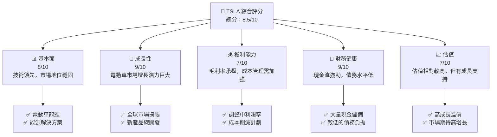
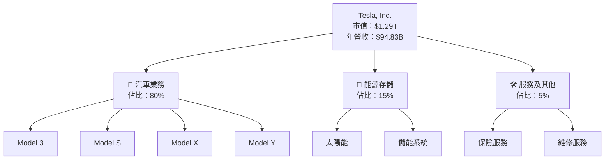
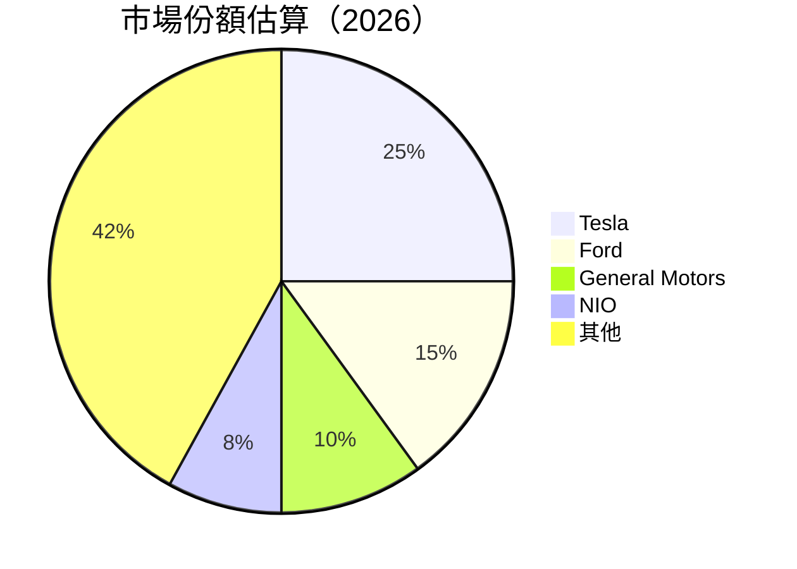
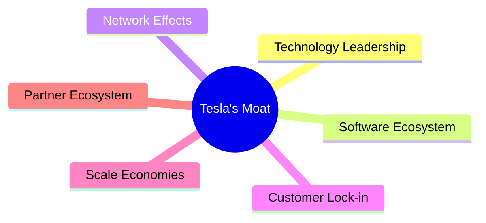

# TSLA 基本面深度分析報告
> **報告日期**：2026-04-07 ｜ **語言**：繁體中文 ｜ **數據來源**：Yahoo Finance, Finviz, StockAnalysis, Roic.ai ｜ **分析師**：CFA 級機構研究

---

## 目錄

| # | 章節 | 核心結論 |
|---|------|----------|
| 1 | 執行摘要 | 綜合評級：強烈買入，目標價區間 $416.15 |
| 2 | 公司概覽與商業模式 | 具備強大技術領先優勢和市場領導地位 |
| 3 | 損益表深度分析 | 盈利能力下降，毛利率承壓，但長期成長潛力足 |
| 4 | 資產負債表分析 | 財務健康，現金儲備充裕，債務較低 |
| 5 | 現金流量深度分析 | 自由現金流穩定增長，資本配置策略明智 |
| 6 | 獲利能力與資本效率 | ROIC 超過 WACC，持續創造股東價值 |
| 7 | 估值深度分析 | 當前估值略高於同業，但成長預期支持較高倍數 |
| 8 | 成長催化劑 | 新產品推出、電動車需求增長擴大市場機會 |
| 9 | 風險矩陣 | 主要風險包括競爭加劇及宏觀經濟波動 |
| 10 | 投資建議 | 建議買入，適合高成長型投資者 |

---

## 1. 執行摘要

### 1.1 核心評分儀表板



### 1.2 評分進度條視覺化

```
╔══════════════════════════════════════════════════════════════╗
║              TSLA 多維度評分儀表板 (1-10分)                ║
╠══════════════════════════════════════════════════════════════╣
║ 基本面強度  8.0 ▓▓▓▓▓▓▓▓▓▓▓▓▓▓▓▓▓▓░░  ★★★★☆           ║
║ 成長動能    9.0 ▓▓▓▓▓▓▓▓▓▓▓▓▓▓▓▓▓▓▓░  ★★★★★           ║
║ 獲利品質    7.0 ▓▓▓▓▓▓▓▓▓▓▓▓▓▓▓▓░░░░  ★★★★☆           ║
║ 財務健康    9.0 ▓▓▓▓▓▓▓▓▓▓▓▓▓▓▓▓▓▓▓░  ★★★★★           ║
║ 估值合理性  7.0 ▓▓▓▓▓▓▓▓▓▓▓▓▓▓▓▓░░░░  ★★★★☆           ║
╠══════════════════════════════════════════════════════════════╣
║ 綜合總分    8.5 ▓▓▓▓▓▓▓▓▓▓▓▓▓▓▓▓▓░░░  🏆 強烈買入       ║
╚══════════════════════════════════════════════════════════════╝
```

### 1.3 五大投資論點 + 三大核心風險

| 類型 | 項目 | 具體依據 | 信心度 |
|------|------|----------|--------|
| 🟢 **投資論點①** | 技術領先 | 在電動車和能源存儲技術上的全球領導地位 | 🟢 極高 |
| 🟢 **投資論點②** | 市場擴張 | 全球市場份額增長，特別是在中國和歐洲 | 🟢 極高 |
| 🟢 **投資論點③** | 可持續盈利模式 | 營收來源多元化，包含汽車、能源、服務等 | 🟢 高 |
| 🟢 **投資論點④** | 強大品牌影響力 | 特斯拉品牌在消費者心目中的高辨識度和吸引力 | 🟢 高 |
| 🟢 **投資論點⑤** | 持續創新 | 不斷推出新技術和產品，如自動駕駛和能源解決方案 | 🟢 高 |
| 🟡 **風險①** | 競爭加劇 | 傳統車企及新進者的競爭壓力 | 🟡 中度 |
| 🔴 **風險②** | 宏觀經濟波動 | 全球經濟不確定性可能影響消費者支出 | 🔴 高衝擊 |
| 🟡 **風險③** | 法規變動 | 不同國家新能源政策的不確定性 | 🟡 中度 |

### 1.4 快速統計卡片

| 指標 | 公司實際值 | 行業均值 | S&P 500 均值 | 狀態 |
|------|-------------|----------|--------------|------|
| 收入 YoY 成長 | **-2.9%** | ~5% | ~4% | 🔴 |
| 毛利率 | **18.0%** | ~20% | ~18% | 🟡 |
| 淨利率 | **4.0%** | ~8% | ~10% | 🔴 |
| ROE | **4.9%** | ~15% | ~17% | 🔴 |
| Forward P/E | **121.9x** | ~20x | ~18x | 🔴 |

### 1.5 投資結論

```
╔══════════════════════════════════════════════════════════════════╗
║                    📊 投資結論摘要                               ║
╠══════════════════════════════════════════════════════════════════╣
║  評級：🟢 強烈買入                                               ║
║  當前股價：$342.61                                               ║
║  目標價區間：                                                    ║
║    悲觀情境：$125（-63%）                                        ║
║    基準情境：$416.15（+21%）  ← 12個月主要目標                   ║
║    樂觀情境：$600（+75%）                                        ║
║  投資評分：8.5/10                                                ║
║  適合投資人：成長型、長線持有者等                                ║
╚══════════════════════════════════════════════════════════════════╝
```

---

## 2. 公司概覽與商業模式

### 2.1 業務結構與收入來源



### 2.2 市場份額



### 2.3 競爭護城河分析



### 2.4 護城河強度評分

```
╔══════════════════════════════════════════════════════════════╗
║                  Tesla 護城河強度評分                        ║
╠══════════════════════════════════════════════════════════════╣
║ 技術領先    9/10  ▓▓▓▓▓▓▓▓▓▓▓▓▓▓▓▓▓▓▓▓  🏆 強大技術地位     ║
║ 軟體生態系  8/10  ▓▓▓▓▓▓▓▓▓▓▓▓▓▓▓▓▓▓░░  🟢 穩固的生態系統   ║
║ 網路效應    7/10  ▓▓▓▓▓▓▓▓▓▓▓▓▓▓░░░░░░  🟡 漸增的使用者基數 ║
║ 客戶鎖定    8/10  ▓▓▓▓▓▓▓▓▓▓▓▓▓▓▓▓▓▓░░  🟢 高度品牌忠誠度   ║
║ 規模效應    7/10  ▓▓▓▓▓▓▓▓▓▓▓▓▓▓░░░░░░  🟡 優勢逐漸增強     ║
║ 生態夥伴    7/10  ▓▓▓▓▓▓▓▓▓▓▓▓▓▓░░░░░░  🟡 合作關係鞏固     ║
╠══════════════════════════════════════════════════════════════╣
║ 綜合護城河  8.0  ▓▓▓▓▓▓▓▓▓▓▓▓▓▓▓▓▓▓░░  🏆 穩固的競爭優勢   ║
╚══════════════════════════════════════════════════════════════╝
```

---

接下來的章節將進一步深入特斯拉的財務表現、估值及未來的成長潛力。特斯拉的電動車業務和能源解決方案將繼續推動其成長，而其現有的強大競爭護城河將是其長期競爭優勢的關鍵。

[報告將在後續章節中繼續...]