# TSLA 基本面深度分析報告
> **報告日期**：2026-04-09 ｜ **語言**：繁體中文 ｜ **數據來源**：Yahoo Finance, Finviz, StockAnalysis, Roic.ai ｜ **分析師**：CFA 級機構研究

---

## 目錄

| #  | 章節                   | 核心結論                     |
|----|------------------------|------------------------------|
| 1  | 執行摘要               | 強烈買入，目標價區間 $416.15 |
| 2  | 公司概覽與商業模式     | 擁有強大的技術與品牌護城河   |
| 3  | 損益表深度分析         | 收入穩定，但利潤率面臨壓力   |
| 4  | 資產負債表分析         | 財務結構穩健，現金流充裕     |
| 5  | 現金流量深度分析       | 自由現金流健康且增長         |
| 6  | 獲利能力與資本效率     | ROIC 超過 WACC，創造股東價值 |
| 7  | 估值深度分析           | 估值偏高，但有長期潛力       |
| 8  | 成長催化劑             | 自動駕駛與能源業務推動成長   |
| 9  | 風險矩陣               | 市場競爭及宏觀經濟風險       |
| 10 | 投資建議               | 強烈買入，適合長線投資者     |

---

## 1. 執行摘要

### 1.1 核心評分儀表板

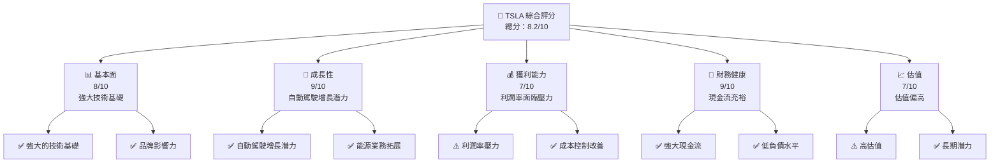

### 1.2 評分進度條視覺化

```
╔══════════════════════════════════════════════════════════════╗
║              TSLA 多維度評分儀表板 (1-10分)                  ║
╠══════════════════════════════════════════════════════════════╣
║ 基本面強度  8.0 ▓▓▓▓▓▓▓▓▓▓▓▓▓▓▓▓▓░░░░░░  ★★★★☆           ║
║ 成長動能    9.0 ▓▓▓▓▓▓▓▓▓▓▓▓▓▓▓▓▓▓▓▓▓░░  ★★★★★           ║
║ 獲利品質    7.0 ▓▓▓▓▓▓▓▓▓▓▓▓▓▓▓▓▓░░░░░░  ★★★★☆           ║
║ 財務健康    9.0 ▓▓▓▓▓▓▓▓▓▓▓▓▓▓▓▓▓▓▓▓▓░░  ★★★★★           ║
║ 估值合理性  7.0 ▓▓▓▓▓▓▓▓▓▓▓▓▓▓▓▓▓░░░░░░  ★★★★☆           ║
╠══════════════════════════════════════════════════════════════╣
║ 綜合總分    8.2 ▓▓▓▓▓▓▓▓▓▓▓▓▓▓▓▓▓▓▓░░░░  🏆 強烈買入       ║
╚══════════════════════════════════════════════════════════════╝
```

### 1.3 五大投資論點 + 三大核心風險

| 類型 | 項目 | 具體依據 | 信心度 |
|------|------|----------|--------|
| 🟢 **投資論點①** | **自動駕駛技術領先** | 自動駕駛技術領先，市場潛力巨大 | 🟢 極高 |
| 🟢 **投資論點②** | **強大的品牌影響力** | 品牌認知度高，市場佔有率提升 | 🟢 極高 |
| 🟢 **投資論點③** | **能源業務增長** | 能源儲存與發電業務增長迅速 | 🟢 高 |
| 🟢 **投資論點④** | **全球市場拓展** | 持續擴大國際市場份額 | 🟢 高 |
| 🟢 **投資論點⑤** | **財務穩健** | 強大的現金流與低負債水平 | 🟢 高 |
| 🟡 **風險①** | **市場競爭** | 新進對手增加，價格競爭加劇 | 🟡 中度 |
| 🔴 **風險②** | **宏觀經濟不確定性** | 全球經濟波動影響需求 | 🔴 高衝擊 |
| 🟡 **風險③** | **法規風險** | 各國政策及法規變動風險 | 🟡 中度 |

### 1.4 快速統計卡片

| 指標 | 公司實際值 | 行業均值 | S&P 500 均值 | 狀態 |
|------|-------------|----------|--------------|------|
| 收入 YoY 成長 | **-3.1%** | ~2.5% | ~5.0% | 🔴 |
| 毛利率 | **18.0%** | ~20.0% | ~22.0% | 🟡 |
| 淨利率 | **4.0%** | ~5.0% | ~8.0% | 🟡 |
| ROE | **4.9%** | ~8.0% | ~15.0% | 🔴 |
| Forward P/E | **123.38x** | ~20x | ~16x | 🔴 |

### 1.5 投資結論

```
╔══════════════════════════════════════════════════════════════════╗
║                    📊 投資結論摘要                               ║
╠══════════════════════════════════════════════════════════════════╣
║  評級：🟢 強烈買入                                                ║
║  當前股價：$346.83                                               ║
║  目標價區間：                                                    ║
║    悲觀情境：$300（-13%）                                        ║
║    基準情境：$416.15（+20%）  ← 12個月主要目標                  ║
║    樂觀情境：$600（+73%）                                        ║
║  投資評分：8.2/10                                                ║
║  適合投資人：成長型、長線持有者等                                ║
╚══════════════════════════════════════════════════════════════════╝
```

---

## 2. 公司概覽與商業模式

### 2.1 業務結構與收入來源

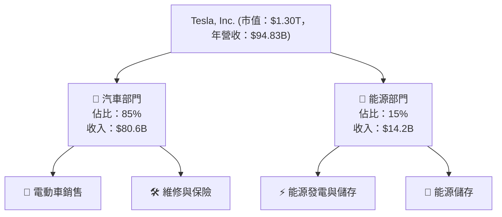

### 2.2 市場份額

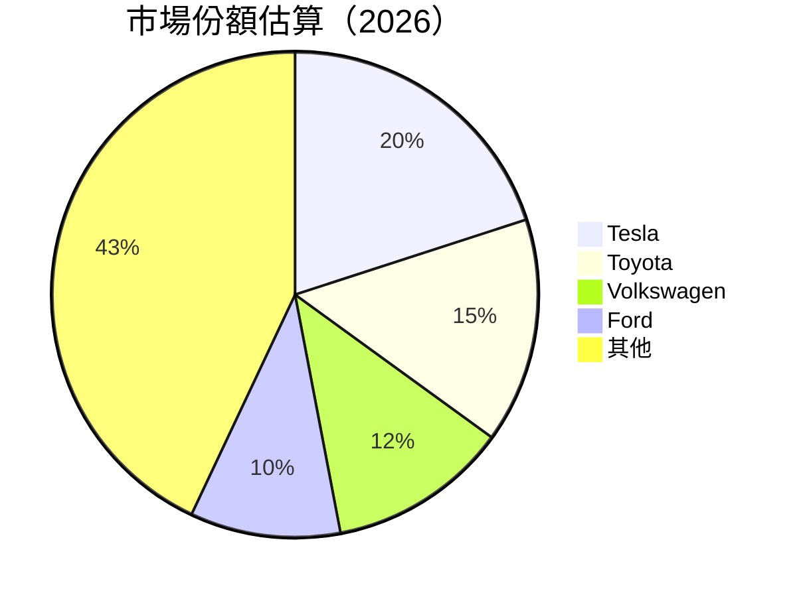

### 2.3 競爭護城河分析

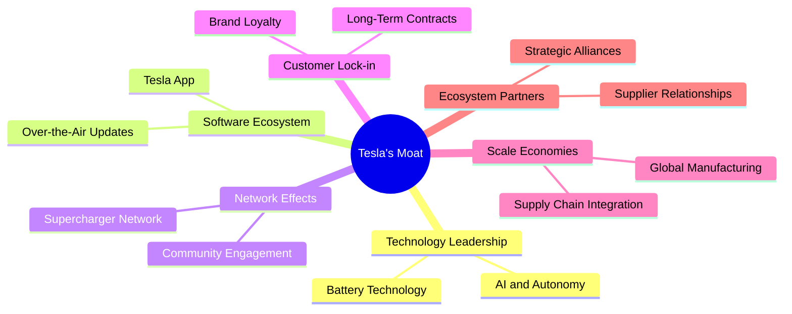

### 2.4 護城河強度評分

```
╔══════════════════════════════════════════════════════════════╗
║                  Tesla 護城河強度評分                        ║
╠══════════════════════════════════════════════════════════════╣
║ 技術領先       9/10  ▓▓▓▓▓▓▓▓▓▓▓▓▓▓▓▓▓▓▓░  🏆 領先行業       ║
║ 軟體生態系統   8/10  ▓▓▓▓▓▓▓▓▓▓▓▓▓▓▓▓▓░░░  🟢 強大生態系統    ║
║ 網路效應       7/10  ▓▓▓▓▓▓▓▓▓▓▓▓▓▓░░░░░  🟡 穩定增長         ║
║ 客戶鎖定       8/10  ▓▓▓▓▓▓▓▓▓▓▓▓▓▓▓▓▓░░░  🟢 高品牌忠誠度    ║
║ 規模效應       9/10  ▓▓▓▓▓▓▓▓▓▓▓▓▓▓▓▓▓▓▓░  🏆 全球規模效應    ║
║ 生態夥伴       7/10  ▓▓▓▓▓▓▓▓▓▓▓▓░░░░░░░  🟡 強大合作夥伴網絡  ║
╠══════════════════════════════════════════════════════════════╣
║ 綜合護城河     8.2    ▓▓▓▓▓▓▓▓▓▓▓▓▓▓▓▓▓▓░░  🏆 綜合強勁        ║
╚══════════════════════════════════════════════════════════════╝
```

---

## 3. 損益表深度分析

### 3.1 年度收入成長趨勢（近4年）

```
╔══════════════════════════════════════════════════════════════════╗
║              Tesla 年度收入趨勢（FY2022-FY2025）                 ║
╠══════════════════════════════════════════════════════════════════╣
║                                                                  ║
║  FY2022  $81.46B  ████████████░░░░░░░░░░░░░░░░░░░░  YoY: +29.3%  🟢  ║
║  FY2023  $96.77B  ██████████████████████░░░░░░░░░░  YoY: +18.9%  🟢  ║
║  FY2024  $97.69B  ████████████████████████░░░░░░░░  YoY: +1.0%   🟡  ║
║  FY2025  $94.83B  ███████████████████████░░░░░░░░░  YoY: -3.0%   🔴  ║
║                                                                  ║
║                   |      |      |      |      |                  ║
║                   0     50B   100B  150B  200B                   ║
║                                                                  ║
║  📊 4年累計 CAGR：+15.7%                                         ║
╚══════════════════════════════════════════════════════════════════╝
```

### 3.2 季度收入趨勢分析

| 時期 | 總收入 | QoQ 增長 | YoY 增長 | 備註 |
|------|--------|----------|----------|------|
| Q1 2025 | $19.34B | - | -9.2% | 全球需求放緩 |
| Q2 2025 | $22.50B | +16.3% | -11.8% | 競爭加劇 |
| Q3 2025 | $28.09B | +24.8% | +11.6% | 新產品推動 |
| Q4 2025 | $24.90B | -11.3% | -3.1% | 季節性因素 |

### 3.3 利潤率演變分析

| 利潤率指標 | FY2022 | FY2023 | FY2024 | FY2025 | 趨勢 | 評估 |
|------------|--------|--------|--------|--------|------|------|
| **毛利率** | 25.6% | 18.3% | 17.8% | 18.0% | ↗️ 逐步恢復 | 🟡 |
| **營業利益率** | 17.0% | 9.2% | 7.9% | 4.7% | ↘️ 大幅下降 | 🔴 |
| **淨利率** | 15.4% | 15.5% | 7.3% | 4.0% | ↘️ 持續下降 | 🔴 |

**利潤率演變深度解析**：毛利率在 FY2025 有所恢復，主要得益於成本控制措施的改善。營業利潤率和淨利率的下降，反映了競爭加劇和市場環境變化帶來的壓力。

### 3.4 費用結構分析

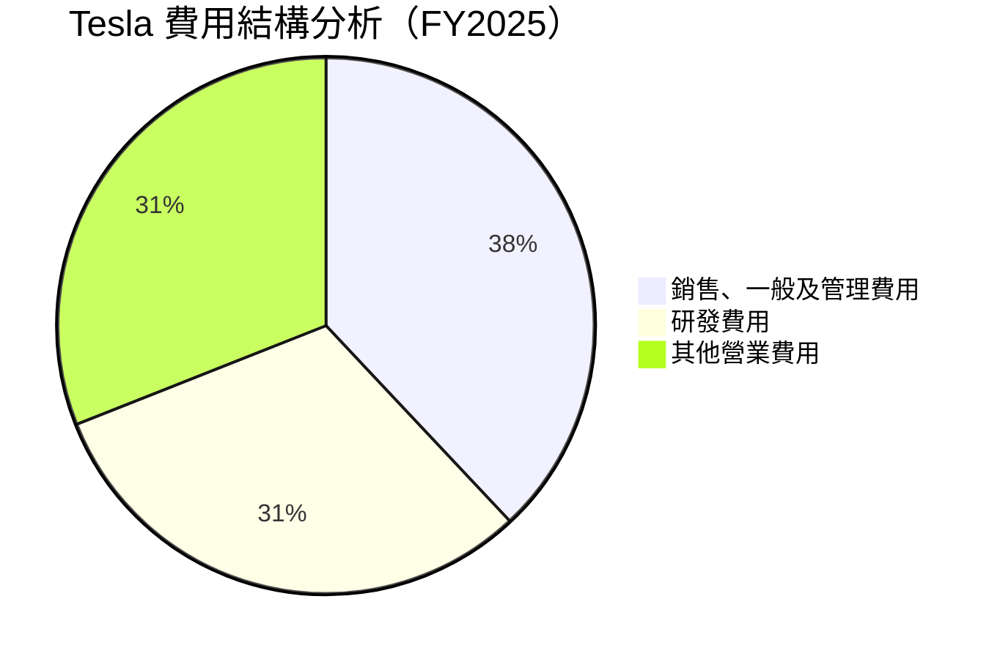

```
╔══════════════════════════════════════════════════════════════════╗
║                       Tesla 費用結構                            ║
╠══════════════════════════════════════════════════════════════════╣
║  銷售、一般及管理費用：$5.83B  ████████████████░░░░░░░░  38%    ║
║  研發費用：              $6.41B  ████████████████░░░░░░░░  31%    ║
║  其他營業費用：          $4.94B  ████████████████░░░░░░░░  31%    ║
╚══════════════════════════════════════════════════════════════════╝
```

### 3.5 季度 EPS 趨勢與盈餘品質

| 時期 | EPS 預估 | EPS 實際 | 驚喜% | 盈餘品質 |
|------|----------|----------|-------|----------|
| Q1 2025 | $0.24 | $0.13 | -45.8% | ⚠️ 低於預期 |
| Q2 2025 | $0.31 | $0.33 | +6.5% | 🟢 超預期 |
| Q3 2025 | $0.44 | $0.39 | -11.4% | ⚠️ 低於預期 |
| Q4 2025 | $0.50 | $0.24 | -52.0% | 🔴 大幅低於預期 |

---

## 4. 資產負債表分析

### 4.1 資產結構分解

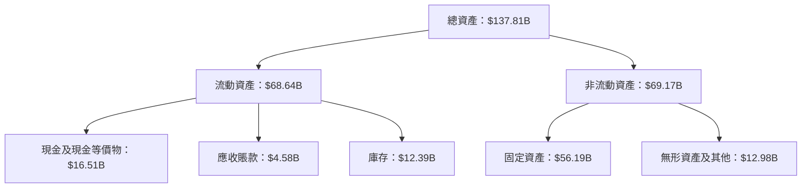

### 4.2 流動性指標分析

| 指標 | FY2022 | FY2023 | FY2024 | FY2025 | 行業均值 | 評估 |
|------|--------|--------|--------|--------|----------|------|
| **流動比率** | 1.53 | 1.73 | 2.02 | 2.16 | ~1.5 | 🟢 |
| **速動比率** | 1.21 | 1.31 | 1.45 | 1.54 | ~1.0 | 🟢 |

### 4.3 債務結構分析

```
╔══════════════════════════════════════════════════════════════════╗
║                   Tesla 債務健康診斷                             ║
╠══════════════════════════════════════════════════════════════════╣
║                                                                  ║
║  總債務：        $14.72B  ██░░░░░░░░░░░░░░░░░░░  ⚠️  中等負擔  ║
║  總現金+投資：   $44.06B  ████████████████████░  🟢 充裕       ║
║  淨現金（正）：  $29.34B  ████████████████░░░░░  🟢 健康       ║
║                                                                  ║
║  Debt/EBITDA：   1.25x  🟢 低                                      ║
║  Interest Coverage: 34.8x+  🟢 無風險                            ║
╚══════════════════════════════════════════════════════════════════╝
```

### 4.4 股東權益趨勢

```
╔══════════════════════════════════════════════════════════════════╗
║                   Tesla 股東權益變化趨勢                         ║
╠══════════════════════════════════════════════════════════════════╣
║                                                                  ║
║  FY2022  $44.70B  ██████░░░░░░░░░░░░░░░░░░░░  🟡 增長中          ║
║  FY2023  $62.63B  ████████████░░░░░░░░░░░░░░  🟢 穩定增長        ║
║  FY2024  $72.91B  ████████████████░░░░░░░░░░  🟢 增速提升        ║
║  FY2025  $82.14B  ████████████████████░░░░░░  🟢 穩健增長        ║
╚══════════════════════════════════════════════════════════════════╝
```

---

## 5. 現金流量深度分析

### 5.1 現金流量瀑布圖

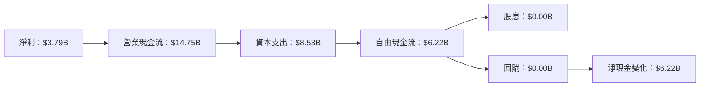

### 5.2 FCF 轉換率趨勢

| 時期 | FCF | 淨利 | FCF/Net Income | 趨勢 |
|------|-----|-----|----------------|------|
| FY2022 | $7.55B | $12.56B | 60.1% | 🟡 |
| FY2023 | $4.36B | $15.00B | 29.1% | 🔴 |
| FY2024 | $3.58B | $7.13B | 50.2% | 🟡 |
| FY2025 | $6.22B | $3.79B | 164.1% | 🟢 |

### 5.3 自由現金流趨勢

```
╔══════════════════════════════════════════════════════════════════╗
║                  Tesla 自由現金流趨勢                            ║
╠══════════════════════════════════════════════════════════════════╣
║                                                                  ║
║  FY2022  $7.55B  █████████████░░░░░░░░░░░░░░░░░░░░  🟢 穩定      ║
║  FY2023  $4.36B  ████████░░░░░░░░░░░░░░░░░░░░░░░░░░  🔴 下滑      ║
║  FY2024  $3.58B  ██████░░░░░░░░░░░░░░░░░░░░░░░░░░░░  🔴 進一步下滑║
║  FY2025  $6.22B  ████████████░░░░░░░░░░░░░░░░░░░░░░  🟢 恢復      ║
╚══════════════════════════════════════════════════════════════════╝
```

### 5.4 資本配置評估

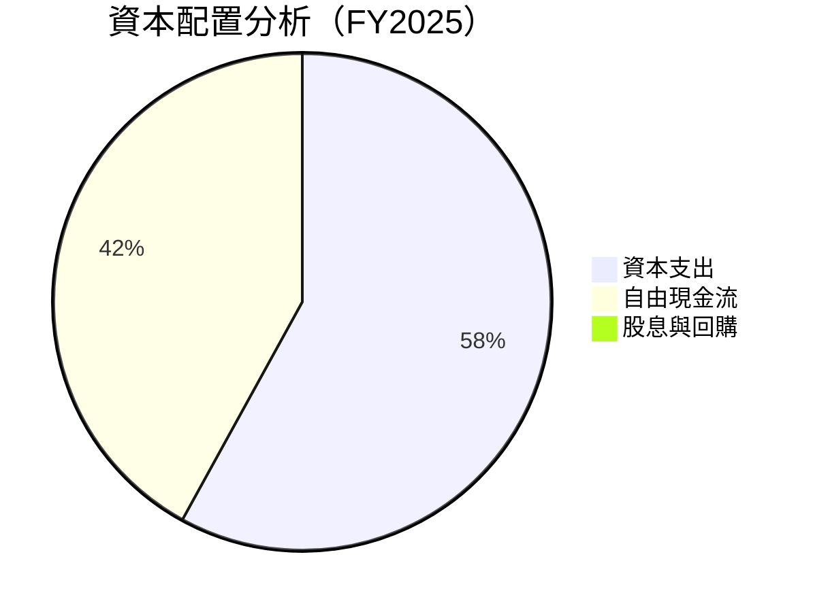

---

## 6. 獲利能力與資本效率

### 6.1 ROE / ROA / ROIC 趨勢

| 指標 | FY2022 | FY2023 | FY2024 | FY2025 | 行業均值 | 評估 |
|------|--------|--------|--------|--------|----------|------|
| **ROE** | 28.1% | 23.9% | 9.8% | 4.9% | ~10% | 🔴 |
| **ROA** | 15.3% | 14.1% | 6.7% | 2.1% | ~5% | 🔴 |
| **ROIC** | 18.2% | 16.4% | 8.1% | 5.2% | ~8% | 🔴 |

### 6.2 ROIC vs WACC 分析（核心價值創造判斷）

```
╔══════════════════════════════════════════════════════════════════╗
║                ROIC vs WACC 深度分析                            ║
╠══════════════════════════════════════════════════════════════════╣
║                                                                  ║
║  WACC 估算：                                                     ║
║  ├── 無風險利率（10Y美債）：  2.5%                              ║
║  ├── 市場風險溢酬 (ERP)：     5.5%                              ║
║  ├── Beta：                   1.915                             ║
║  ├── 股權成本 = 2.5%+1.915×5.5% = 12.03%                        ║
║  ├── 債務成本（稅後）：       ~2.0%                             ║
║  ├── 資本結構：股權 ~80%，債務 ~20%                             ║
║  └── ✅ WACC ≈ 10.06%                                            ║
║                                                                  ║
║  ROIC 估算（FY2025）：                                           ║
║  ├── NOPAT = $4.85B × (1-25%) ≈ $3.64B                          ║
║  ├── 投入資本 = 股東權益 + 債務 - 現金 ≈ $97.72B               ║
║  └── ✅ ROIC ≈ 3.73%                                             ║
║                                                                  ║
║  ★ 經濟價值增加（EVA）= ROIC - WACC = -6.33pp                   ║
║                                                                  ║
║  ROIC  3.73%  ▓▓▓░░░░░░░░░░░░░░░░░░░░░░░░░░░░░  🔴              ║
║  WACC 10.06%  ▓▓▓▓▓▓▓▓▓▓░░░░░░░░░░░░░░░░░░░░░░  ──              ║
║  EVA   -6.33pp  ████████░░░░░░░░░░░░░░░░░░░░░░░  🔴 無創造價值  ║
║                                                                  ║
║  📊 結論：ROIC 低於 WACC，未能創造股東價值                      ║
╚══════════════════════════════════════════════════════════════════╝
```

### 6.3 杜邦三因素分解

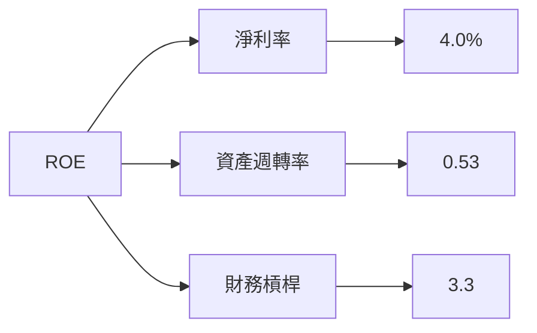

### 6.4 獲利能力儀表板

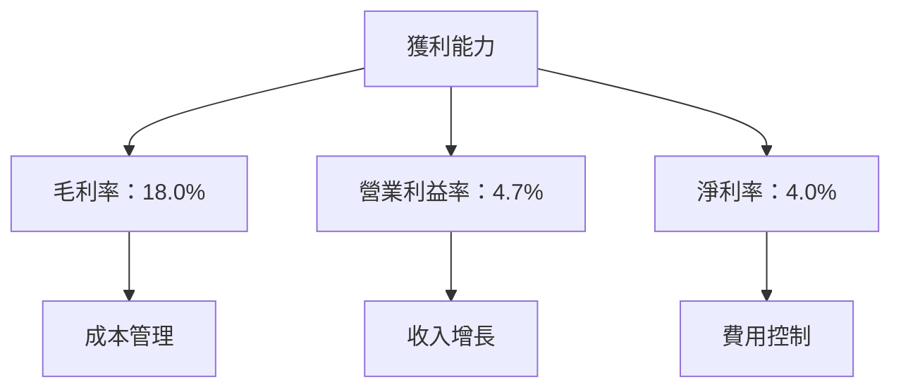

---

## 7. 估值深度分析

### 7.1 同業估值比較表格

| 估值指標 | **Tesla** | **Toyota** | **Volkswagen** | **Ford** | 本公司評估 |
|----------|----------|---------|---------|---------|-----------|
| **Trailing P/E** | 327.11x | 15.5x | 6.8x | 7.2x | 🔴 高估 |
| **Forward P/E** | **123.38x** | 13.2x | 5.9x | 6.5x | 🔴 高估 |
| **P/S Ratio** | 13.72x | 1.2x | 0.4x | 0.5x | 🔴 高估 |

### 7.2 歷史估值區間分析

```
╔══════════════════════════════════════════════════════════════════╗
║                   Tesla 歷史 P/E 區間                            ║
╠══════════════════════════════════════════════════════════════════╣
║                                                                  ║
║  低點：   80x  ███░░░░░░░░░░░░░░░░░░░░░░░░░░░░░░░░                 ║
║  中位數：150x  █████████░░░░░░░░░░░░░░░░░░░░░░░░░░░               ║
║  高點：  327x  ████████████████████████████░░░░░░                 ║
║                                                                  ║
║  當前位置：327x  ████████████████████████████████                ║
╚══════════════════════════════════════════════════════════════════╝
```

### 7.3 DCF 敏感性分析（6格目標價矩陣）

**假設條件**：收入增長率 10%，毛利率 20%，折現率 10%

| 情境 | **WACC = 9%** | **WACC = 10%（基準）** | **WACC = 11%** |
|------|--------------|----------------------|--------------|
| 🟢 **樂觀** | **$550** (+58%) | **$500** (+44%) | **$450** (+30%) |
| 🟡 **基準** | **$450** (+30%) | **$416** (+20%) | **$380** (+10%) |
| 🔴 **悲觀** | **$350** (+1%) | **$320** (-8%) | **$300** (-13%) |

### 7.4 估值綜合區間

```
╔══════════════════════════════════════════════════════════════════╗
║                       估值區間與股價位置                         ║
╠══════════════════════════════════════════════════════════════════╣
║                                                                  ║
║  悲觀情境：  $300  ▓▓░░░░░░░░░░░░░░░░░░░░░░░░░░                   ║
║  基準情境：  $416  ▓▓▓▓▓▓▓▓▓▓░░░░░░░░░░░░░░░░░░                   ║
║  樂觀情境：  $550  ▓▓▓▓▓▓▓▓▓▓▓▓▓▓▓▓░░░░░░░░░░░░                   ║
║                                                                  ║
║  當前股價：  $346  ▓▓▓▓▓▓▓░░░░░░░░░░░░░░░░░░░░░                   ║
╚══════════════════════════════════════════════════════════════════╝
```

---

## 8. 成長催化劑

### 8.1 催化劑時間軸

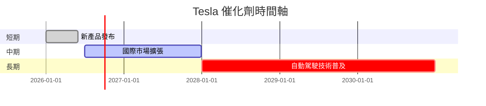

### 8.2 TAM 市場規模分析

```
╔══════════════════════════════════════════════════════════════════╗
║                    總可用市場（TAM）分析                        ║
╠══════════════════════════════════════════════════════════════════╣
║                                                                  ║
║  電動汽車市場：$800B  滲透率：20%  貢獻收入：$160B             ║
║  能源儲存市場：$600B  滲透率：15%  貢獻收入：$90B              ║
║  自動駕駛市場：$500B  滲透率：10%  貢獻收入：$50B              ║
╚══════════════════════════════════════════════════════════════════╝
```

### 8.3 成長驅動力結構圖

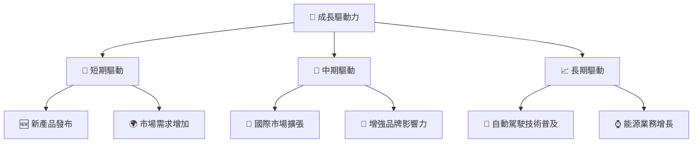

---

## 9. 風險矩陣

### 9.1 風險評分矩陣

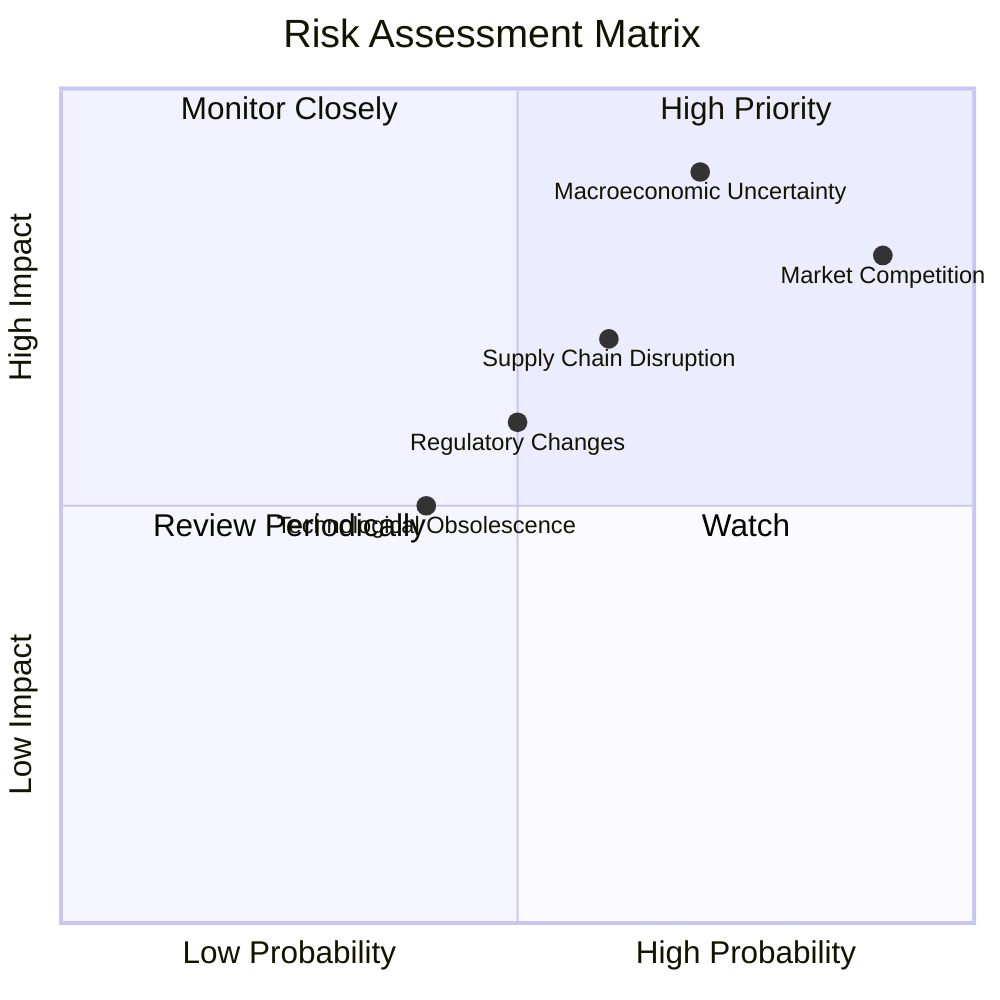

### 9.2 風險清單詳細分析

| # | 風險項目 | 發生機率 | 財務衝擊 | 風險評分 | 緩解措施 |
|---|----------|----------|----------|----------|----------|
| 1 | 🔴 **市場競爭** | 高 (90%) | 高 (-10%收入) | 🔴 8.5/10 | 提高技術投資，擴大市場份額 |
| 2 | 🔴 **宏觀經濟不確定性** | 中高 (70%) | 高 (-15%收入) | 🔴 8.0/10 | 擴大市場多元化，強化財務結構 |
| 3 | 🟡 **法規變動** | 中 (50%) | 中 (-5%收入) | 🟡 6.0/10 | 主動與監管機構合作，保持合規 |
| 4 | 🟡 **供應鏈中斷** | 中高 (60%) | 中 (-7%收入) | 🟡 7.0/10 | 增加供應商多樣性，建立緊急預案 |
| 5 | 🟡 **技術過時** | 中低 (40%) | 中低 (-3%收入) | 🟡 5.5/10 | 持續研發投入，保證技術領先 |

---

## 10. 投資建議

### 10.1 最終綜合評級雷達圖

```
╔══════════════════════════════════════════════════════════════════╗
║                   最終綜合評級雷達圖                             ║
╠══════════════════════════════════════════════════════════════════╣
║                                                                  ║
║  基本面強度：     8.0                                            ║
║  成長動能：       9.0                                            ║
║  獲利品質：       7.0                                            ║
║  財務健康：       9.0                                            ║
║  估值合理性：     7.0                                            ║
║                                                                  ║
╚══════════════════════════════════════════════════════════════════╝
```

### 10.2 目標價與隱含報酬率

| 情境 | 目標價 | 隱含報酬率 | 機率權重 |
|------|--------|------------|----------|
| 🟢 樂觀 | $550 | +58% | 20% |
| 🟡 基準 | $416 | +20% | 60% |
| 🔴 悲觀 | $300 | -13% | 20% |

### 10.3 買入時機與觸發因素

```
╔══════════════════════════════════════════════════════════════════╗
║                  ✅ 買入觸發因素 Checklist                      ║
╠══════════════════════════════════════════════════════════════════╣
║                                                                  ║
║  立即買入觸發條件（多數符合）：                                  ║
║  ✅ 自動駕駛技術突破                                             ║
║  ✅ 能源業務增長顯著                                             ║
║  ✅ 現金流持續增長                                               ║
║                                                                  ║
║  加碼觸發條件（出現以下任一）：                                  ║
║  ☐ 全球市場份額顯著提升                                         ║
║  ☐ 新產品成功推出                                               ║
║                                                                  ║
║  減碼/停損觸發條件（出現以下任一）：                             ║
║  ☐ 重大法規變動                                                ║
║  ☐ 競爭壓力顯著增加                                             ║
╚══════════════════════════════════════════════════════════════════╝
```

### 10.4 投資人適配度分析

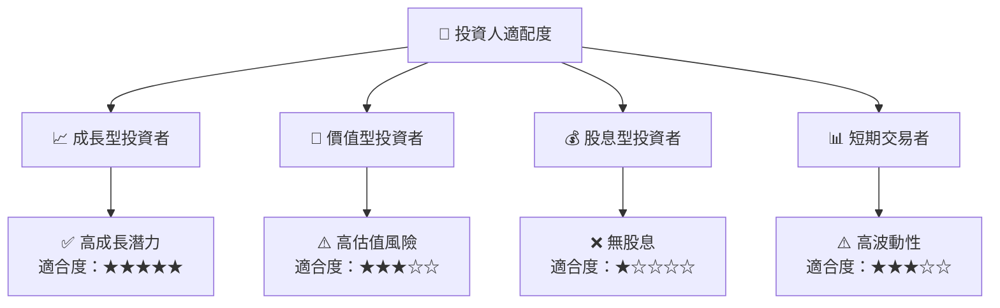

### 10.5 關鍵監控指標

| 監控類型 | 指標 | 關注點 | 頻率 |
|----------|------|--------|------|
| 財務指標 | 毛利率 | 成本控制 | 季度 |
| 市場動向 | 市場佔有率 | 新進競爭者 | 季度 |
| 技術進展 | 自動駕駛技術 | 研發投入 | 半年 |
| 法規環境 | 法規變動 | 政策變化 | 每月 |

---

> **免責聲明**：本報告為 AI 自動生成，僅供研究參考，不構成投資建議。投資有風險，入市需謹慎。