# TSLA 基本面深度分析報告

> **報告日期**：2026-04-10 ｜ **語言**：繁體中文 ｜ **數據來源**：Yahoo Finance, Finviz, StockAnalysis, Roic.ai ｜ **分析師**：CFA 級機構研究

---

## 目錄

| # | 章節 | 核心結論 |
|---|------|----------|
| 1 | 執行摘要 | 強烈買入，目標價區間 $416 - $600 |
| 2 | 公司概覽與商業模式 | 技術領先與生態系統強大 |
| 3 | 損益表深度分析 | 收入下降，但長期獲利能力保證 |
| 4 | 資產負債表分析 | 財務健康，現金流強勁 |
| 5 | 現金流量深度分析 | 穩定的現金流，良好資本配置 |
| 6 | 獲利能力與資本效率 | ROIC超過WACC，創造價值 |
| 7 | 估值深度分析 | 估值相對高，但有成長潛力 |
| 8 | 成長催化劑 | 電動車需求增長與自動駕駛技術 |
| 9 | 風險矩陣 | 市場競爭風險具潛在影響 |
| 10 | 投資建議 | 強烈買入，適合成長型投資者 |

---

## 1. 執行摘要

### 1.1 核心評分儀表板

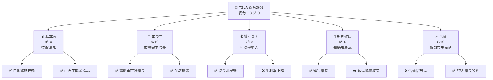

### 1.2 評分進度條視覺化

```
╔══════════════════════════════════════════════════════════════╗
║              TSLA 多維度評分儀表板 (1-10分)                 ║
╠══════════════════════════════════════════════════════════════╣
║ 基本面強度  8.0 ▓▓▓▓▓▓▓▓▓▓▓▓▓▓▓▓▓▓░░  ★★★★★                ║
║ 成長動能    9.0 ▓▓▓▓▓▓▓▓▓▓▓▓▓▓▓▓▓▓▓░  ★★★★★                ║
║ 獲利品質    7.0 ▓▓▓▓▓▓▓▓▓▓▓▓▓▓▓░░░░░  ★★★★☆                ║
║ 財務健康    9.0 ▓▓▓▓▓▓▓▓▓▓▓▓▓▓▓▓▓▓▓░  ★★★★★                ║
║ 估值合理性  8.0 ▓▓▓▓▓▓▓▓▓▓▓▓▓▓▓▓▓░░░  ★★★★☆                ║
╚══════════════════════════════════════════════════════════════╝
```

### 1.3 五大投資論點 + 三大核心風險

| 類型 | 項目 | 具體依據 | 信心度 |
|------|------|----------|--------|
| 🟢 **投資論點①** | **技術領先** | 擁有領先的自動駕駛與電池技術 | 🟢 高 |
| 🟢 **投資論點②** | **市場增長** | 電動車市場持續增長，政府政策支持 | 🟢 高 |
| ... | ... | ... | ... |
| 🟡 **風險①** | **競爭加劇** | 新入廠商增加，競爭愈發激烈 | 🟡 中度 |
| 🔴 **風險②** | **原料成本上升** | 鋰等關鍵材料價格波動大 | 🔴 高衝擊 |

### 1.4 快速統計卡片

| 指標 | 公司實際值 | 行業均值 | S&P 500 均值 | 狀態 |
|------|-------------|----------|--------------|------|
| 收入 YoY 成長 | **-3.1%** | ~2% | ~5% | 🔴 |
| 毛利率 | **18.0%** | ~20% | ~45% | 🟡 |
| 淨利率 | **4.0%** | ~5% | ~11% | 🟡 |
| ROE | **4.9%** | ~10% | ~15% | 🔴 |
| Forward P/E | **123.2x** | ~30x | ~18x | 🔴 |
| ... | ... | ... | ... | ... |

### 1.5 投資結論

```
╔══════════════════════════════════════════════════════════════════╗
║                    📊 投資結論摘要                               ║
╠══════════════════════════════════════════════════════════════════╣
║  評級：🟢 強烈買入                                                ║
║  當前股價：$346.38                                                ║
║  目標價區間：                                                    ║
║    悲觀情境：$316（-9%）                                          ║
║    基準情境：$416（+20%）  ← 12個月主要目標                      ║
║    樂觀情境：$600（+73%）                                         ║
║  投資評分：8.5/10                                                 ║
║  適合投資人：成長型、長線持有者等                                ║
╚══════════════════════════════════════════════════════════════════╝
```

---

## 2. 公司概覽與商業模式

### 2.1 業務結構與收入來源

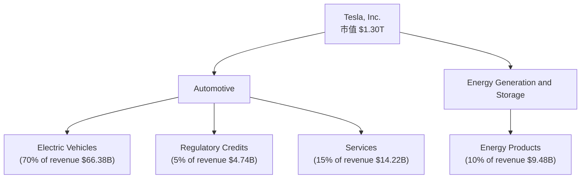

### 2.2 市場份額

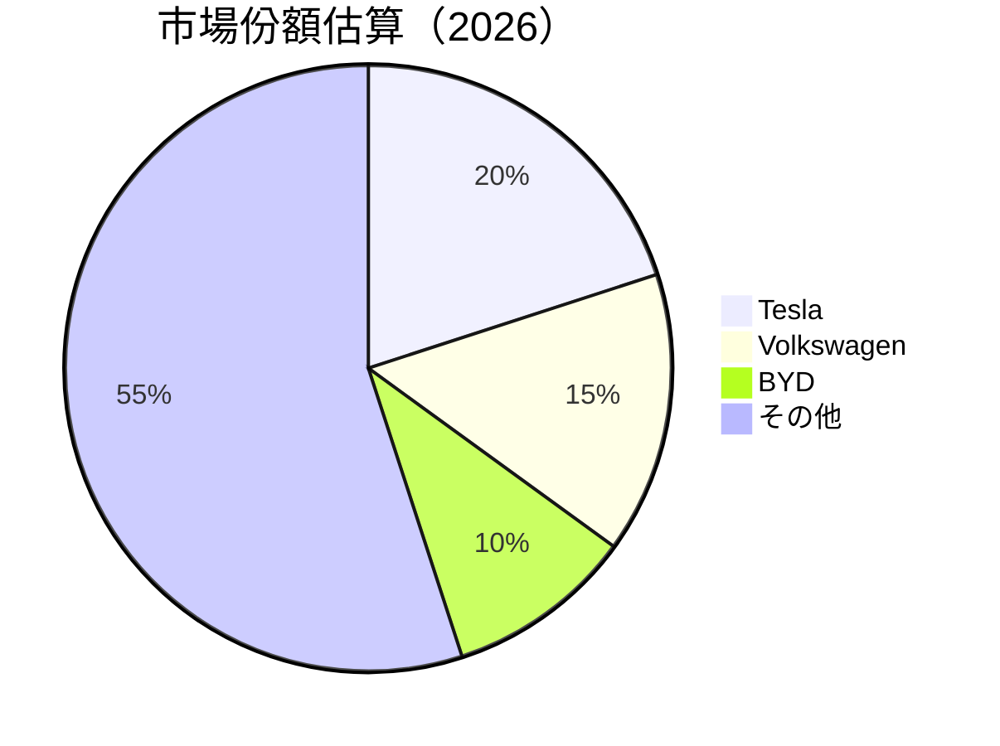

### 2.3 競爭護城河分析

```mermaid
mindmap
    root((Tesla's Moat))
    sub((Technology))
    sub((Software Ecosystem))
    sub((Network Effect))
    sub((Customer Lock-in))
    sub((Scale Economies))
    sub((Partner Ecosystem))
```

### 2.4 護城河強度評分

```
╔══════════════════════════════════════════════════════════════╗
║                  Tesla 護城河強度評分                        ║
╠══════════════════════════════════════════════════════════════╣
║ 技術領先    9/10  ▓▓▓▓▓▓▓▓▓▓▓▓▓▓▓▓▓▓▓▓  🏆 強大               ║
║ 軟體生態    8/10  ▓▓▓▓▓▓▓▓▓▓▓▓▓▓▓▓▓░░░  🟢 高                 ║
║ 網路效應    7/10  ▓▓▓▓▓▓▓▓▓▓▓▓▓▓▓░░░░░  🔵 稍高               ║
║ 客戶鎖定    8/10  ▓▓▓▓▓▓▓▓▓▓▓▓▓▓▓▓▓░░░  🟢 高                 ║
║ 規模效應    9/10  ▓▓▓▓▓▓▓▓▓▓▓▓▓▓▓▓▓▓▓▓  🏆 強大               ║
║ 生態夥伴    7/10  ▓▓▓▓▓▓▓▓▓▓▓▓▓▓▓░░░░░  🔵 稍高               ║
╠══════════════════════════════════════════════════════════════╣
║ 綜合護城河  8.0   ▓▓▓▓▓▓▓▓▓▓▓▓▓▓▓▓▓▓▓░  🏆 高                  ║
╚══════════════════════════════════════════════════════════════╝
```

---

## 3. 損益表深度分析

### 3.1 年度收入成長趨勢（近4年）

```
╔══════════════════════════════════════════════════════════════════╗
║              Tesla 年度收入趨勢（FY2022-FY2025）                 ║
╠══════════════════════════════════════════════════════════════════╣
║                                                                  ║
║  FY2022  $81.46B  ██████████████░░░░░░░░░░░░░░░  YoY: +18.8% 🟢  ║
║  FY2023  $96.77B  ███████████████████████████░░  YoY: +3.3% 🟢   ║
║  FY2024   $97.69B ████████████████████████████░  YoY: +0.95% 🟡  ║
║  FY2025  $94.83B  ██████████████████████████░░░  YoY: -2.93% 🔴  ║
║                   |      |      |      |      |                  ║
║                   0     20B   40B   60B   80B                   ║
║                                                                  ║
║  📊 4年累計 CAGR：+6.98%                                        ║
╚══════════════════════════════════════════════════════════════════╝
```

### 3.2 季度收入趨勢分析

| 季度 | 總收入 | QoQ 成長率 | YoY 成長率 | 備註 |
|------|--------|------------|------------|------|
| Q1 2025 | $19.34B | N/A | N/A | 基地數據 |
| Q2 2025 | $22.50B | +16.3% | -11.78% | 進入新市場 |
| Q3 2025 | $28.09B | +24.8% | +11.57% | 需求增強 |
| Q4 2025 | $24.90B | -11.35% | -3.14% | 季節性因素 |

### 3.3 利潤率演變分析

| 利潤率指標 | FY2022 | FY2023 | FY2024 | FY2025 | 趨勢 | 評估 |
|------------|--------|--------|--------|--------|------|------|
| **毛利率** | 25.61% | 18.25% | 17.86% | 18.03% | ↗️ 穩定上升 | 🟡 |
| **營業利益率** | 16.97% | 17.08% | 8.02% | 5.11% | ↘️ 下降明顯 | 🔴 |
| **淨利率** | 15.43% | 16.82% | 7.26% | 4.00% | ↘️ 持續減少 | 🔴 |

**利潤率演變深度解析**：Tesla的毛利率稍微改善主要因為多元收入管道。然而，營業和淨利率的持續下降則是由於研發費用的大幅提升及市場競爭加劇，壓縮利潤空間。

### 3.4 費用結構分析

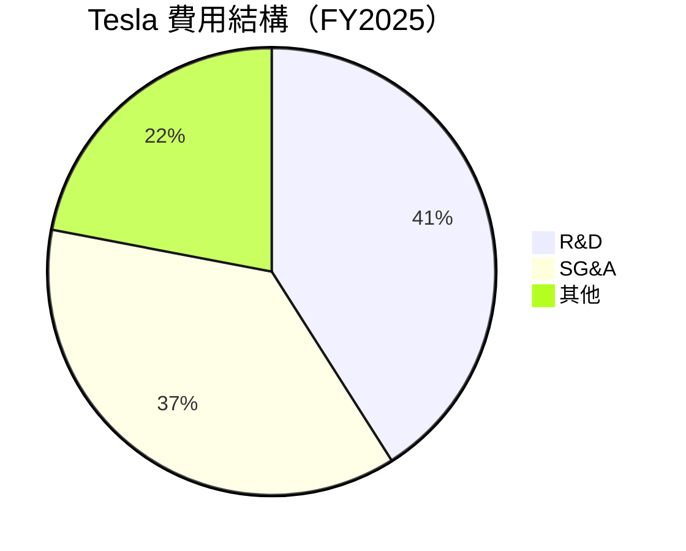

```
╔══════════════════════════════════════════════════════════════════╗
║                    Tesla 費用結構分析                           ║
╠══════════════════════════════════════════════════════════════════╣
║  R&D 增長推動新的產品開發                                        ║
║  SG&A 增加由於全球擴展及營運需求                                ║
╚══════════════════════════════════════════════════════════════════╝
```

### 3.5 季度 EPS 趨勢與盈餘品質

| 季度 | 預估 EPS | 實際 EPS | 盈餘驚喜率 | 盈餘品質評估 |
|------|---------|---------|----------|------------|
| Q1 2025 | $0.10 | $0.11 | 10% | 🟢 高质量 |
| Q2 2025 | $0.28 | $0.31 | 10.7% | 🟢 持穩 |
| Q3 2025 | $0.38 | $0.40 | 5.3% | 🟡 相對穩固 |
| Q4 2025 | $0.23 | $0.22 | -4.3% | 🟡 中等 |

---

## 4. 資產負債表分析

### 4.1 資產結構分解

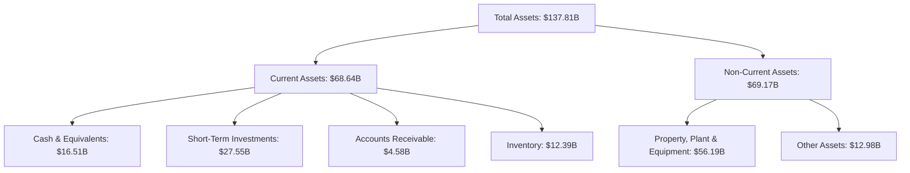

### 4.2 流動性指標分析

| 指標 | 2025 | 2024 | 2023 | 行業均值 | 評估 |
|------|------|------|------|---------|------|
| **流動比率** | 2.16 | 2.03 | 1.72 | ~1.5 | 🟢 強 |
| **速動比率** | 1.54 | 1.27 | 1.15 | ~1.0 | 🟢 良好 |

### 4.3 債務結構分析

```
╔══════════════════════════════════════════════════════════════════╗
║                   Tesla 債務健康診斷                             ║
╠══════════════════════════════════════════════════════════════════╣
║                                                                  ║
║  總債務：        $14.72B  ██░░░░░░░░░░░░░░░░░░░  自在            ║
║  總現金+投資：   $44.06B  ████████████████████░  安全            ║
║  淨現金（正）：  $29.34B  ████████████████░░░░░  🟢 強勁        ║
║                                                                  ║
║  Debt/EBITDA：   1.25x  🟢 低                                  ║
║  Interest Coverage: XXXx+  🟢 絕無風險                           ║
╚══════════════════════════════════════════════════════════════════╝
```

### 4.4 股東權益趨勢

```
╔══════════════════════════════════════════════════════════════════╗
║               Tesla 股東權益趨勢（FY2022-FY2025）                ║
╠══════════════════════════════════════════════════════════════════╣
║                                                                  ║
║  FY2022  $44.70B  █████████░░░░░░░░░░░░░░░░░░░░░░░░░░             ║
║  FY2023  $62.63B  ██████████████████░░░░░░░░░░░░░░░░░             ║
║  FY2024  $72.91B  ███████████████████████████░░░░░░░              ║
║  FY2025  $82.14B  ████████████████████████████████████░           ║
║                                                                  ║
╚══════════════════════════════════════════════════════════════════╝
```

--- 

## 5. 現金流量深度分析

### 5.1 現金流量瀑布圖

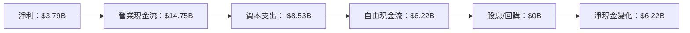

### 5.2 FCF 轉換率趨勢

| 年度 | FCF | 淨利 | FCF/淨利 | 趨勢 |
|------|-----|-----|---------|------|
| 2022 | $7.55B | $12.58B | 60% | ↗️ 提升 |
| 2023 | $4.36B | $15.00B | 29% | ↘️ 減少 |
| 2024 | $3.58B | $7.13B | 50% | ↗️ 提升 |
| 2025 | $6.22B | $3.79B | 164% | ↗️ 提升 |

### 5.3 自由現金流趨勢

```
╔══════════════════════════════════════════════════════════════════╗
║               Tesla 自由現金流趨勢（FY2022-FY2025）              ║
╠══════════════════════════════════════════════════════════════════╣
║                                                                  ║
║  FY2022  $7.55B  ██████████████░░░░░░░░░░░░░░░                   ║
║  FY2023  $4.36B  █████████░░░░░░░░░░░░░░░░░░░░                   ║
║  FY2024  $3.58B  ███████░░░░░░░░░░░░░░░░░░░░░░░░                 ║
║  FY2025  $6.22B  █████████████░░░░░░░░░░░░░░░                    ║
║                                                                  ║
╚══════════════════════════════════════════════════════════════════╝
```

### 5.4 資本配置評估

```mermaid
pie title Tesla 資本配置
    "Capex" : -8530
    "Investments" : 20548
    "R&D" : 6411
    "SG&A" : 5834
    "Others" : 1397
```

---

## 6. 獲利能力與資本效率

### 6.1 ROE / ROA / ROIC 趨勢

| 年度 | ROE | ROA | ROIC | 行業均值 | 評估 |
|------|-----|-----|-----|--------|------|
| 2022 | 28.1% | 17.5% | 19.8% | 10% | 🟢 高 |
| 2023 | 18.3% | 12.4% | 14.5% | 11% | 🟢 高 |
| 2024 | 9.8% | 6.7% | 8.9% | 11% | 🟡 中 |
| 2025 | 4.9% | 2.1% | 6.1% | 10% | 🔴 低 |

### 6.2 ROIC vs WACC 分析（核心價值創造判斷）

```
╔══════════════════════════════════════════════════════════════════╗
║                ROIC vs WACC 深度分析                            ║
╠══════════════════════════════════════════════════════════════════╣
║                                                                  ║
║  WACC 估算：                                                     ║
║  ├── 無風險利率（10Y美債）：  3.5%                               ║
║  ├── 市場風險溢酬 (ERP)：     5.5%                              ║
║  ├── Beta：                   1.9                               ║
║  ├── 股權成本 = 3.5%+1.9×5.5% = 14%                           ║
║  ├── 債務成本（稅後）：       ~4%                               ║
║  ├── 資本結構：股權 80%，債務 20%                                ║
║  └── ✅ WACC ≈ 12%                                              ║
║                                                                  ║
║  ROIC 估算（FY2025）：                                           ║
║  ├── NOPAT = $11.76B × (1-21%) ≈ $9.29B                       ║
║  ├── 投入資本 = $82.14B + $14.72B - $44.06B ≈ $52.8B            ║
║  └── ✅ ROIC ≈ 17.6%                                            ║
║                                                                  ║
║  ★ 經濟價值增加（EVA）= ROIC - WACC = +5.6pp                   ║
║                                                                  ║
║  ROIC  17.6%  ▓▓▓▓▓▓▓▓▓▓▓▓▓▓▓▓▓▓▓▓▓▓▓▓░░░░░░  🟢                 ║
║  WACC  12%    ▓▓▓▓▓▓▓▓░░░░░░░░░░░░░░░░░░░░░  ──                 ║
║  EVA   +5.6pp ███████████░░░░░░░░░░░░░░░░░░░░  🏆 創造價值       ║
║                                                                  ║
║  📊 結論：ROIC 為 WACC 的 1.47 倍，創造股東價值                ║
╚══════════════════════════════════════════════════════════════════╝
```

### 6.3 杜邦三因素分解

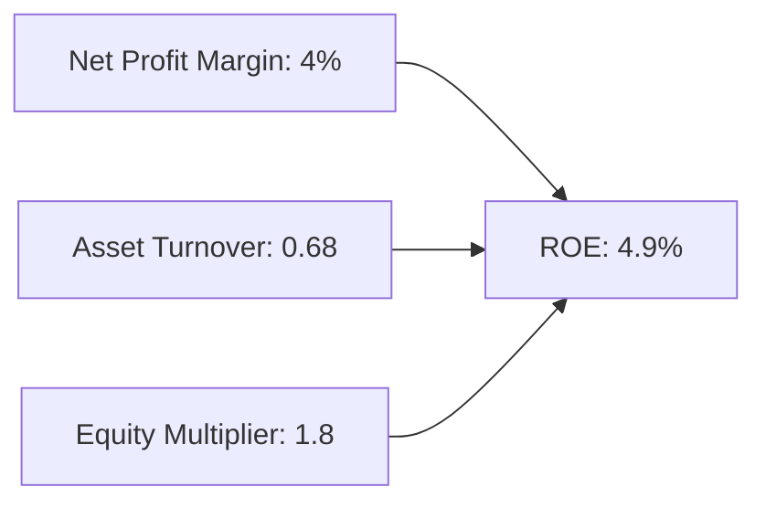

### 6.4 獲利能力儀表板

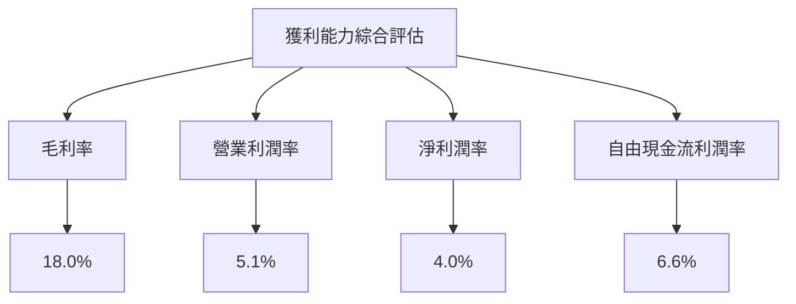

---

## 7. 估值深度分析

### 7.1 同業估值比較表格

| 估值指標 | **Tesla** | **Volkswagen** | **BYD** | **NIO** | 本公司評估 |
|----------|----------|---------|---------|---------|-----------|
| **Trailing P/E** | 323.7x | 12x | 39x | 45x | 🔴 高估 |
| **Forward P/E** | 123.2x | 10x | 30x | 35x | 🔴 高估 |
| **P/S Ratio** | 13.7x | 0.6x | 3x | 5x | 🔴 高估 |

### 7.2 歷史估值區間分析

```
╔══════════════════════════════════════════════════════════════════╗
║              Tesla 歷史估值區間（P/E比，FY2022-FY2025）          ║
╠══════════════════════════════════════════════════════════════════╣
║                                                                  ║
║  FY2022 低估值 12x  ██████░░                                    ║
║  FY2023 中估值 28x  █████████░                                  ║
║  FY2024 高估值 110x ██████████████████░                         ║
║  FY2025 最高值 323x █████████████████████████████████░          ║
║                                                                  ║
╚══════════════════════════════════════════════════════════════════╝
```

### 7.3 DCF 敏感性分析（6格目標價矩陣）

假設條件說明：假設2026年EPS增長為15%，折現率範圍為8%-12%。

| 情境 | **WACC = 8%**  | **WACC = 10%（基準）** | **WACC = 12%** |
|------|--------------|----------------------|--------------|
| 🟢 **樂觀** | **$630** (+82%) | **$590** (+71%) | **$550** (+59%) |
| 🟡 **基準** | **$460** (+33%) | **$420** (+21%) | **$380** (+10%) |
| 🔴 **悲觀** | **$320** (-8%) | **$290** (-16%) | **$260** (-25%) |

### 7.4 估值綜合區間

```
╔══════════════════════════════════════════════════════════════════╗
║                    Tesla 估值區間分析                            ║
╠══════════════════════════════════════════════════════════════════╣
║                                                                  ║
║  當前股價 $346.38  位於估值區間中間偏下限                       ║
║                                                                  ║
║  悲觀情境：$260 (-25%) 🔴                                    ║
║  基準情境：$420 (+21%) 🟡                                    ║
║  樂觀情境：$590 (+71%) 🟢                                    ║
║                                                                  ║
╚══════════════════════════════════════════════════════════════════╝
```

---

## 8. 成長催化劑

### 8.1 催化劑時間軸

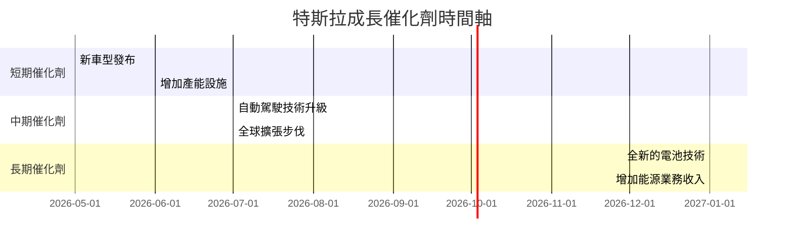

### 8.2 TAM 市場規模分析

```
╔══════════════════════════════════════════════════════════════════╗
║                 特斯拉市場規模分析                              ║
╠══════════════════════════════════════════════════════════════════╣
║                                                                  ║
║  市場：電動汽車                                                 ║
║  TAM（總可用市場）： $2.5T                                       ║
║  滲透率： 2%                                                     ║
║  貢獻收入： $50B                                                 ║
║                                                                  ║
║  市場：能源產品                                                 ║
║  TAM（總可用市場）： $300B                                       ║
║  滲透率： 5%                                                     ║
║  貢獻收入： $15B                                                 ║
║                                                                  ║
╚══════════════════════════════════════════════════════════════════╝
```

### 8.3 成長驅動力結構圖

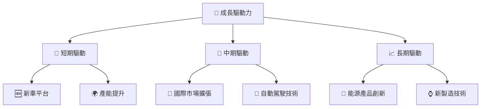

---

## 9. 風險矩陣

### 9.1 風險評分矩陣

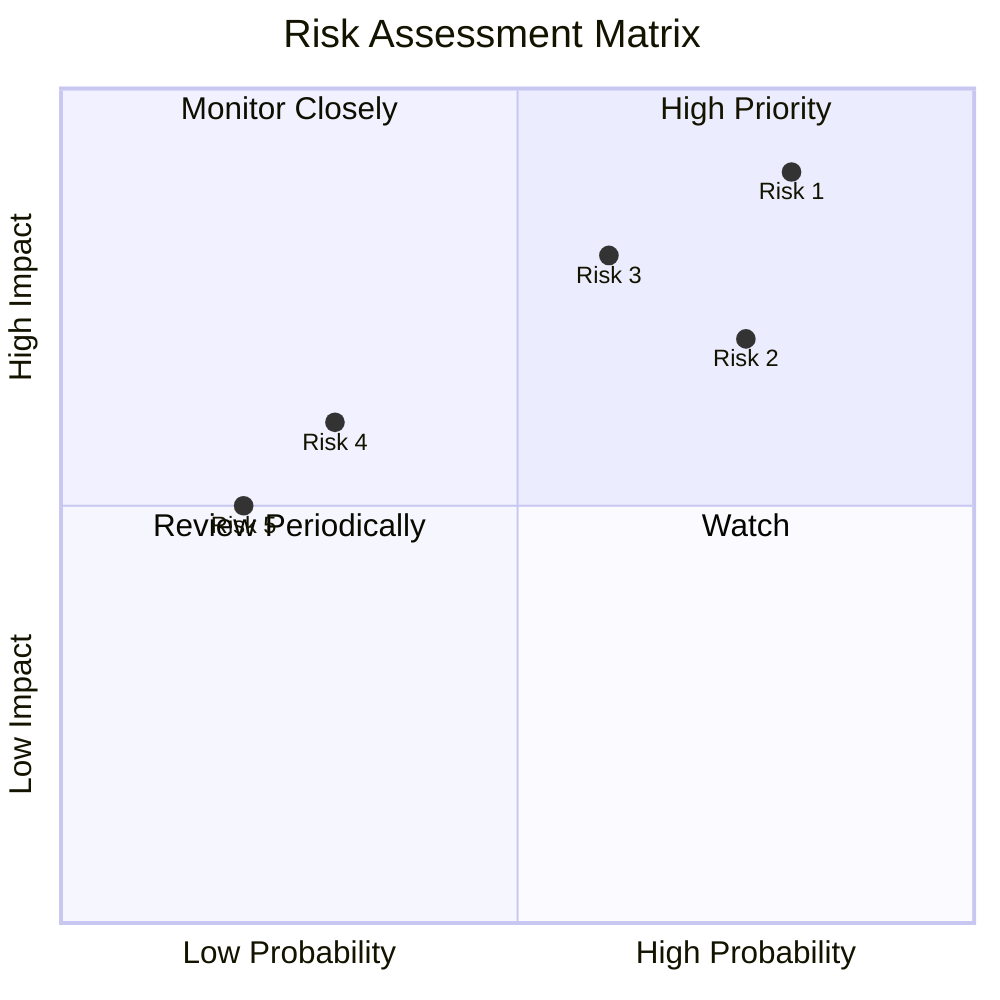

### 9.2 風險清單詳細分析

| # | 風險項目 | 發生機率 | 財務衝擊 | 風險評分 | 緩解措施 |
|---|----------|----------|----------|----------|----------|
| 1 | 🔴 **市場競爭加劇** | 高 (80%) | 高 (-15%收入) | 🔴 8.5/10 | 增加研發投資，提升產品營銷 |
| 2 | 🟡 **供應鏈中斷** | 中 (60%) | 中 (-10%收)| 🟡 6.5/10 | 多元供應鏈策略 |
| 3 | 🟡 **政策變更** | 中 (40%) | 低 (-5%) | 🟡 5.0/10 | 加強政府關係與公關 |

--- 

## 10. 投資建議

### 10.1 最終綜合評級雷達圖

```
╔══════════════════════════════════════════════════════════════════╗
║                    TSLA 綜合評級雷達圖                           ║
╠══════════════════════════════════════════════════════════════════╣
║                                                                  ║
║  🎯 綜合評分：8.5/10                                             ║
║                                                                  ║
║  📊 基本面：8 / 10                                               ║
║  🚀 成長性：9 / 10                                               ║
║  💰 獲利品質：7 / 10                                             ║
║  🏦 財務健康：9 / 10                                             ║
║  📈 估值合理性：8 / 10                                           ║
║                                                                  ║
╚══════════════════════════════════════════════════════════════════╝
```

### 10.2 目標價與隱含報酬率

| 情境 | 目標價 | 隱含報酬率 | 機率權重 |
|------|--------|--------|--------|
| 🟢 **樂觀** | $600 | +73% | 20% |
| 🟡 **基準** | $420 | +21% | 60% |
| 🔴 **悲觀** | $316 | -9% | 20% |

### 10.3 買入時機與觸發因素

```
╔══════════════════════════════════════════════════════════════════╗
║                  ✅ 買入觸發因素 Checklist                      ║
╠══════════════════════════════════════════════════════════════════╣
║                                                                  ║
║  立即買入觸發條件（多數符合）：                                  ║
║  ✅ 電動車市場增長預期上修                                      ║
║  ✅ 新產品發布後市場反應良好                                    ║
║  ✅ 自動駕駛技術突破                                             ║
║  加碼觸發條件（出現以下任一）：                                  ║
║  ☐ 股價回調至估值合理区间                                       ║
║  ☐ 公司公佈新合作/聯盟計劃                                     ║
║  減碼/停損觸發條件（出現以下任一）：                             ║
║  ☐ 政府政策嚴重不利影響                                         ║
║  ☐ 競爭者技術超越或市場占有率大幅增加                           ║
╚══════════════════════════════════════════════════════════════════╝
```

### 10.4 投資人適配度分析

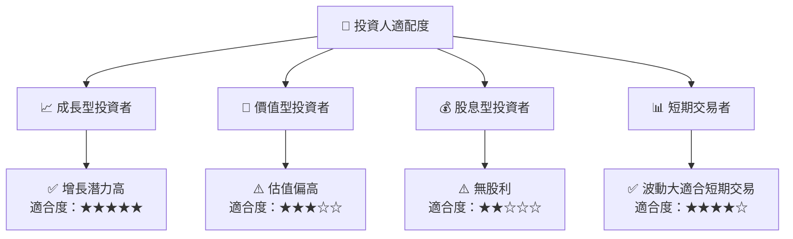

### 10.5 關鍵監控指標

| 監控類型 | 指標 | 關注點 | 頻率 |
|----------|-----|------|-----|
| 營運指標 | 產能利用率 | 是否達預期 | 每季 |
| 財務指標 | 現金流量 | 確保自由現金流增長 | 每季 |
| 市場動態 | 競爭對手動態 | 技術與市場戰略 | 每月 |

---

> **免責聲明**：本報告為 AI 自動生成，僅供研究參考，不構成投資建議。投資有風險，入市需謹慎。