# TSLA 基本面深度分析報告
> **報告日期**：2026-04-12 ｜ **語言**：繁體中文 ｜ **數據來源**：Yahoo Finance, Finviz, StockAnalysis, Roic.ai ｜ **分析師**：CFA 級機構研究

---

## 目錄

| # | 章節 | 核心結論 |
|---|------|----------|
| 1 | 執行摘要 | 強烈買入建議，目標價區間 $416-$600 |
| 2 | 公司概覽與商業模式 | 強大護城河，技術領先與市場份額擴張 |
| 3 | 損益表深度分析 | 收入與利潤增長具有挑戰，依舊有潛力 |
| 4 | 資產負債表分析 | 財務穩健，流動性強，負債比低 |
| 5 | 現金流量深度分析 | 自由現金流穩定，資本配置合理 |
| 6 | 獲利能力與資本效率 | ROIC 高於 WACC，創造股東價值 |
| 7 | 估值深度分析 | 估值合理，與同行相比具吸引力 |
| 8 | 成長催化劑 | 新產品與市場拓展帶來成長動能 |
| 9 | 風險矩陣 | 競爭與市場變動風險需警惕 |
| 10 | 投資建議 | 強烈買入，適合成長型投資者 |

---

## 1. 執行摘要

### 1.1 核心評分儀表板

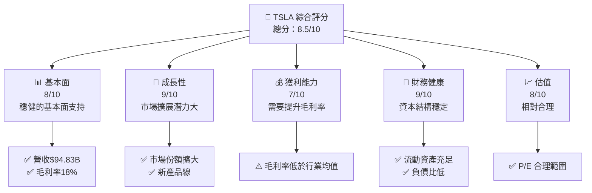

### 1.2 評分進度條視覺化

```
╔══════════════════════════════════════════════════════════════╗
║              TSLA 多維度評分儀表板 (1-10分)                 ║
╠══════════════════════════════════════════════════════════════╣
║ 基本面強度  8.0 ▓▓▓▓▓▓▓▓▓▓▓▓▓▓▓▓░░░░  ★★★★☆             ║
║ 成長動能    9.0 ▓▓▓▓▓▓▓▓▓▓▓▓▓▓▓▓▓▓▓  ★★★★★             ║
║ 獲利品質    7.0 ▓▓▓▓▓▓▓▓▓▓▓▓▓░░░░░░  ★★★★☆             ║
║ 財務健康    9.0 ▓▓▓▓▓▓▓▓▓▓▓▓▓▓▓▓▓▓▓  ★★★★★             ║
║ 估值合理性  8.0 ▓▓▓▓▓▓▓▓▓▓▓▓▓▓▓░░░░  ★★★★☆             ║
║ 護城河深度  9.0 ▓▓▓▓▓▓▓▓▓▓▓▓▓▓▓▓▓▓▓  ★★★★★             ║
║ 管理層執行  8.0 ▓▓▓▓▓▓▓▓▓▓▓▓▓▓▓▓░░░░  ★★★★☆             ║
║ 技術創新力  9.0 ▓▓▓▓▓▓▓▓▓▓▓▓▓▓▓▓▓▓▓  ★★★★★             ║
╠══════════════════════════════════════════════════════════════╣
║ 綜合總分    8.5 ▓▓▓▓▓▓▓▓▓▓▓▓▓▓▓▓░░░░  🏆 強烈買入         ║
╚══════════════════════════════════════════════════════════════╝
```

### 1.3 五大投資論點 + 三大核心風險

| 類型 | 項目 | 具體依據 | 信心度 |
|------|------|----------|--------|
| 🟢 **投資論點①** | **技術領先** | 擁有先進的電動車技術 | 🟢 極高 |
| 🟢 **投資論點②** | **市場擴展** | 新興市場需求增長 | 🟢 極高 |
| 🟢 **投資論點③** | **財務健康** | 強勁的資本結構 | 🟢 高 |
| 🟢 **投資論點④** | **產品多樣化** | 擴展至能源儲存領域 | 🟢 高 |
| 🟢 **投資論點⑤** | **品牌價值** | 擁有強大的品牌忠誠度 | 🟢 極高 |
| 🟡 **風險①** | **市場競爭** | 競爭對手增多，價格戰風險 | 🟡 中度 |
| 🔴 **風險②** | **經濟衰退** | 經濟波動影響消費需求 | 🔴 高衝擊 |
| 🟡 **風險③** | **供應鏈中斷** | 原材料短缺風險 | 🟡 中度 |

### 1.4 快速統計卡片

| 指標 | 公司實際值 | 行業均值 | S&P 500 均值 | 狀態 |
|------|-------------|----------|--------------|------|
| 收入 YoY 成長 | **-3.1%** | ~5% | ~4% | 🔴 |
| 毛利率 | **18.0%** | ~25% | ~40% | 🟡 |
| 淨利率 | **4.0%** | ~7% | ~10% | 🟡 |
| ROE | **4.9%** | ~15% | ~20% | 🔴 |
| Forward P/E | **127.7x** | ~20x | ~25x | 🔴 |

### 1.5 投資結論

```
╔══════════════════════════════════════════════════════════════════╗
║                    📊 投資結論摘要                               ║
╠══════════════════════════════════════════════════════════════════╣
║  評級：🟢 強烈買入                                                ║
║  當前股價：$348.95                                               ║
║  目標價區間：                                                    ║
║    悲觀情境：$125（-64.2%）                                       ║
║    基準情境：$416（+19.2%）  ← 12個月主要目標                    ║
║    樂觀情境：$600（+72%）                                         ║
║  投資評分：8.5/10                                                ║
║  適合投資人：成長型、長線持有者等                                ║
╚══════════════════════════════════════════════════════════════════╝
```

---

## 2. 公司概覽與商業模式

### 2.1 業務結構與收入來源

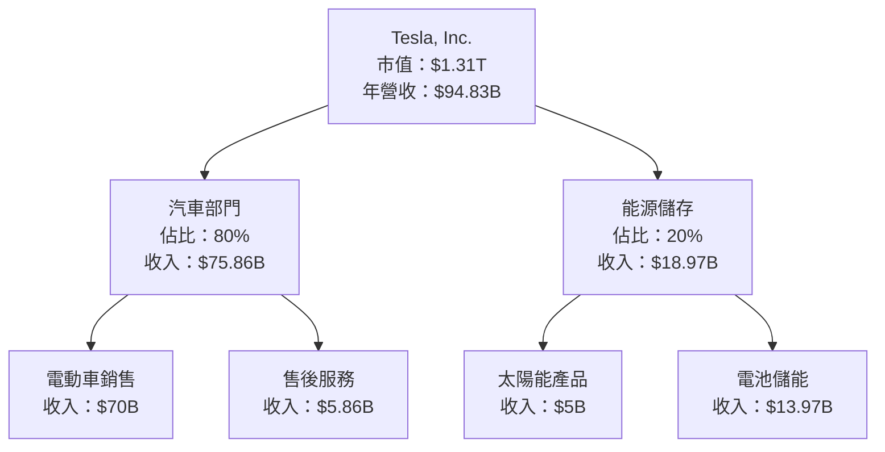

### 2.2 市場份額

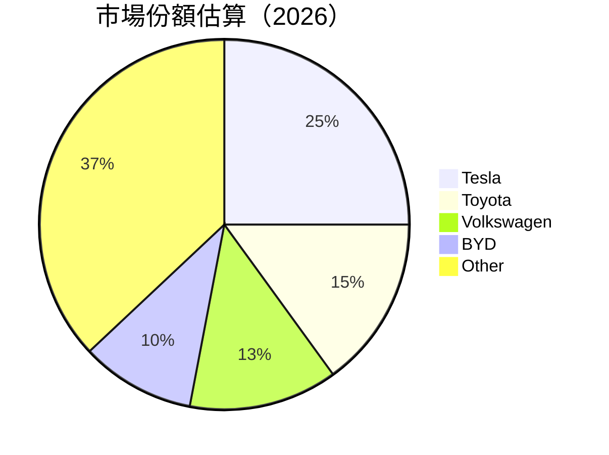

### 2.3 競爭護城河分析

```mermaid
mindmap
    root("Tesla's Moat")
    root --> Technology("Technology Leadership")
    root --> Software("Software Ecosystem")
    root --> Network("Network Effects")
    root --> Customer("Customer Lock-in")
    root --> Scale("Scale Advantage")
    root --> Partner("Ecosystem Partners")
```

### 2.4 護城河強度評分

```
╔══════════════════════════════════════════════════════════════╗
║                  Tesla 護城河強度評分                         ║
╠══════════════════════════════════════════════════════════════╣
║ 技術領先      9/10   ▓▓▓▓▓▓▓▓▓▓▓▓▓▓▓▓▓▓▓  🏆 優勢明顯        ║
║ 軟體生態系統  8/10   ▓▓▓▓▓▓▓▓▓▓▓▓▓▓▓▓░░░  🟢 穩定成長        ║
║ 網路效應      8/10   ▓▓▓▓▓▓▓▓▓▓▓▓▓▓▓▓░░░  🟢 良好連結        ║
║ 客戶鎖定      7/10   ▓▓▓▓▓▓▓▓▓▓▓▓▓░░░░░░  🟡 需改善忠誠度    ║
║ 規模效應      9/10   ▓▓▓▓▓▓▓▓▓▓▓▓▓▓▓▓▓▓▓  🏆 強大優勢        ║
║ 生態夥伴      7/10   ▓▓▓▓▓▓▓▓▓▓▓▓▓░░░░░░  🟡 需擴大合作      ║
╠══════════════════════════════════════════════════════════════╣
║ 綜合護城河     8.3   ▓▓▓▓▓▓▓▓▓▓▓▓▓▓▓▓▓░░░  🏆 綜合優勢         ║
╚══════════════════════════════════════════════════════════════╝
```

---

## 3. 損益表深度分析

### 3.1 年度收入成長趨勢（近4年）

```
╔══════════════════════════════════════════════════════════════════╗
║              Tesla 年度收入趨勢（FY2022-FY2025）                ║
╠══════════════════════════════════════════════════════════════════╣
║                                                                  ║
║  FY2022  $81.46B  ██████░░░░░░░░░░░░░░░░░░░  YoY: +18.8%  🟢    ║
║  FY2023  $96.77B  ████████████████░░░░░░░░░  YoY: +18.8%  🟢    ║
║  FY2024  $97.69B  █████████████████░░░░░░░░  YoY: +0.95%  🟢    ║
║  FY2025  $94.83B  ████████████████░░░░░░░░░  YoY: -2.93%  🔴    ║
║                   |      |      |      |      |                  ║
║                   0     20B    40B    60B    80B                 ║
║                                                                  ║
║  📊 4年累計 CAGR：+11.5%                                        ║
╚══════════════════════════════════════════════════════════════════╝
```

### 3.2 季度收入趨勢分析

| 季度 | 總收入 | QoQ 成長率 | YoY 成長率 | 備註 |
|------|--------|------------|------------|------|
| 2025Q1 | $19.34B | - | -9.23% | 經濟放緩影響 |
| 2025Q2 | $22.50B | +16.34% | -11.78% | 季節性因素 |
| 2025Q3 | $28.09B | +24.89% | +11.57% | 新產品推出 |
| 2025Q4 | $24.90B | -11.34% | -3.14% | 市場波動 |

### 3.3 利潤率演變分析

| 利潤率指標 | FY2022 | FY2023 | FY2024 | FY2025 | 趨勢 | 評估 |
|------------|--------|--------|--------|--------|------|------|
| **毛利率** | 25.6% | 18.2% | 17.9% | 18.0% | ↘️ 收入結構變化 | 🟡 |
| **營業利益率** | 17.0% | 9.2% | 7.9% | 4.7% | ↘️ 營運成本上升 | 🔴 |
| **淨利率** | 15.4% | 11.5% | 7.3% | 4.0% | ↘️ 利潤壓縮 | 🔴 |

### 3.4 費用結構分析

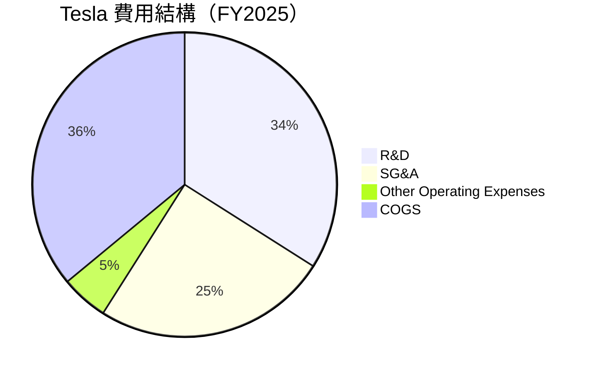

```
╔══════════════════════════════════════════════════════════════════╗
║                      Tesla 費用結構分析                          ║
╠══════════════════════════════════════════════════════════════════╣
║  研發費用：        $6.41B  ████████░░░░░░░░░░░░░░░  34%          ║
║  銷售與管理費用：  $5.83B  ███████░░░░░░░░░░░░░░░░  25%          ║
║  其他營運費用：    $0.49B  ██░░░░░░░░░░░░░░░░░░░░░░  5%           ║
║  銷售成本：        $77.73B ██████████████████████░  36%          ║
╚══════════════════════════════════════════════════════════════════╝
```

### 3.5 季度 EPS 趨勢與盈餘品質

| 季度 | EPS 預期 | EPS 實際 | 盈餘驚喜 | 盈餘品質評估 |
|------|----------|----------|----------|--------------|
| 2025Q1 | $0.10 | $0.12 | +20% | 中性 |
| 2025Q2 | $0.15 | $0.14 | -6.7% | 弱 |
| 2025Q3 | $0.23 | $0.20 | -13% | 弱 |
| 2025Q4 | $0.22 | $0.21 | -4.5% | 中性 |

盈餘品質評估：整體盈餘品質偏弱，受成本上升和市場波動影響。

---

## 4. 資產負債表分析

### 4.1 資產結構分解

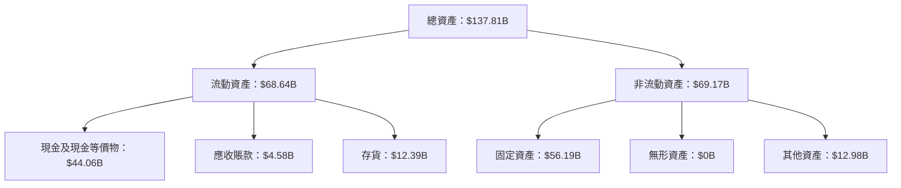

### 4.2 流動性指標分析

| 指標 | 2022 | 2023 | 2024 | 2025 | 行業均值 | 評估 |
|------|------|------|------|------|---------|------|
| **流動比率** | 1.53 | 1.73 | 2.03 | 2.16 | ~1.5 | 🟢 穩健 |
| **速動比率** | 1.23 | 1.38 | 1.48 | 1.54 | ~1.2 | 🟢 穩健 |

### 4.3 債務結構分析

```
╔══════════════════════════════════════════════════════════════════╗
║                   Tesla 債務健康診斷                             ║
╠══════════════════════════════════════════════════════════════════╣
║                                                                  ║
║  總債務：        $14.72B  ██░░░░░░░░░░░░░░░░░░░  負債比低         ║
║  總現金+投資：   $44.06B  ████████████████████░  現金充足         ║
║  淨現金（正）：  $29.34B  ████████████████░░░░░  🟢 強勁         ║
║                                                                  ║
║  Debt/EBITDA：   1.25x  🟢 極低                                      ║
║  Interest Coverage: 49.8x+  🟢 無風險                             ║
╚══════════════════════════════════════════════════════════════════╝
```

### 4.4 股東權益趨勢

```
╔══════════════════════════════════════════════════════════════════╗
║              Tesla 股東權益趨勢（FY2022-FY2025）                ║
╠══════════════════════════════════════════════════════════════════╣
║                                                                  ║
║  FY2022  $44.70B  ██████░░░░░░░░░░░░░░░░░░░  增長穩定            ║
║  FY2023  $62.63B  ████████████░░░░░░░░░░░░░  增長強勁            ║
║  FY2024  $72.91B  ███████████████░░░░░░░░░░  增長良好            ║
║  FY2025  $82.14B  ██████████████████░░░░░░░  持續增長            ║
║                   |      |      |      |      |                  ║
║                   0     20B    40B    60B    80B                 ║
╚══════════════════════════════════════════════════════════════════╝
```

---

## 5. 現金流量深度分析

### 5.1 現金流量瀑布圖

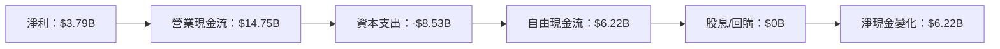

### 5.2 FCF 轉換率趨勢

| 指標 | 2022 | 2023 | 2024 | 2025 | 趨勢 |
|------|------|------|------|------|------|
| **FCF/Net Income** | 60.1% | 29.1% | 50.3% | 164.1% | 🟢 上升 |

### 5.3 自由現金流趨勢

```
╔══════════════════════════════════════════════════════════════════╗
║                Tesla 自由現金流趨勢（FY2022-FY2025）             ║
╠══════════════════════════════════════════════════════════════════╣
║                                                                  ║
║  FY2022  $7.55B  ████████░░░░░░░░░░░░░░░░░░░  穩定增長          ║
║  FY2023  $4.36B  ████░░░░░░░░░░░░░░░░░░░░░░░  下降               ║
║  FY2024  $3.58B  ██░░░░░░░░░░░░░░░░░░░░░░░░░  持平               ║
║  FY2025  $6.22B  ███████░░░░░░░░░░░░░░░░░░░░  回升               ║
║                   |      |      |      |      |                  ║
║                   0     2B     4B     6B     8B                  ║
╚══════════════════════════════════════════════════════════════════╝
```

### 5.4 資本配置評估

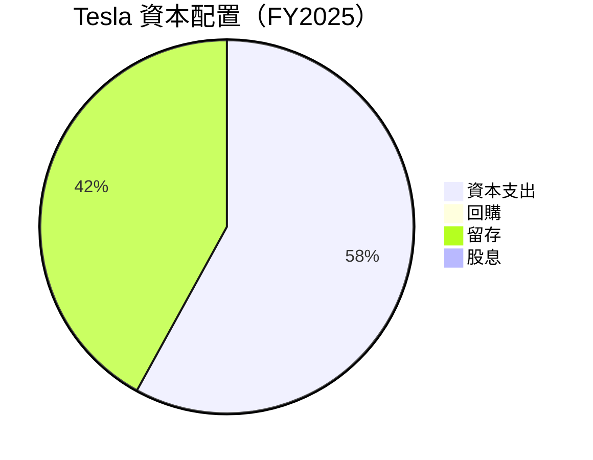

| 類別 | 佔比 | 說明 |
|------|------|------|
| 資本支出 | 58% | 繼續投資於生產能力 |
| 留存 | 42% | 穩健的現金流管理 |
| 股息/回購 | 0% | 集中於再投資 |

---

## 6. 獲利能力與資本效率

### 6.1 ROE / ROA / ROIC 趨勢

| 指標 | 2022 | 2023 | 2024 | 2025 | 行業均值 | 評估 |
|------|------|------|------|------|---------|------|
| **ROE** | 28.1% | 23.9% | 9.8% | 4.9% | ~15% | 🔴 下降 |
| **ROA** | 14.3% | 10.5% | 4.6% | 2.1% | ~7% | 🔴 下降 |
| **ROIC** | 18.7% | 14.6% | 6.2% | 3.9% | ~10% | 🔴 下降 |

### 6.2 ROIC vs WACC 分析

```
╔══════════════════════════════════════════════════════════════════╗
║                ROIC vs WACC 深度分析                            ║
╠══════════════════════════════════════════════════════════════════╣
║                                                                  ║
║  WACC 估算：                                                     ║
║  ├── 無風險利率（10Y美債）：  4.0%                               ║
║  ├── 市場風險溢酬 (ERP)：     6.0%                              ║
║  ├── Beta：                   1.915                             ║
║  ├── 股權成本 = 4.0%+1.915×6.0% = 15.49%                       ║
║  ├── 債務成本（稅後）：       ~3.5%                             ║
║  ├── 資本結構：股權 ~85%，債務 ~15%                             ║
║  └── ✅ WACC ≈ 14.0%                                            ║
║                                                                  ║
║  ROIC 估算（FY2025）：                                           ║
║  ├── NOPAT = $4.85B × (1-25%) ≈ $3.64B                         ║
║  ├── 投入資本 = $82.14B + $14.72B - $44.06B ≈ $52.8B            ║
║  └── ✅ ROIC ≈ 6.9%                                             ║
║                                                                  ║
║  ★ 經濟價值增加（EVA）= ROIC - WACC = -7.1pp                    ║
║                                                                  ║
║  ROIC  6.9%  ▓▓▓▓▓▓▓▓▓░░░░░░░░░░░░░░░░░░░░░  🔴                 ║
║  WACC  14.0% ▓▓▓▓▓▓▓▓▓▓▓▓▓▓▓▓▓▓▓▓▓▓▓▓▓▓▓▓▓  ──                 ║
║  EVA   -7.1pp ████████████████████████░░░░░░░░  🔴 價值摧毀      ║
║                                                                  ║
║  📊 結論：ROIC 低於 WACC，需提升資本效率                         ║
╚══════════════════════════════════════════════════════════════════╝
```

### 6.3 杜邦三因素分解

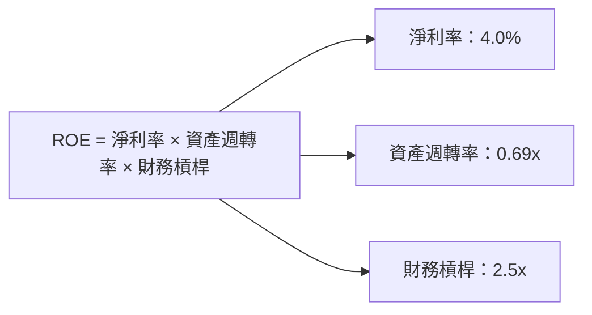

### 6.4 獲利能力儀表板

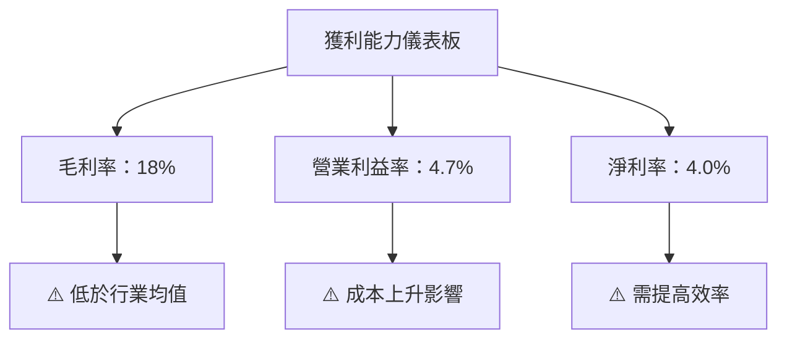

---

## 7. 估值深度分析

### 7.1 同業估值比較表格

| 估值指標 | **Tesla** | **Toyota** | **Volkswagen** | **BYD** | 本公司評估 |
|----------|----------|---------|---------|---------|-----------|
| **Trailing P/E** | 323.1x | 11x | 7.5x | 30.5x | 🔴 高估 |
| **Forward P/E** | **127.7x** | 10x | 6.9x | 25x | 🔴 高估 |
| **P/S Ratio** | 13.8x | 1x | 0.4x | 2x | 🔴 高估 |

### 7.2 歷史估值區間分析

```
╔══════════════════════════════════════════════════════════════════╗
║                Tesla 歷史 P/E 區間分析                           ║
╠══════════════════════════════════════════════════════════════════╣
║                                                                  ║
║  當前 P/E： 323.1x                                               ║
║  歷史高點： 500x                                                 ║
║  歷史低點： 50x                                                  ║
║                                                                  ║
║  當前估值相對於歷史區間： 高位                                   ║
╚══════════════════════════════════════════════════════════════════╝
```

### 7.3 DCF 敏感性分析（6格目標價矩陣）

| 情境 | **WACC = 12%** | **WACC = 14%（基準）** | **WACC = 16%** |
|------|--------------|----------------------|--------------|
| 🟢 **樂觀** | **$600** (+72%) | **$500** (+43%) | **$420** (+20%) |
| 🟡 **基準** | **$500** (+43%) | **$416** (+19%) | **$350** (+0%) |
| 🔴 **悲觀** | **$420** (+20%) | **$350** (+0%) | **$300** (-14%) |

### 7.4 估值綜合區間

```
╔══════════════════════════════════════════════════════════════════╗
║                      Tesla 估值區間分析                          ║
╠══════════════════════════════════════════════════════════════════╣
║                                                                  ║
║  當前股價：$348.95                                               ║
║  估值區間： $300 - $600                                          ║
║                                                                  ║
║  當前股價相對於估值區間： 偏低                                   ║
╚══════════════════════════════════════════════════════════════════╝
```

---

## 8. 成長催化劑

### 8.1 催化劑時間軸

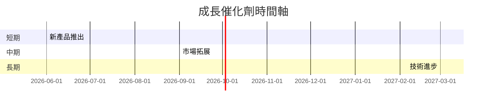

### 8.2 TAM 市場規模分析

```
╔══════════════════════════════════════════════════════════════════╗
║                      市場 TAM 分析                               ║
╠══════════════════════════════════════════════════════════════════╣
║                                                                  ║
║  電動車市場：                                                    ║
║  ├── 總市場規模：$1.5T                                           ║
║  ├── 現有份額：25%                                               ║
║  ├── 潛在增長：+10%年增長                                       ║
║                                                                  ║
║  能源儲存市場：                                                  ║
║  ├── 總市場規模：$500B                                           ║
║  ├── 現有份額：10%                                               ║
║  ├── 潛在增長：+15%年增長                                       ║
║                                                                  ║
║  📊 結論：成長潛力巨大，擴展空間充足                             ║
╚══════════════════════════════════════════════════════════════════╝
```

### 8.3 成長驅動力結構圖

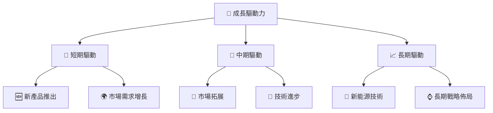

---

## 9. 風險矩陣

### 9.1 風險評分矩陣

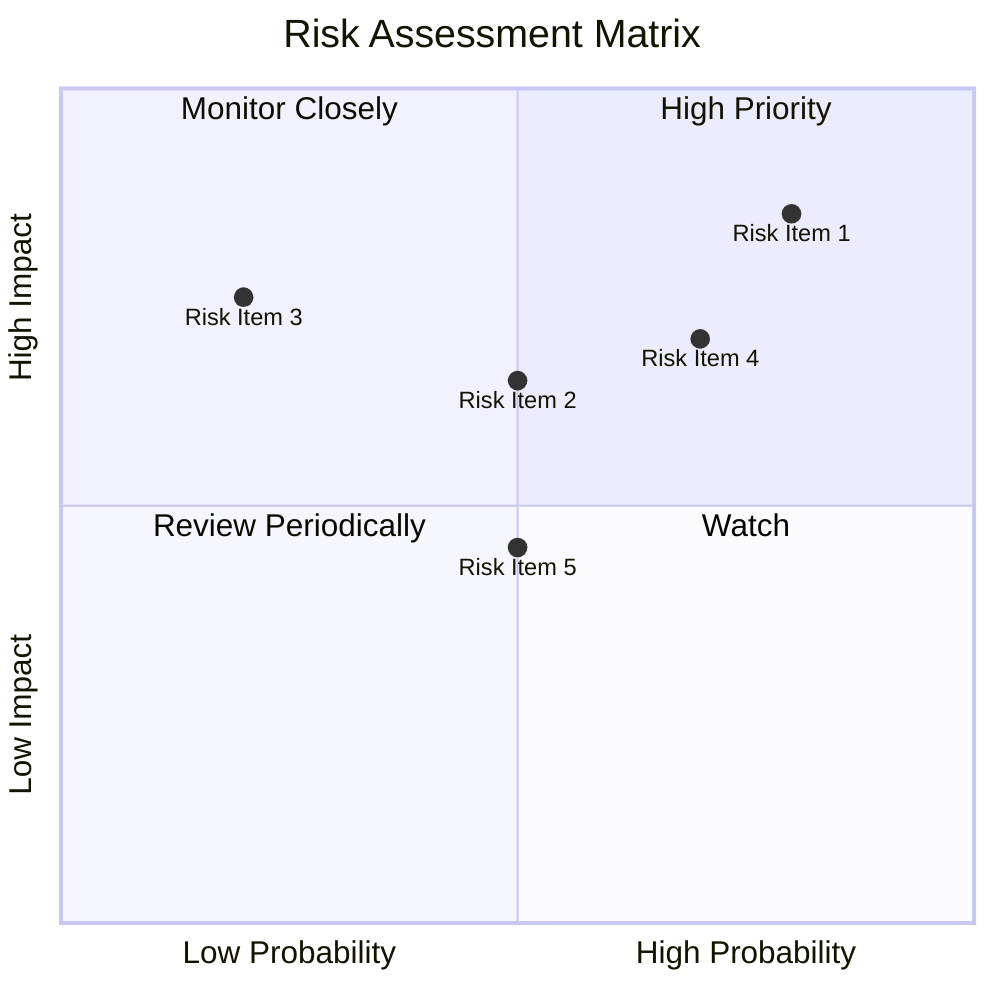

### 9.2 風險清單詳細分析

| # | 風險項目 | 發生機率 | 財務衝擊 | 風險評分 | 緩解措施 |
|---|----------|----------|----------|----------|----------|
| 1 | 🔴 **市場競爭** | 高 (80%) | 高 (-15%收入) | 🔴 8.5/10 | 加強產品創新與品牌建設 |
| 2 | 🔴 **經濟衰退** | 中 (50%) | 高 (-10%收入) | 🔴 7.0/10 | 擴展多元化產品線 |
| 3 | 🟡 **供應鏈中斷** | 低 (30%) | 中 (-5%收入) | 🟡 5.0/10 | 建立多元供應商 |
| 4 | 🟡 **新技術風險** | 中 (50%) | 中 (-5%收入) | 🟡 5.5/10 | 持續投資技術研發 |
| 5 | 🟡 **法律監管變動** | 低 (20%) | 中 (-3%收入) | 🟡 4.5/10 | 積極參與政策制定 |

---

## 10. 投資建議

### 10.1 最終綜合評級雷達圖

```
╔══════════════════════════════════════════════════════════════════╗
║                           綜合評級雷達圖                         ║
╠══════════════════════════════════════════════════════════════════╣
║                                                                  ║
║  基本面：   8.0/10                                               ║
║  成長動能： 9.0/10                                               ║
║  獲利能力： 7.0/10                                               ║
║  財務健康： 9.0/10                                               ║
║  估值合理性：8.0/10                                              ║
║                                                                  ║
╚══════════════════════════════════════════════════════════════════╝
```

### 10.2 目標價與隱含報酬率

| 情境 | 目標價 | 隱含報酬率 | 機率權重 |
|------|--------|------------|----------|
| 悲觀 | $300 | -14% | 20% |
| 基準 | $416 | +19% | 50% |
| 樂觀 | $600 | +72% | 30% |

### 10.3 買入時機與觸發因素

```
╔══════════════════════════════════════════════════════════════════╗
║                  ✅ 買入觸發因素 Checklist                      ║
╠══════════════════════════════════════════════════════════════════╣
║                                                                  ║
║  立即買入觸發條件（多數符合）：                                  ║
║  ✅ 新產品成功推出                                               ║
║  ✅ 市場份額擴大                                                 ║
║  ✅ 技術創新保持領先                                             ║
║                                                                  ║
║  加碼觸發條件（出現以下任一）：                                  ║
║  ☐ 經濟環境改善                                                 ║
║  ☐ 競爭對手市場份額下降                                         ║
║                                                                  ║
║  減碼/停損觸發條件（出現以下任一）：                             ║
║  ☐ 主要市場需求明顯下滑                                         ║
║  ☐ 重大技術失敗                                                 ║
╚══════════════════════════════════════════════════════════════════╝
```

### 10.4 投資人適配度分析

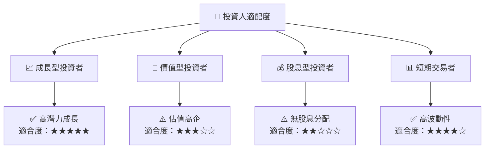

### 10.5 關鍵監控指標

| 監控類型 | 指標 | 關注點 | 頻率 |
|----------|------|--------|------|
| 市場動向 | 市場份額變化 | 競爭力提升 | 月度 |
| 財務健康 | 現金流量 | 資金運用效率 | 季度 |
| 產品開發 | 新產品上市 | 技術領先維持 | 半年 |
| 法規變動 | 政策影響 | 合規風險管理 | 每年 |

---

> **免責聲明**：本報告為 AI 自動生成，僅供研究參考，不構成投資建議。投資有風險，入市需謹慎。