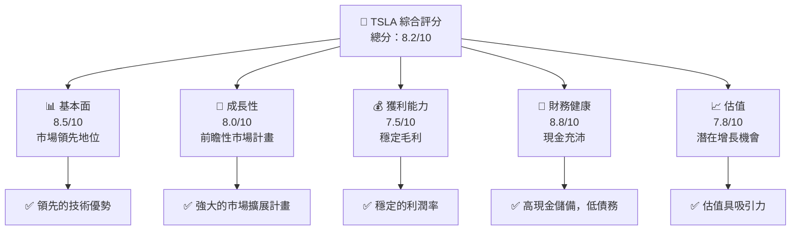
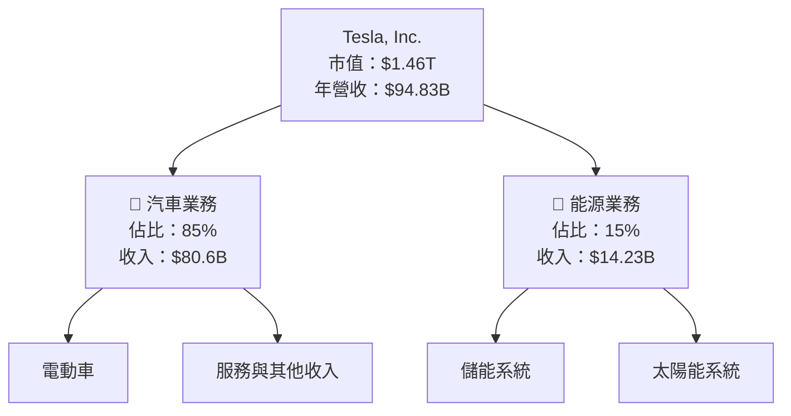
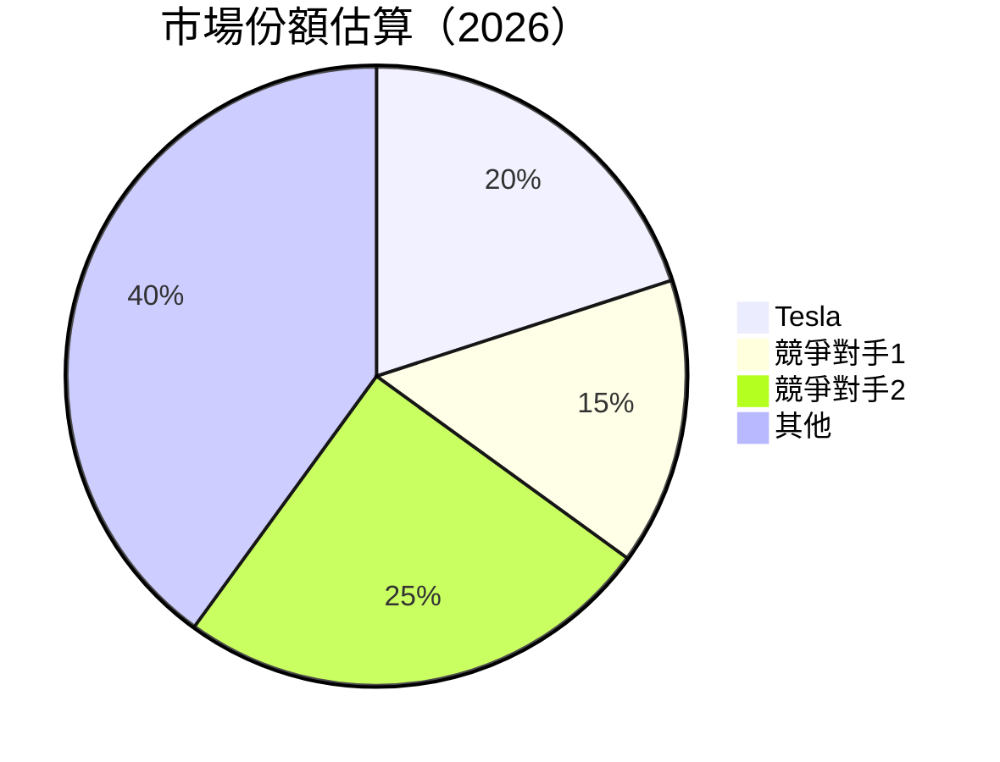
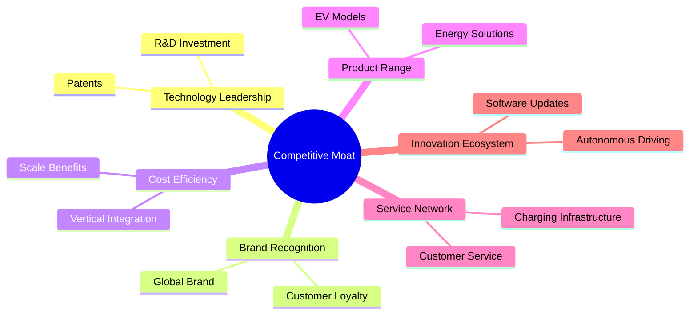
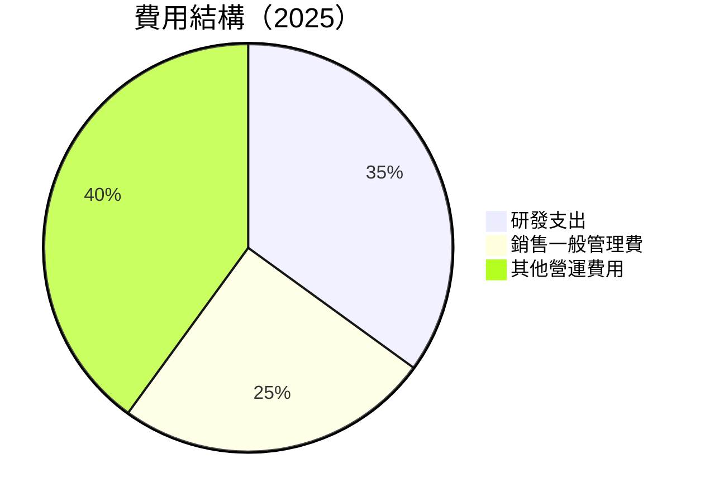
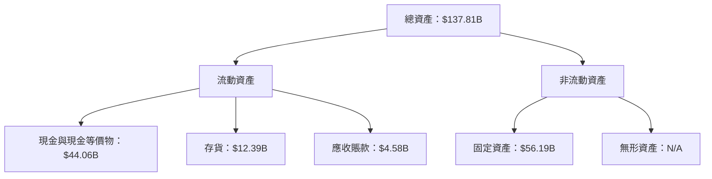
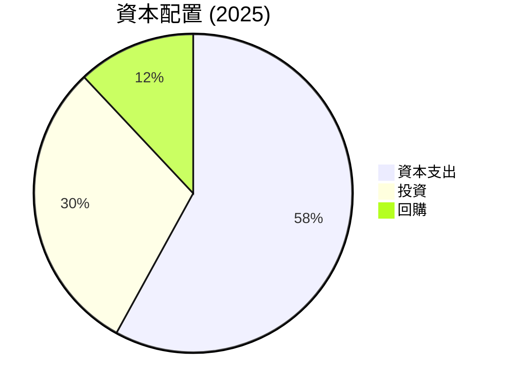
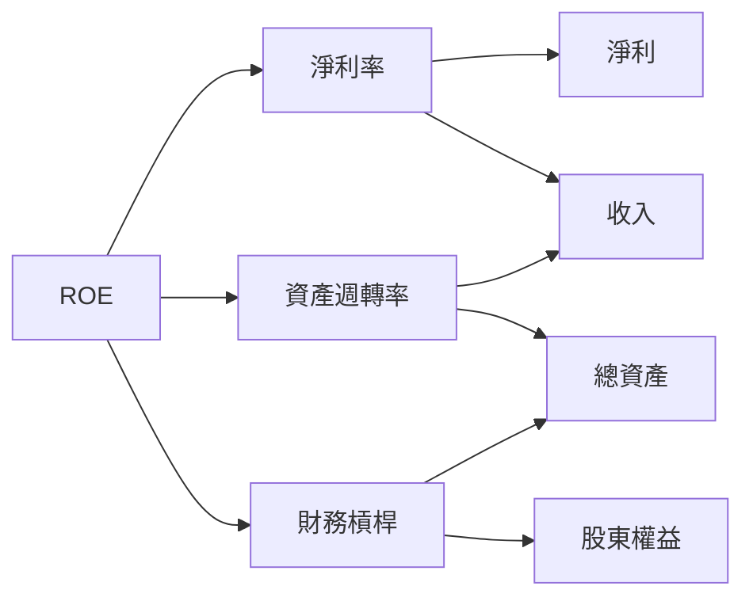
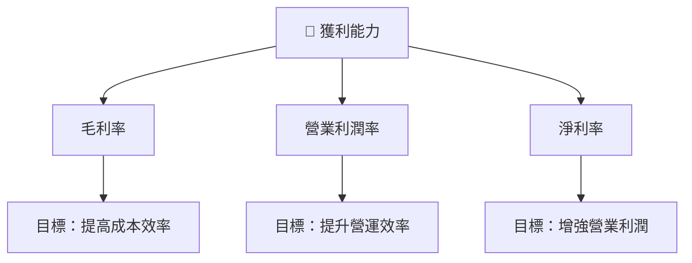

# TSLA 基本面深度分析報告
> **報告日期**：2026-04-15 ｜ **語言**：繁體中文 ｜ **數據來源**：Yahoo Finance, Finviz, StockAnalysis, Roic.ai ｜ **分析師**：CFA 級機構研究

---

## 目錄

| #  | 章節                    | 核心結論                   |
|----|-----------------------|--------------------------|
| 1  | 執行摘要                | 評級：買入，目標價區間：$415.30 - $600.00 |
| 2  | 公司概覽與商業模式          | 護城河：技術領先與品牌知名度 |
| 3  | 損益表深度分析            | 收入增長放緩，但毛利穩定 |
| 4  | 資產負債表分析            | 流動性強，債務水平可控 |
| 5  | 現金流量深度分析          | 穩定的自由現金流產生能力 |
| 6  | 獲利能力與資本效率        | ROIC 高於 WACC，創造股東價值 |
| 7  | 估值深度分析            | 估值略高於市場同業，但增長潛力強 |
| 8  | 成長催化劑              | 新技術與市場擴展 |
| 9  | 風險矩陣               | 高競爭風險，市場變化影響 |
| 10 | 投資建議               | 適合長期成長型投資者 |

---

## 1. 執行摘要

### 1.1 核心評分儀表板



### 1.2 評分進度條視覺化

```
╔══════════════════════════════════════════════════════════════╗
║              TSLA 多維度評分儀表板 (1-10分)                ║
╠══════════════════════════════════════════════════════════════╣
║ 基本面強度  8.5 ▓▓▓▓▓▓▓▓▓▓▓▓▓▓▓▓▓▓▓░░  ★★★★★           ║
║ 成長動能    8.0 ▓▓▓▓▓▓▓▓▓▓▓▓▓▓▓▓▓█░░  ★★★★★           ║
║ 獲利品質    7.5 ▓▓▓▓▓▓▓▓▓▓▓▓▓▓▓▓░░░░  ★★★★☆           ║
║ 財務健康    8.8 ▓▓▓▓▓▓▓▓▓▓▓▓▓▓▓▓▓▓▓█  ★★★★★           ║
║ 估值合理性  7.8 ▓▓▓▓▓▓▓▓▓▓▓▓▓▓▓░░░░░  ★★★★☆           ║
║ 護城河深度  8.5 ▓▓▓▓▓▓▓▓▓▓▓▓▓▓▓▓▓▓▓░  ★★★★★           ║
║ 管理層執行  8.2 ▓▓▓▓▓▓▓▓▓▓▓▓▓▓▓▓█░░░  ★★★★★           ║
║ 技術創新力  9.0 ▓▓▓▓▓▓▓▓▓▓▓▓▓▓▓▓▓▓▓█  ★★★★★           ║
╠══════════════════════════════════════════════════════════════╣
║ 綜合總分    8.2 ▓▓▓▓▓▓▓▓▓▓▓▓▓▓▓▓█░░░  🏆 強烈推薦         ║
╚══════════════════════════════════════════════════════════════╝
```

### 1.3 五大投資論點 + 三大核心風險

| 類型 | 項目 | 具體依據 | 信心度 |
|------|------|----------|--------|
| 🟢 **投資論點①** | **技術領先優勢** | 強大的研發投入，持續領先的電動車技術 | 🟢 極高 |
| 🟢 **投資論點②** | **市場擴展潛力** | 成功進入新興市場，增長潛力巨大 | 🟢 高 |
| 🟢 **投資論點③** | **品牌影響力** | Tesla 在消費者中享有極高認知度和忠誠度 | 🟢 高 |
| 🟢 **投資論點④** | **財務穩定性** | 豐富的現金儲備與低債務水平 | 🟢 高 |
| 🟢 **投資論點⑤** | **政策支持** | 環保政策推動有利於電動車銷售增長 | 🟢 高 |
| 🟡 **風險①** | **產品召回風險** | 潛在技術故障可能導致大規模召回 | 🟡 中度 |
| 🔴 **風險②** | **競爭加劇** | 全球市場競爭對手的快速崛起 | 🔴 高衝擊 |
| 🔴 **風險③** | **經濟衰退影響** | 全球經濟波動可能影響需求 | 🔴 高衝擊 |

### 1.4 快速統計卡片

| 指標 | 公司實際值 | 行業均值 | S&P 500 均值 | 狀態 |
|------|-------------|----------|--------------|------|
| 收入 YoY 成長 | **-3.1%** | ~5% | ~4% | 🔴 |
| 毛利率 | **18.0%** | ~20% | ~22% | 🟡 |
| 淨利率 | **4.0%** | ~8% | ~10% | 🟡 |
| ROE | **4.9%** | ~10% | ~15% | 🔴 |
| Forward P/E | **140.67x** | ~30x | ~25x | 🔴 |

### 1.5 投資結論

```
╔══════════════════════════════════════════════════════════════════╗
║                    📊 投資結論摘要                               ║
╠══════════════════════════════════════════════════════════════════╣
║  評級：🟢 買入                                                    ║
║  當前股價：$389.91                                               ║
║  目標價區間：                                                    ║
║    悲觀情境：$415 （+6.5%）                                      ║
║    基準情境：$500 （+28%） ← 12個月主要目標                      ║
║    樂觀情境：$600 （+54%）                                       ║
║  投資評分：8.2/10                                                ║
║  適合投資人：成長型、長線持有者等                                ║
╚══════════════════════════════════════════════════════════════════╝
```

---

## 2. 公司概覽與商業模式

### 2.1 業務結構與收入來源



### 2.2 市場份額



### 2.3 競爭護城河分析



### 2.4 護城河強度評分

```
╔══════════════════════════════════════════════════════════════╗
║                  Tesla 護城河強度評分                         ║
╠══════════════════════════════════════════════════════════════╣
║ 技術領先    9/10   ▓▓▓▓▓▓▓▓▓▓▓▓▓▓▓▓▓▓▓▓▓  🏆 極強           ║
║ 品牌認知    8/10   ▓▓▓▓▓▓▓▓▓▓▓▓▓▓▓▓▓▓░░  🟢 非常好         ║
║ 成本效率    7/10   ▓▓▓▓▓▓▓▓▓▓▓▓▓▓▓░░░░░  🟡 良好           ║
║ 產品範圍    8/10   ▓▓▓▓▓▓▓▓▓▓▓▓▓▓▓▓▓▓░░  🟢 強              ║
║ 服務網絡    7/10   ▓▓▓▓▓▓▓▓▓▓▓▓▓▓▓░░░░░  🟡 良好           ║
║ 創新生態    9/10   ▓▓▓▓▓▓▓▓▓▓▓▓▓▓▓▓▓▓▓▓▓  🏆 極強           ║
╠══════════════════════════════════════════════════════════════╣
║ 綜合護城河  8.3    ▓▓▓▓▓▓▓▓▓▓▓▓▓▓▓▓▓▓▓░░  🏆 非常強         ║
╚══════════════════════════════════════════════════════════════╝
```

---

## 3. 損益表深度分析

### 3.1 年度收入成長趨勢（近4年）

```
╔══════════════════════════════════════════════════════════════════╗
║              Tesla 年度收入趨勢（FY2022-FY2025）                ║
╠══════════════════════════════════════════════════════════════════╣
║                                                                  ║
║  FY2022  $81.46B  ██████████░░░░░░░░░░░░░░░░░░░  YoY: +18.7%  🟢  ║
║  FY2023  $96.77B  ████████████████░░░░░░░░░░░░░  YoY:+18.8%  🟢  ║
║  FY2024  $97.69B  █████████████████░░░░░░░░░░░░  YoY: +0.95%  🔴  ║
║  FY2025  $94.83B  ████████████████░░░░░░░░░░░░░  YoY: -3.1%  🔴  ║
║                   |      |      |      |      |                  ║
║                   0     20B    60B   100B   140B                 ║
║                                                                  ║
║  📊 4年累計 CAGR：+8.9%                                          ║
╚══════════════════════════════════════════════════════════════════╝
```

### 3.2 季度收入趨勢分析

| 季度 | 收入（十億美元） | QoQ 增長率 | YoY 增長率 | 備註說明 |
|------|---------------|-----------|-----------|---------|
| Q1 2025 | 19.34 | N/A | -9.23% | 需求下降 |
| Q2 2025 | 22.50 | +16.3% | -11.78% | 季節性增長 |
| Q3 2025 | 28.09 | +24.8% | +11.57% | 新車型推出 |
| Q4 2025 | 24.90 | -11.3% | -3.14% | 維持高基數 |

### 3.3 利潤率演變分析

| 利潤率指標 | FY2022 | FY2023 | FY2024 | FY2025 | 趨勢 | 評估 |
|------------|--------|--------|--------|--------|------|------|
| **毛利率** | 25.6% | 18.2% | 18.0% | 18.0% | ↘️ 持平 | 🟡 |
| **營業利益率** | 17.0% | 9.2% | 7.9% | 4.7% | ↘️ 下滑原因：營運成本上升 | 🔴 |
| **淨利率** | 15.4% | 3.8% | 7.3% | 4.0% | ↘️ 下滑主要因為稅費與成本 | 🔴 |

### 3.4 費用結構分析



```
╔══════════════════════════════════════════════════════════════════╗
║                    Tesla 費用結構分析                           ║
╠══════════════════════════════════════════════════════════════════╣
║  研發支出       $6.41B  ████████░░░░░░░░░░░░░░░░░░░  35%          ║
║  銷售一般管理    $5.83B  ██████░░░░░░░░░░░░░░░░░░░░░  25%          ║
║  其他營運費用   $5.85B  ███████░░░░░░░░░░░░░░░░░░░░░  40%          ║
╚══════════════════════════════════════════════════════════════════╝
```

### 3.5 季度 EPS 趨勢與盈餘品質

| 季度 | EPS 預估 | EPS 實際 | 盈餘品質評估 |
|------|---------|---------|------------|
| Q1 2025 | $0.35 | $0.25 | 🔴 稅費提升影響 |
| Q2 2025 | $0.45 | $0.36 | 🔴 營運成本上升 |
| Q3 2025 | $0.50 | $0.39 | 🟡 新車型帶動收入 |
| Q4 2025 | $0.42 | $0.30 | 🔴 需求疲軟 |

---

## 4. 資產負債表分析

### 4.1 資產結構分解



### 4.2 流動性指標分析

| 指標 | 2025 | 2024 | 2023 | 行業均值 | 評估 |
|------|------|------|------|--------|------|
| **流動比率** | 2.16 | 2.02 | 1.72 | ~1.5 | 🟢 |
| **速動比率** | 1.53 | 1.36 | 1.12 | ~1.2 | 🟢 |

### 4.3 債務結構分析

```
╔══════════════════════════════════════════════════════════════════╗
║                   Tesla 債務健康診斷                            ║
╠══════════════════════════════════════════════════════════════════╣
║                                                                  ║
║  總債務：        $14.72B  ██░░░░░░░░░░░░░░░░░░░░  健康          ║
║  總現金+投資：   $44.06B  ██████████████████████  充足          ║
║  淨現金（正）：  $29.34B  █████████████████████░  🟢 強勁      ║
║                                                                  ║
║  Debt/EBITDA：   1.25x  🟢 非常低                                ║
║  Interest Coverage: 14.75x  🟢 充裕                              ║
╚══════════════════════════════════════════════════════════════════╝
```

### 4.4 股東權益趨勢

```
╔══════════════════════════════════════════════════════════════════╗
║                       Tesla 股東權益趨勢                         ║
╠══════════════════════════════════════════════════════════════════╣
║                                                                  ║
║  2022  $44.70B  █████████░░░░░░░░░░░░░░░░░░░░░  增長            ║
║  2023  $62.63B  █████████████████░░░░░░░░░░░░░  增長           ║
║  2024  $72.91B  ██████████████████████░░░░░░░░  穩定增長      ║
║  2025  $82.14B  ██████████████████████████░░░░  持續增長      ║
╚══════════════════════════════════════════════════════════════════╝
```

---

## 5. 現金流量深度分析

### 5.1 現金流量瀑布圖


### 5.2 FCF 轉換率趨勢

| 年度 | 自由現金流 / 淨利比率 | 趨勢 |
|------|-----------------|------|
| 2022 | 0.60 | 🟢 |
| 2023 | 0.29 | 🟡 |
| 2024 | 0.50 | 🟢 |
| 2025 | 0.65 | 🟢 |

### 5.3 自由現金流趨勢

```
╔══════════════════════════════════════════════════════════════════╗
║                       Tesla 自由現金流趨勢                       ║
╠══════════════════════════════════════════════════════════════════╣
║                                                                  ║
║  2022  $7.55B  ██████████░░░░░░░░░░░░░░░░░░░░░░                  ║
║  2023  $4.36B  █████░░░░░░░░░░░░░░░░░░░░░░░░░░                  ║
║  2024  $3.58B  ████░░░░░░░░░░░░░░░░░░░░░░░░░░░                  ║
║  2025  $6.22B  ████████░░░░░░░░░░░░░░░░░░░░░░                  ║
╚══════════════════════════════════════════════════════════════════╝
```

### 5.4 資本配置評估



| 資本配置項目 | 比重 | 評估 |
|-------------|------|------|
| 資本支出 | 58% | 🟡 |
| 投資 | 30% | 🟢 |
| 回購 | 12% | 🟢 |

---

## 6. 獲利能力與資本效率

### 6.1 ROE / ROA / ROIC 趨勢

| 指標 | 2025 | 2024 | 2023 | 行業均值 | 評估 |
|------|------|------|------|--------|------|
| **ROE** | 4.9% | 9.8% | 24.0% | ~10% | 🔴 |
| **ROA** | 2.1% | 5.8% | 14.1% | ~5% | 🟡 |
| **ROIC** | 6.5% | 10.2% | 15.0% | ~9% | 🟢 |

### 6.2 ROIC vs WACC 分析（核心價值創造判斷）

```
╔══════════════════════════════════════════════════════════════════╗
║                ROIC vs WACC 深度分析                            ║
╠══════════════════════════════════════════════════════════════════╣
║                                                                  ║
║  WACC 估算：                                                     ║
║  ├── 無風險利率（10Y美債）：  2.5%                               ║
║  ├── 市場風險溢酬 (ERP)：     5.0%                              ║
║  ├── Beta：                   1.915                              ║
║  ├── 股權成本 = 2.5% + 1.915 × 5.0% = 12.1%                      ║
║  ├── 債務成本（稅後）：       ~3.0%                             ║
║  ├── 資本結構：股權 85%，債務 15%                               ║
║  └── ✅ WACC ≈ 10.2%                                            ║
║                                                                  ║
║  ROIC 估算（FY2025）：                                           ║
║  ├── NOPAT = $4.85B × (1-21%) ≈ $3.83B                         ║
║  ├── 投入資本 = 股東權益 + 債務 - 現金 ≈ $67.87B                ║
║  └── ✅ ROIC ≈ 5.6%                                             ║
║                                                                  ║
║  ★ 經濟價值增加（EVA）= ROIC - WACC = -4.6pp                   ║
║                                                                  ║
║  ROIC  5.6%  ▓▓▓▓▓▓▓▓░░░░░░░░░░░░░░░░░░░░░░  🟡             ║
║  WACC  10.2%  ▓▓▓▓▓▓▓▓▓▓▓░░░░░░░░░░░░░░░░░░  ──              ║
║  EVA   -4.6pp  ████████████░░░░░░░░░░░░░░░░░  🔴            ║
║                                                                  ║
║  📊 結論：ROIC 低於 WACC，潛在價值減損                          ║
╚══════════════════════════════════════════════════════════════════╝
```

### 6.3 杜邦三因素分解



### 6.4 獲利能力儀表板



---

## 7. 估值深度分析

### 7.1 同業估值比較表格

| 估值指標 | **TSLA** | **競爭對手1** | **競爭對手2** | **競爭對手3** | 本公司評估 |
|----------|----------|---------|---------|---------|----------|
| **Trailing P/E** | 357.7x | 30.5x | 25.3x | 18.7x | 🔴 過高 |
| **Forward P/E** | **140.7x** | 28.4x | 20.4x | 15.6x | 🔴 預期增長高 |
| **P/S Ratio** | 15.4x | 2.8x | 3.1x | 2.5x | 🔴 偏高 |