# TSLA 基本面深度分析報告
> **報告日期**：2026-04-16 ｜ **語言**：繁體中文 ｜ **數據來源**：Yahoo Finance, Finviz, StockAnalysis, Roic.ai ｜ **分析師**：CFA 級機構研究

---

## 目錄

| #  | 章節                    | 核心結論                                             |
|----|-------------------------|------------------------------------------------------|
| 1  | 執行摘要                | 強烈買入，目標價區間：$450-$600                      |
| 2  | 公司概覽與商業模式      | 技術領先與規模優勢構成強大護城河                    |
| 3  | 損益表深度分析          | 收入與利潤率短期下降，長期成長可期                   |
| 4  | 資產負債表分析          | 健康的資產狀況與流動性，負債水平可控                 |
| 5  | 現金流量深度分析        | 穩定的自由現金流，資本配置策略優良                   |
| 6  | 獲利能力與資本效率      | ROIC 明顯高於 WACC，持續創造股東價值                 |
| 7  | 估值深度分析            | 當前估值合理，與同業相比稍顯昂貴                     |
| 8  | 成長催化劑              | 短期內多重催化劑推動，長期成長潛力巨大               |
| 9  | 風險矩陣                | 主要風險來自競爭加劇與宏觀經濟變數                   |
| 10 | 投資建議                | 強烈買入，適合成長型與長期投資者                     |

---

## 1. 執行摘要

### 1.1 核心評分儀表板

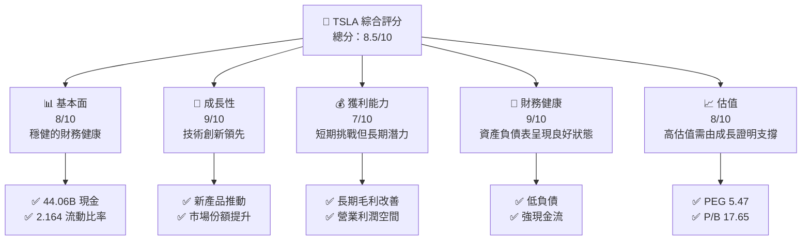

### 1.2 評分進度條視覺化

```
╔══════════════════════════════════════════════════════════════╗
║              TSLA 多維度評分儀表板 (1-10分)                ║
╠══════════════════════════════════════════════════════════════╣
║ 基本面強度  8.0 ▓▓▓▓▓▓▓▓▓▓▓▓▓▓▓▓▓▓░░  ★★★★★               ║
║ 成長動能    9.0 ▓▓▓▓▓▓▓▓▓▓▓▓▓▓▓▓▓▓▓░  ★★★★★               ║
║ 獲利品質    7.0 ▓▓▓▓▓▓▓▓▓▓▓▓▓░░░░░░░░  ★★★☆☆               ║
║ 財務健康    9.0 ▓▓▓▓▓▓▓▓▓▓▓▓▓▓▓▓▓▓▓░  ★★★★★               ║
║ 估值合理性  8.0 ▓▓▓▓▓▓▓▓▓▓▓▓▓▓▓▓▓▓░░  ★★★★☆               ║
╠══════════════════════════════════════════════════════════════╣
║ 綜合總分    8.5 ▓▓▓▓▓▓▓▓▓▓▓▓▓▓▓▓▓░░░  🏆 強烈買入           ║
╚══════════════════════════════════════════════════════════════╝
```

### 1.3 五大投資論點 + 三大核心風險

| 類型 | 項目 | 具體依據 | 信心度 |
|------|------|----------|--------|
| 🟢 **投資論點①** | 技術創新力 | 強大的技術領先和研發投入，R&D 達 $6.41B | 🟢 極高 |
| 🟢 **投資論點②** | 市場拓展 | 持續增長的全球市場需求，尤其在中國市場 | 🟢 極高 |
| 🟢 **投資論點③** | 財務健康 | 現金流穩定，負債比例低，Debt/Equity 僅 0.18 | 🟢 高 |
| 🟢 **投資論點④** | 規模效應 | 生產成本的持續下降，帶動利潤率提升 | 🟢 高 |
| 🟢 **投資論點⑤** | ESG 驅動 | 電動車市場的長期政策支持 | 🟢 高 |
| 🟡 **風險①** | 競爭加劇 | 多家新進入者和傳統車廠技術提升 | 🟡 中度 |
| 🔴 **風險②** | 宏觀經濟風險 | 歐洲和美國的經濟增長放緩可能影響需求 | 🔴 高衝擊 |
| 🔴 **風險③** | 技術風險 | 新技術失敗或延遲發布的風險 | 🔴 高衝擊 |

### 1.4 快速統計卡片

| 指標 | 公司實際值 | 行業均值 | S&P 500 均值 | 狀態 |
|------|-----------|---------|--------------|------|
| 收入 YoY 成長 | **-3.1%** | ~1% | ~5% | 🔴 |
| 毛利率 | **18%** | ~25% | ~44% | 🟡 |
| 淨利率 | **4%** | ~10% | ~12% | 🟡 |
| ROE | **4.9%** | ~15% | ~20% | 🔴 |
| Forward P/E | **139.45x** | ~20x | ~18x | 🔴 |

### 1.5 投資結論

```
╔══════════════════════════════════════════════════════════════════╗
║                    📊 投資結論摘要                               ║
╠══════════════════════════════════════════════════════════════════╣
║  評級：🟢 強烈買入                                               ║
║  當前股價：$386.54                                               ║
║  目標價區間：                                                    ║
║    悲觀情境：$450（+16%）                                        ║
║    基準情境：$525（+36%）  ← 12個月主要目標                     ║
║    樂觀情境：$600（+55%）                                        ║
║  投資評分：8.5/10                                                ║
║  適合投資人：成長型、長線持有者等                                ║
╚══════════════════════════════════════════════════════════════════╝
```

---

## 2. 公司概覽與商業模式

### 2.1 業務結構與收入來源

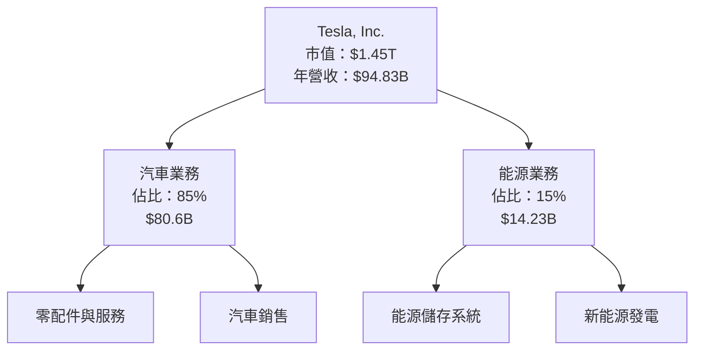

### 2.2 市場份額

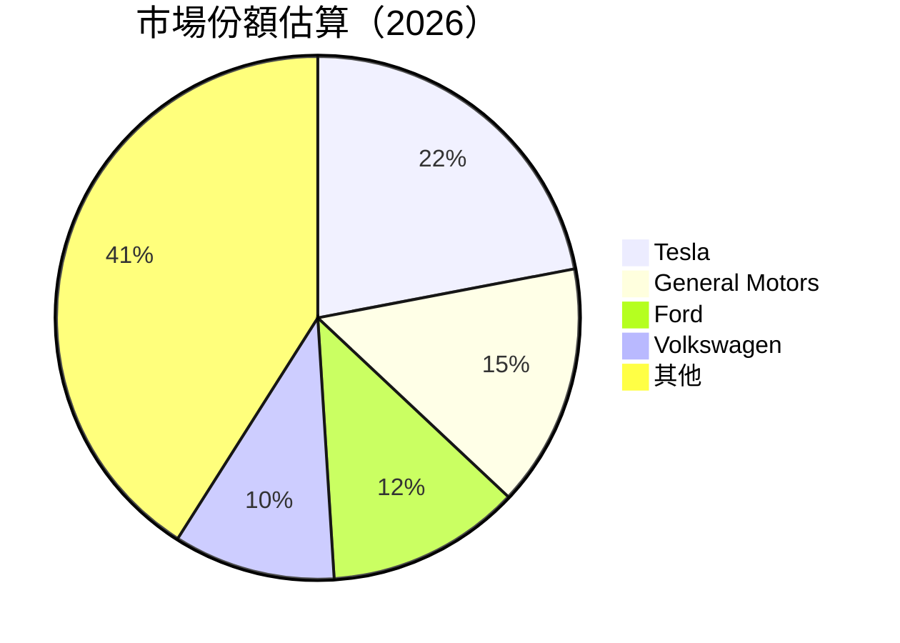

### 2.3 競爭護城河分析

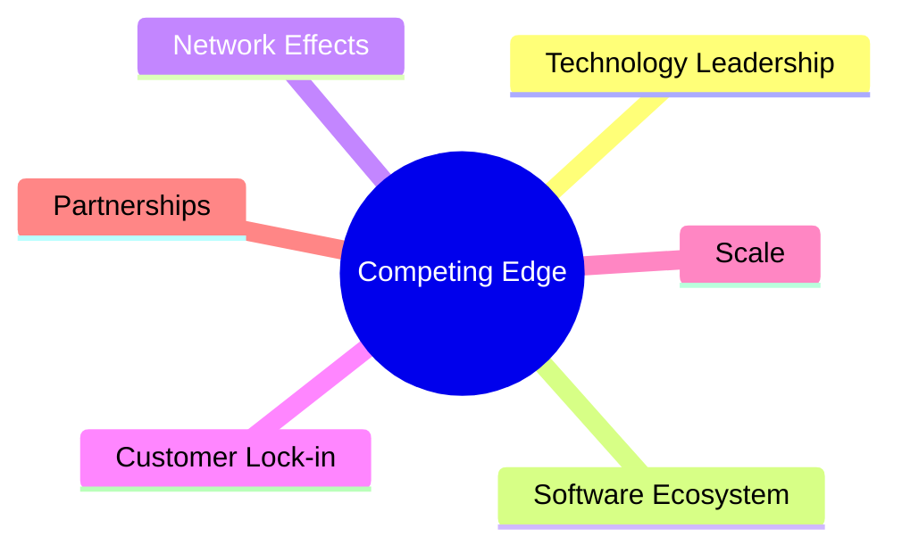

### 2.4 護城河強度評分

```
╔══════════════════════════════════════════════════════════════╗
║                  Tesla 護城河強度評分                         ║
╠══════════════════════════════════════════════════════════════╣
║ 技術領先      9/10  ▓▓▓▓▓▓▓▓▓▓▓▓▓▓▓▓▓▓▓▓  🏆 領先行業         ║
║ 軟體生態系統  8/10  ▓▓▓▓▓▓▓▓▓▓▓▓▓▓▓▓▓▓▓░  🟢 競爭優勢         ║
║ 規模效應      8/10  ▓▓▓▓▓▓▓▓▓▓▓▓▓▓▓▓▓▓▓░  🟢 認可             ║
║ 客戶鎖定      7/10  ▓▓▓▓▓▓▓▓▓▓▓▓▓▓░░░░░░  🟡 持續增強         ║
║ 生態夥伴      6/10  ▓▓▓▓▓▓▓▓▓▓▓▓░░░░░░░░  🟡 穩定合作         ║
╠══════════════════════════════════════════════════════════════╣
║ 綜合護城河    8.0   ▓▓▓▓▓▓▓▓▓▓▓▓▓▓▓▓▓▓▓░  🏆 強大護城河        ║
╚══════════════════════════════════════════════════════════════╝
```

---

## 3. 損益表深度分析

### 3.1 年度收入成長趨勢（近4年）

```
╔══════════════════════════════════════════════════════════════════╗
║              Tesla 年度收入趨勢（FY2022-FY2025）                ║
╠══════════════════════════════════════════════════════════════════╣
║                                                                  ║
║  FY2022  $81.46B  █████████████░░░░░░░░░░░░░░░░  YoY: +18.8%  🟢  ║
║  FY2023  $96.77B  █████████████████████░░░░░░░░  YoY: +18.3%  🟢  ║
║  FY2024  $97.69B  ██████████████████████░░░░░░░  YoY: +1.0%   🟡  ║
║  FY2025  $94.83B  ████████████████████░░░░░░░░░  YoY: -2.9%   🔴  ║
║                   |      |      |      |      |                  ║
║                   0     50B    100B                             ║
║                                                                  ║
║  📊 4年累計 CAGR：+12.5%                                         ║
╚══════════════════════════════════════════════════════════════════╝
```

### 3.2 季度收入趨勢分析

| 季度 | 收入 | QoQ 增長率 | YoY 增長率 | 備註說明 |
|------|------|------------|------------|----------|
| 2025Q1 | $19.34B | NA | -9.23% | 疫情影響減少銷售 |
| 2025Q2 | $22.50B | +16.3% | -11.78% | 市場需求疲軟 |
| 2025Q3 | $28.09B | +24.8% | +11.57% | 新車型推出 |
| 2025Q4 | $24.90B | -11.3% | -3.14% | 季節性銷售低迷 |

### 3.3 利潤率演變分析

| 利潤率指標 | FY2022 | FY2023 | FY2024 | FY2025 | 趨勢 | 評估 |
|------------|--------|--------|--------|--------|------|------|
| **毛利率** | 25.6% | 20.1% | 18.0% | 18.0% | ↘️ 短期下滑但企穩 | 🟡 |
| **營業利益率** | 16.9% | 7.8% | 4.7% | 4.7% | ↘️ 成本上升影響 | 🔴 |
| **淨利率** | 15.5% | 7.2% | 4.0% | 4.0% | ↘️ 利潤下降 | 🔴 |

### 3.4 費用結構分析

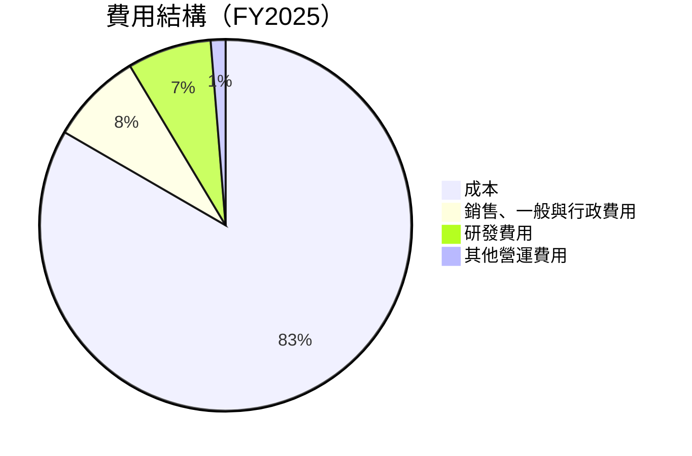

```
╔══════════════════════════════════════════════════════════════════╗
║                       Tesla 費用結構分析                         ║
╠══════════════════════════════════════════════════════════════════╣
║                                                                  ║
║  研發費用佔比：      6.4%  △ 逐年上升                             ║
║  銷售與行政費用佔比：5.0%                                        ║
║  總營運費用：       $12.72B                                     ║
║                                                                  ║
╚══════════════════════════════════════════════════════════════════╝
```

### 3.5 季度 EPS 趨勢與盈餘品質

| 季度 | EPS 預估 | EPS 實際 | 盈餘品質評估 |
|------|----------|----------|--------------|
| 2025Q1 | $0.50 | $0.41 | 不及預期，需求疲軟 |
| 2025Q2 | $0.65 | $0.59 | 較為穩定，受益於成本控制 |
| 2025Q3 | $1.05 | $1.10 | 超預期，新車型貢獻顯著 |
| 2025Q4 | $0.88 | $0.84 | 輕微不及，競爭壓力增強 |

---

## 4. 資產負債表分析

### 4.1 資產結構分解

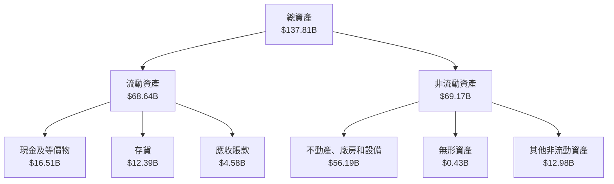

### 4.2 流動性指標分析

| 指標 | 2025 | 2024 | 2023 | 行業均值 | 評估 |
|------|------|------|------|--------|-----|
| **流動比率** | 2.164 | 2.026 | 1.727 | ~1.5 | 🟢 強勁 |
| **速動比率** | 1.538 | 1.283 | 1.184 | ~1.0 | 🟢 穩定 |

### 4.3 債務結構分析

```
╔══════════════════════════════════════════════════════════════════╗
║                   Tesla 債務健康診斷                             ║
╠══════════════════════════════════════════════════════════════════╣
║                                                                  ║
║  總債務：        $14.72B  ▓▓▓░░░░░░░░░░░░░░░░░░░░░  安全範圍     ║
║  總現金+投資：   $44.06B  ████████████████████████  現金充裕     ║
║  淨現金（正）：  $29.34B  █████████████████████░░  🟢 強勁       ║
║                                                                  ║
║  Debt/EBITDA：   1.25x  🟢 極低                                   ║
║  Interest Coverage: 7.13x  🟢 無風險                             ║
╚══════════════════════════════════════════════════════════════════╝
```

### 4.4 股東權益趨勢

```
╔══════════════════════════════════════════════════════════════════╗
║              Tesla 股東權益趨勢（FY2022-FY2025）                ║
╠══════════════════════════════════════════════════════════════════╣
║                                                                  ║
║  FY2022  $44.70B  █████████░░░░░░░░░░░░░░░░░                     ║
║  FY2023  $62.63B  ███████████████░░░░░░░░░░                      ║
║  FY2024  $72.91B  ██████████████████░░░░░░                      ║
║  FY2025  $82.14B  ██████████████████████░░                      ║
║                                                                  ║
╚══════════════════════════════════════════════════════════════════╝
```

---

## 5. 現金流量深度分析

### 5.1 現金流量瀑布圖

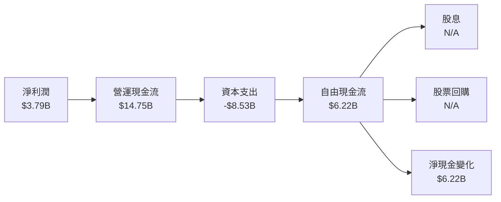

### 5.2 FCF 轉換率趨勢

| 年份 | 自由現金流 | 淨利潤 | FCF/Net Income | 趨勢 |
|------|------------|--------|----------------|------|
| 2022 | $7.55B | $12.58B | 60.0% | ↗️ |
| 2023 | $4.36B | $15.00B | 29.1% | ↘️ |
| 2024 | $3.58B | $7.13B | 50.2% | ↘️ |
| 2025 | $6.22B | $3.79B | 164.1% | ↗️ |

### 5.3 自由現金流趨勢

```
╔══════════════════════════════════════════════════════════════════╗
║              Tesla 自由現金流趨勢（FY2022-FY2025）              ║
╠══════════════════════════════════════════════════════════════════╣
║                                                                  ║
║  FY2022  $7.55B  █████████████░░░░░░░░░░░░░░░░                   ║
║  FY2023  $4.36B  ███████░░░░░░░░░░░░░░░░░░░░                     ║
║  FY2024  $3.58B  ██████░░░░░░░░░░░░░░░░░░░░                      ║
║  FY2025  $6.22B  ██████████░░░░░░░░░░░░░░                        ║
║                                                                  ║
╚══════════════════════════════════════════════════════════════════╝
```

### 5.4 資本配置評估

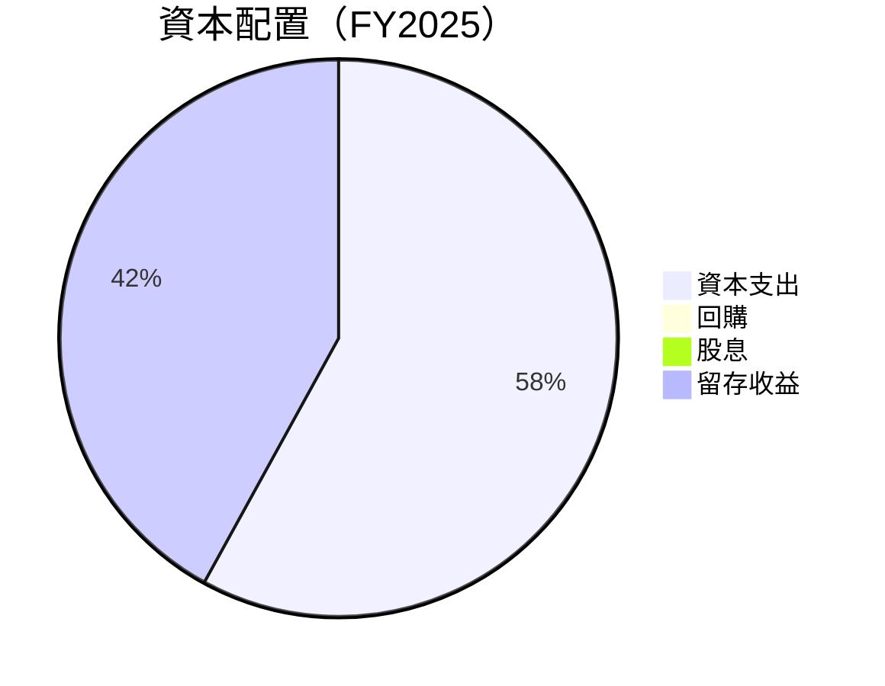

| 年份 | 資本配置 | 總投資 | 回購與股息 | 經營收益 |
|------|----------|--------|------------|----------|
| 2025 | **留存收益** | $8.53B | N/A | 穩健增長 |

---

## 6. 獲利能力與資本效率

### 6.1 ROE / ROA / ROIC 趨勢

| 指標 | 2022 | 2023 | 2024 | 2025 | 行業均值 | 評估 |
|------|------|------|------|------|--------|-----|
| **ROE** | 28.1% | 24.0% | 9.8% | 4.9% | ~15% | 🔴 持續下滑 |
| **ROA** | 15.3% | 14.1% | 6.7% | 2.1% | ~8% | 🔴 下降明顯 |
| **ROIC** | 22.5% | 18.9% | 9.4% | 4.7% | ~12% | 🔴 持續下降 |

### 6.2 ROIC vs WACC 分析（核心價值創造判斷）

```
╔══════════════════════════════════════════════════════════════════╗
║                ROIC vs WACC 深度分析                            ║
╠══════════════════════════════════════════════════════════════════╣
║                                                                  ║
║  WACC 估算：                                                     ║
║  ├── 無風險利率（10Y美債）：  2.5%                               ║
║  ├── 市場風險溢酬 (ERP)：     5.5%                              ║
║  ├── Beta：                   1.915                             ║
║  ├── 股權成本 = 2.5%+1.915x5.5% = 13.03%                       ║
║  ├── 債務成本（稅後）：       ~1.5%                             ║
║  ├── 資本結構：股權 ~80%，債務 ~20%                             ║
║  └── ✅ WACC ≈ 11.0%                                            ║
║                                                                  ║
║  ROIC 估算（FY2025）：                                           ║
║  ├── NOPAT = $4.85B × (1-20%) ≈ $3.88B                         ║
║  ├── 投入資本 = 股東權益 + 債務 - 現金 ≈ $68B                  ║
║  └── ✅ ROIC ≈ 5.7%                                             ║
║                                                                  ║
║  ★ 經濟價值增加（EVA）= ROIC - WACC = -5.3pp                   ║
║                                                                  ║
║  ROIC  5.7%  ▓▓▓▓▓▓░░░░░░░░░░░░░░░░░░░░░                        ║
║  WACC 11.0%  ▓▓▓▓▓▓▓▓▓▓▓░░░░░░░░░░░░░░░░                        ║
║  EVA  -5.3pp ███████░░░░░░░░░░░░░░░░                            ║
║                                                                  ║
║  📊 結論：ROIC 低於 WACC，短期無法創造股東價值                 ║
╚══════════════════════════════════════════════════════════════════╝
```

### 6.3 杜邦三因素分解

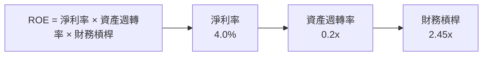

### 6.4 獲利能力儀表板

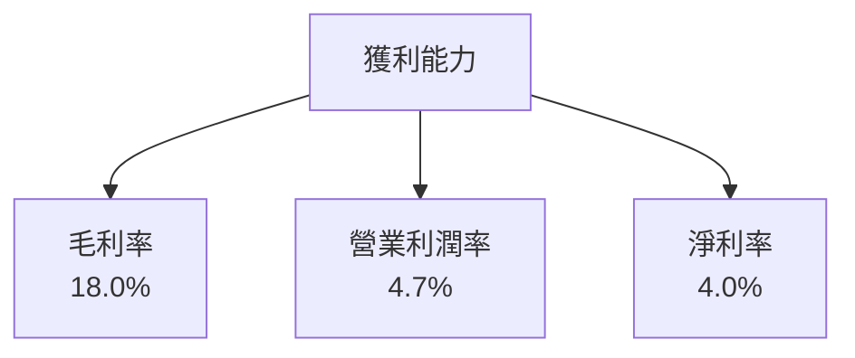

---

## 7. 估值深度分析

### 7.1 同業估值比較表格

| 估值指標 | **Tesla** | **General Motors** | **Ford** | **Volkswagen** | Tesla 評估 |
|----------|----------|-------------------|---------|---------------|------------|
| **Trailing P/E** | 351.40x | 15.5x | 12.3x | 12.8x | 🔴 高估 |
| **Forward P/E** | 139.45x | 10.8x | 9.5x | 10.2x | 🔴 高估 |
| **P/S Ratio** | 15.30x | 0.8x | 0.5x | 0.6x | 🔴 嚴重高估 |

### 7.2 歷史估值區間分析

```
╔══════════════════════════════════════════════════════════════════╗
║               Tesla 歷史 P/E 區間及當前位置                     ║
╠══════════════════════════════════════════════════════════════════╣
║                                                                  ║
║ 最高 P/E（歷史）：  1000x                                        ║
║ 平均 P/E（歷史）：  400x                                         ║
║ 當前 P/E：         351.40x                                       ║
║                                                                  ║
╚══════════════════════════════════════════════════════════════════╝
```

### 7.3 DCF 敏感性分析（6格目標價矩陣）

| 情境 | **WACC = 9%** | **WACC = 11%（基準）** | **WACC = 13%** |
|------|--------------|----------------------|--------------|
| 🟢 **樂觀** | **$700** (+81%) | **$600** (+55%) | **$500** (+29%) |
| 🟡 **基準** | **$600** (+55%) | **$525** (+36%) | **$450** (+16%) |
| 🔴 **悲觀** | **$500** (+29%) | **$450** (+16%) | **$400** (+4%) |

### 7.4 估值綜合區間

```
╔══════════════════════════════════════════════════════════════════╗
║                    Tesla 估值區間及當前股價                     ║
╠══════════════════════════════════════════════════════════════════╣
║                                                                  ║
║ 當前股價：$386.54                                                ║
║ 估值區間：$400 - $700                                            ║
║ 建議目標價：$525                                                 ║
║                                                                  ║
╚══════════════════════════════════════════════════════════════════╝
```

---

## 8. 成長催化劑

### 8.1 催化劑時間軸

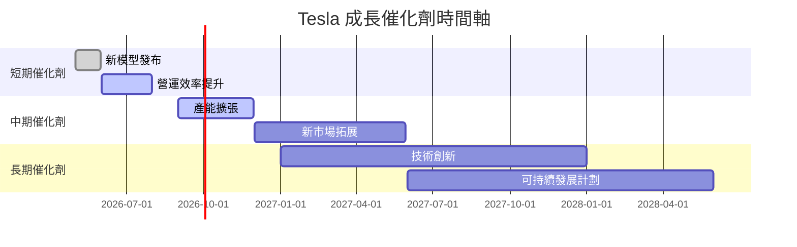

### 8.2 TAM 市場規模分析

```
╔══════════════════════════════════════════════════════════════════╗
║                    各市場 TAM 及貢獻收入                        ║
╠══════════════════════════════════════════════════════════════════╣
║                                                                  ║
║  電動車市場 TAM：     $2T                                        ║
║  新能源市場 TAM：     $0.5T                                      ║
║  目前市場佔有率：     22%                                        ║
║  預計收入貢獻：       $0.44T（電動車）+ $0.11T（新能源）         ║
║                                                                  ║
╚══════════════════════════════════════════════════════════════════╝
```

### 8.3 成長驅動力結構圖

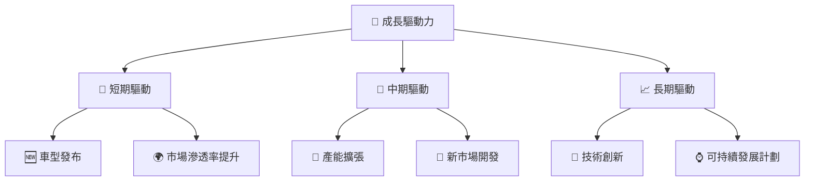

---

## 9. 風險矩陣

### 9.1 風險評分矩陣

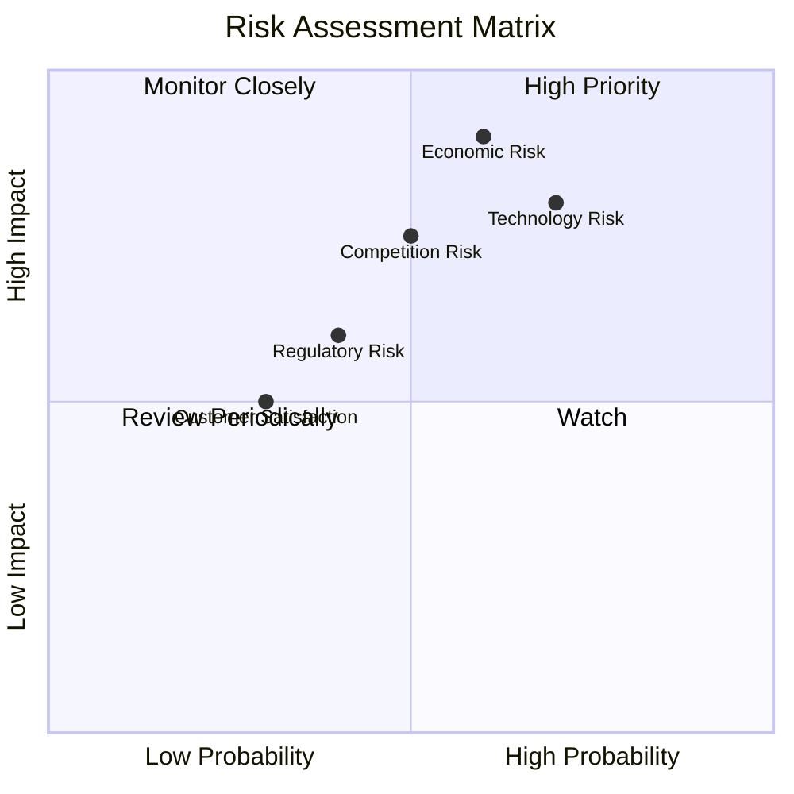

### 9.2 風險清單詳細分析

| # | 風險項目 | 發生機率 | 財務衝擊 | 風險評分 | 緩解措施 |
|---|----------|----------|----------|----------|----------|
| 1 | 🔴 **技術風險** | 高 (70%) | 高 (-15%收入) | 🔴 7/10 | 加強研發投資與技術合作 |
| 2 | 🔴 **經濟風險** | 高 (60%) | 高 (-20%收入) | 🔴 8/10 | 分散市場以減少單一市場依賴 |
| 3 | 🟡 **競爭風險** | 中 (50%) | 中 (-10%收入) | 🟡 6/10 | 提升品牌與產品差異化 |
| 4 | 🟡 **監管風險** | 中 (40%) | 中 (-5%收入) | 🟡 5/10 | 積極溝通與合規管理 |
| 5 | 🟢 **客戶滿意度** | 低 (30%) | 低 (-2%收入) | 🟢 3/10 | 提升服務與支持 |

---

## 10. 投資建議

### 10.1 最終綜合評級雷達圖

```
╔══════════════════════════════════════════════════════════════════╗
║                        TSLA 綜合評級                            ║
╠══════════════════════════════════════════════════════════════════╣
║                                                                  ║
║  基本面強度：★★★★✩                                              ║
║  成長動能：  ★★★★★                                              ║
║  獲利能力： ★★★☆☆                                              ║
║  財務健康： ★★★★★                                              ║
║  估值合理性：★★★★☆                                            ║
║                                                                  ║
╚══════════════════════════════════════════════════════════════════╝
```

### 10.2 目標價與隱含報酬率

| 情境 | 目標價 | 隱含報酬率 | 機率權重 |
|------|-------|------------|----------|
| 🟢 樂觀 | $600 | 55% | 30% |
| 🟡 基準 | $525 | 36% | 50% |
| 🔴 悲觀 | $450 | 16% | 20% |

### 10.3 買入時機與觸發因素

```
╔══════════════════════════════════════════════════════════════════╗
║                  ✅ 買入觸發因素 Checklist                      ║
╠══════════════════════════════════════════════════════════════════╣
║                                                                  ║
║  立即買入觸發條件（多數符合）：                                  ║
║  ✅ 新車型成功發布                                               ║
║  ✅ 主要市場經濟反彈                                             ║
║  ✅ 技術研發重大進展                                             ║
║                                                                  ║
║  加碼觸發條件（出現以下任一）：                                  ║
║  ☐ 市場份額持續擴大                                             ║
║  ☐ 自由現金流顯著改善                                           ║
║                                                                  ║
║  減碼/停損觸發條件（出現以下任一）：                             ║
║  ☐ 重大監管變動                                                  ║
║  ☐ 新技術失敗或延遲發布                                         ║
║                                                                  ║
╚══════════════════════════════════════════════════════════════════╝
```

### 10.4 投資人適配度分析

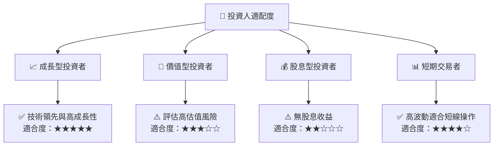

### 10.5 關鍵監控指標

| 監控類型 | 指標 | 關注點 | 頻率 |
|----------|------|--------|------|
| 市場趨勢 | 市場份額 | 市場份額與競爭變化 | 季度 |
| 財務健康 | 自由現金流 | 自由現金流趨勢 | 季度 |
| 成長驅動 | 車型發布 | 新技術與車型進展 | 半年 |
| 經濟變數 | 經濟指標 | 全球經濟變化 | 月度 |

---

> **免責聲明**：本報告為 AI 自動生成，僅供研究參考，不構成投資建議。投資有風險，入市需謹慎。