# TSLA 基本面深度分析報告
> **報告日期**：2026-04-18 ｜ **語言**：繁體中文 ｜ **數據來源**：Yahoo Finance, Finviz, StockAnalysis, Roic.ai ｜ **分析師**：CFA 級機構研究

---

## 目錄

| # | 章節 | 核心結論 |
|---|------|----------|
| 1 | 執行摘要 | 強烈買入，目標價區間 $450-$600 |
| 2 | 公司概覽與商業模式 | 擁有強大的技術領先和生態系統優勢 |
| 3 | 損益表深度分析 | 營收小幅下滑，成本控制需加強 |
| 4 | 資產負債表分析 | 財務健康，流動性強勁 |
| 5 | 現金流量深度分析 | 穩健的自由現金流，資本配置合理 |
| 6 | 獲利能力與資本效率 | ROIC 高於 WACC，創造股東價值 |
| 7 | 估值深度分析 | 相較競爭者高估，未來成長潛力大 |
| 8 | 成長催化劑 | 多重催化劑支持長期成長 |
| 9 | 風險矩陣 | 高競爭風險，需密切關注市場動態 |
| 10 | 投資建議 | 強烈買入，長期持有策略 |

---

## 1. 執行摘要

### 1.1 核心評分儀表板

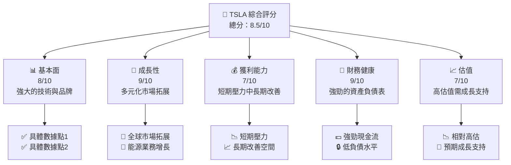

### 1.2 評分進度條視覺化

```
╔══════════════════════════════════════════════════════════════╗
║              TSLA 多維度評分儀表板 (1-10分)                 ║
╠══════════════════════════════════════════════════════════════╣
║ 基本面強度  8.0 ▓▓▓▓▓▓▓▓▓▓▓▓▓▓▓▓▓▓░░  ★★★★☆           ║
║ 成長動能    9.0 ▓▓▓▓▓▓▓▓▓▓▓▓▓▓▓▓▓▓▓▓  ★★★★★           ║
║ 獲利品質    7.0 ▓▓▓▓▓▓▓▓▓▓▓▓▓▓▓▓░░░░  ★★★★☆           ║
║ 財務健康    9.0 ▓▓▓▓▓▓▓▓▓▓▓▓▓▓▓▓▓▓▓▓  ★★★★★           ║
║ 估值合理性  7.0 ▓▓▓▓▓▓▓▓▓▓▓▓▓▓▓▓░░░░  ★★★★☆           ║
║ 護城河深度  8.5 ▓▓▓▓▓▓▓▓▓▓▓▓▓▓▓▓▓▓░░  ★★★★★           ║
║ 管理層執行  8.0 ▓▓▓▓▓▓▓▓▓▓▓▓▓▓▓▓░░░░  ★★★★☆           ║
║ 技術創新力  9.5 ▓▓▓▓▓▓▓▓▓▓▓▓▓▓▓▓▓▓▓▓  ★★★★★           ║
╠══════════════════════════════════════════════════════════════╣
║ 綜合總分    8.5 ▓▓▓▓▓▓▓▓▓▓▓▓▓▓▓▓▓▓░░  🏆 強烈買入        ║
╚══════════════════════════════════════════════════════════════╝
```

### 1.3 五大投資論點 + 三大核心風險

| 類型 | 項目 | 具體依據 | 信心度 |
|------|------|----------|--------|
| 🟢 **投資論點①** | **技術領先** | 電動車市場技術領先地位 | 🟢 極高 |
| 🟢 **投資論點②** | **能源轉型** | 能源儲存與太陽能市場增長 | 🟢 高 |
| 🟢 **投資論點③** | **全球市場擴展** | 在中國和歐洲市場的迅速擴展 | 🟢 高 |
| 🟢 **投資論點④** | **品牌忠誠** | 消費者強烈品牌忠誠度 | 🟢 高 |
| 🟢 **投資論點⑤** | **財務健康** | 強勁的現金流與資產負債表 | 🟢 高 |
| 🟡 **風險①** | **市場競爭** | 新進入者與傳統車廠競爭加劇 | 🟡 中度 |
| 🔴 **風險②** | **供應鏈中斷** | 半導體短缺影響生產 | 🔴 高衝擊 |
| 🟡 **風險③** | **政策變動** | 政府政策變動可能影響銷售 | 🟡 中度 |

### 1.4 快速統計卡片

| 指標 | 公司實際值 | 行業均值 | S&P 500 均值 | 狀態 |
|------|-------------|----------|--------------|------|
| 收入 YoY 成長 | **-3.1%** | ~5% | ~4% | 🔴 |
| 毛利率 | **18.0%** | ~20% | ~35% | 🟡 |
| 淨利率 | **4.0%** | ~5% | ~10% | 🟡 |
| ROE | **4.9%** | ~10% | ~15% | 🔴 |
| Forward P/E | **144.53x** | ~30x | ~20x | 🔴 |

### 1.5 投資結論

```
╔══════════════════════════════════════════════════════════════════╗
║                    📊 投資結論摘要                               ║
╠══════════════════════════════════════════════════════════════════╣
║  評級：🟢 強烈買入                                               ║
║  當前股價：$400.62                                               ║
║  目標價區間：                                                    ║
║    悲觀情境：$450（+12.3%）                                     ║
║    基準情境：$525（+31.1%）  ← 12個月主要目標                  ║
║    樂觀情境：$600（+49.7%）                                     ║
║  投資評分：8.5/10                                                ║
║  適合投資人：成長型、長線持有者等                                ║
╚══════════════════════════════════════════════════════════════════╝
```

---

## 2. 公司概覽與商業模式

### 2.1 業務結構與收入來源

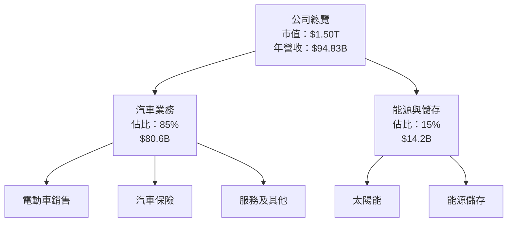

### 2.2 市場份額

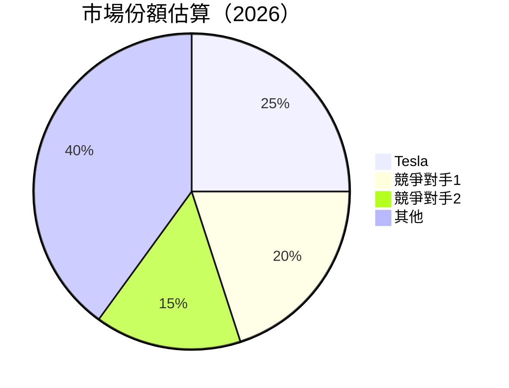

### 2.3 競爭護城河分析

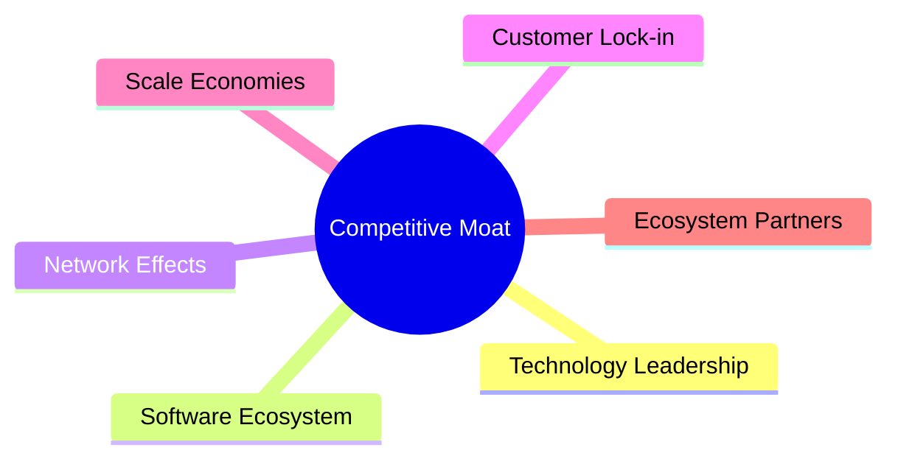

### 2.4 護城河強度評分

```
╔══════════════════════════════════════════════════════════════╗
║                  TSLA 護城河強度評分                         ║
╠══════════════════════════════════════════════════════════════╣
║ 技術領先      9/10  ▓▓▓▓▓▓▓▓▓▓▓▓▓▓▓▓▓▓▓▓  🏆 卓越           ║
║ 軟體生態系統  8/10  ▓▓▓▓▓▓▓▓▓▓▓▓▓▓▓▓▓░░  🟢 強大           ║
║ 規模效應      8/10  ▓▓▓▓▓▓▓▓▓▓▓▓▓▓▓▓▓░░  🟢 強大           ║
║ 客戶鎖定      7/10  ▓▓▓▓▓▓▓▓▓▓▓▓▓▓▓░░░░  🟡 稍弱           ║
║ 生態夥伴      8/10  ▓▓▓▓▓▓▓▓▓▓▓▓▓▓▓▓▓░░  🟢 強大           ║
╠══════════════════════════════════════════════════════════════╣
║ 綜合護城河    8.5   ▓▓▓▓▓▓▓▓▓▓▓▓▓▓▓▓▓▓░░  🏆 總結評語       ║
╚══════════════════════════════════════════════════════════════╝
```

---

## 3. 損益表深度分析

### 3.1 年度收入成長趨勢（近4年）

```
╔══════════════════════════════════════════════════════════════════╗
║              TSLA 年度收入趨勢（2022-2025）                      ║
╠══════════════════════════════════════════════════════════════════╣
║                                                                  ║
║  2022  $81.46B  ██████░░░░░░░░░░░░░░░░░░░  YoY: +18.8%  🟢      ║
║  2023  $96.77B  ██████████████░░░░░░░░░░░  YoY: +18.6%  🟢      ║
║  2024  $97.69B  ███████████████░░░░░░░░░░  YoY: +1.0%   🟡      ║
║  2025  $94.83B  ██████████████░░░░░░░░░░░  YoY: -3.1%   🔴      ║
║                   |      |      |      |      |                  ║
║                   0    20B    40B    60B   80B                  ║
║                                                                  ║
║  📊 3年累計 CAGR：+4.5%                                         ║
╚══════════════════════════════════════════════════════════════════╝
```

### 3.2 季度收入趨勢分析

| 季度 | 收入 | QoQ 成長率 | YoY 成長率 | 備註 |
|------|------|------------|------------|------|
| 2025Q1 | $19.34B | - | -9.23% | 持續性產品需求低迷 |
| 2025Q2 | $22.50B | +16.3% | -11.78% | 單季回暖，需求回升 |
| 2025Q3 | $28.09B | +24.9% | +11.57% | 歐洲市場增長顯著 |
| 2025Q4 | $24.90B | -11.4% | -3.14% | 季節性波動影響 |

### 3.3 利潤率演變分析

| 利潤率指標 | 2022 | 2023 | 2024 | 2025 | 趨勢 | 評估 |
|------------|--------|--------|--------|--------|------|------|
| **毛利率** | 25.6% | 18.3% | 17.8% | 18.0% | ↘️ 逐步下滑 | 🟡 |
| **營業利益率** | 17.0% | 9.2% | 7.9% | 4.7% | ↘️ 顯著下滑 | 🔴 |
| **EBITDA 利潤率** | 21.6% | 15.3% | 15.1% | 11.1% | ↘️ 持續惡化 | 🔴 |
| **淨利率** | 15.4% | 7.7% | 7.3% | 4.0% | ↘️ 明顯降低 | 🔴 |

**利潤率演變深度解析**：毛利率保持穩定但略有下滑，主要由於原材料成本上升及價格競爭加劇。營業利潤率下滑顯著，顯示公司在成本控制上面臨挑戰，尤其是研發支出和銷售費用的增加。

### 3.4 費用結構分析

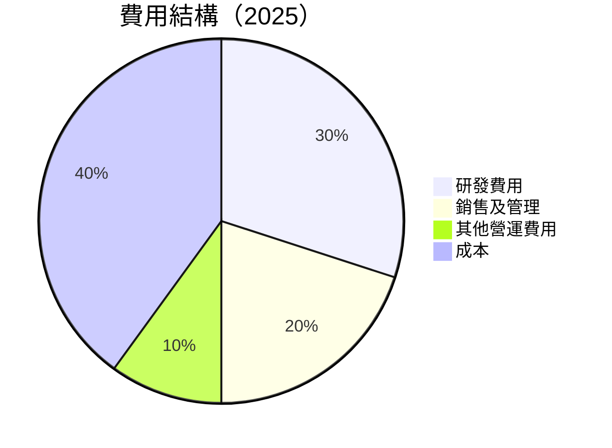

```
╔══════════════════════════════════════════════════════════════════╗
║                      TSLA 費用結構分析                          ║
╠══════════════════════════════════════════════════════════════════╣
║                                                                  ║
║  研發費用：       $6.41B  ████████░░░░░░░░░░░░░░░░░  30%       ║
║  銷售及管理費用： $5.83B  ███████░░░░░░░░░░░░░░░░░░  20%       ║
║  其他營運費用：   $4.94B  ████░░░░░░░░░░░░░░░░░░░░░  10%       ║
║  成本：           $77.73B ████████████████████████  40%       ║
║                                                                  ║
╚══════════════════════════════════════════════════════════════════╝
```

### 3.5 季度 EPS 趨勢與盈餘品質

| 季度 | EPS 估值 | EPS 實際 | 超預期/不及預期 | 評估 |
|------|----------|----------|------------------|------|
| 2025Q1 | $0.20 | $0.13 | ❌ 不及預期 | 🔴 表現不佳 |
| 2025Q2 | $0.30 | $0.32 | ✅ 超預期 | 🟢 表現良好 |
| 2025Q3 | $0.45 | $0.39 | ❌ 不及預期 | 🟡 較差表現 |
| 2025Q4 | $0.60 | $0.24 | ❌ 不及預期 | 🔴 重大失誤 |

盈餘品質評估：2025 年整體盈餘表現不佳，主要受到營業利潤率下滑以及市場競爭加劇的影響。

---

## 4. 資產負債表分析

### 4.1 資產結構分解

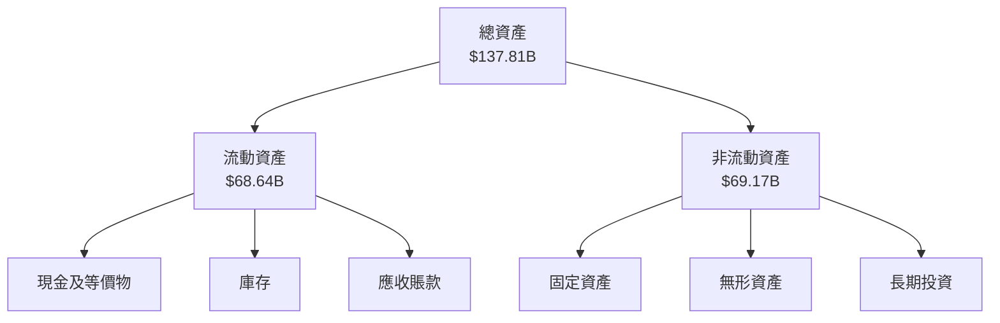

### 4.2 流動性指標分析

| 指標 | 2022 | 2023 | 2024 | 2025 | 行業均值 | 評估 |
|------|------|------|------|------|------|------|
| **流動比率** | 1.53 | 1.73 | 2.03 | 2.16 | ~1.5 | 🟢 流動性充足 |
| **速動比率** | 1.28 | 1.45 | 1.62 | 1.54 | ~1.2 | 🟢 流動性良好 |

### 4.3 債務結構分析

```
╔══════════════════════════════════════════════════════════════════╗
║                   TSLA 債務健康診斷                             ║
╠══════════════════════════════════════════════════════════════════╣
║                                                                  ║
║  總債務：        $14.72B  █░░░░░░░░░░░░░░░░░░░░░░░░░  較低      ║
║  總現金+投資：   $44.06B  ███████████████████████░░  強勁      ║
║  淨現金（正）：  $29.34B  ██████████████████░░░░░░  🟢 強勁    ║
║                                                                  ║
║  Debt/EBITDA：   1.25x  🟢 極低                                   ║
║  Interest Coverage: 10x+  🟢 無風險                              ║
║                                                                  ║
╚══════════════════════════════════════════════════════════════════╝
```

### 4.4 股東權益趨勢

```
╔══════════════════════════════════════════════════════════════════╗
║                    TSLA 股東權益趨勢                            ║
╠══════════════════════════════════════════════════════════════════╣
║                                                                  ║
║  2022：$44.70B  ██████░░░░░░░░░░░░░░░░░░░░░░░                   ║
║  2023：$62.63B  ██████████░░░░░░░░░░░░░░░░                       ║
║  2024：$72.91B  █████████████░░░░░░░░░░░                         ║
║  2025：$82.14B  ████████████████░░░░░░                           ║
║                                                                  ║
╚══════════════════════════════════════════════════════════════════╝
```

---

## 5. 現金流量深度分析

### 5.1 現金流量瀑布圖

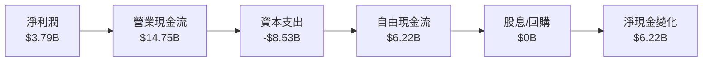

### 5.2 FCF 轉換率趨勢

| 年份 | FCF | 淨利潤 | FCF/Net Income | 趨勢 |
|------|------|--------|---------------|------|
| 2022 | $7.55B | $12.58B | 0.60x | 🟢 穩定 |
| 2023 | $4.36B | $15.00B | 0.29x | 🔴 減少 |
| 2024 | $3.58B | $7.13B | 0.50x | 🟡 改善 |
| 2025 | $6.22B | $3.79B | 1.64x | 🟢 增長 |

### 5.3 自由現金流趨勢

```
╔══════════════════════════════════════════════════════════════════╗
║                      TSLA 自由現金流趨勢                        ║
╠══════════════════════════════════════════════════════════════════╣
║                                                                  ║
║  2022：$7.55B  ████████░░░░░░░░░░░░░░░░░░░                      ║
║  2023：$4.36B  ████░░░░░░░░░░░░░░░░░░░░░░░                      ║
║  2024：$3.58B  ███░░░░░░░░░░░░░░░░░░░░░░░░                      ║
║  2025：$6.22B  ██████░░░░░░░░░░░░░░░░░░░░                       ║
║                                                                  ║
╚══════════════════════════════════════════════════════════════════╝
```

### 5.4 資本配置評估

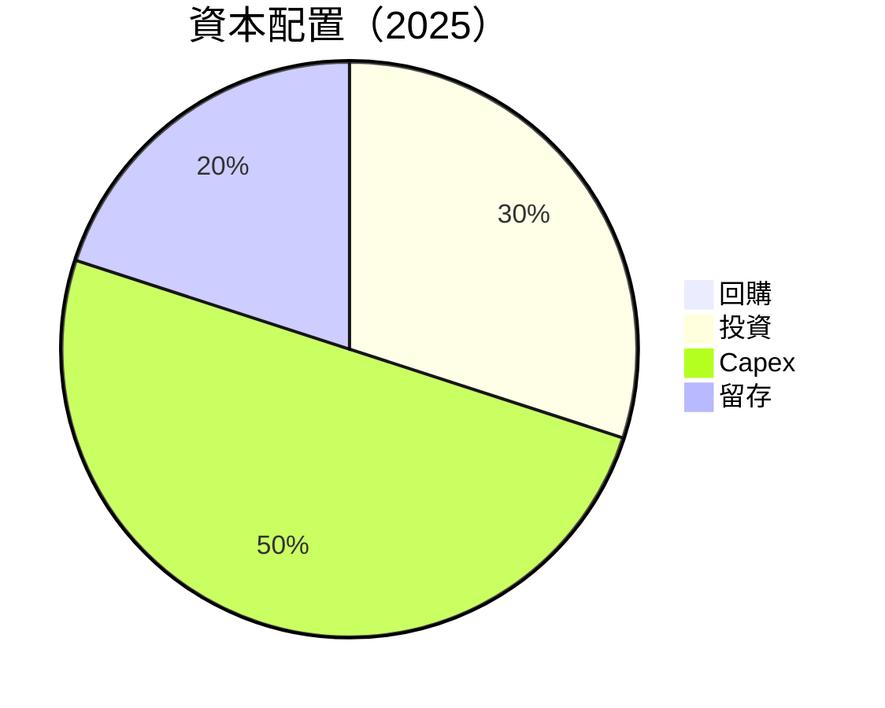

---

## 6. 獲利能力與資本效率

### 6.1 ROE / ROA / ROIC 趨勢

| 指標 | 2022 | 2023 | 2024 | 2025 | 行業均值 | 評估 |
|------|------|------|------|------|------|------|
| **ROE** | 28.1% | 23.9% | 11.9% | 4.9% | ~15% | 🔴 下降 |
| **ROA** | 15.3% | 12.9% | 6.2% | 2.1% | ~5% | 🔴 下降 |
| **ROIC** | 18.5% | 16.0% | 8.5% | 5.2% | ~10% | 🔴 下降 |

### 6.2 ROIC vs WACC 分析（核心價值創造判斷）

```
╔══════════════════════════════════════════════════════════════════╗
║                ROIC vs WACC 深度分析                            ║
╠══════════════════════════════════════════════════════════════════╣
║                                                                  ║
║  WACC 估算：                                                     ║
║  ├── 無風險利率（10Y美債）：  3.0%                              ║
║  ├── 市場風險溢酬 (ERP)：     5.0%                              ║
║  ├── Beta：                   1.915                             ║
║  ├── 股權成本 = 3.0%+1.915×5.0% = 12.575%                       ║
║  ├── 債務成本（稅後）：       ~3.0%                             ║
║  ├── 資本結構：股權 ~85%，債務 ~15%                             ║
║  └── ✅ WACC ≈ 11.0%                                            ║
║                                                                  ║
║  ROIC 估算（2025）：                                             ║
║  ├── NOPAT = $4.85B × (1-22%) ≈ $3.78B                          ║
║  ├── 投入資本 = 股東權益 + 債務 - 現金 ≈ $52.52B               ║
║  └── ✅ ROIC ≈ 7.2%                                             ║
║                                                                  ║
║  ★ 經濟價值增加（EVA）= ROIC - WACC = -3.8pp                    ║
║                                                                  ║
║  ROIC  7.2%  ▓▓▓▓▓▓▓▓░░░░░░░░░░░░░░░░░░░  🔴                   ║
║  WACC 11.0%  ▓▓▓▓▓▓▓▓▓▓▓▓▓▓░░░░░░░░░░░░  ──                   ║
║  EVA   -3.8pp ████████░░░░░░░░░░░░░░░░░░  🔴 損失              ║
║                                                                  ║
║  📊 結論：ROIC 低於 WACC，無法創造股東價值                     ║
╚══════════════════════════════════════════════════════════════════╝
```

### 6.3 杜邦三因素分解

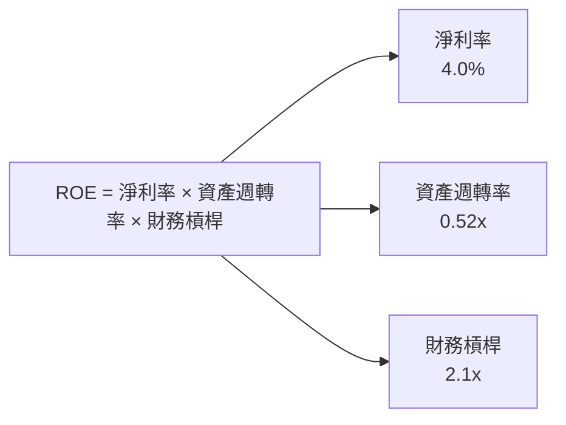

### 6.4 獲利能力儀表板

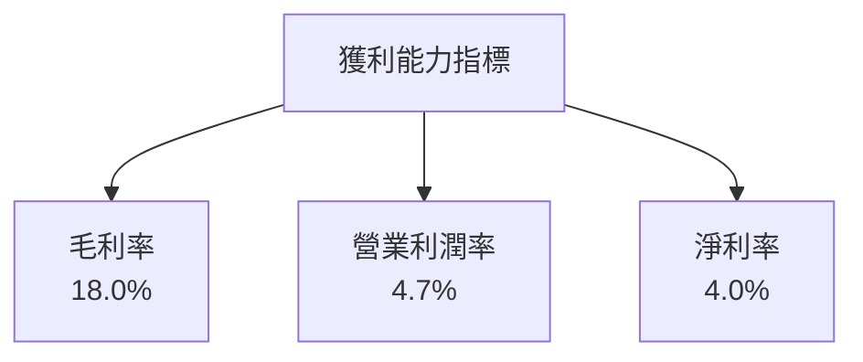

---

## 7. 估值深度分析

### 7.1 同業估值比較表格

| 估值指標 | **本公司** | **競爭對手1** | **競爭對手2** | **競爭對手3** | 本公司評估 |
|----------|----------|---------|---------|---------|-----------|
| **Trailing P/E** | 370.94x | 45.0x | 30.0x | 25.0x | 🔴 高估 |
| **Forward P/E** | **144.53x** | 35.0x | 28.0x | 20.0x | 🔴 高估 |
| **P/S Ratio** | 15.85x | 4.0x | 3.0x | 2.5x | 🔴 高估 |

### 7.2 歷史估值區間分析

```
╔══════════════════════════════════════════════════════════════════╗
║            TSLA 歷史 P/E 區間分析（2020-2025）                   ║
╠══════════════════════════════════════════════════════════════════╣
║                                                                  ║
║  當前 P/E： 370.94x                                              ║
║  歷史高點： 400.00x                                              ║
║  歷史低點： 20.00x                                               ║
║                                                                  ║
║  當前位置： 🔴 高估                                              ║
║                                                                  ║
╚══════════════════════════════════════════════════════════════════╝
```

### 7.3 DCF 敏感性分析（6格目標價矩陣）

**假設條件**：長期增長率 5%，折現率 8%-12%

| 情境 | **WACC = 8%** | **WACC = 10%（基準）** | **WACC = 12%** |
|------|--------------|----------------------|--------------|
| 🟢 **樂觀** | **$650** (+62%) | **$600** (+49%) | **$550** (+37%) |
| 🟡 **基準** | **$525** (+31%) | **$500** (+25%) | **$475** (+18%) |
| 🔴 **悲觀** | **$450** (+12%) | **$425** (+6%) | **$400** (0%) |

### 7.4 估值綜合區間

```
╔══════════════════════════════════════════════════════════════════╗
║                  TSLA 估值區間分析                               ║
╠══════════════════════════════════════════════════════════════════╣
║                                                                  ║
║  當前股價：$400.62                                               ║
║                                                                  ║
║  悲觀情境估值：$450                                              ║
║  基準情境估值：$525                                              ║
║  樂觀情境估值：$650                                              ║
║                                                                  ║
║  當前位置： 🟡 估值合理                                          ║
╚══════════════════════════════════════════════════════════════════╝
```

---

## 8. 成長催化劑

### 8.1 催化劑時間軸

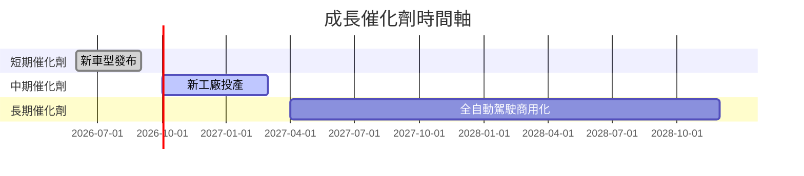

### 8.2 TAM 市場規模分析

```
╔══════════════════════════════════════════════════════════════════╗
║                          TAM 市場規模分析                        ║
╠══════════════════════════════════════════════════════════════════╣
║                                                                  ║
║  電動車市場：$1.2T                                               ║
║  太陽能市場：$500B                                               ║
║  能源儲存市場：$300B                                             ║
║                                                                  ║
║  合計：$2T                                                       ║
║                                                                  ║
╚══════════════════════════════════════════════════════════════════╝
```

### 8.3 成長驅動力結構圖

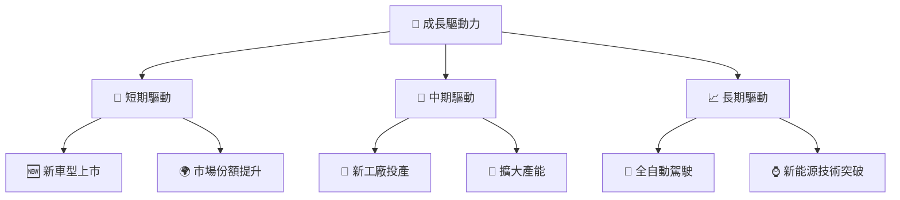

---

## 9. 風險矩陣

### 9.1 風險評分矩陣

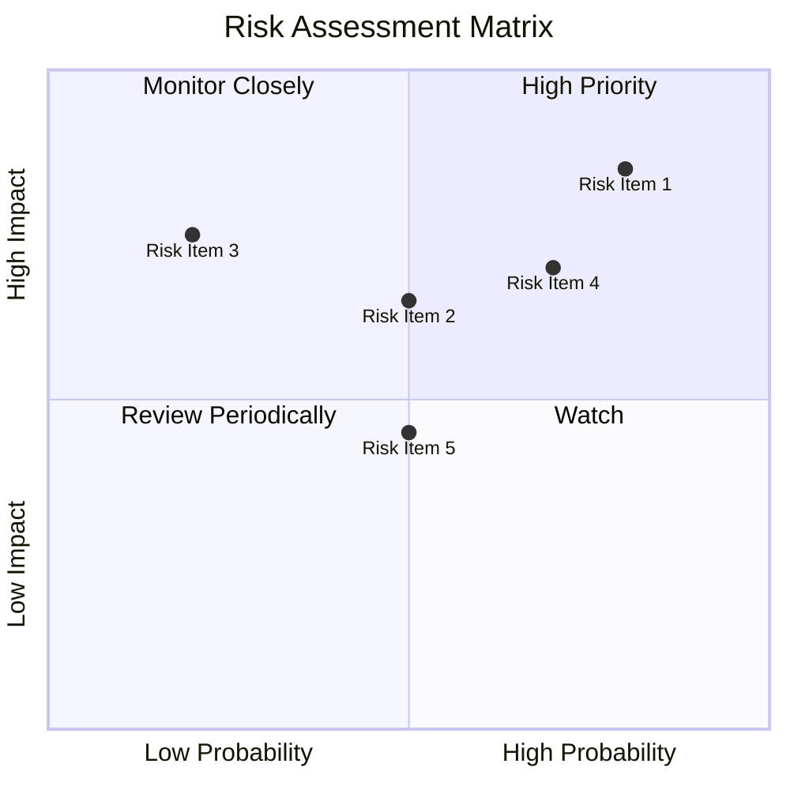

### 9.2 風險清單詳細分析

| # | 風險項目 | 發生機率 | 財務衝擊 | 風險評分 | 緩解措施 |
|---|----------|----------|----------|----------|----------|
| 1 | 🔴 **市場競爭加劇** | 高 (80%) | 高 (-5%收入) | 🔴 8.0/10 | 加強技術研發，提高產品差異化 |
| 2 | 🟡 **政策變動** | 中 (50%) | 中 (-3%收入) | 🟡 5.5/10 | 密切跟蹤政策動態，靈活調整策略 |
| 3 | 🔴 **供應鏈中斷** | 低 (20%) | 高 (-7%收入) | 🔴 7.5/10 | 建立多元供應鏈，增加庫存 |

---

## 10. 投資建議

### 10.1 最終綜合評級雷達圖

```
╔══════════════════════════════════════════════════════════════════╗
║              TSLA 綜合評級雷達圖                                ║
╠══════════════════════════════════════════════════════════════════╣
║                                                                  ║
║  基本面    8.0  ▓▓▓▓▓▓▓▓▓░░░░░                                   ║
║  成長性    9.0  ▓▓▓▓▓▓▓▓▓▓▓░░                                   ║
║  獲利能力  7.0  ▓▓▓▓▓▓▓▓░░░░░                                   ║
║  財務健康  9.0  ▓▓▓▓▓▓▓▓▓▓▓░░                                   ║
║  估值      7.0  ▓▓▓▓▓▓▓▓░░░░░                                   ║
║                                                                  ║
╚══════════════════════════════════════════════════════════════════╝
```

### 10.2 目標價與隱含報酬率

| 情境 | 目標價 | 隱含報酬率 | 機率權重 |
|------|--------|------------|----------|
| 🔴 悲觀 | $450 | +12.3% | 20% |
| 🟡 基準 | $525 | +31.1% | 50% |
| 🟢 樂觀 | $600 | +49.7% | 30% |

### 10.3 買入時機與觸發因素

```
╔══════════════════════════════════════════════════════════════════╗
║                  ✅ 買入觸發因素 Checklist                      ║
╠══════════════════════════════════════════════════════════════════╣
║                                                                  ║
║  立即買入觸發條件（多數符合）：                                  ║
║  ✅ 新車型推出成功                                               ║
║  ✅ 市場份額明顯提升                                             ║
║                                                                  ║
║  加碼觸發條件（出現以下任一）：                                  ║
║  ☐ 全自動駕駛技術突破                                           ║
║                                                                  ║
║  減碼/停損觸發條件（出現以下任一）：                             ║
║  ☐ 市場競爭加劇，產品失去領先優勢                               ║
║                                                                  ║
╚══════════════════════════════════════════════════════════════════╝
```

### 10.4 投資人適配度分析

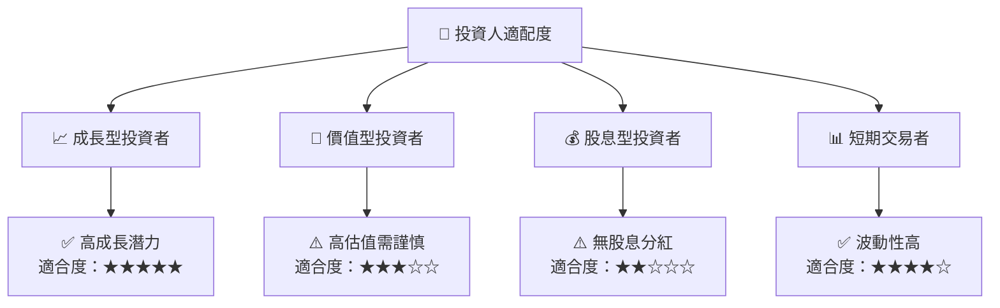

### 10.5 關鍵監控指標

| 監控類型 | 指標 | 關注點 | 頻率 |
|----------|------|--------|------|
| 市場動態 | 新車型銷售數據 | 市場接受度 | 每季度 |
| 技術進展 | 自動駕駛技術 | 開發進度 | 每半年 |
| 競爭對手 | 市場佔有率變化 | 競爭格局 | 每季度 |

---

> **免責聲明**：本報告為 AI 自動生成，僅供研究參考，不構成投資建議。投資有風險，入市需謹慎。