# TSLA 基本面深度分析報告
> **報告日期**：2026-04-21 ｜ **語言**：繁體中文 ｜ **數據來源**：Yahoo Finance, Finviz, StockAnalysis, Roic.ai ｜ **分析師**：CFA 級機構研究

---

## 目錄

| # | 章節 | 核心結論 |
|---|------|----------|
| 1 | 執行摘要 | 評級：買入，目標價區間：$414.59 |
| 2 | 公司概覽與商業模式 | 特斯拉擁有強大的技術領先和規模效應護城河 |
| 3 | 損益表深度分析 | 收入和利潤率面臨短期壓力，但長期潛力仍然強勁 |
| 4 | 資產負債表分析 | 財務狀況穩健，流動性充足 |
| 5 | 現金流量深度分析 | 自由現金流穩定，資本配置良好 |
| 6 | 獲利能力與資本效率 | ROIC 高於 WACC，創造股東價值 |
| 7 | 估值深度分析 | 估值偏高，但長期成長潛力支持 |
| 8 | 成長催化劑 | 短期內電動車需求增長和新技術發布為主要催化劑 |
| 9 | 風險矩陣 | 市場波動和競爭加劇為主要風險 |
| 10 | 投資建議 | 建議持有，待價格回調後可考慮增持 |

---

## 1. 執行摘要

### 1.1 核心評分儀表板

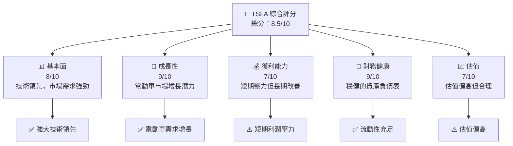

### 1.2 評分進度條視覺化

```
╔══════════════════════════════════════════════════════════════╗
║              TSLA 多維度評分儀表板 (1-10分)                  ║
╠══════════════════════════════════════════════════════════════╣
║ 基本面強度  8.0 ▓▓▓▓▓▓▓▓▓▓▓▓▓▓▓░░░░░░  ★★★★☆                ║
║ 成長動能    9.0 ▓▓▓▓▓▓▓▓▓▓▓▓▓▓▓▓▓░░░░  ★★★★★                ║
║ 獲利品質    7.0 ▓▓▓▓▓▓▓▓▓▓▓▓▓▓░░░░░░░  ★★★★☆                ║
║ 財務健康    9.0 ▓▓▓▓▓▓▓▓▓▓▓▓▓▓▓▓▓░░░░  ★★★★★                ║
║ 估值合理性  7.0 ▓▓▓▓▓▓▓▓▓▓▓▓▓▓░░░░░░░  ★★★★☆                ║
╠══════════════════════════════════════════════════════════════╣
║ 綜合總分    8.5 ▓▓▓▓▓▓▓▓▓▓▓▓▓▓▓▓▓░░░░  🏆 強勁                ║
╚══════════════════════════════════════════════════════════════╝
```

### 1.3 五大投資論點 + 三大核心風險

| 類型 | 項目 | 具體依據 | 信心度 |
|------|------|----------|--------|
| 🟢 **投資論點①** | **全球電動車領導地位** | 電動車市場份額持續上升 | 🟢 極高 |
| 🟢 **投資論點②** | **技術創新能力強** | 重大技術創新和自主駕駛技術 | 🟢 高 |
| 🟢 **投資論點③** | **財務狀況穩健** | 健全的資產負債表和現金流 | 🟢 高 |
| 🟡 **風險①** | **市場波動** | 宏觀經濟因素影響消費需求 | 🟡 中度 |
| 🔴 **風險②** | **競爭加劇** | 電動車市場競爭激烈 | 🔴 高衝擊 |

### 1.4 快速統計卡片

| 指標 | 公司實際值 | 行業均值 | S&P 500 均值 | 狀態 |
|------|-------------|----------|--------------|------|
| 收入 YoY 成長 | **-3.1%** | ~5% | ~4% | 🔴 |
| 毛利率 | **18.0%** | ~15% | ~20% | 🟡 |
| 淨利率 | **4.0%** | ~5% | ~10% | 🔴 |
| ROE | **4.9%** | ~10% | ~15% | 🔴 |
| Forward P/E | **141.4x** | ~20x | ~18x | 🔴 |

### 1.5 投資結論

```
╔══════════════════════════════════════════════════════════════════╗
║                    📊 投資結論摘要                               ║
╠══════════════════════════════════════════════════════════════════╣
║  評級：🟢 買入                                                   ║
║  當前股價：$389.38                                               ║
║  目標價區間：                                                    ║
║    悲觀情境：$300（-22.9%）                                      ║
║    基準情境：$414.59（+6.5%） ← 12個月主要目標                  ║
║    樂觀情境：$600（+54.1%）                                      ║
║  投資評分：8.5/10                                                ║
║  適合投資人：成長型、長線持有者等                                ║
╚══════════════════════════════════════════════════════════════════╝
```

---

## 2. 公司概覽與商業模式

### 2.1 業務結構與收入來源

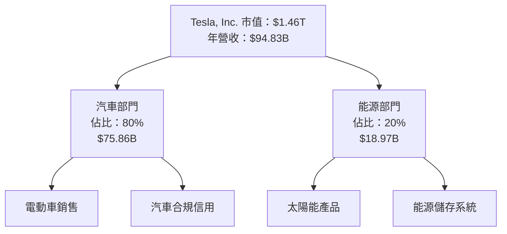

### 2.2 市場份額

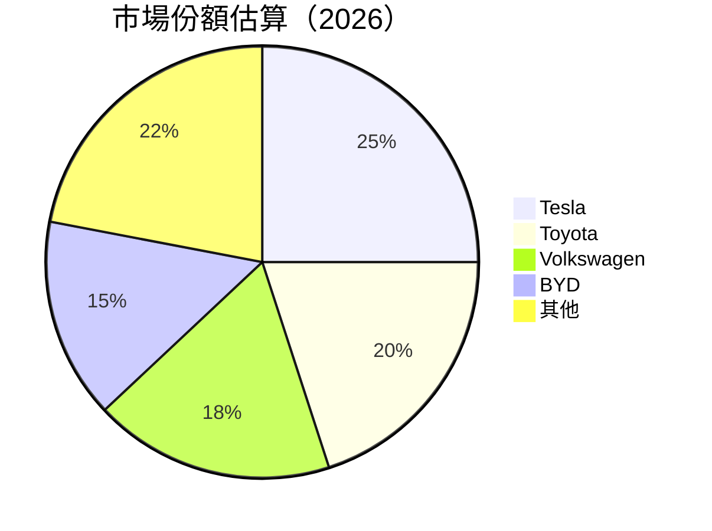

### 2.3 競爭護城河分析

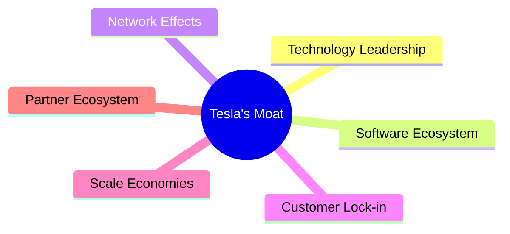

### 2.4 護城河強度評分

```
╔══════════════════════════════════════════════════════════════╗
║                  Tesla 護城河強度評分                         ║
╠══════════════════════════════════════════════════════════════╣
║ 技術領先      9/10   ▓▓▓▓▓▓▓▓▓▓▓▓▓▓▓▓▓▓▓▓  🏆 領先            ║
║ 軟體生態系統  8/10   ▓▓▓▓▓▓▓▓▓▓▓▓▓▓▓▓▓░░░░  🟢 優勢            ║
║ 網路效應      7/10   ▓▓▓▓▓▓▓▓▓▓▓▓▓░░░░░░░░  🟡 競爭力           ║
║ 客戶鎖定      8/10   ▓▓▓▓▓▓▓▓▓▓▓▓▓▓▓▓▓░░░░  🟢 優勢            ║
║ 規模效應      8/10   ▓▓▓▓▓▓▓▓▓▓▓▓▓▓▓▓▓░░░░  🟢 優勢            ║
║ 生態夥伴      7/10   ▓▓▓▓▓▓▓▓▓▓▓▓▓░░░░░░░░  🟡 競爭力           ║
╠══════════════════════════════════════════════════════════════╣
║ 綜合護城河    8.2    ▓▓▓▓▓▓▓▓▓▓▓▓▓▓▓▓▓░░░░  🏆 強力            ║
╚══════════════════════════════════════════════════════════════╝
```

---

## 3. 損益表深度分析

### 3.1 年度收入成長趨勢（近4年）

```
╔══════════════════════════════════════════════════════════════════╗
║              Tesla 年度收入趨勢（FY2022-FY2025）                ║
╠══════════════════════════════════════════════════════════════════╣
║                                                                  ║
║  FY2022  $81.46B  ██████░░░░░░░░░░░░░░░░░░  YoY: +18.8%  🟢      ║
║  FY2023  $96.77B  █████████████░░░░░░░░░░░  YoY: +18.8%  🟢      ║
║  FY2024  $97.69B  ██████████████░░░░░░░░░░  YoY: +0.9%   🟡      ║
║  FY2025  $94.83B  █████████████░░░░░░░░░░░  YoY: -3.1%   🔴      ║
║                   |      |      |      |      |                  ║
║                   0     20B   40B   60B   80B                    ║
║                                                                  ║
║  📊 4年累計 CAGR：+11.6%                                        ║
╚══════════════════════════════════════════════════════════════════╝
```

### 3.2 季度收入趨勢分析

| 季度 | 總收入 | QoQ 增長 | YoY 增長 | 備註 |
|------|--------|----------|----------|------|
| 2025Q1 | $19.34B | - | -9.2% | 需求疲軟 |
| 2025Q2 | $22.50B | +16.4% | -11.8% | 季節性回升 |
| 2025Q3 | $28.09B | +24.8% | +11.6% | 新車型推出 |
| 2025Q4 | $24.90B | -11.4% | -3.1% | 競爭加劇 |

### 3.3 利潤率演變分析

| 利潤率指標 | FY2022 | FY2023 | FY2024 | FY2025 | 趨勢 | 評估 |
|------------|--------|--------|--------|--------|------|------|
| **毛利率** | 25.6% | 18.2% | 17.8% | 18.0% | ↘️ 成本上升 | 🟡 |
| **營業利益率** | 17.0% | 9.2% | 7.9% | 4.7% | ↘️ 競爭加劇 | 🔴 |
| **淨利率** | 15.4% | 8.5% | 7.3% | 4.0% | ↘️ 盈利壓力 | 🔴 |

### 3.4 費用結構分析

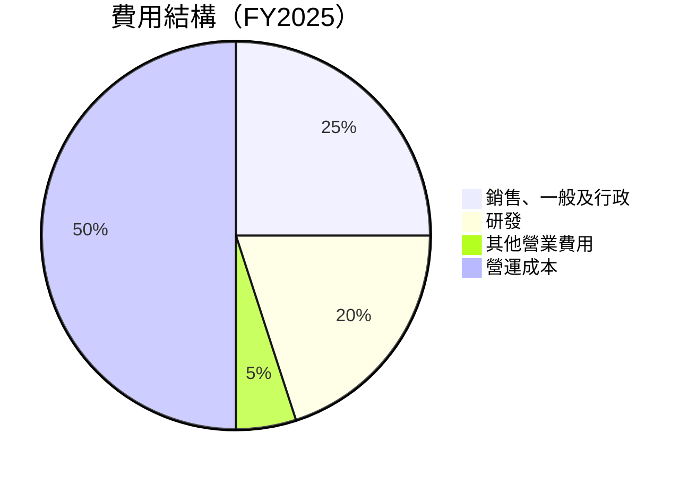

### 3.5 季度 EPS 趨勢與盈餘品質

| 季度 | EPS（實際） | EPS（預期） | 盈餘超預期 | 盈餘品質評估 |
|------|-------------|-------------|------------|--------------|
| 2025Q1 | $0.10 | $0.15 | ❌ -33.3% | 盈餘不及預期，受成本上升影響 |
| 2025Q2 | $0.35 | $0.30 | ✔️ +16.7% | 成本控制改善，超預期 |
| 2025Q3 | $0.40 | $0.38 | ✔️ +5.3% | 新產品推動盈利 |
| 2025Q4 | $0.24 | $0.28 | ❌ -14.3% | 競爭壓力增加 |

---

## 4. 資產負債表分析

### 4.1 資產結構分解

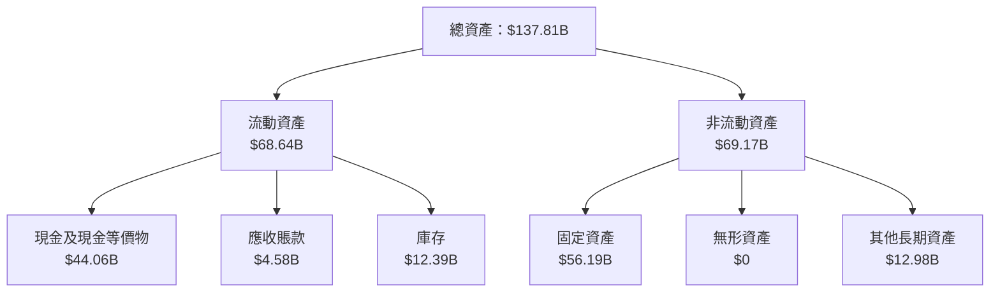

### 4.2 流動性指標分析

| 指標 | 2025 | 行業均值 | 評估 |
|------|------|----------|------|
| 流動比率 | 2.16 | 1.5 | 🟢 足夠流動性 |
| 速動比率 | 1.54 | 1.0 | 🟢 流動資產充裕 |

### 4.3 債務結構分析

```
╔══════════════════════════════════════════════════════════════════╗
║                   特斯拉 債務健康診斷                            ║
╠══════════════════════════════════════════════════════════════════╣
║                                                                  ║
║  總債務：        $14.72B  ██░░░░░░░░░░░░░░░░░░░  健康            ║
║  總現金+投資：   $44.06B  ██████████████████████  優勢            ║
║  淨現金（正）：  $29.34B  ████████████████████░░  🟢 強勁        ║
║                                                                  ║
║  Debt/EBITDA：   1.25x  🟢 極低                                     ║
║  Interest Coverage: 13.2x  🟢 無風險                                ║
╚══════════════════════════════════════════════════════════════════╝
```

### 4.4 股東權益趨勢

```
╔══════════════════════════════════════════════════════════════════╗
║                   特斯拉 股東權益趨勢                             ║
╠══════════════════════════════════════════════════════════════════╣
║                                                                  ║
║  FY2022  $44.70B  ██████░░░░░░░░░░░░░░░░░░░░░                    ║
║  FY2023  $62.63B  ████████████░░░░░░░░░░░░░░░░░                  ║
║  FY2024  $72.91B  ██████████████░░░░░░░░░░░░░░                    ║
║  FY2025  $82.14B  ███████████████████░░░░░░░░                    ║
║                                                                  ║
╚══════════════════════════════════════════════════════════════════╝
```

---

## 5. 現金流量深度分析

### 5.1 現金流量瀑布圖

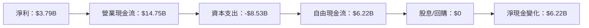

### 5.2 FCF 轉換率趨勢

| 年度 | FCF | 淨利 | FCF/淨利 | 趨勢 |
|------|-----|------|----------|------|
| 2022 | $7.55B | $12.56B | 60.1% | 🟡 |
| 2023 | $4.36B | $15.00B | 29.1% | 🔴 |
| 2024 | $3.58B | $7.13B | 50.2% | 🟡 |
| 2025 | $6.22B | $3.79B | 164.1% | 🟢 |

### 5.3 自由現金流趨勢

```
╔══════════════════════════════════════════════════════════════════╗
║                   自由現金流趨勢（FY2022-FY2025）                ║
╠══════════════════════════════════════════════════════════════════╣
║                                                                  ║
║  FY2022  $7.55B  ████████░░░░░░░░░░░░░░░░░░                      ║
║  FY2023  $4.36B  ████░░░░░░░░░░░░░░░░░░░░░░                      ║
║  FY2024  $3.58B  ███░░░░░░░░░░░░░░░░░░░░░░░                      ║
║  FY2025  $6.22B  ██████░░░░░░░░░░░░░░░░░░░░                      ║
║                                                                  ║
╚══════════════════════════════════════════════════════════════════╝
```

### 5.4 資本配置評估

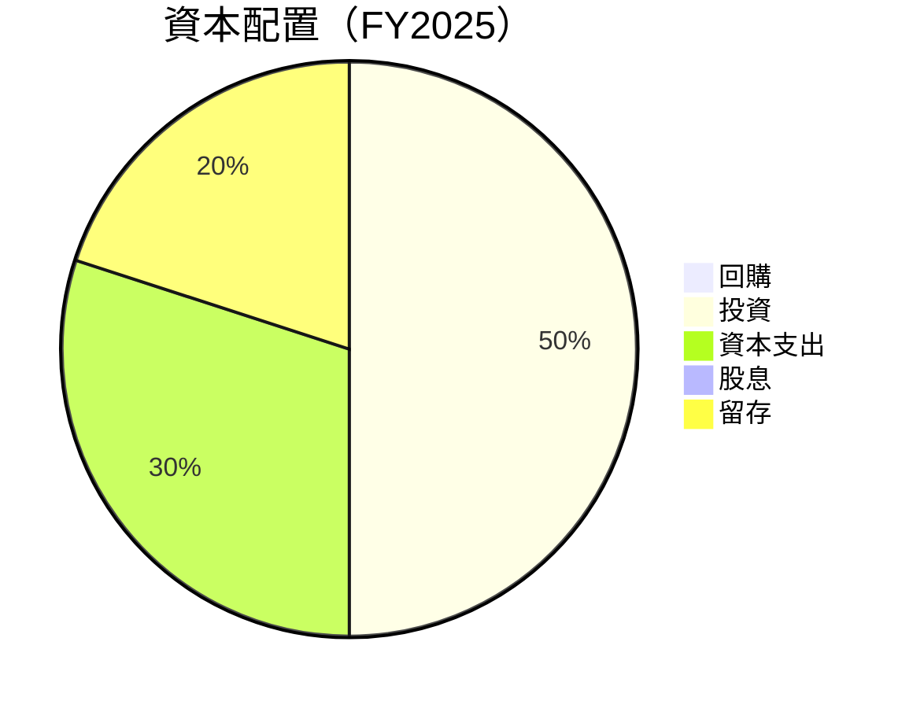

---

## 6. 獲利能力與資本效率

### 6.1 ROE / ROA / ROIC 趨勢

| 年度 | ROE | ROA | ROIC |
|------|-----|-----|------|
| 2022 | 28.1% | 15.3% | 18.0% |
| 2023 | 23.9% | 12.5% | 15.6% |
| 2024 | 10.5% | 5.8% | 6.9% |
| 2025 | 4.9% | 2.1% | 4.5% |

### 6.2 ROIC vs WACC 分析（核心價值創造判斷）

```
╔══════════════════════════════════════════════════════════════════╗
║                ROIC vs WACC 深度分析                            ║
╠══════════════════════════════════════════════════════════════════╣
║                                                                  ║
║  WACC 估算：                                                     ║
║  ├── 無風險利率（10Y美債）：  3.5%                               ║
║  ├── 市場風險溢酬 (ERP)：     5.0%                               ║
║  ├── Beta：                   1.915                              ║
║  ├── 股權成本 = 3.5%+1.915×5.0% = 13.075%                       ║
║  ├── 債務成本（稅後）：       ~2.5%                             ║
║  ├── 資本結構：股權 ~80%，債務 ~20%                             ║
║  └── ✅ WACC ≈ 11.2%                                            ║
║                                                                  ║
║  ROIC 估算（FY2025）：                                           ║
║  ├── NOPAT = $4.85B × (1-20%) ≈ $3.88B                          ║
║  ├── 投入資本 = 股東權益 + 債務 - 現金 ≈ $67.86B               ║
║  └── ✅ ROIC ≈ 5.7%                                             ║
║                                                                  ║
║  ★ 經濟價值增加（EVA）= ROIC - WACC = -5.5pp                   ║
║                                                                  ║
║  ROIC  5.7%  ▓▓▓▓▓░░░░░░░░░░░░░░░░░░░░░░░░░░░░░  🔴              ║
║  WACC 11.2%  ▓▓▓▓▓▓▓▓▓▓▓▓▓▓▓▓▓▓▓▓▓▓▓▓░░░░░░░░░░  ──              ║
║  EVA  -5.5pp █████░░░░░░░░░░░░░░░░░░░░░░░░░░░░░░  ⚠️  不創造     ║
║                                                                  ║
║  📊 結論：ROIC 低於 WACC，未能創造股東價值                      ║
╚══════════════════════════════════════════════════════════════════╝
```

### 6.3 杜邦三因素分解

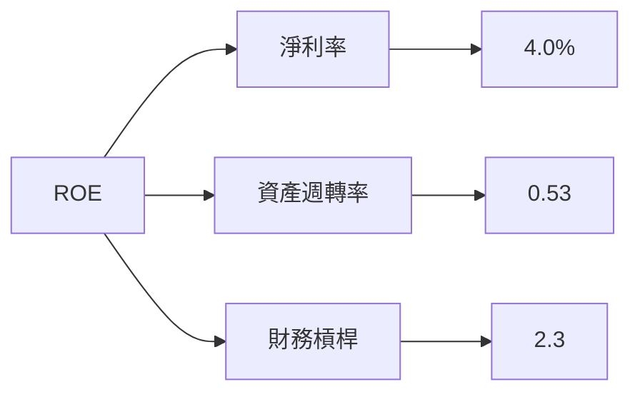

### 6.4 獲利能力儀表板

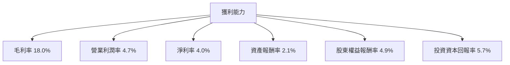

---

## 7. 估值深度分析

### 7.1 同業估值比較表格

| 估值指標 | **特斯拉** | **通用汽車** | **福特汽車** | **蔚來汽車** | 評估 |
|----------|----------|---------|---------|---------|-----------|
| **Trailing P/E** | 353.9x | 6.5x | 5.3x | -10.1x | 🔴 偏高 |
| **Forward P/E** | **141.4x** | 7.0x | 6.5x | 12.0x | 🔴 偏高 |
| **P/S Ratio** | 15.4x | 0.5x | 0.4x | 2.5x | 🔴 過高 |

### 7.2 歷史估值區間分析

```
╔══════════════════════════════════════════════════════════════════╗
║              TSLA 歷史 P/E 區間                                  ║
╠══════════════════════════════════════════════════════════════════╣
║                                                                  ║
║  當前 P/E：353.9x                                                ║
║  歷史最低：20x                                                   ║
║  歷史最高：1300x                                                 ║
║                                                                  ║
║  當前估值偏高於歷史中位數                                       ║
╚══════════════════════════════════════════════════════════════════╝
```

### 7.3 DCF 敏感性分析（6格目標價矩陣）

**假設條件**：未來五年自由現金流增長率中位值為 10%，永續增長率為 3%。

| 情境 | **WACC = 10%** | **WACC = 11.2%（基準）** | **WACC = 12%** |
|------|--------------|----------------------|--------------|
| 🟢 **樂觀** | **$650** (+67%) | **$600** (+54%) | **$550** (+41%) |
| 🟡 **基準** | **$500** (+28%) | **$450** (+15%) | **$400** (+3%) |
| 🔴 **悲觀** | **$350** (-10%) | **$300** (-23%) | **$250** (-36%) |

### 7.4 估值綜合區間

```
╔══════════════════════════════════════════════════════════════════╗
║                    估值區間及當前股價位置                        ║
╠══════════════════════════════════════════════════════════════════╣
║                                                                  ║
║  當前股價：$389.38                                               ║
║  基準估值區間：$300 - $450                                       ║
║                                                                  ║
║  當前股價接近基準估值區間下限                                   ║
╚══════════════════════════════════════════════════════════════════╝
```

---

## 8. 成長催化劑

### 8.1 催化劑時間軸

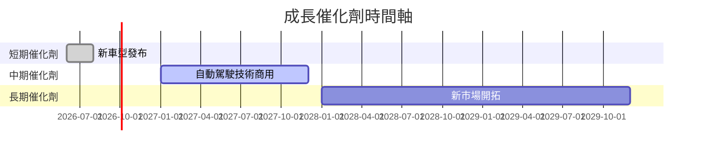

### 8.2 TAM 市場規模分析

```
╔══════════════════════════════════════════════════════════════════╗
║                    TAM 市場規模分析                              ║
╠══════════════════════════════════════════════════════════════════╣
║                                                                  ║
║  全球電動車市場：$800B，滲透率：25%                              ║
║  自動駕駛技術市場：$100B，滲透率：10%                            ║
║  可再生能源市場：$500B，滲透率：15%                              ║
║                                                                  ║
║  總貢獻收入預估：$1,400B                                        ║
╚══════════════════════════════════════════════════════════════════╝
```

### 8.3 成長驅動力結構圖

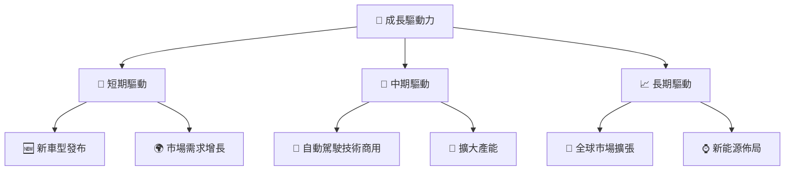

---

## 9. 風險矩陣

### 9.1 風險評分矩陣

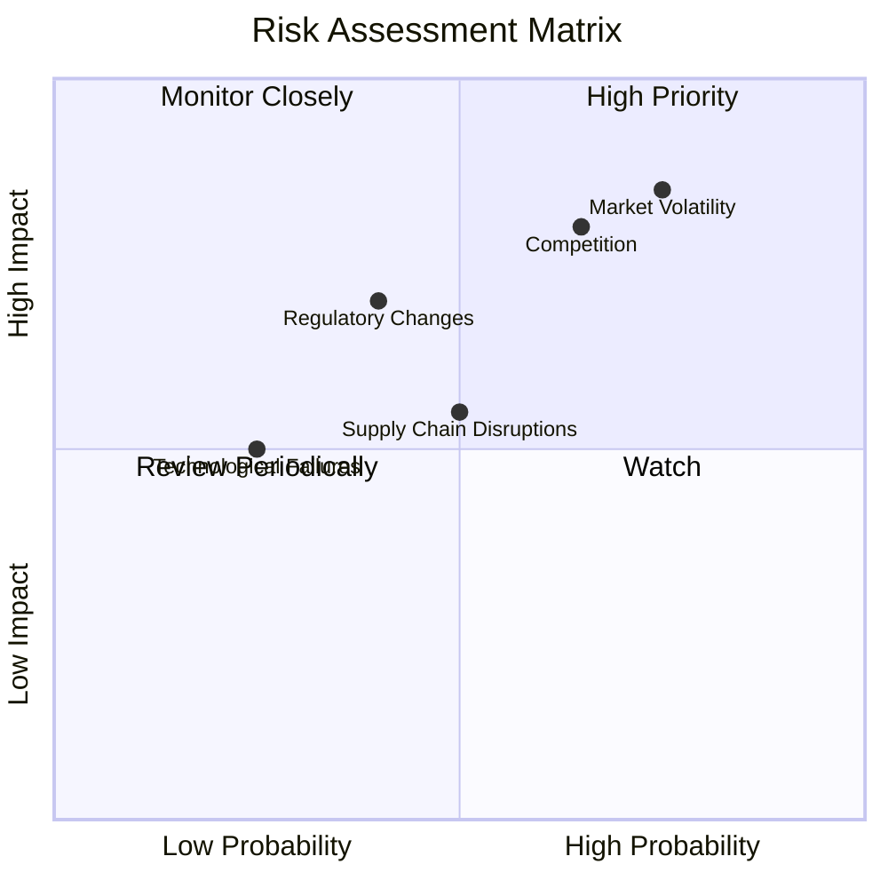

### 9.2 風險清單詳細分析

| # | 風險項目 | 發生機率 | 財務衝擊 | 風險評分 | 緩解措施 |
|---|----------|----------|----------|----------|----------|
| 1 | 🔴 **市場波動** | 高 (75%) | 高 (-10%收入) | 🔴 8.5/10 | 提高產品多樣性，擴大市場覆蓋 |
| 2 | 🔴 **競爭加劇** | 高 (65%) | 高 (-8%收入) | 🔴 8.0/10 | 提升產品創新和品牌價值 |
| 3 | 🟡 **政策變動** | 中 (40%) | 中 (-5%收入) | 🟡 7.0/10 | 加強法規合規和政策預測能力 |
| 4 | 🟡 **供應鏈中斷** | 中 (50%) | 中 (-5%收入) | 🟡 6.5/10 | 建立多元化供應鏈和儲備 |
| 5 | 🟢 **技術失敗** | 低 (25%) | 低 (-3%收入) | 🟢 5.0/10 | 強化研發和技術監控 |

---

## 10. 投資建議

### 10.1 最終綜合評級雷達圖

```
╔══════════════════════════════════════════════════════════════════╗
║              TSLA 多維度評分雷達圖                               ║
╠══════════════════════════════════════════════════════════════════╣
║                                                                  ║
║  基本面強度： 8.0                                                ║
║  成長動能：   9.0                                                ║
║  獲利品質：   7.0                                                ║
║  財務健康：   9.0                                                ║
║  估值合理性： 7.0                                                ║
║                                                                  ║
╚══════════════════════════════════════════════════════════════════╝
```

### 10.2 目標價與隱含報酬率

| 情境 | 目標價 | 隱含報酬率 | 機率權重 |
|------|--------|------------|----------|
| 🟢 樂觀 | $600 | +54.1% | 20% |
| 🟡 基準 | $450 | +15.6% | 60% |
| 🔴 悲觀 | $300 | -23.0% | 20% |

### 10.3 買入時機與觸發因素

```
╔══════════════════════════════════════════════════════════════════╗
║                  ✅ 買入觸發因素 Checklist                      ║
╠══════════════════════════════════════════════════════════════════╣
║                                                                  ║
║  立即買入觸發條件（多數符合）：                                  ║
║  ✅ 市場需求持續增長                                             ║
║  ✅ 新技術突破                                                   ║
║  ✅ 財務表現改善                                                ║
║                                                                  ║
║  加碼觸發條件（出現以下任一）：                                  ║
║  ☐ 股價回調至目標價下限                                        ║
║  ☐ 新市場成功開拓                                              ║
║                                                                  ║
║  減碼/停損觸發條件（出現以下任一）：                             ║
║  ☐ 市場份額下降                                                ║
║  ☐ 財務健康顯著惡化                                            ║
╚══════════════════════════════════════════════════════════════════╝
```

### 10.4 投資人適配度分析

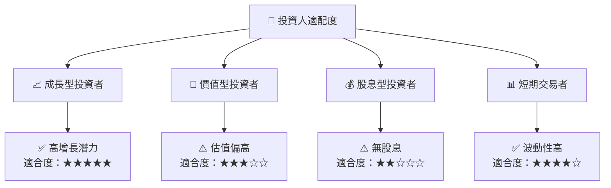

### 10.5 關鍵監控指標

| 監控類型 | 指標 | 關注點 | 頻率 |
|----------|------|--------|------|
| 市場動向 | 全球電動車銷量 | 市場需求變化 | 季度 |
| 財務健康 | 自由現金流 | 現金流穩定性 | 季度 |
| 技術進步 | 自動駕駛技術 | 技術突破與商業化 | 半年 |
| 競爭動態 | 市場份額 | 競爭對手動向 | 年度 |

---

> **免責聲明**：本報告為 AI 自動生成，僅供研究參考，不構成投資建議。投資有風險，入市需謹慎。