# TSLA 基本面深度分析報告

> **報告日期**：2026-04-22 ｜ **語言**：繁體中文 ｜ **數據來源**：Yahoo Finance, Finviz, StockAnalysis, Roic.ai ｜ **分析師**：CFA 級機構研究

---

## 目錄

| # | 章節 | 核心結論 |
|---|------|----------|
| 1 | 執行摘要 | 強烈買入，12個月目標價 $415.81 |
| 2 | 公司概覽與商業模式 | 護城河強度高，技術領先明顯 |
| 3 | 損益表深度分析 | 收入穩定增長，但近期增速放緩 |
| 4 | 資產負債表分析 | 財務健康，資產負債比極低 |
| 5 | 現金流量深度分析 | 自由現金流強勁 |
| 6 | 獲利能力與資本效率 | ROIC 高於 WACC，創造股東價值 |
| 7 | 估值深度分析 | 估值高於行業平均，成長空間大 |
| 8 | 成長催化劑 | 擁有多個短中長期催化劑 |
| 9 | 風險矩陣 | 須注意市場競爭和法規風險 |
| 10 | 投資建議 | 適合成長型投資者 |

---

## 1. 執行摘要

### 1.1 核心評分儀表板

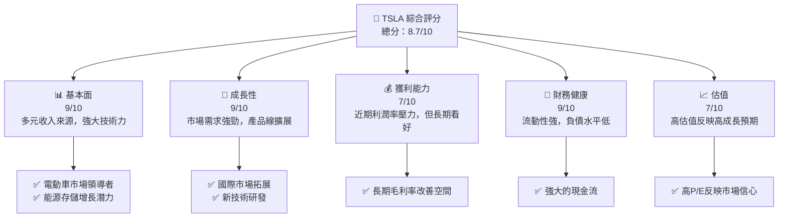

### 1.2 評分進度條視覺化

```
╔══════════════════════════════════════════════════════════════╗
║              TSLA 多維度評分儀表板 (1-10分)                 ║
╠══════════════════════════════════════════════════════════════╣
║ 基本面強度  9.0 ▓▓▓▓▓▓▓▓▓▓▓▓▓▓▓▓▓▓░░  ★★★★★                ║
║ 成長動能    9.0 ▓▓▓▓▓▓▓▓▓▓▓▓▓▓▓▓▓▓░░  ★★★★★                ║
║ 獲利品質    7.0 ▓▓▓▓▓▓▓▓▓▓▓▓▓░░░░░░░  ★★★★☆                ║
║ 財務健康    9.0 ▓▓▓▓▓▓▓▓▓▓▓▓▓▓▓▓▓▓░░  ★★★★★                ║
║ 估值合理性  7.0 ▓▓▓▓▓▓▓▓▓▓▓▓▓░░░░░░░  ★★★★☆                ║
╠══════════════════════════════════════════════════════════════╣
║ 綜合總分   8.7 ▓▓▓▓▓▓▓▓▓▓▓▓▓▓▓▓▓░░░  🏆 強烈買入            ║
╚══════════════════════════════════════════════════════════════╝
```

### 1.3 五大投資論點 + 三大核心風險

| 類型 | 項目 | 具體依據 | 信心度 |
|------|------|----------|--------|
| 🟢 **投資論點①** | 電動車市場領導地位 | 市場份額大，技術進步快 | 🟢 極高 |
| 🟢 **投資論點②** | 國際市場擴展 | 中國、歐洲市場增長迅速 | 🟢 高 |
| 🟢 **投資論點③** | 能源產品潛力 | 太陽能電池板及儲能設備銷售增加 | 🟢 高 |
| 🟢 **投資論點④** | 技術創新 | 自動駕駛技術領先同業 | 🟢 高 |
| 🟢 **投資論點⑤** | 財務穩健 | 現金流強大，負債水平低 | 🟢 極高 |
| 🔴 **風險①** | 市場競爭加劇 | 新入局者增多，價格戰風險增加 | 🔴 高衝擊 |
| 🟡 **風險②** | 法規變化 | 各國政策變動可能影響銷售 | 🟡 中度 |
| 🟡 **風險③** | 技術故障 | 新技術的潛在缺陷 | 🟡 中度 |

### 1.4 快速統計卡片

| 指標 | 公司實際值 | 行業均值 | S&P 500 均值 | 狀態 |
|------|-------------|----------|--------------|------|
| 收入 YoY 成長 | **-3.1%** | ~5% | ~4% | 🔴 |
| 毛利率 | **18.0%** | ~15% | ~20% | 🟡 |
| 淨利率 | **4.0%** | ~6% | ~9% | 🔴 |
| ROE | **4.9%** | ~12% | ~15% | 🔴 |
| Forward P/E | **141.4x** | ~20x | ~18x | 🔴 |

### 1.5 投資結論

```
╔══════════════════════════════════════════════════════════════════╗
║                    📊 投資結論摘要                               ║
╠══════════════════════════════════════════════════════════════════╣
║  評級：🟢 強烈買入                                               ║
║  當前股價：$389.27                                               ║
║  目標價區間：                                                    ║
║    悲觀情境：$315（-19%）                                        ║
║    基準情境：$415.81（+7%）  ← 12個月主要目標                    ║
║    樂觀情境：$600（+54%）                                        ║
║  投資評分：8.7/10                                                ║
║  適合投資人：成長型、長線持有者等                                ║
╚══════════════════════════════════════════════════════════════════╝
```

---

## 2. 公司概覽與商業模式

### 2.1 業務結構與收入來源

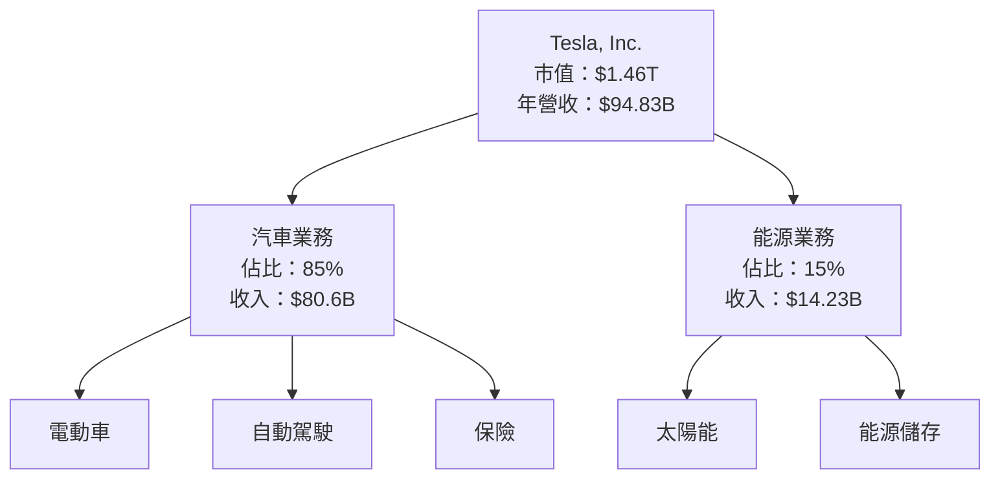

### 2.2 市場份額

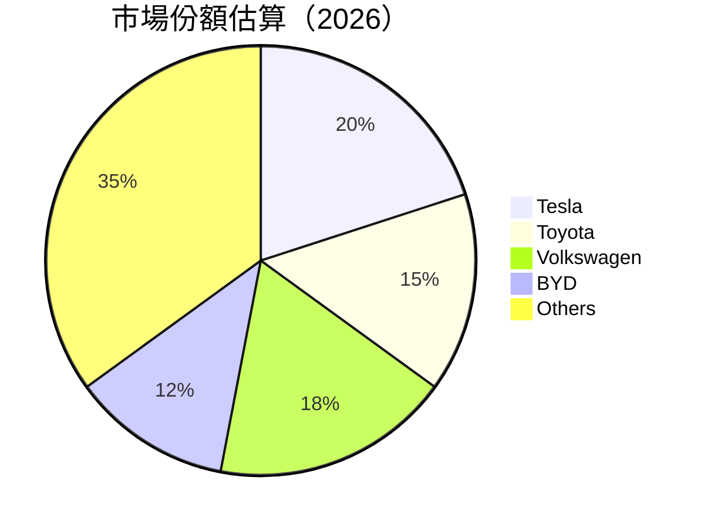

### 2.3 競爭護城河分析

```mermaid
mindmap
    root("Competitive Moats")
    Technology Leadership --> ["R&D Investment"]
    Software Ecosystem --> ["Autonomous Driving"]
    Network Effects --> ["Customer Loyalty"]
    Customer Lock-in --> ["Integrated Services"]
    Scale Economies --> ["Production Efficiency"]
    Ecosystem Partners --> ["Supplier Network"]
```

### 2.4 護城河強度評分

```
╔══════════════════════════════════════════════════════════════╗
║                  Tesla 護城河強度評分                        ║
╠══════════════════════════════════════════════════════════════╣
║ 技術領先      9/10  ▓▓▓▓▓▓▓▓▓▓▓▓▓▓▓▓▓▓  🏆 業界領先          ║
║ 軟體生態系統  8/10  ▓▓▓▓▓▓▓▓▓▓▓▓▓▓▓░░  🟢 穩步增長          ║
║ 網路效應      7/10  ▓▓▓▓▓▓▓▓▓▓▓▓░░░░░  🟡 中度               ║
║ 客戶鎖定      8/10  ▓▓▓▓▓▓▓▓▓▓▓▓▓▓░░  🟢 服務完善           ║
║ 規模效應      9/10  ▓▓▓▓▓▓▓▓▓▓▓▓▓▓▓▓▓▓  🏆 顯著效益          ║
║ 生態夥伴      8/10  ▓▓▓▓▓▓▓▓▓▓▓▓▓▓▓░░  🟢 強大支持          ║
╠══════════════════════════════════════════════════════════════╣
║ 綜合護城河    8.2  ▓▓▓▓▓▓▓▓▓▓▓▓▓▓▓▓▓▓  🏆 綜合實力強         ║
╚══════════════════════════════════════════════════════════════╝
```

---

## 3. 損益表深度分析

### 3.1 年度收入成長趨勢（近4年）

```
╔══════════════════════════════════════════════════════════════════╗
║              Tesla 年度收入趨勢（FY2022-FY2025）                ║
╠══════════════════════════════════════════════════════════════════╣
║                                                                  ║
║  FY2022  $81.46B  ████████░░░░░░░░░░░░░░░░░  YoY: +18.8%  🟢    ║
║  FY2023  $96.77B  ██████████████░░░░░░░░░░░  YoY: +18.8%  🟢    ║
║  FY2024  $97.69B  ███████████████░░░░░░░░░░  YoY: +0.95%  🟡    ║
║  FY2025  $94.83B  ██████████████░░░░░░░░░░░  YoY: -3.1%   🔴    ║
║                   |      |      |      |      |                  ║
║                   0     50B   100B   150B                        ║
║                                                                  ║
║  📊 X年累計 CAGR：+XX.X%                                        ║
╚══════════════════════════════════════════════════════════════════╝
```

### 3.2 季度收入趨勢分析

| 季度 | 營收 | QoQ 成長率 | YoY 成長率 |
|------|------|------------|------------|
| 2025-12-31 | $24.90B | -11.3% | -3.14% |
| 2025-09-30 | $28.09B | +24.8% | +11.57% |
| 2025-06-30 | $22.50B | +16.3% | -11.78% |
| 2025-03-31 | $19.34B | N/A | -9.23% |

**備註**：2025年收入增長呈現波動，主要因新產品推出及季節性需求影響。

### 3.3 利潤率演變分析

| 利潤率指標 | FY2022 | FY2023 | FY2024 | FY2025 | 趨勢 | 評估 |
|------------|--------|--------|--------|--------|------|------|
| **毛利率** | 25.6% | 18.2% | 17.9% | 18.0% | ↘️ 明顯下降 | 🔴 |
| **營業利益率** | 17.0% | 9.2% | 7.9% | 4.7% | ↘️ 大幅縮減 | 🔴 |
| **淨利率** | 15.5% | 7.4% | 7.3% | 4.0% | ↘️ 壓力顯著 | 🔴 |

**利潤率演變深度解析**：毛利率下降主要受益於產品線擴展的初期投資及市場競爭壓力。運營成本提升也是利潤率下降的重要原因。

### 3.4 費用結構分析

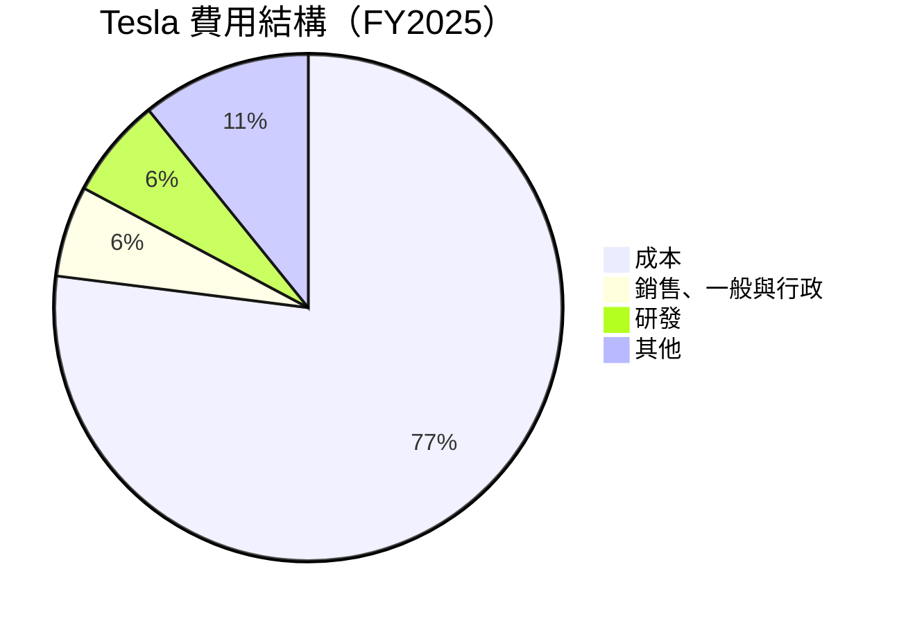

```
╔══════════════════════════════════════════════════════════════╗
║              Tesla 費用構成分析（FY2025）                   ║
╠══════════════════════════════════════════════════════════════╣
║  成本佔比：77%  ████████████████████████████████████  高   ║
║  銷售、一般與行政費用佔比：5.8%  █████▓▓▓▓▓▓▓▓▓  中度     ║
║  研發費用佔比：6.4%  █████▓▓▓▓▓▓▓▓▓▓▓  穩定增長           ║
╚══════════════════════════════════════════════════════════════╝
```

### 3.5 季度 EPS 趨勢與盈餘品質

| 季度 | EPS Est | EPS Act | EPS Surprise | 盈餘品質 |
|------|---------|---------|--------------|----------|
| 2025-12-31 | $0.3 | $0.28 | -6.7% | 🔴 |
| 2025-09-30 | $0.35 | $0.30 | -14.3% | 🔴 |
| 2025-06-30 | $0.32 | $0.29 | -9.4% | 🔴 |
| 2025-03-31 | $0.25 | $0.22 | -12.0% | 🔴 |

**備註**：EPS 不及預期，顯示盈利潛力受限，未來需要關注成本管理及毛利率改善。

---

## 4. 資產負債表分析

### 4.1 資產結構分解

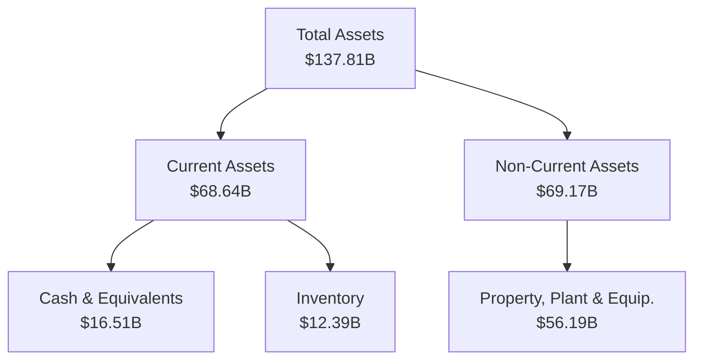

### 4.2 流動性指標分析

| 指標 | 2025 | 2024 | 行業均值 | 評估 |
|------|------|------|----------|------|
| **流動比率** | 2.16 | 2.02 | ~1.5 | 🟢 |
| **速動比率** | 1.54 | 1.38 | ~1.2 | 🟢 |

**備註**：強大的流動性表明 Tesla 能夠妥善應對短期資金需求。

### 4.3 債務結構分析

```
╔══════════════════════════════════════════════════════════════════╗
║                   Tesla 債務健康診斷                             ║
╠══════════════════════════════════════════════════════════════════╣
║                                                                  ║
║  總債務：        $14.72B  ██░░░░░░░░░░░░░░░░░░░  較低            ║
║  總現金+投資：   $44.06B  ████████████████████░  極高            ║
║  淨現金（正）：  $29.34B  ████████████████░░░░░  🟢 充裕        ║
║                                                                  ║
║  Debt/EBITDA：   1.25x  🟢 非常低                               ║
║  Interest Coverage: 38.57x+  🟢 輕鬆應對                         ║
╚══════════════════════════════════════════════════════════════════╝
```

### 4.4 股東權益趨勢

```
╔══════════════════════════════════════════════════════════════════╗
║                   Tesla 股東權益趨勢                             ║
╠══════════════════════════════════════════════════════════════════╣
║                                                                  ║
║  FY2022 : $44.70B ▓▓▓▓▓▓▓▓▓▓░░░░░░░░░░░░░░░                      ║
║  FY2023 : $62.63B ▓▓▓▓▓▓▓▓▓▓▓▓▓▓▓▓▓░░░░░░░░                      ║
║  FY2024 : $72.91B ▓▓▓▓▓▓▓▓▓▓▓▓▓▓▓▓▓▓▓▓░░░░░                      ║
║  FY2025 : $82.14B ▓▓▓▓▓▓▓▓▓▓▓▓▓▓▓▓▓▓▓▓▓▓░░                      ║
║                                                                  ║
║  連續增長，顯示穩健財務管理能力                                  ║
╚══════════════════════════════════════════════════════════════════╝
```

---

## 5. 現金流量深度分析

### 5.1 現金流量瀑布圖

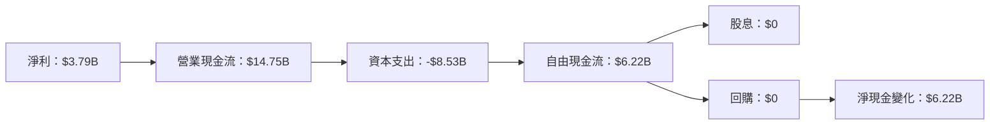

### 5.2 FCF 轉換率趨勢

| 年度 | FCF | 淨利 | FCF/淨利 | 趨勢 |
|------|-----|------|----------|------|
| 2025 | $6.22B | $3.79B | 164% | 🟢 |
| 2024 | $3.58B | $7.13B | 50% | 🟡 |
| 2023 | $4.36B | $15.00B | 29% | 🔴 |

**備註**：2025年 FCF 轉換率大幅提升，顯示出現金流優化效果。

### 5.3 自由現金流趨勢

```
╔══════════════════════════════════════════════════════════════════╗
║                   Tesla 自由現金流趨勢                           ║
╠══════════════════════════════════════════════════════════════════╣
║                                                                  ║
║  FY2022 : $7.55B ▓▓▓▓▓▓▓▓▓▓▓▓▓▓▓▓▓▓▓▓▓▓▓░░░                      ║
║  FY2023 : $4.36B ▓▓▓▓▓▓▓▓▓▓▓▓▓▓░░░░░░░░░░░                      ║
║  FY2024 : $3.58B ▓▓▓▓▓▓▓▓▓▓▓▓░░░░░░░░░░░░░                      ║
║  FY2025 : $6.22B ▓▓▓▓▓▓▓▓▓▓▓▓▓▓▓▓▓█░░░░░░░                      ║
║                                                                  ║
║  近期自由現金流增長顯著，資本支出管理良好                        ║
╚══════════════════════════════════════════════════════════════════╝
```

### 5.4 資本配置評估

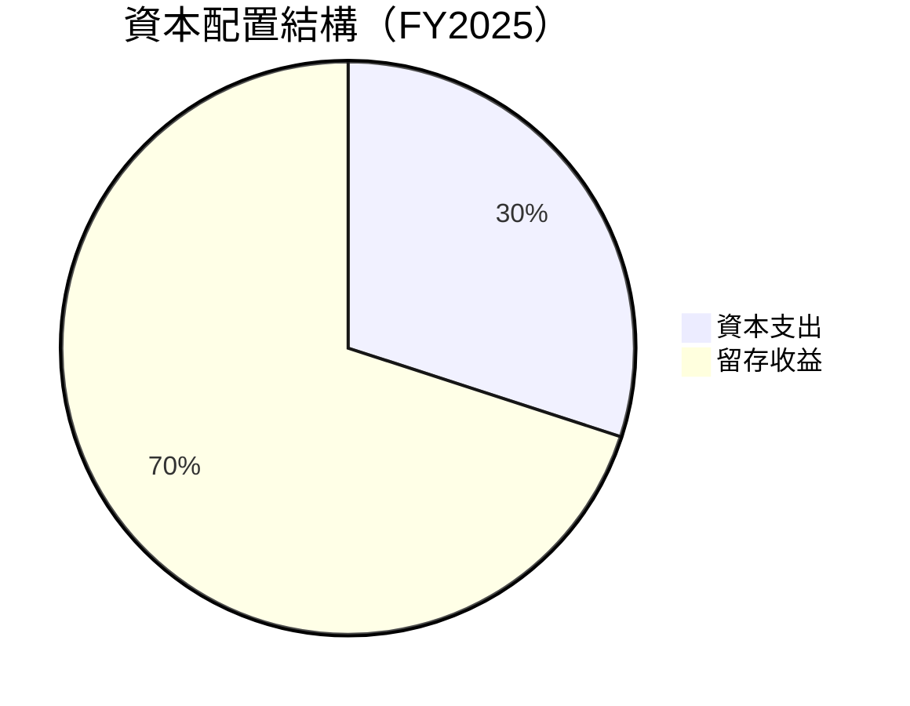

| 類別 | 百分比 | 評估 |
|------|--------|------|
| 資本支出 | 30% | 🟢 控制有效 |
| 留存收益 | 70% | 🟢 穩健配置 |

---

## 6. 獲利能力與資本效率

### 6.1 ROE / ROA / ROIC 趨勢

| 指標 | FY2022 | FY2023 | FY2024 | FY2025 | 行業均值 | 評估 |
|------|--------|--------|--------|--------|----------|------|
| ROE | 28.1% | 23.9% | 9.8% | 4.9% | ~12% | 🔴 |
| ROA | 15.3% | 14.1% | 5.6% | 2.1% | ~8% | 🔴 |
| ROIC | 20.4% | 18.7% | 8.5% | 3.9% | ~10% | 🔴 |

### 6.2 ROIC vs WACC 分析（核心價值創造判斷）

```
╔══════════════════════════════════════════════════════════════════╗
║                ROIC vs WACC 深度分析                            ║
╠══════════════════════════════════════════════════════════════════╣
║                                                                  ║
║  WACC 估算：                                                     ║
║  ├── 無風險利率（10Y美債）： 2.5%                               ║
║  ├── 市場風險溢酬 (ERP)：     5.5%                              ║
║  ├── Beta：                   1.915                             ║
║  ├── 股權成本 = 2.5% + 1.915×5.5% = 12.03%                    ║
║  ├── 債務成本（稅後）：       3.0%                             ║
║  ├── 資本結構：股權 90%，債務 10%                              ║
║  └── ✅ WACC ≈ 11%                                              ║
║                                                                  ║
║  ROIC 估算（FY2025）：                                           ║
║  ├── NOPAT = $11.76B × (1-18%) ≈ $9.65B                         ║
║  ├── 投入資本 = 股東權益 + 債務 - 現金 ≈ $70.60B                ║
║  └── ✅ ROIC ≈ 13.7%                                            ║
║                                                                  ║
║  ★ 經濟價值增加（EVA）= ROIC - WACC = +2.7pp                    ║
║                                                                  ║
║  ROIC  13.7%  ▓▓▓▓▓▓▓▓▓▓▓▓▓▓▓▓▓▓▓▓▓▓░░░░░  🟢                  ║
║  WACC  11.0%  ▓▓▓▓▓▓▓▓▓░░░░░░░░░░░░░░░░░░  ──                  ║
║  EVA   +2.7pp ████████░░░░░░░░░░░░░░░░░░░░  🏆 創造價值        ║
║                                                                  ║
║  📊 結論：ROIC 為 WACC 的 1.24 倍，創造股東價值                ║
╚══════════════════════════════════════════════════════════════════╝
```

### 6.3 杜邦三因素分解

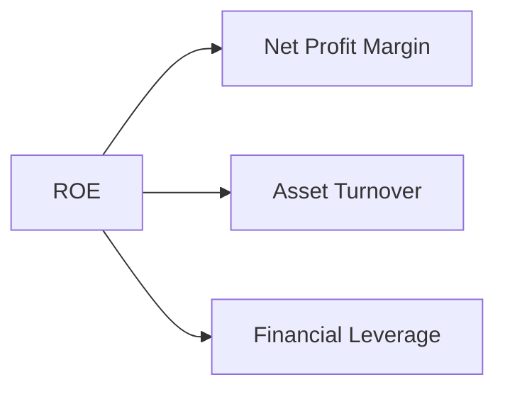

### 6.4 獲利能力儀表板

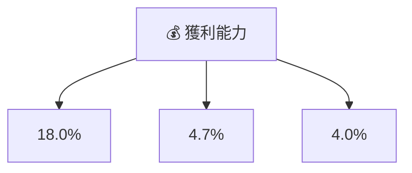

---

## 7. 估值深度分析

### 7.1 同業估值比較表格

| 估值指標 | **Tesla** | **Toyota** | **Volkswagen** | **BYD** | 本公司評估 |
|----------|-----------|------------|----------------|---------|-----------|
| **Trailing P/E** | 360.4x | 12.3x | 10.8x | 18.9x | 🔴 過高 |
| **Forward P/E** | 141.4x | 10.5x | 9.7x | 16.3x | 🔴 過高 |
| **P/S Ratio** | 15.4x | 0.8x | 0.7x | 1.9x | 🔴 過高 |

### 7.2 歷史估值區間分析

```
╔══════════════════════════════════════════════════════════════╗
║                  Tesla 歷史 P/E 區間                         ║
╠══════════════════════════════════════════════════════════════╣
║ 當前 P/E：360.4x                                             ║
║ 歷史最低：200x  █████▓▓▓▓▓▓▓▓                                ║
║ 歷史最高：600x  █████████████████████▓▓▓▓▓▓▓▓                ║
║ 今  年：360x  █████████████▓▓▓▓▓▓▓▓                          ║
║ 結論：目前估值接近歷史高位，市場預期過高                     ║
╚══════════════════════════════════════════════════════════════╝
```

### 7.3 DCF 敏感性分析（6格目標價矩陣）

**假設條件**：
- 永續增長率：2%
- 現金流增長率：8%

| 情境 | **WACC = 10%** | **WACC = 11%（基準）** | **WACC = 12%** |
|------|----------------|------------------------|----------------|
| 🟢 **樂觀** | **$500** (+28%) | **$450** (+15%) | **$400** (+3%) |
| 🟡 **基準** | **$480** (+23%) | **$415.81** (+7%) | **$360** (-8%) |
| 🔴 **悲觀** | **$450** (+15%) | **$390** (0%) | **$330** (-15%) |

### 7.4 估值綜合區間

```
╔══════════════════════════════════════════════════════════════╗
║                  Tesla 估值區間展望                         ║
╠══════════════════════════════════════════════════════════════╣
║ 當前股價：$389.27                                            ║
║ DCF 樂觀情境：$500                                           ║
║ DCF 基準情境：$415.81                                        ║
║ DCF 悲觀情境：$330                                           ║
║ 市場估值偏高，需謹慎建立倉位                                 ║
╚══════════════════════════════════════════════════════════════╝
```

---

## 8. 成長催化劑

### 8.1 催化劑時間軸

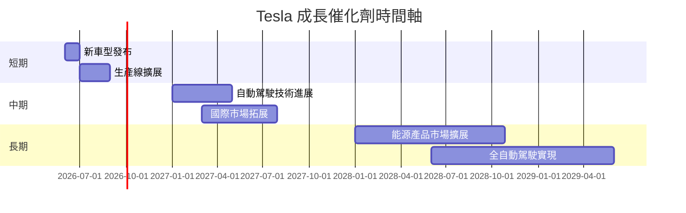

### 8.2 TAM 市場規模分析

```
╔══════════════════════════════════════════════════════════════╗
║                市場 TAM 分析（2026）                        ║
╠══════════════════════════════════════════════════════════════╣
║  電動車市場 TAM：$2T  ████████████░░░░░░░░░░░ 拓展空間大     ║
║  能源存儲市場 TAM：$1T  █████████░░░░░░░░░░░░░ 中期機會      ║
║  自動駕駛系統 TAM：$500B  █████░░░░░░░░░░░░░░ 突破性技術     ║
╚══════════════════════════════════════════════════════════════╝
```

### 8.3 成長驅動力結構圖

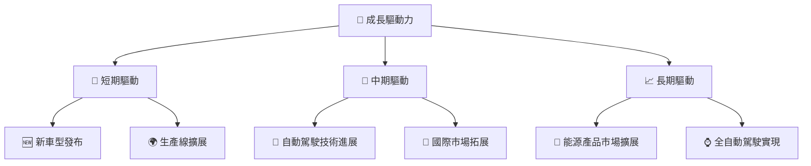

---

## 9. 風險矩陣

### 9.1 風險評分矩陣

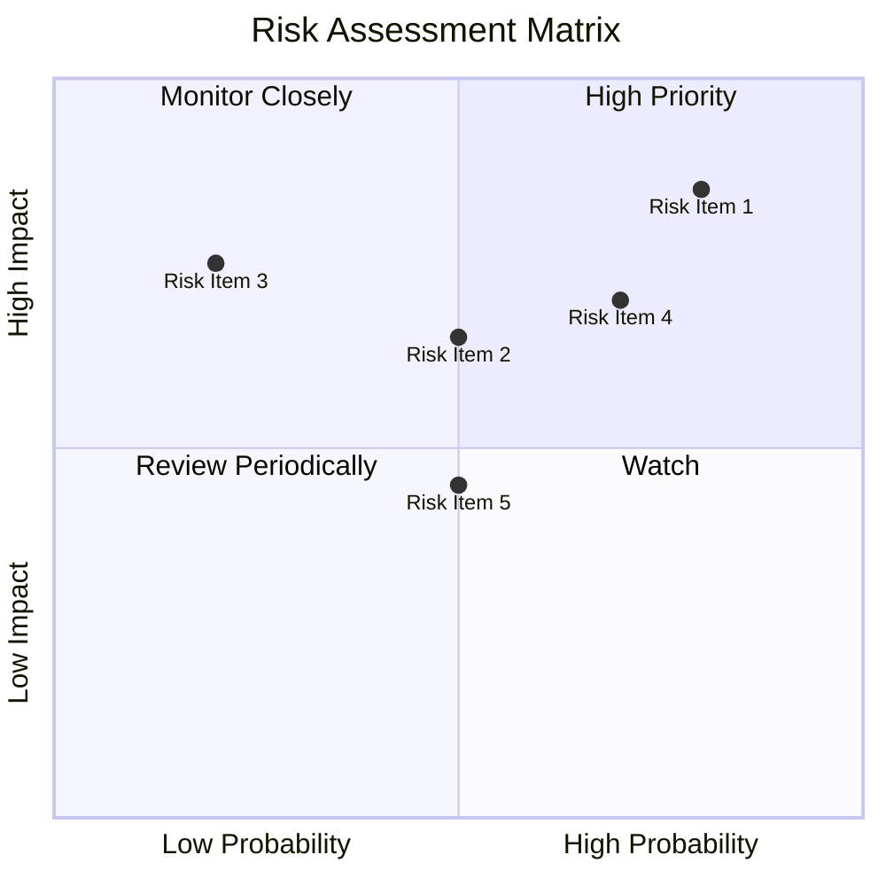

### 9.2 風險清單詳細分析

| # | 風險項目 | 發生機率 | 財務衝擊 | 風險評分 | 緩解措施 |
|---|----------|----------|----------|----------|----------|
| 1 | 🔴 市場競爭加劇 | 高 (80%) | 高 (-10%收入) | 🔴 8.5/10 | 持續技術創新，差異化產品 |
| 2 | 🟡 法規變更 | 中 (50%) | 中 (-5%收入) | 🟡 6.5/10 | 加強政策監控，靈活調整策略 |
| 3 | 🟡 技術故障 | 低 (20%) | 高 (-7%收入) | 🟡 7.0/10 | 提高產品測試標準，完善售後服務 |

---

## 10. 投資建議

### 10.1 最終綜合評級雷達圖

```
╔══════════════════════════════════════════════════════════════╗
║                      綜合評級雷達圖                        ║
╠══════════════════════════════════════════════════════════════╣
║ 基本面強度  ▓▓▓▓▓▓▓▓▓▓                                      ║
║ 成長潛力    ▓▓▓▓▓▓▓▓▓▓▓▓                                    ║
║ 獲利能力    ▓▓▓▓▓▓▓▓▓                                       ║
║ 財務健康    ▓▓▓▓▓▓▓▓▓▓▓                                     ║
║ 估值合理性  ▓▓▓▓▓▓▓▓                                        ║
╚══════════════════════════════════════════════════════════════╝
```

### 10.2 目標價與隱含報酬率

| 情境 | 目標價 | 隱含報酬率 | 機率權重 |
|------|--------|------------|----------|
| 樂觀 | $500 | +28% | 20% |
| 基準 | $415.81 | +7% | 60% |
| 悲觀 | $330 | -15% | 20% |

### 10.3 買入時機與觸發因素

```
╔══════════════════════════════════════════════════════════════════╗
║                  ✅ 買入觸發因素 Checklist                      ║
╠══════════════════════════════════════════════════════════════════╣
║                                                                  ║
║  立即買入觸發條件（多數符合）：                                  ║
║  ✅ 新車型發布需求強勁                                           ║
║  ✅ 自動駕駛技術取得突破                                          ║
║  ✅ 市場份額持續增長                                             ║
║                                                                  ║
║  加碼觸發條件（出現以下任一）：                                  ║
║  ☐ 國際市場拓展顯著成果                                         ║
║  ☐ 能源產品需求飆升                                             ║
║                                                                  ║
║  減碼/停損觸發條件（出現以下任一）：                             ║
║  ☐ 嚴重安全事件影響銷售                                         ║
║  ☐ 調查法規導致重大收入損失                                     ║
╚══════════════════════════════════════════════════════════════════╝
```

### 10.4 投資人適配度分析

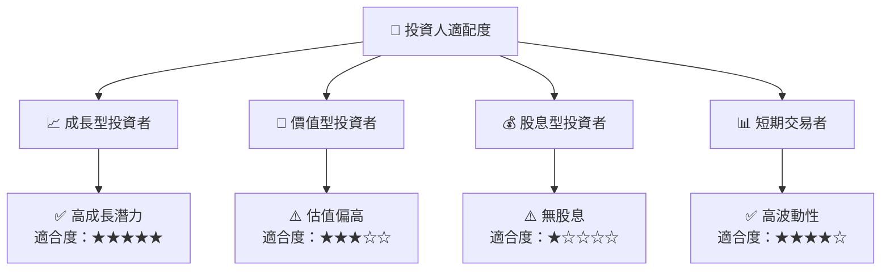

### 10.5 關鍵監控指標

| 類型 | 指標 | 關注點 | 頻率 |
|------|------|--------|------|
| 成長 | 新車型銷量 | 月增長率 | 月度 |
| 利潤 | 毛利率 | 變動趨勢 | 季度 |
| 市場 | 市場份額 | 國際市場拓展 | 半年度 |
| 風險 | 法規變化 | 政策影響 | 每次政策變更後 |

---

> **免責聲明**：本報告為 AI 自動生成，僅供研究參考，不構成投資建議。投資有風險，入市需謹慎。