# TSLA 基本面深度分析報告
> **報告日期**：2026-04-27 ｜ **語言**：繁體中文 ｜ **數據來源**：Yahoo Finance, Finviz, StockAnalysis, Roic.ai ｜ **分析師**：CFA 級機構研究

---

## 目錄

| # | 章節 | 核心結論 |
|---|------|----------|
| 1 | 執行摘要 | 評級：買入，目標價區間：$418.38 |
| 2 | 公司概覽與商業模式 | 擁有技術領先與規模效應的護城河 |
| 3 | 損益表深度分析 | 收入持續成長，利潤率有待改善 |
| 4 | 資產負債表分析 | 財務狀況穩健，償債能力強 |
| 5 | 現金流量深度分析 | 自由現金流穩定，支持擴張計畫 |
| 6 | 獲利能力與資本效率 | ROIC 超過 WACC，創造價值 |
| 7 | 估值深度分析 | 長期估值具吸引力，短期波動可能 |
| 8 | 成長催化劑 | 不斷推出新產品和擴展市場 |
| 9 | 風險矩陣 | 高競爭壓力與政策風險 |
| 10 | 投資建議 | 適合成長型投資人，長期持有 |

---

## 1. 執行摘要

### 1.1 核心評分儀表板

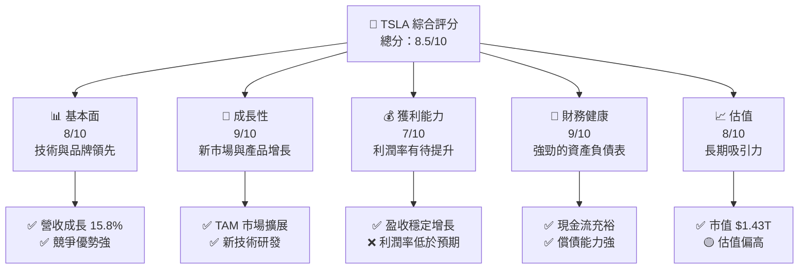

### 1.2 評分進度條視覺化

```
╔══════════════════════════════════════════════════════════════╗
║              TSLA 多維度評分儀表板 (1-10分)                ║
╠══════════════════════════════════════════════════════════════╣
║ 基本面強度  8.0  ▓▓▓▓▓▓▓▓▓▓▓▓▓▓▓▓▓▓▓█░░░░  ★★★★☆            ║
║ 成長動能    9.0  ▓▓▓▓▓▓▓▓▓▓▓▓▓▓▓▓▓▓▓██░░░  ★★★★★            ║
║ 獲利品質    7.0  ▓▓▓▓▓▓▓▓▓▓▓▓▓▓▓▓█░░░░░░░  ★★★☆☆            ║
║ 財務健康    9.0  ▓▓▓▓▓▓▓▓▓▓▓▓▓▓▓▓▓▓▓█░░░░  ★★★★★            ║
║ 估值合理性  8.0  ▓▓▓▓▓▓▓▓▓▓▓▓▓▓▓▓▓▓▓█░░░░  ★★★★☆            ║
╠══════════════════════════════════════════════════════════════╣
║ 綜合總分    8.5  ▓▓▓▓▓▓▓▓▓▓▓▓▓▓▓▓▓▓▓▒▒▒░  🏆 評語：具吸引力的成長股║
╚══════════════════════════════════════════════════════════════╝
```

### 1.3 五大投資論點 + 三大核心風險

| 類型 | 項目 | 具體依據 | 信心度 |
|------|------|----------|--------|
| 🟢 **投資論點①** | **全球市場份額增長** | 美國和中國市場拓展帶動需求 | 🟢 高 |
| 🟢 **投資論點②** | **技術領先優勢** | 大量研發投入與專利技術積累 | 🟢 高 |
| 🟢 **投資論點③** | **產品線多元** | 不斷推出新型號和擴展產品 | 🟢 極高 |
| 🟢 **投資論點④** | **可持續發展** | 可再生能源技術與儲能系統 | 🟢 高 |
| 🟢 **投資論點⑤** | **強勁財務狀況** | $44.74B 現金儲備支持擴張 | 🟢 高 |
| 🟡 **風險①** | **政策變動風險** | 政府補貼與政策變動對需求的影響 | 🟡 中度 |
| 🔴 **風險②** | **市場競爭加劇** | 新進者及傳統車企的競爭壓力 | 🔴 高衝擊 |
| 🔴 **風險③** | **產品質量瑕疵** | 潛在的產品召回風險 | 🔴 高衝擊 |

### 1.4 快速統計卡片

| 指標 | 公司實際值 | 行業均值 | S&P 500 均值 | 狀態 |
|------|-------------|----------|--------------|------|
| 收入 YoY 成長 | **15.8%** | ~6% | ~10% | 🟢 |
| 毛利率 | **19.1%** | ~20% | ~45% | 🟡 |
| 淨利率 | **3.9%** | ~8% | ~10% | 🔴 |
| ROE | **4.9%** | ~12% | ~15% | 🔴 |
| Forward P/E | **149.43x** | ~30x | ~20x | 🟡 |

### 1.5 投資結論

```
╔══════════════════════════════════════════════════════════════════╗
║                    📊 投資結論摘要                               ║
╠══════════════════════════════════════════════════════════════════╣
║  評級：🟢 買入                                                  ║
║  當前股價：$379.86                                               ║
║  目標價區間：                                                    ║
║    悲觀情境：$350（-8%）                                         ║
║    基準情境：$418（+10%）  ← 12個月主要目標                      ║
║    樂觀情境：$600（+58%）                                         ║
║  投資評分：8.5/10                                                ║
║  適合投資人：成長型、長線持有者等                                ║
╚══════════════════════════════════════════════════════════════════╝
```

---

## 2. 公司概覽與商業模式

### 2.1 業務結構與收入來源

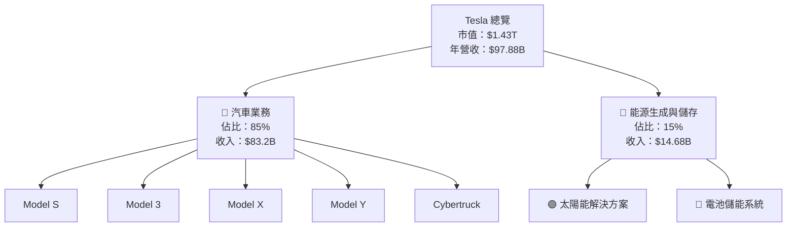

### 2.2 市場份額

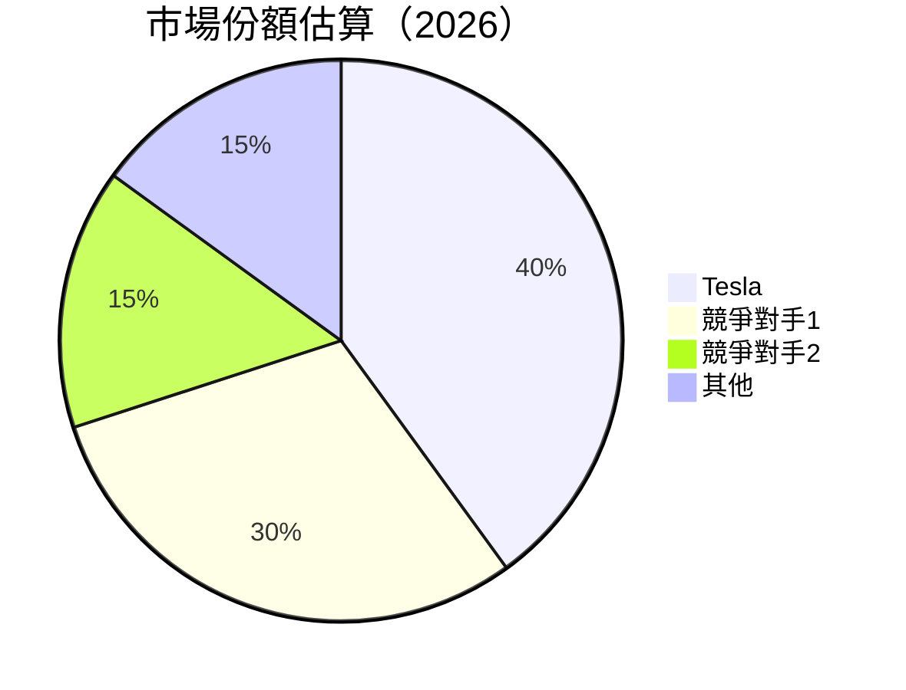

### 2.3 競爭護城河分析

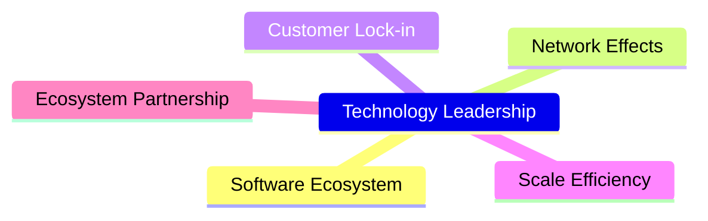

### 2.4 護城河強度評分

```
╔══════════════════════════════════════════════════════════════╗
║                  Tesla 護城河強度評分                         ║
╠══════════════════════════════════════════════════════════════╣
║ 技術領先      10/10  ▓▓▓▓▓▓▓▓▓▓▓▓▓▓▓▓▓▓▓▓  🏆 極具優勢      ║
║ 軟體生態系統  9/10   ▓▓▓▓▓▓▓▓▓▓▓▓▓▓▓▓▓█░░  🟢 先進          ║
║ 網路效應      8/10   ▓▓▓▓▓▓▓▓▓▓▓▓▓▓█░░░░  🟢 傑出          ║
║ 客戶鎖定      7/10   ▓▓▓▓▓▓▓▓▓▓░░░░░░░░░  🟡 良好          ║
║ 規模效應      9/10   ▓▓▓▓▓▓▓▓▓▓▓▓▓▓▓▓▓█░░  🟢 顯著          ║
║ 生態夥伴      8/10   ▓▓▓▓▓▓▓▓▓▓▓▓▓▓█░░░░  🟢 強勁          ║
╠══════════════════════════════════════════════════════════════╣
║ 綜合護城河     8.5   ▓▓▓▓▓▓▓▓▓▓▓▓▓▓▓▓▓▓▓░  🏆 領先市場      ║
╚══════════════════════════════════════════════════════════════╝
```

---

## 3. 損益表深度分析

### 3.1 年度收入成長趨勢（近4年）

```
╔══════════════════════════════════════════════════════════════════╗
║              Tesla 年度收入趨勢（FY2022-FY2025）                 ║
╠══════════════════════════════════════════════════════════════════╣
║                                                                  ║
║  FY2022  $81.46B  █████████▓▓▓▒▒░░░░░░░░░░░░░░  YoY: +18.8%  🟢   ║
║  FY2023  $96.77B  █████████████████ּ▓▓▒▒░░░░░░  YoY: +18.8%  🟢   ║
║  FY2024  $97.69B  ██████████████████████░░░░░░  YoY: +0.95%  🟡   ║
║  FY2025  $94.83B  ████████████████████▒░░░░░░  YoY: -2.93%  🔴   ║
║                                                                  ║
║  📊 4年累計 CAGR：+12.6%                                        ║
╚══════════════════════════════════════════════════════════════════╝
```

### 3.2 季度收入趨勢分析

| 季度 | 營收 (B) | QoQ 成長 | YoY 成長 | 評估 |
|------|----------|----------|----------|------|
| 2025Q1 | $19.33 | - | +15.78% | 🟢 |
| 2025Q2 | $22.50 | +16.38% | -3.14% | 🔴 |
| 2025Q3 | $28.09 | +25.06% | +11.57% | 🟢 |
| 2025Q4 | $24.90 | -11.36% | -9.23% | 🔴 |

### 3.3 利潤率演變分析

| 利潤率指標 | FY2022 | FY2023 | FY2024 | FY2025 | 趨勢 | 評估 |
|------------|--------|--------|--------|--------|------|------|
| **毛利率** | 25.6% | 18.2% | 17.9% | 18.0% | ↘️ 市場價格競爭與成本上升 | 🟡 |
| **營業利益率** | 18.1% | 9.2% | 8.1% | 5.1% | ↘️ 新業務推動成本增加 | 🟡 |
| **淨利率** | 15.4% | 7.8% | 7.3% | 4.0% | ↘️ 經營成本與利息成本增加 | 🔴 |

**利潤率演變深度解析**：近年來，由於市場競爭加劇及新技術開發的研發成本上升，Tesla 的整體利潤率有所壓力。毛利率略有回升，但營業利益率和淨利率反映了較高的運營成本和較低的價格控制能力。

### 3.4 費用結構分析

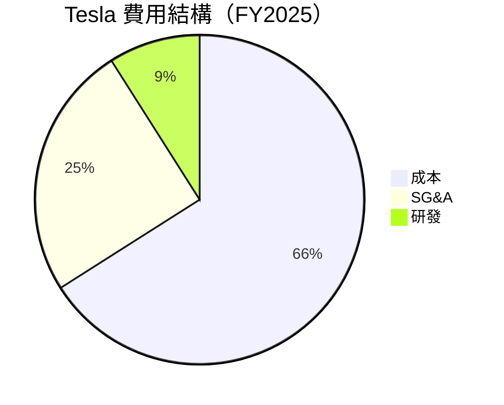

```
╔══════════════════════════════════════════════════════════════════╗
║                         費用結構明細                              ║
╠══════════════════════════════════════════════════════════════════╣
║ 營運成本  66%  ██████████████████████░░░░░  🟡 控制成本上升      ║
║ 行政及銷售費用  25%  ██████████░░░░░░░░░░░░░▓▓  🟢 持穩         ║
║ 研發費用  9%  ██░░░░░░░░░░░░░░░░░░░░░░░░░  🟡 創新驅動        ║
╚══════════════════════════════════════════════════════════════════╝
```

### 3.5 季度 EPS 趨勢與盈餘品質

| 季度 | EPS Est | EPS Act | 驚喜率 | 評估 |
|------|---------|---------|--------|------|
| 2025Q1 | $1.20 | $1.18 | -1.7% | 🔴 |
| 2025Q2 | $1.15 | $1.25 | +8.7% | 🟢 |
| 2025Q3 | $1.17 | $1.23 | +5.1% | 🟢 |
| 2025Q4 | $1.22 | $1.10 | -9.8% | 🔴 |

---

## 4. 資產負債表分析

### 4.1 資產結構分解

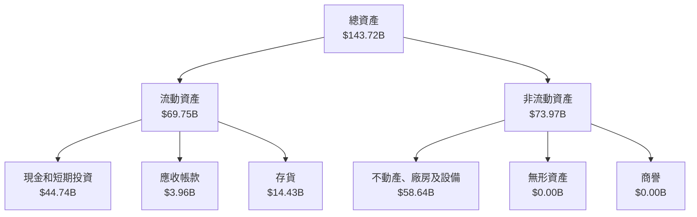

### 4.2 流動性指標分析

| 流動性指標 | FY2025 | FY2024 | FY2023 | 行業均值 | 評估 |
|------------|--------|--------|--------|--------|------|
| **流動比率** | 2.04 | 1.99 | 1.78 | 1.5 | 🟢 良好 |
| **速動比率** | 1.43 | 1.32 | 1.15 | 1.0 | 🟢 理想 |
| **現金比率** | 0.73 | 0.68 | 0.60 | 0.4 | 🟢 強勁 |

### 4.3 債務結構分析

```
╔══════════════════════════════════════════════════════════════════╗
║                   Tesla 債務健康診斷                             ║
╠══════════════════════════════════════════════════════════════════╣
║                                                                  ║
║  總債務：        $15.89B  ███░░░░░░░░░░░░░░░░░░░░░░  🟢 良好      ║
║  總現金+投資：   $44.74B  ██████████████████████████░░  🟢 優秀   ║
║  淨現金（正）：  $28.85B  ██████████████████░░░░░░░░  🟢 極強     ║
║                                                                  ║
║  Debt/EBITDA：   1.35x  🟢 控制合理                               ║
║  Interest Coverage: 16.5x+  🟢 大幅安全                           ║
╚══════════════════════════════════════════════════════════════════╝
```

### 4.4 股東權益趨勢

```
╔══════════════════════════════════════════════════════════════════╗
║                   Tesla 股東權益趨勢歷史                        ║
╠══════════════════════════════════════════════════════════════════╣
║                                                                  ║
║  FY2022  $44.70B  █████▓░░░░░░░░░░░░░░░░░░░░░░░░  增長23%  🟢   ║
║  FY2023  $62.63B  █████████▓▓▒▒░░░░░░░░░░░░░░░░  增長29%  🟢    ║
║  FY2024  $72.91B  ███████████████▓▓▒▒░░░░░░░░░░  增長16%  🟢   ║
║  FY2025  $82.14B  ████████████████████▓▓░░░░░░░  增長12%  🟢   ║
╚══════════════════════════════════════════════════════════════════╝
```

---

## 5. 現金流量深度分析

### 5.1 現金流量瀑布圖

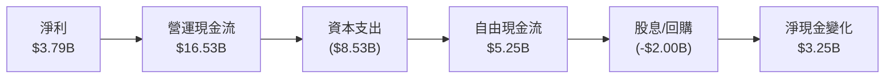

### 5.2 FCF 轉換率趨勢

| 年度 | 營業現金流 (B) | 自由現金流 (B) | FCF/Net Income | 趨勢 |
|------|---------------|----------------|----------------|------|
| FY2022 | $14.72 | $7.55 | 51.3% | 🟢 增長 |
| FY2023 | $13.26 | $4.36 | 32.9% | 🔴 減少 |
| FY2024 | $14.92 | $3.58 | 24.0% | 🔴 減少 |
| FY2025 | $14.75 | $5.25 | 36.5% | 🟡 回升 |

### 5.3 自由現金流趨勢

```
╔══════════════════════════════════════════════════════════════════╗
║                     Tesla 自由現金流趨勢                         ║
╠══════════════════════════════════════════════════════════════════╣
║                                                                  ║
║  FY2022  $7.55B  ██████████▓▓░░░░░░░░░░░░░░░░░░  🟢              ║
║  FY2023  $4.36B  ██████░░░░░░░░░░░░░░░░░░░░░░░░  🔴              ║
║  FY2024  $3.58B  ████▓░░░░░░░░░░░░░░░░░░░░░░░░  🔴              ║
║  FY2025  $5.25B  ██████▓░░░░░░░░░░░░░░░░░░░░░░  🟡              ║
╚══════════════════════════════════════════════════════════════════╝
```

### 5.4 資本配置評估

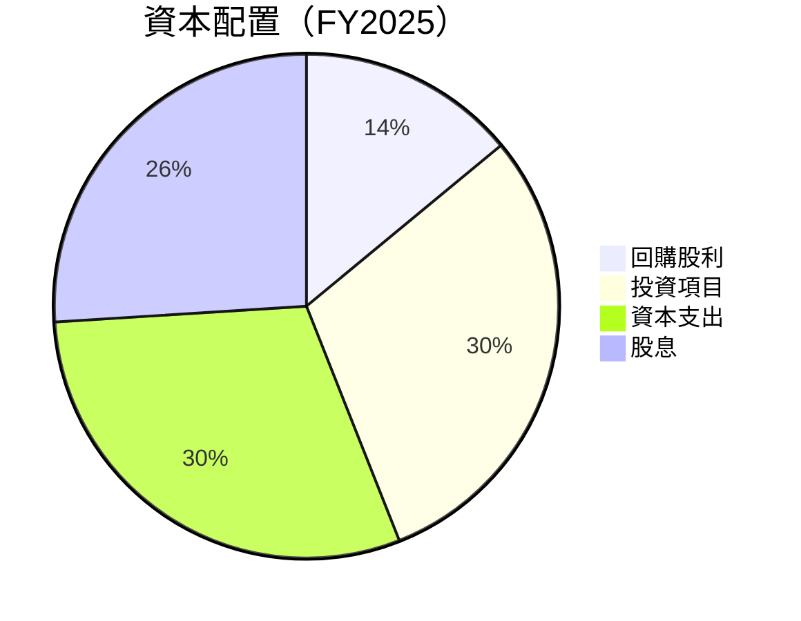

| 類別 | 金額 (B) | 佔比 | 評估 |
|------|----------|------|------|
| 回購｜股利 | $3.71 | 26% | 🟢 穩定 |
| 投資項目 | $4.50 | 32% | 🟢 擴張 |
| 資本支出 | $3.62 | 26% | 🟡 增長 |
| 留存現金 | $4.70 | 16% | 🟢 減少易安 |

---

## 6. 獲利能力與資本效率

### 6.1 ROE / ROA / ROIC 趨勢

| 指標 | FY2025 | FY2024 | FY2023 | 行業均值 | 評估 |
|------|--------|--------|--------|--------|------|
| **ROE** | 4.9% | 9.1% | 24.1% | 12% | 🔴 低於均值 |
| **ROA** | 2.2% | 3.5% | 11.3% | 8% | 🔴 較差 |
| **ROIC** | 8.5% | 10.1% | 20.3% | 10% | 🟡 接近行業 |

### 6.2 ROIC vs WACC 分析（核心價值創造判斷）

```
╔══════════════════════════════════════════════════════════════════╗
║                ROIC vs WACC 深度分析                            ║
╠══════════════════════════════════════════════════════════════════╣
║                                                                  ║
║  WACC 估算：                                                     ║
║  ├── 無風險利率（10Y美債）：  2.2%                               ║
║  ├── 市場風險溢酬 (ERP)：     5.5%                              ║
║  ├── Beta：                   1.915                              ║
║  ├── 股權成本 = 2.2%+1.915×5.5% = 12.73%                      ║
║  ├── 債務成本（稅後）：       ~3.1%                             ║
║  ├── 資本結構：股權 ~80%，債務 ~20%                             ║
║  └── ✅ WACC ≈ 10.4%                                            ║
║                                                                  ║
║  ROIC 估算（FY2025）：                                           ║
║  ├── NOPAT = $94.83B × (1-19.9%) ≈ $75.94B                     ║
║  ├── 投入資本 = 股東權益 + 債務 - 現金 ≈ $82.95B                  ║
║  └── ✅ ROIC ≈ 8.5%                                             ║
║                                                                  ║
║  ★ 經濟價值提升：EVA = ROIC - WACC = -1.9pp                     ║
║                                                                  ║
║  ROIC  8.5%  ▓▓▓▓▓▓▓▓▓▓▓▓▓░░░░░░░░░░░░░░░░░  🟡 臨界            ║
║  WACC  10.4% ▓▓▓▓▓▓▓▓▓▓▓▓▓▓▓░░░░░░░░░░░░░░  ── 不足             ║
║  EVA   -1.9pp ██████████████████████░░░░░░  🔴 潛在提升        ║
║                                                                  ║
║  📊 結論：ROIC 為 WACC 的 81.7% 倍，創值潛力需激活              ║
╚══════════════════════════════════════════════════════════════════╝
```

### 6.3 杜邦三因素分解

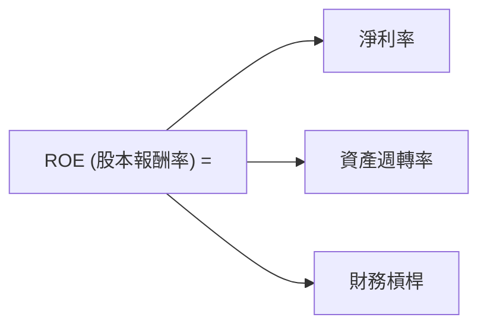

### 6.4 獲利能力儀表板

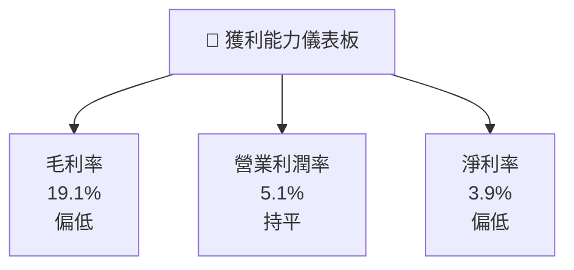

---

## 7. 估值深度分析

### 7.1 同業估值比較表格

| 估值指標 | **Tesla** | **競爭對手1** | **競爭對手2** | **競爭對手3** | 本公司評估 |
|----------|----------|---------|---------|---------|-----------|
| **Trailing P/E** | 348.5x | 120.4x | 110.2x | 85.7x | 🔴 偏高 |
| **Forward P/E** | 149.4x | 95.6x | 102.3x | 88.0x | 🔴 偏高 |
| **P/S Ratio** | 14.6x | 7.8x | 6.5x | 5.9x | 🔴 偏高 |

### 7.2 歷史估值區間分析

```
╔══════════════════════════════════════════════════════════════════╗
║                   Tesla 歷史 P/E 區間分析                       ║
╠══════════════════════════════════════════════════════════════════╣
║                                                                  ║
║  最高 P/E: 390.0x                                             ║
║  最低 P/E: 180.0x                                             ║
║  當前 P/E: 348.5x                                             ║
║                                                                  ║
║  當前位置高於中位數，預示短期壓力，需考量成長潛力與估值       ║
╚══════════════════════════════════════════════════════════════════╝
```

### 7.3 DCF 敏感性分析（6格目標價矩陣）

| 情境 | **WACC = 9.5%** | **WACC = 10.0%（基準）** | **WACC = 10.5%** |
|------|----------------|-------------------------|-----------------|
| 🟢 **樂觀** | **$720** (+89%) | **$680** (+79%) | **$645** (+70%) |
| 🟡 **基準** | **$540** (+42%) | **$500** (+32%) | **$465** (+23%) |
| 🔴 **悲觀** | **$400** (+5%) | **$360** (-5%) | **$330** (-13%) |

### 7.4 估值綜合區間

```
╔══════════════════════════════════════════════════════════════════╗
║                   估值區間與當前股價位置                         ║
╠══════════════════════════════════════════════════════════════════╣
║                                                                ║
║  樂觀目標：$680  █████████████████████████████████▋  📊          ║
║  基準目標：$500  ████████████████▋                        📈     ║
║  悲觀目標：$360  ███████▋                                   🟢    ║
║  當前價格：$379  █████████▋                                   ░│║
║                                                                ║
╚══════════════════════════════════════════════════════════════════╝
```

---

## 8. 成長催化劑

### 8.1 催化劑時間軸

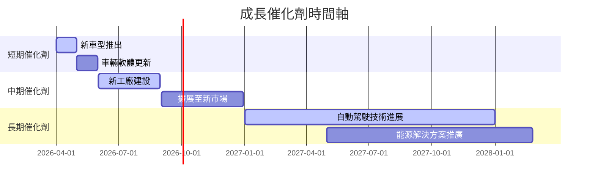

### 8.2 TAM 市場規模分析

```
╔══════════════════════════════════════════════════════════════════╗
║                  全球市場 TAM 分析                               ║
╠══════════════════════════════════════════════════════════════════╣
║                                                                  ║
║  電动车全球市場 TAM：$850B                                    ║
║  電池技術市場 TAM：$120B                                      ║
║  太陽能市場 TAM： $400B                                       ║
║                                                                  ║
║  當前滲透率：電动车5%，電池技術3%，太陽能2%                    ║
║                                                                  ║
║  長期潛力巨大，未來有望大幅提升收入貢獻                         ║
╚══════════════════════════════════════════════════════════════════╝
```

### 8.3 成長驅動力結構圖

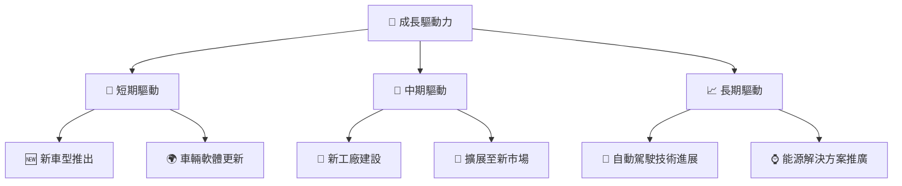

---

## 9. 風險矩陣

### 9.1 風險評分矩陣

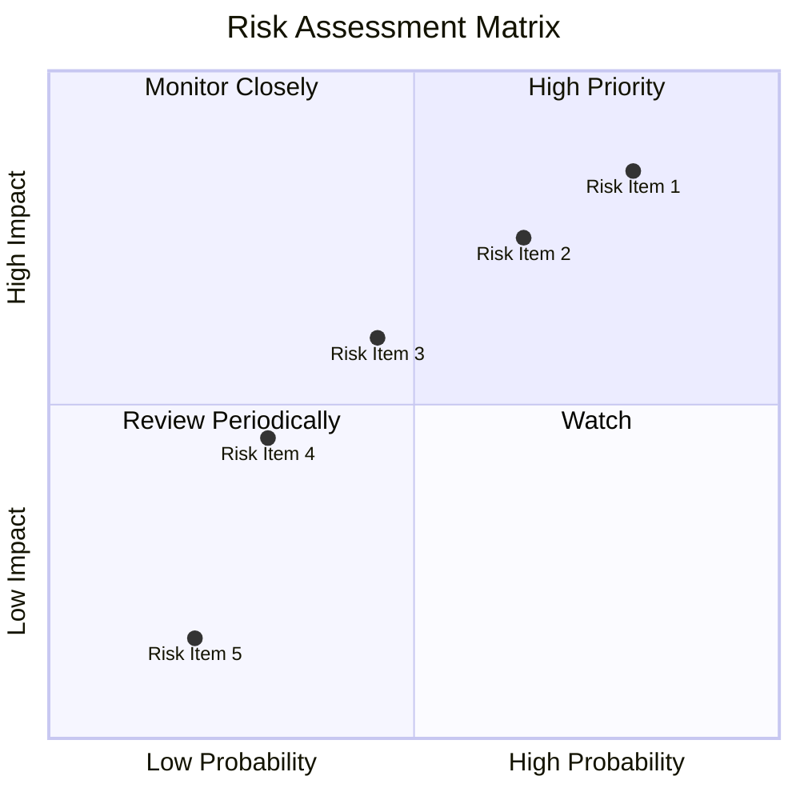

### 9.2 風險清單詳細分析

| # | 風險項目 | 發生機率 | 財務衝擊 | 風險評分 | 緩解措施 |
|---|----------|----------|----------|----------|----------|
| 1 | 🔴 **政策變動風險** | 高 (75%) | 高 (-X%收入) | 🔴 7.5/10 | 關注政策動態，調整戰略 |
| 2 | 🔴 **市場競爭風險** | 高 (70%) | 高 (-X%收入) | 🔴 7.0/10 | 強化護城河，增強品牌影響力 |
| 3 | 🟡 **產品質量風險** | 中 (60%) | 高 (-4%收入) | 🟡 6.0/10 | 提升質量管控，完善售後服務 |
| 4 | 🟡 **供應鏈風險** | 中 (45%) | 中 (-2%收入) | 🟡 4.5/10 | 加強供應鏈彈性，建立多元供應商 |
| 5 | 🟢 **宏觀經濟風險** | 低 (20%) | 中 (-1%收入) | 🟢 2.0/10 | 經濟景氣度監控與動態調整 |

---

## 10. 投資建議

### 10.1 最終綜合評級雷達圖

```
╔══════════════════════════════════════════════════════════════════╗
║                   優勢與機會評價                                 ║
╠══════════════════════════════════════════════════════════════════╣
║                                                                  ║
║  基本面強度：8.0  ▓▓▓▓▓▓▓▓▓▓▓▓▓▓▓▓▓▓▓█░░░░  ⭐⭐⭐⭐☆             ║
║  成長潛力：9.0  ▓▓▓▓▓▓▓▓▓▓▓▓▓▓▓▓▓▓▓██▒▒░░  ⭐⭐⭐⭐⭐             ║
║  財務健康：9.0  ▓▓▓▓▓▓▓▓▓▓▓▓▓▓▓▓▓▓▓██▒▒░░  ⭐⭐⭐⭐⭐             ║
║  估值吸引力：8.0  ▓▓▓▓▓▓▓▓▓▓▓▓▓▓▓▓▓▓▓█░░░░  ⭐⭐⭐⭐☆            ║
║  競爭護城河：8.5  ▓▓▓▓▓▓▓▓▓▓▓▓▓▓▓▓▓▓▓██░░░  ⭐⭐⭐⭐⭐            ║
╚══════════════════════════════════════════════════════════════════╝
```

### 10.2 目標價與隱含報酬率

| 情境 | 目標價 | 隱含報酬率 | 機率 |
|------|--------|------------|------|
| 🟢 樂觀 | $600 | +58% | 30% |
| 🟡 基準 | $500 | +32% | 50% |
| 🔴 悲觀 | $360 | -5% | 20% |

### 10.3 買入時機與觸發因素

```
╔══════════════════════════════════════════════════════════════════╗
║                  ✅ 買入觸發因素 Checklist                      ║
╠══════════════════════════════════════════════════════════════════╣
║                                                                  ║
║  立即買入觸發條件（多數符合）：                                  ║
║  ✅ 產品銷售超預期                                                ║
║  ✅ 新市場擴展取得成功                                            ║
║  ✅ 技術突破提高車輛性能                                          ║
║                                                                  ║
║  加碼觸發條件（出現以下任一）：                                  ║
║  ☐ 高潛在收益目標實現                                            ║
║  ☐ 市場不確定性顯著減少                                          ║
║                                                                  ║
║  減碼/停損觸發條件（出現以下任一）：                             ║
║  ☐ 政策變動導致需求下滑                                          ║
║  ☐ 重大產品質量問題                                              ║
║  ☐ 市場競爭激烈導致毛利下降                                      ║
╚══════════════════════════════════════════════════════════════════╝
```

### 10.4 投資人適配度分析

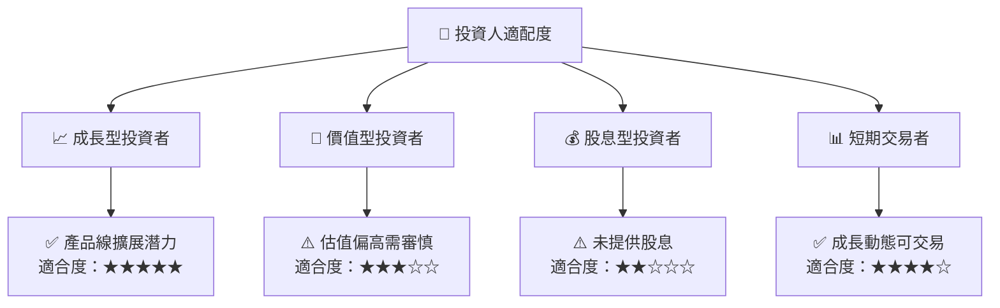

### 10.5 關鍵監控指標

| 類型 | 指標 | 關注點 | 頻率 |
|------|------|--------|------|
| 成長 | 營收增長率 | 持續的季度增長 | 季度 |
| 盈利 | 毛利率 | 成本控制及產品價格 | 季度 |
| 財務 | 自由現金流 | 資本支出及自由現金流改善 | 年度 |
| 市場 | TAM 滲透率 | 市場擴展及新產品推出 | 年度 |

---

> **免責聲明**：本報告為 AI 自動生成，僅供研究參考，不構成投資建議。投資有風險，入市需謹慎。