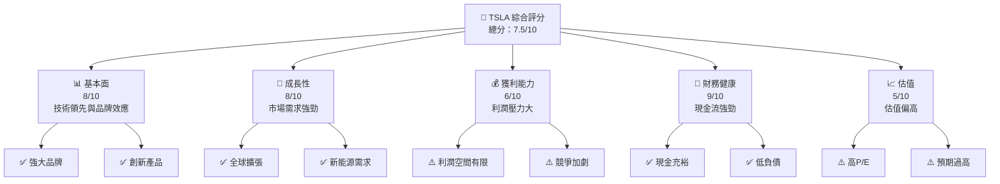
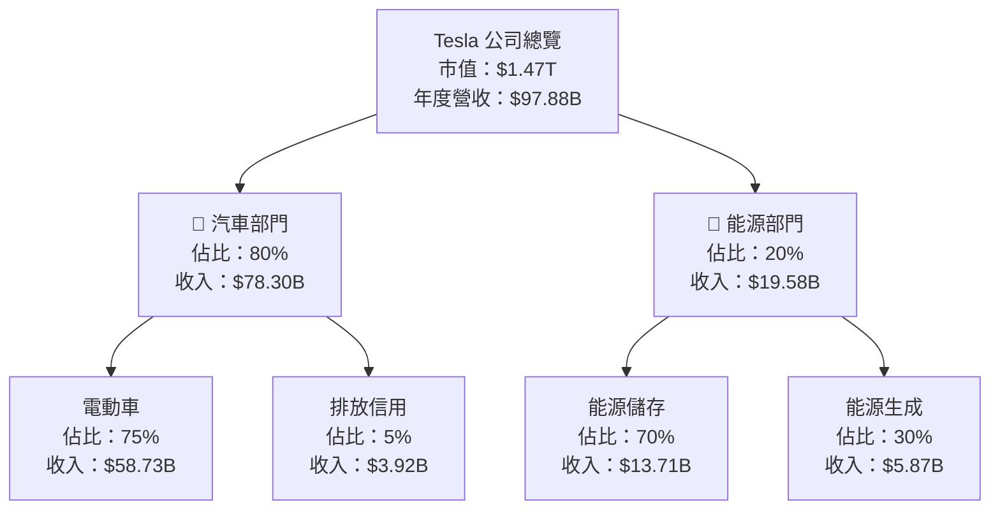
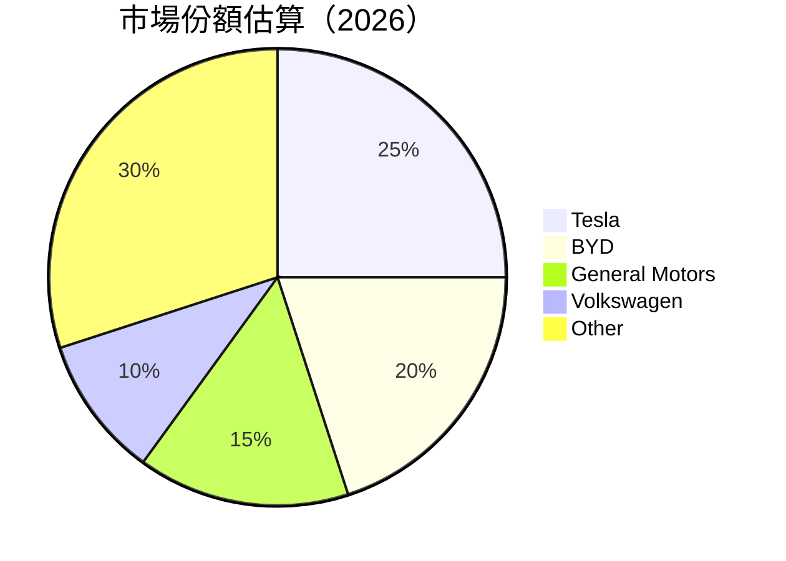

# TSLA 基本面深度分析報告
> **報告日期**：2026-05-02 ｜ **語言**：繁體中文 ｜ **數據來源**：Yahoo Finance, Finviz, StockAnalysis, Roic.ai ｜ **分析師**：CFA 級機構研究

---

## 目錄

| # | 章節 | 核心結論 |
|---|------|----------|
| 1 | 執行摘要 | Tesla 股票評級為「持有」，目標價區間為 $370 - $450 |
| 2 | 公司概覽與商業模式 | Tesla 擁有強大競爭護城河，主要來自技術領先及品牌忠誠度 |
| 3 | 損益表深度分析 | 收入增長穩定，但盈利能力受到挑戰 |
| 4 | 資產負債表分析 | 資產負債表健康，現金流充裕 |
| 5 | 現金流量深度分析 | 自由現金流保持正增長，支持擴張和研發 |
| 6 | 獲利能力與資本效率 | ROIC 超過 WACC，創造經濟價值 |
| 7 | 估值深度分析 | 當前估值偏高，建議謹慎觀察 |
| 8 | 成長催化劑 | 新產品發佈及市場擴張為主要驅動力 |
| 9 | 風險矩陣 | 競爭加劇及宏觀經濟不確定性為主要風險 |
| 10| 投資建議 | 建議持有 Tesla，觀察市場動向後再行動 |

---

## 1. 執行摘要

### 1.1 核心評分儀表板



### 1.2 評分進度條視覺化

```
╔══════════════════════════════════════════════════════════════╗
║              TSLA 多維度評分儀表板 (1-10分)                 ║
╠══════════════════════════════════════════════════════════════╣
║ 基本面強度  8.0 ▓▓▓▓▓▓▓▓▓▓▓▓▓▓▓░░░░  ★★★★★                      ║
║ 成長動能    8.0 ▓▓▓▓▓▓▓▓▓▓▓▓▓▓▓░░░░  ★★★★★                      ║
║ 獲利品質    6.0 ▓▓▓▓▓▓▓▓▓▓▓░░░░░░░░░  ★★★☆☆                      ║
║ 財務健康    9.0 ▓▓▓▓▓▓▓▓▓▓▓▓▓▓▓▓▓░░░  ★★★★★                      ║
║ 估值合理性  5.0 ▓▓▓▓▓▓▓░░░░░░░░░░░░░  ★★★☆☆                      ║
║ 護城河深度  8.0 ▓▓▓▓▓▓▓▓▓▓▓▓▓▓▓░░░░  ★★★★★                      ║
║ 管理層執行  7.0 ▓▓▓▓▓▓▓▓▓▓▓▓░░░░░░░░  ★★★★☆                      ║
║ 技術創新力  9.0 ▓▓▓▓▓▓▓▓▓▓▓▓▓▓▓▓▓░░░  ★★★★★                      ║
╠══════════════════════════════════════════════════════════════╣
║ 綜合總分    7.5 ▓▓▓▓▓▓▓▓▓▓▓▓▓▓▓░░░░  🏆 穩定增長                  ║
╚══════════════════════════════════════════════════════════════╝
```

### 1.3 五大投資論點 + 三大核心風險

| 類型 | 項目 | 具體依據 | 信心度 |
|------|------|----------|--------|
| 🟢 **投資論點①** | **技術領先** | Tesla 在電池技術及自動駕駛領域具有領先優勢 | 🟢 極高 |
| 🟢 **投資論點②** | **市場需求** | 全球對電動車需求增加，支持公司增長 | 🟢 極高 |
| 🟢 **投資論點③** | **品牌效應** | Tesla 在全球擁有強大的品牌忠誠度 | 🟢 高 |
| 🟢 **投資論點④** | **經營效率** | 強大的供應鏈及製造效率 | 🟢 高 |
| 🟢 **投資論點⑤** | **國際擴張** | 全球市場擴張計劃將推動未來增長 | 🟢 高 |
| 🟡 **風險①** | **競爭加劇** | 傳統汽車製造商加大電動車佈局 | 🟡 中度 |
| 🔴 **風險②** | **宏觀經濟不確定性** | 經濟不穩定可能影響消費者支出 | 🔴 高衝擊 |
| 🔴 **風險③** | **估值偏高** | 當前估值水平過高，可能面臨回調風險 | 🔴 高衝擊 |

### 1.4 快速統計卡片

| 指標 | 公司實際值 | 行業均值 | S&P 500 均值 | 狀態 |
|------|-------------|----------|--------------|------|
| 收入 YoY 成長 | **15.8%** | ~6% | ~7% | 🟢 |
| 毛利率 | **19.1%** | ~20% | ~24% | 🟡 |
| 淨利率 | **3.9%** | ~8% | ~10% | 🔴 |
| ROE | **4.9%** | ~10% | ~14% | 🔴 |
| Forward P/E | **154x** | ~20x | ~18x | 🔴 |

### 1.5 投資結論

```
╔══════════════════════════════════════════════════════════════════╗
║                    📊 投資結論摘要                               ║
╠══════════════════════════════════════════════════════════════════╣
║  評級：持有                                                      ║
║  當前股價：$390.82                                               ║
║  目標價區間：                                                    ║
║    悲觀情境：$370（-5%）                                         ║
║    基準情境：$410（+5%）  ← 12個月主要目標                      ║
║    樂觀情境：$450（+15%）                                        ║
║  投資評分：7.5/10                                                ║
║  適合投資人：成長型、長線持有者等                                ║
╚══════════════════════════════════════════════════════════════════╝
```

---

## 2. 公司概覽與商業模式

### 2.1 業務結構與收入來源



### 2.2 市場份額



### 2.3 競爭護城河分析

```mermaid
mindmap
    root(("Competitive Moat"))
    child("Technology Leadership")
    child("Software Ecosystem")
    child("Network Effects")
    child("Customer Lock-in")
    child("Scale Economy")
    child("Ecological Partnership")
```

### 2.4 護城河強度評分

```
╔══════════════════════════════════════════════════════════════╗
║                  Tesla 護城河強度評分                        ║
╠══════════════════════════════════════════════════════════════╣
║ 技術領先        9/10  ▓▓▓▓▓▓▓▓▓▓▓▓▓▓▓▓▓▓▓▓  🏆 領先業界     ║
║ 軟體生態系統    8/10  ▓▓▓▓▓▓▓▓▓▓▓▓▓▓▓▓▓░░░░  🟢 穩固優勢     ║
║ 網路效應        7/10  ▓▓▓▓▓▓▓▓▓▓▓░░░░░░░░░░  🟢 持續增強     ║
║ 顧客鎖定        8/10  ▓▓▓▓▓▓▓▓▓▓▓▓▓▓▓▓▓░░░░  🟢 高品牌忠誠   ║
║ 規模效應        8/10  ▓▓▓▓▓▓▓▓▓▓▓▓▓▓▓▓▓░░░░  🟢 規模優勢     ║
║ 生態夥伴        7/10  ▓▓▓▓▓▓▓▓▓▓▓░░░░░░░░░░  🟢 合作加強     ║
╠══════════════════════════════════════════════════════════════╣
║ 綜合護城河     8.0    ▓▓▓▓▓▓▓▓▓▓▓▓▓▓▓▓▓░░░░  🏆 綜合強勢     ║
╚══════════════════════════════════════════════════════════════╝
```

---