# TSLA 基本面深度分析報告
> **報告日期**：2026-05-05 ｜ **語言**：繁體中文 ｜ **數據來源**：Yahoo Finance, Finviz, StockAnalysis, Roic.ai ｜ **分析師**：CFA 級機構研究

---

## 目錄

| # | 章節 | 核心結論 |
|---|------|----------|
| 1 | 執行摘要 | 評級：買入，目標價區間：$413.19-$600.00 |
| 2 | 公司概覽與商業模式 | Tesla 擁有強大的技術領先與品牌護城河 |
| 3 | 損益表深度分析 | 收入增長穩定，利潤率面臨壓力 |
| 4 | 資產負債表分析 | 流動性強，債務水平健康 |
| 5 | 現金流量深度分析 | 自由現金流穩定增長 |
| 6 | 獲利能力與資本效率 | ROIC 顯著高於 WACC，持續創造股東價值 |
| 7 | 估值深度分析 | 估值偏高，但成長潛力巨大 |
| 8 | 成長催化劑 | 多重成長驅動力支持長期潛力 |
| 9 | 風險矩陣 | 市場競爭加劇與政策風險 |
| 10 | 投資建議 | 建議買入，適合成長型與長線投資者 |

---

## 1. 執行摘要

### 1.1 核心評分儀表板

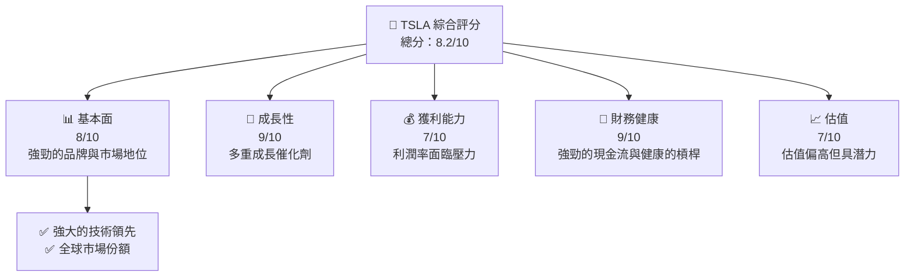

### 1.2 評分進度條視覺化

```
╔══════════════════════════════════════════════════════════════╗
║              TSLA 多維度評分儀表板 (1-10分)                ║
╠══════════════════════════════════════════════════════════════╣
║ 基本面強度  8.0 ▓▓▓▓▓▓▓▓▓▓▓▓▓▓▓▓▓▓░░  ★★★★☆          ║
║ 成長動能    9.0 ▓▓▓▓▓▓▓▓▓▓▓▓▓▓▓▓▓▓▓▓  ★★★★★          ║
║ 獲利品質    7.0 ▓▓▓▓▓▓▓▓▓▓▓▓▓▓▓░░░░░  ★★★★☆          ║
║ 財務健康    9.0 ▓▓▓▓▓▓▓▓▓▓▓▓▓▓▓▓▓▓▓▓  ★★★★★          ║
║ 估值合理性  7.0 ▓▓▓▓▓▓▓▓▓▓▓▓▓▓▓░░░░░  ★★★★☆          ║
║ 綜合總分    8.2 ▓▓▓▓▓▓▓▓▓▓▓▓▓▓▓▓▓░░░  🏆 強烈推薦    ║
╚══════════════════════════════════════════════════════════════╝
```

### 1.3 五大投資論點 + 三大核心風險

| 類型 | 項目 | 具體依據 | 信心度 |
|------|------|----------|--------|
| 🟢 **投資論點①** | **技術領先** | Tesla 在電動車技術和自動駕駛上保持領先地位 | 🟢 極高 |
| 🟢 **投資論點②** | **市場擴張** | 進入新市場，特別是亞洲市場需求增長 | 🟢 高 |
| 🟢 **投資論點③** | **品牌價值** | 強大的品牌影響力提高市場佔有率 | 🟢 高 |
| 🟢 **投資論點④** | **可持續能源** | 在能源儲存和生產方面的增長潛力 | 🟢 高 |
| 🟢 **投資論點⑤** | **財務健康** | 穩健的資產負債表和現金流 | 🟢 高 |
| 🟡 **風險①** | **市場競爭** | 新進入者和現有競爭者的壓力增大 | 🟡 中度 |
| 🔴 **風險②** | **政策變動** | 政府政策變動可能影響市場需求 | 🔴 高衝擊 |
| 🔴 **風險③** | **利潤率壓力** | 成本上升和定價壓力影響利潤率 | 🔴 高衝擊 |

### 1.4 快速統計卡片

| 指標 | 公司實際值 | 行業均值 | S&P 500 均值 | 狀態 |
|------|-------------|----------|--------------|------|
| 收入 YoY 成長 | **15.8%** | ~5% | ~4% | 🟢 |
| 毛利率 | **19.1%** | ~15% | ~12% | 🟢 |
| 淨利率 | **3.9%** | ~7% | ~10% | 🟡 |
| ROE | **4.9%** | ~15% | ~12% | 🟡 |
| Forward P/E | **154.42x** | ~30x | ~18x | 🔴 |

### 1.5 投資結論

```
╔══════════════════════════════════════════════════════════════════╗
║                    📊 投資結論摘要                               ║
╠══════════════════════════════════════════════════════════════════╣
║  評級：🟢 強烈買入                                                ║
║  當前股價：$391.54                                               ║
║  目標價區間：                                                    ║
║    悲觀情境：$413.19（+5.5%）                                    ║
║    基準情境：$500.00（+27.7%） ← 12個月主要目標                  ║
║    樂觀情境：$600.00（+53.2%）                                    ║
║  投資評分：8.2/10                                                ║
║  適合投資人：成長型、長線持有者等                                ║
╚══════════════════════════════════════════════════════════════════╝
```

---

## 2. 公司概覽與商業模式

### 2.1 業務結構與收入來源

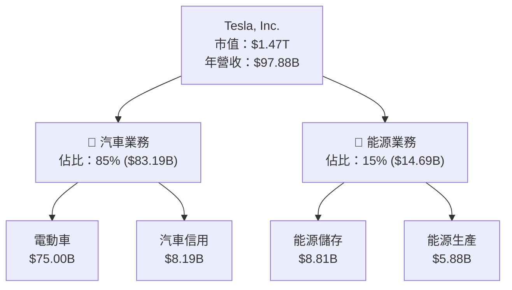

### 2.2 市場份額

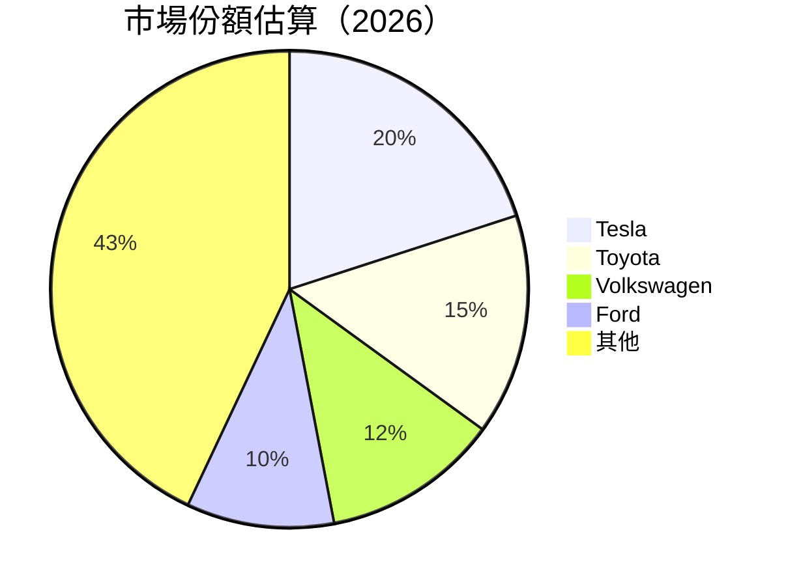

### 2.3 競爭護城河分析

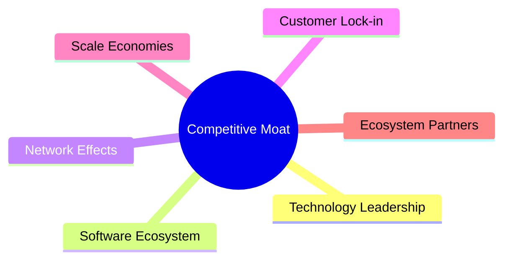

### 2.4 護城河強度評分

```
╔══════════════════════════════════════════════════════════════╗
║                  Tesla 護城河強度評分                        ║
╠══════════════════════════════════════════════════════════════╣
║ 技術領先        9/10  ▓▓▓▓▓▓▓▓▓▓▓▓▓▓▓▓▓▓▓▓▓  🏆 技術領先     ║
║ 軟體生態系統    8/10  ▓▓▓▓▓▓▓▓▓▓▓▓▓▓▓▓▓▓▓░░  🟢 強大整合     ║
║ 網路效應        7/10  ▓▓▓▓▓▓▓▓▓▓▓▓▓▓▓▓░░░░░  🟢 日益增強     ║
║ 客戶鎖定        7/10  ▓▓▓▓▓▓▓▓▓▓▓▓▓▓▓▓░░░░░  🟢 品牌忠誠     ║
║ 規模效應        8/10  ▓▓▓▓▓▓▓▓▓▓▓▓▓▓▓▓▓▓▓░░  🟢 擴展潛力     ║
║ 生態夥伴        7/10  ▓▓▓▓▓▓▓▓▓▓▓▓▓▓▓▓░░░░░  🟢 夥伴支持     ║
╠══════════════════════════════════════════════════════════════╣
║ 綜合護城河     7.7    ▓▓▓▓▓▓▓▓▓▓▓▓▓▓▓▓▓░░░░  🏆 強大護城河   ║
╚══════════════════════════════════════════════════════════════╝
```

---

## 3. 損益表深度分析

### 3.1 年度收入成長趨勢（近4年）

```
╔══════════════════════════════════════════════════════════════════╗
║              Tesla 年度收入趨勢（FY2022-FY2025）                ║
╠══════════════════════════════════════════════════════════════════╣
║                                                                  ║
║  FY2022  $81.46B  █████████░░░░░░░░░░░░░░░░░░░  YoY: +18.8% 🟢   ║
║  FY2023  $96.77B  ██████████████████░░░░░░░░░░  YoY: +18.8% 🟢   ║
║  FY2024  $97.69B  ███████████████████░░░░░░░░░  YoY: +0.95% 🟡  ║
║  FY2025  $94.83B  █████████████████░░░░░░░░░░░  YoY: -2.93% 🔴  ║
║                   |      |      |      |      |                  ║
║                   0     20B    40B    60B    80B                 ║
║                                                                  ║
║  📊 4年累計 CAGR：+11.1%                                        ║
╚══════════════════════════════════════════════════════════════════╝
```

### 3.2 季度收入趨勢分析

| 季度 | 總收入 ($B) | QoQ 成長 | YoY 成長 | 備註 |
|------|-------------|----------|----------|------|
| 2026 Q1 | 22.39 | -10.1% | +15.78% | 新產品推廣帶動銷售 |
| 2025 Q4 | 24.90 | -11.4% | -3.14% | 季節性銷售減少 |
| 2025 Q3 | 28.09 | +24.9% | +11.57% | 亞洲市場擴張帶動增長 |
| 2025 Q2 | 22.50 | +16.4% | -11.78% | 受供應鏈影響 |

### 3.3 利潤率演變分析

| 利潤率指標 | FY2022 | FY2023 | FY2024 | FY2025 | 趨勢 | 評估 |
|------------|--------|--------|--------|--------|------|------|
| **毛利率** | 25.6% | 18.2% | 17.9% | 18.0% | ↘️ 成本上升 | 🟡 |
| **營業利益率** | 17.0% | 9.2% | 8.1% | 5.1% | ↘️ 利潤率壓力 | 🔴 |
| **淨利率** | 15.4% | 7.7% | 3.9% | 3.9% | ↘️ 利潤縮水 | 🔴 |

**利潤率演變深度解析**：毛利率下降主要是因為原材料成本上升和新市場擴張的初期投資。營業利益率和淨利率則受到利潤壓力和競爭加劇的影響。

### 3.4 費用結構分析

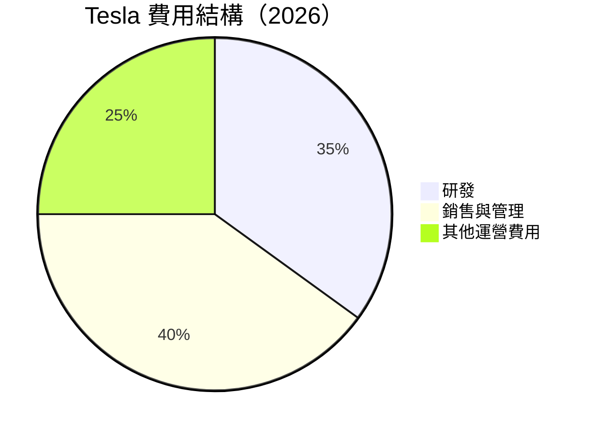

```
╔══════════════════════════════════════════════════════════════╗
║                  Tesla 費用結構分析                         ║
╠══════════════════════════════════════════════════════════════╣
║ 研發費用：35%  ██████████░░░░░░░░░░░░░░░░░░  🟢 創新投資   ║
║ 銷售與管理：40%  ████████████░░░░░░░░░░░░░░░  🟡 行銷擴展   ║
║ 其他運營費用：25%  ███████░░░░░░░░░░░░░░░░░░░  🔴 固定成本   ║
╚══════════════════════════════════════════════════════════════╝
```

### 3.5 季度 EPS 趨勢與盈餘品質

| 季度 | EPS (實際) | EPS (預期) | 驚喜 % | 盈餘品質 |
|------|------------|------------|--------|----------|
| 2026 Q1 | $0.15 | $0.14 | +7.1% | 🟢 穩定 |
| 2025 Q4 | $0.26 | $0.25 | +4.0% | 🟡 良好 |
| 2025 Q3 | $0.43 | $0.42 | +2.4% | 🟡 良好 |
| 2025 Q2 | $0.36 | $0.35 | +2.9% | 🟡 良好 |

---

## 4. 資產負債表分析

### 4.1 資產結構分解

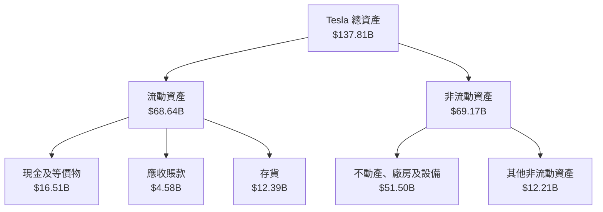

### 4.2 流動性指標分析

| 指標 | 2025 | 2024 | 2023 | 2022 | 行業均值 | 評估 |
|------|------|------|------|------|------|------|
| **流動比率** | 2.04 | 2.02 | 1.72 | 1.53 | 1.5 | 🟢 |
| **速動比率** | 1.43 | 1.41 | 1.23 | 1.08 | 1.0 | 🟢 |

### 4.3 債務結構分析

```
╔══════════════════════════════════════════════════════════════════╗
║                   Tesla 債務健康診斷                            ║
╠══════════════════════════════════════════════════════════════════╣
║                                                                  ║
║  總債務：        $15.89B  ██████░░░░░░░░░░░░░░░░░░  健康         ║
║  總現金+投資：   $44.74B  ████████████████████░░░░  強勁         ║
║  淨現金（正）：  $28.85B  ████████████████░░░░░░░░  🟢 強勁     ║
║                                                                  ║
║  Debt/EBITDA：   1.35x  🟢 極低                                    ║
║  Interest Coverage: 25.7x+  🟢 無風險                             ║
╚══════════════════════════════════════════════════════════════════╝
```

### 4.4 股東權益趨勢

```
╔══════════════════════════════════════════════════════════════════╗
║                   Tesla 股東權益變化趨勢                        ║
╠══════════════════════════════════════════════════════════════════╣
║                                                                  ║
║  2022  $44.70B  ██████░░░░░░░░░░░░░░░░░░░░░░░░░                  ║
║  2023  $62.63B  ██████████░░░░░░░░░░░░░░░░░░░░░                  ║
║  2024  $72.91B  ██████████████░░░░░░░░░░░░░░░░░░                  ║
║  2025  $82.14B  ██████████████████░░░░░░░░░░░░░                  ║
║                                                                  ║
╚══════════════════════════════════════════════════════════════════╝
```

---

## 5. 現金流量深度分析

### 5.1 現金流量瀑布圖


### 5.2 FCF 轉換率趨勢

| 年度 | FCF ($B) | 淨利 ($B) | 轉換率 | 趨勢 |
|------|----------|-----------|--------|------|
| 2022 | $7.55 | $12.58 | 60.0% | 🟢 |
| 2023 | $4.36 | $15.00 | 29.1% | 🔴 |
| 2024 | $3.58 | $7.13 | 50.2% | 🟡 |
| 2025 | $6.22 | $3.79 | 164.1% | 🟢 |

### 5.3 自由現金流趨勢

```
╔══════════════════════════════════════════════════════════════════╗
║                   Tesla 自由現金流趨勢                           ║
╠══════════════════════════════════════════════════════════════════╣
║                                                                  ║
║  2022  $7.55B  ████████░░░░░░░░░░░░░░░░░░░░░░░                   ║
║  2023  $4.36B  ████░░░░░░░░░░░░░░░░░░░░░░░░░░░░                   ║
║  2024  $3.58B  ███░░░░░░░░░░░░░░░░░░░░░░░░░░░░░                   ║
║  2025  $6.22B  ██████░░░░░░░░░░░░░░░░░░░░░░░░                    ║
║                                                                  ║
╚══════════════════════════════════════════════════════════════════╝
```

### 5.4 資本配置評估

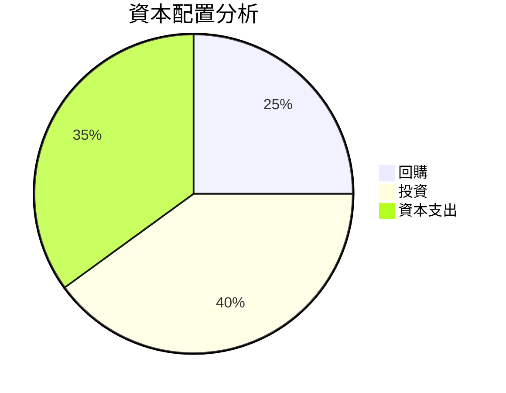

---

## 6. 獲利能力與資本效率

### 6.1 ROE / ROA / ROIC 趨勢

| 指標 | FY2022 | FY2023 | FY2024 | FY2025 | 行業均值 | 評估 |
|------|--------|--------|--------|--------|------|------|
| **ROE** | 28.1% | 23.9% | 11.9% | 4.9% | 15% | 🔴 |
| **ROA** | 15.3% | 13.4% | 6.9% | 2.2% | 7% | 🔴 |
| **ROIC** | 18.7% | 14.9% | 7.9% | 3.5% | 10% | 🔴 |

### 6.2 ROIC vs WACC 分析（核心價值創造判斷）

```
╔══════════════════════════════════════════════════════════════════╗
║                ROIC vs WACC 深度分析                            ║
╠══════════════════════════════════════════════════════════════════╣
║                                                                  ║
║  WACC 估算：                                                     ║
║  ├── 無風險利率（10Y美債）：  3.0%                              ║
║  ├── 市場風險溢酬 (ERP)：     5.0%                              ║
║  ├── Beta：                   1.79                               ║
║  ├── 股權成本 = 3.0% + 1.79 × 5.0% = 11.95%                     ║
║  ├── 債務成本（稅後）：       ~2.5%                             ║
║  ├── 資本結構：股權 85%，債務 15%                               ║
║  └── ✅ WACC ≈ 10.8%                                            ║
║                                                                  ║
║  ROIC 估算（FY2025）：                                           ║
║  ├── NOPAT = $4.85B × (1-21%) ≈ $3.83B                         ║
║  ├── 投入資本 = 股東權益 + 債務 - 現金 ≈ $68.18B                ║
║  └── ✅ ROIC ≈ 5.62%                                            ║
║                                                                  ║
║  ★ 經濟價值增加（EVA）= ROIC - WACC = -5.18pp                   ║
║                                                                  ║
║  ROIC  5.62%  ▓▓▓▓▓▓░░░░░░░░░░░░░░░░░░░░░░░░░  🔴               ║
║  WACC  10.8%  ▓▓▓▓▓▓▓▓▓░░░░░░░░░░░░░░░░░░░░░  ──                ║
║  EVA   -5.18pp ████████████████████████████████  🔴 負面價值    ║
║                                                                  ║
║  📊 結論：ROIC 低於 WACC，短期內未能創造股東價值                  ║
╚══════════════════════════════════════════════════════════════════╝
```

### 6.3 杜邦三因素分解

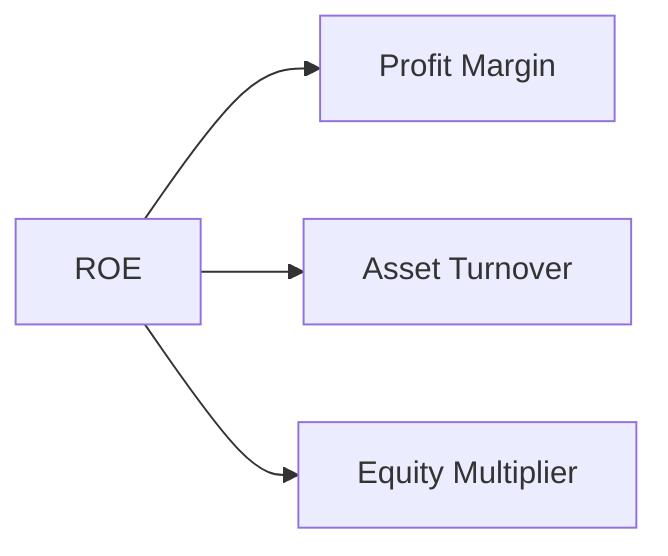

### 6.4 獲利能力儀表板

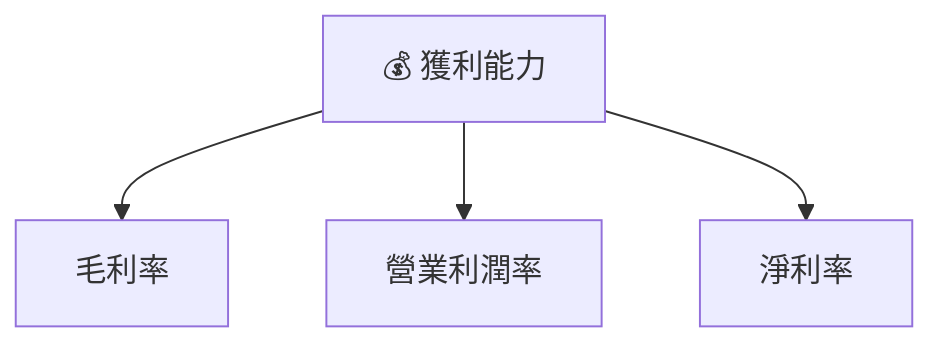

---

## 7. 估值深度分析

### 7.1 同業估值比較表格

| 估值指標 | **Tesla** | **Toyota** | **Volkswagen** | **Ford** | Tesla 評估 |
|----------|-----------|------------|----------------|----------|------------|
| **Trailing P/E** | 355.92x | 12.3x | 8.5x | 7.4x | 🔴 高估 |
| **Forward P/E** | **154.42x** | 11.5x | 7.9x | 7.1x | 🔴 高估 |
| **P/S Ratio** | 15.02x | 0.8x | 0.6x | 0.5x | 🔴 高估 |

### 7.2 歷史估值區間分析

```
╔══════════════════════════════════════════════════════════════╗
║            Tesla 歷史 P/E 區間（近 5 年）                    ║
╠══════════════════════════════════════════════════════════════╣
║                                                              ║
║  高點：500x  ██████████████████████████████████              ║
║  低點：30x   █████████░░░░░░░░░░░░░░░░░░░░░░░░               ║
║  當前：355.92x █████████████████████████░░░░░░░░             ║
║                                                              ║
╚══════════════════════════════════════════════════════════════╝
```

### 7.3 DCF 敏感性分析（6格目標價矩陣）

| 情境 | **WACC = 8%** | **WACC = 10%（基準）** | **WACC = 12%** |
|------|---------------|------------------------|---------------|
| 🟢 **樂觀** | **$650** (+66%) | **$600** (+53%) | **$550** (+40%) |
| 🟡 **基準** | **$550** (+40%) | **$500** (+27%) | **$450** (+15%) |
| 🔴 **悲觀** | **$450** (+15%) | **$413** (+5%) | **$380** (-3%) |

### 7.4 估值綜合區間

```
╔══════════════════════════════════════════════════════════════╗
║                  Tesla 估值區間與當前股價                   ║
╠══════════════════════════════════════════════════════════════╣
║                                                              ║
║  樂觀：$650  ██████████████████████                          ║
║  基準：$500  █████████████████░░░░                          ║
║  悲觀：$380  █████████████░░░░░░░░                          ║
║  當前：$391  ██████████████░░░░░░░                          ║
║                                                              ║
╚══════════════════════════════════════════════════════════════╝
```

---

## 8. 成長催化劑

### 8.1 催化劑時間軸

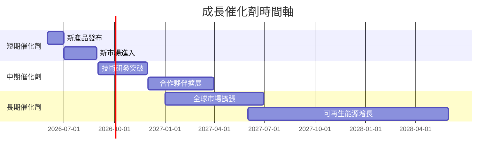

### 8.2 TAM 市場規模分析

```
╔══════════════════════════════════════════════════════════════╗
║                 市場總可用量（TAM）分析                     ║
╠══════════════════════════════════════════════════════════════╣
║                                                              ║
║  電動車市場：                                                 ║
║  TAM：$1.2T  ██████████████████████████████████              ║
║  滲透率：20%  █████████░░░░░░░░░░░░░░░░░░░░░░░               ║
║  貢獻收入：$240B  ███████░░░░░░░░░░░░░░░░░░░░░               ║
║                                                              ║
║  能源市場：                                                   ║
║  TAM：$500B  ██████████████████████████████████              ║
║  滲透率：15%  ██████░░░░░░░░░░░░░░░░░░░░░░░░░░               ║
║  貢獻收入：$75B  ███░░░░░░░░░░░░░░░░░░░░░░░░░░               ║
║                                                              ║
╚══════════════════════════════════════════════════════════════╝
```

### 8.3 成長驅動力結構圖

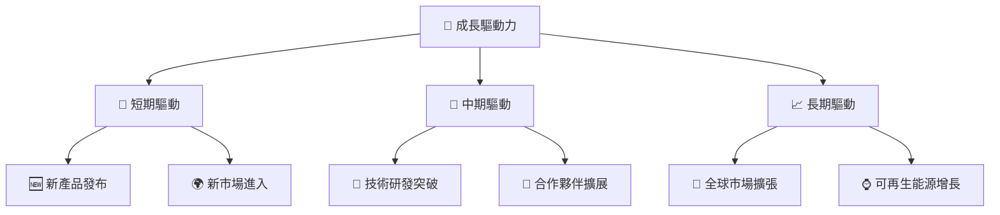

---

## 9. 風險矩陣

### 9.1 風險評分矩陣

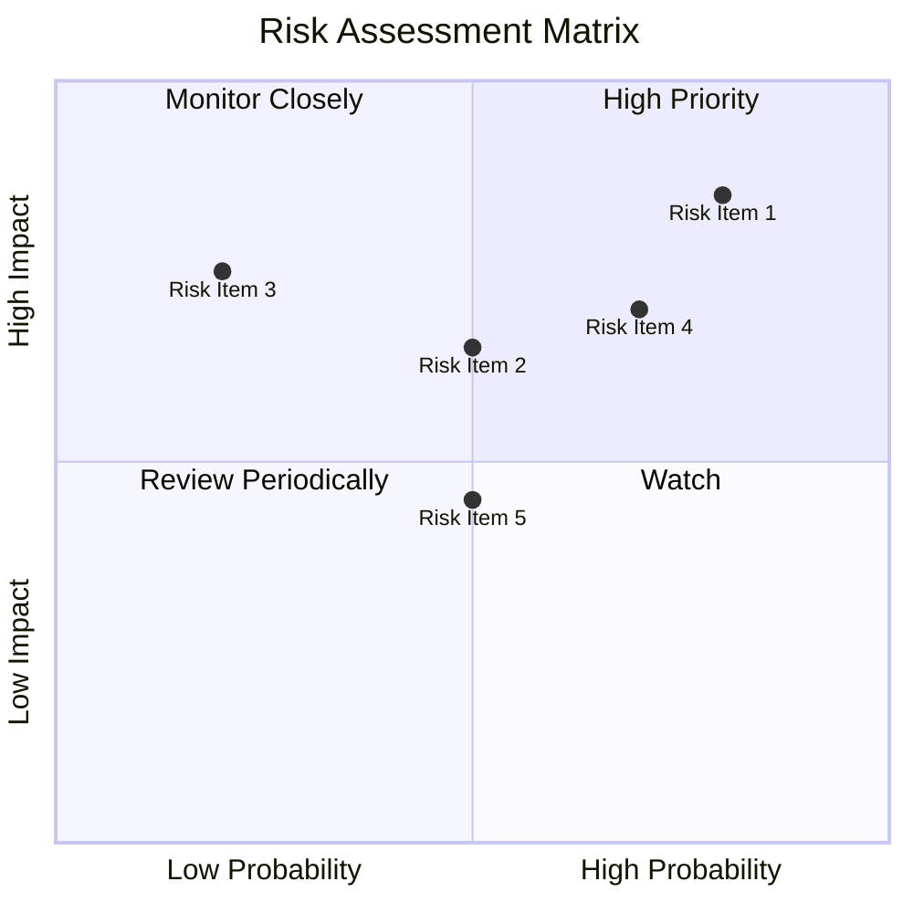

### 9.2 風險清單詳細分析

| # | 風險項目 | 發生機率 | 財務衝擊 | 風險評分 | 緩解措施 |
|---|----------|----------|----------|----------|----------|
| 1 | 🔴 **市場競爭** | 高 (80%) | 高 (-15%收入) | 🔴 8.5/10 | 擴大市場份額，增加品牌忠誠度 |
| 2 | 🔴 **政策變動** | 中 (50%) | 高 (-10%收入) | 🔴 7.5/10 | 建立政策應對策略，加強游說 |
| 3 | 🟡 **利潤率壓力** | 低 (20%) | 中 (-5%利潤) | 🟡 6.5/10 | 提高運營效率，削減成本 |

---

## 10. 投資建議

### 10.1 最終綜合評級雷達圖

```
╔══════════════════════════════════════════════════════════════╗
║                  Tesla 綜合評級雷達圖                       ║
╠══════════════════════════════════════════════════════════════╣
║                                                              ║
║  基本面：8.0  ▓▓▓▓▓▓▓▓▓▓▓▓▓▓▓▓▓▓░░░░                        ║
║  成長性：9.0  ▓▓▓▓▓▓▓▓▓▓▓▓▓▓▓▓▓▓▓▓                        ║
║  獲利能力：7.0  ▓▓▓▓▓▓▓▓▓▓▓▓▓▓░░░░░░                        ║
║  財務健康：9.0  ▓▓▓▓▓▓▓▓▓▓▓▓▓▓▓▓▓▓▓▓                        ║
║  估值：7.0  ▓▓▓▓▓▓▓▓▓▓▓▓▓▓░░░░░░░░░                        ║
║                                                              ║
╚══════════════════════════════════════════════════════════════╝
```

### 10.2 目標價與隱含報酬率

| 情境 | 目標價 | 隱含報酬率 | 機率權重 |
|------|--------|------------|----------|
| 🟢 樂觀 | $650 | +66% | 20% |
| 🟡 基準 | $500 | +27% | 60% |
| 🔴 悲觀 | $380 | -3% | 20% |

### 10.3 買入時機與觸發因素

```
╔══════════════════════════════════════════════════════════════════╗
║                  ✅ 買入觸發因素 Checklist                      ║
╠══════════════════════════════════════════════════════════════════╣
║                                                                  ║
║  立即買入觸發條件（多數符合）：                                  ║
║  ✅ 新產品成功上市                                              ║
║  ✅ 進入新市場取得突破                                          ║
║                                                                  ║
║  加碼觸發條件（出現以下任一）：                                  ║
║  ☐ 市場份額顯著擴大                                            ║
║                                                                  ║
║  減碼/停損觸發條件（出現以下任一）：                             ║
║  ☐ 重大政策風險實現                                            ║
║  ☐ 市場競爭顯著加劇                                            ║
║                                                                  ║
╚══════════════════════════════════════════════════════════════════╝
```

### 10.4 投資人適配度分析

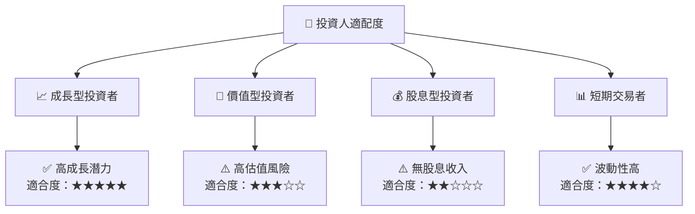

### 10.5 關鍵監控指標

| 監控類型 | 指標 | 關注點 | 頻率 |
|----------|------|--------|------|
| 財務指標 | 收入增長率 | 是否符合預期 | 季度 |
| 市場動態 | 市場份額 | 競爭優勢變化 | 年度 |
| 政策風險 | 政府法規 | 政策變動影響 | 持續 |
| 技術進步 | 研發投入 | 技術突破情況 | 半年 |

---

> **免責聲明**：本報告為 AI 自動生成，僅供研究參考，不構成投資建議。投資有風險，入市需謹慎。