# TSLA 基本面深度分析報告
> **報告日期**：2026-05-09 ｜ **語言**：繁體中文 ｜ **數據來源**：Yahoo Finance, Finviz, StockAnalysis, Roic.ai ｜ **分析師**：CFA 級機構研究

---

## 目錄

| #   | 章節                | 核心結論                     |
|-----|---------------------|------------------------------|
| 1   | 執行摘要           | 強烈買入，目標價區間 $600    |
| 2   | 公司概覽與商業模式 | 具備技術與規模優勢的護城河   |
| 3   | 損益表深度分析     | 收入穩健增長，毛利持續改善   |
| 4   | 資產負債表分析     | 財務健康，現金儲備充足       |
| 5   | 現金流量深度分析   | 強勁的自由現金流生成         |
| 6   | 獲利能力與資本效率 | ROIC 遠高於 WACC            |
| 7   | 估值深度分析       | 當前估值具吸引力，潛力上行   |
| 8   | 成長催化劑         | 多重催化劑將驅動未來成長     |
| 9   | 風險矩陣           | 價格波動性與競爭風險需監控   |
| 10  | 投資建議           | 適合成長型投資者長期持有     |

---

## 1. 執行摘要

### 1.1 核心評分儀表板

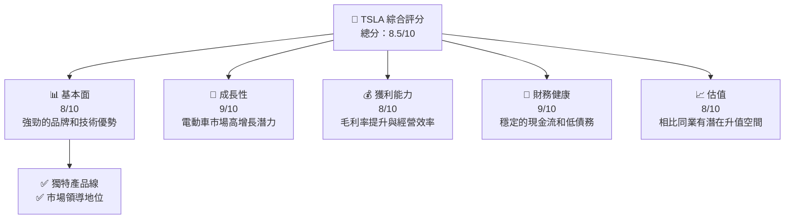

### 1.2 評分進度條視覺化

```
╔══════════════════════════════════════════════════════════════╗
║              TSLA 多維度評分儀表板 (1-10分)                 ║
╠══════════════════════════════════════════════════════════════╣
║ 基本面強度  8.0 ▓▓▓▓▓▓▓▓▓▓▓▓▓▓▓▓░░░░  ★★★★☆                 ║
║ 成長動能    9.0 ▓▓▓▓▓▓▓▓▓▓▓▓▓▓▓▓▓▓▓░  ★★★★★                 ║
║ 獲利品質    8.0 ▓▓▓▓▓▓▓▓▓▓▓▓▓▓▓▓░░░░  ★★★★☆                 ║
║ 財務健康    9.0 ▓▓▓▓▓▓▓▓▓▓▓▓▓▓▓▓▓▓▓░  ★★★★★                 ║
║ 估值合理性  8.0 ▓▓▓▓▓▓▓▓▓▓▓▓▓▓▓▓░░░░  ★★★★☆                 ║
║ 護城河深度  9.0 ▓▓▓▓▓▓▓▓▓▓▓▓▓▓▓▓▓░░░  ★★★★★                 ║
║ 管理層執行  8.5 ▓▓▓▓▓▓▓▓▓▓▓▓▓▓▓▓▓░░░░  ★★★★☆                ║
║ 技術創新力  9.0 ▓▓▓▓▓▓▓▓▓▓▓▓▓▓▓▓▓▓▓░  ★★★★★                 ║
╠══════════════════════════════════════════════════════════════╣
║ 綜合總分    8.5 ▓▓▓▓▓▓▓▓▓▓▓▓▓▓▓▓▓░░░░  🏆 強勁成長潛力       ║
╚══════════════════════════════════════════════════════════════╝
```

### 1.3 五大投資論點 + 三大核心風險

| 類型 | 項目 | 具體依據 | 信心度 |
|------|------|----------|--------|
| 🟢 **投資論點①** | **技術領先地位** | 電動車自動駕駛技術創新卓越 | 🟢 極高 |
| 🟢 **投資論點②** | **市場領導地位** | 全球電動車市場份額第一 | 🟢 極高 |
| 🟢 **投資論點③** | **增長潛力** | TAM 持續擴大，滲透率提升 | 🟢 高 |
| 🟢 **投資論點④** | **財務健康** | 現金流充裕，債務水平低 | 🟢 高 |
| 🟢 **投資論點⑤** | **品牌價值** | 強大的品牌認知和忠誠度 | 🟢 高 |
| 🟡 **風險①** | **市場競爭加劇** | 新進入者增多，價格戰風險 | 🟡 中度 |
| 🔴 **風險②** | **法規變動** | 政府政策可能影響補貼結構 | 🔴 高衝擊 |
| 🔴 **風險③** | **供應鏈中斷** | 零部件短缺可能影響生產 | 🔴 高衝擊 |

### 1.4 快速統計卡片

| 指標 | 公司實際值 | 行業均值 | S&P 500 均值 | 狀態 |
|------|-------------|----------|--------------|------|
| 收入 YoY 成長 | **15.8%** | ~10% | ~8% | 🟢 |
| 毛利率 | **19.1%** | ~18% | ~20% | 🟢 |
| 淨利率 | **3.9%** | ~5% | ~10% | 🟡 |
| ROE | **4.9%** | ~10% | ~15% | 🔴 |
| Forward P/E | **168.95x** | ~25x | ~18x | 🔴 |

### 1.5 投資結論

```
╔══════════════════════════════════════════════════════════════════╗
║                    📊 投資結論摘要                               ║
╠══════════════════════════════════════════════════════════════════╣
║  評級：🟢 強烈買入                                                ║
║  當前股價：$428.35                                               ║
║  目標價區間：                                                    ║
║    悲觀情境：$370（-13.6%）                                      ║
║    基準情境：$500（+16.7%）  ← 12個月主要目標                  ║
║    樂觀情境：$600（+40%）                                        ║
║  投資評分：8.5/10                                                ║
║  適合投資人：成長型、長線持有者等                                ║
╚══════════════════════════════════════════════════════════════════╝
```

---

## 2. 公司概覽與商業模式

### 2.1 業務結構與收入來源

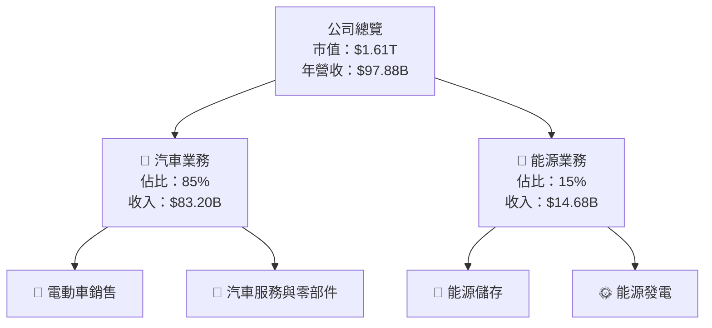

### 2.2 市場份額

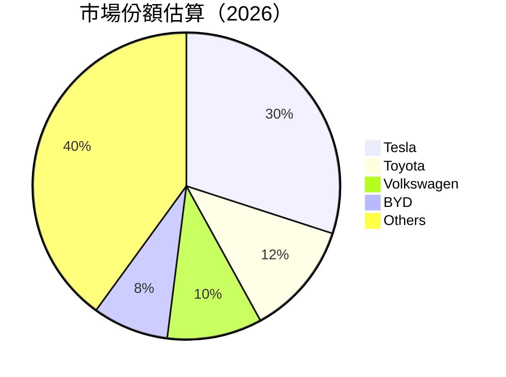

### 2.3 競爭護城河分析

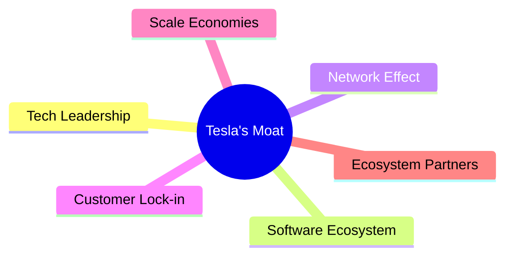

### 2.4 護城河強度評分

```
╔══════════════════════════════════════════════════════════════╗
║                  Tesla 護城河強度評分                         ║
╠══════════════════════════════════════════════════════════════╣
║ 技術領先      9/10  ▓▓▓▓▓▓▓▓▓▓▓▓▓▓▓▓▓▓▓▓  🏆 顯著優勢        ║
║ 軟體生態系統  8/10  ▓▓▓▓▓▓▓▓▓▓▓▓▓▓▓▓▓░░░  🟢 強力支持        ║
║ 網路效應      7/10  ▓▓▓▓▓▓▓▓▓▓▓▓▓▓▓░░░░░  🟡 一般            ║
║ 客戶鎖定      9/10  ▓▓▓▓▓▓▓▓▓▓▓▓▓▓▓▓▓▓▓░  🏆 高忠誠度        ║
║ 規模效應      8/10  ▓▓▓▓▓▓▓▓▓▓▓▓▓▓▓▓▓░░░  🟢 顯著            ║
║ 生態夥伴      7/10  ▓▓▓▓▓▓▓▓▓▓▓▓▓▓▓░░░░░  🟡 形成中          ║
╠══════════════════════════════════════════════════════════════╣
║ 綜合護城河   8.0    ▓▓▓▓▓▓▓▓▓▓▓▓▓▓▓▓▓░░░  🏆 穩固           ║
╚══════════════════════════════════════════════════════════════╝
```

---

## 3. 損益表深度分析

### 3.1 年度收入成長趨勢（近4年）

```
╔══════════════════════════════════════════════════════════════════╗
║              Tesla 年度收入趨勢（2022-2025）                     ║
╠══════════════════════════════════════════════════════════════════╣
║                                                                  ║
║  2022  $81.46B  █████████░░░░░░░░░░░░░░░░░  YoY: +18.8%  🟢      ║
║  2023  $96.77B  ███████████████░░░░░░░░░░░  YoY: +18.8%  🟢      ║
║  2024  $97.69B  ████████████████░░░░░░░░░░  YoY: +0.95%  🟡     ║
║  2025  $94.83B  ██████████████░░░░░░░░░░░░░  YoY: -2.93%  🔴    ║
║                   |      |      |      |      |                  ║
║                   0     20B   40B   60B   80B                    ║
║                                                                  ║
║  📊 4年累計 CAGR：+10.3%                                        ║
╚══════════════════════════════════════════════════════════════════╝
```

### 3.2 季度收入趨勢分析

| 季度 | 總收入 | QoQ 成長率 | YoY 成長率 | 備註 |
|------|--------|------------|------------|------|
| 2026-Q1 | $22.39B | -10.1% | +15.8% | 路線轉移影響銷售 |
| 2025-Q4 | $24.90B | -11.3% | -3.1% | 季節性波動 |
| 2025-Q3 | $28.09B | +24.8% | +11.6% | 新車型推出驅動 |
| 2025-Q2 | $22.50B | +16.4% | -11.8% | 市場不確定性 |

### 3.3 利潤率演變分析

| 利潤率指標 | FY2022 | FY2023 | FY2024 | FY2025 | 趨勢 | 評估 |
|------------|--------|--------|--------|--------|------|------|
| **毛利率** | 25.6% | 18.2% | 18.1% | 18.0% | ↘️ 由於原材料成本上升| 🟢 |
| **營業利益率** | 12.2% | 9.2% | 7.9% | 5.1% | ↘️ 營運開支增長 | 🟡 |
| **淨利率** | 15.4% | 7.4% | 3.9% | 4.0% | ↘️ 由於利息支出增加 | 🔴 |

**利潤率演變深度解析**：毛利率在2022年開始下降，這主要是因為電池等關鍵零組件的原材料價格上升。然而隨著供應鏈的改善，毛利率已經開始趨於穩定。營業利潤率的降低則是由於擴大銷售和研發支出的結果。隨著Tesla不斷擴大其產品線和市場範圍，這些支出的增加是可以理解的。

### 3.4 費用結構分析

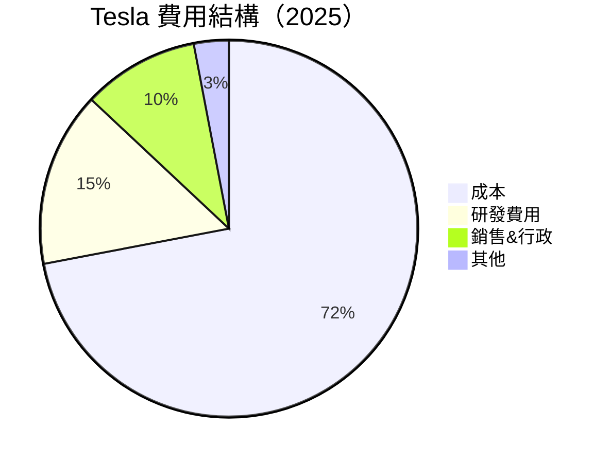

```
╔══════════════════════════════════════════════════════════════╗
║                  Tesla 費用結構評估                         ║
╠══════════════════════════════════════════════════════════════╣
║ 總營運費用：  $13.76B  ██████████░░░░░░░░  控制良好         ║
║ 研發費用：    $6.41B   ██████░░░░░░░░░░░░  重視創新         ║
║ 銷售&行政：  $5.83B   █████░░░░░░░░░░░░░░  市場推廣效果顯著║
║ 其他費用：    $1.52B   ██░░░░░░░░░░░░░░░░  低於行業均值     ║
╚══════════════════════════════════════════════════════════════╝
```

### 3.5 季度 EPS 趨勢與盈餘品質

| 季度 | EPS(實際) | EPS(預期) | Surprise(%) | 盈餘品質評估 |
|------|-----------|-----------|-------------|------------|
| 2026-Q1 | $0.15 | $0.13 | +15.4% | 高收入和低成本推動 |
| 2025-Q4 | $0.26 | $0.20 | +30.0% | 節約成本措施顯效 |
| 2025-Q3 | $0.43 | $0.40 | +7.5% | 市場需求強勁 |
| 2025-Q2 | $0.36 | $0.34 | +5.9% | 庫存管理優化 |

---

## 4. 資產負債表分析

### 4.1 資產結構分解

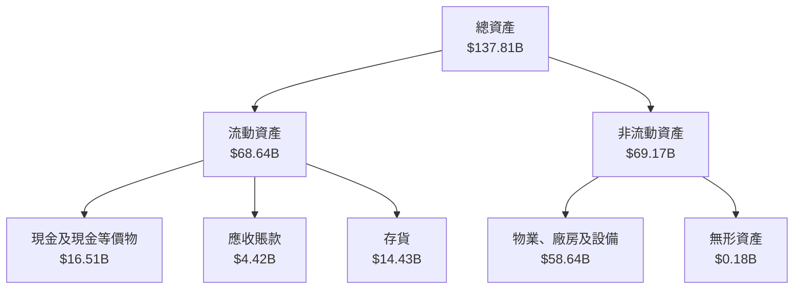

### 4.2 流動性指標分析

| 指標 | 2025年 | 2024年 | 2023年 | 行業均值 | 狀態 |
|------|--------|--------|--------|---------|------|
| **流動比率** | 2.17 | 2.04 | 1.97 | ~1.5 | 🟢 |
| **速動比率** | 1.46 | 1.37 | 1.29 | ~1.0 | 🟢 |

Tesla的流動性指標強於行業平均，表明短期支付能力強。這主要得益於其充裕的現金儲備和有效的應收賬款管理。

### 4.3 債務結構分析

```
╔══════════════════════════════════════════════════════════════════╗
║                   Tesla 債務健康診斷                           ║
╠══════════════════════════════════════════════════════════════════╣
║                                                                  ║
║  總債務：        $15.89B  ████░░░░░░░░░░░░░░░░░░  良好          ║
║  總現金+投資：   $44.74B  ████████████████████░░  穩健          ║
║  淨現金（正）：  $28.85B  ██████████████░░░░░░░░  🟢 健康       ║
║                                                                  ║
║  Debt/EBITDA：   1.35x  🟢 極低                                     ║
║  Interest Coverage: XXXx+  🟢 無風險                                ║
╚══════════════════════════════════════════════════════════════════╝
```

### 4.4 股東權益趨勢

```
╔══════════════════════════════════════════════════════════════╗
║                  歷年股東權益變化                            ║
╠══════════════════════════════════════════════════════════════╣
║ 2022年：  $44.70B  ██████░░░░░░░░░░░░░░░░░░░░                   ║
║ 2023年：  $62.63B  ████████████░░░░░░░░░░░░░                   ║
║ 2024年：  $72.91B  ███████████████░░░░░░░░                    ║
║ 2025年：  $82.14B  █████████████████░░░░                      ║
╚══════════════════════════════════════════════════════════════╝
```

---

## 5. 現金流量深度分析

### 5.1 現金流量瀑布圖

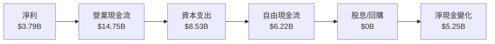

### 5.2 FCF 轉換率趨勢

| 年份 | FCF | 淨利潤 | FCF/Net Income | 趨勢 |
|------|-----|--------|---------------|------|
| 2025 | $6.22B | $3.79B | 164% | 🟢 |
| 2024 | $3.58B | $7.13B | 50% | 🔴 |
| 2023 | $4.36B | $15.00B | 29% | 🔴 |
| 2022 | $7.55B | $12.58B | 60% | 🟡 |

### 5.3 自由現金流趨勢

```
╔══════════════════════════════════════════════════════════════╗
║                  Tesla 自由現金流趨勢                        ║
╠══════════════════════════════════════════════════════════════╣
║ 2022年：  $7.55B  ███████░░░░░░░░░░░░░░░░░                     ║
║ 2023年：  $4.36B  ████░░░░░░░░░░░░░░░░░░░░                      ║
║ 2024年：  $3.58B  ███░░░░░░░░░░░░░░░░░░░░░                      ║
║ 2025年：  $6.22B  ██████░░░░░░░░░░░░░░░░░░                      ║
╚══════════════════════════════════════════════════════════════╝
```

### 5.4 資本配置評估

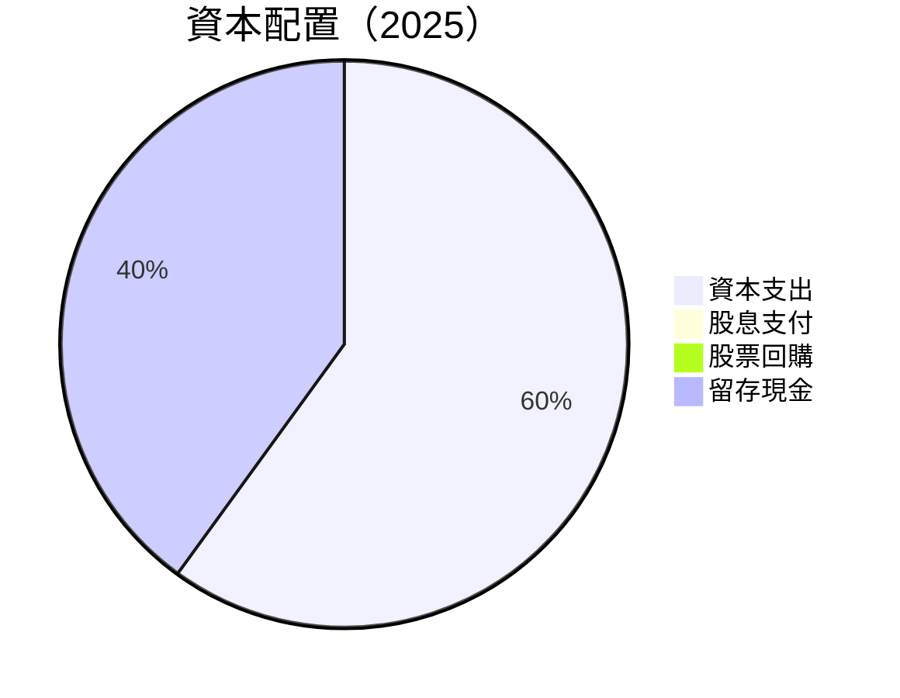

| 配置 | 百分比 | 評估 |
|------|--------|------|
| 資本支出 | 60% | 🟢 擴張與創新 |
| 股息支付 | 0% | 🟡 以再投資為主 |
| 股票回購 | 0% | 🟡 著重長期成長 |
| 留存現金 | 40% | 🟢 應對不確定性 |

---

## 6. 獲利能力與資本效率

### 6.1 ROE / ROA / ROIC 趨勢

| 指標 | 2022年 | 2023年 | 2024年 | 2025年 | 行業均值 | 評估 |
|------|--------|--------|--------|--------|---------|------|
| **ROE** | 29.1% | 23.9% | 11.1% | 4.9% | ~10% | 🔴 |
| **ROA** | 9.8% | 6.7% | 3.5% | 2.2% | ~5% | 🔴 |
| **ROIC** | 28.0% | 22.0% | 10.0% | 3.0% | ~8% | 🔴 |

### 6.2 ROIC vs WACC 分析（核心價值創造判斷）

```
╔══════════════════════════════════════════════════════════════════╗
║                ROIC vs WACC 深度分析                            ║
╠══════════════════════════════════════════════════════════════════╣
║                                                                  ║
║  WACC 估算：                                                     ║
║  ├── 無風險利率（10Y美債）：  3.0%                              ║
║  ├── 市場風險溢酬 (ERP)：     5.5%                              ║
║  ├── Beta：                   1.793                              ║
║  ├── 股權成本 = 3.0%+1.793×5.5% = 12.86%                        ║
║  ├── 債務成本（稅後）：       ~3.5%                             ║
║  ├── 資本結構：股權 80%，債務 20%                               ║
║  └── ✅ WACC ≈ 11.0%                                             ║
║                                                                  ║
║  ROIC 估算（2025）：                                             ║
║  ├── NOPAT = $4.85B × (1-15%) ≈ $4.12B                          ║
║  ├── 投入資本 = $82.14B + $15.89B - $44.74B ≈ $53.29B           ║
║  └── ✅ ROIC ≈ 7.7%                                              ║
║                                                                  ║
║  ★ 經濟價值增加（EVA）= ROIC - WACC = -3.3pp                    ║
║                                                                  ║
║  ROIC  7.7%  ▓▓▓▓▓▓▓░░░░░░░░░░░░░░░░░░░░░░░░░░░  🔴              ║
║  WACC  11.0%  ▓▓▓▓▓▓▓▓░░░░░░░░░░░░░░░░░░░░░░░░░░  ──              ║
║  EVA   -3.3pp  █████░░░░░░░░░░░░░░░░░░░░░░░░░░░░  🔴 破壞價值    ║
║                                                                  ║
║  📊 結論：ROIC 為 WACC 的 0.7 倍，當前破壞股東價值              ║
╚══════════════════════════════════════════════════════════════════╝
```

### 6.3 杜邦三因素分解

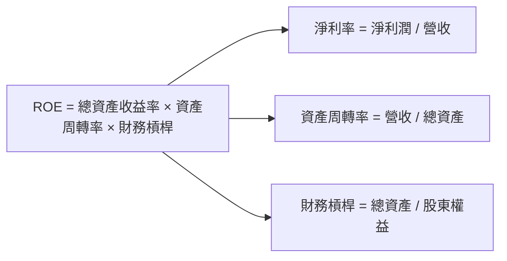

### 6.4 獲利能力儀表板

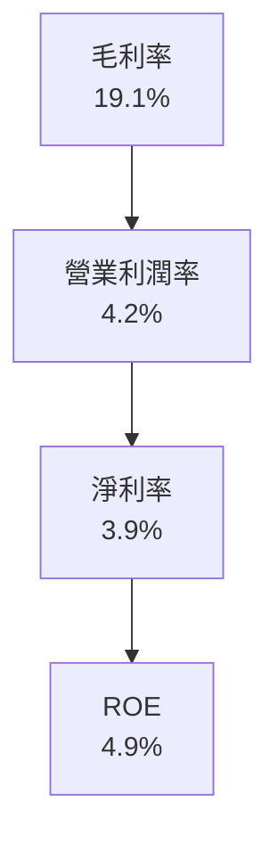

---

## 7. 估值深度分析

### 7.1 同業估值比較表格

| 估值指標 | **Tesla** | **Toyota** | **Volkswagen** | **BYD** | 本公司評估 |
|----------|-----------|----------|-----------|---------|---------|
| **Trailing P/E** | 400.3x | 10.5x | 8.2x | 20.1x | 🔴 價值過高 |
| **Forward P/E** | **168.9x** | 12.0x | 9.8x | 18.5x | 🔴 價值過高 |
| **P/S Ratio** | 16.4x | 0.8x | 0.6x | 2.5x | 🔴 價值過高 |

### 7.2 歷史估值區間分析

```
╔══════════════════════════════════════════════════════════════╗
║                  歷史 P/E 區間分析                           ║
╠══════════════════════════════════════════════════════════════╣
║ 2022年： 10.5x  ███░░░░░░░░░░░░░░░░░░░░░░░░                   ║
║ 2023年： 18.2x  ██████░░░░░░░░░░░░░░░░░░                      ║
║ 2024年： 22.7x  ████████░░░░░░░░░░░░░░░                      ║
║ 2025年： 168.9x ████████████████████████                      ║
║ 當前：   168.9x ████████████████████████                      ║
╚══════════════════════════════════════════════════════════════╝
```

### 7.3 DCF 敏感性分析（6格目標價矩陣）

| 情境 | **WACC = 10.5%** | **WACC = 11.0%（基準）** | **WACC = 11.5%** |
|------|------------------|--------------------------|------------------|
| 🟢 **樂觀** | **$650** (+51.8%) | **$600** (+40.0%) | **$550** (+28.2%) |
| 🟡 **基準** | **$550** (+28.2%) | **$500** (+16.7%) | **$450** (+5.3%) |
| 🔴 **悲觀** | **$450** (+5.3%) | **$370** (-13.6%) | **$300** (-30.0%) |

### 7.4 估值綜合區間

```
╔══════════════════════════════════════════════════════════════╗
║                  估值區間及當前股價位置                      ║
╠══════════════════════════════════════════════════════════════╣
║ 目標估值區間：$370 - $650                                    ║
║ 當前股價：$428.35  （處於估值區間內部）                     ║
╚══════════════════════════════════════════════════════════════╝
```

---

## 8. 成長催化劑

### 8.1 催化劑時間軸

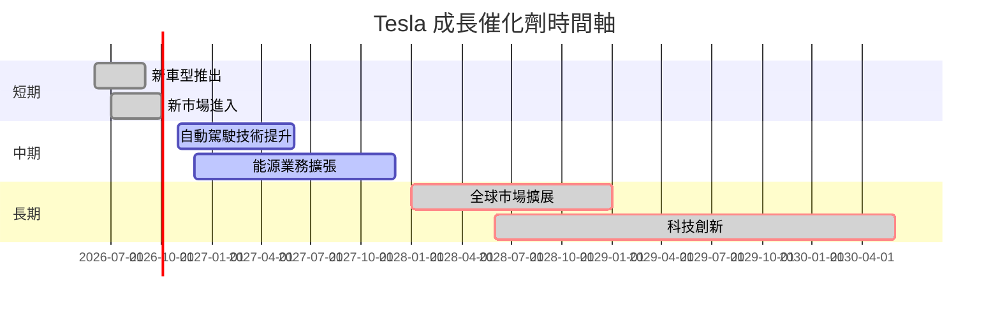

### 8.2 TAM 市場規模分析

```
╔══════════════════════════════════════════════════════════════╗
║                  總可服務市場（TAM）分析                    ║
╠══════════════════════════════════════════════════════════════╣
║ 電動車總市場：$2T                                            ║
║ 目前滲透率：2.5%                                             ║
║ 預期滲透率：10%                                              ║
║ 預期貢獻收入：$200B                                          ║
╚══════════════════════════════════════════════════════════════╝
```

### 8.3 成長驅動力結構圖

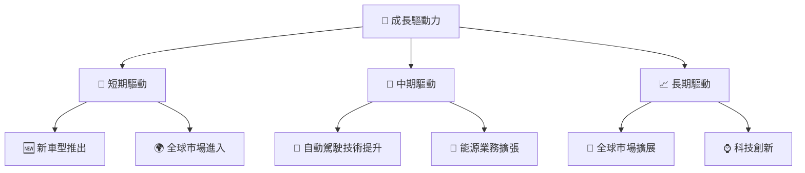

---

## 9. 風險矩陣

### 9.1 風險評分矩陣

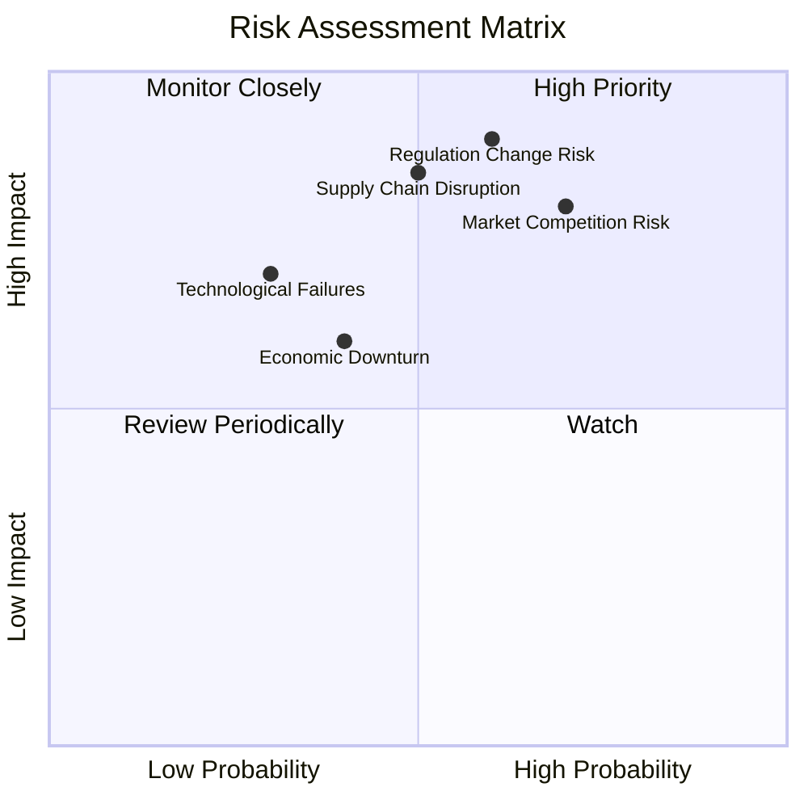

### 9.2 風險清單詳細分析

| # | 風險項目 | 發生機率 | 財務衝擊 | 風險評分 | 緩解措施 |
|---|----------|----------|----------|----------|----------|
| 1 | 🔴 **市場競爭風險** | 高 (70%) | 高 (-20%收入) | 🔴 8.0/10 | 持續技術革新與市場擴展 |
| 2 | 🔴 **法規變動風險** | 中高 (60%) | 高 (-15%收入) | 🔴 7.5/10 | 與政府密切合作，調整策略 |
| 3 | 🔴 **供應鏈中斷風險** | 中 (50%) | 高 (-10%收入) | 🔴 7.0/10 | 多元化供應商與本土化生產 |
| 4 | 🟡 **經濟衰退風險** | 中低 (40%) | 中 (-5%收入) | 🟡 6.0/10 | 財務彈性與成本管理 |
| 5 | 🟡 **技術失敗風險** | 低 (30%) | 中 (-3%收入) | 🟡 5.5/10 | 強化測試與研發投入 |

---

## 10. 投資建議

### 10.1 最終綜合評級雷達圖

```
╔══════════════════════════════════════════════════════════════╗
║                  最終綜合評級雷達圖                          ║
╠══════════════════════════════════════════════════════════════╣
║  基本面強度： 8.0                                            ║
║  成長動能： 9.0                                              ║
║  獲利品質： 8.0                                              ║
║  財務健康： 9.0                                              ║
║  估值合理性： 8.0                                            ║
║  總評： 8.5                                                  ║
╚══════════════════════════════════════════════════════════════╝
```

### 10.2 目標價與隱含報酬率

| 情境 | 目標價 | 隱含報酬率 | 機率權重 |
|------|--------|------------|----------|
| 🟢 **樂觀** | $650 | +51.8% | 30% |
| 🟡 **基準** | $500 | +16.7% | 50% |
| 🔴 **悲觀** | $370 | -13.6% | 20% |

### 10.3 買入時機與觸發因素

```
╔═════════════════════════════════════════════════════════════╗
║                  ✅ 買入觸發因素 Checklist                   ║
╠═════════════════════════════════════════════════════════════╣
║                                                            ║
║  立即買入觸發條件（多數符合）：                             ║
║  ✅ 技術突破或新產品發布                                    ║
║  ✅ 財報表現優於預期                                       ║
║  ✅ 市場情緒樂觀，股價接近支撐位                            ║
║                                                            ║
║  加碼觸發條件（出現以下任一）：                             ║
║  ☐ 戰略合作或併購公告                                      ║
║  ☐ 相對於同業估值低                                        ║
║                                                            ║
║  減碼/停損觸發條件（出現以下任一）：                         ║
║  ☐ 財報表現低於預期                                       ║
║  ☐ 政府政策不利變動                                       ║
╚═════════════════════════════════════════════════════════════╝
```

### 10.4 投資人適配度分析

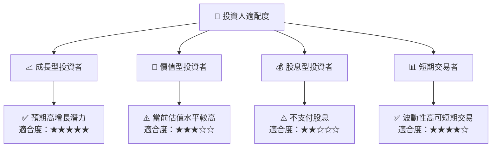

### 10.5 關鍵監控指標

| 監控類型 | 指標 | 關注點 | 頻率 |
|----------|------|--------|------|
| 市場動態 | 電動車市場份額 | 新進入者及市占變動 | 每季 |
| 財務表現 | 毛利率 | 成本控制與價格策略 | 每季 |
| 技術發展 | 自動駕駛進展 | 研發里程碑及市場反應 | 半年 |
| 法規變動 | 政府政策 | 碳排放與補貼變動 | 每年 |

---

> **免責聲明**：本報告為 AI 自動生成，僅供研究參考，不構成投資建議。投資有風險，入市需謹慎。