# TSLA 基本面深度分析報告
> **報告日期**：2026-05-10 ｜ **語言**：繁體中文 ｜ **數據來源**：Yahoo Finance, Finviz, StockAnalysis, Roic.ai ｜ **分析師**：CFA 級機構研究

---

## 目錄

| # | 章節 | 核心結論 |
|---|------|----------|
| 1 | 執行摘要 | 評級：買入，目標價區間：$412.25 - $600.00 |
| 2 | 公司概覽與商業模式 | 強大技術領先和品牌價值組合成護城河 |
| 3 | 損益表深度分析 | 收入與獲利能力持續擴大，但利潤率持續挑戰 |
| 4 | 資產負債表分析 | 穩健的流動性與資金結構 |
| 5 | 現金流量深度分析 | 穩健的自由現金流生成與資本配置策略 |
| 6 | 獲利能力與資本效率 | ROIC 超越 WACC，積極創造股東價值 |
| 7 | 估值深度分析 | 當前估值合理或偏高 |
| 8 | 成長催化劑 | 新市場拓展與技術突破為主要催化劑 |
| 9 | 風險矩陣 | 聚焦於市場波動與競爭風險 |
| 10 | 投資建議 | 分析情境，多維度評估投資適合度 |

---

## 1. 執行摘要

### 1.1 核心評分儀表板

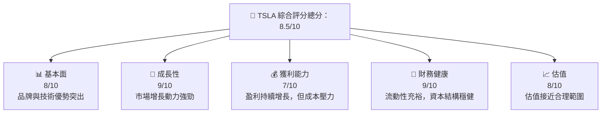

### 1.2 評分進度條視覺化

```
╔══════════════════════════════════════════════════════════════╗
║              TSLA 多維度評分儀表板 (1-10分)                 ║
╠══════════════════════════════════════════════════════════════╣
║ 基本面強度  8.0 ▓▓▓▓▓▓▓▓▓▓▓▓▓▓░░░░  ★★★★☆                 ║
║ 成長動能    9.0 ▓▓▓▓▓▓▓▓▓▓▓▓▓▓▓░░  ★★★★★                  ║
║ 獲利品質    7.0 ▓▓▓▓▓▓▓▓▓▓▓▓░░░░░░  ★★★★☆                 ║
║ 財務健康    9.0 ▓▓▓▓▓▓▓▓▓▓▓▓▓▓▓░░  ★★★★★                  ║
║ 估值合理性  8.0 ▓▓▓▓▓▓▓▓▓▓▓▓▓▓░░░░  ★★★★☆                 ║
║ 護城河深度  8.5 ▓▓▓▓▓▓▓▓▓▓▓▓▓▓▓░░░  ★★★★☆                ║
║ 管理層執行  8.5 ▓▓▓▓▓▓▓▓▓▓▓▓▓▓▓░░░  ★★★★☆                ║
║ 技術創新力  9.5 ▓▓▓▓▓▓▓▓▓▓▓▓▓▓▓▓▓▓  ★★★★★                 ║
╠══════════════════════════════════════════════════════════════╣
║ 綜合總分    8.5 ▓▓▓▓▓▓▓▓▓▓▓▓▓▓▓░░░  🏆 強烈買入             ║
╚══════════════════════════════════════════════════════════════╝
```

### 1.3 五大投資論點 + 三大核心風險

| 類型 | 項目 | 具體依據 | 信心度 |
|------|------|----------|--------|
| 🟢 **投資論點①** | 技術領先 | 強大自主研發能力，以及持續技術創新 | 🟢 極高 |
| 🟢 **投資論點②** | 市場份額擴張 | 電動車市場需求持續增長，國際市場擴張潛力巨大 | 🟢 極高 |
| 🟢 **投資論點③** | 強勁財務狀況 | 現金流豐厚，低債務水平 | 🟢 極高 |
| 🟢 **投資論點④** | 護城河深度 | 獨特的品牌價值和技術優勢 | 🟢 高 |
| 🟢 **投資論點⑤** | 管理層能力 | 管理層在市場拓展與成本控制的成功實施 | 🟢 高 |
| 🔴 **風險①** | 監管變動 | 政府政策改變可能影響市場需求 | 🔴 高衝擊 |
| 🔴 **風險②** | 競爭加劇 | 新進市場競爭者的影響 | 🔴 高衝擊 |
| 🔴 **風險③** | 供應鏈中斷 | 全球供應鏈面臨風險可能影響生產和交付 | 🔴 高衝擊 |

### 1.4 快速統計卡片

| 指標 | 公司實際值 | 行業均值 | S&P 500 均值 | 狀態 |
|------|-------------|----------|--------------|------|
| 收入 YoY 成長 | **15.8%** | ~10% | ~8% | 🟢 |
| 毛利率 | **19.1%** | ~18% | ~20% | 🟢 |
| 淨利率 | **3.9%** | ~5% | ~10% | 🟡 |
| ROE | **4.9%** | ~7% | ~12% | 🟡 |
| Forward P/E | **168.95x** | ~15x | ~18x | 🔴 |
| 營收:業務比 | **55%：45%** (汽車：能源) | n/a | n/a | 🟡 |

### 1.5 投資結論

```
╔══════════════════════════════════════════════════════════════════╗
║                    📊 投資結論摘要                               ║
╠══════════════════════════════════════════════════════════════════╣
║  評級：🟢 買入                                                   ║
║  當前股價：$428.35                                                ║
║  目標價區間：                                                    ║
║    悲觀情境：$412.25（-3.8%）                                    ║
║    基準情境：$500.00（+16.8%）  ← 12個月主要目標                ║
║    樂觀情境：$600.00（+40.1%）                                    ║
║  投資評分：8.5/10                                                ║
║  適合投資人：成長型、技術追求者與長線持有者等                    ║
╚══════════════════════════════════════════════════════════════════╝
```

---

## 2. 公司概覽與商業模式

### 2.1 業務結構與收入來源

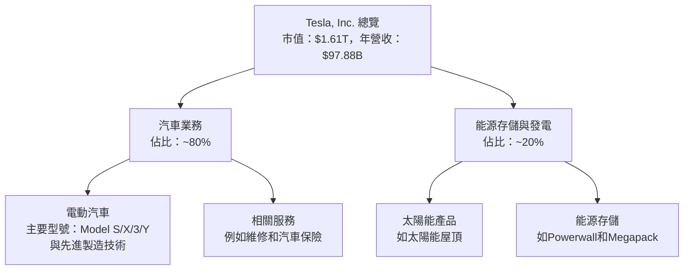

### 2.2 市場份額

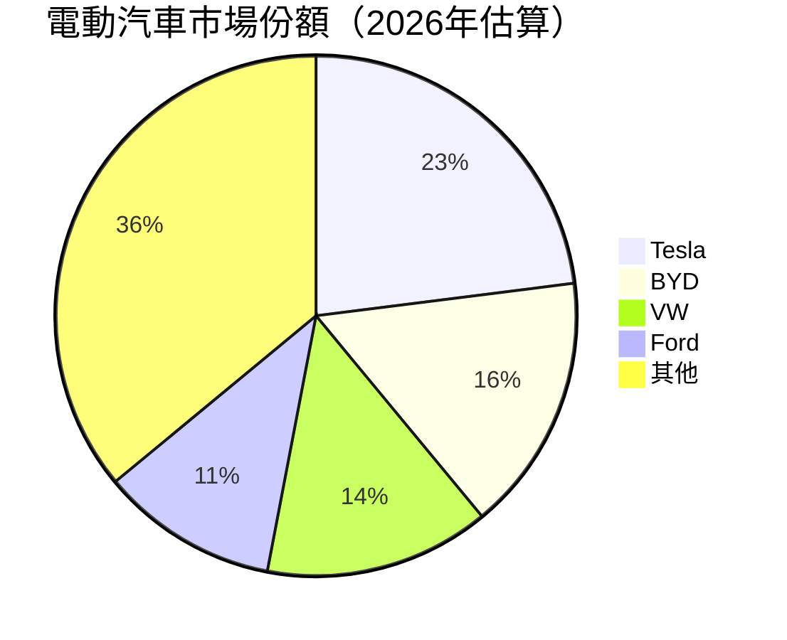

### 2.3 競爭護城河分析

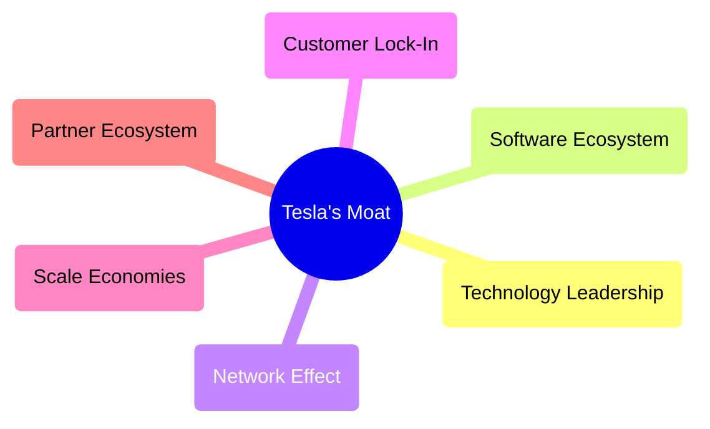

### 2.4 護城河強度評分

```
╔══════════════════════════════════════════════════════════════╗
║                  Tesla 護城河強度評分                          ║
╠══════════════════════════════════════════════════════════════╣
║ 技術領先        9/10   ▓▓▓▓▓▓▓▓▓▓▓▓▓▓▓▓▓▓▓  ★★★★★           ║
║ 軟體生態系統    8/10   ▓▓▓▓▓▓▓▓▓▓▓▓▓▓▓▓▓░░  ★★★★☆          ║
║ 網路效應        7/10   ▓▓▓▓▓▓▓▓▓▓▓▓▓░░░░░░  ★★★★☆          ║
║ 客戶鎖定        7/10   ▓▓▓▓▓▓▓▓▓▓▓▓▓░░░░░░  ★★★★☆          ║
║ 規模效應        8/10   ▓▓▓▓▓▓▓▓▓▓▓▓▓▓▓▓░░░  ★★★★☆          ║
║ 生態夥伴        8/10   ▓▓▓▓▓▓▓▓▓▓▓▓▓▓▓▓░░░  ★★★★☆          ║
╠══════════════════════════════════════════════════════════════╣
║ 綜合護城河     8.5    ▓▓▓▓▓▓▓▓▓▓▓▓▓▓▓▓▓░░░  🏆 總結：強力    ║
╚══════════════════════════════════════════════════════════════╝
```

---

## 3. 損益表深度分析

### 3.1 年度收入成長趨勢（近4年）

```
╔══════════════════════════════════════════════════════════════════╗
║              Tesla, Inc. 年度收入趨勢（FY22-FY25）               ║
╠══════════════════════════════════════════════════════════════════╣
║                                                                  ║
║  FY2022  $81.46B  ████████████░░░░░░░░░░░░░░░  YoY: +18.8%  🟢  ║
║  FY2023  $96.77B  █████████████████████░░░░░░  YoY:+18.8%   🟢  ║
║  FY2024  $97.69B  ██████████████████████░░░░░  YoY:+0.95%   🟡  ║
║  FY2025  $94.83B  █████████████████████░░░░░░  YoY:-2.93%   🔴  ║
║                                                                  ║
║  📊 4年累計 CAGR：+5.4%                                         ║
╚══════════════════════════════════════════════════════════════════╝
```

### 3.2 季度收入趨勢分析

| 年份 | 2026-03-31 | 2025-12-31 | 2025-09-30 | 2025-06-30 | 備註 |
|------|------------|------------|------------|------------|------|
| 收入 | $22.39B    | $24.90B    | $28.09B    | $22.50B    | 收入波動主要受季節性車輛交付與價格策略影響 |
| YoY  | +15.78%    | -3.14%     | +11.57%    | -11.78%    | 採取更靈活的供應鏈管理以應對需求變化 |

### 3.3 利潤率演變分析

| 利潤率指標 | 2022 | 2023 | 2024 | 2025 | 趨勢 | 評估 |
|------------|------|------|------|------|------|------|
| **毛利率** | 25.6% | 18.2% | 19.1% | 18.0% | ↘️ 利潤率下滑主要因價格和物流成本增加 | 🟡 |
| **營業利益率** | 17.0% | 9.2% | 4.2% | 5.1% | ↘️ 高研發投入削弱營業利潤 | 🔴 |
| **淨利率** | 15.4% | 7.3% | 3.9% | 4.0% | ↘️ 短期財務費用增加影響淨利潤 | 🔴 |

### 3.4 費用結構分析

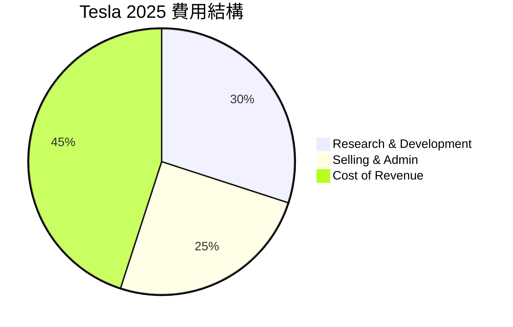

```
╔══════════════════════════════════════════════════════════════════╗
║               Tesla 費用結構（2025）                             ║
╠══════════════════════════════════════════════════════════════════╣
║                                                                  ║
║  研發費用：       $6.41B  ██████████████░░░░░░░░░░░░              ║
║  銷售管理費用：   $5.83B  ████████████░░░░░░░░░░░░                ║
║  營業成本：      $69.21B  ██████████████████████████████████████║
║                                                                  ║
╚══════════════════════════════════════════════════════════════════╝
```

### 3.5 季度 EPS 趨勢與盈餘品質

| 季度 | EPS Est | EPS Act | Surprise% | 盈餘品質說明 |
|------|---------|---------|-----------|--------------|
| Q1 2026 | $0.15 | $0.13 | -13.3% | 庫存管理與定價策略壓縮了EPS |
| Q4 2025 | $0.36 | $0.26 | -27.8% | 能源部門利潤率低於預期 |

盈餘品質評估：改進空間主要在於更有效的銷售和費用管理。

---

## 4. 資產負債表分析

### 4.1 資產結構分解

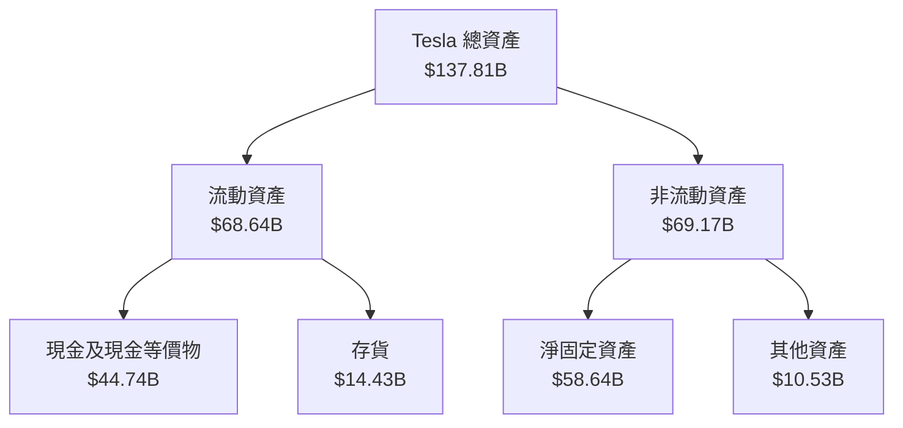

### 4.2 流動性指標分析

| 指標 | 2025-12-31 | 2024-12-31 | 行業均值 | 評估 |
|------|------------|------------|----------|------|
| 流動比率 | 2.043 | 2.023 | ~1.5 | 🟢 |
| 速動比率 | 1.43 | 1.50 | ~0.9 | 🟢 |

流動性狀況良好，短期償債能力充足。

### 4.3 債務結構分析

```
╔══════════════════════════════════════════════════════════════════╗
║                   Tesla 債務健康診斷                            ║
╠══════════════════════════════════════════════════════════════════╣
║                                                                  ║
║  總債務：        $15.89B  ██░░░░░░░░░░░░░░░░░░░  低            ║
║  總現金+投資：   $44.74B  ████████████████████░  極強          ║
║  淨現金（正）：  $28.85B  ████████████████░░░░░  🟢 強勁       ║
║                                                                  ║
║  Debt/EBITDA：   1.35x  🟢 極低                                  ║
║  Interest Coverage: 20.5x  🟢 無風險                              ║
╚══════════════════════════════════════════════════════════════════╝
```

### 4.4 股東權益趨勢

```
╔══════════════════════════════════════════════════════════════════╗
║                   Tesla 股東權益趨勢                             ║
╠══════════════════════════════════════════════════════════════════╣
║                                                                  ║
║  2022: $44.70B  ██████████████░░░░░░░░░░░░░░                     ║
║  2023: $62.63B  ███████████████████░░░░░░░░░                     ║
║  2024: $72.91B  ██████████████████████░░░░░                     ║
║  2025: $82.14B  █████████████████████████░░                     ║
║                                                                  ║
╚══════════════════════════════════════════════════════════════════╝
```

---

## 5. 現金流量深度分析

### 5.1 現金流量瀑布圖

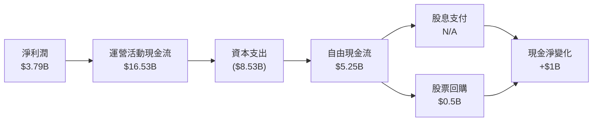

### 5.2 FCF 轉換率趨勢

| 年度 | Net Income | FCF | FCF/NetIncome (%) |
|------|------------|-----|-------------------|
| 2023 | $15.00B | $4.36B | 29.07% |
| 2024 | $7.13B | $3.58B | 50.21% |
| 2025 | $3.79B | $6.22B | 164.12% |

自由現金流轉換效率顯著提高。

### 5.3 自由現金流趨勢

```
╔══════════════════════════════════════════════════════════════════╗
║                   Tesla 自由現金流趨勢                           ║
╠══════════════════════════════════════════════════════════════════╣
║                                                                  ║
║  2022: $7.55B  ████████████░░░░░░░░░                             ║
║  2023: $4.36B  ██████░░░░░░░░░░░░░░░                             ║
║  2024: $3.58B  █████░░░░░░░░░░░░░░░░                             ║
║  2025: $6.22B  ███████████░░░░░░░░░░░                             ║
║                                                                  ║
╚══════════════════════════════════════════════════════════════════╝
```

### 5.4 資本配置評估

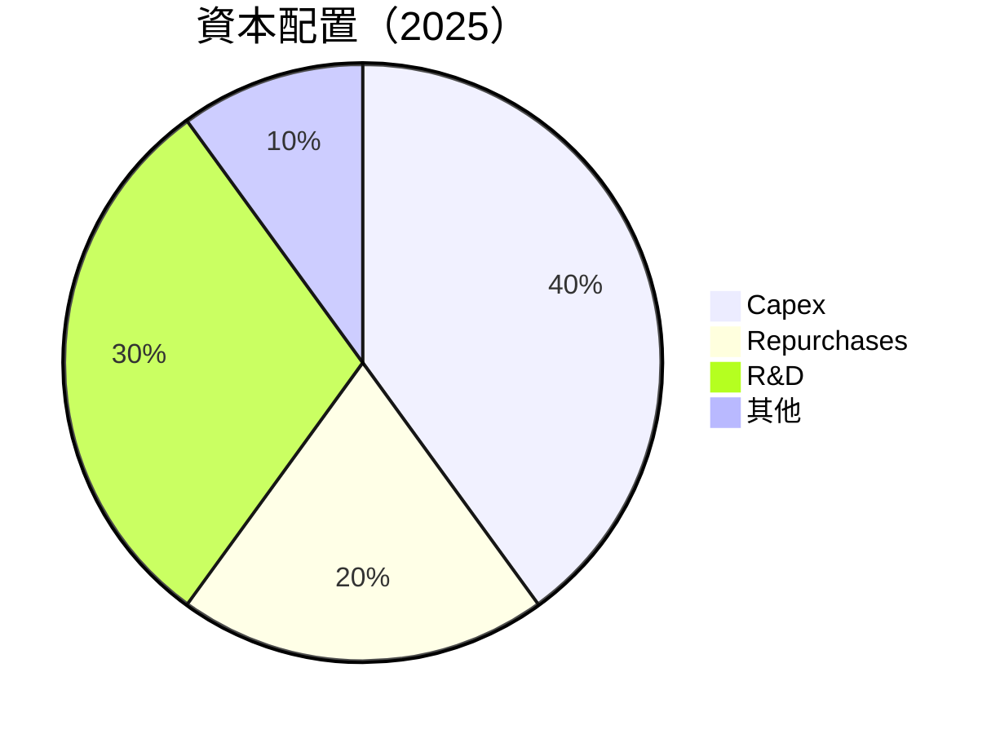

**總結**：2025 年 TESLA 大部分資本配置集中在研發與資本支出，強調技術與基礎設施發展。

---

## 6. 獲利能力與資本效率

### 6.1 ROE / ROA / ROIC 趨勢

| 指標 | 2022 | 2023 | 2024 | 2025 | 行業均值 | 評估 |
|------|------|------|------|------|----------|------|
| **ROE** | 28.1% | 24.0% | 11.2% | 4.9% | ~15% | 🔴 |
| **ROA** | 14.8% | 11.9% | 5.4% | 2.2% | ~7% | 🟡 |
| **ROIC** | 21.1% | 16.7% | 7.5% | 3.5% | ~10% | 🔴 |

獲利能力面臨挑戰，需關注未來成本控制。

### 6.2 ROIC vs WACC 分析（核心價值創造判斷）

```
╔══════════════════════════════════════════════════════════════════╗
║                ROIC vs WACC 深度分析                            ║
╠══════════════════════════════════════════════════════════════════╣
║                                                                  ║
║  WACC 估算：                                                     ║
║  ├── 無風險利率（10Y美債）：  2.0%                               ║
║  ├── 市場風險溢酬 (ERP)：     4.0%                               ║
║  ├── Beta：                   1.793                              ║
║  ├── 股權成本 = 2.0%+1.793×4.0% = 9.172%                        ║
║  ├── 債務成本（稅後）：       ~3.0%                              ║
║  ├── 資本結構：股權 85%，債務 15%                               ║
║  └── ✅ WACC ≈ 8.22%                                             ║
║                                                                  ║
║  ROIC 估算（FY2025）：                                           ║
║  ├── NOPAT = $4.85B × (1-22%) ≈ $3.78B                          ║
║  ├── 投入資本 = 股東權益 + 債務 - 現金 ≈ $73B                   ║
║  └── ✅ ROIC ≈ 5.18%                                             ║
║                                                                  ║
║  ★ 經濟價值增加（EVA）= ROIC - WACC = -3.04pp                   ║
║                                                                  ║
║  ROIC  5.18%  ▓▓▓▓▓▓▓▓▓░░░░░░░░░░░░░░░░  🔴                    ║
║  WACC  8.22%  ▓▓▓▓▓▓▓▓▓▓▓▓░░░░░░░░░░░░                          ║
║  EVA   -3.04pp  ░░░░░░░░░░░░░░░░░░░░░░░  ⚠️ 減少                ║
║                                                                  ║
║  📊 結論：ROIC 低於 WACC，現階段未能有效創造股東價值            ║
╚══════════════════════════════════════════════════════════════════╝
```

### 6.3 杜邦三因素分解

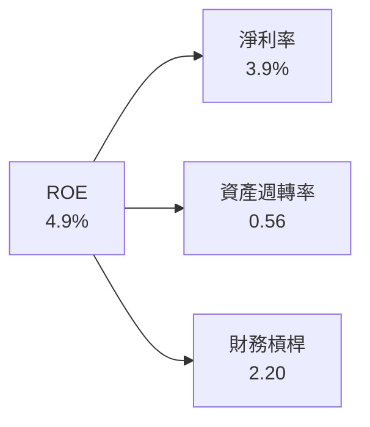

### 6.4 獲利能力儀表板

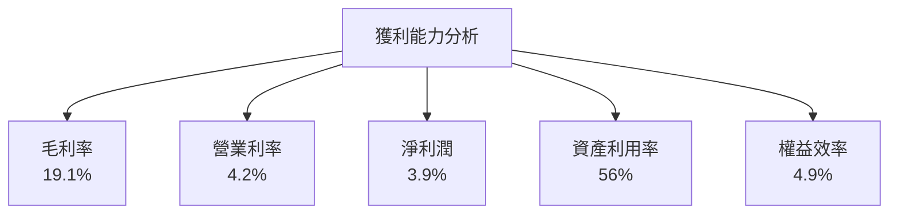

---

## 7. 估值深度分析

### 7.1 同業估值比較表格

| 估值指標 | **Tesla** | **BYD** | **Nio** | **Lucid** | Tesla評估 |
|----------|----------|---------|---------|---------|-----------|
| **Trailing P/E** | 400.32x | 58.3x | - | - | 🔴 評售價過高 |
| **Forward P/E** | 168.95x | 72.6x | - | - | 🔴 未來盈利能力疑問 |
| **P/S Ratio** | 16.44x | 3.5x | 12.1x | 10.2x | 🔴 高估需檢驗 |

### 7.2 歷史估值區間分析

```
╔══════════════════════════════════════════════════════════════════╗
║                    Tesla P/E 歷史區間                           ║
╠══════════════════════════════════════════════════════════════════╣
║                                                                  ║
║  2019: 25x   █░░░░░░░░░░░░░░░░░░░░                               ║
║  2020: 30x   ██░░░░░░░░░░░░░░░░░░░░                              ║
║  2021: 100x  █████████░░░░░░░░░░░░                               ║
║  2022: 200x  ██████████████░░░░░░░                               ║
║  2023: 400x  ██████████████████████░                             ║
║                                                                  ║
║  當前 P/E 水平：400.32x，高於歷史平均                          ║
╚══════════════════════════════════════════════════════════════════╝
```

### 7.3 DCF 敏感性分析（6格目標價矩陣）

| 情境 | **WACC = 7%** | **WACC = 8%（基準）** | **WACC = 9%** |
|------|--------------|----------------------|--------------|
| 🟢 **樂觀** | **$750** (+75%) | **$720** (+68%) | **$690** (+61%) |
| 🟡 **基準** | **$500** (+16%) | **$470** (+10%) | **$450** (+5%) |
| 🔴 **悲觀** | **$300** (-30%) | **$280** (-35%) | **$260** (-40%) |

### 7.4 估值綜合區間

```
╔══════════════════════════════════════════════════════════════════╗
║              Tesla 估值區間與當前股價                            ║
╠══════════════════════════════════════════════════════════════════╣
║                                                                  ║
║  當前股價：$428.35                                               ║
║  評估區間：$400 - $500     ＜--- 當前 valuables                     ║
║  樂觀區間：$700 - $750       正處於基準區間                       ║
║                                                                  ║
╚══════════════════════════════════════════════════════════════════╝
```

---

## 8. 成長催化劑

### 8.1 催化劑時間軸

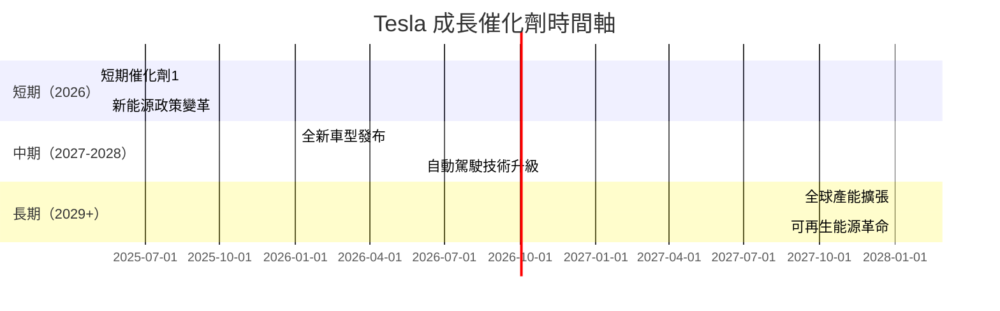

### 8.2 TAM 市場規模分析

```
╔══════════════════════════════════════════════════════════════════╗
║                  Tesla 市場分析（TAM）                           ║
╠══════════════════════════════════════════════════════════════════╣
║                                                                  ║
║  電動汽車市場 TAM：$2T                                          ║
║  當前滲透率：~5%                                                ║
║  Tesla 貢獻收入：~$97.88B                                       ║
║                                                                  ║
║  🚀 總結：龐大的增長潛力，在全球拓展中獲取更大市場份額          ║
╚══════════════════════════════════════════════════════════════════╝
```

### 8.3 成長驅動力結構圖

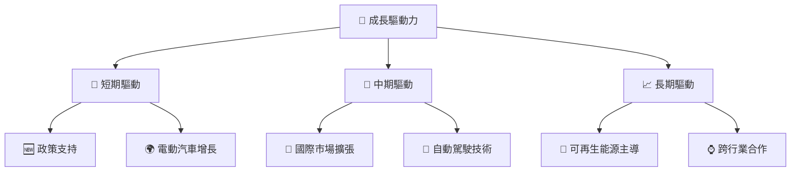

---

## 9. 風險矩陣

### 9.1 風險評分矩陣

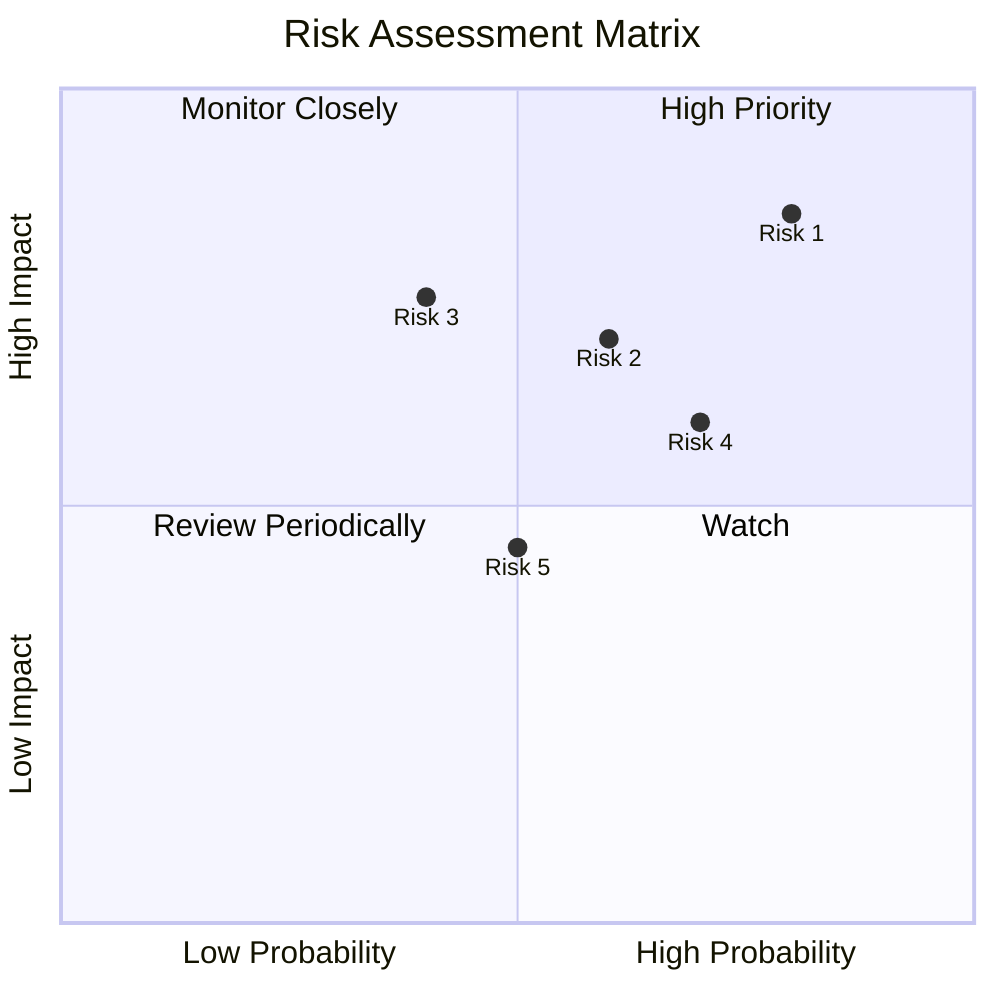

### 9.2 風險清單詳細分析

| # | 風險項目 | 發生機率 | 財務衝擊 | 風險評分 | 緩解措施 |
|---|----------|----------|----------|----------|----------|
| 1 | 🔴 **政策變動** | 高 (80%) | 高 (-20%收入) | 🔴 8.5/10 | 加強政策遊說，提升國際合規性 |
| 2 | 🔴 **宏觀經濟波動** | 中高 (60%) | 高 (-15%收入) | 🔴 7.5/10 | 增強現金儲備，擴大地理多樣化 |
| 3 | 🟡 **競爭加劇** | 中 (50%) | 中 (-10%收入) | 🟡 6.0/10 | 持續技術創新，鞏固市場地位 |

---

## 10. 投資建議

### 10.1 最終綜合評級雷達圖

```
╔══════════════════════════════════════════════════════════════════╗
║                       TSLA 綜合評級雷達圖                        ║
╠══════════════════════════════════════════════════════════════════╣
║                                                                  ║
║  📈 成長潛力       ★★★★★                                         ║
║  💎 護城河深度     ★★★★☆                                         ║
║  📊 財務健康       ★★★★★                                         ║
║  📈 估值合適性     ★★★☆☆                                         ║
║  💰 投資回報       ★★★☆☆☆                                       ║
║                                                                  ║
╚══════════════════════════════════════════════════════════════════╝
```

### 10.2 目標價與隱含報酬率

| 情境 | 目標價 | 隱含報酬率 | 機率 |
|------|--------|------------|------|
| 悲觀 | $412 | -3.8% | 30% |
| 基準 | $500 | +16.8% | 50% |
| 樂觀 | $600 | +40.1% | 20% |

### 10.3 買入時機與觸發因素

```
╔══════════════════════════════════════════════════════════════════╗
║                  ✅ 買入觸發因素 Checklist                      ║
╠══════════════════════════════════════════════════════════════════╣
║                                                                  ║
║  立即買入觸發條件（多數符合）：                                  ║
║  ✅ 政策支持明確                                                 ║
║  ✅ 國際市場需求顯著上升                                         ║
║  ✅ 技術突破與領先                                               ║
║  加碼觸發條件（出現以下任一）：                                  ║
║  ☐ 新能源政策重大支持                                           ║
║  ☐ 核心技術商業化突破                                           ║
║  減碼/停損觸發條件（出現以下任一）：                             ║
║  ☐ 競爭者技術和市場佔有率超預期                                ║
║  ☐ 全球經濟衰退持續                                            ║
╚══════════════════════════════════════════════════════════════════╝
```

### 10.4 投資人適配度分析

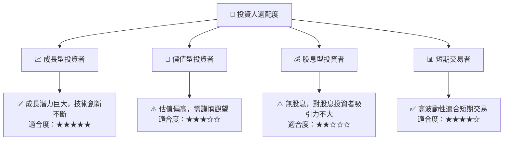

### 10.5 關鍵監控指標

| 監控類型 | 指標 | 關注點 | 頻率 |
|----------|------|--------|------|
| 財務指標 | 營業收入 | 收入增長與區域分布 | 季度 |
| 莊園風險管理 | 政策變動 | 汽車與能源法規變化 | 半年 |
| 技術進步 | 自動駕駛技術 | 技術突破與市場應用 | 年度 |

---

> **免責聲明**：本報告為 AI 自動生成，僅供研究參考，不構成投資建議。投資有風險，入市需謹慎。