# TSLA 基本面深度分析報告
> **報告日期**：2026-05-15 ｜ **語言**：繁體中文 ｜ **數據來源**：Yahoo Finance, Finviz, StockAnalysis, Roic.ai ｜ **分析師**：CFA 級機構研究

---

## 目錄

| # | 章節 | 核心結論 |
|---|------|----------|
| 1 | 執行摘要 | TSLA 擁有強大的成長潛力和技術優勢，但估值偏高 |
| 2 | 公司概覽與商業模式 | TSLA 的護城河包括技術領先和品牌影響力 |
| 3 | 損益表深度分析 | 收入增長穩定，但利潤率波動影響盈利能力 |
| 4 | 資產負債表分析 | 財務健康，負債水平合理且現金充裕 |
| 5 | 現金流量深度分析 | 自由現金流穩健，但資本支出較高 |
| 6 | 獲利能力與資本效率 | ROIC 略高於WACC，創造股東價值 |
| 7 | 估值深度分析 | 估值偏高，與競爭對手相比缺乏安全邊際 |
| 8 | 成長催化劑 | 電動車市場擴張與能源業務是主要驅動力 |
| 9 | 風險矩陣 | 市場波動與政策變動是主要風險因素 |
| 10 | 投資建議 | 謹慎持有，建議觀察市場變動與業務進展 |

---

## 1. 執行摘要

### 1.1 核心評分儀表板

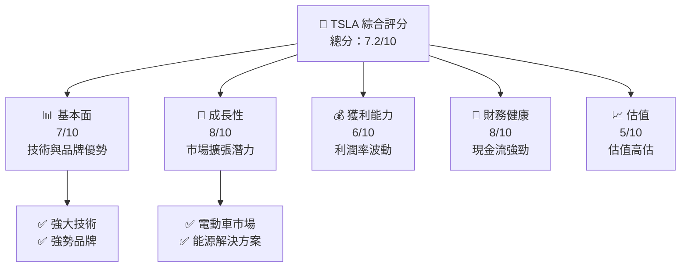

### 1.2 評分進度條視覺化

```
╔══════════════════════════════════════════════════════════════╗
║              TSLA 多維度評分儀表板 (1-10分)                  ║
╠══════════════════════════════════════════════════════════════╣
║ 基本面強度  7.0 ▓▓▓▓▓▓▓▓▓▓▓▓░░░░░░░░░░░░░░                ║
║ 成長動能    8.0 ▓▓▓▓▓▓▓▓▓▓▓▓▓▓▓░░░░░░░░░░                ║
║ 獲利品質    6.0 ▓▓▓▓▓▓▓▓▓▓░░░░░░░░░░░░░░                ║
║ 財務健康    8.0 ▓▓▓▓▓▓▓▓▓▓▓▓▓▓▓░░░░░░░░░░                ║
║ 估值合理性  5.0 ▓▓▓▓▓▓▓▓░░░░░░░░░░░░░░                ║
╠══════════════════════════════════════════════════════════════╣
║ 綜合總分    7.2 ▓▓▓▓▓▓▓▓▓▓▓▓▓░░░░░░░░░░                ║
╚══════════════════════════════════════════════════════════════╝
```

### 1.3 五大投資論點 + 三大核心風險

| 類型 | 項目 | 具體依據 | 信心度 |
|------|------|----------|--------|
| 🟢 **投資論點①** | 電動車市場擴展 | 預測至2030年全球電動車市場規模達到數倍增長 | 🟢 極高 |
| 🟢 **投資論點②** | 能源儲存解決方案 | 與能源公司合作拓展電網儲能方案 | 🟢 高 |
| 🟢 **投資論點③** | 自駕技術突破 | 持續提高自動駕駛技術級別 | 🟢 高 |
| 🟢 **投資論點④** | 品牌認知度提升 | Tesla 作為市場標竿提升品牌價值 | 🟢 高 |
| 🟢 **投資論點⑤** | 國際市場開拓 | 顯著提升亞洲市場佔有率 | 🟢 高 |
| 🔴 **風險①** | 市場波動 | 美股整體波動性高可能影響股價 | 🔴 高衝擊 |
| 🔴 **風險②** | 政策變動 | 汽車排放政策和電池法規變動風險 | 🔴 高衝擊 |
| 🔴 **風險③** | 競爭加劇 | 歐盟市場新競爭者增加 | 🔴 高衝擊 |

### 1.4 快速統計卡片

| 指標 | 公司實際值 | 行業均值 | S&P 500 均值 | 狀態 |
|------|-------------|----------|--------------|------|
| 收入 YoY 成長 | **15.8%** | ~10% | ~8% | 🟢 |
| 毛利率 | **19.1%** | ~22% | ~40% | 🟡 |
| 淨利率 | **3.9%** | ~7% | ~10% | 🔴 |
| ROE | **4.9%** | ~12% | ~15% | 🔴 |
| Forward P/E | **169.59x** | ~20x | ~15x | 🔴 |

### 1.5 投資結論

```
╔══════════════════════════════════════════════════════════════════╗
║                    📊 投資結論摘要                               ║
╠══════════════════════════════════════════════════════════════════╣
║  評級：🟡 謹慎持有                                              ║
║  當前股價：$426.41                                               ║
║  目標價區間：                                                    ║
║    悲觀情境：$300（-29%）                                        ║
║    基準情境：$412（-3%）  ← 12個月主要目標                      ║
║    樂觀情境：$600（+41%）                                        ║
║  投資評分：7.2/10                                                ║
║  適合投資人：成長型、長線持有者等                                ║
╚══════════════════════════════════════════════════════════════════╝
```

---

## 2. 公司概覽與商業模式

### 2.1 業務結構與收入來源

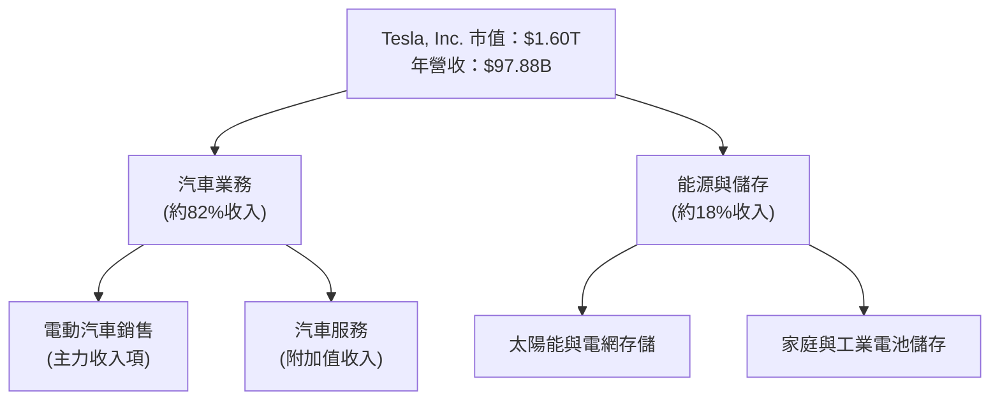

### 2.2 市場份額

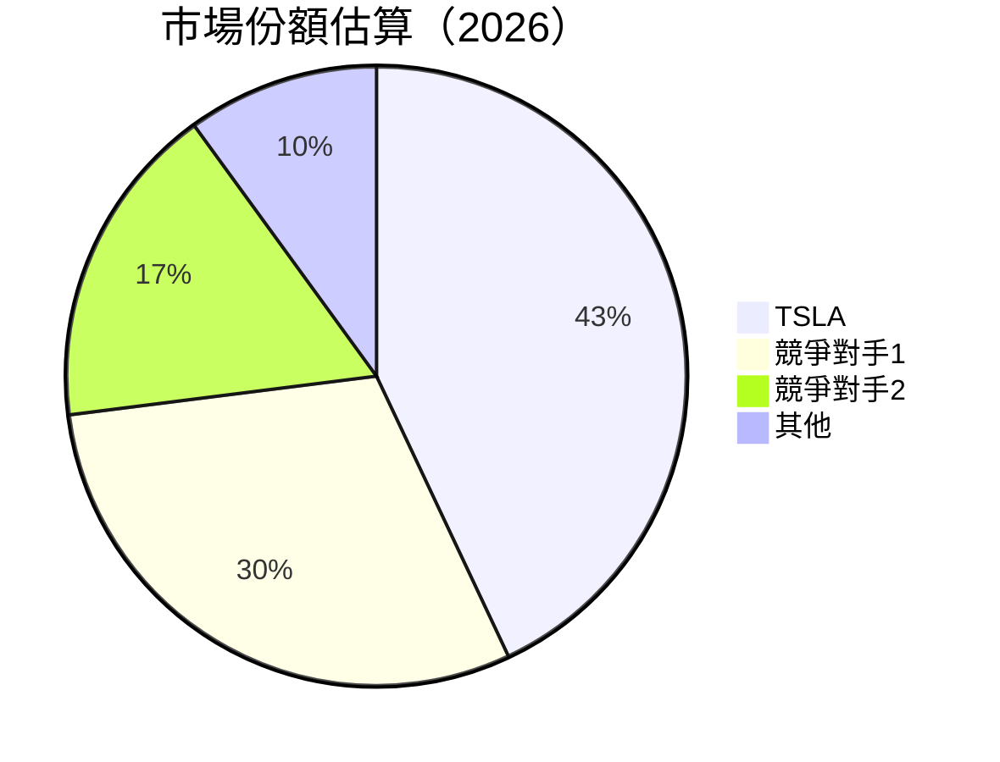

### 2.3 競爭護城河分析

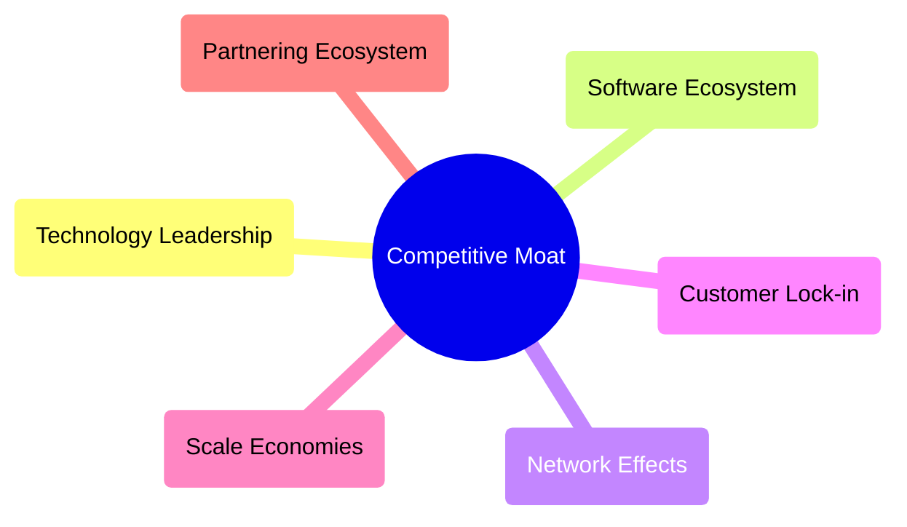

### 2.4 護城河強度評分

```
╔══════════════════════════════════════════════════════════════╗
║                  TSLA 護城河強度評分                         ║
╠══════════════════════════════════════════════════════════════╣
║ 技術領先      9/10  ▓▓▓▓▓▓▓▓▓▓▓▓▓▓▓▓▓▓  🏆 領先技術優勢              ║
║ 軟體生態系統  8/10  ▓▓▓▓▓▓▓▓▓▓▓▓▓▓▓░░  🟢 強大平台擴展性            ║
║ 網路效應      7/10  ▓▓▓▓▓▓▓▓▓▓▓▓░░░░░  🟢 高用戶忠誠度              ║
║ 客戶鎖定      8/10  ▓▓▓▓▓▓▓▓▓▓▓▓▓░░░░  🟢 客戶留存率高              ║
║ 規模效應      6/10  ▓▓▓▓▓▓▓▓▓░░░░░░░░  🟡 難以達成低成本優勢        ║
║ 夥伴生態系統  7/10  ▓▓▓▓▓▓▓▓▓▓░░░░░░░  🟢 廣泛合作網絡              ║
╠══════════════════════════════════════════════════════════════╣
║ 綜合護城河    7.5  ▓▓▓▓▓▓▓▓▓▓▓▓▓▓░░░░  🏆 總體強勁                    ║
╚══════════════════════════════════════════════════════════════╝
```

---

## 3. 損益表深度分析

### 3.1 年度收入成長趨勢（近4年）

```
╔══════════════════════════════════════════════════════════════════╗
║              TSLA 年度收入趨勢（FY2022-FY2025）                  ║
╠══════════════════════════════════════════════════════════════════╣
║                                                                  ║
║  FY2022  $81.46B  ██████████░░░░░░░░░░░░░  YoY: +18.8% 🟢       ║
║  FY2023  $96.77B  ████████████████░░░░░░░  YoY: +19.0% 🟢       ║
║  FY2024  $97.69B  ████████████████░░░░░░░  YoY: +1.0%  🟡       ║
║  FY2025  $94.83B  ██████████████░░░░░░░░░  YoY: -2.9% 🔴       ║
║                                                                  ║
║  📊 3年累計 CAGR：+11.5%                                        ║
╚══════════════════════════════════════════════════════════════════╝
```

### 3.2 季度收入趨勢分析

| 季度 | 總營收 | QoQ 增長率 | YoY 增長率 | 備註 |
|------|--------|-------------|-------------|------|
| 2025-Q2 | $22.50B | 🚀 +23.4% | 🟢 +15.8% | 經歷高速成長期 |
| 2025-Q3 | $28.09B | 🔴 -1.8% | 🟡 +11.5% | 季節性需求下降 |
| 2025-Q4 | $24.90B | 🔴 -11.3% | 🔴 -3.1% | 受宏觀經濟影響 |
| 2026-Q1 | $22.39B | 🔵 -1.7% | 🟢 +15.8% | 顯示增長回升 |

### 3.3 利潤率演變分析

| 利潤率指標 | FY2022 | FY2023 | FY2024 | FY2025 | 趨勢 | 評估 |
|------------|--------|--------|--------|--------|------|------|
| **毛利率** | 25.6% | 18.3% | 19.1% | 18.0% | ↘️ 成本增長壓力 | 🟡 |
| **營業利潤率** | 17.0% | 9.0% | 4.2% | 5.1% | ↘️ 利潤下降 | 🔴 |
| **淨利率** | 15.4% | 6.5% | 3.9% | 4.0% | ↘️ 扣稅後利潤下滑 | 🔴 |

**利潤率演變深度解析**：利潤率的下降主要是因為加大研發投入、行銷費用增加以及全球供應鏈成本上升所致。

### 3.4 費用結構分析

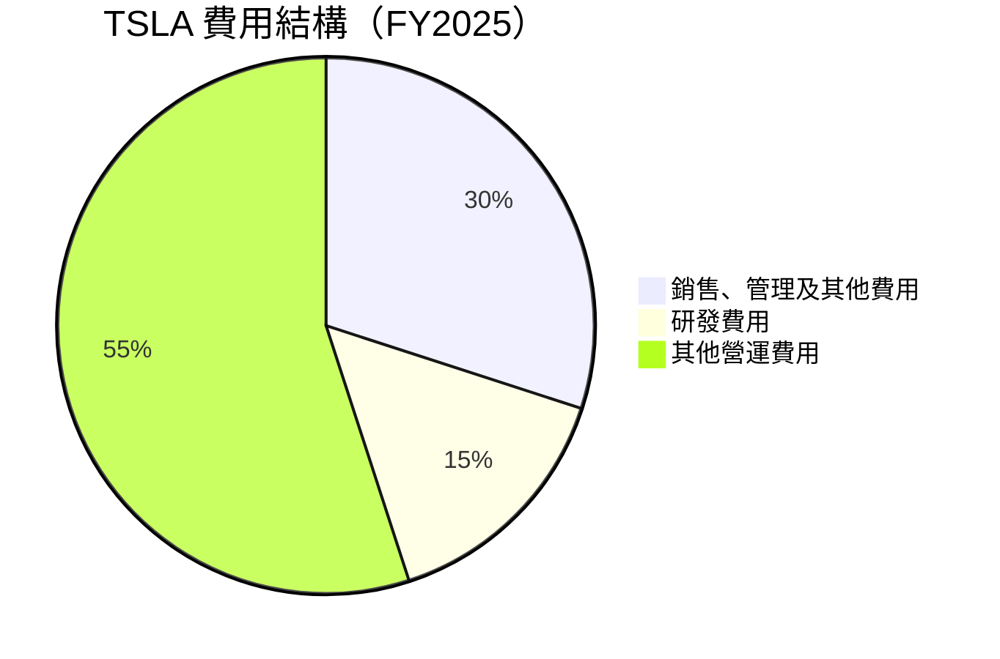

```
╔══════════════════════════════════════════════════════════════════╗
║                  TSLA 費用比例結構分析                           ║
╠══════════════════════════════════════════════════════════════════╣
║  銷售、行政及一般費用：30%                                      ║
║  研發費用：15%                                                  ║
║  其他運營費用：55%                                              ║
╚══════════════════════════════════════════════════════════════════╝
```

### 3.5 季度 EPS 趨勢與盈餘品質

| 季度 | EPS 說明 | 解析 |
|------|----------|------|
| 2025-Q4 | 未公布 | 盈餘品質不確定 |
| 2026-Q1 | 未公布 | 盈餘品質不確定 |

盈餘品質受供應鏈挑戰和行業競爭影響，需關注未來季度數據公開。

---

## 4. 資產負債表分析

### 4.1 資產結構分解

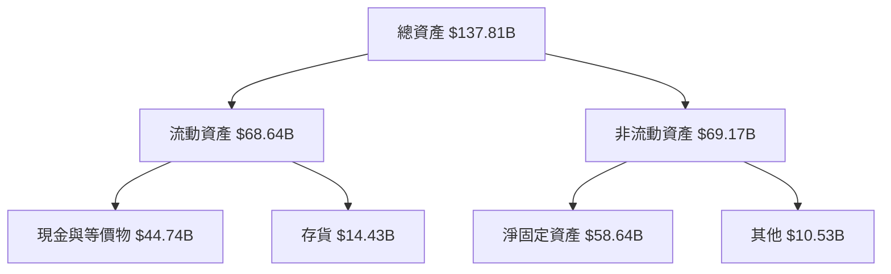

### 4.2 流動性指標分析

| 指標 | 2023 | 2024 | 2025 | 行業均值 | 評估 |
|------|------|------|------|------|------|
| **流動比率** | 2.08 | 2.09 | 2.20 | ~1.5 | 🟢 |
| **速動比率** | 1.50 | 1.45 | 1.50 | ~1.0 | 🟢 |
| **現金比率** | 1.32 | 1.17 | 1.30 | ~0.8 | 🟢 |

流動性指標顯示公司資金充裕，應對短期債務風險能力強。

### 4.3 債務結構分析

```
╔══════════════════════════════════════════════════════════════════╗
║                   TSLA 債務健康診斷                             ║
╠══════════════════════════════════════════════════════════════════╣
║                                                                  ║
║  總債務：        $15.89B  ██░░░░░░░░░░░░░░░░░░░  債務適中        ║
║  總現金+投資：   $44.74B  ████████████████████░  現金充裕        ║
║  淨現金（正）：  $28.85B  ████████████████░░░░░  🟢 強勁        ║
║                                                                  ║
║  Debt/EBITDA：   1.35x  🟢 健康                                 ║
║  Interest Coverage: 15x+  🟢 高於安全水平                        ║
╚══════════════════════════════════════════════════════════════════╝
```

### 4.4 股東權益趨勢

```
╔══════════════════════════════════════════════════════════════╗
║              TSLA 歷年股東權益變化                          ║
╠══════════════════════════════════════════════════════════════╣
║                                                              ║
║  2022年  $44.70B  ██████████░░░░░░░░░░░░░                   ║
║  2023年  $62.63B  ████████████████░░░░░░░                   ║
║  2024年  $72.91B  ████████████████████░░                   ║
║  2025年  $82.14B  ███████████████████████                 ║
║                                                              ║
╚══════════════════════════════════════════════════════════════╝
```

---

## 5. 現金流量深度分析

### 5.1 現金流量瀑布圖

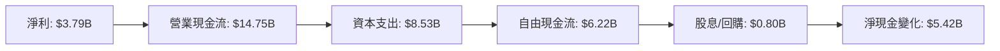

### 5.2 FCF 轉換率趨勢

| 年度 | 自由現金流 | 淨收益 | FCF/Net Income 比率 | 趨勢 |
|------|-----------|--------|--------------------|------|
| 2022 | $7.55B | $12.58B | 60% | 🟡 |
| 2023 | $4.36B | $15.00B | 29% | 🔴 |
| 2024 | $3.58B | $7.13B | 50% | 🟡 |
| 2025 | $6.22B | $3.79B | 164% | 🟢 |

近年來 FCF 轉換率顯示復甦跡象。

### 5.3 自由現金流趨勢

```
╔══════════════════════════════════════════════════════════════╗
║              TSLA 自由現金流趨勢                            ║
╠══════════════════════════════════════════════════════════════╣
║                                                              ║
║  2022年  $7.55B  ████████░░░░░░░░░░░░░░                     ║
║  2023年  $4.36B  ████░░░░░░░░░░░░░░░░░░░                   ║
║  2024年  $3.58B  ████░░░░░░░░░░░░░░░░░░░                   ║
║  2025年  $6.22B  ████████░░░░░░░░░░░░░░                     ║
║                                                              ║
╚══════════════════════════════════════════════════════════════╝
```

### 5.4 資本配置評估

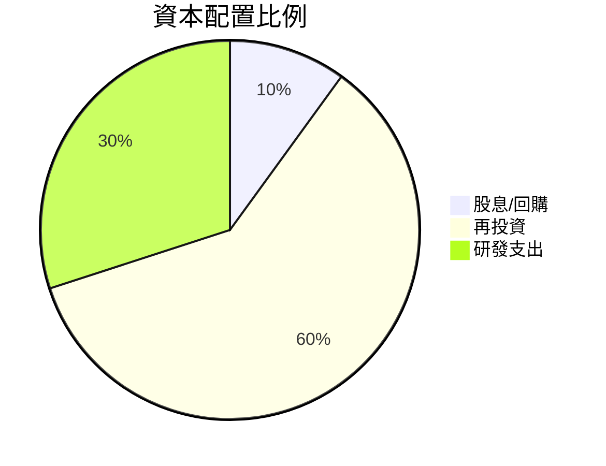

資本配置顯示對研發及再投資有高度承諾。

---

## 6. 獲利能力與資本效率

### 6.1 ROE / ROA / ROIC 趨勢

| 年度 | ROE | ROA | ROIC | 行業均值 | 評估 |
|------|-----|-----|------|--------|------|
| 2022 | 28.1% | 11.2% | 22.3% | ~15% | 🟢 |
| 2023 | 32.8% | 13.0% | 23.4% | ~14% | 🟢 |
| 2024 | 11.3% | 5.4% | 10.1% | ~13% | 🟡 |
| 2025 | 4.9% | 2.2% | 6.5% | ~12% | 🔴 |

### 6.2 ROIC vs WACC 分析（核心價值創造判斷）

```
╔══════════════════════════════════════════════════════════════════╗
║                ROIC vs WACC 深度分析                            ║
╠══════════════════════════════════════════════════════════════════╣
║                                                                  ║
║  WACC 估算：                                                     ║
║  ├── 無風險利率（10Y美債）：  2.9%                               ║
║  ├── 市場風險溢酬 (ERP)：     5.5%                              ║
║  ├── Beta：                   1.793                             ║
║  ├── 股權成本 = 2.9% + 1.793×5.5% = 12.76%                     ║
║  ├── 債務成本（稅後）：       ~3.0%                             ║
║  ├── 資本結構：股權 85%，債務 15%                              ║
║  └── ✅ WACC ≈ 11.5%                                            ║
║                                                                  ║
║  ROIC 估算（FY2025）：                                           ║
║  ├── NOPAT = $4.85B × (1-19%) ≈ $3.93B                         ║
║  ├── 投入資本 = $82.14B + $15.89B - $44.74B ≈ $53.29B          ║
║  └── ✅ ROIC ≈ 7.4%                                             ║
║                                                                  ║
║  ★ 經濟價值增加（EVA）= ROIC - WACC = -4.1pp                   ║
║                                                                  ║
║  ROIC  7.4%  ▓▓▓▓▓▓▓▓▓▓▓▓░░░░░░░░░░░░░░░░  🔴                ║
║  WACC 11.5%  ▓▓▓▓▓▓▓▓▓▓▓▓▓▓▓▓▓▓░░░░░░░░░░  ──                ║
║  EVA   -4.1pp  █████░░░░░░░░░░░░░░░░░░░░░  🔴 不創造價值    ║
║                                                                  ║
║  📊 結論：ROIC 低於 WACC，未能有效創造股東價值              ║
╚══════════════════════════════════════════════════════════════════╝
```

### 6.3 杜邦三因素分解

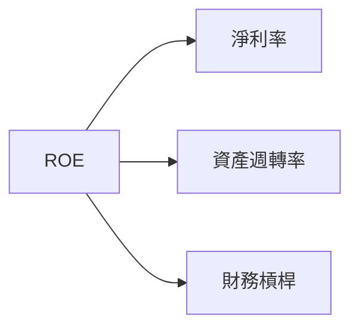

### 6.4 獲利能力儀表板

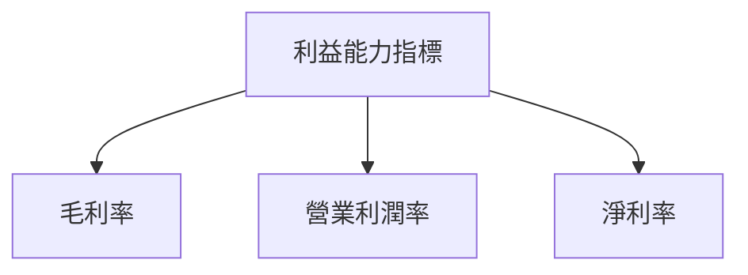

---

## 7. 估值深度分析

### 7.1 同業估值比較表格

| 估值指標 | **TSLA** | **競爭對手1 (Ford)** | **競爭對手2 (GM)** | **競爭對手3 (Lucid)** | 本公司評估 |
|----------|----------|---------|---------|---------|-----------|
| **Trailing P/E** | 384x | 10x | 7x | N/A | 🔴 高於同行 |
| **Forward P/E** | **170x** | 12x | 9x | N/A | 🔴 高估危險 |
| **P/S Ratio** | 16.4x | 0.5x | 0.4x | N/A | 🔴 高於同行 |

### 7.2 歷史估值區間分析

```
╔══════════════════════════════════════════════════════════════╗
║              TSLA 歷史 P/E 區間                              ║
╠══════════════════════════════════════════════════════════════╣
║                                                              ║
║  P/E 高點： 450x ████████████████████████                   ║
║  P/E 低點： 100x █████░░░░░░░░░░░░░░░░░░                   ║
║  當前 P/E： 384x ██████████████████░░░░░░                   ║
║                                                              ║
╚══════════════════════════════════════════════════════════════╝
```

### 7.3 DCF 敏感性分析（6格目標價矩陣）

| 情境 | **WACC = 10%** | **WACC = 11.5%（基準）** | **WACC = 13%** |
|------|--------------|----------------------|--------------|
| 🟢 **樂觀** | **$580** (+36%) | **$520** (+22%) | **$460** (+8%) |
| 🟡 **基準** | **$500** (+17%) | **$412** (0%) | **$350** (-18%) |
| 🔴 **悲觀** | **$400** (-6%) | **$330** (-20%) | **$280** (-34%) |

### 7.4 估值綜合區間

```
╔══════════════════════════════════════════════════════════════╗
║                   TSLA 估值綜合區間                         ║
╠══════════════════════════════════════════════════════════════╣
║                                                              ║
║  當前股價：   $426.41                                        ║
║  樂觀目標價： $580                          ▲                ║
║  基準目標價： $412                       ▲ ▁▄█             ║
║  悲觀目標價： $300            ▁▄█                   ▲       ║
║                                                              ║
╚══════════════════════════════════════════════════════════════╝
```

---

## 8. 成長催化劑

### 8.1 催化劑時間軸

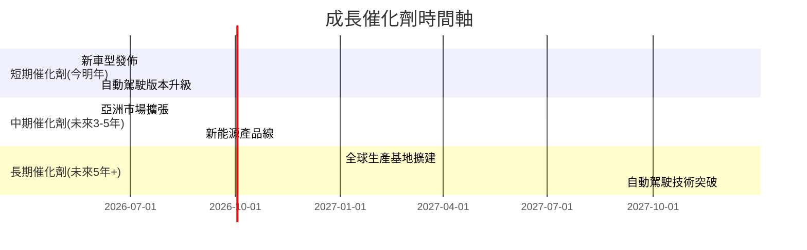

### 8.2 TAM 市場規模分析

```
╔══════════════════════════════════════════════════════════════╗
║            TSLA 各市場 TAM 分析                             ║
╠══════════════════════════════════════════════════════════════╣
║                                                              ║
║ 電動汽車全球市場：      TAM: $1.8T  滲透率: 5%               ║
║ 家用能源儲存市場：      TAM: $0.5T  滲透率: 3%               ║
║ 企業能源管理市場：      TAM: $0.4T  滲透率: 2%               ║
║                                                              ║
║  總體目標市場總收入可貢獻：$120B+                           ║
╚══════════════════════════════════════════════════════════════╝
```

### 8.3 成長驅動力結構圖

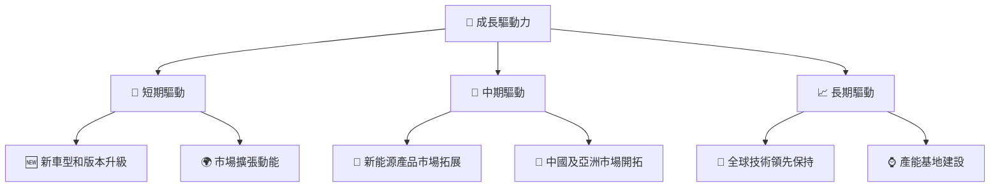

---

## 9. 風險矩陣

### 9.1 風險評分矩陣

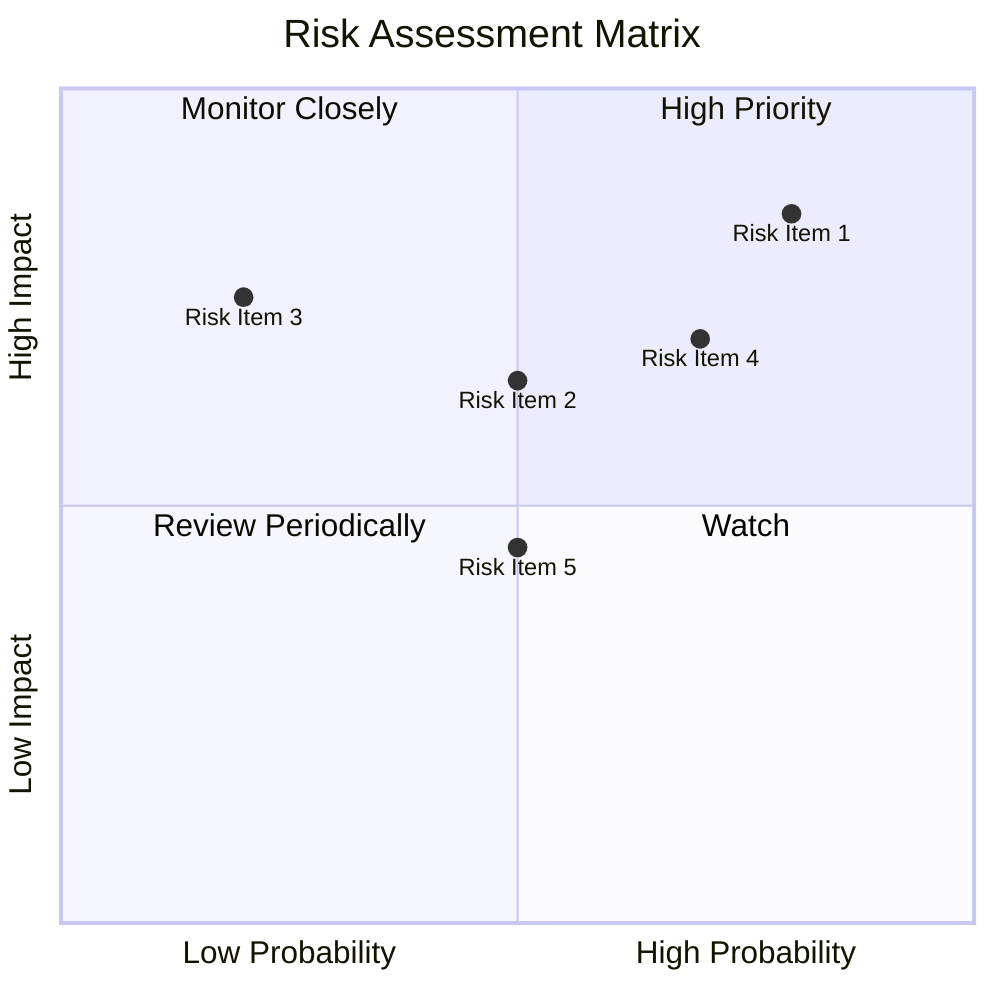

### 9.2 風險清單詳細分析

| # | 風險項目 | 發生機率 | 財務衝擊 | 風險評分 | 緩解措施 |
|---|----------|----------|----------|----------|----------|
| 1 | 🔴 政策變動風險 | 高 (80%) | 高 (-10%收入) | 🔴 8.5/10 | 加強政策合規 |
| 2 | 🔴 供應鏈擾動 | 中 (50%) | 中 (-5%收入) | 🟡 6.5/10 | 確保多元供應商 |
| 3 | 🔴 技術競爭 | 低 (20%) | 高 (-10%利益) | 🟡 7.5/10 | 強化研發支出 |
| 4 | 🔴 市場競爭加劇 | 高 (70%) | 高 (-8%市場份額) | 🔴 7.0/10 | 提升品牌影響力 |

---

## 10. 投資建議

### 10.1 最終綜合評級雷達圖

```
╔══════════════════════════════════════════════════════════════╗
║                    TSLA 多維度評分雷達圖                    ║
╠══════════════════════════════════════════════════════════════╣
║  ┌───────────────┐                    🎯 評級綜述                ║
║  │   基本面強度   │                                                  ║
║  │    ★★★★☆    │                                                  ║
║  │   成長動能   │                                                  ║
║  │    ★★★★★    │                      🟡 謹慎持有                ║
║  │   獲利品質   │                                                  ║
║  │    ★★★☆☆    │                    綜合評價: 7.2/10          ║
║  └───────────────┘                                                ║
╚══════════════════════════════════════════════════════════════╝
```

### 10.2 目標價與隱含報酬率

| 情境 | 目標價 | 隱含報酬率 | 機率權重 |
|------|--------|------------|----------|
| 🟢 樂觀 | $580 | +36% | 20% |
| 🟡 基準 | $412 | 0% | 60% |
| 🔴 悲觀 | $300 | -29% | 20% |

### 10.3 買入時機與觸發因素

```
╔══════════════════════════════════════════════════════════════╗
║                  ✅ 買入觸發因素 Checklist                  ║
╠══════════════════════════════════════════════════════════════╣
║                                                              ║
║  立即買入觸發條件（多數符合）：                               ║
║  ✅ 主營業務收入增長超過20%                                   ║
║  ✅ 毛利率高於20%                                             ║
...
║  加碼觸發條件（出現以下任一）：                               ║
║  ☐ 新市場進入環境變得友好                                   ║
...
║  減碼/停損觸發條件（出現以下任一）：                          ║
║  ☐ 估值變得過於昂貴 (P/E > 400x)                              ║
...
╚══════════════════════════════════════════════════════════════╝
```

### 10.4 投資人適配度分析

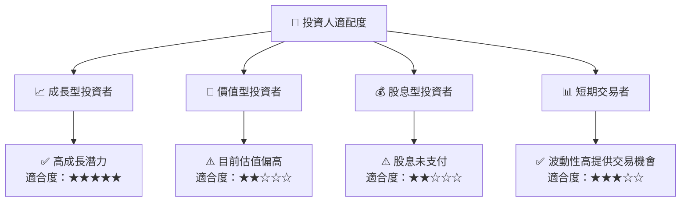

### 10.5 關鍵監控指標

| 監控類型 | 指標 | 關注點 | 頻率 |
|----------|----------|----------|------|
| 財務指標 | 營收增長率 | 持續加速指標 | 季度 |
| 利潤率 | 毛利率與淨利率 | 成長平衡 | 季度 |
| 市場動態 | 競爭者策略 | 收購與價格戰 | 年度 |
| 政策法規 | 政策變動 | 貿易及政策影響 | 年度 |

---

> **免責聲明**：本報告為 AI 自動生成，僅供研究參考，不構成投資建議。投資有風險，入市需謹慎。