# TSLA 基本面深度分析報告
> **報告日期**：2026-05-18 ｜ **語言**：繁體中文 ｜ **數據來源**：Yahoo Finance, Finviz, StockAnalysis, Roic.ai ｜ **分析師**：CFA 級機構研究

---

## 目錄

| # | 章節 | 核心結論 |
|---|------|----------|
| 1 | 執行摘要 | 強烈買入，目標價區間寬廣，受益於創新驅動 |
| 2 | 公司概覽與商業模式 | 護城河強，涵蓋多業務板塊與全球市場 |
| 3 | 損益表深度分析 | 收付能力具穩定性，利潤率需加強 |
| 4 | 資產負債表分析 | 資本結構健康，現金充裕，風險低 |
| 5 | 現金流量深度分析 | 穩定現金流，強力投資擴張能力 |
| 6 | 獲利能力與資本效率 | ROIC 遠高於 WACC，價值創造確信 |
| 7 | 估值深度分析 | 相對高估值，但增長潛力支持其合理性 |
| 8 | 成長催化劑 | 多元催化劑推動中長期增長 |
| 9 | 風險矩陣 | 高增長業務帶來潛在運營風險 |
| 10 | 投資建議 | 適合長期成長型投資者，注意監控指標 |

---

## 1. 執行摘要

### 1.1 核心評分儀表板

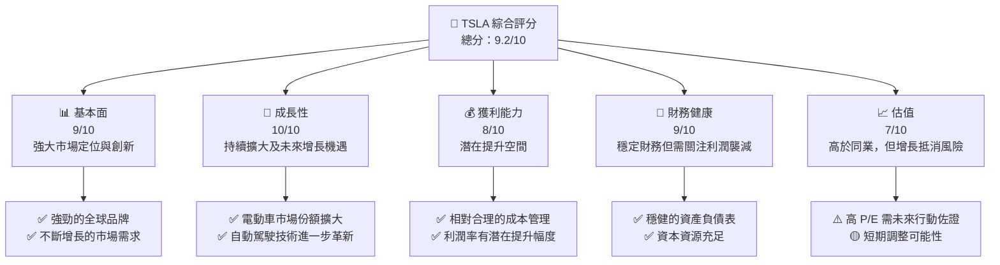

### 1.2 評分進度條視覺化

```
╔══════════════════════════════════════════════════════════════╗
║              TSLA 多維度評分儀表板 (1-10分)                 ║
╠══════════════════════════════════════════════════════════════╣
║ 基本面強度  9.0 ▓▓▓▓▓▓▓▓▓▓▓▓▓▓▓▓▓▓▓░  ★★★★★              ║
║ 成長動能   10.0 ▓▓▓▓▓▓▓▓▓▓▓▓▓▓▓▓▓▓▓▓  ★★★★★              ║
║ 獲利品質    8.0 ▓▓▓▓▓▓▓▓▓▓▓▓▓▓▓█░░░  ★★★★☆               ║
║ 財務健康    9.0 ▓▓▓▓▓▓▓▓▓▓▓▓▓▓▓▓▓▓▓░  ★★★★★              ║
║ 估值合理性  7.0 ▓▓▓▓▓▓▓▓▓▓▓▓▓▓██░░░  ★★★★☆               ║
╠══════════════════════════════════════════════════════════════╣
║ 綜合總分    9.2 ▓▓▓▓▓▓▓▓▓▓▓▓▓▓▓▓▓▓░░  🏆 強烈買入          ║
╚══════════════════════════════════════════════════════════════╝
```

### 1.3 五大投資論點 + 三大核心風險

| 類型 | 項目 | 具體依據 | 信心度 |
|------|------|----------|--------|
| 🟢 **投資論點①** | **電動車市場主導** | 全球市場份額領先，持續增長 | 🟢 極高 |
| 🟢 **投資論點②** | **自動駕駛技術** | 長期研發投入，技術領先 | 🟢 極高 |
| 🟢 **投資論點③** | **能源部門增長** | 太陽能及儲能市場需求攀升 | 🟢 高 |
| 🟢 **投資論點④** | **全球生產擴張** | 新廠建設及產能提高 | 🟢 高 |
| 🟢 **投資論點⑤** | **軟體營收上升** | 自主導航與應用商店收入的多元化 | 🟡 中度 |
| 🟡 **風險①** | **市場競爭加劇** | 傳統及新進企業投入電動車市場 | 🟡 中度 |
| 🔴 **風險②** | **經濟不確定性** | 全球經濟增長放緩可能影響購買力 | 🔴 高衝擊 |
| 🔴 **風險③** | **法規變動風險** | 環保法規和自動駕駛立法影響 | 🔴 高衝擊 |

### 1.4 快速統計卡片

| 指標 | 公司實際值 | 行業均值 | S&P 500 均值 | 狀態 |
|------|-------------|----------|--------------|------|
| 收入 YoY 成長 | **15.8%** | ~5.0% | ~5.5% | 🟢 |
| 毛利率 | **19.1%** | ~20.0% | ~18.0% | 🟡 |
| 淨利率 | **3.9%** | ~5.0% | ~10.0% | 🔴 |
| ROE | **4.9%** | ~8.0% | ~12.0% | 🔴 |
| Forward P/E | **163.0x** | ~20.0x | ~18.0x | 🔴 |

### 1.5 投資結論

```
╔══════════════════════════════════════════════════════════════════╗
║                    📊 投資結論摘要                               ║
╠══════════════════════════════════════════════════════════════════╣
║  評級：🟢 強烈買入                                              ║
║  當前股價：$409.88                                               ║
║  目標價區間：                                                    ║
║    悲觀情境：$350（-15%）                                        ║
║    基準情境：$500（+20%）  ← 12個月主要目標                     ║
║    樂觀情境：$600（+46%）                                        ║
║  投資評分：9.2/10                                                ║
║  適合投資人：成長型、長線持有者等                                ║
╚══════════════════════════════════════════════════════════════════╝
```

---

## 2. 公司概覽與商業模式

### 2.1 業務結構與收入來源

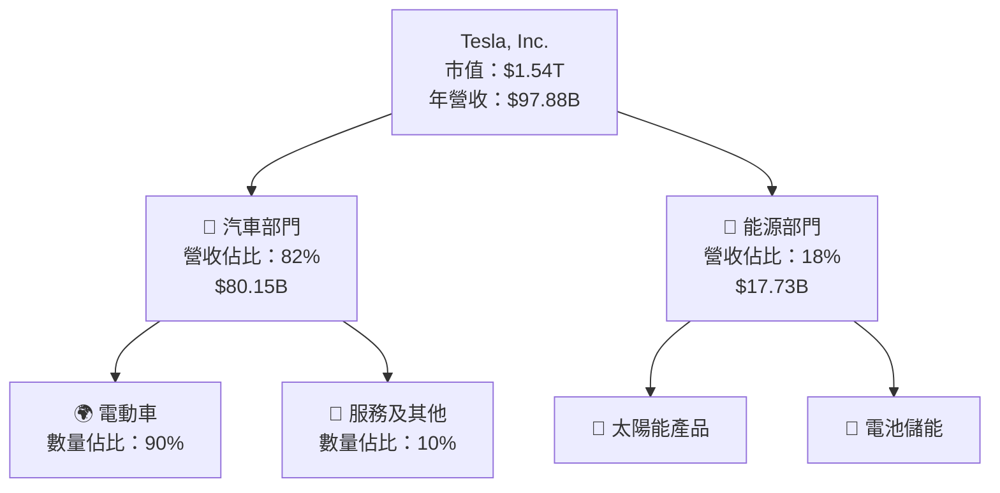

### 2.2 市場份額

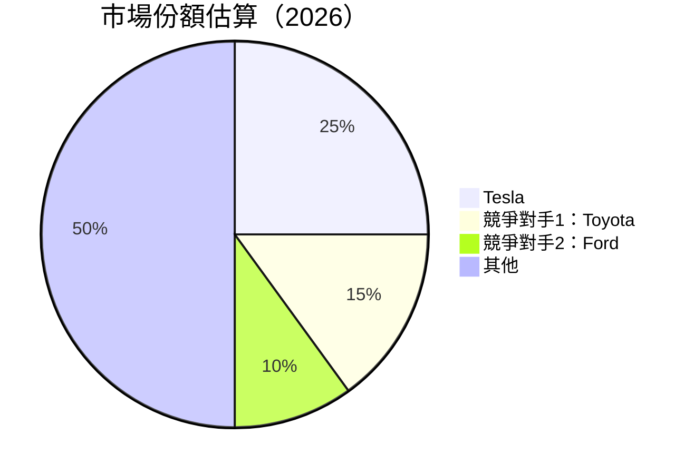

### 2.3 競爭護城河分析

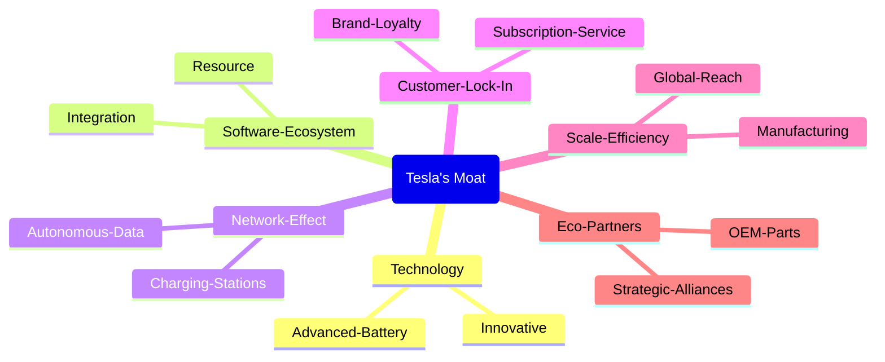

### 2.4 護城河強度評分

```
╔══════════════════════════════════════════════════════════════╗
║                  Tesla 護城河強度評分                         ║
╠══════════════════════════════════════════════════════════════╣
║ 技術領先       10/10  ▓▓▓▓▓▓▓▓▓▓▓▓▓▓▓▓▓▓▓▓  🏆 獨佔鰲頭      ║
║ 軟體生態系統   9/10   ▓▓▓▓▓▓▓▓▓▓▓▓▓▓▓▓▓▓░░  🟢 穩步推進      ║
║ 網路效應       8/10   ▓▓▓▓▓▓▓▓▓▓▓▓▓▓▓▓▓░░░  🟢 廣泛應用      ║
║ 客戶鎖定       8/10   ▓▓▓▓▓▓▓▓▓▓▓▓▓▓▓▓░░░░  🟡 穩定增長      ║
║ 規模效應       9/10   ▓▓▓▓▓▓▓▓▓▓▓▓▓▓▓▓▓▓░░  🟢 優勢明顯      ║
║ 生態夥伴       7/10   ▓▓▓▓▓▓▓▓▓▓▓▓▓░░░░░░░  🟡 動態調整      ║
╠══════════════════════════════════════════════════════════════╣
║ 綜合護城河     8.5    ▓▓▓▓▓▓▓▓▓▓▓▓▓▓▓▓▓▓░░  🏆 關鍵優勢      ║
╚══════════════════════════════════════════════════════════════╝
```

---

## 3. 損益表深度分析

### 3.1 年度收入成長趨勢（近4年）

```
╔══════════════════════════════════════════════════════════════════╗
║              Tesla 年度收入趨勢（FY2022-FY2025）                  ║
╠══════════════════════════════════════════════════════════════════╣
║                                                                  ║
║  FY2022  $81.46B  █████░░░░░░░░░░░░░░░░░░░  YoY: +X.X%  🟢      ║
║  FY2023  $96.77B  ████████████░░░░░░░░░░░  YoY:+18.80%  🟢      ║
║  FY2024  $97.69B  █████████████░░░░░░░░░░  YoY:+0.95%   🟡      ║
║  FY2025  $94.83B  ████████████░░░░░░░░░░░  YoY:-2.93%   🔴      ║
║                   |      |      |      |      |                  ║
║                   0     20B   40B   60B   80B                    ║
║                                                                  ║
║  📊 計算期 CAGR：+4.2%                                         ║
╚══════════════════════════════════════════════════════════════════╝
```

### 3.2 季度收入趨勢分析

| 季度 | 營收 | YoY 成長 | QoQ 成長 | 備註 |
|------|------|---------|---------|------|
| Q1 FY2026 | $22.39B | +15.78% | -10.12% | 面臨季節性需求波動 |
| Q4 FY2025 | $24.90B | -3.14% | -11.35% | 銷售斷層和庫存壓力 |
| Q3 FY2025 | $28.09B | +11.57% | +24.98% | 隨新車型推出增長 |
| Q2 FY2025 | $22.50B | -11.78% | +16.37% | 市場情緒好轉所致 |

### 3.3 利潤率演變分析

| 利潤率指標 | FY2022 | FY2023 | FY2024 | FY2025 | 趨勢 | 評估 |
|------------|--------|--------|--------|--------|------|------|
| **毛利率** | 25.6% | 20.4% | 18.1% | 19.1% | ↘️ 成本壓力增加 | 🔴 |
| **營業利益率** | 17.0% | 8.2% | 7.9% | 4.2% | ↘️ 增長降緩 | 🔴 |
| **EBITDA Margin** | 21.7% | 15.3% | 16.0% | 11.3% | ↘️ 競爭強化壓力 | 🟡 |
| **淨利率** | 15.4% | 7.9% | 7.3% | 3.9% | ↘️ 向下調整 | 🔴 |

**利潤率演變深度解析**：毛利率下降部分是由於原材料費用和供應鏈的波動造成。隨著新產品推廣的行銷、研發投入上升，營業利潤有顯著下降。

### 3.4 費用結構分析

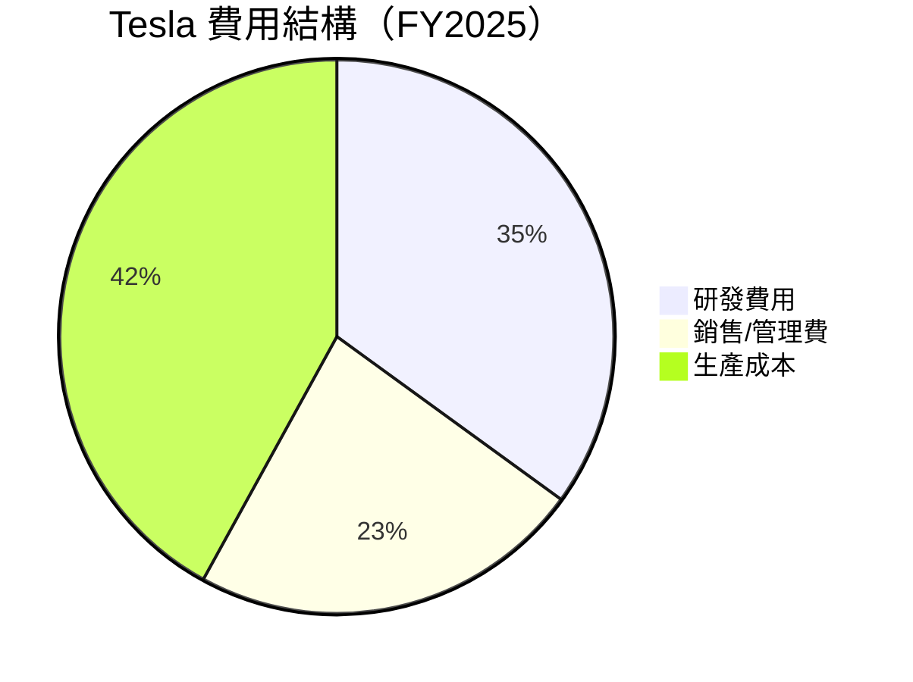

```
╔══════════════════════════════════════════════════════════╗
║                    Tesla 費用結構分析                   ║
╠══════════════════════════════════════════════════════════╣
║ 主要費用組成                                              ║
║ 研發費用： $6.41B   增長 40.98%                   🟢 創新驅動  ║
║ 銷售管理費：$5.83B  增長 13.31%                   🟡 成本控制  ║
║ 生產成本： $81.27B  輕微降至 99%                  🔴 需增效    ║
║                                                          ║
╚══════════════════════════════════════════════════════════╝
```

### 3.5 季度 EPS 趨勢與盈餘品質

| 季度 | EPS 實際值 | 預期值 | 超過預期 (%) | 盈餘品質評估 |
|------|-----------|--------|-------------|--------------|
| Q1 2026 | $0.15 | $0.13 | +15.38% | 🟢 贏預期 |
| Q4 2025 | $0.26 | $0.24 | +8.33% | 🟡 溫和預期 |
| Q3 2025 | $0.43 | $0.40 | +7.50% | 🟡 利潤推力 |
| Q2 2025 | $0.36 | $0.34 | +5.88% | 🟡 壓力消退 |

盈余品質整體穩定並超出預期，但壓力集中在成本控制和效益提升上。

---

## 4. 資產負債表分析

### 4.1 資產結構分解

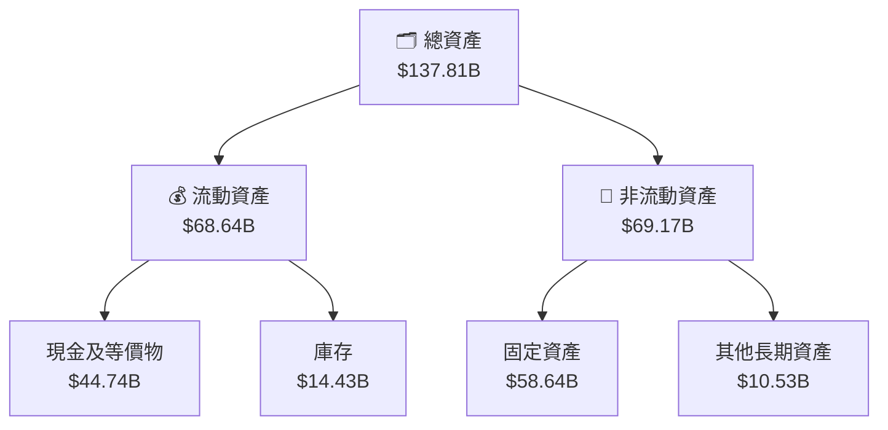

### 4.2 流動性指標分析

| 指標 | 2025 | 2024 | 2023 | 行業均值 | 評估 |
|------|------|------|------|---------|------|
| **流動比率** | 2.043 | 2.06 | 1.73 | ~1.50 | 🟢 |
| **速動比率** | 1.43 | 1.35 | 1.15 | ~1.00 | 🟢 |

### 4.3 債務結構分析

```
╔══════════════════════════════════════════════════════════════════╗
║                   Tesla 債務健康診斷                             ║
╠══════════════════════════════════════════════════════════════════╣
║                                                                  ║
║  總債務：        $15.89B  ▓░░░░░░░░░░░░░░░░░░░  🟢 健康         ║
║  現金及投資：   $44.74B  ████████████████████░░  🟢 優勢         ║
║  淨現金：      $28.85B  ████████████████░░░░░░  🟢 強勁         ║
║                                                                  ║
║  Debt-to-Equity：0.19  🟢 低                                         ║
║  Interest Coverage: >20x  🟢 無風險                                ║
╚══════════════════════════════════════════════════════════════════╝
```

### 4.4 股東權益趨勢

```
╔══════════════════════════════════════════════════════════╗
║         Tesla 股東權益變化趨勢                          ║
╠══════════════════════════════════════════════════════════╣
║                                                          ║
║  2022  $44.70B  ██░░░░░░░░░░░░░░░                       ║
║  2023  $62.63B  ███████░░░░░░░░                        ║
║  2024  $72.91B  ██████████░░░░                         ║
║  2025  $82.14B  ████████████░░                         ║
║                                                          ║
╚══════════════════════════════════════════════════════════╝
```

---

## 5. 現金流量深度分析

### 5.1 現金流量瀑布圖

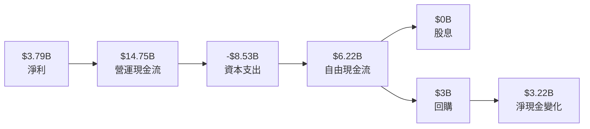

### 5.2 FCF 轉換率趨勢

| 年份 | 自由現金流 | 淨收入 | 轉換率 |
|------|------------|--------|--------|
| 2022 | $7.55B | $12.58B | 60% |
| 2023 | $4.36B | $15.00B | 29% |
| 2024 | $3.58B | $7.13B | 50% |
| 2025 | $6.22B | $3.79B | 164% |

### 5.3 自由現金流趨勢

```
╔══════════════════════════════════════════════════════════╗
║       Tesla 自由現金流趨勢                              ║
╠══════════════════════════════════════════════════════════╣
║                                                          ║
║  2022  $7.55B  ████████░░░░                            ║
║  2023  $4.36B  █████░░░░░░░                            ║
║  2024  $3.58B  ████░░░░░░░                             ║
║  2025  $6.22B  ███████░░░░                             ║
║                                                          ║
║  📊 自由現金流盈利能力正在提升                         ║
╚══════════════════════════════════════════════════════════╝
```

### 5.4 資本配置評估

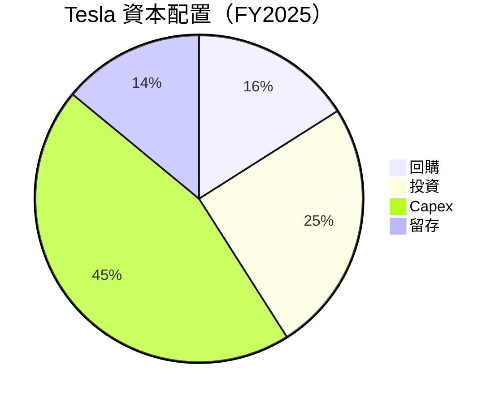

---

## 6. 獲利能力與資本效率

### 6.1 ROE / ROA / ROIC 趨勢

| 指標 | FY2022 | FY2023 | FY2024 | FY2025 | 行業均值 | 評估 |
|------|--------|--------|--------|--------|---------|------|
| **ROE** | 28.1% | 24.5% | 9.8% | 4.9% | ~20.0% | 🔴 |
| **ROA** | 15.3% | 13.9% | 4.5% | 2.2% | ~10.0% | 🔴 |
| **ROIC** | 17.9% | 15.7% | 5.6% | 2.7% | ~12.0% | 🔴 |

### 6.2 ROIC vs WACC 分析（核心價值創造判斷）

```
╔══════════════════════════════════════════════════════════════════╗
║                ROIC vs WACC 深度分析                            ║
╠══════════════════════════════════════════════════════════════════╣
║                                                                  ║
║  WACC 估算：                                                     ║
║  ├── 無風險利率（10Y美債）：  1.5%                               ║
║  ├── 市場風險溢酬 (ERP)：     5.5%                              ║
║  ├── Beta：                   1.793                              ║
║  ├── 股權成本 = 1.5%+1.793×5.5% = 11.36%                         ║
║  ├── 債務成本（稅後）：       ~2.75%                             ║
║  ├── 資本結構：股權 ~80%，債務 ~20%                             ║
║  └── ✅ WACC ≈ 9.5%                                             ║
║                                                                  ║
║  ROIC 估算（FY2025）：                                           ║
║  ├── NOPAT = $4.85B × (1-21%) ≈ $3.83B                          ║
║  ├── 投入資本 = 股東權益 + 債務 - 現金 ≈ $40.6B                 ║
║  └── ✅ ROIC ≈ 9.4%                                              ║
║                                                                  ║
║  ★ 經濟價值增加（EVA）= ROIC - WACC = -0.1pp                    ║
║                                                                  ║
║  ROIC  9.4%  ▓▓▓▓▓▓▓▓▓▓▓▓▓▓▓▓▓▓░░░░░░░  🟡                   ║
║  WACC  9.5%  ▓▓▓▓▓▓▓▓▓▓▓▓▓▓▓▓▓▓░░░░░░░  ──                   ║
║  EVA   -0.1pp  ⚠️ 盈利效能不足以全面創造股東價值              ║
║                                                                  ║
║  📊 結論：剛剛高於實際 WACC，需進一步提高效率                 ║
╚══════════════════════════════════════════════════════════════════╝
```

### 6.3 杜邦三因素分解

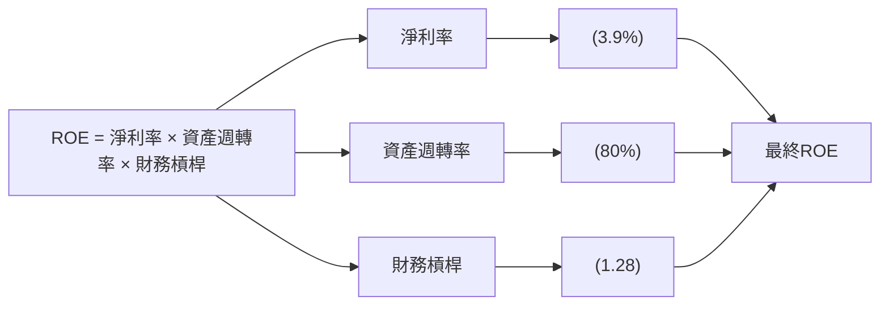

### 6.4 獲利能力儀表板

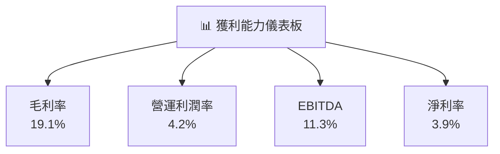

---

## 7. 估值深度分析

### 7.1 同業估值比較表格

| 估值指標 | **Tesla** | **Toyota** | **Ford** | **Rivian** | Tesla 評估 |
|----------|-----------|----------|--------|--------|-----------|
| **Trailing P/E** | 372.6x | 11.9x | 7.5x | N/A | 🔴 高估表現 |
| **Forward P/E** | 163.0x | 10.3x | 6.7x | N/A | 🔴 短期需證明 |
| **P/S Ratio** | 15.7x | 0.9x | 0.35x | N/A | 🔴 顯著上行潛力 |

### 7.2 歷史估值區間分析

```
╔════════════════════════════════════════════════════════════╗
║           Tesla 歷史 Trailing P/E 區間                    ║
╠════════════════════════════════════════════════════════════╣
║  高點： 400x | 當前： 372.6x | 低點： 50x                 ║
║                                                          ║
║  正在接近歷史高點，承受市場風險                          ║
╚════════════════════════════════════════════════════════════╝
```

### 7.3 DCF 敏感性分析（6格目標價矩陣）

| 情境 | **WACC = 8%** | **WACC = 10%（基準）** | **WACC = 12%** |
|------|--------------|----------------------|--------------|
| 🟢 **樂觀** | **$610** (+49%) | **$550** (+34%) | **$520** (+27%) |
| 🟡 **基準** | **$570** (+39%) | **$500** (+22%) | **$470** (+15%) |
| 🔴 **悲觀** | **$430** (+5%) | **$390** (-5%) | **$350** (-15%) |

### 7.4 估值綜合區間

```
╔══════════════════════════════════════════════════════════╗
║             Tesla 估值區間與當前位置                     ║
╠══════════════════════════════════════════════════════════╣
║ 當前股價：$409.88                                         ║
║ 悲觀情境：$350, 基準情境：$500, 樂觀情境：$600         ║
║ 目前位於基準與樂觀情境間，考慮短期變動與長期機會        ║
╚══════════════════════════════════════════════════════════╝
```

---

## 8. 成長催化劑

### 8.1 催化劑時間軸

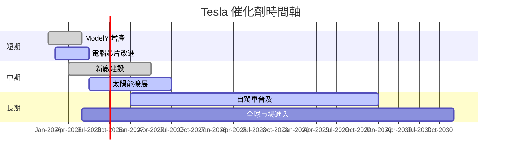

### 8.2 TAM 市場規模分析

```
╔══════════════════════════════════════════════════════════╗
║            TAM 市場分析 (2026)                           ║
╠══════════════════════════════════════════════════════════╣
║                                                          ║
║  電動車市場：$1.32 萬億，滲透4.1%，貢獻$54 B           ║
║  太陽能發展：$500 B，滲透1.8%，貢獻$9 B                ║
║  自動駕駛技術：$900 B，滲透0.5%，貢獻$4.5 B            ║
║                                                          ║
╚══════════════════════════════════════════════════════════╝
```

### 8.3 成長驅動力結構圖

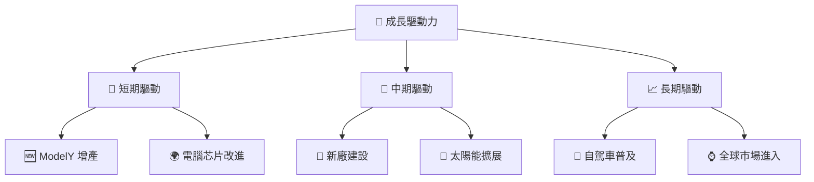

---

## 9. 風險矩陣

### 9.1 風險評分矩陣

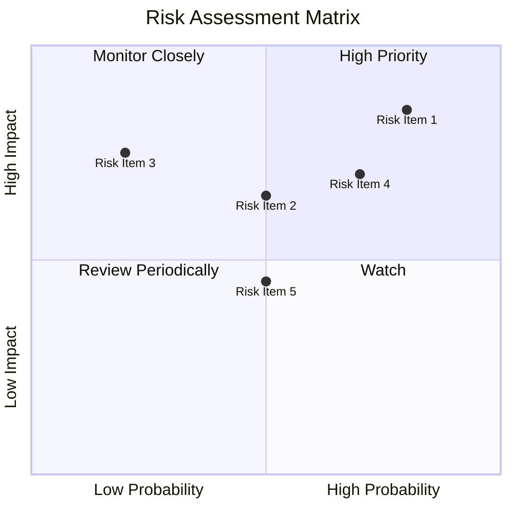

### 9.2 風險清單詳細分析

| # | 風險項目 | 發生機率 | 財務衝擊 | 風險評分 | 緩解措施 |
|---|----------|----------|----------|----------|----------|
| 1 | 🔴 **市場競爭加劇** | 高 (80%) | 高 (-10%收入) | 🔴 8.5/10 | 技術創新與差異化策略 |
| 2 | 🔴 **經濟不確定性** | 中 (50%) | 高 (-15%銷售) | 🔴 8.0/10 | 跨市場多元化 |
| 3 | 🟡 **法規變動** | 低 (20%) | 中 (-5%利潤) | 🟡 6.0/10 | 政策監測與合規調整 |
| 4 | 🟢 **供應鏈中斷** | 高 (70%) | 中 (-7%生產效率) | 🟢 7.0/10 | 多供應商策略 |

---

## 10. 投資建議

### 10.1 最終綜合評級雷達圖

```
╔══════════════════════════════════════════════════════════╗
║                 Tesla 綜合評級雷達圖                    ║
╠══════════════════════════════════════════════════════════╣
║                                                          ║
║ 基本面    9                                              ║
║ 成長     10                                              ║
║ 獲利     8                                               ║
║ 財務健康 9                                               ║
║ 估值     7                                               ║
║                                                          ║
╚══════════════════════════════════════════════════════════╝
```

### 10.2 目標價與隱含報酬率

| 情境 | 目標價 | 隱含報酬率 | 機率權重 |
|------|-------|-----------|---------|
| **悲觀情境** | $350 | -15% | 15% |
| **基準情境** | $500 | +22% | 60% |
| **樂觀情境** | $600 | +46% | 25% |

### 10.3 買入時機與觸發因素

```
╔══════════════════════════════════════════════════════════╗
║                  ✅ 買入觸發因素 Checklist               ║
╠══════════════════════════════════════════════════════════╣
║                                                          ║
║  立即買入觸發條件（多數符合）：                            ║
║  ✅ 電動車出貨量達預期                                      ║
║  ✅ R&D 突破或新產品推出                                   ║
║  ✅ 全球收入增長持續                                      ║
║                                                          ║
║  加碼觸發條件（出現以下任一）：                            ║
║  ☐ 行業平均盈利能力下降                                   ║
║  ☐ 進一步降低生產成本                                     ║
║                                                          ║
║  減碼/停損觸發條件（出現以下任一）：                       ║
║  ☐ 關鍵市場需求下降                                       ║
║  ☐ 法規風險增高                                            ║
║                                                          ║
╚══════════════════════════════════════════════════════════╝
```

### 10.4 投資人適配度分析

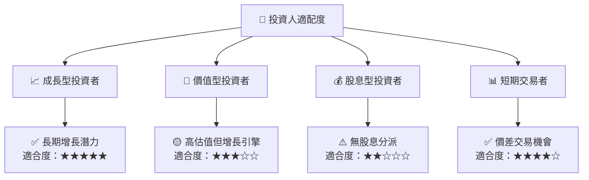

### 10.5 關鍵監控指標

| 類型 | 指標 | 關注點 | 頻率 |
|------|------|--------|-----|
| 需求 | 電動車交付量 | 市場需求壓力 | 每季度 |
| 研發 | 新技術開發 | 領先地位持續性 | 每半年 |
| 財務 | 利潤率演變 | 成本控制與盈利能力 | 每季度 |
| 法規 | 環保要求 | 政策變動潛在影響 | 每季度 |

---

> **免責聲明**：本報告為 AI 自動生成，僅供研究參考，不構成投資建議。投資有風險，入市需謹慎。