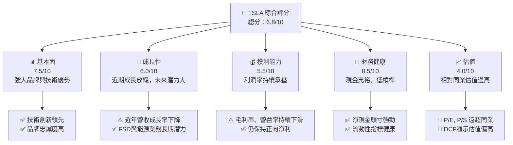
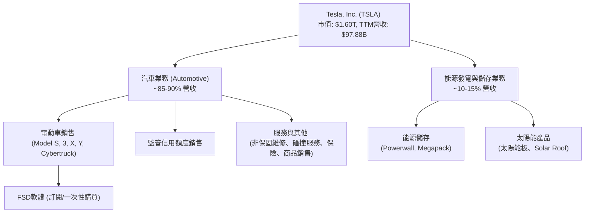
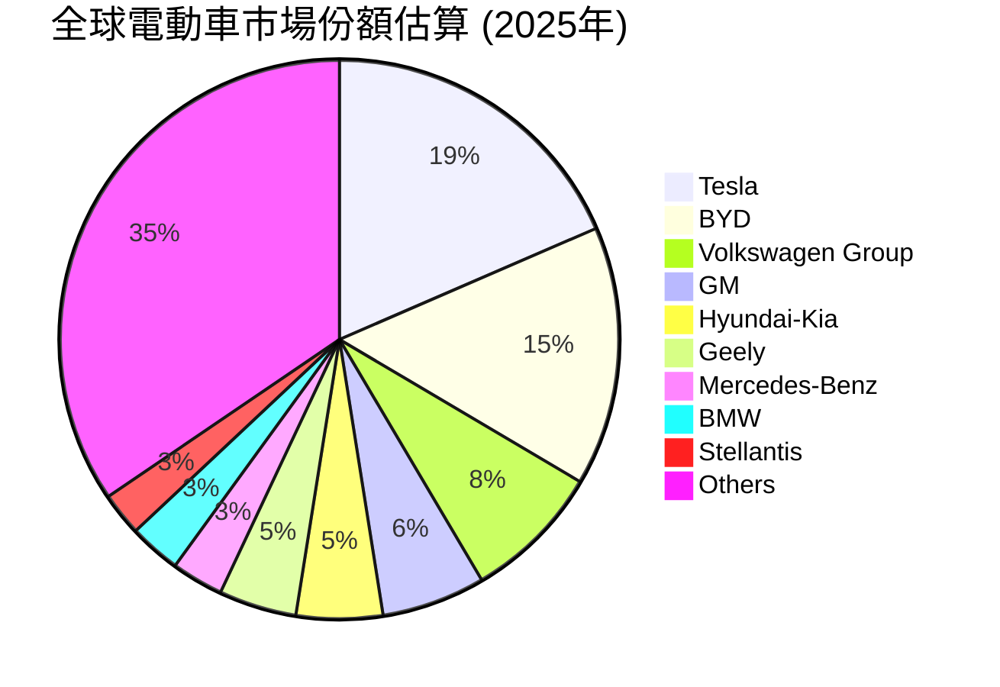
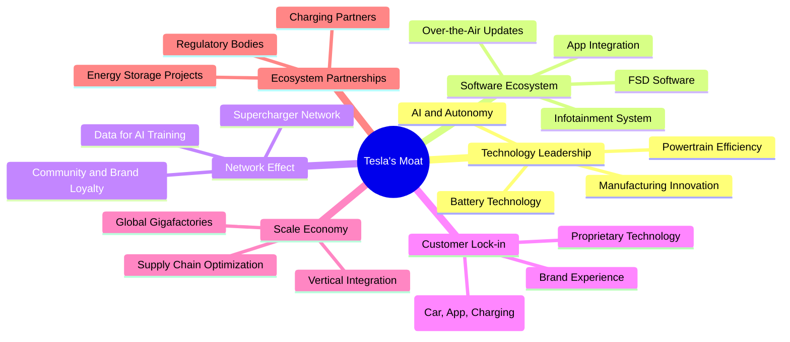
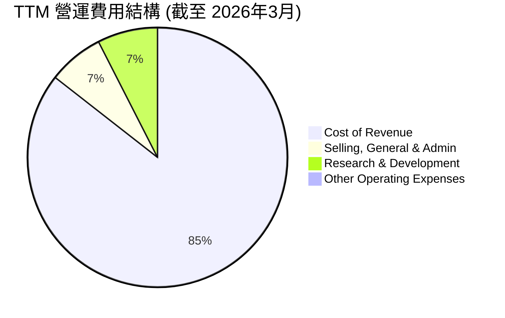

# TSLA 基本面深度分析報告
> **報告日期**：2026-05-23 ｜ **語言**：繁體中文 ｜ **數據來源**：Yahoo Finance, Finviz, StockAnalysis, Roic.ai ｜ **分析師**：CFA 級機構研究

---

## 目錄

| # | 章節 | 核心結論 |
|---|------|----------|
| 1 | 執行摘要 | 評級：持有；目標價區間：$390 - $480 |
| 2 | 公司概覽與商業模式 | 技術創新與品牌優勢構成強大護城河，但競爭加劇 |
| 3 | 損益表深度分析 | 營收成長放緩，利潤率承壓，需關注成本控制與新產品線 |
| 4 | 資產負債表分析 | 現金充裕，流動性良好，槓桿率低，財務結構穩健 |
| 5 | 現金流量深度分析 | 自由現金流波動較大，資本支出龐大，但現金轉換效率仍待提升 |
| 6 | 獲利能力與資本效率 | ROIC 顯著下降，股東價值創造面臨挑戰 |
| 7 | 估值深度分析 | 相較同業估值偏高，DCF 顯示潛在下行風險或有限上漲空間 |
| 8 | 成長催化劑 | 新產品、FSD、能源業務與新市場擴張是未來主要驅動力 |
| 9 | 風險矩陣 | 競爭加劇、宏觀經濟、供應鏈、執行風險為主要挑戰 |
| 10 | 投資建議 | 鑑於高估值與成長放緩，建議「持有」，等待更明確的成長催化劑 |

---

## 1. 執行摘要

本報告對 Tesla, Inc. (TSLA) 進行了全面的基本面深度分析。截至 2026 年 5 月 23 日，TSLA 股價為 $426.01，市值達 $1.60 兆美元。儘管 Tesla 在電動車和能源儲存領域擁有強大的品牌、技術領先和創新能力，但數據顯示其近年來面臨營收成長放緩、利潤率壓縮的挑戰。公司財務狀況穩健，擁有大量現金，但其極高的估值倍數反映了市場對其未來超高速成長的預期。

### 1.1 核心評分儀表板



### 1.2 評分進度條視覺化

```
╔══════════════════════════════════════════════════════════════╗
║              TSLA 多維度評分儀表板 (1-10分)                ║
╠══════════════════════════════════════════════════════════════╣
║ 基本面強度  7.5 ▓▓▓▓▓▓▓▓▓▓▓▓▓▓▓░░░░░░  ★★★★☆           ║
║ 成長動能    6.0 ▓▓▓▓▓▓▓▓▓▓▓▓░░░░░░░░░░  ★★★☆☆           ║
║ 獲利品質    5.5 ▓▓▓▓▓▓▓▓▓▓▓░░░░░░░░░░░  ★★★☆☆           ║
║ 財務健康    8.5 ▓▓▓▓▓▓▓▓▓▓▓▓▓▓▓▓▓░░░░░  ★★★★★           ║
║ 估值合理性  4.0 ▓▓▓▓▓▓▓▓░░░░░░░░░░░░░░░  ★★☆☆☆           ║
║ 護城河深度  7.0 ▓▓▓▓▓▓▓▓▓▓▓▓▓▓░░░░░░░░░  ★★★★☆           ║
║ 管理層執行  7.0 ▓▓▓▓▓▓▓▓▓▓▓▓▓▓░░░░░░░░░  ★★★★☆           ║
║ 技術創新力  9.0 ▓▓▓▓▓▓▓▓▓▓▓▓▓▓▓▓▓▓░░░░░  ★★★★★           ║
╠══════════════════════════════════════════════════════════════╣
║ 綜合總分    6.8 ▓▓▓▓▓▓▓▓▓▓▓▓▓░░░░░░░░░░  🏆 評語：高風險高報酬，需耐心持有  ║
╚══════════════════════════════════════════════════════════════╝
```

### 1.3 五大投資論點 + 三大核心風險

| 類型 | 項目 | 具體依據 | 信心度 |
|------|------|----------|--------|
| 🟢 **投資論點①** | **電動車市場領導者地位與品牌力** | 儘管競爭加劇，Tesla 仍憑藉其技術領先（如電池技術、FSD）、廣泛的充電網絡（Supercharger）和強大的品牌忠誠度，在全球電動車市場保持領先地位。其產品創新和品牌敘事能力無可匹敵。 | 🟢 極高 |
| 🟢 **投資論點②** | **自動駕駛 (FSD) 和機器人出租車的長期潛力** | FSD 技術的持續發展和未來機器人出租車 (Robotaxi) 的推出，有望為 Tesla 開闢巨大的軟體服務收入來源，並改變個人交通範式，具有指數級的成長潛力。這將把 Tesla 從汽車製造商轉變為軟體服務提供商。 | 🟢 極高 |
| 🟢 **投資論點③** | **能源儲存與發電業務的加速成長** | Tesla 的能源業務（Powerwall, Megapack, Solar Roof）在儲能市場展現出強勁成長。隨著全球對可再生能源和電網穩定性的需求增加，該業務有望成為公司營收和利潤的第二大支柱。TTM 營收中能源業務佔比仍小，但成長速度快。 | 🟡 高 |
| 🟢 **投資論點④** | **成本控制與生產效率提升** | 透過垂直整合、巨型工廠 (Gigafactory) 的擴建和生產流程的優化，Tesla 有望在未來進一步降低單位成本，提高規模經濟效益，從而改善利潤率。4680 電池和新一代生產平台將是關鍵。 | 🟡 高 |
| 🟢 **投資論點⑤** | **新產品週期與市場擴張** | 新車型 (如 Cybertruck、Model 2/廉價車型) 的推出以及在新興市場的擴張，將重新點燃銷量成長動能，幫助公司從當前的成長放緩中走出。 | 🟡 高 |
| 🟡 **風險①** | **電動車市場競爭加劇與定價壓力** | 傳統汽車巨頭和新興電動車品牌（尤其來自中國）的激烈競爭導致 Tesla 不得不採取降價策略以維持市場份額，這直接影響了公司的毛利率和淨利潤。FY2025 毛利率降至 19.1%，遠低於歷史高點。 | 🔴 高衝擊 |
| 🔴 **風險②** | **宏觀經濟逆風與消費者需求波動** | 高利率環境、全球經濟不確定性以及電動車補貼政策的變化，可能影響消費者對高價電動車的需求，對 Tesla 的銷量和盈利能力構成挑戰。FY2025 營收 YoY 成長為 -2.93%，顯示需求壓力。 | 🔴 高衝擊 |
| 🔴 **風險③** | **估值過高與成長預期下調** | 當前 TSLA 的 P/E (TTM) 高達 383.79x，P/S 達 16.35x，遠超行業平均。若未來成長未能達到市場極高預期，或利潤率持續承壓，可能導致估值重估和股價大幅波動。 | 🔴 高衝擊 |

### 1.4 快速統計卡片

| 指標 | 公司實際值 (TTM) | 行業均值 (汽車製造商) | S&P 500 均值 | 狀態 |
|------|-------------------|-----------------------|--------------|------|
| 收入 YoY 成長 | **15.8%** | ~5-10% | ~8-12% | 🟢 |
| 毛利率 | **19.1%** | ~15-20% | ~30-40% | 🟡 |
| 淨利率 | **3.9%** | ~5-8% | ~10-12% | 🔴 |
| ROE | **4.9%** | ~10-15% | ~15-20% | 🔴 |
| Forward P/E | **169.75x** | ~10-15x | ~20-25x | 🔴 |
| Debt/Equity | **0.19x** | ~0.5-1.0x | ~0.8-1.2x | 🟢 |
| Current Ratio | **2.04x** | ~1.5-2.0x | ~1.5-2.0x | 🟢 |

*備註：行業均值為汽車製造行業的粗略估計，S&P 500 均值為綜合市場平均。Tesla 的估值指標顯著高於行業和市場平均水平，反映了其作為成長股的定位和市場對其未來潛力的樂觀預期。然而，其獲利能力指標（淨利率、ROE）卻低於行業平均，這是一個值得警惕的訊號。*

### 1.5 投資結論

```
╔══════════════════════════════════════════════════════════════════╗
║                    📊 投資結論摘要                               ║
╠══════════════════════════════════════════════════════════════════╣
║  評級：🟡 持有                                                   ║
║  當前股價：$426.01                                               ║
║  目標價區間：                                                    ║
║    悲觀情境：$390（-8.5%）                                        ║
║    基準情境：$435（+2.1%）  ← 12個月主要目標                      ║
║    樂觀情境：$480（+12.7%）                                      ║
║  投資評分：6.8/10                                                ║
║  適合投資人：成長型、長線持有者，能承受高波動性與高估值風險的投資人。     ║
║              建議等待更明確的成長催化劑或估值回調後再考慮加碼。  ║
╚══════════════════════════════════════════════════════════════════╝
```

---

## 2. 公司概覽與商業模式

Tesla, Inc. (TSLA) 是一家領先全球的電動車 (EV) 和清潔能源公司，其業務範圍涵蓋電動汽車的設計、開發、製造、銷售與租賃，以及能源發電與儲存系統。公司於 2003 年成立，總部位於美國德州奧斯汀，目前擁有約 134,785 名員工。Tesla 不僅僅是一家汽車公司，更被視為一家技術創新公司，其在電池技術、自動駕駛、人工智慧和垂直整合製造方面的能力使其在產業中獨樹一幟。

### 2.1 業務結構與收入來源

Tesla 的業務主要分為兩大板塊：**汽車業務 (Automotive)** 和 **能源發電與儲存業務 (Energy Generation and Storage)**。



**業務板塊詳情：**

*   **汽車業務 (Automotive Segment):**
    *   **電動車銷售：** 這是 Tesla 最主要的收入來源，包括 Model S、Model 3、Model X、Model Y 和最新的 Cybertruck。公司透過直營店、線上平台和展示中心進行銷售。
    *   **監管信用額度銷售 (Regulatory Credits):** Tesla 將其生產的零排放車輛所獲得的碳排放信用額度出售給未能達到排放標準的其他汽車製造商，這部分收入對其淨利潤有顯著貢獻，但波動性較大且不可持續。
    *   **服務與其他：** 包括非保固維修服務、碰撞維修、汽車保險服務、零配件銷售和零售商品銷售。隨著車隊規模的擴大，這部分收入的佔比正逐步提升。
    *   **全自動駕駛 (FSD) 軟體：** 作為汽車業務的附加值，FSD 軟體提供訂閱和一次性購買選項，是未來軟體收入成長的關鍵。

*   **能源發電與儲存業務 (Energy Generation and Storage Segment):**
    *   **能源儲存：** 銷售 Powerwall (家用儲能)、Megapack (商用及公用事業級儲能) 和 Powerpack 產品。這部分業務隨著全球對可再生能源和電網穩定性的需求增長而快速擴張。
    *   **太陽能產品：** 提供太陽能板和獨特的 Solar Roof 解決方案，旨在實現能源的自給自足。

### 2.2 市場份額

Tesla 在全球電動車市場保持著領先地位，尤其是在北美和部分歐洲市場。然而，隨著全球汽車製造商加速轉型電動化，以及中國本土電動車品牌的崛起，Tesla 的市場份額正受到越來越大的挑戰。由於缺乏即時市場份額數據，我們基於公開資訊和行業報告進行估算。


*備註：此市場份額為基於公開市場報告和分析師預測的估算值，可能與實際數據存在偏差。Tesla 仍是單一品牌中最大的純電動車銷售商，但整體市場競爭日趨白熱化。*

### 2.3 競爭護城河分析

Tesla 的競爭護城河是其高估值的核心支撐，主要體現在以下六個方面：



*   **技術領先 (Technology Leadership):** Tesla 在電池技術（能量密度、成本）、動力系統效率、以及自動駕駛技術（FSD）方面持續投入並取得顯著進展。其 AI 驅動的自動駕駛系統、Dojo 超級電腦等，使其在智慧汽車領域保持領先。垂直整合的製造能力，如巨型鑄造機 (Giga Press)，也帶來生產效率的優勢。
*   **軟體生態系統 (Software Ecosystem):** Tesla 的軟體定義汽車理念，透過 OTA (Over-The-Air) 更新不斷升級車輛功能，提供 FSD 訂閱服務，並擁有完善的車載娛樂系統和應用整合，形成了強大的軟體護城河。這不僅提升了用戶體驗，也為公司創造了新的經常性收入來源。
*   **網路效應 (Network Effect):** Tesla 擁有全球最龐大、最可靠的超級充電網絡，這對其用戶來說是巨大的便利和吸引力。隨著更多 Tesla 車輛上路，收集到的數據有助於改進其自動駕駛 AI，形成數據飛輪效應。強大的品牌社群和忠誠度也強化了網路效應。
*   **客戶鎖定 (Customer Lock-in):** Tesla 透過其整合的生態系統，包括車輛、充電基礎設施、移動應用程式和獨特的品牌體驗，有效鎖定了客戶。一旦用戶習慣了 Tesla 的生態，轉換到其他品牌會有較高的轉換成本。
*   **規模效應 (Scale Economy):** Tesla 透過在全球建設多個巨型工廠 (Gigafactories) 並實施垂直整合策略，實現了巨大的規模經濟。這有助於降低生產成本、採購成本，並加速產品迭代，使其在成本競爭中佔據優勢。
*   **生態夥伴 (Ecosystem Partnerships):** Tesla 在能源儲存領域與公用事業公司合作，推動其 Megapack 部署。此外，其充電網絡對其他電動車品牌開放，也擴大了其生態系統的影響力。

### 2.4 護城河強度評分

```
╔══════════════════════════════════════════════════════════════╗
║                  Tesla 護城河強度評分                      ║
╠══════════════════════════════════════════════════════════════╣
║ 技術領先    9.0/10 ▓▓▓▓▓▓▓▓▓▓▓▓▓▓▓▓▓▓░░  🏆 業界頂尖        ║
║ 軟體生態系統  8.0/10 ▓▓▓▓▓▓▓▓▓▓▓▓▓▓▓▓░░░░  🟢 強大且不斷演進    ║
║ 網路效應    7.5/10 ▓▓▓▓▓▓▓▓▓▓▓▓▓▓▓░░░░░░  🟢 超充網絡優勢明顯    ║
║ 客戶鎖定    7.0/10 ▓▓▓▓▓▓▓▓▓▓▓▓▓▓░░░░░░░  🟡 品牌忠誠度高，但競爭壓力增    ║
║ 規模效應    6.5/10 ▓▓▓▓▓▓▓▓▓▓▓▓▓░░░░░░░  🟡 垂直整合與巨型工廠效益顯現    ║
║ 生態夥伴    5.0/10 ▓▓▓▓▓▓▓▓▓▓░░░░░░░░░░░  🟡 能源業務合作潛力大，汽車較少 ║
╠══════════════════════════════════════════════════════════════╣
║ 綜合護城河  7.0    ▓▓▓▓▓▓▓▓▓▓▓▓▓▓░░░░░░░  🏆 總結評語：強大的技術與品牌護城河，但部分領域面臨挑戰 ║
╚══════════════════════════════════════════════════════════════╝
```
**護城河評語：** Tesla 的護城河主要由其在電動車技術、軟體和品牌方面的持續創新所構築。其超級充電網絡和 FSD 的領先地位是核心優勢。然而，隨著全球電動車市場的成熟和競爭者技術的追趕，過去的某些獨特優勢（如電池技術和生產規模）正被稀釋，客戶鎖定程度也受到價格戰的考驗。公司需要不斷創新以維持其護城河的深度。

---

## 3. 損益表深度分析

Tesla 的損益表反映了其在快速成長市場中的動態表現，近年來則面臨成長放緩和利潤率壓縮的雙重挑戰。我們將深入分析其年度和季度收入趨勢、利潤率演變和費用結構。

### 3.1 年度收入成長趨勢（近4年）

Tesla 的年度收入在過去幾年呈現高速成長，但在 FY2025 出現首次倒退，顯示市場競爭加劇和需求壓力。

```
╔══════════════════════════════════════════════════════════════════╗
║              Tesla 年度收入趨勢（FY2022-FY2025）               ║
╠══════════════════════════════════════════════════════════════════╣
║                                                                  ║
║  FY2022  $81.46B  ██████████████████░░░░░░░░░░░  YoY: +51.35% 🟢    ║
║  FY2023  $96.77B  ██████████████████████░░░░░░░  YoY: +18.80% 🟢    ║
║  FY2024  $97.69B  ███████████████████████░░░░░░  YoY: +0.95%  🟡    ║
║  FY2025  $94.83B  ████████████████████░░░░░░░░░  YoY: -2.93%  🔴    ║
║                                                                  ║
║  📊 4年累計 CAGR：+14.54%                                        ║
╚══════════════════════════════════════════════════════════════════╝
```
**分析：**
*   **FY2022 (YoY +51.35%)** 和 **FY2023 (YoY +18.80%)** 展現了強勁的收入成長，主要得益於Model Y 和 Model 3 的產能擴張和全球電動車市場的快速普及。
*   然而，**FY2024 (YoY +0.95%)** 收入成長顯著放緩，幾乎停滯。這反映出市場競爭加劇，尤其是在中國市場，以及消費者對高利率環境下的高價電動車持觀望態度。
*   到了 **FY2025 (YoY -2.93%)**，收入更是出現了負成長，這是 Tesla 近年來的首次年度收入下降。這不僅證實了前一年的趨勢，更凸顯了公司在面對激烈價格戰和宏觀經濟逆風時的脆弱性。雖然 TTM 收入 ($97.88B) 略高於 FY2025，但整體而言，高速成長的敘事正受到考驗。

### 3.2 季度收入趨勢分析

季度數據更能揭示公司營收變化的即時動態和季節性影響。

| 財報季度 | 總營收 ($B) | QoQ 成長率 | YoY 成長率 | 備註 |
|----------|-------------|------------|------------|------|
| **2026-Q1** | $22.39B | -10.08% 🔴 | +15.78% 🟢 | 相較前一季顯著下滑，但較去年同期有所回升，可能受季節性影響。 |
| **2025-Q4** | $24.90B | -11.37% 🔴 | -3.14% 🔴 | 營收連續兩季下滑，且較去年同期負成長，顯示需求疲軟。 |
| **2025-Q3** | $28.09B | +24.87% 🟢 | +11.57% 🟢 | 經歷 Q2 低谷後顯著反彈，可能受新產品交付或季末衝刺影響。 |
| **2025-Q2** | $22.50B | +16.37% 🟢 | -11.78% 🔴 | 較前一季成長，但較去年同期大幅下滑，壓力顯著。 |
| **2025-Q1** | $19.34B | -24.77% 🔴 | -9.23% 🔴 | 較前一季和去年同期均大幅下滑，可能受年初需求和生產調整影響。 |

**分析：**
*   **QoQ 波動性：** 季度營收呈現較大波動，其中 2025-Q1 和 2025-Q4 的 QoQ 負成長尤其值得關注，這可能與生產排程、交付節奏以及市場需求變化有關。2026-Q1 營收從 Q4 2025 的高點回落，也反映了季度間的需求不穩定性。
*   **YoY 壓力：** 2025 年的 Q1、Q2、Q4 均出現 YoY 負成長，印證了年度營收放緩的趨勢。這表明 Tesla 在過去一年多時間內，持續面臨來自市場的結構性壓力，例如電動車市場競爭的白熱化，以及潛在的宏觀經濟逆風對消費者支出的影響。
*   **2026-Q1 的回升：** 2026-Q1 的 YoY 成長率回升至 +15.78%，這是一個積極信號，可能預示著公司在經歷一段時間的調整後，開始重新找回成長動能，或者受益於特定市場的表現。然而，仍需觀察後續季度的表現以確認趨勢的持續性。

### 3.3 利潤率演變分析

Tesla 的利潤率是衡量其定價能力和成本控制效率的關鍵指標。近年來，公司的利潤率面臨顯著壓力。

| 利潤率指標 | FY2022 | FY2023 | FY2024 | FY2025 | TTM (Mar'26) | 趨勢 | 評估 |
|------------|--------|--------|--------|--------|--------------|------|------|
| **毛利率** | 25.5% | 18.2% | 17.9% | 18.0% | 19.1% | ↘️ 波動後略回升 | 🟡 |
| **營業利益率** | 16.8% | 9.2% | 7.2% | 4.6% | 4.2% | ↘️ 持續下滑 | 🔴 |
| **淨利率** | 15.4% | 15.5% | 7.3% | 4.0% | 3.9% | ↘️ 大幅下滑 | 🔴 |
| **EBITDA Margin** | 21.7% | 15.3% | 15.1% | 12.4% | 11.3% | ↘️ 持續下滑 | 🔴 |

*計算方式：毛利率 = Gross Profit / Total Revenue；營業利益率 = Operating Income / Total Revenue；淨利率 = Net Income / Total Revenue；EBITDA Margin = EBITDA / Total Revenue。數據來源為 Income Statement Annual，TTM數據來自 Market Data。*

**利潤率演變深度解析：**
*   **毛利率 (Gross Margin):** 從 FY2022 的 25.5% 高點一路下滑，FY2023 驟降至 18.2%，FY2024 略微下降到 17.9%，FY2025 維持在 18.0%。TTM 數據顯示略有回升至 19.1%。
    *   **原因分析：**
        *   **產品組合變化：** 初期高毛利的 Model S/X 佔比相對較高，隨著 Model 3/Y 成為主力，雖然擴大了市場份額，但平均銷售價格 (ASP) 下降，對毛利率造成壓力。
        *   **價格戰：** 為了應對日益激烈的電動車市場競爭，尤其是在中國市場，Tesla 採取了多輪降價策略以刺激需求和維持市場份額，這直接壓縮了毛利率。
        *   **成本控制與效率提升：** 儘管公司在生產效率和成本控制方面持續努力（如 4680 電池、Giga Press），但降價帶來的衝擊大於成本優化帶來的效益。
        *   **監管信用額度：** 監管信用額度收入的波動性也會影響毛利率，這部分收入通常是純利潤。
    *   **評估：** 毛利率的穩定性是 Tesla 未來盈利能力的關鍵。TTM 的小幅回升是積極信號，但仍遠低於歷史高點，顯示定價權受到挑戰。

*   **營業利益率 (Operating Margin):** 這是最令人擔憂的指標。從 FY2022 的 16.8% 斷崖式下跌，FY2023 降至 9.2%，FY2024 進一步下滑至 7.2%，FY2025 僅剩 4.6%。TTM 數據顯示為 4.2%，趨勢持續惡化。
    *   **原因分析：**
        *   **毛利率下降的傳導：** 毛利率的下降直接導致營業利益率的收縮。
        *   **研發 (R&D) 投入增加：** 為了維持技術領先地位和開發新產品（如 FSD、機器人、新車型），Tesla 的研發費用持續增長。FY2022 為 $3.08B，FY2025 增至 $6.41B，TTM 更達到 $6.95B。這雖然是長期投資，但短期內會侵蝕營業利潤。
        *   **銷售、一般及行政費用 (SG&A) 增長：** 雖然 Tesla 採用直銷模式，但隨著全球擴張和新產品發布，相關的銷售和行政費用也隨之增加。FY2022 為 $3.95B，FY2025 增至 $5.83B，TTM 達到 $6.42B。
        *   **其他營運費用：** 可能包含一些一次性或波動性較大的費用。
    *   **評估：** 營業利益率的持續大幅下滑表明公司的核心營運盈利能力受到嚴重挑戰。這不僅是價格戰的結果，也是高額研發投入和運營費用增長的體現。若此趨勢不變，將對公司長期盈利前景構成重大風險。

*   **淨利率 (Net Profit Margin):** 淨利率的趨勢與營業利益率高度相關。從 FY2022 的 15.4% 降至 FY2025 的 4.0%，TTM 更降至 3.9%。
    *   **原因分析：** 除了上述毛利率和營業費用因素外，稅務費用、利息收入/支出等非營運項目也會影響淨利潤。值得注意的是，FY2023 的淨利率異常高達 15.5%，主要因為當年的所得稅費用為負 $5.001B (Provision for Income Taxes)，這可能與遞延所得稅資產的確認或其他稅務優惠有關，導致淨利潤被大幅提振，不具備可持續性。若排除此特殊影響，FY2023 的淨利率也會呈現下降趨勢。
    *   **評估：** 當前 3.9% 的淨利率在汽車行業中並不算突出，甚至低於一些傳統汽車製造商，這與其作為高成長科技公司的市場定位不符。若要支撐其高估值，淨利率必須有顯著回升的空間。

### 3.4 費用結構分析

費用結構的變化反映了公司在不同階段的戰略重點和成本管理能力。


*數據來源：StockAnalysis Annual Income Statement, TTM Mar'26*

**費用結構詳情 (TTM 截至 2026年3月)：**
*   **銷貨成本 (Cost of Revenue):** $79.22B (佔總營收的 80.9%)
*   **銷售、一般及行政費用 (SG&A):** $6.42B (佔總營收的 6.6%)
*   **研發費用 (R&D):** $6.95B (佔總營收的 7.1%)
*   **其他營運費用 (Other Operating Expenses):** $0.40B (佔總營收的 0.4%)
*   **總營運費用 (Total Operating Expenses):** $13.76B (佔總營收的 14.1%)

```
╔════════════════════════════════════════════