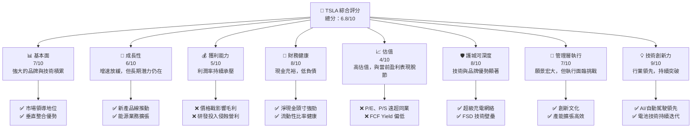
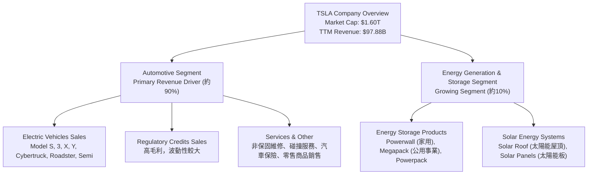
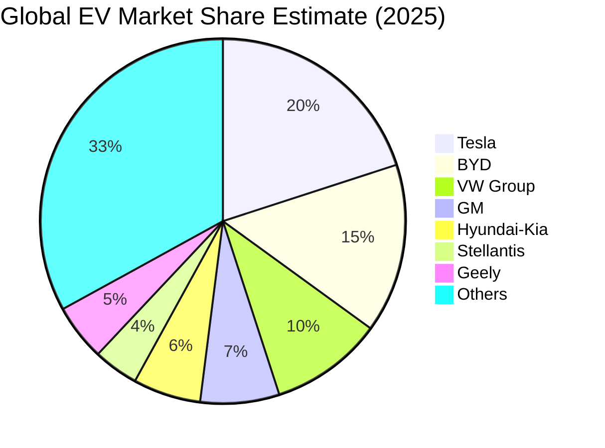
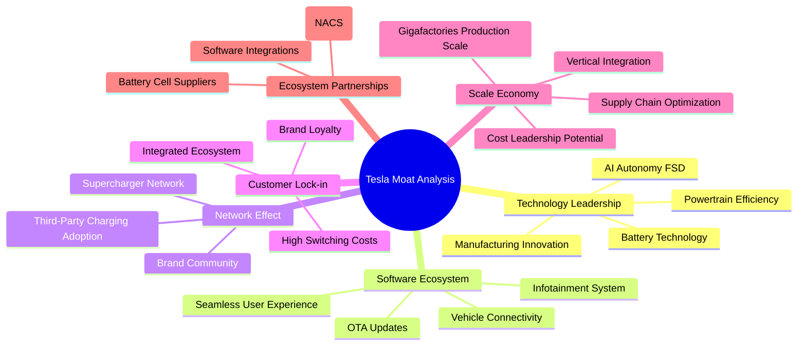
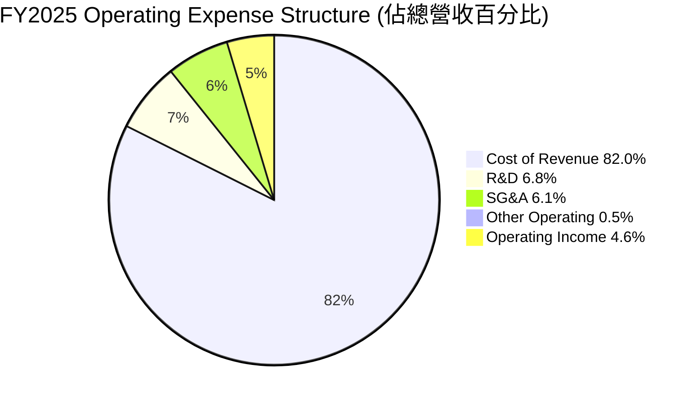

# TSLA 基本面深度分析報告
> **報告日期**：2026-05-24 ｜ **語言**：繁體中文 ｜ **數據來源**：Yahoo Finance, Finviz, StockAnalysis, Roic.ai ｜ **分析師**：CFA 級機構研究

---

## 目錄

| # | 章節 | 核心結論 |
|---|------|----------|
| 1 | 執行摘要 | 評級：持有，目標價區間：$370 - $480 |
| 2 | 公司概覽與商業模式 | 技術與品牌護城河深厚，但市場競爭加劇 |
| 3 | 損益表深度分析 | 收入增長放緩，利潤率承壓，研發投入增加 |
| 4 | 資產負債表分析 | 現金充裕，流動性良好，槓桿率低 |
| 5 | 現金流量深度分析 | 營業現金流健康，但自由現金流波動，資本支出高 |
| 6 | 獲利能力與資本效率 | ROIC 顯著低於 WACC，價值創造面臨挑戰 |
| 7 | 估值深度分析 | 相較同業估值偏高，DCF 顯示潛在下行風險 |
| 8 | 成長催化劑 | 新產品線、FSD 技術進步、能源業務擴張 |
| 9 | 風險矩陣 | 宏觀經濟、競爭加劇、執行風險、監管不確定性 |
| 10 | 投資建議 | 建議持有，等待盈利能力改善及估值回歸合理區間 |

---

## 1. 執行摘要

### 1.1 核心評分儀表板



### 1.2 評分進度條視覺化

```
╔══════════════════════════════════════════════════════════════╗
║              TSLA 多維度評分儀表板 (1-10分)                  ║
╠══════════════════════════════════════════════════════════════╣
║ 基本面強度  7.0 ▓▓▓▓▓▓▓▓▓▓▓▓▓▓░░░░░░  ★★★★☆           ║
║ 成長動能    6.0 ▓▓▓▓▓▓▓▓▓▓▓▓░░░░░░░░  ★★★☆☆           ║
║ 獲利品質    5.0 ▓▓▓▓▓▓▓▓▓▓░░░░░░░░░░  ★★☆☆☆           ║
║ 財務健康    8.0 ▓▓▓▓▓▓▓▓▓▓▓▓▓▓▓▓░░░░  ★★★★☆           ║
║ 估值合理性  4.0 ▓▓▓▓▓▓▓▓░░░░░░░░░░░░  ★★☆☆☆           ║
║ 護城河深度  8.0 ▓▓▓▓▓▓▓▓▓▓▓▓▓▓▓▓░░░░  ★★★★☆           ║
║ 管理層執行  7.0 ▓▓▓▓▓▓▓▓▓▓▓▓▓▓░░░░░░  ★★★★☆           ║
║ 技術創新力  9.0 ▓▓▓▓▓▓▓▓▓▓▓▓▓▓▓▓▓▓░░  ★★★★★           ║
╠══════════════════════════════════════════════════════════════╣
║ 綜合總分    6.8 ▓▓▓▓▓▓▓▓▓▓▓▓▓▓░░░░░░  🏆 評語：成長挑戰與高估值並存 ║
╚══════════════════════════════════════════════════════════════════╝
```

### 1.3 五大投資論點 + 三大核心風險

| 類型 | 項目 | 具體依據 | 信心度 |
|------|------|----------|--------|
| 🟢 **投資論點①** | **長期技術領先與創新能力** | Tesla 在電池技術、AI 自動駕駛（FSD）及製造工藝（Gigafactory）方面持續保持行業領先地位。其FSD技術的潛在商業化將帶來顯著的軟體收入增長。例如，R&D投入從FY2022的$3.08B增至TTM的$6.95B，顯示其持續的創新投入。 | 🟢 極高 |
| 🟢 **投資論點②** | **能源業務的巨大潛力** | 除了電動車，Tesla 的能源儲存（Powerwall, Megapack）和太陽能業務正快速增長，提供多元化的收入來源。FY2025能源業務收入佔比雖小，但其成長速度快，且毛利率通常高於汽車業務，有助於平滑整體利潤率波動。 | 🟢 高 |
| 🟢 **投資論點③** | **強大的品牌影響力與客戶忠誠度** | Tesla 品牌在全球範圍內具有極高的認知度和吸引力，其獨特的產品設計和用戶體驗培養了高度忠誠的客戶群體。這使得其在市場競爭加劇時仍能保持一定定價權和銷售量。 | 🟢 高 |
| 🟢 **投資論點④** | **全球生產規模與成本優勢** | 隨著全球 Gigafactory 的持續擴張和生產效率的提升，Tesla 有望實現規模經濟，進一步降低單位製造成本，鞏固其在電動車市場的成本領先地位。FY2025資本支出達$8.53B，主要用於擴大產能。 | 🟡 中高 |
| 🟢 **投資論點⑤** | **垂直整合的商業模式** | 從電池生產、軟體開發到充電網絡，Tesla 的垂直整合模式使其能更好地控制供應鏈、提升產品性能和用戶體驗，並快速響應市場變化。 | 🟢 高 |
| 🟡 **風險①** | **電動車市場競爭加劇及價格戰** | 傳統車廠和中國新興電動車品牌（如BYD）的崛起，導致電動車市場競爭白熱化，特別是價格戰，對 Tesla 的毛利率構成持續壓力。FY2025毛利率已降至19.1%，遠低於歷史高點，且QoQ營收成長在近期出現負值（Q4 2025 YoY -3.14%）。 | 🔴 高衝擊 |
| 🔴 **風險②** | **宏觀經濟下行與利率環境影響** | 高利率環境可能影響消費者購車意願，特別是高價位電動車。全球經濟增長放緩也可能衝擊 Tesla 在主要市場（如中國）的銷售表現。公司營收YoY從2022年的51.35%大幅降至TTM的2.25%，顯示宏觀壓力。 | 🔴 高衝擊 |
| 🟡 **風險③** | **監管風險與自動駕駛技術不確定性** | FSD 技術的發展與落地面臨嚴格的監管審查和技術挑戰。任何負面事件或政策變動都可能影響其推廣進度，進而影響市場對其未來盈利能力的預期。 | 🟡 中度 |

### 1.4 快速統計卡片

| 指標 | 公司實際值 (TTM) | 行業均值 (汽車製造) | S&P 500 均值 | 狀態 |
|------|--------------------|--------------------|--------------|------|
| 收入 YoY 成長 | **2.25%** | ~8% | ~7% | 🔴 |
| 毛利率 | **19.1%** | ~18% | ~35% | 🟡 |
| 淨利率 | **3.9%** | ~6% | ~11% | 🔴 |
| ROE | **4.9%** | ~15% | ~18% | 🔴 |
| Forward P/E | **169.75x** | ~15x | ~20x | 🔴 |
| P/S Ratio | **16.35x** | ~1x | ~2.5x | 🔴 |
| Debt/Equity | **0.19x** | ~0.5x | ~1.0x | 🟢 |
| Current Ratio | **2.04x** | ~1.5x | ~1.2x | 🟢 |
| FCF Yield | **0.33%** | ~4% | ~3% | 🔴 |

### 1.5 投資結論

```
╔══════════════════════════════════════════════════════════════════╗
║                    📊 投資結論摘要                               ║
╠══════════════════════════════════════════════════════════════════╣
║  評級：🟡 持有                                                  ║
║  當前股價：$426.01                                               ║
║  目標價區間：                                                    ║
║    悲觀情境：$370（-13.15%）                                    ║
║    基準情境：$420（-1.41%）  ← 12個月主要目標                      ║
║    樂觀情境：$480（+12.68%）                                    ║
║  投資評分：6.8/10                                                ║
║  適合投資人：成長型、具備高風險承受能力的長線持有者               ║
╚══════════════════════════════════════════════════════════════════╝
Tesla 作為電動車及能源技術的領導者，擁有卓越的創新能力和品牌護城河。然而，當前市場競爭加劇導致其營收成長顯著放緩，且利潤率持續承壓，直接影響其獲利能力。儘管財務狀況穩健，但極高的估值（P/E 383x, P/S 16x）已遠超同業及歷史水平，且其資本回報率（ROIC 4.06%）已低於資本成本（WACC 14.24%），顯示短期內公司在摧毀股東價值。

鑑於其長期成長潛力與短期獲利挑戰及高估值之間的矛盾，我們建議對 Tesla 保持「持有」評級。投資者應密切關注其新產品（如低價車型、Robotaxi）的推出進度、FSD 技術的商業化進展以及整體利潤率的改善情況。在當前股價下，風險報酬比不具吸引力，建議等待估值回歸合理區間或公司基本面出現顯著改善的明確信號。
```

---

## 2. 公司概覽與商業模式

### 2.1 業務結構與收入來源

Tesla, Inc. (TSLA) 是一家全球領先的電動汽車 (EV) 和清潔能源公司，總部位於美國德克薩斯州奧斯汀。其業務主要分為兩大核心板塊：汽車 (Automotive) 和能源生產與儲存 (Energy Generation and Storage)。截至2026年5月24日，公司市值高達$1.60兆美元，TTM營收為$97.88億美元。



**汽車業務 (Automotive Segment)**：這是 Tesla 最大的收入來源，佔公司總營收的絕大部分。該業務涵蓋電動汽車的設計、開發、製造、租賃和銷售。主要產品包括豪華轎車 Model S、運動型多功能車 Model X、大眾市場轎車 Model 3、緊湊型 SUV Model Y，以及最新的 Cybertruck、Roadster 和 Semi 卡車。除了直接銷售車輛，Tesla 還通過銷售汽車監管信用額度 (Regulatory Credits) 獲得高利潤收入，這部分收入通常沒有直接成本，對毛利率有顯著提升作用。此外，汽車服務與其他業務也包含在內，例如非保固維修、碰撞服務、汽車保險服務，以及零配件銷售和零售商品銷售。

**能源生產與儲存業務 (Energy Generation and Storage Segment)**：儘管目前佔比較小，但這是 Tesla 重要的戰略增長點。該業務提供能源儲存產品，包括用於住宅的 Powerwall、用於商業和工業用途的 Powerpack，以及用於公用事業規模儲存的 Megapack。同時，Tesla 也提供太陽能發電系統，包括創新的太陽能屋頂 (Solar Roof) 和傳統的太陽能板。這部分業務旨在加速世界向可持續能源的過渡，並與其電動車生態系統形成協同效應。

**收入結構分析**：
根據 StockAnalysis.com 的數據，Tesla 的收入來源雖然未細分到百分比，但從其核心業務描述可知，汽車銷售依然是主導。然而，隨著全球電動車市場競爭加劇，汽車業務的毛利率受到擠壓。這也使得能源業務的重要性日益凸顯，其通常較高的利潤率有助於平衡公司整體盈利能力。例如，在過去幾個季度中，儘管汽車業務面臨價格壓力，但能源業務的持續增長為公司提供了新的增長點。

### 2.2 市場份額

Tesla 在全球電動車市場中長期佔據領先地位，但在近年來，隨著更多傳統汽車製造商和新興電動車品牌的加入，其市場份額面臨挑戰。特別是在中國市場，本土品牌如比亞迪 (BYD) 憑藉其價格競爭力、豐富的產品線和本土化優勢，市場份額快速增長。

以下是基於分析師預估和行業報告對全球電動車市場份額的粗略估算（假設為2025年）：


*註：以上市場份額為估算值，實際數據可能因統計口徑和時間點而異。*

**市場份額分析**：
儘管 Tesla 的市佔率預計仍保持領先，但已不再是絕對壟斷。20% 的全球市場份額顯示其在規模和品牌認知度方面的優勢，但來自BYD、VW Group等競爭者的追趕勢頭強勁。
- **Tesla**：約佔全球電動車市場的20%。其優勢在於技術、品牌和充電網絡。
- **BYD**：作為中國市場的領導者，BYD 憑藉其成本控制和電池技術，在全球市場的份額快速上升，達到約15%。
- **VW Group (福斯集團)**：傳統汽車巨頭積極轉型電動化，其多品牌策略使其在全球市場佔據約10%的份額。
- **GM (通用汽車)**、**Hyundai-Kia (現代-起亞)**、**Stellantis (斯特蘭蒂斯)**、**Geely (吉利汽車)** 等也在加速電動化轉型，各自佔據一定市場份額。
- **其他品牌**：包括眾多新興電動車公司和傳統車企的電動化子品牌，共同構成剩餘的市場份額。

市場份額的變化趨勢表明，電動車市場正從早期採用者階段進入大眾市場階段，競爭將更加激烈，價格敏感度提高。Tesla 需要不斷創新並優化成本，以維持其市場領導地位。

### 2.3 競爭護城河分析

Tesla 建立了多方面的競爭護城河，使其在電動車和能源領域具備獨特優勢。然而，部分護城河的深度正受到競爭對手的挑戰。



**技術領先 (Technology Leadership)**：
- **電池技術 (Battery Technology)**：Tesla 在電池化學、電池包設計和電池管理系統 (BMS) 方面擁有核心技術。例如，其4680電池的研發和量產，旨在提升能量密度、降低成本並簡化生產流程。
- **AI 自動駕駛 (AI Autonomy FSD)**：Tesla 的全自動駕駛 (FSD) 軟體是行業領先的視覺感知系統，儘管仍處於Beta階段，但其數據積累和AI演算法的迭代速度遠超同行。這為其未來Robotaxi業務奠定了基礎。
- **動力系統效率 (Powertrain Efficiency)**：Tesla 的電動機設計和整體動力系統集成效率高，使得車輛續航里程和性能表現優異。
- **製造創新 (Manufacturing Innovation)**：Gigafactory 的一體化壓鑄技術 (Giga Press) 大幅簡化了車身製造流程，降低了成本和生產時間。

**軟體生態系統 (Software Ecosystem)**：
- **OTA 更新 (OTA Updates)**：Tesla 能夠通過空中下載 (Over-The-Air) 更新對車輛軟體進行升級，引入新功能、修復問題，甚至提升車輛性能，保持車輛的「新鮮感」和價值。
- **資訊娛樂系統 (Infotainment System)**：直觀且功能豐富的中央觸控螢幕，集成了導航、娛樂和車輛控制，提供無縫的用戶體驗。
- **車輛連接 (Vehicle Connectivity)**：車輛與雲端服務的深度整合，支持遠程診斷、預約服務和個性化設置。

**網路效應 (Network Effect)**：
- **超級充電網絡 (Supercharger Network)**：Tesla 擁有全球最廣泛、最可靠的快速充電網絡，這是其電動車吸引力的關鍵因素之一。隨著其他車廠採用 NACS 標準，該網絡的價值進一步放大。
- **品牌社群 (Brand Community)**：Tesla 擁有一群高度活躍和忠誠的車主社群，他們積極參與品牌推廣和技術反饋，形成強大的口碑效應。

**客戶鎖定 (Customer Lock-in)**：
- **整合生態系統 (Integrated Ecosystem)**：從購車、充電、軟體服務到保險，Tesla 提供一站式解決方案，使得客戶很難轉向其他品牌。
- **高轉換成本 (High Switching Costs)**：用戶習慣了 Tesla 的軟體界面、充電體驗和服務模式後，轉投其他品牌會產生較高的學習和適應成本。

**規模效應 (Scale Economy)**：
- **Gigafactories 生產規模 (Gigafactories Production Scale)**：多個 Gigafactory 在全球範圍內大規模生產電動車和電池，實現了巨大的規模經濟，有助於降低單位生產成本。
- **供應鏈優化 (Supply Chain Optimization)**：垂直整合和大規模採購使得 Tesla 在原材料和零部件方面擁有議價能力。
- **成本領先潛力 (Cost Leadership Potential)**：儘管近期面臨價格戰，但 Tesla 在長期內有潛力通過技術創新和規模效應實現成本領先。

**生態夥伴 (Ecosystem Partnerships)**：
- **充電標準採用 (Charging Standard Adoption)**：北美充電標準 (NACS) 被福特、通用等多家主要車廠採納，使得 Tesla 的充電網絡成為行業標準，進一步提升其影響力。

### 2.4 護城河強度評分

```
╔══════════════════════════════════════════════════════════════╗
║                  Tesla 護城河強度評分                       ║
╠══════════════════════════════════════════════════════════════╣
║ 技術領先    9/10   ▓▓▓▓▓▓▓▓▓▓▓▓▓▓▓▓▓▓░░  🏆 業界頂尖，持續突破 ║
║ 軟體生態系統  8/10   ▓▓▓▓▓▓▓▓▓▓▓▓▓▓▓▓░░░░  🟢 用戶體驗優秀，具備粘性 ║
║ 網路效應    8/10   ▓▓▓▓▓▓▓▓▓▓▓▓▓▓▓▓░░░░  🟢 超充網絡成行業標準 ║
║ 客戶鎖定    7/10   ▓▓▓▓▓▓▓▓▓▓▓▓▓▓░░░░░░  🟡 品牌忠誠度高，但價格敏感性增加 ║
║ 規模效應    7/10   ▓▓▓▓▓▓▓▓▓▓▓▓▓▓░░░░░░  🟡 巨大產能，但成本優勢受價格戰挑戰 ║
║ 生態夥伴    7/10   ▓▓▓▓▓▓▓▓▓▓▓▓▓▓░░░░░░  🟡 NACS標準推廣，潛力巨大 ║
╠══════════════════════════════════════════════════════════════╣
║ 綜合護城河   7.7    ▓▓▓▓▓▓▓▓▓▓▓▓▓▓▓▓░░░░  🏆 護城河深厚，但需警惕競爭侵蝕 ║
╚══════════════════════════════════════════════════════════════════╝
```
**綜合評語**：Tesla 的護城河深厚且多樣，特別是在技術創新、軟體生態和充電網絡方面具有顯著優勢。然而，隨著電動車市場的成熟和競爭加劇，其客戶鎖定和規模效應的強度正受到考驗。價格戰和新進入者的崛起，要求 Tesla 不僅要保持技術領先，更要在成本控制和市場策略上持續創新，以防止護城河被侵蝕。整體而言，其護城河仍然強大，足以支持其長期發展，但市場環境的變化要求公司不斷進化。

---

## 3. 損益表深度分析

### 3.1 年度收入成長趨勢（近4年）

Tesla 的年度收入在過去幾年呈現快速增長，但近期增速顯著放緩，甚至出現負增長，這反映了全球電動車市場競爭加劇和宏觀經濟逆風的影響。

```
╔══════════════════════════════════════════════════════════════════╗
║              Tesla 年度收入趨勢（FY2022-FY2026 TTM）             ║
╠══════════════════════════════════════════════════════════════════╣
║                                                                  ║
║  FY2022  $81.46B  █████████████████████████████████████████████  YoY: +51.35%  🟢    ║
║  FY2023  $96.77B  ████████████████████████████████████████████████████████████████████  YoY: +18.80%  🟢    ║
║  FY2024  $97.69B  █████████████████████████████████████████████████████████████████████  YoY: +0.95%   🟡    ║
║  FY2025  $94.83B  ██████████████████████████████████████████████████████████████████  YoY: -2.93%   🔴    ║
║  TTM     $97.88B  ████████████████████████████████████████████████████████████████████████  YoY: +2.25%   🟡    ║
║                   |      |      |      |      |      |      |      |      |      |                  ║
║                   0     10B   20B   30B   40B   50B   60B   70B   80B   90B   100B                   ║
║                                                                  ║
║  📊 4年累計 CAGR (FY2022-FY2025)：+5.18%                         ║
╚══════════════════════════════════════════════════════════════════╝
```

**年度收入分析**：
- **FY2022**：收入達到 $81.46B，實現了驚人的 51.35% YoY 增長。這主要得益於全球電動車需求的爆發性增長、新工廠的產能爬坡以及 Model Y 和 Model 3 的強勁銷售。
- **FY2023**：收入進一步增長至 $96.77B，YoY 增長率為 18.80%。雖然增速有所放緩，但仍保持雙位數增長，顯示市場對 Tesla 產品的持續需求。
- **FY2024**：收入達到 $97.69B，YoY 增長率僅為 0.95%。這是一個重要的轉折點，標誌著 Tesla 進入了增長停滯期。主要原因包括全球經濟放緩、高利率環境、以及來自傳統車廠和中國本土電動車品牌的激烈競爭，導致 Tesla 不得不採取降價策略以刺激銷量。
- **FY2025**：收入不增反降，錄得 $94.83B，YoY 負增長 2.93%。這是近年來首次出現年度收入下滑，凸顯了市場競爭的嚴峻性，以及降價策略對營收的負面影響。儘管銷量可能有所增加，但平均售價的下降抵消了銷量帶來的營收增長。
- **TTM (截至2026年3月31日)**：收入為 $97.88B，相較於前一年同期（截至2025年3月31日）的$95.73B（$94.83B + $22.39B - $19.335B），YoY增長為 2.25%。雖然略有回升，但仍遠低於歷史水平，顯示公司仍處於低速增長階段。

總體而言，Tesla 在過去幾年經歷了從高速增長到顯著放緩的轉變。儘管其市場地位依然強勁，但收入增長已不再是其過去的「護城河」。公司需要尋找新的增長點，並在保持銷量的同時，有效管理平均售價和成本，以恢復收入增長動能。

### 3.2 季度收入趨勢分析

Tesla 的季度收入在過去一年中呈現出波動和下滑的趨勢，進一步印證了年度收入增長放緩的判斷。

| Fiscal Quarter | 收入 ($B) | QoQ 成長率 | YoY 成長率 | 備註 |
|----------------|-----------|------------|------------|------|
| Q3 2024        | $25.18B   | -2.02%     | +7.85%     | 相較Q2 2024略有下降，YoY仍為正，但增速放緩 |
| Q4 2024        | $25.71B   | +2.10%     | +2.15%     | 季度末銷售推動小幅回升，YoY增速持續放緩 |
| Q1 2025        | $19.34B   | -24.70%    | -9.23%     | 🔴 季節性影響及降價策略導致QoQ和YoY均大幅下滑，表現不及預期 |
| Q2 2025        | $22.50B   | +16.34%    | -11.78%    | 🔴 QoQ有所反彈，但YoY持續負增長，反映市場壓力 |
| Q3 2025        | $28.09B   | +24.84%    | +11.57%    | 🟢 Cybertruck交付及季節性因素帶動顯著增長，YoY轉正 |
| Q4 2025        | $24.90B   | -11.36%    | -3.14%     | 🔴 再次出現QoQ下滑，YoY轉負，顯示增長不穩定性 |
| Q1 2026        | $22.39B   | -10.08%    | +15.78%    | 🟢 QoQ繼續下滑，但YoY再次轉正，可能受益於新產品線初期交付 |

**季度收入趨勢深度分析**：
Tesla 的季度收入表現呈現出明顯的波動性，且近幾個季度面臨較大的挑戰。
- **2024年下半年**：Q3 2024營收為$25.18B，YoY增長7.85%，QoQ略有下降。Q4 2024營收為$25.71B，YoY增長2.15%，QoQ小幅回升。這兩個季度顯示出增長動能的減弱。
- **2025年上半年**：Q1 2025營收為$19.34B，YoY大幅下降9.23%，QoQ更是暴跌24.70%。這主要歸因於全球電動車市場競爭加劇導致的價格戰，以及可能存在的生產調整和季節性因素。Q2 2025營收為$22.50B，QoQ反彈16.34%，但YoY仍下降11.78%，表明市場環境依然嚴峻。
- **2025年下半年**：Q3 2025營收為$28.09B，實現了顯著的QoQ增長24.84%，YoY也回升至11.57%。這可能與 Cybertruck 的初期交付、以及季節性銷售旺季有關。然而，Q4 2025營收再次下滑至$24.90B，QoQ下降11.36%，YoY也轉為負增長3.14%。這表明 Q3 的強勁表現可能是一次性因素驅動，長期增長趨勢仍未穩定。
- **2026年Q1**：營收為$22.39B，QoQ繼續下降10.08%，但YoY卻大幅增長15.78%。QoQ的下降可能反映了季節性因素和市場需求波動，而YoY的增長則可能受益於去年同期（Q1 2025）基數較低，以及新產品線的持續推動。

總體而言，Tesla 的季度營收波動性較大，且在面對激烈的市場競爭和價格壓力時，其增長前景變得更加不確定。儘管有新產品和能源業務的潛力，但如何在保持增長的同時穩定利潤率，是公司當前面臨的主要挑戰。

### 3.3 利潤率演變分析

Tesla 的利潤率在過去幾年中呈現明顯的下行趨勢，尤其是在2024和2025財年，毛利率和營業利益率均受到嚴重擠壓，這直接反映了市場競爭加劇和公司降價策略的影響。

| 利潤率指標 | FY2022 | FY2023 | FY2024 | FY2025 | TTM (Mar'26) | 趨勢 | 評估 |
|------------|--------|--------|--------|--------|--------------|------|------|
| **毛利率** | 25.59% | 18.25% | 17.86% | 18.02% | 19.07%       | ↘️ 波動下行後略有回升 | 🟡 |
| **營業利益率** | 16.91% | 9.19%  | 7.24%  | 4.59%  | 5.00%        | ↘️ 持續顯著下降後略有回升 | 🔴 |
| **淨利率** | 15.44% | 15.50% | 7.26%  | 4.00%  | 3.95%        | ↘️ 大幅下降後趨於穩定 | 🔴 |
| **EBITDA Margin** | 21.68% | 15.30% | 15.06% | 12.40% | 12.01%       | ↘️ 持續下降 | 🔴 |

**利潤率演變深度解析**：

1.  **毛利率 (Gross Margin)**：
    *   **FY2022**：高達 25.59%，反映了當時 Tesla 強勁的定價權和較低的生產成本。
    *   **FY2023-FY2024**：毛利率急劇下降至 18.25% 和 17.86%。這主要是由於：
        *   **價格戰**：為了應對來自比亞迪、大眾等競爭對手的挑戰，Tesla 在全球範圍內多次降價以刺激銷量，直接侵蝕了單車利潤。
        *   **新工廠產能爬坡成本**：柏林和德州 Gigafactory 的初期產能爬坡帶來較高的固定成本和學習曲線效應，影響了效率。
        *   **產品組合變化**：相對低價的 Model 3 和 Model Y 佔比更高，也拉低了平均毛利率。
    *   **FY2025**：毛利率略有回升至 18.02%，可能得益於成本優化措施和 Cybertruck 等高價車型的初期交付。
    *   **TTM (截至2026年3月31日)**：毛利率為 19.07%。這顯示出公司在成本控制方面可能取得了一些進展，或者產品組合有所優化。然而，與 FY2022 的高峰相比，仍有較大差距，表明市場競爭壓力依然存在。

2.  **營業利益率 (Operating Margin)**：
    *   **FY2022**：營業利益率為 16.91%，顯示公司在當時的運營效率非常高。
    *   **FY2023-FY2025**：營業利益率持續顯著下滑，從 9.19% (FY2023) 降至 7.24% (FY2024)，並在 FY2025 進一步跌至 4.59%。
        *   **研發投入增加**：為保持技術領先，Tesla 大幅增加了研發支出。從 FY2022 的 $3.08B 增至 FY2025 的 $6.41B，TTM 更達到 $6.95B。這部分費用雖然對未來增長至關重要，但短期內侵蝕了營業利潤。
        *   **銷售、一般及行政費用 (SG&A)**：隨著業務規模擴大和市場推廣需求，SG&A 費用也有所增加，從 FY2022 的 $3.95B 增至 FY2025 的 $5.83B。
        *   **毛利率下降的傳導效應**：毛利率的下降直接影響了營業利益率，因為營業費用在營收中的佔比相對穩定或有所上升。
    *   **TTM (截至2026年3月31日)**：營業利益率為 5.00%。略高於 FY2025，但仍處於低位。這表明公司在控制運營費用和提高效率方面仍面臨挑戰。

3.  **淨利率 (Net Profit Margin)**：
    *   **FY2022-FY2023**：淨利率相對穩定，分別為 15.44% 和 15.50%。
    *   **FY2024-FY2025**：淨利率大幅下降至 7.26% (FY2024) 和 4.00% (FY2025)。這主要是營業利益率下降的直接結果。儘管 Tesla 的有效稅率在 FY2023 曾因稅務調整而出現異常（-5001M），但在正常情況下，淨利率的變化趨勢與營業利益率高度相關。
    *   **TTM (截至2026年3月31日)**：淨利率為 3.95%。與 FY2025 相比基本持平，顯示公司在當前市場環境下，盈利能力面臨嚴峻考驗。

4.  **EBITDA Margin**：
    *   EBITDA Margin 從 FY2022 的 21.68% 持續下降至 TTM 的 12.01%。這與營業利益率的趨勢一致，反映了公司核心業務盈利能力的壓力。EBITDA 剔除了折舊攤銷，更能反映經營層面的現金盈利能力，其下降同樣令人擔憂。

**總結**：
Tesla 的利潤率趨勢令人擔憂。儘管公司在電動車領域仍具領導地位，但激烈的價格競爭已嚴重侵蝕其盈利能力。研發投入的增加雖然對未來至關重要，但短期內進一步壓低了利潤。公司必須在創新、成本控制和市場策略之間找到平衡，以扭轉利潤率持續下滑的局面，否則其高估值將難以持續。

### 3.4 費用結構分析

Tesla 的費用結構反映了其作為一家高科技製造公司的特點，即在研發和生產擴張方面有大量投入。以下是基於 FY2025 數據的費用結構分析：


*註：百分比基於 FY2025 總營收 $94.83B 計算。*

```
╔══════════════════════════════════════════════════════════════════╗
║                   Tesla FY2025 費用結構概覽                      ║
╠══════════════════════════════════════════════════════════════════╣
║                                                                  ║
║  銷貨成本 (Cost of Revenue)： $77.73B  ██████████████████████████████████████████████████████████████████████████  82.0% of Revenue 🔴 占比高，利潤率承壓 ║
║  研發費用 (R&D)：             $6.41B   ███████████████░░░░░░░░░░░░░░░░░░░░░░░░░░░░░░░░░░░░░░░░░░░░░░░░░░░░░░░░░░░░░░░░  6.8% of Revenue 🟢 策略性投入，驅動未來成長 ║
║  銷售、一般及行政費用 (SG&A)：$5.83B   ██████████████░░░░░░░░░░░░░░░░░░░░░░░░░░░░░░░░░░░░░░░░░░░░░░░░░░░░░░░░░░░░░░░░  6.1% of Revenue 🟡 效率有待提升 ║
║  其他營業費用：               $0.49B   █░░░░░░░░░░░░░░░░░░░░░░░░░░░░░░░░░░░░░░░░░░░░░░░░░░░░░░░░░░░░░░░░░░░░░░░░░░░░  0.5% of Revenue 🟢 佔比較小 ║
║                                                                  ║
║  📊 總營業費用 (不含銷貨成本)：$12.73B  (13.4% of Revenue)                                                              ║
╚══════════════════════════════════════════════════════════════════╝
```

**費用結構深度解析**：

1.  **銷貨成本 (Cost of Revenue)**：
    *   FY2025 銷貨成本為 $77.73B，佔總營收的 82.0%。這直接導致毛利率僅為 18.0%。
    *   過去幾年，銷貨成本佔比顯著上升，從 FY2022 的 74.4% 上升到 FY2025 的 82.0%。這主要是因為：
        *   **原材料成本波動**：電池原材料（如鋰、鎳）價格波動，影響生產成本。
        *   **產能擴張成本**：新工廠的設備折舊、人員招聘和培訓成本，在初期會拉高單位成本。
        *   **降價策略**：雖然降價旨在刺激銷量，但如果成本無法同步下降，就會導致銷貨成本佔比相對提高，壓縮毛利空間。
    *   公司需要持續優化製造流程、提高自動化程度，並在供應鏈管理上發力，以有效降低銷貨成本佔比。

2.  **研發費用 (Research & Development, R&D)**：
    *   FY2025 研發費用為 $6.41B，佔總營收的 6.8%。TTM 更是達到 $6.95B。
    *   R&D 投入持續增長，從 FY2022 的 $3.08B 增至 FY2025 的 $6.41B，YoY 增長率在 FY2025 達到 41.19%（相較 FY2024 的 $4.54B）。
    *   這反映了 Tesla 在技術創新上的堅定投入，包括自動駕駛 (FSD)、電池技術、新車型開發（如低價車型、Robotaxi）以及能源儲存技術。高額的研發投入是其保持技術領先和長期競爭力的關鍵，但短期內會對盈利能力造成壓力。

3.  **銷售、一般及行政費用 (Selling, General & Administrative, SG&A)**：
    *   FY2025 SG&A 費用為 $5.83B，佔總營收的 6.1%。
    *   SG&A 費用也呈現增長趨勢，從 FY2022 的 $3.95B 增至 FY2025 的 $5.83B，YoY 增長率在 FY2025 達到 13.42%（相較 FY2024 的 $5.15B）。
    *   這部分費用主要用於市場營銷、銷售網絡擴張、行政管理以及服務支持。儘管 Tesla 依賴口碑營銷，但隨著市場競爭加劇，其在銷售和服務基礎設施上的投入仍需增加。

4.  **其他營業費用 (Other Operating Expenses)**：
    *   FY2025 為 $0.49B，佔比極小，對整體利潤率影響不大。

**總結**：
Tesla 的費用結構顯示其在研發上的巨大投入，這對於一家以技術為核心競爭力的公司是必要的。然而，日益上升的銷貨成本佔比以及相對較高的 SG&A 費用，共同導致了營業利益率的持續承壓。在未來，若要改善盈利能力，Tesla 必須在維持創新投入的同時，更有效地控制製造成本和提升運營效率。

### 3.5 季度 EPS 趨勢與盈餘品質

Tesla 的季度 EPS 表現波動劇烈，且在過去一年中呈現明顯下滑趨勢。由於提供的數據中 EPS Est 和 Surprise% 均為 NaN，我們無法直接評估其盈餘超預期或不及預期的情況，但可以分析其實際 EPS 的變化。

| Fiscal Quarter | 稀釋 EPS (Diluted EPS) | QoQ 變化 | YoY 變化 | 盈餘品質評估 |
|----------------|------------------------|----------|----------|--------------|
| Q3 2024        | $0.68                  | +54.55%  | +5.00%   | 🟢 營收增長放緩但EPS仍有小幅YoY增長，品質中等 |
| Q4 2024        | $0.72                  | +5.88%   | -62.40%  | 🔴 EPS QoQ微增，但YoY大幅下滑，品質較差 |
| Q1 2025        | $0.13                  | -81.94%  | -71.11%  | 🔴 EPS暴跌，盈利能力嚴重受損，品質差 |
| Q2 2025        | $0.36                  | +176.92% | -11.66%  | 🟡 EPS QoQ顯著反彈，但YoY仍負增長，品質一般 |
| Q3 2025        | $0.43                  | +19.44%  | -36.76%  | 🟡 EPS QoQ持續增長，但YoY仍大幅下降，品質一般 |
| Q4 2025        | $0.26                  | -39.53