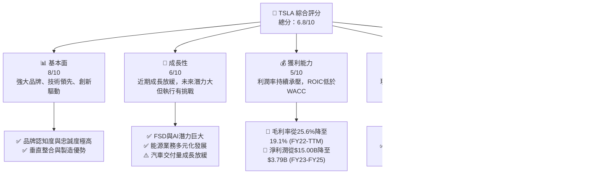
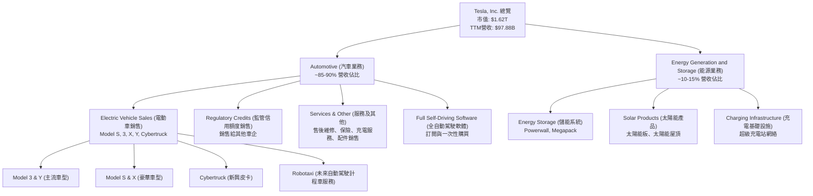
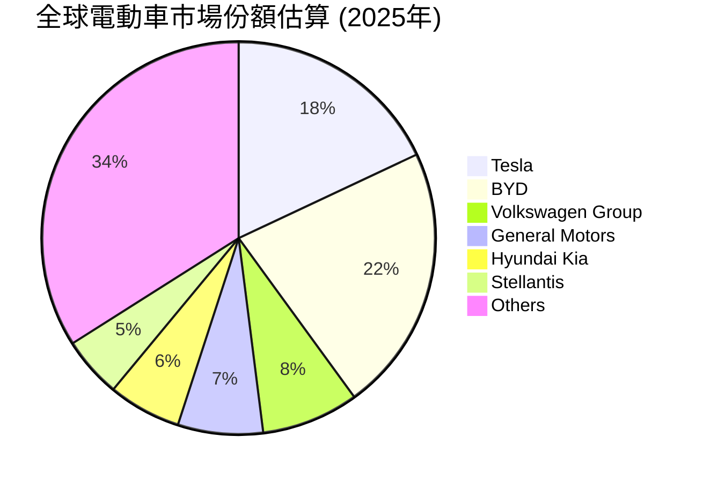
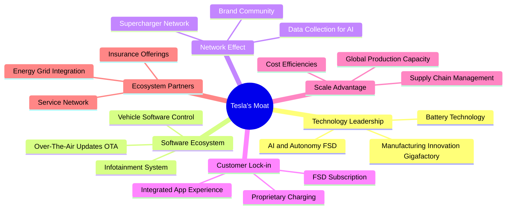

# TSLA 基本面深度分析報告
> **報告日期**：2026-05-26 ｜ **語言**：繁體中文 ｜ **數據來源**：Yahoo Finance, Finviz, StockAnalysis, Roic.ai ｜ **分析師**：CFA 級機構研究

## 目錄

| # | 章節 | 核心結論 |
|---|------|----------|
| 1 | 執行摘要 | 評級：持有；目標價區間：$370 - $550 |
| 2 | 公司概覽與商業模式 | 強大技術與品牌護城河，但面臨競爭加劇 |
| 3 | 損益表深度分析 | 營收成長放緩，利潤率顯著承壓 |
| 4 | 資產負債表分析 | 流動性良好，財務結構穩健，淨現金充裕 |
| 5 | 現金流量深度分析 | 自由現金流波動，資本支出高企，但轉換率改善 |
| 6 | 獲利能力與資本效率 | ROIC顯著下滑至低於WACC，價值創造能力受挑戰 |
| 7 | 估值深度分析 | 相較同業估值極高，DCF顯示當前股價具挑戰 |
| 8 | 成長催化劑 | FSD、Robotaxi、能源業務及新產品線為未來主要驅動力 |
| 9 | 風險矩陣 | 競爭加劇、執行風險與估值過高為主要考量 |
| 10 | 投資建議 | 建議持有，等待基本面改善與估值回歸合理區間 |

---

## 1. 執行摘要

本報告針對電動車領導者 Tesla, Inc. (TSLA) 進行全面而深入的基本面分析。儘管 Tesla 在技術創新、品牌影響力及長期成長潛力方面依然強勁，但近期的財務數據顯示其營收成長顯著放緩，且利潤率面臨巨大壓力，導致資本效率指標如 ROIC 大幅下滑，甚至低於其加權平均資本成本 (WACC)，暗示短期內存在價值破壞的風險。其估值倍數遠高於行業平均，反映市場對其未來成長的高度預期，但當前基本面表現未能完全支撐這一溢價。

### 1.1 核心評分儀表板



### 1.2 評分進度條視覺化

```
╔══════════════════════════════════════════════════════════════╗
║                TSLA 多維度評分儀表板 (1-10分)                ║
╠══════════════════════════════════════════════════════════════╣
║ 基本面強度  8.0 ▓▓▓▓▓▓▓▓▓▓▓▓▓▓▓▓░░░░  ★★★★☆           ║
║ 成長動能    6.0 ▓▓▓▓▓▓▓▓▓▓▓▓░░░░░░░░  ★★★☆☆           ║
║ 獲利品質    5.0 ▓▓▓▓▓▓▓▓▓▓░░░░░░░░░░  ★★☆☆☆           ║
║ 財務健康    9.0 ▓▓▓▓▓▓▓▓▓▓▓▓▓▓▓▓▓▓░░  ★★★★★           ║
║ 估值合理性  2.0 ▓▓▓▓░░░░░░░░░░░░░░░░  ★☆☆☆☆           ║
║ 護城河深度  8.5 ▓▓▓▓▓▓▓▓▓▓▓▓▓▓▓▓▓░░░  ★★★★☆           ║
║ 管理層執行  7.0 ▓▓▓▓▓▓▓▓▓▓▓▓▓▓░░░░░░  ★★★☆☆           ║
║ 技術創新力  9.5 ▓▓▓▓▓▓▓▓▓▓▓▓▓▓▓▓▓▓▓░  ★★★★★           ║
╠══════════════════════════════════════════════════════════════╣
║ 綜合總分    6.8 ▓▓▓▓▓▓▓▓▓▓▓▓▓▓░░░░░░  🏆 評語：成長挑戰與高估值並存 ║
╚══════════════════════════════════════════════════════════════╝
```

### 1.3 五大投資論點 + 三大核心風險

| 類型 | 項目 | 具體依據 | 信心度 |
|------|------|----------|--------|
| 🟢 **投資論點①** | **AI與自動駕駛技術領先** | FSD (Full Self-Driving) 軟體持續迭代，Robotaxi 計劃前景廣闊，結合 Optimus 人形機器人，構建未來AI生態系統。研發費用 (TTM) 達 $6.95B，YoY 成長 53%，顯示持續投入。 | 🟢 極高 |
| 🟢 **投資論點②** | **能源業務成長潛力** | 儲能系統 (Powerwall, Megapack) 與太陽能業務持續擴張，為公司提供多元化成長動能，降低對電動車單一業務的依賴。FY2025能源業務收入佔比預計達10-15%，成長率高於汽車業務。 | 🟢 高 |
| 🟢 **投資論點③** | **製造成本優勢與垂直整合** | Gigafactory 規模化生產、4680電池技術與高度垂直整合能力，長期有助於降低單位成本，提升毛利率。儘管短期毛利率承壓，長期潛力仍存。 | 🟢 高 |
| 🟢 **投資論點④** | **品牌忠誠度與全球影響力** | Tesla 品牌在全球電動車市場擁有極高的認知度與客戶忠誠度，強大的品牌效應為其新產品和服務推廣提供堅實基礎。 | 🟢 極高 |
| 🟢 **投資論點⑤** | **創新產品線與市場拓展** | Cybertruck 產能爬坡，Model 2 (或稱低價車型) 預期將擴大市場份額，以及未來潛在的 Robotaxi 服務，均為長期營收成長提供動力。 | 🟡 中高 |
| 🟡 **風險①** | **競爭加劇與利潤率壓力** | 全球電動車市場競爭白熱化，特別是來自中國廠商 (如比亞迪) 和傳統車企的挑戰，導致 Tesla 不得不降價促銷，毛利率從 FY2022 的 25.59% 大幅下滑至 TTM 的 19.1%，營業利益率從 16.98% 降至 4.2%。 | 🔴 高衝擊 |
| 🔴 **風險②** | **高估值與基本面脫鉤** | 當前 P/E (TTM) 高達 388x，P/S 16.5x，遠超行業平均及自身歷史水平。FY2025 ROIC 僅為 3.65%，顯著低於 WACC 12.43%，表明公司在該財年未能創造股東價值，估值存在泡沫化風險。 | 🔴 高衝擊 |
| 🟡 **風險③** | **關鍵人物風險與執行挑戰** | 執行長 Elon Musk 的多重職務與頻繁言論可能分散公司管理層的精力，並帶來額外的聲譽風險。新產品 (如 Cybertruck) 產能爬坡速度、FSD 落地進度及 Robotaxi 計劃的執行效率，均存在不確定性。 | 🟡 中度 |

### 1.4 快速統計卡片

| 指標 | 公司實際值 (TTM Mar 2026) | 行業均值 (汽車製造) | S&P 500 均值 | 狀態 |
|------|---------------------------|----------------------|--------------|------|
| 收入 YoY 成長 | **+2.25%** | ~5-10% | ~8-12% | 🔴 |
| 毛利率 | **19.1%** | ~15-25% | ~30-40% | 🟡 |
| 淨利率 | **3.9%** | ~5-10% | ~10-15% | 🔴 |
| ROE | **4.9%** | ~10-15% | ~15-20% | 🔴 |
| Forward P/E | **171.6x** | ~10-20x | ~20-25x | 🔴 |
| P/S Ratio | **16.5x** | ~0.5-2x | ~2-3x | 🔴 |
| Debt/Equity | **0.19x** | ~0.5-1x | ~0.8-1.2x | 🟢 |
| Current Ratio | **2.04x** | ~1.5-2x | ~1.2-1.5x | 🟢 |
| 淨現金 / 債務 | **$28.85B 淨現金** | 淨債務居多 | 淨債務居多 | 🟢 |

### 1.5 投資結論

```
╔══════════════════════════════════════════════════════════════════╗
║                    📊 投資結論摘要                               ║
╠══════════════════════════════════════════════════════════════════╣
║  評級：🟡 持有                                                   ║
║  當前股價：$430.77 (2026-05-26)                                  ║
║  目標價區間：                                                    ║
║    悲觀情境：$370（-14.1%）                                       ║
║    基準情境：$460（+6.8%）  ← 12個月主要目標                      ║
║    樂觀情境：$550（+27.7%）                                       ║
║  投資評分：6.8/10                                                ║
║  適合投資人：對高成長、高風險科技股有興趣，並具備長期持有耐心的投資人， ║
║              但需密切關注其利潤率、營收成長與估值變化。          ║
╚══════════════════════════════════════════════════════════════════╝
```

---

## 2. 公司概覽與商業模式

Tesla, Inc. (TSLA) 作為全球領先的電動車 (EV) 製造商，同時也是能源儲存、太陽能產品以及人工智能技術的創新者。公司不僅顛覆了傳統汽車行業，更在能源轉型和未來交通解決方案方面扮演關鍵角色。其獨特的商業模式結合了硬體製造、軟體服務與能源基礎設施，旨在打造一個完整的可持續能源生態系統。

### 2.1 業務結構與收入來源

Tesla 的業務主要分為兩大核心板塊：Automotive（汽車）和 Energy Generation and Storage（能源發電與儲存）。



**業務板塊詳述：**
*   **Automotive (汽車業務)**：這是 Tesla 最主要的收入來源，佔總營收的絕大部分。
    *   **電動車銷售**：包括 Model S、Model X、Model 3、Model Y 以及最新的 Cybertruck。這些車型涵蓋了從大眾市場到豪華市場的消費者需求。
    *   **監管信用額度銷售**：Tesla 因生產零排放汽車而獲得的碳排放信用額度，可以出售給未能達到排放標準的傳統汽車製造商，這部分收入對其淨利潤貢獻顯著，但長期趨勢可能因行業電動化進程而減少。
    *   **服務及其他**：包括非保固維修服務、碰撞維修、汽車保險服務、零配件銷售以及零售商品銷售。隨著車輛保有量的增加，這部分服務收入的穩定性與成長性日益凸顯。
    *   **全自動駕駛 (FSD) 軟體**：FSD 軟體作為高附加值的訂閱或一次性購買服務，是 Tesla 提升軟體收入和利潤率的關鍵。
*   **Energy Generation and Storage (能源發電與儲存)**：此業務板塊雖然規模較小，但成長迅速，是 Tesla 實現其可持續能源願景的重要組成部分。
    *   **儲能系統**：包括家用 Powerwall、商用 Powerpack 和大型電網級 Megapack，旨在幫助電網穩定、提升可再生能源利用率。
    *   **太陽能產品**：提供太陽能板和創新的太陽能屋頂 (Solar Roof) 解決方案。
    *   **充電基礎設施**：全球佈局的超級充電站 (Supercharger) 網絡，是其電動車生態系統的關鍵支撐。

從財務數據來看，儘管公司沒有提供細分收入，但根據行業報告，汽車銷售仍然是其主導。TTM 總收入為 $97.88B。

### 2.2 市場份額

Tesla 在全球電動車市場中佔據領先地位，尤其是在北美和歐洲市場具有強大的影響力。然而，近年來隨著各國政府對電動車產業的扶持，以及傳統車企和新興電動車品牌的崛起，市場競爭日益激烈，Tesla 的市場份額面臨挑戰，尤其是在中國市場。


*註：此市場份額為估算值，旨在說明 Tesla 在全球電動車市場中的相對位置，實際數據可能因統計機構和統計範圍而異。儘管 BYD 在總銷量上可能超越 Tesla，但在純電動車 (BEV) 領域，Tesla 仍是主要參與者之一。*

在北美市場，Tesla 仍然是純電動車的主導者，擁有超過一半的市場份額。但在歐洲和中國，其市場份額面臨大眾、BMW、梅賽德斯-奔馳以及蔚來、小鵬、理想、比亞迪等品牌的激烈競爭。

### 2.3 競爭護城河分析

Tesla 的競爭護城河是多方面的，主要體現在以下幾個關鍵領域：



1.  **Technology Leadership (技術領先)**：
    *   **電池技術**：Tesla 在電池技術方面持續創新，包括 4680 電池的研發和生產，旨在提高能量密度、降低成本並提升續航里程。
    *   **AI 與自動駕駛 (FSD)**：其全自動駕駛 (FSD) 軟體是行業領先的技術之一，透過大量數據收集和 AI 訓練，不斷提升自動駕駛能力。這也是其未來 Robotaxi 服務的基石。
    *   **製造創新 (Gigafactory)**：Tesla 的 Gigafactory 採用高度自動化和垂直整合的生產模式，持續優化生產效率和降低製造成本。
2.  **Software Ecosystem (軟體生態系統)**：
    *   **OTA 更新**：透過空中下載 (Over-The-Air, OTA) 更新，Tesla 能持續為車輛增加新功能、修復問題，保持產品的競爭力與新鮮感。
    *   **車載資訊娛樂系統**：直觀且功能豐富的車載軟體系統，提供卓越的用戶體驗。
    *   **車輛軟體控制**：高度整合的軟體控制系統，實現對車輛各功能的精準控制。
3.  **Network Effect (網路效應)**：
    *   **超級充電站網絡**：全球最廣泛、最可靠的快速充電網絡之一，是 Tesla 車主的重要便利性來源，增加了用戶黏性。
    *   **品牌社群**：Tesla 擁有龐大且忠誠的車主社群，形成強大的口碑傳播效應。
    *   **AI 數據收集**：數百萬輛 Tesla 車輛在全球行駛，持續收集真實世界數據，為 FSD 和其他 AI 模型的訓練提供寶貴資源，形成數據飛輪效應。
4.  **Customer Lock-in (客戶鎖定)**：
    *   **專有充電接口 (北美)**：儘管已開放部分充電網絡，但在北美市場，其專有充電接口和超級充電站網絡仍對車主形成一定程度的鎖定。
    *   **FSD 訂閱**：FSD 軟體的持續升級和訂閱模式，讓用戶一旦投入，便難以輕易轉換。
    *   **整合應用體驗**：Tesla App 提供車輛控制、充電管理、服務預約等一體化體驗，提升用戶便利性。
5.  **Scale Advantage (規模效應)**：
    *   **全球生產能力**：在全球多地設有 Gigafactory，龐大的生產規模有助於攤薄固定成本，實現規模經濟。
    *   **供應鏈管理**：透過與供應商的長期合作和部分零組件的自產，提升供應鏈的韌性和成本控制能力。
    *   **成本效益**：隨著生產規模擴大，單位製造成本有望進一步降低，提升競爭力。
6.  **Ecosystem Partners (生態夥伴)**：
    *   **能源電網整合**：透過 Megapack 等儲能產品與電網合作，參與電網服務。
    *   **保險服務**：提供 Tesla 自有品牌的汽車保險，利用車輛數據進行風險評估。
    *   **服務網絡**：全球服務中心和移動服務團隊，提供便捷的售後支持。

### 2.4 護城河強度評分

```
╔══════════════════════════════════════════════════════════════╗
║                    TSLA 護城河強度評分                        ║
╠══════════════════════════════════════════════════════════════╣
║ 技術領先    9.5/10 ▓▓▓▓▓▓▓▓▓▓▓▓▓▓▓▓▓▓▓░  🏆 AI與電池技術行業頂尖 ║
║ 軟體生態系統  8.0/10 ▓▓▓▓▓▓▓▓▓▓▓▓▓▓▓▓░░░░  🟢 OTA更新與FSD具獨特性 ║
║ 網路效應    8.5/10 ▓▓▓▓▓▓▓▓▓▓▓▓▓▓▓▓▓░░░  🟢 超充網絡與數據飛輪效應 ║
║ 客戶鎖定    7.5/10 ▓▓▓▓▓▓▓▓▓▓▓▓▓▓▓░░░░░  🟡 FSD與整合體驗有黏性 ║
║ 規模效應    8.0/10 ▓▓▓▓▓▓▓▓▓▓▓▓▓▓▓▓░░░░  🟢 Gigafactory降低成本 ║
║ 生態夥伴    7.0/10 ▓▓▓▓▓▓▓▓▓▓▓▓▓▓░░░░░░  🟡 能源與保險業務持續發展 ║
╠══════════════════════════════════════════════════════════════╣
║ 綜合護城河  8.5/10 ▓▓▓▓▓▓▓▓▓▓▓▓▓▓▓▓▓░░░  🏆 強大且不斷演進的護城河 ║
╚══════════════════════════════════════════════════════════════╝
```
Tesla 的護城河主要由其技術創新、品牌影響力、垂直整合能力和獨特的生態系統構成。尤其在 AI 自動駕駛和能源儲存領域，其前瞻性佈局使其在長期競爭中仍具優勢。然而，隨著傳統車企和新興電動車品牌的追趕，市場競爭加劇，如何在保持技術領先的同時，有效應對價格戰和利潤率壓力，將是 Tesla 維持護城河深度的關鍵挑戰。

---

## 3. 損益表深度分析

Tesla 的損益表反映了其從高速成長到面臨宏觀經濟逆風和激烈市場競爭的轉變。近期的數據顯示，雖然公司仍在擴張，但營收成長的動能明顯減弱，且利潤率持續承壓，這對其未來的獲利能力構成挑戰。

### 3.1 年度收入成長趨勢（近4年）

Tesla 的年度收入在過去幾年呈現先高速成長後趨緩的態勢。從 FY2022 到 FY2023 仍保持強勁成長，但 FY2024 開始成長顯著放緩，到 FY2025 甚至出現輕微負成長，TTM 數據顯示微弱恢復。

```
╔══════════════════════════════════════════════════════════════════╗
║              TSLA 年度收入趨勢（FY2022-TTM Mar 2026）            ║
╠══════════════════════════════════════════════════════════════════╣
║                                                                  ║
║  FY2022  $81.46B  ████████████████████████████████░░░░  YoY: +51.35%  🟢    ║
║  FY2023  $96.77B  ███████████████████████████████████████████░░░  YoY: +18.80%  🟢    ║
║  FY2024  $97.69B  ████████████████████████████████████████████░░  YoY: +0.95%   🟡    ║
║  FY2025  $94.83B  ████████████████████████████████████████░░░░  YoY: -2.93%   🔴    ║
║  TTM'26  $97.88B  ████████████████████████████████████████████░░  YoY: +2.25%   🟡    ║
║                                                                  ║
║                   |      |      |      |      |      |           ║
║                   0     20B    40B    60B    80B    100B        ║
║                                                                  ║
║  📊 4年累計 CAGR (FY2022-FY2025)：+5.21% (基於$81.46B到$94.83B) ║
║  📊 2年累計 CAGR (FY2023-FY2025)：-1.02% (基於$96.77B到$94.83B) ║
╚══════════════════════════════════════════════════════════════════╝
```
**深度解析：**
*   **FY2022-FY2023 的高速成長**：主要得益於新工廠 (如柏林和德州 Gigafactory) 的產能爬坡，以及市場對電動車需求的強勁增長。Model Y 等主力車型在全球範圍內的熱銷，推動營收從 $81.46B 增長至 $96.77B，年增長率達 18.80%。
*   **FY2024 成長放緩**：營收僅增長 0.95% 至 $97.69B。這表明市場競爭的加劇開始影響 Tesla 的銷量和定價能力。為刺激需求，Tesla 在全球範圍內多次降價，這雖然有助於維持一定的銷量，但直接衝擊了營收成長率。
*   **FY2025 負成長**：營收下降 2.93% 至 $94.83B。這是公司近年來首次出現年度營收下滑，反映了全球電動車需求放緩、高利率環境以及來自中國和傳統車企更激烈的競爭對其核心汽車業務的負面影響。
*   **TTM Mar 2026 微弱恢復**：截至 2026 年 3 月的過去 12 個月營收為 $97.88B，相較於 FY2025 略有回升，YoY 成長 2.25%。這可能得益於 Cybertruck 的初步交付以及部分市場需求的回暖，但整體成長勢頭仍顯疲弱。

整體而言，Tesla 面臨從「超成長」到「成熟成長」的轉型挑戰，營收成長從過去的雙位數甚至三位數百分比，降至個位數，甚至出現負增長。這要求投資者重新評估其高估值背後的成長假設。

### 3.2 季度收入趨勢分析

季度的收入數據更能體現公司營運的即時變化。Tesla 近四個季度的營收表現呈現出明顯的波動性和下行壓力。

| 季度 | 總收入 ($B) | QoQ 成長率 | YoY 成長率 | 備註 |
|------|-------------|------------|------------|------|
| **Q1 2026** | **$22.39B** | **-10.09%** | **+15.78%** | 🟢 相較上季下滑，但相較去年同期有所恢復，可能受益於新產品交付。 |
| **Q4 2025** | **$24.90B** | **-11.36%** | **-3.14%** | 🔴 營收連續兩季環比下滑，且首次出現同比負成長，競爭與需求壓力顯現。 |
| **Q3 2025** | **$28.09B** | **+24.89%** | **+11.57%** | 🟢 季度環比與同比均恢復增長，可能受季節性因素及 Model Y 銷售支撐。 |
| **Q2 2025** | **$22.50B** | **+16.35%** | **-11.78%** | 🔴 營收同比大幅下滑，市場挑戰加劇。 |
| **Q1 2025** | **$19.33B** | **-24.71%** | **-9.23%** | 🔴 營收環比與同比均顯著下滑，為近年來最差季度表現之一。 |

**深度解析：**
*   **Q1 2025 至 Q2 2025 的波動**：Q1 2025 營收 $19.33B，環比 Q4 2024 的 $25.71B 下滑 24.71%，同比 Q1 2024 的 $21.30B 下滑 9.23%。這顯示年初市場需求疲軟以及公司降價策略的影響。Q2 2025 營收 $22.50B，環比增長 16.35%，但同比 Q2 2024 的 $25.50B 仍下滑 11.78%。這表明儘管環比有所恢復，但年度成長壓力依然巨大。
*   **Q3 2025 的反彈**：Q3 2025 營收 $28.09B，環比大幅增長 24.89%，同比 Q3 2024 的 $25.18B 增長 11.57%。這可能歸因於季節性銷售高峰、新產品交付的初期貢獻，或者更激進的促銷策略。
*   **Q4 2025 和 Q1 2026 的再度承壓**：Q4 2025 營收 $24.90B，環比 Q3 2025 下滑 11.36%，同比 Q4 2024 的 $25.71B 下滑 3.14%。這是值得關注的信號，表明 Q3 的反彈未能持續，市場需求和競爭壓力依然存在。Q1 2026 營收 $22.39B，環比 Q4 2025 下滑 10.09%，但同比 Q1 2025 的 $19.33B 增長 15.78%。儘管同比有所改善，但連續兩季的環比下滑以及整體營收水平較 2025 年 Q3/Q4 仍有差距，顯示成長動能的持續不確定性。

總結而言，Tesla 的季度營收表現波動較大，且在多個季度出現同比下滑，顯示其在面對激烈市場競爭和需求變化的挑戰。未來的營收成長將高度依賴新產品的成功推出、成本控制能力以及全球市場的復甦。

### 3.3 利潤率演變分析

Tesla 的利潤率在過去幾年呈現明顯的下行趨勢，尤其是在毛利率和營業利益率方面。這反映了市場競爭加劇導致的價格壓力、新工廠產能爬坡的初期成本以及原材料成本波動等因素。

| 利潤率指標 | FY2022 | FY2023 | FY2024 | FY2025 | TTM Mar 2026 | 趨勢 | 評估 |
|------------|--------|--------|--------|--------|--------------|------|------|
| **毛利率** | 25.59% | 18.25% | 17.86% | 18.02% | **19.1%** | ↘️ 後小幅回升 | 🔴 |
| **營業利益率** | 16.98% | 9.19% | 7.94% | 5.11% | **4.2%** | ↘️ 持續下滑 | 🔴 |
| **淨利率** | 15.44% | 15.50% | 7.30% | 4.00% | **3.9%** | ↘️ 大幅下滑 | 🔴 |
| **EBITDA Margin** | 21.68% | 15.29% | 15.06% | 12.40% | **11.3%** | ↘️ 持續下滑 | 🔴 |

**利潤率演變深度解析：**
1.  **毛利率 (Gross Margin) 趨勢**：
    *   從 FY2022 的高點 25.59% 大幅下降至 FY2023 的 18.25%，隨後在 FY2024 略降至 17.86%，FY2025 小幅回升至 18.02%，而 TTM Mar 2026 則為 19.1%。
    *   **原因分析**：
        *   **定價策略調整**：為應對全球電動車市場的激烈競爭和需求放緩，Tesla 在過去兩年多次降價，直接壓縮了產品的單車利潤。
        *   **新工廠產能爬坡成本**：柏林和德州 Gigafactory 的初期營運成本較高，對整體毛利率造成壓力。Cybertruck 的生產 ramp-up 也可能帶來較高的單位成本。
        *   **產品組合變化**：相對低利潤的 Model 3/Y 佔比提升，豪華車型 Model S/X 佔比下降，也可能影響整體毛利率。
        *   **監管信用額度收入減少**：隨著其他車企電動化進程加快，對 Tesla 監管信用額度的需求和價格可能下降，這部分高毛利收入的減少也會影響整體毛利率。
    *   儘管 TTM 有小幅回升，但仍遠低於 FY2022 的水平，表明 Tesla 在成本控制和定價策略之間面臨艱鉅的平衡挑戰。

2.  **營業利益率 (Operating Margin) 趨勢**：
    *   從 FY2022 的 16.98% 顯著下滑至 FY2025 的 5.11%，並在 TTM Mar 2026 進一步降至 4.2%。
    *   **原因分析**：
        *   **毛利率下降的直接影響**：營業利益率的下滑首先是毛利率下降的直接結果。
        *   