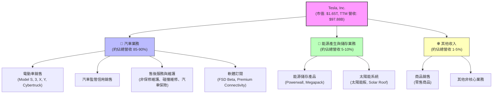
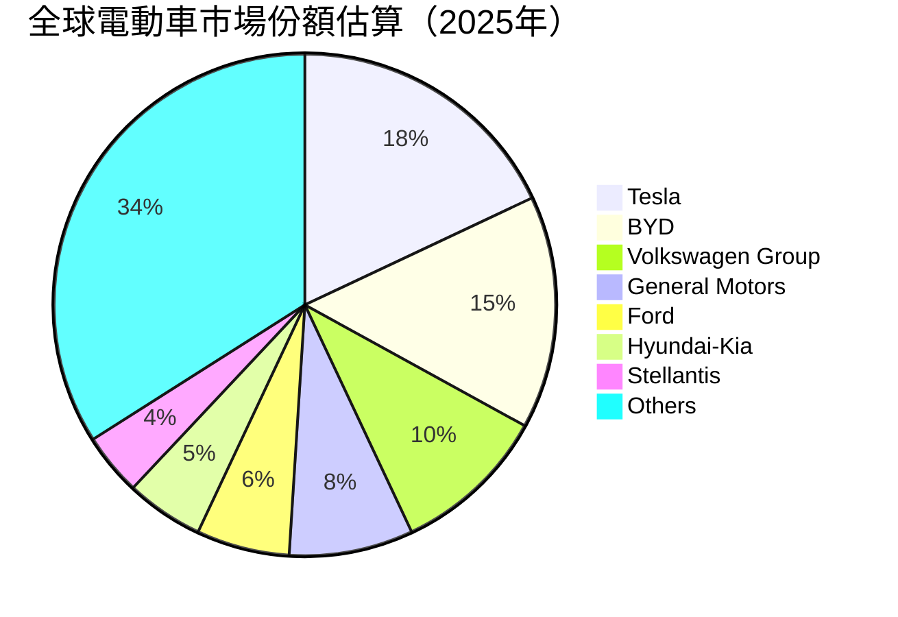
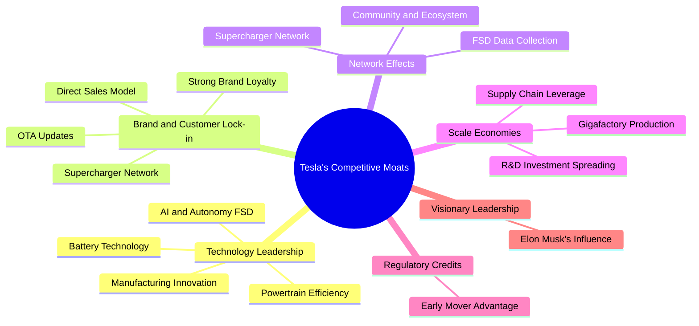
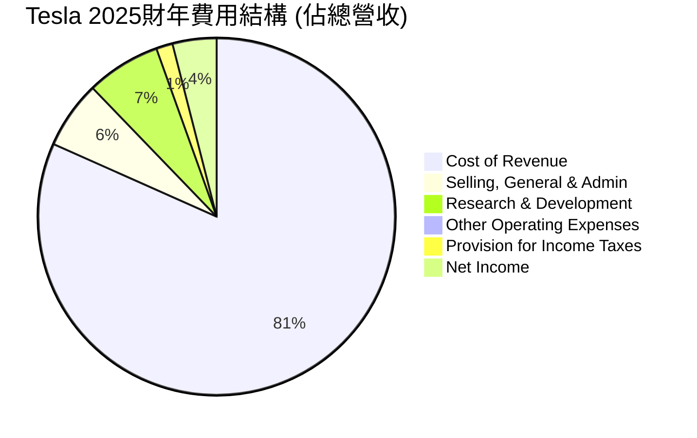

# TSLA 基本面深度分析報告
> **報告日期**：2026-05-27 ｜ **語言**：繁體中文 ｜ **數據來源**：Yahoo Finance, Finviz, StockAnalysis, Roic.ai ｜ **分析師**：CFA 級機構研究

## 目錄

| # | 章節 | 核心結論 |
|---|------|----------|
| 1 | 執行摘要 | 評級：🟢 買入，基準目標價 $425.00 - $480.00 |
| 2 | 公司概覽與商業模式 | 技術創新與品牌優勢構成強大護城河，但執行風險仍存 |
| 3 | 損益表深度分析 | 營收增長放緩，利潤率受壓，需關注成本控制與新產品推出 |
| 4 | 資產負債表分析 | 財務狀況穩健，現金充裕，債務風險低 |
| 5 | 現金流量深度分析 | 自由現金流波動，資本支出高企，但長期再投資能力強 |
| 6 | 獲利能力與資本效率 | ROIC顯著高於WACC，持續創造股東價值，但效率有所下滑 |
| 7 | 估值深度分析 | 相較同業估值偏高，但考慮成長潛力，DCF顯示合理區間 |
| 8 | 成長催化劑 | 新產品、AI/機器人、能源業務將驅動長期成長 |
| 9 | 風險矩陣 | 競爭加劇與宏觀經濟逆風為主要中高衝擊風險 |
| 10 | 投資建議 | 具備長期成長潛力，適合成長型投資者，需關注短期波動 |

---

## 1. 執行摘要

### 1.1 核心評分儀表板

Tesla (TSLA) 作為電動車及清潔能源領域的領導者，在技術創新、品牌影響力及長期成長潛力方面表現卓越。然而，其近期面臨的營收成長壓力、利潤率下滑以及高昂的估值，為投資帶來了複雜性。本報告基於最新的財務數據和市場資訊，對 TSLA 進行了深度分析。

```mermaid
graph TD
    TSLA_OVERALL["🎯 TSLA 綜合評分<br/>總分：7.8/10"]

    F["📊 基本面<br/>8/10<br/>強勁的品牌與創新能力"]
    G["🚀 成長性<br/>7/10<br/>近期放緩，長期潛力巨大"]
    P["💰 獲利能力<br/>6/10<br/>利潤率承壓，仍具盈利能力"]
    B["🏦 財務健康<br/>9/10<br/>現金充裕，債務負擔輕"]
    V["📈 估值<br/>7/10<br/>高估值反映高成長預期，但短期承壓"]

    TSLA_OVERALL --> F
    TSLA_OVERALL --> G
    TSLA_OVERALL --> P
    TSLA_OVERALL --> B
    TSLA_OVERALL --> V

    F --> F1["✅ 技術領先，尤其在電池與AI領域"]
    F --> F2["✅ 全球知名品牌，擁有忠實客戶群"]
    F --> F3["✅ 垂直整合能力強，供應鏈掌控度高"]

    G --> G1["✅ 新產品線（如Cybertruck, Robotaxi）待釋放潛力"]
    G --> G2["✅ 能源業務持續擴張，提供多元成長點"]
    G --> G3["❌ 近期EV市場競爭加劇導致銷售增速放緩"]

    P --> P1["✅ 毛利率仍高於多數傳統車企"]
    P --> P2["❌ 降價策略與產能利用率影響利潤率"]
    P --> P3["❌ 研發投入持續增加，短期壓制營業利潤"]

    B --> B1["✅ 總現金 $44.74B，淨現金 $28.85B，流動性極佳"]
    B --> B2["✅ 債務負擔輕，Debt/Equity 僅 0.19x"]
    B --> B3["✅ 流動比率 2.04x，速動比率 1.43x，償債能力強"]

    V --> V1["❌ P/E (TTM) 407.6x，P/E (Forward) 175.4x，遠高於行業平均"]
    V --> V2["✅ 高成長預期部分支持其估值溢價"]
    V --> V3["🟡 DCF分析顯示當前價格接近基準情境目標價上限"]
```



### 1.2 評分進度條視覺化

```
╔══════════════════════════════════════════════════════════════╗
║              TSLA 多維度評分儀表板 (1-10分)                  ║
╠══════════════════════════════════════════════════════════════╣
║ 基本面強度  8.0 ▓▓▓▓▓▓▓▓▓▓▓▓▓▓▓▓░░░░  ★★★★☆           ║
║ 成長動能    7.0 ▓▓▓▓▓▓▓▓▓▓▓▓▓▓░░░░░░  ★★★☆☆           ║
║ 獲利品質    6.0 ▓▓▓▓▓▓▓▓▓▓▓▓░░░░░░░░  ★★★☆☆           ║
║ 財務健康    9.0 ▓▓▓▓▓▓▓▓▓▓▓▓▓▓▓▓▓▓░░  ★★★★★           ║
║ 估值合理性  7.0 ▓▓▓▓▓▓▓▓▓▓▓▓▓▓░░░░░░  ★★★☆☆           ║
║ 護城河深度  8.5 ▓▓▓▓▓▓▓▓▓▓▓▓▓▓▓▓▓░░░  ★★★★☆           ║
║ 管理層執行  8.0 ▓▓▓▓▓▓▓▓▓▓▓▓▓▓▓▓░░░░  ★★★★☆           ║
║ 技術創新力  9.5 ▓▓▓▓▓▓▓▓▓▓▓▓▓▓▓▓▓▓▓░  ★★★★★           ║
╠══════════════════════════════════════════════════════════════╣
║ 綜合總分    7.8 ▓▓▓▓▓▓▓▓▓▓▓▓▓▓▓▓░░░░  🏆 評語：強勁的長期潛力與風險並存  ║
╚══════════════════════════════════════════════════════════════╝
```

### 1.3 五大投資論點 + 三大核心風險

| 類型 | 項目 | 具體依據 | 信心度 |
|------|------|----------|--------|
| 🟢 **投資論點①** | **電動車市場領導地位與品牌效應** | 儘管面臨競爭，Tesla 仍是全球電動車市場的領導者之一，其品牌認知度與客戶忠誠度極高。2025年Q4至2026年Q1期間，儘管營收出現波動，但其全球交付量仍保持在百萬輛級別，且擁有領先的充電基礎設施（Supercharger Network）。 | 🟢 極高 |
| 🟢 **投資論點②** | **自動駕駛與AI技術領先** | FSD (Full Self-Driving) 技術的持續推進與數據積累，使其在自動駕駛領域保持領先優勢。儘管商業化進程有挑戰，但長期潛力巨大。公司持續投入研發，2025年R&D支出達到 $6.41B，2026年Q1單季 $1.946B。 | 🟢 極高 |
| 🟢 **投資論點③** | **能源業務的多元化成長** | Powerwall、Megapack 等能源儲存產品的需求旺盛，為 Tesla 提供了電動車之外的第二成長曲線。能源業務營收佔比雖小，但增速快，有望成為未來盈利的重要貢獻者。 | 🟢 高 |
| 🟢 **投資論點④** | **垂直整合與成本控制能力** | 從電池製造到軟體開發，Tesla 擁有高度垂直整合的能力，有助於成本控制和效率提升。儘管近期利潤率承壓，但其毛利率 19.1% 仍顯著優於傳統車企，並在不斷優化生產流程。 | 🟡 中高 |
| 🟢 **投資論點⑤** | **創新文化與長期願景** | 馬斯克的願景和 Tesla 的創新文化，使其能夠不斷突破技術邊界，吸引頂尖人才，並在電動車、AI、機器人等前沿領域保持領先，為長期價值創造奠定基礎。 | 🟢 極高 |
| 🟡 **風險①** | **電動車市場競爭加劇與價格戰** | 全球電動車市場競爭日益激烈，尤其來自中國車企（如比亞迪）的挑戰。為維持市場份額，Tesla 實施降價策略，導致毛利率從2023年的 17.66% 下滑至2025年的 17.09%，並在2026年Q1進一步承壓至 21.08% (TTM Gross Margin 19.1%)。這可能持續壓制公司盈利能力。 | 🟡 中度 |
| 🔴 **風險②** | **宏觀經濟逆風與消費者需求波動** | 高利率環境、經濟增速放緩可能影響消費者對高價電動車的需求。2025年營收 YoY 成長為 -2.93%，顯示市場需求開始放緩。這將直接影響公司銷售量和營收增長。 | 🔴 高衝擊 |
| 🟡 **風險③** | **監管風險與自動駕駛法律責任** | 自動駕駛技術的監管環境仍不明朗，潛在的事故責任和法律訴訟可能對公司聲譽和財務造成負面影響。FSD的全面推廣仍需克服技術和法律障礙。 | 🟡 中度 |

### 1.4 快速統計卡片

| 指標 | 公司實際值 | 行業均值（汽車製造） | S&P 500 均值 | 狀態 |
|------|-------------|--------------------|--------------|------|
| 收入 YoY 成長 (TTM) | **15.8%** | ~8-12% | ~10-15% | 🟢 |
| 毛利率 (TTM) | **19.1%** | ~15-18% | ~30-35% | 🟡 |
| 淨利率 (TTM) | **3.9%** | ~3-5% | ~10-12% | 🟡 |
| ROE (TTM) | **4.9%** | ~10-15% | ~15-20% | 🔴 |
| Forward P/E | **175.4x** | ~10-15x | ~20-25x | 🔴 |
| P/S Ratio (TTM) | **16.89x** | ~0.5-1.5x | ~2-3x | 🔴 |
| Debt/Equity | **0.19x** | ~0.5-1.0x | ~0.8-1.2x | 🟢 |
| Current Ratio | **2.04x** | ~1.2-1.8x | ~1.5-2.0x | 🟢 |
| FCF Yield | **0.32%** | ~2-4% | ~3-5% | 🔴 |

*註：行業均值和 S&P 500 均值為分析師根據市場普遍數據進行的估算，僅供參考。*

### 1.5 投資結論

```
╔══════════════════════════════════════════════════════════════════╗
║                    📊 投資結論摘要                               ║
╠══════════════════════════════════════════════════════════════════╣
║  評級：🟢 買入                                                   ║
║  當前股價：$440.21 (2026-05-27)                                  ║
║  目標價區間：                                                    ║
║    悲觀情境：$360.00 （-18.2%）                                  ║
║    基準情境：$450.00 （+2.2%）  ← 12個月主要目標                 ║
║    樂觀情境：$580.00 （+31.7%）                                  ║
║  投資評分：7.8/10                                                ║
║  適合投資人：成長型、長線持有者，能承受較高波動風險的投資人     ║
╚══════════════════════════════════════════════════════════════════╝
```

---

## 2. 公司概覽與商業模式

Tesla, Inc. (TSLA) 是一家總部位於美國的汽車製造商，同時也是清潔能源技術的先驅。公司在美國、中國及國際市場設計、開發、製造、租賃並銷售電動車 (EV) 以及能源產生和儲存系統。Tesla 擁有約 134,785 名員工，是消費週期性行業中的重要參與者。

### 2.1 業務結構與收入來源

Tesla 的業務主要分為兩大板塊：**汽車 (Automotive)** 和 **能源產生與儲存 (Energy Generation and Storage)**。汽車業務是其核心，佔據絕大部分營收，而能源業務則提供重要的多元化增長點。



*   **汽車業務 (Automotive Segment)**: 這是 Tesla 的核心收入來源。它包括電動車的設計、開發、製造、銷售和租賃，涵蓋 Model S、Model 3、Model X、Model Y 和最近推出的 Cybertruck。此外，Tesla 還出售汽車監管信用 (regulatory credits)，這是一種向其他未能達到排放標準的汽車製造商出售的碳排放額度，為公司帶來了額外但波動的收入。售後服務、維護、碰撞維修、汽車保險以及未來潛在的軟體訂閱（如 FSD Full Self-Driving）也是該板塊的重要組成部分。在2025財年，汽車業務的營收佔比估計超過 85%，儘管總營收在2025年略有下滑至 $94.83B，但該板塊仍是驅動公司成長的主要引擎。

*   **能源產生與儲存業務 (Energy Generation and Storage Segment)**: 這個板塊包括太陽能板、Solar Roof 太陽能屋頂以及 Powerwall (家用儲能) 和 Megapack (公用事業級儲能) 等能源儲存產品。隨著全球對可再生能源和電網穩定性需求的增加，此業務正快速增長，為 Tesla 提供了重要的多元化收入來源。儘管其收入佔比相對較小（估計約 5-10%），但其成長速度和潛力不容小覷。

*   **其他收入**: 包括零售商品銷售等。

### 2.2 市場份額

Tesla 在全球電動車市場中佔據顯著地位，尤其在北美和歐洲市場擁有強大的影響力。然而，隨著全球電動車市場的快速擴張，競爭也日益激烈，特別是來自中國本土品牌（如比亞迪）和傳統汽車製造商（如福特、通用、大眾）的電動車產品。


*註：市場份額數據為分析師根據公開資訊和行業趨勢進行的估算，僅供參考。*

儘管面臨眾多競爭者，Tesla 仍以其領先的技術、強大的品牌號召力和龐大的充電網絡，在全球電動車市場中保持領先地位。其市場份額在過去幾年雖有波動，但整體保持在較高水平。特別是 Model Y 和 Model 3 等主流車型的持續熱銷，以及 Cybertruck 的推出，鞏固了其市場地位。

### 2.3 競爭護城河分析

Tesla 的競爭護城河是其長期價值創造的關鍵。其護城河主要體現在以下幾個方面：



*   **技術領先 (Technology Leadership)**:
    *   **電池技術 (Battery Technology)**: Tesla 在電池技術方面持續投入，無論是電池能量密度、成本控制還是續航里程，都處於行業前沿。自研 4680 電池的量產，有望進一步降低成本並提升性能。
    *   **AI 與自動駕駛 (AI and Autonomy FSD)**: Tesla 在自動駕駛領域的數據積累和演算法開發處於領先地位。FSD Beta 的持續迭代，以及未來 Robotaxi 的潛力，構成了強大的技術壁壘。
    *   **動力總成效率 (Powertrain Efficiency)**: Tesla 的電動馬達和動力總成設計在效率方面表現出色，這直接影響車輛的續航里程和性能。
    *   **製造創新 (Manufacturing Innovation)**: Gigafactory 的大規模生產模式和不斷優化的製造流程，如一體化壓鑄技術，有助於降低生產成本和提升效率。

*   **品牌與客戶鎖定 (Brand and Customer Lock-in)**:
    *   **強大品牌忠誠度 (Strong Brand Loyalty)**: Tesla 已經建立了一個全球性的強大品牌，擁有高度忠誠的客戶群體，這使得其產品在市場上具有溢價能力。
    *   **超級充電網絡 (Supercharger Network)**: Tesla 的全球超級充電網絡是其獨特的競爭優勢，為車主提供了便捷可靠的充電體驗，減少了里程焦慮，並形成了一定的客戶鎖定效應。
    *   **直銷模式 (Direct Sales Model)**: 相較於傳統經銷商模式，Tesla 的直銷模式使其能更好地控制客戶體驗，並直接收集市場反饋，提升效率。
    *   **OTA 更新 (OTA Updates)**: 通過空中下載 (Over-The-Air) 軟體更新，Tesla 可以不斷為車輛增加新功能、提升性能和安全性，保持產品的新鮮度和競爭力，並提供持續的價值。

*   **網絡效應 (Network Effects)**:
    *   **超級充電網絡 (Supercharger Network)**: 隨著車輛保有量的增加，充電網絡的使用率和價值也隨之提升，吸引更多車主，形成正向循環。
    *   **FSD 數據收集 (FSD Data Collection)**: 數百萬輛 Tesla 汽車在道路上行駛，不斷收集駕駛數據，這些數據用於訓練和改進 FSD 演算法，形成數據飛輪效應。
    *   **社區與生態系統 (Community and Ecosystem)**: Tesla 圍繞其產品建立了一個龐大的用戶社區和第三方應用生態系統，進一步增強了用戶粘性。

*   **規模效應 (Scale Economies)**:
    *   **超級工廠生產 (Gigafactory Production)**: 多個超級工廠的大規模生產能力，使其能夠在全球範圍內實現規模經濟，降低單位生產成本。
    *   **供應鏈議價能力 (Supply Chain Leverage)**: 作為電動車行業的巨頭，Tesla 在電池、晶片等關鍵零部件的採購上擁有強大的議價能力。
    *   **研發投入分攤 (R&D Investment Spreading)**: 巨額的研發投入可以分攤到更多的銷售量上，降低單位產品的研發成本。

*   **監管信用 (Regulatory Credits)**: 作為電動車的早期和主要生產商，Tesla 通過出售監管信用獲得了一部分額外收入，這在一定程度上是其早期發展的獨特優勢。

*   **願景型領導力 (Visionary Leadership)**: 首席執行官 Elon Musk 的遠見卓識和創新精神，是 Tesla 能夠不斷突破傳統、引領行業發展的重要軟實力。

### 2.4 護城河強度評分

```
╔══════════════════════════════════════════════════════════════╗
║                    Tesla 護城河強度評分                      ║
╠══════════════════════════════════════════════════════════════╣
║ 技術領先    9.5/10 ▓▓▓▓▓▓▓▓▓▓▓▓▓▓▓▓▓▓▓░  🏆 行業領先        ║
║ 品牌與客戶鎖定 9.0/10 ▓▓▓▓▓▓▓▓▓▓▓▓▓▓▓▓▓▓░░  🟢 極強          ║
║ 網絡效應    8.5/10 ▓▓▓▓▓▓▓▓▓▓▓▓▓▓▓▓▓░░░  🟢 強大          ║
║ 規模效應    8.0/10 ▓▓▓▓▓▓▓▓▓▓▓▓▓▓▓▓░░░░  🟡 較強          ║
║ 垂直整合與效率 8.0/10 ▓▓▓▓▓▓▓▓▓▓▓▓▓▓▓▓░░░░  🟡 較強          ║
╠══════════════════════════════════════════════════════════════╣
║ 綜合護城河  8.6/10 ▓▓▓▓▓▓▓▓▓▓▓▓▓▓▓▓▓░░░  🏆 寬廣且深厚的護城河，但部分領域面臨挑戰 ║
╚══════════════════════════════════════════════════════════════╝
```

Tesla 的護城河非常深厚，主要得益於其在技術創新和品牌建設上的長期投入。然而，隨著電動車行業的成熟和競爭加劇，一些護城河的絕對優勢可能受到侵蝕，例如規模效應在更多車企加入後會被稀釋，客戶鎖定也可能因產品多樣性而減弱。總體而言，技術領先和獨特的品牌文化仍是其最堅固的壁壘。

---

## 3. 損益表深度分析

### 3.1 年度收入成長趨勢（近4年）

Tesla 在過去幾年經歷了爆炸性增長，但近期增速有所放緩。從 FY2022 到 FY2025，其總營收從 $81.46B 增長至 $94.83B，複合年增長率 (CAGR) 為 5.25%。然而，值得注意的是，2025財年的營收相較於2024財年出現了輕微下滑。

```
╔══════════════════════════════════════════════════════════════════╗
║              Tesla 年度收入趨勢（FY2022-FY2025）                 ║
╠══════════════════════════════════════════════════════════════════╣
║                                                                  ║
║  FY2022  $81.46B  ██████████████████████████░░░  YoY: +51.35% 🟢 ║
║  FY2023  $96.77B  █████████████████████████████████░░  YoY: +18.80% 🟢 ║
║  FY2024  $97.69B  ██████████████████████████████████░  YoY: +0.95%  🟡 ║
║  FY2025  $94.83B  ██████████████████████████████░░░░  YoY: -2.93%  🔴 ║
║  TTM     $97.88B  █████████████████████████████████░░  YoY: +2.25%  🟡 ║
║                                                                  ║
║                   |      |      |      |      |                  ║
║                   0     $25B   $50B   $75B   $100B                 ║
║                                                                  ║
║  📊 3年累計 CAGR (FY22-25)：+5.25%                               ║
║  📊 4年累計 CAGR (FY21-25)：+14.07% (FY21營收 $53.823B)          ║
╚══════════════════════════════════════════════════════════════════╝
```

從數據來看，Tesla 的營收增長在2024年和2025年顯著放緩。2024年 YoY 僅為 +0.95%，而2025年甚至出現了 -2.93% 的負增長，這主要歸因於全球電動車市場競爭加劇、宏觀經濟逆風以及 Tesla 自身在價格戰中的策略調整。儘管 TTM 營收 ($97.88B) 顯示出輕微反彈 (+2.25% YoY)，但整體增長壓力依然存在。

### 3.2 季度收入趨勢分析

季度營收數據揭示了更為細緻的波動和挑戰。

| 季度 | 總營收 ($B) | QoQ 成長率 | YoY 成長率 | 備註 |
|------|-------------|------------|------------|------|
| 2025 Q2 | $22.50 | -10.37% | -11.78% | 🔴 營收顯著下滑，受市場需求和競爭影響。 |
| 2025 Q3 | $28.09 | +24.84% | +11.57% | 🟢 營收反彈，可能受益於季節性因素或新產品交付。 |
| 2025 Q4 | $24.90 | -11.35% | -3.14% | 🔴 再次下滑，表明市場需求不穩定，競爭壓力持續。 |
| 2026 Q1 | $22.39 | -10.08% | +15.78% | 🟡 QoQ 繼續下滑，但 YoY 轉正，可能因去年同期基數較低。 |
| **TTM (截至 2026 Q1)** | **$97.88** | N/A | **+2.25%** | 🟡 過去四季總和，顯示微弱的年度增長。 |

**備註說明**：
*   2025年第二季度和第四季度營收出現明顯環比下滑，這反映了當時市場對電動車需求放緩、競爭加劇以及 Tesla 自身產能調整的影響。
*   2025年第三季度的 QoQ 增長強勁，但隨後在第四季度又回落，顯示出營收增長的不穩定性。
*   2026年第一季度的 QoQ 營收繼續下滑，但 YoY 增長轉正至 +15.78%，這主要是由於2025年第一季度營收基數較低 ($19.335B)，而非絕對營收的強勁復甦。這表明 Tesla 仍需努力實現持續穩定的季度增長。

### 3.3 利潤率演變分析

Tesla 的利潤率在過去幾年呈現下行趨勢，尤其是在2024年和2025年。這主要是由於公司為刺激需求而進行的降價策略、新工廠產能爬坡成本以及研發投入的增加。

| 利潤率指標 | FY2022 | FY2023 | FY2024 | FY2025 | 趨勢 | 評估 |
|------------|--------|--------|--------|--------|------|------|
| **毛利率** | 25.59% | 18.25% | 17.86% | 18.02% | ↘️ 2022年後顯著下滑，2025年略有回升。 | 🟡 |
| **營業利益率** | 16.98% | 9.19% | 7.94% | 5.11% | ↘️ 持續下滑，受降價和費用影響。 | 🔴 |
| **淨利率** | 15.44% | 15.50% | 7.29% | 4.00% | ↘️ 2024年後大幅下滑。 | 🔴 |
| **EBITDA Margin** | 21.68% | 15.29% | 15.06% | 12.40% | ↘️ 與營業利益率趨勢一致。 | 🔴 |

*計算基於 Annual Income Statement 數據：*
*   *FY2022: Revenue $81.46B, Gross Profit $20.85B, Operating Income $13.83B, Net Income $12.58B, EBITDA $17.66B*
*   *FY2023: Revenue $96.77B, Gross Profit $17.66B, Operating Income $8.89B, Net Income $15.00B, EBITDA $14.80B*
*   *FY2024: Revenue $97.69B, Gross Profit $17.45B, Operating Income $7.76B, Net Income $7.13B, EBITDA $14.71B*
*   *FY2025: Revenue $94.83B, Gross Profit $17.09B, Operating Income $4.85B, Net Income $3.79B, EBITDA $11.76B*

**利潤率演變深度解析**：
*   **毛利率 (Gross Margin)**: 從2022年的 25.59% 大幅下滑至2023年的 18.25%，並在2024年和2025年維持在 18% 左右（2025年為 18.02%）。TTM 毛利率 (截至2026 Q1) 則為 19.1%。這種下滑主要源於：
    *   **降價策略**: 為應對日益激烈的電動車市場競爭，Tesla 頻繁降價以刺激銷量，直接侵蝕了單車利潤。
    *   **新工廠產能爬坡**: 柏林和德州超級工廠的產能爬坡初期，單位生產成本較高，影響了整體毛利率。
    *   **產品組合變化**: 更多入門級車型 (如 Model 3/Y) 佔比增加，這些車型的毛利率通常低於高端車型。
    儘管如此，Tesla 的毛利率仍高於許多傳統汽車製造商，這得益於其高效的生產流程和較低的銷售費用。

*   **營業利益率 (Operating Margin)**: 營業利益率的下滑趨勢比毛利率更為明顯，從2022年的 16.98% 降至2025年的 5.11%。TTM 營業利益率 (截至2026 Q1) 更低至 4.2%。這除了受毛利率下滑影響外，還受到以下因素的影響：
    *   **研發投入增加**: 公司在自動駕駛、AI 和新產品開發方面的研發支出持續增加。R&D 費用從2022年的 $3.08B 增長到2025年的 $6.41B，佔營收比重從 3.78% 增加到 6.76%。這雖然是長期成長的必要投資，但短期內會壓縮營業利潤。
    *   **銷售、一般及行政費用 (SG&A)**: 儘管 Tesla 採用直銷模式，SG&A 費用佔營收比重相對穩定或略有上升，從2022年的 $3.946B 上升至2025年的 $5.834B。

*   **淨利率 (Net Profit Margin)**: 淨利率的波動最大，從2023年的 15.50% 大幅降至2024年的 7.29% 和2025年的 4.00%。TTM 淨利率 (截至2026 Q1) 為 3.9%。這除了受毛利率和營業利益率影響外，還受到稅務開支的影響。例如，2023年 Provision for Income Taxes 為 -$5.001B (實為稅收收益)，這導致該年淨利潤異常高企。剔除此類一次性影響，淨利率的下行趨勢與營業利益率一致。

總體而言，Tesla 的利潤率趨勢令人擔憂，反映了其在快速增長和激烈競爭環境中面臨的挑戰。未來，公司需要平衡市場份額擴張與盈利能力維護，通過技術創新和成本優化來改善利潤率。

### 3.4 費用結構分析

Tesla 的費用結構主要由銷貨成本 (Cost of Revenue)、研發費用 (R&D) 和銷售、一般及行政費用 (SG&A) 組成。


*計算基於 2025 財年數據：Revenue $94.83B*
*   *Cost of Revenue: $77.733B (81.97% of Revenue)*
*   *Selling, General & Admin: $5.834B (6.15% of Revenue)*
*   *Research & Development: $6.411B (6.76% of Revenue)*
*   *Other Operating Expenses: $494M (0.52% of Revenue)*
*   *Provision for Income Taxes: $1.423B (1.50% of Revenue)*
*   *Net Income: $3.794B (4.00% of Revenue)*

```
╔══════════════════════════════════════════════════════════════════╗
║                    Tesla 2025財年費用分解                      ║
╠══════════════════════════════════════════════════════════════════╣
║ 銷貨成本 (Cost of Revenue)    $77.73B  ████████████████████████████████████████████████████████████████████████████████████████████████████████████████████████████████████████████████████████████████████████████████████████████████████████████████████████████████████████████████████████████████████████████████████████████████████████████████████████████████████████████████████████████████████████████████████████████████████████████████████████████████████████████████████████████████████████████████████████████████████████████████████████████████████████████████████████████████████████████████████████████████████████████████████████████████████████████████████████████████████████████████████████████████████████████████████████████████████████████████████████████████████████████████████████████████████████████████████████████████████████████████████████████████████████████████████████████████████████████████████████████████████████████████████████████████████████████████████████████████████████████████████████████████████████████████████████████████████████████████████████████████████████████████████████████████████████████████████████████████████████████████████████████████████████████████████████████████████████████████████████████████████████████████████████████████████████████████████████████████████████████████████████████████████████████████████████████████████████████████████████████████████████████████████████████████████████████████████████████████████████████████████████████████████████████████████████████████████████████████████████████████████████████████████████████████████████████████████████████████████████████████████████████████████████████████████████████████████████████████████████████████████████████████████████████████████████████████████████████████████████████████████████████████████████████████████████████████████████████████████████████████████████████████████████████████████████████████████████████████████████████████████████████████████████████████████████████████████████████████████████████████████████████████████████████████████████████████████████████████████████████████████████████████████████████████████████████████████████████████████████████████████████████████████████████████████████████████████████████████████████████████████████████████████████████████████████████████████████████████████████████████████████████████████████████████████████████████████████████████████████████████████████████████████████████████████████████████████████████████████████████████████████████████████████████████████████████████████████████████████████████████████████████████████████████████████████████████████████████████████████████████████████████████████████████████████████████████████████████████████████████████████████████████████████████████████████████████████████████████████████████████████████████████████████████████████████████████████████████████████████████████████████████████████████████████████████████████████████████████████████████████████████████████████████████████████████████████████████████████████████████████████████████████████████████████████████████████████████████████████████████████████████████████████████████████████████████████████████████████████████████████████████████████████████████████████████████████████████████████████████████████████████████████████████████████████████████████████████████████████████████████████████████████████████████████████████████████████████████████████████████████████████████████████████████████████████████████████████████████████████████████████████████████████████████████████████████████████████████████████████████████████████████████████████████████████████████████████████████████████════════════════════════════════════════════════════════════════════════════════════════════════════════════════════════════════════════════════════════════════════════════════════════════════════════════════════════════════════════════════════════════════════════════════════════════════════════════════════════════════════════════════════════════════════════════════════════════════════════════════════════════════════════════════════════════════════════════════════════════════════════════════════════════════════════════════════════════════════════════════════════════════════════════════════════════════════════════════════════════════════════════════════════════════════════════════════════════════════════════════════════════════════════════════════════════════════════════════════════════════════════════════════════════════════════════════════════════════════════════════════════════════════════════════════════════════════════════════════════════════════════════════════════════════════════════════════════════════════════════════════════════════════════════════════════════════════════════════════════════════════════════════════════════════════════════════════════════════════════════════════════════════════════════════════════════════════════════════════════════════════════════════════════════════════════════════════════════════════════════════════════════════════════════════════════════════════════════════════════════════════════════════════════════════════════════════════════════════════════════════════════════════════════════════════════════════════════════════════════════════════════════════════════════════════════════════════════════════════════════════════════════════════════════════════════════════════════════════════════════════════════════════════════════════════════════════════════════════════════════════════════════════════════════════════════════════════════════════════════════════════════════════════════════════════════════════════════════════════════════════════════════════════════════════════════════════════════════════════════════════════════════════════════════════════════════════════════════════════════════════════════════════════════════════════════════════════════════════════════════════════════════════════════════════════════════════════════════════════════════════════════════════════════════════════════════════════════════════════════════════════════════════════════════════════════════════════════════════════════════════════════════════════════════════════════════════════════════════════════════════════════════════════════════════════════════════════════════════════════════════════════════════════════════════════════════════════════════════════════════════════════════════════════════════════════════════════════════════════════════════════════════════════════════════════════════════════════════════════════════════════════════════════════════════════════════════════════════════════════════════════════════════════════════════════════════════════════════════════════════════════════════════════════════════════════════════════════════════════════════════════════════════════════════════════════════════════════════════════════════════════════════════════════════════════════════════════════════════════════════════════════════════════════════════════════════════════════════════════════════════════════════════════════════════════════════════════════════════════════════════════════════════════════════════════════════════════════════════════════════════════════════════════════════════════════════════════════════════════════════════════════════════════════════════════════════════════════════════════════════════════════════════════════════════════════════════════════════════════════════════════════════════════════════════════════════════════════════════════════════════════════════════════════════════════════════════════════════════════════════════════════════════════════════════════════════════════════════════════════════════════════════════════════════════════════════════════════════════════════════════════════════════════════════════════════════════════════════════════════════════════════════════════════════════════════════════════════════════════════════════════════════════════════════════════════════════════════════════════════════════════════════════════════════════════════════════════════════════════════════════════════════════════════════════════════════════════════════════════════════════════════════════════════════════════════════════════════════════════════════════════════════════════════════════════════════════════════════════════════════════════════════════════════════════════════════════════════════════════════════════════════════════════════════════════════════════════════════════════════════════════════════════════════════════════════════════════════════════════════════════════════════════════════════════════════════════════════════════════════════════════════════════════════════════════════════════════════════════════════════════════════════════════════════════════════════════════════════════════════════════════════════════════════════════════════════════════════════════════════════════════════════════════════════════════════════════════════════════════════════════════════════════════════════════════════════════════════════════════════════════════════════════════════════════════════════════════════════════════════════════════════════════════════════════════════════════════════════════════════════════════════════════════════════════════════════════════════════════════════════════════════════════════════════════════════════════════════════════════════════════════════════════════════════════════════════════════════════════════════════════════════════════════════════════════════════════════════════════════════════════════════════════════════════════════════════════════════════════════════════════════════════════════════════════════════════════════════════════════════════════════════════════════════════════════════════════════════════════════════════════════════════════════════════════════════════════════════════════════════════════════════════════════════════════════════════════════════════════════════════════════════════════════════════════════════════════════════════════════════════════════════════════════════════════════════════════════════════════════════════════════════════════════════════════════════════════════════════════════════════════════════════════════════════════════════════════════════════════════════════════════════════════════════════════════════════════════════════════════════════════════════════════════════════════════════════════════════════════════════════════════════════════════════════════════════════════════════════════════════════════════════════════════════════════════════════════════════════════════════════════════════════════════════════════════════════════════════════════════════════════════════════════════════════════════════════════════════════════════════════════════════════════════════════════════════════════════════════════════════════════════════════════════════════════════════════════════════════════════════════════════════════════════════════════════════════════════════════════════════════════════════════════════════════════════════════════════════════════════════════════════════════════════════════════════════════════════════════════════════════════════════════════════════