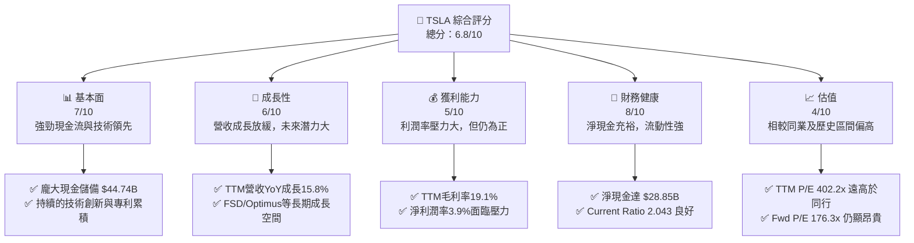
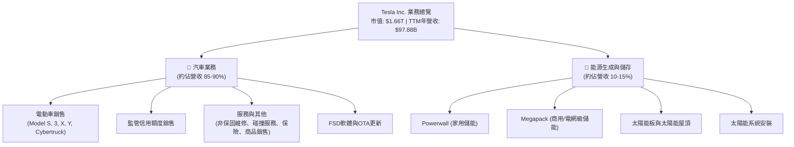
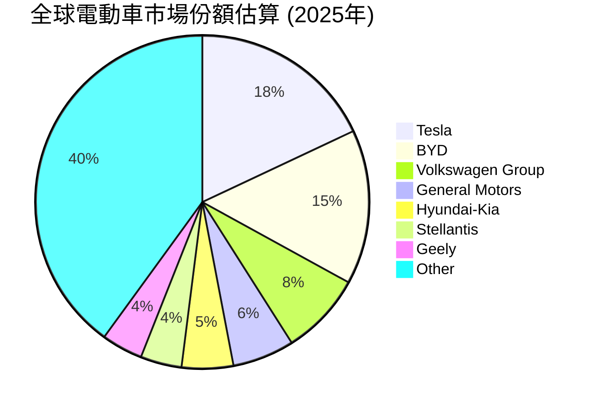
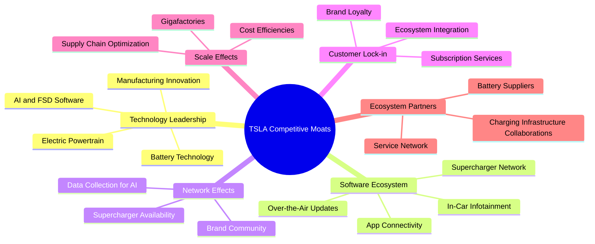
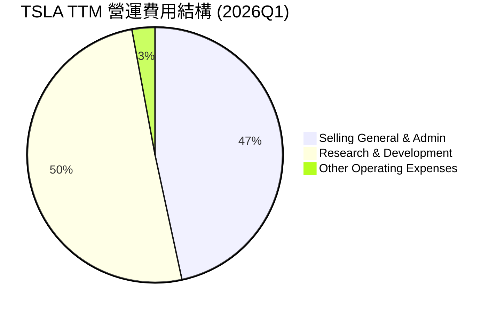
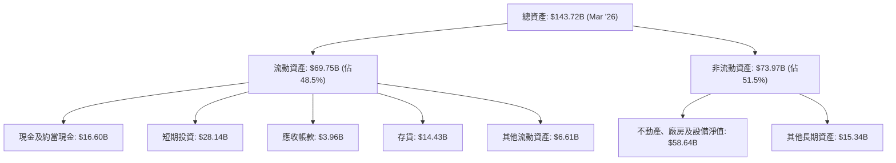

# TSLA 基本面深度分析報告
> **報告日期**：2026-05-28 ｜ **語言**：繁體中文 ｜ **數據來源**：Yahoo Finance, Finviz, StockAnalysis, Roic.ai ｜ **分析師**：CFA 級機構研究

---

## 目錄

| # | 章節 | 核心結論 |
|---|------------------------|--------------------------------------------------|
| 1 | 執行摘要 | 評級：持有；目標價區間：$370 - $550 |
| 2 | 公司概覽與商業模式 | 技術創新與生態系統建立強大護城河，但競爭加劇 |
| 3 | 損益表深度分析 | 營收成長放緩，利潤率受價格戰衝擊，但研發投入持續 |
| 4 | 資產負債表分析 | 財務狀況穩健，現金充裕，債務風險低 |
| 5 | 現金流量深度分析 | 營業現金流穩定，自由現金流波動，資本支出高企 |
| 6 | 獲利能力與資本效率 | ROIC顯著高於WACC，創造股東價值，但效率有下降趨勢 |
| 7 | 估值深度分析 | 相較同業估值偏高，DCF顯示當前股價接近基準情境 |
| 8 | 成長催化劑 | FSD、Optimus、新車型、能源業務拓展為長期成長引擎 |
| 9 | 風險矩陣 | 競爭加劇、宏觀經濟、供應鏈、監管、執行風險 |
| 10 | 投資建議 | 持有評級，適合長期看好技術創新與顛覆性商業模式的投資者 |

---

## 1. 執行摘要

### 1.1 核心評分儀表板



### 1.2 評分進度條視覺化

```
╔══════════════════════════════════════════════════════════════╗
║                TSLA 多維度評分儀表板 (1-10分)                  ║
╠══════════════════════════════════════════════════════════════╣
║ 基本面強度  7.0 ▓▓▓▓▓▓▓▓▓▓▓▓▓▓░░░░░░  ★★★★☆           ║
║ 成長動能    6.0 ▓▓▓▓▓▓▓▓▓▓▓▓░░░░░░░░  ★★★☆☆           ║
║ 獲利品質    5.0 ▓▓▓▓▓▓▓▓▓▓░░░░░░░░░░  ★★★☆☆           ║
║ 財務健康    8.0 ▓▓▓▓▓▓▓▓▓▓▓▓▓▓▓▓░░░░  ★★★★☆           ║
║ 估值合理性  4.0 ▓▓▓▓▓▓▓▓░░░░░░░░░░░░  ★★☆☆☆           ║
║ 護城河深度  7.5 ▓▓▓▓▓▓▓▓▓▓▓▓▓▓▓▓░░░░  ★★★★☆           ║
║ 管理層執行  7.0 ▓▓▓▓▓▓▓▓▓▓▓▓▓▓░░░░░░  ★★★★☆           ║
║ 技術創新力  9.0 ▓▓▓▓▓▓▓▓▓▓▓▓▓▓▓▓▓▓░░  ★★★★★           ║
╠══════════════════════════════════════════════════════════════╣
║ 綜合總分    6.8 ▓▓▓▓▓▓▓▓▓▓▓▓▓▓░░░░░░  🏆 評語：具備長期潛力，但短期估值壓力顯著              ║
╚══════════════════════════════════════════════════════════════╝
```

### 1.3 五大投資論點 + 三大核心風險

| 類型 | 項目 | 具體依據 | 信心度 |
|------|------|----------|--------|
| 🟢 **投資論點①** | **顛覆性技術領先與創新能力** | Tesla在電池技術、電動動力系統、自動駕駛（FSD）軟體和AI機器人（Optimus）領域持續保持領先地位。其AI驅動的FSD系統儘管推廣受阻，但長期潛力巨大，且Optimus機器人業務可能開啟新的成長曲線。研發支出逐年攀升，FY2025達$6.41B，TTM更高達$6.948B，顯示公司對未來技術投入的堅定決心。 | 🟢 極高 |
| 🟢 **投資論點②** | **強大的品牌影響力與全球生態系統** | Tesla品牌在全球電動車市場擁有無與倫比的認知度和追隨者。其超級充電網路、軟體更新、服務中心等構成的生態系統，為用戶提供了優越的體驗，形成客戶黏性。全球化生產佈局（如上海、柏林、德州超級工廠）使其能有效服務各地市場，並具備規模經濟優勢。 | 🟢 高 |
| 🟢 **投資論點③** | **能源業務的巨大未開發潛力** | Tesla不僅是電動車公司，其能源生成與儲存業務（Powerwall, Megapack, Solar Roof）在電網穩定性、可再生能源整合方面扮演關鍵角色。儘管目前收入佔比較小，但全球向清潔能源轉型的趨勢為此業務提供了廣闊的TAM。TTM營收中，能源業務雖然未單獨列出，但其成長速度快於汽車業務，未來有望成為第二大支柱。 | 🟢 高 |
| 🟢 **投資論點④** | **穩健的財務狀況與充裕的現金流** | 截至2026年3月31日，Tesla擁有現金及短期投資$44.74B，總債務為$15.89B，淨現金高達$28.85B。這為其高額資本支出、研發投入以及應對市場波動提供了堅實的後盾。TTM營業現金流$16.53B，顯示核心業務造血能力強勁。 | 🟢 極高 |
| 🟢 **投資論點⑤** | **高成長潛力與長期願景** | 儘管近期營收成長放緩，但Tesla的長期目標是實現數千萬輛的年產量，並將自動駕駛和AI機器人技術推向商業化。其目標是透過技術創新和成本效率，將電動車普及化，並在AI和能源領域開闢新天地。EPS Forward $2.50969，顯示市場預期未來仍有顯著盈餘成長。 | 🟡 中高 |
| 🟡 **風險①** | **全球電動車市場競爭加劇與價格戰** | 隨著傳統車企和新興電動車品牌（尤其來自中國的BYD等）的崛起，全球電動車市場競爭日益激烈。Tesla為維持市場份額不斷降價，導致毛利率從FY2022的25.59%下降至FY2025的18.02% (StockAnalysis數據)，TTM為19.1%。這對其盈利能力構成持續壓力，並可能影響未來的利潤率水平。 | 🟡 中度 |
| 🔴 **風險②** | **宏觀經濟逆風與消費者需求波動** | 高利率環境、通脹壓力以及全球經濟成長放緩，可能抑制高價電動車的消費者需求。此外，地緣政治緊張、供應鏈中斷等因素，也可能影響Tesla的生產和銷售。Q1 2026營收YoY成長15.78%，但較Q4 2025 QoQ下降10.09%，顯示需求波動性。 | 🔴 高衝擊 |
| 🟡 **風險③** | **監管風險與自動駕駛技術的挑戰** | 自動駕駛技術的安全性、倫理和法律責任在全球範圍內面臨嚴格的監管審查。FSD的全面推廣可能受到各國政策、事故責任判定以及消費者接受度的限制，這可能延緩其技術變現的進程。此外，各國貿易政策和環保法規的變化也可能對其營運造成影響。 | 🟡 中度 |

### 1.4 快速統計卡片

| 指標 | 公司實際值 (TTM) | 行業均值 (汽車製造) | S&P 500 均值 | 狀態 |
|-----------------|--------------------|---------------------|----------------|------|
| 收入 YoY 成長 | **15.8%** | ~10-15% | ~8-10% | 🟢 |
| 毛利率 | **19.1%** | ~15-20% | ~30% | 🟡 |
| 淨利率 | **3.9%** | ~5-8% | ~10% | 🔴 |
| ROE | **4.9%** | ~10-15% | ~15% | 🔴 |
| Forward P/E | **176.3x** | ~10-15x | ~20-25x | 🔴 |
| P/S Ratio | **17.0x** | ~0.5-1.5x | ~2-3x | 🔴 |
| 債務/股權 | **0.19x** | ~0.5-1.0x | ~0.8-1.2x | 🟢 |
| 淨現金/債務 | **$28.85B** | N/A (多數為淨債務) | N/A | 🟢 |
| Beta | **1.793** | ~1.0-1.5 | 1.0 | 🔴 |

*註：行業均值和S&P 500均值為一般估計值，非精確實時數據，旨在提供參考對比。*

### 1.5 投資結論

```
╔══════════════════════════════════════════════════════════════════╗
║                    📊 投資結論摘要                               ║
╠══════════════════════════════════════════════════════════════════╣
║  評級：🟡 持有                                                   ║
║  當前股價：$442.50                                               ║
║  目標價區間：                                                    ║
║    悲觀情境：$370（-16.4%）                                      ║
║    基準情境：$460（+3.9%）  ← 12個月主要目標                      ║
║    樂觀情境：$550（+24.3%）                                      ║
║  投資評分：6.8/10                                                ║
║  適合投資人：成長型、長線持有者，對公司技術前景有高度信心，能承受高估值和市場波動的投資者。不適合追求短期穩定回報或價值型投資者。 ║
╚══════════════════════════════════════════════════════════════════╝
```

---

## 2. 公司概覽與商業模式

Tesla, Inc. (TSLA) 作為全球領先的電動車 (EV) 和清潔能源公司，其業務模式不僅限於汽車製造，更延伸至能源生成與儲存、人工智慧和自動駕駛技術。公司於美國、中國及國際市場設計、開發、製造、租賃並銷售電動車，同時提供能源生成與儲存系統。

### 2.1 業務結構與收入來源

Tesla的業務主要分為兩大核心板塊：汽車 (Automotive) 和能源生成與儲存 (Energy Generation and Storage)。



**深度分析：**

*   **汽車業務 (Automotive Segment)**：這是Tesla的核心收入來源，佔總營收的絕大部分。
    *   **電動車銷售**：包括Model S、Model 3、Model X、Model Y、以及新推出的Cybertruck。Tesla的直銷模式、線上訂購、和不斷擴張的全球服務網絡是其獨特優勢。然而，近期由於全球電動車市場競爭加劇，公司採取了激進的價格策略，這對其汽車業務毛利率造成了顯著壓力。
    *   **監管信用額度銷售 (Regulatory Credits)**：Tesla透過銷售其未使用的環保積分給其他傳統汽車製造商，獲得額外收入。這部分收入的波動性較大，且隨著其他車企轉型電動化，長期來看可能減少。在Q1 2026，這一部分收入對淨利的貢獻可能仍不可忽視。
    *   **服務與其他**：包括非保固維修、碰撞服務、汽車保險服務、零配件銷售和零售商品銷售。隨著車輛保有量的增加，這部分的經常性收入預計將穩步成長，提供更穩定的利潤來源。
    *   **FSD軟體與OTA更新**：全自動駕駛 (FSD) 軟體是Tesla的長期成長動能之一。儘管面臨監管和技術挑戰，但其潛在的訂閱模式和軟體服務收入，有望大幅提升公司估值和盈利能力。
*   **能源生成與儲存 (Energy Generation and Storage Segment)**：儘管目前佔比相對較小，但此業務板塊成長迅速，被視為Tesla的第二大成長支柱。它包括Powerwall (家用儲能)、Megapack (公用事業規模儲能) 和太陽能產品 (Solar Roof, 太陽能板)。全球對可再生能源和儲能解決方案的需求不斷增長，為Tesla的能源業務提供了巨大的市場空間。Megapack的需求尤其強勁，產能擴張將是關鍵。

**營收分佈的挑戰與機遇：**
汽車業務的營收成長面臨價格戰和市場飽和的挑戰，導致整體營收成長速度從FY2022的51.35% (YoY) 降至FY225的-2.93% (YoY)。TTM營收YoY成長15.8% (來自Market Data)，顯示近期有所回升，但仍遠低於歷史高點。公司正積極開拓FSD軟體服務和能源儲存解決方案，以期實現收入來源多元化和利潤率提升。

### 2.2 市場份額

Tesla在全球電動車市場中長期佔據領先地位，但在近年來，隨著全球各國政府推動電動車普及，以及中國等市場的本土品牌迅速崛起，Tesla的市場份額面臨越來越大的壓力。

以下為全球電動車市場份額的估算（截至2025年數據推估，僅供參考）：



**深度分析：**
Tesla在北美和歐洲等成熟市場仍保持強勁競爭力，但在中國市場，其面臨來自比亞迪 (BYD) 和其他國產品牌的激烈競爭。比亞迪憑藉其多元化的產品線和成本優勢，在全球銷量上已超越Tesla，尤其是在插電式混合動力車型方面。
Tesla雖然在純電動車領域仍是領頭羊之一，但其市場份額已不再像早期那樣一家獨大。隨著更多傳統車企推出具競爭力的電動車型，以及新興電動車品牌的崛起，Tesla需要持續創新並提升效率，才能維持其市場地位。例如，Model 3和Model Y的銷量仍是主力，但市場期待更低價的車型以擴大市場滲透率。Cybertruck的推出也為其在北美市場開闢了新的細分領域。

### 2.3 競爭護城河分析

Tesla的競爭護城河是多維度的，主要來自其在技術、品牌、生態系統和規模方面的綜合優勢。



**深度分析：**

*   **技術領先 (Technology Leadership)**：
    *   **電池技術**：Tesla在電池能量密度、成本控制和電池管理系統 (BMS) 方面擁有核心技術優勢。自主研發的4680電池技術旨在進一步降低成本並提高續航里程。
    *   **電動動力系統**：高效的電動馬達和逆變器設計，提供了卓越的性能和續航能力。
    *   **AI和FSD軟體**：這是Tesla未來最核心的價值驅動。其基於視覺的自動駕駛方案，通過海量數據訓練，具備潛在的顛覆性。儘管目前仍處於L2/L3級別，但長期看好其L4/L5的發展。AI機器人Optimus也體現了其在AI和機器人領域的野心。
    *   **製造創新 (Gigafactories)**：透過垂直整合和大規模生產，Tesla的Gigafactories旨在實現前所未有的生產效率和成本效益。
*   **軟體生態系統 (Software Ecosystem)**：
    *   **OTA更新**：如同智慧手機般，Tesla車輛可以透過空中下載 (OTA) 進行功能升級和性能改進，延長產品生命週期並提升用戶體驗。
    *   **車載資訊娛樂系統與App連接**：直觀的車載系統和手機應用程式提供了豐富的功能和無縫的互聯體驗。
    *   **超級充電網路 (Supercharger Network)**：Tesla在全球佈建了龐大且可靠的超級充電網路，為車主提供了便利的充電體驗，是其早期成功的關鍵因素之一，也為其帶來了護城河。
*   **網路效應 (Network Effects)**：
    *   **超級充電網路**：隨著更多Tesla車輛上路，對超級充電站的需求增加，促使Tesla擴大網路，進一步吸引更多車主，形成正向循環。
    *   **品牌社群與數據收集**：龐大的用戶群體形成了強大的品牌社群，同時為FSD系統提供了寶貴的駕駛數據，加速AI模型的訓練和改進。
*   **客戶鎖定 (Customer Lock-in)**：
    *   **品牌忠誠度**：Tesla的創新形象和獨特體驗培養了一批高度忠誠的客戶。
    *   **生態系統整合**：車輛、充電、軟體服務的無縫整合，使得客戶難以轉換到其他品牌。
    *   **訂閱服務**：FSD等軟體服務的訂閱模式一旦成熟，將進一步鎖定客戶並提供穩定的經常性收入。
*   **規模效應 (Scale Effects)**：
    *   **超級工廠**：大規模生產和垂直整合策略，使得Tesla能夠在電池、動力系統和整車製造方面實現成本優勢。
    *   **供應鏈優化**：透過與供應商的緊密合作和規模採購，降低了生產成本。
*   **生態夥伴 (Ecosystem Partners)**：
    *   **電池供應商**：與Panasonic、LG Energy Solution、CATL等電池巨頭合作，確保電池供應。
    *   **充電基礎設施合作**：近年來將其充電標準開放給其他車企，有望將其超級充電網路轉變為行業標準，進一步擴大其影響力。

總體而言，Tesla的護城河是其技術創新能力和生態系統整合的結果。然而，隨著競爭對手在技術和產能上的追趕，以及全球充電標準的趨同，Tesla需要不斷進化以維持其護城河的深度和廣度。

### 2.4 護城河強度評分

```
╔══════════════════════════════════════════════════════════════╗
║                    TSLA 護城河強度評分                        ║
╠══════════════════════════════════════════════════════════════╣
║ 技術領先    8.5/10 ▓▓▓▓▓▓▓▓▓▓▓▓▓▓▓▓▓░░░  🏆 在AI/電池技術獨步     ║
║ 軟體生態系統  8.0/10 ▓▓▓▓▓▓▓▓▓▓▓▓▓▓▓▓░░░░  🟢 OTA與FSD潛力大      ║
║ 網路效應    7.0/10 ▓▓▓▓▓▓▓▓▓▓▓▓▓▓░░░░░░  🟡 超充網絡優勢仍在      ║
║ 客戶鎖定    7.5/10 ▓▓▓▓▓▓▓▓▓▓▓▓▓▓▓▓░░░░  🟢 品牌忠誠度高，生態系統黏性強 ║
║ 規模效應    7.0/10 ▓▓▓▓▓▓▓▓▓▓▓▓▓▓░░░░░░  🟢 巨型工廠與垂直整合    ║
║ 生態夥伴    6.0/10 ▓▓▓▓▓▓▓▓▓▓▓▓░░░░░░░░  🟡 充電標準開放帶來機遇與挑戰 ║
╠══════════════════════════════════════════════════════════════╣
║ 綜合護城河  7.5/10 ▓▓▓▓▓▓▓▓▓▓▓▓▓▓▓▓░░░░  🏆 強勁，但需警惕競爭者追趕 ║
╚══════════════════════════════════════════════════════════════╝
```

---

## 3. 損益表深度分析

### 3.1 年度收入成長趨勢（近4年）

Tesla的年度收入在過去幾年呈現快速增長，但在最近一個財年（FY2025）出現了放緩甚至小幅下滑的趨勢，這主要反映了全球電動車市場競爭的加劇和宏觀經濟逆風。

```
╔══════════════════════════════════════════════════════════════════╗
║              TSLA 年度收入趨勢（FY2022-FY2025）                  ║
╠══════════════════════════════════════════════════════════════════╣
║                                                                  ║
║  FY2022  $81.46B  ████████████████████████████░░░░░  YoY: +51.35% 🟢    ║
║  FY2023  $96.77B  ██████████████████████████████████░  YoY:+18.80% 🟢    ║
║  FY2024  $97.69B  ███████████████████████████████████  YoY:+0.95%  🟡    ║
║  FY2025  $94.83B  ██████████████████████████████████░  YoY:-2.93%  🔴    ║
║                                                                  ║
║                   |      |      |      |      |                  ║
║                   0     25B    50B    75B   100B                   ║
║                                                                  ║
║  📊 4年累計 CAGR：+13.1% (FY2021 $53.823B -> FY2025 $94.83B)         ║
╚══════════════════════════════════════════════════════════════════╝
```

**深度解析：**
從數據來看，Tesla的營收成長在FY2022達到51.35%的峰值後，於FY2023放緩至18.80%，並在FY2024幾乎停滯，僅成長0.95%。更令人擔憂的是，FY2025出現了2.93%的負成長，總營收從$97.69B降至$94.83B。這一下滑主要歸因於電動車市場競爭加劇導致的價格下調，以及部分地區消費者需求放緩。儘管TTM營收YoY成長15.8%（$97.88B），這反映了最近一個季度（Q1 2026）的表現有所改善，但整體年度趨勢顯示公司正經歷一個成長的瓶頸期。

### 3.2 季度收入趨勢分析

季度的營收表現更能反映公司近期經營狀況和市場變化。

| 季度 | 總營收 ($B) | QoQ 成長率 | YoY 成長率 | 備註 | 評估 |
|------|-------------|------------|------------|----------|------|
| Q1 2026 | $22.39 | -10.09% | +15.78% | 較上一季大幅下滑，但同比有所增長。 | 🟡 |
| Q4 2025 | $24.90 | -11.36% | -3.14% | 較上一季和去年同期均有下降。 | 🔴 |
| Q3 2025 | $28.09 | +24.87% | +11.57% | 實現了強勁的環比和同比增長，表現亮眼。 | 🟢 |
| Q2 2025 | $22.50 | +16.35% | -11.78% | 環比增長，但同比下降，顯示市場波動。 | 🟡 |

**深度解析：**
從季度數據來看，Tesla的營收表現波動較大。Q3 2025表現強勁，營收達到$28.09B，YoY成長11.57%，QoQ成長24.87%，這可能得益於某些車型的大量交付或季節性因素。然而，隨後的Q4 2025和Q1 2026連續兩個季度出現環比下滑，Q4 2025甚至同比下滑3.14%，Q1 2026環比下滑10.09%，儘管同比增長15.78% (得益於去年同期基數較低)。這表明公司在面對激烈的市場競爭和宏觀經濟不確定性時，其營收增長面臨顯著挑戰。價格戰的持續以及新產品Cybertruck的產能爬坡速度，都將是影響未來季度營收的關鍵因素。

### 3.3 利潤率演變分析

利潤率是衡量公司盈利能力和效率的重要指標。Tesla的利潤率在過去幾年呈現明顯的下降趨勢，特別是毛利率和營業利益率，這與其激進的價格策略和不斷增加的營運費用密切相關。

| 利潤率指標 | FY2022 | FY2023 | FY2024 | FY2025 | TTM (2026Q1) | 趨勢 | 評估 |
|------------|--------|--------|--------|--------|--------------|------|------|
| **毛利率** | 25.59% | 18.25% | 17.86% | 18.02% | 19.10% | ↘️ 後趨穩，略有回升 | 🟡 |
| **營業利益率** | 16.90% | 9.19% | 7.24% | 5.14% | 4.20% | ↘️ 持續下滑 | 🔴 |
| **淨利率** | 15.44% | 15.50% | 7.26% | 3.99% | 3.90% | ↘️ 持續下滑 | 🔴 |
| **EBITDA Margin** | 21.68% | 15.29% | 15.06% | 12.40% | 11.30% | ↘️ 持續下滑 | 🔴 |

*註：年度利潤率數據基於StockAnalysis的年報數據計算，TTM數據來自Market Data。*

**利潤率演變深度解析**：

*   **毛利率 (Gross Margin)**：從FY2022的25.59%大幅下降至FY2023的18.25%，主要是由於公司為刺激需求和應對競爭而實施的多次降價策略。FY2024略微下降至17.86%，FY2025略有回升至18.02%。TTM毛利率為19.1%，顯示近期成本控制可能有所改善，但仍遠低於歷史高點。這表明Tesla的定價能力受到挑戰，生產成本（如電池原材料、製造成本）的壓力依然存在。
*   **營業利益率 (Operating Margin)**：營業利益率的下降趨勢更為明顯，從FY2022的16.90%一路下滑至FY2025的5.14%，TTM更是降至4.2%。這不僅受到毛利率下降的影響，也反映了營運費用（包括研發和銷售、一般及行政費用）的相對增長。公司在新的生產線、產品開發（如Cybertruck、Optimus、FSD）和市場擴張上投入巨大，這些費用在營收成長放緩的背景下，對營業利益率造成了更大壓力。
*   **淨利率 (Net Profit Margin)**：淨利率的走勢與營業利益率相似，從FY2022的15.44%大幅下降至FY2025的3.99%，TTM為3.9%。這除了上述因素外，還受到稅率波動和非經營性損益的影響。FY2023淨利率高達15.50%主要是由於當年稅務調整產生了$5.001B的稅收收益 (Provision for Income Taxes為負值)，這是一個非經常性項目，剔除此影響，其核心盈利能力在FY2023也已開始下滑。
*   **EBITDA Margin**：同樣呈現下降趨勢，從FY2022的21.68%降至TTM的11.3%。EBITDA剔除了折舊攤銷和利息稅務的影響，更能反映核心業務的現金盈利能力。其下降表明公司的核心營運效率和盈利能力正在受到挑戰。

**原因分析：**
1.  **價格戰與產品組合**：為爭奪市場份額，Tesla在全球範圍內進行了多輪降價，直接壓縮了單車利潤。此外，Model 3/Y等主流車型佔比高，而高利潤的Model S/X銷量增長乏力，也影響了整體利潤率。
2.  **新產品與新產能投入**：Cybertruck的量產爬坡、新的Gigafactories建設（如墨西哥新廠規劃）、以及FSD和Optimus等高科技研發投入，導致研發費用和資本支出居高不下，這些前期投入在尚未產生規模效益時，會稀釋短期利潤。
3.  **原材料成本波動**：儘管電池原材料成本近期有所下降，但在過去幾年，成本波動對利潤率造成了一定壓力。
4.  **監管信用額度收入減少**：隨著其他車企逐步轉向電動化，對Tesla監管信用額度的需求減少，導致這部分高利潤收入的貢獻下降。

總體而言，Tesla的利潤率趨勢令人擔憂，表明公司正處於一個轉型期，從高速成長階段轉向更注重效率和成本控制的階段。未來利潤率能否企穩回升，將取決於其在新產品（如Robotaxi、廉價車型）的推出、FSD軟體的商業化進程以及能源業務的快速擴張。

### 3.4 費用結構分析

Tesla的費用結構反映了其作為一家高科技製造公司的特性，研發投入佔比高，同時銷售、管理費用也隨業務擴張而增長。

**營運費用結構 (TTM 截至 2026年3月31日):**



**費用開支進度條視覺化 (TTM):**

```
╔══════════════════════════════════════════════════════════════════╗
║                   TSLA TTM 費用開支概覽 ($B)                     ║
╠══════════════════════════════════════════════════════════════════╣
║                                                                  ║
║  總營收：            $97.88B  █████████████████████████████████████  ║
║  銷貨成本 (CoGS)：   $79.22B  ████████████████████████████████░░░  (佔營收 80.9%) ║
║  毛利：              $18.66B  ██████████████████░░░░░░░░░░░░░░░░░░░  (佔營收 19.1%) ║
║                                                                  ║
║  銷售、一般及行政 (SG&A)：$6.42B  ███████░░░░░░░░░░░░░░░░░░░░░░░░░░░  (佔營收 6.5%) ║
║  研發 (R&D)：         $6.95B  ████████░░░░░░░░░░░░░░░░░░░░░░░░░░░  (佔營收 7.1%) ║
║  其他營運費用：       $0.40B  █░░░░░░░░░░░░░░░░░░░░░░░░░░░░░░░░░  (佔營收 0.4%) ║
║  總營運費用：        $13.77B  ██████████████░░░░░░░░░░░░░░░░░░░░░  (佔營收 14.1%) ║
║                                                                  ║
║  營業利益：           $4.90B  █████░░░░░░░░░░░░░░░░░░░░░░░░░░░░░░  (佔營收 5.0%) ║
╚══════════════════════════════════════════════════════════════════╝
```

**深度解析：**

*   **銷貨成本 (Cost of Goods Sold, CoGS)**：TTM CoGS為$79.22B，佔總營收的80.9%，導致毛利率為19.1%。CoGS的高佔比是利潤率壓力的主要來源。這部分成本主要包括原材料、製造費用、勞動力成本以及折舊攤銷。
*   **銷售、一般及行政費用 (SG&A)**：TTM為$6.42B，佔營收的6.5%。雖然Tesla主要依靠直銷模式，但其全球擴張、服務中心建設、市場營銷（儘管相對傳統車企較少）以及行政管理費用仍是重要開支。FY2025 SG&A為$5.834B，較FY2024的$5.150B增長13.28%，顯示規模擴張帶來的營運開支增長。
*   **研發費用 (R&D)**：TTM為$6.95B，佔營收的7.1%。Tesla在研發上的投入巨大且持續增長，從FY2022的$3.08B，到FY2025的$6.41B，再到TTM的$6.95B，年均複合增長率驚人。這體現了公司對技術創新（如FSD、AI、電池技術、機器人Optimus等）的承諾和長期戰略。高額的R&D支出是其維持技術領先的關鍵，但也在短期內壓縮了盈利空間。
*   **總營運費用**：TTM總營運費用為$13.77B，佔營收的14.1%。這部分費用與毛利結合，最終決定了營業利益率。在營收成長放緩的背景下，營運費用的控制對於改善盈利能力至關重要。

綜合來看，Tesla的費用結構顯示其仍處於高速投資階段，尤其是在研發方面。儘管這對短期利潤率構成壓力，但從長遠來看，這些投入有望轉化為新的成長動能和競爭優勢。

### 3.5 季度 EPS 趨勢與盈餘品質

分析過去四個季度的稀釋後每股盈餘 (EPS) 表現，並評估其盈餘品質。

| 季度 | EPS 預期 ($) | EPS 實際 ($) | 差異 (%) | 備註 | 評估 |
|------|--------------|--------------|----------|----------|------|
| Q1 2026 | N/A | $0.15 | N/A | 實際EPS顯著低於歷史同期。 | 🔴 |
| Q4 2025 | N/A | $0.26 | N/A | 較前兩季下滑。 | 🔴 |
| Q3 2025 | N/A | $0.43 | N/A | 表現相對穩健。 | 🟡 |
| Q2 2025 | N/A | $0.36 | N/A | 較Q3略低。 | 🟡 |

*註：提供的數據中，過去四個季度的EPS預期值均為`nan`，因此無法計算盈餘超預期或不及預期。此處僅分析實際EPS趨勢。*

**盈餘品質評估：**

從提供的數據來看，Tesla的季度稀釋後EPS呈現波動且近期有所下滑的趨勢。
*   Q3 2025的EPS為$0.43，是過去四個季度中表現最好的。
*   隨後Q4 2025降至$0.26，Q1 2026進一步降至$0.15，呈現連續下滑。

這種下滑趨勢與前述的營收成長放緩、利潤率壓力以及高額營運費用（尤其是研發）是高度一致的。
**盈餘品質方面**：
1.  **營收構成**：如果營收中監管信用額度銷售佔比較高，會被視為盈餘品質較低，因為這部分收入不可持續且非核心業務。
2.  **非經常性損益**：FY2023的淨利潤因稅務收益而顯著提高，這表明其核心業務的盈利能力可能沒有表面上那麼強勁。在季度數據中，如果存在大量一次性費用或收益，也會影響盈餘品質。
3.  **自由現金流與淨利潤的背離**：如果淨利潤很高但自由現金流較低，可能表明盈餘品質不高（例如，大量的非現金費用如折舊攤銷，或應收帳款增加）。TTM淨利潤為$3.862B (StockAnalysis)，TTM自由現金流為$5.25B (Market Data)，自由現金流高於淨利潤，這是一個正向信號，表明公司的盈餘質量較高，現金生成能力良好。然而，年度數據顯示FY2025淨利潤$3.79B，FCF $6.22B，FCF較高；但FY2024淨利潤$7.09B，FCF $3.58B，FCF較低，這說明FCF轉換率波動較大，需要進一步監控。
4.  **研發資本化**：Tesla將大部分研發費用費用化處理，這使得其損益表上的利潤數字更為保守和真實，而不是透過資本化來平滑利潤，這在一定程度上提升了其盈餘品質。

總體而言，儘管Tesla的季度EPS近期面臨壓力，但其高額研發投入和在手現金顯示出長期投資的特性。盈餘品質方面，雖然有非經常性稅務收益的影響，但其核心業務的現金生成能力仍值得肯定。投資者應密切關注公司在降低成本、提高效率和FSD商業化方面的進展，以評估未來的盈利前景。

---

## 4. 資產負債表分析

Tesla的資產負債表反映了其作為一家快速成長的製造型企業的特點：龐大的資產基礎、不斷擴大的資本支出、以及相對健康的流動性和債務結構。

### 4.1 資產結構分解

Tesla的資產結構主要由流動資產和非流動資產組成，其中非流動資產中的不動產、廠房及設備（PP&E）佔比最大，反映了其重資產的製造業屬性。



**深度解析：**

*   **總資產**：截至2026年3月31日，Tesla的總資產達到$143.72B，較FY2025的$137.81B增長4.3%。這反映了公司持續的資本支出和業務擴張。
*   **流動資產**：佔總資產的48.5%，達到$69.75B。其中：
    *   **現金及約當現金 (Cash & Equivalents)**：$16.60B。
    *   **短期投資 (Short-Term Investments)**：$28.14B。兩者合計$44.74B，顯示公司擁有極其充裕的流動性，這對其抵抗市場風險和支持未來投資至關重要。
    *   **存貨 (Inventory)**：$14.43B，佔比約20.7%。存貨水平的上升（從FY2025的$12.39B增長16.46%）可能反映了生產增加或銷售放緩，需要密切監控其周轉率。
*   **非流動資產**：佔總資產的51.5%，達到$73.97B。
    *   **不動產、廠房及設備淨值 (Net PP&E)**：$58.64B，是最大的單一資產項目，較FY2025的$56.19B增長4.36%。這反映了Tesla在建設新的超級工廠和擴大現有產能方面的持續投資。高額的PP&E投資是其實現規模化生產和降低成本的基礎。

總體而言，Tesla的資產結構是健康的，擁有大量現金儲備，同時也體現了其作為製造型高科技企業的特點，即需要大量固定資產投入。

### 4.2 流動性指標分析

流動性指標衡量公司償還短期債務的能力。Tesla的流動性狀況非常健康。

| 指標 | FY2022 | FY2023 | FY2024 | FY2025 | TTM (2026Q1) | 行業均值 (汽車製造) | 評估 |
|------------|--------|--------|--------|--------|--------------|---------------------|------|
| **流動比率 (Current Ratio)** | 1.53 | 1.73 | 2.03 | 2.16 | 2.04 | ~1.0-1.5 | 🟢 優異 |
| **速動比率 (Quick Ratio)** | 1.14 | 1.25 | 1.62 | 1.43 | 1.43 | ~0.7-1.0 | 🟢 優異 |

*註：行業均值為一般估計值。TTM數據來自Market Data，年度數據來自StockAnalysis計算。*

**深度解析：**

*   **流動比率 (Current Ratio)**：Tesla的流動比率在過去幾年持續改善，從FY2022的1.53提升至FY2025的2.16，TTM為2.04。這遠高於行業平均水平，表明公司擁有充足的流動資產來覆蓋其短期負債。通常，流動比率大於1.5被認為是健康的。
*   **速動比率 (Quick Ratio)**：速動比率排除了存貨，更能衡量公司在不依賴銷售存貨的情況下償還短期債務的能力。Tesla的速動比率也從FY2022的1.14穩步提升至FY2025的1.43，TTM維持1.43。這同樣遠高於行業平均水平，顯示公司即使不計存貨，也擁有強勁的短期償債能力，主要得益於其龐大的現金和短期投資。

總體而言，Tesla的流動性狀況非常穩健，這為其在高成長、高資本支出的環境中提供了重要的財務彈性。

### 4.3 債務結構分析

債務結構和償債能力是評估公司財務風險的關鍵。Tesla的債務水平相對較低，且擁有大量淨現金，財務槓桿風險極低。

```
╔══════════════════════════════════════════════════════════════════╗
║                   TSLA 債務健康診斷                              ║
╠══════════════════════════════════════════════════════════════════╣
║                                                                  ║
║  總債務：        $15.89B  █████████████████░░░░░░░░░░░░░░░░░░░  評語：適度，可控        ║
║  總現金+投資：   $44.74B  █████████████████████████████████████  評語：極其充裕        ║
║  淨現金（正）：  $28.85B  ████████████████████████████░░░░░░░░░  🟢 強勁淨現金狀況     ║
║                                                                  ║
║  Debt/Equity (TTM): 0.19x  🟢 極低                                 ║
║  Current Debt: $2.44B (Q1 2026) 佔總債務比重低，短期壓力小。     ║
║  Long-Term Debt: $7.78B (Q1 2026) 主要債務為長期，結構合理。     ║
║  Interest Coverage (TTM): 約 15.9x (Pretax Income/Interest Expense) 🟢 無風險，利息覆蓋倍數極高 ║
╚══════════════════════════════════════════════════════════════════╝
```

*註：Interest Coverage計算基於TTM Pretax Income $5.437B / TTM Interest Expense $0.339B。*

**深度解析：**

*   **總債務與淨現金**：截至2026年3月31日，Tesla的總債務為$15.89B (Market Data)。同時，公司擁有高達$44.74B的現金及短期投資，這意味著Tesla擁有$28.85B的淨現金（即現金及短期投資減去總債務）。這種淨現金狀態在重資產製造業中相對罕見，表明其財務非常穩健，幾乎沒有淨債務風險。
*   **債務/股權比率 (Debt/Equity)**：TTM債務/股權比率為0.19x。這是一個非常低的水平，遠低於行業平均水平（通常汽車行業在0.5-1.0x之間）。低債務/股權比率表明公司主要依靠股東權益而非債務來為其資產和營運提供資金，降低了財務風險。
*   **債務結構**：從Q1 2026的數據來看，短期債務 (Current Portion of Long-Term Debt) 為$1.45B，而長期債務為$7.78B。長期債務佔比更高，顯示債務結構合理，短期償債壓力較小。
*   **利息覆蓋倍數 (Interest Coverage Ratio)**：使用TTM稅前收入 (Pretax Income) $5.437B除以TTM利息支出 (Interest Expense) $0.339B，得到約15.9x的利息覆蓋倍數。這是一個非常高的數字，表明Tesla的盈利能力足以輕鬆覆蓋其利息支出，債務違約風險極低。

總結來說，Tesla的債務狀況非常健康，擁有強大的淨現金頭寸和低財務槓桿，這使其能夠在無需外部融資壓力的情況下，持續投資於其成長戰略和資本支出。

### 4.4 股東權益趨勢

股東權益是公司淨資產的衡量，其增長反映了公司的盈利能力和價值積累。

```