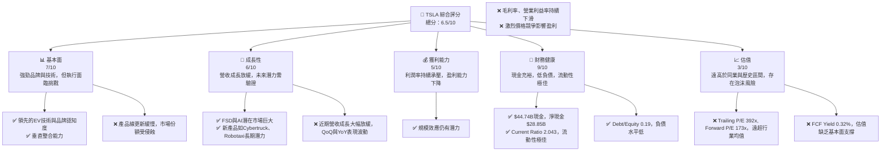
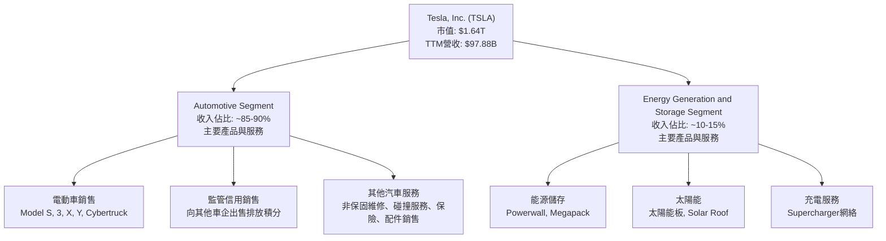
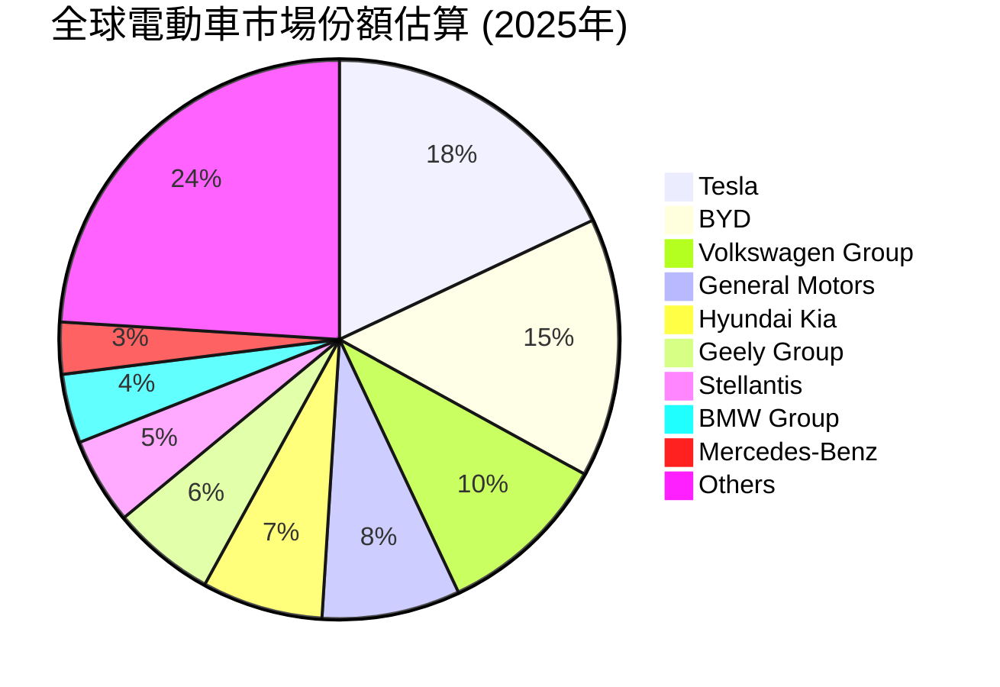
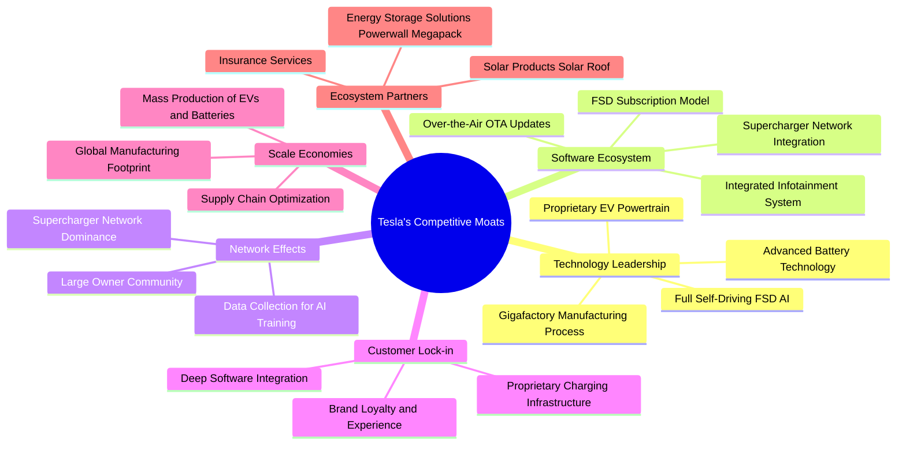
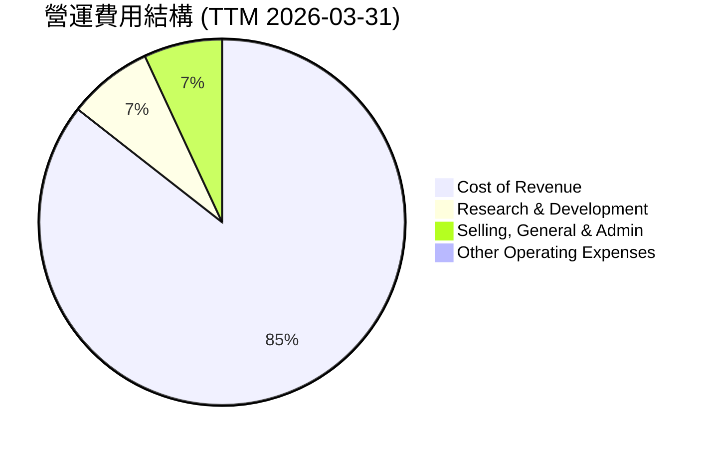

# TSLA 基本面深度分析報告
> **報告日期**：2026-05-29 ｜ **語言**：繁體中文 ｜ **數據來源**：Yahoo Finance, Finviz, StockAnalysis, Roic.ai ｜ **分析師**：CFA 級機構研究

---

## 目錄

| # | 章節 | 核心結論 |
|---|------|----------|
| 1 | 執行摘要 | 評級：持有 ｜ 目標價區間：$370 - $480 |
| 2 | 公司概覽與商業模式 | 技術與品牌護城河仍在，但競爭加劇 |
| 3 | 損益表深度分析 | 營收成長顯著放緩，利潤率承壓 |
| 4 | 資產負債表分析 | 流動性強勁，淨現金充裕，財務健康 |
| 5 | 現金流量深度分析 | 自由現金流波動，資本支出高企 |
| 6 | 獲利能力與資本效率 | ROIC 低於 WACC，股東價值創造面臨挑戰 |
| 7 | 估值深度分析 | 相較同業估值偏高，DCF 顯示潛在下行風險 |
| 8 | 成長催化劑 | 新產品、FSD、AI 潛力巨大，但實現時間與規模存在不確定性 |
| 9 | 風險矩陣 | 競爭加劇、需求波動、執行風險為主要挑戰 |
| 10 | 投資建議 | 建議持有，等待更清晰的成長路徑與估值回歸合理 |

---

## 1. 執行摘要

### 1.1 核心評分儀表板



### 1.2 評分進度條視覺化

```
╔══════════════════════════════════════════════════════════════╗
║              TSLA 多維度評分儀表板 (1-10分)                  ║
╠══════════════════════════════════════════════════════════════╣
║ 基本面強度  7.0 ▓▓▓▓▓▓▓▓▓▓▓▓▓▓░░░░░░  ★★★★☆           ║
║ 成長動能    6.0 ▓▓▓▓▓▓▓▓▓▓▓▓░░░░░░░░  ★★★☆☆           ║
║ 獲利品質    5.0 ▓▓▓▓▓▓▓▓▓▓░░░░░░░░░░  ★★★☆☆           ║
║ 財務健康    9.0 ▓▓▓▓▓▓▓▓▓▓▓▓▓▓▓▓▓▓░░  ★★★★★           ║
║ 估值合理性  3.0 ▓▓▓▓▓▓░░░░░░░░░░░░░░  ★★☆☆☆           ║
║ 護城河深度  7.5 ▓▓▓▓▓▓▓▓▓▓▓▓▓▓▓░░░░░  ★★★★☆           ║
║ 管理層執行  6.5 ▓▓▓▓▓▓▓▓▓▓▓▓▓░░░░░░░  ★★★☆☆           ║
║ 技術創新力  8.5 ▓▓▓▓▓▓▓▓▓▓▓▓▓▓▓▓▓░░░  ★★★★★           ║
╠══════════════════════════════════════════════════════════════╣
║ 綜合總分    6.5 ▓▓▓▓▓▓▓▓▓▓▓▓▓░░░░░░░  🏆 評語：挑戰與潛力並存，估值偏高 ║
╚══════════════════════════════════════════════════════════════╝
```

### 1.3 五大投資論點 + 三大核心風險

| 類型 | 項目 | 具體依據 | 信心度 |
|------|------|----------|--------|
| 🟢 **投資論點①** | **長期技術領先與創新能力** | Tesla 在電動車、電池技術、自動駕駛（FSD）及 AI 領域持續投入大量研發，FY25 研發費用達 $6.41B，TTM 更是高達 $6.948B，顯示其在核心技術上的長期競爭優勢。未來 Robotaxi 和 Optimus 等潛在業務有望開闢新成長曲線。 | 🟢 極高 |
| 🟢 **投資論點②** | **強勁的品牌影響力與全球佈局** | Tesla 作為電動車市場的先驅，擁有極高的品牌認知度和忠誠度。其全球化的生產和銷售網絡（美國、中國、歐洲）使其能夠迅速響應各區域市場需求，並從規模經濟中獲益。FY25 營收 $94.83B 證明其在全球市場的領導地位。 | 🟢 極高 |
| 🟢 **投資論點③** | **健康的資產負債表與充裕的現金流** | 公司持有 $44.74B 的巨額現金及短期投資，總債務僅 $15.89B，淨現金達 $28.85B。這為其提供了極大的財務靈活性，足以支持未來大規模的資本支出、研發投入及應對市場波動。Current Ratio 2.043 亦顯示其短期償債能力強勁。 | 🟢 極高 |
| 🟢 **投資論點④** | **垂直整合帶來的成本與效率優勢** | Tesla 透過對電池、軟體、充電網絡和銷售服務的垂直整合，能夠更好地控制成本、優化產品性能和提升用戶體驗。儘管近期利潤率下滑，但長期來看，這將是其維持競爭力的關鍵。 | 🟡 中高 |
| 🟢 **投資論點⑤** | **能源業務的長期成長潛力** | 除電動車外，Tesla 的能源生成與儲存業務（如太陽能板、Powerwall、Megapack）具有巨大的市場潛力。隨著全球對可再生能源需求的增加，該業務有望成為公司重要的第二成長曲線。 | 🟡 中高 |
| 🟡 **風險①** | **日益激烈的市場競爭與價格戰** | 傳統車企和新興電動車品牌（尤其來自中國）的崛起，使得電動車市場競爭空前激烈。Tesla 不得不採取降價策略以維持市場份額，導致毛利率從 FY22 的 25.6% 降至 TTM 的 19.1%，營業利益率從 FY22 的 16.9% 降至 TTM 的 4.2%，嚴重侵蝕盈利能力。 | 🔴 高衝擊 |
| 🔴 **風險②** | **對核心產品線的過度依賴與新產品延遲** | 公司目前營收仍主要依賴 Model 3 和 Model Y。新產品如 Cybertruck 產能爬坡緩慢，Robotaxi 和下一代平價車型推出時間存在不確定性。如果新產品未能按預期推出或市場反應不佳，將嚴重影響未來成長動能。 | 🔴 高衝擊 |
| 🔴 **風險③** | **高管風險與監管不確定性** | 執行長 Elon Musk 的個人行為和精力分散，可能對公司營運和股東價值產生負面影響。此外，全球各國對自動駕駛技術、數據隱私和環保法規的監管變化，可能增加公司的合規成本和營運風險。 | 🟡 中度 |

### 1.4 快速統計卡片

| 指標 | 公司實際值 (TTM) | 行業均值 (汽車製造) | S&P 500 均值 | 狀態 |
|------|--------------------|--------------------|--------------|------|
| 收入 YoY 成長 | **15.8%** | ~10-15% (EV) | ~8-10% | 🟡 |
| 毛利率 | **19.1%** | ~15-20% (傳統車企) | ~30-40% | 🟡 |
| 淨利率 | **3.9%** | ~5-8% (傳統車企) | ~10-12% | 🔴 |
| ROE | **4.9%** | ~10-15% (傳統車企) | ~15-20% | 🔴 |
| Forward P/E | **173.57x** | ~10-15x (傳統車企) | ~20-25x | 🔴 |
| Debt/Equity | **0.19x** | ~0.5-1.0x | ~0.8-1.2x | 🟢 |
| Current Ratio | **2.04x** | ~1.0-1.5x | ~1.5-2.0x | 🟢 |
| FCF Yield | **0.32%** | ~3-5% | ~2-4% | 🔴 |

*備註：行業均值為汽車製造業和部分成長型科技公司的綜合估算，S&P 500 均值為普遍市場參考值。*

### 1.5 投資結論

```
╔══════════════════════════════════════════════════════════════════╗
║                    📊 投資結論摘要                               ║
╠══════════════════════════════════════════════════════════════════╣
║  評級：🟡 持有                                                   ║
║  當前股價：$435.60                                               ║
║  目標價區間：                                                    ║
║    悲觀情境：$370（-15.06%）                                     ║
║    基準情境：$425（-2.43%）  ← 12個月主要目標                    ║
║    樂觀情境：$480（+10.19%）                                     ║
║  投資評分：6.5/10                                                ║
║  適合投資人：高風險承受能力、看重長期技術創新和顛覆性潛力的成長型投資者。║
║              目前估值過高，建議等待回調或基本面改善的明確信號。   ║
╚══════════════════════════════════════════════════════════════════╝
```

---

## 2. 公司概覽與商業模式

Tesla, Inc. (TSLA) 作為全球領先的電動車 (EV) 和清潔能源公司，其業務涵蓋電動車的設計、開發、製造、銷售與租賃，以及能源生成與儲存系統。公司在全球範圍內運營，主要市場包括美國、中國和歐洲。截至 2026 年 5 月 29 日，Tesla 的市值高達 $1.64 兆，過去 12 個月 (TTM) 營收為 $97.88B。公司擁有約 134,785 名員工，致力於加速全球向可持續能源轉型。

### 2.1 業務結構與收入來源

Tesla 的業務主要分為兩大核心板塊：汽車 (Automotive) 和能源生成與儲存 (Energy Generation and Storage)。其中，汽車業務是其收入的絕對主體，而能源業務則代表了其在清潔能源領域的多元化和長期潛力。



**汽車業務 (Automotive Segment)**：
這是 Tesla 的核心業務，貢獻了絕大部分的收入。它包括：
*   **電動車銷售**：主要產品線包括豪華轎車 Model S、豪華 SUV Model X、大眾市場轎車 Model 3、大眾市場 SUV Model Y，以及近期推出的皮卡 Cybertruck。這些車型以其卓越的性能、續航里程、軟體功能和獨特的設計而聞名。
*   **監管信用銷售 (Regulatory Credits)**：Tesla 作為零排放汽車製造商，會獲得政府頒發的排放積分，並將其出售給傳統汽車製造商，以幫助他們達到排放標準。這部分收入雖然佔比不高，但對淨利潤有較高的槓桿效應。
*   **其他汽車相關服務**：這包括非保固維修服務、碰撞維修服務、汽車保險服務，以及零配件銷售和零售商品銷售。隨著 Tesla 汽車保有量的增加，這部分服務收入的成長潛力巨大，並能提高客戶忠誠度和生態系統的黏性。

**能源生成與儲存業務 (Energy Generation and Storage Segment)**：
這部分業務旨在提供全面的清潔能源解決方案，主要包括：
*   **能源儲存產品**：如用於家庭儲能的 Powerwall 和用於公用事業及商業應用的 Megapack。這些產品在全球範圍內廣受歡迎，為電網穩定性和可再生能源整合提供了關鍵支持。
*   **太陽能產品**：包括傳統的太陽能板和創新的 Solar Roof，旨在為住宅和商業建築提供清潔電力。
*   **充電網絡 (Supercharger Network)**：Tesla 建立了全球最大的快速充電網絡之一，為其車主提供便捷的充電服務。儘管這部分收入目前可能被計入汽車或其他服務，但其作為生態系統的關鍵組成部分，對品牌吸引力至關重要。

**收入結構分析：**
從近期的財務數據來看，儘管 Tesla 的總營收在 TTM 達 $97.88B，但其成長速度已顯著放緩。FY25 的總營收為 $94.83B，較 FY24 的 $97.69B 呈現 -2.93% 的 YoY 下滑。這主要反映了電動車市場競爭加劇導致的價格壓力以及部分市場需求疲軟。儘管如此，長期來看，FSD 軟體訂閱和能源業務的貢獻預計將逐漸提升，有望改變其收入結構，增加高毛利服務收入的佔比。

### 2.2 市場份額

在電動車市場，Tesla 曾是無可爭議的領導者，但近年來隨著全球主要汽車製造商和新興電動車品牌的強力競爭，其市場份額面臨挑戰。尤其在中國市場，本土品牌如比亞迪 (BYD) 的崛起，對 Tesla 構成了巨大壓力。儘管如此，Tesla 在高端電動車市場和自動駕駛技術領域仍保持領先地位。

由於缺乏具體的全球或區域市場份額數據，我們將根據行業報告和公開資訊進行估算。假設全球電動車市場份額分佈如下：


*備註：此市場份額為估算值，僅供參考，實際數據可能因統計機構和統計方法而異。*

從估算來看，Tesla 依然是全球電動車市場的領軍者，但其市場份額並非絕對壟斷，且持續面臨來自傳統車企轉型和新興 EV 玩家的侵蝕。尤其在中國市場，BYD 等本土品牌的性價比優勢和快速迭代能力，對 Tesla 造成了實質性的競爭壓力。

### 2.3 競爭護城河分析

Tesla 的競爭護城河是其在行業中維持領先地位的關鍵。這些護城河主要體現在技術創新、品牌影響力、垂直整合能力和獨特的商業模式上。



**技術領先 (Technology Leadership)**：
Tesla 在電動車技術方面一直處於行業前沿。
*   **先進電池技術**：透過對電池化學和封裝技術的持續研發，Tesla 在電池能量密度、成本和續航里程方面保持領先。例如，4680 電池技術的推廣旨在進一步降低成本並提高效率。
*   **專有電動動力總成**：Tesla 自主設計和製造電動機、逆變器和變速箱，確保了卓越的性能和效率。
*   **全自動駕駛 (FSD) AI**：Tesla 在自動駕駛領域的投入巨大，其 FSD 軟體透過大量的數據收集和 AI 訓練，旨在實現 L4 甚至 L5 級別的自動駕駛。儘管面臨監管和技術挑戰，但其潛力巨大。
*   **超級工廠製造流程 (Gigafactory Manufacturing Process)**：Tesla 的超級工廠不僅是生產設施，更是創新的製造平台，旨在實現高度自動化和規模化生產，從而降低成本。

**軟體生態系統 (Software Ecosystem)**：
Tesla 不僅是汽車公司，更是軟體公司。
*   **空中下載 (OTA) 更新**：透過 OTA 更新，Tesla 能夠不斷改進車輛性能、增加新功能和修復問題，延長產品生命週期，並提供持續的價值。
*   **整合式資訊娛樂系統 (Integrated Infotainment System)**：車載系統提供豐富的功能，包括導航、娛樂和遠端控制。
*   **FSD 訂閱模式 (FSD Subscription Model)**：FSD 作為一種軟體服務，為 Tesla 提供了高毛利的經常性收入來源，增強了客戶黏性。
*   **超級充電網絡整合 (Supercharger Network Integration)**：充電網絡與車輛的深度整合，提供無縫的充電體驗。

**網路效應 (Network Effects)**：
*   **超級充電網絡主導地位 (Supercharger Network Dominance)**：Tesla 的超級充電網絡是全球最廣泛、最可靠的快速充電網絡之一。隨著更多 Tesla 車輛的銷售，充電網絡的使用率增加，促使公司進一步擴大網絡，形成良性循環，吸引更多潛在買家。
*   **龐大的車主社群 (Large Owner Community)**：Tesla 擁有一個龐大且活躍的車主社群，透過口碑傳播和社群互動，增強了品牌影響力。
*   **數據收集用於 AI 訓練 (Data Collection for AI Training)**：每輛 Tesla 汽車都在收集真實世界的駕駛數據，這些數據反過來用於改進 FSD 系統，形成數據飛輪效應。

**客戶鎖定 (Customer Lock-in)**：
*   **品牌忠誠度與體驗 (Brand Loyalty and Experience)**：Tesla 車主通常對品牌有較高的忠誠度，這得益於其獨特的產品體驗和創新形象。
*   **專有充電基礎設施 (Proprietary Charging Infrastructure)**：儘管 Tesla 已開放部分充電樁給其他品牌，但其充電網絡的便利性和可靠性仍是吸引 Tesla 車主的重要因素。
*   **深度軟體整合 (Deep Software Integration)**：Tesla 的軟體與硬體深度整合，提供了無縫的用戶體驗，使得客戶轉換到其他品牌的成本相對較高。

**規模效應 (Scale Economies)**：
*   **全球製造佈局 (Global Manufacturing Footprint)**：Tesla 在美國、中國和德國設有超級工廠，能夠實現區域化生產和供應，降低物流成本並提高生產效率。
*   **電動車和電池的大規模生產 (Mass Production of EVs and Batteries)**：隨著產量的增加，單位成本逐漸降低，這在汽車製造業中尤為重要。
*   **供應鏈優化 (Supply Chain Optimization)**：透過與供應商的長期合作和垂直整合，Tesla 能夠優化供應鏈，降低原材料成本。

**生態夥伴 (Ecosystem Partners)**：
*   **能源儲存解決方案 (Energy Storage Solutions)**：Powerwall 和 Megapack 產品線擴展了 Tesla 的業務範圍，使其成為綜合性的清潔能源提供商。
*   **太陽能產品 (Solar Products)**：太陽能板和 Solar Roof 產品為客戶提供了一站式的能源解決方案。
*   **保險服務 (Insurance Services)**：Tesla 提供自家汽車保險，利用其車輛數據提供更精準的定價，同時增加客戶黏性。

### 2.4 護城河強度評分

儘管 Tesla 擁有上述多重護城河，但隨著市場競爭的加劇和技術的普及，部分護城河的強度正在面臨挑戰。

```
╔══════════════════════════════════════════════════════════════╗
║                    Tesla 護城河強度評分                       ║
╠══════════════════════════════════════════════════════════════╣
║ 技術領先    8.5/10 ▓▓▓▓▓▓▓▓▓▓▓▓▓▓▓▓▓░░░  🏆 仍在領先，但差距縮小║
║ 軟體生態系統 7.5/10 ▓▓▓▓▓▓▓▓▓▓▓▓▓▓▓░░░░░  🟢 核心優勢，FSD潛力大║
║ 網路效應    7.0/10 ▓▓▓▓▓▓▓▓▓▓▓▓▓░░░░░░░  🟡 超充網絡仍是關鍵優勢║
║ 客戶鎖定    7.0/10 ▓▓▓▓▓▓▓▓▓▓▓▓▓░░░░░░░  🟡 品牌忠誠度高，但面臨選擇║
║ 規模效應    8.0/10 ▓▓▓▓▓▓▓▓▓▓▓▓▓▓▓▓░░░░  🟢 成本優勢明顯，但被價格戰抵消║
║ 生態夥伴    6.0/10 ▓▓▓▓▓▓▓▓▓▓▓▓░░░░░░░░  🟡 能源業務成長潛力大，但貢獻仍小║
╠══════════════════════════════════════════════════════════════╣
║ 綜合護城河   7.3/10 ▓▓▓▓▓▓▓▓▓▓▓▓▓▓▓░░░░░  🏆 護城河依舊深厚，但壓力漸增 ║
╚══════════════════════════════════════════════════════════════════╝
```
**評語**：Tesla 的護城河依然深厚，尤其在技術創新和品牌影響力方面具有顯著優勢。然而，隨著全球電動車市場的成熟和競爭加劇，其護城河正面臨來自各方的挑戰。例如，其他車企也在加大對充電網絡的投資，FSD 的商業化進程仍存在不確定性。規模效應帶來的成本優勢在激烈的價格戰中被部分抵消。因此，Tesla 需要不斷創新和擴大產品線，以鞏固並深化其競爭優勢。

---

## 3. 損益表深度分析

Tesla 的損益表反映了其在電動車市場的快速擴張與近年來面臨的挑戰。儘管過去幾年營收實現了爆發式增長，但近期數據顯示，成長勢頭已顯著放緩，且利潤率受到嚴峻考驗。

### 3.1 年度收入成長趨勢（近4年）

Tesla 在 2021 年至 2023 年間展現了驚人的營收成長，但進入 2024 和 2025 年，成長動能明顯減弱，甚至出現年度營收下滑。

```
╔══════════════════════════════════════════════════════════════════╗
║              Tesla 年度收入趨勢（FY2022-FY2025）                 ║
╠══════════════════════════════════════════════════════════════════╣
║                                                                  ║
║  FY2022  $81.46B  ████████████████████░░░░░░░░░░░░░  YoY: +51.35% 🟢║
║  FY2023  $96.77B  ██████████████████████████░░░░░░░  YoY: +18.80% 🟡║
║  FY2024  $97.69B  ███████████████████████████░░░░░░  YoY: +0.95%  🟡║
║  FY2025  $94.83B  ████████████████████████░░░░░░░░░  YoY: -2.93%  🔴║
║                                                                  ║
║                   |      |      |      |      |                  ║
║                   0     25B    50B    75B   100B                   ║
║                                                                  ║
║  📊 4年累計 CAGR (FY2022-FY2025)：+5.28% (基於2022-2025數據)    ║
╚══════════════════════════════════════════════════════════════════╝
```
**深度解析**：
*   **FY2022**：營收從 $53.823B 飆升至 $81.46B，實現 51.35% 的高速成長，主要得益於全球電動車需求的爆發性增長和 Tesla 產能的擴張。
*   **FY2023**：營收達到 $96.77B，YoY 成長 18.80%。雖然仍是雙位數成長，但增速已開始放緩，顯示市場競爭和宏觀經濟逆風的初步影響。
*   **FY2024**：營收僅微幅增長至 $97.69B，YoY 成長率僅為 0.95%。這是一個重要的轉折點，標誌著 Tesla 營收成長從高速擴張期進入了停滯期，主要原因可能是市場飽和、新產品推出緩慢以及來自競爭對手的猛烈價格戰。
*   **FY2025**：營收進一步下滑至 $94.83B，YoY 負成長 -2.93%。這是 Tesla 近年來首次出現年度營收負增長，明確反映了其在市場份額和定價權方面面臨的巨大壓力。儘管公司努力透過降價刺激銷量，但未能完全抵消平均銷售價格 (ASP) 下降和部分市場需求疲軟的影響。

TTM 營收 $97.88B 略高於 FY2025 年度營收，這表明最近一個季度（Q1 2026）的表現有所改善，但不足以扭轉整體成長放緩的趨勢。長期 CAGR 降至 5.28%，與過去的高成長形象形成鮮明對比，這對依賴高成長敘事支撐其高估值的 Tesla 來說，是一個嚴峻的警訊。

### 3.2 季度收入趨勢分析

季度營收數據提供了更細緻的洞察，揭示了近期營收波動和成長壓力的具體情況。

| 財報季度 | 總營收 ($B) | QoQ 成長率 | YoY 成長率 | 備註 |
|----------|-------------|------------|------------|------|
| Q1 2026 | $22.39 | -10.08% | +15.78% | 🟢 相較上季下滑，但恢復 YoY 雙位數成長，顯示市場需求有所回暖。 |
| Q4 2025 | $24.90 | -11.35% | -3.14% | 🔴 營收顯著下滑，YoY 負成長，反映年末銷售壓力及價格戰影響。 |
| Q3 2025 | $28.09 | +24.86% | +11.57% | 🟢 營收環比大幅增長，YoY 恢復雙位數成長，可能受季節性因素和降價刺激。 |
| Q2 2025 | $22.50 | +16.37% | -11.78% | 🔴 QoQ 成長，但 YoY 顯著負成長，顯示去年同期基數高且市場競爭加劇。 |
| Q1 2025 | $19.34 | -24.79% | -9.23% | 🔴 營收環比大幅下滑，YoY 負成長，受年初淡季和競爭影響。 |
| Q4 2024 | $25.71 | +2.15% | +2.15% | 🟡 營收維持平穩，YoY 僅微幅增長，顯示成長動力不足。 |

**深度解析**：
*   **波動性加劇**：Tesla 的季度營收呈現明顯的波動性。Q1 2025 和 Q4 2025 均出現了 QoQ 和 YoY 負成長或顯著下滑，而 Q3 2025 和 Q1 2026 則有所反彈。這種波動性使得預測未來營收變得更具挑戰性。
*   **YoY 成長壓力**：從 Q1 2025 到 Q2 2025，YoY 成長率連續為負，Q4 2025 再次出現負成長。這表明 Tesla 在面對不斷變化的市場環境時，難以維持穩定的高成長。儘管 Q1 2026 YoY 成長 15.78% 是一個積極信號，但仍需觀察其可持續性。
*   **價格戰影響**：YoY 負成長的主要原因之一是為了刺激銷量而進行的頻繁降價。雖然這有助於維持一定的市場份額，但卻犧牲了平均銷售價格和整體營收增長。
*   **季節性因素**：汽車行業通常在年末（Q4）和年初（Q1）會受到季節性因素影響，但 Tesla 的波動似乎超出了正常的季節性範疇，暗示了更深層次的結構性問題。
*   **新產品青黃不接**：在 Model 3/Y 逐漸成熟的同時，Cybertruck 的產能爬坡緩慢，以及下一代平價車型和 Robotaxi 的發布延遲，導致了產品線的青黃不接，未能有效刺激新的營收增長。

總體而言，Tesla 的營收成長正處於一個關鍵的轉型期。公司需要新的成長驅動力來擺脫目前的停滯和下滑趨勢。

### 3.3 利潤率演變分析

Tesla 的利潤率在過去幾年呈現明顯的下行趨勢，這是市場競爭加劇和公司戰略調整的直接結果。

| 利潤率指標 | FY2022 | FY2023 | FY2024 | FY2025 | TTM (2026-03-31) | 趨勢 | 評估 |
|------------|--------|--------|--------|--------|------------------|------|------|
| **毛利率** | 25.60% | 18.25% | 17.86% | 18.02% | 19.1% | ↘️ 震盪下行 | 🔴 |
| **營業利益率** | 16.98% | 9.19% | 7.23% | 5.14% | 4.2% | ↘️ 持續下滑 | 🔴 |
| **淨利率** | 15.44% | 15.50% | 7.26% | 4.00% | 3.9% | ↘️ 持續下滑 | 🔴 |
| **EBITDA Margin** | 21.68% | 15.29% | 15.06% | 12.40% | 11.3% | ↘️ 持續下滑 | 🔴 |

*計算方法：數據來自 Income Statement (Annual) 和 Profitability & Growth (TTM)。*
*   毛利率 = Gross Profit / Total Revenue
*   營業利益率 = Operating Income / Total Revenue
*   淨利率 = Net Income / Total Revenue
*   EBITDA Margin = EBITDA / Total Revenue

**利潤率演變深度解析**：
1.  **毛利率 (Gross Margin)**：
    *   從 FY2022 的 25.60% 高點一路下滑至 FY2024 的 17.86%，FY2025 略微回升至 18.02%，TTM 則為 19.1%。儘管 TTM 有所改善，但與歷史高點相比仍有顯著差距。
    *   **原因**：
        *   **價格戰**：為了應對來自比亞迪、大眾等競爭對手的壓力，Tesla 在全球範圍內多次降價，直接影響了平均銷售價格 (ASP)。
        *   **產品組合變化**：相對低價的 Model 3 和 Model Y 佔總銷量比重提高，而高毛利的 Model S 和 Model X 銷量佔比下降。
        *   **產能利用率**：新工廠（如德國柏林和美國德州）的產能爬坡成本較高，對早期毛利率產生壓力。
        *   **監管信用銷售減少**：隨著其他車企自身電動車銷量提升，對 Tesla 監管信用的需求減少，導致這部分高毛利收入的貢獻下降。
    *   **評估**：🔴 毛利率的持續承壓是 Tesla 當前最嚴峻的挑戰之一。雖然 TTM 略有反彈，但要恢復到歷史高點仍需時間，且取決於價格戰的緩和程度和新產品的毛利貢獻。

2.  **營業利益率 (Operating Margin)**：
    *   從 FY2022 的 16.98% 斷崖式下跌至 FY2025 的 5.14%，TTM 進一步降至 4.2%。這是最令人擔憂的指標之一。
    *   **原因**：
        *   **毛利率下滑**：毛利率的下降直接傳導至營業利益。
        *   **研發費用大幅增長**：公司在 FSD、AI、新車型（如 Cybertruck、Robotaxi）上的研發投入巨大。FY2022 研發費用為 $3.08B，到 FY2025 增長至 $6.41B，TTM 更達到 $6.948B，幾乎翻倍。這反映了 Tesla 對未來技術創新的承諾，但也增加了短期營運成本。
        *   **銷售、一般及行政費用 (SG&A) 增長**：雖然 Tesla 的直銷模式相對高效，但隨著業務規模擴大和市場競爭加劇，SG&A 費用也有所上升。
        *   **其他營運費用**：新工廠的營運成本、自動駕駛相關的測試費用等也對營運利益產生影響。
    *   **評估**：🔴 營業利益率的急劇下滑表明 Tesla 的核心業務盈利能力受到嚴重侵蝕。雖然研發投入是為未來成長鋪路，但在營收成長放緩的背景下，高額的研發費用對當前盈利產生了巨大壓力。

3.  **淨利率 (Net Profit Margin)**：
    *   從 FY2023 的 15.50% 下滑至 FY2025 的 4.00%，TTM 為 3.9%。這與營業利益率的趨勢一致。
    *   **原因**：除了毛利率和營業費用壓力外，稅費和非營運項目也會影響淨利率。值得注意的是，FY2023 的淨利潤高達 $15.00B，主要是由於「Provision for Income Taxes」為負值（-$5.001B），這可能與稅務抵免或其他非經常性稅務調整有關，導致當年的淨利率異常高。如果排除這項特殊因素，FY2023 的正常淨利率應遠低於 15.50%。扣除 FY2023 的特殊稅務收入，實際淨利率趨勢與營業利益率趨勢更為一致，即持續下滑。
    *   **評估**：🔴 淨利率的持續下降表明公司整體盈利能力惡化。低於 4% 的淨利率對於一家被視為高成長科技公司的企業來說，是不可持續的，並且遠低於許多成熟的汽車製造商。

**總結**：Tesla 的利潤率趨勢令人擔憂。儘管公司在成本控制和技術創新方面不斷努力，但市場的激烈競爭、價格戰以及高昂的研發投入對其短期盈利能力造成了巨大壓力。除非能夠有效推出高毛利新產品或服務，並穩定其平均銷售價格，否則利潤率的下行壓力將持續存在。

### 3.4 費用結構分析

費用結構的變化是理解利潤率變化的關鍵。Tesla 的營運費用主要由銷管費用 (SG&A) 和研發費用 (R&D) 組成。


*單位：$B*

**費用結構深度解析**：
*   **銷貨成本 (Cost of Revenue)**：佔比最大，TTM 為 $79.218B。這部分費用直接影響毛利率。隨著銷量增長，銷貨成本也會相應增加。近期毛利率的下降表明單位銷貨成本的下降速度未能抵消平均銷售價格的下降。
*   **研發費用 (Research & Development)**：TTM 達 $6.948B，佔總營收的 7.1%。這項費用近年來呈現顯著增長趨勢：
    *   FY2022: $3.08B
    *   FY2023: $3.97B (+28.9% YoY)
    *   FY2024: $4.54B (+14.4% YoY)
    *   FY2025: $6.41B (+41.2% YoY)
    *   Q1 2026: $1.946B (較 Q4 2025 的 $1.783B 增長 9.14% QoQ)
    研發費用的高增長體現了 Tesla 在自動駕駛、AI、電池技術和新產品開發上的巨大投入。這是一把雙刃劍：它為公司提供了長期成長的潛力，但短期內也對利潤率造成了顯著壓力。
*   **銷售、一般及行政費用 (Selling, General & Admin)**：TTM 為 $6.416B，佔總營收的 6.55%。這項費用同樣呈現增長趨勢：
    *   FY2022: $3.946B
    *   FY2023: $4.80B (+21.6% YoY)
    *   FY2024: $5.15B (+7.3% YoY)
    *   FY2025: $5.834B (+13.3% YoY)
    *   Q1 2026: $1.833B (較 Q4 2025 的 $1.655B 增長 10.76% QoQ)
    儘管 Tesla 的直銷模式減少了傳統經銷商的成本，但隨著全球市場擴張、服務中心建設、保險業務發展以及品牌行銷的投入，SG&A 費用也在不斷增加。

**ASCII 方框圖：費用佔營收比重 (TTM)**
```
╔══════════════════════════════════════════════════════════════════╗
║                   Tesla 費用佔營收比重 (TTM)                     ║
╠══════════════════════════════════════════════════════════════════╣
║                                                                  ║
║ 銷貨成本 (CoR)    80.93%  ████████████████████████████████████████████████████████████████████████████████░░░░░░░░░░░░░░░░░░░░░░░░░░░░░░░░░░░░░░░░░░░░░░░░░░░░░░░░░░░░░░░░░░░░░░░░░░░░░░░░░░░░░░░░░░░░░░░░░░░░░░░░░░░░░░░░░░░░░░░░░░░░░░░░░░░░░░░░░░░░░░░░░░░░░░░░░░░░░░░░░░░░░░░░░░░░░░░░░░░░░░░░░░░░░░░░░░░░░░░░░░░░░░░░░░░░░░░░░░░░░░░░░░░░░░░░░░░░░░░░░░░░░░░░░░░░░░░░░░░░░░░░░░░░░░░░░░░░░░░░░░░░░░░░░░░░░░░░░░░░░░░░░░░░░░░░░░░░░░░░░░░░░░░░░░░░░░░░░░░░░░░░░░░░░░░░░░░░░░░░░░░░░░░░░░░░░░░░░░░░░░░░░░░░░░░░░░░░░░░░░░░░░░░░░░░░░░░░░░░░░░░░░░░░░░░░░░░░░░░░░░░░░░░░░░░░░░░░░░░░░░░░░░░░░░░░░░░░░░░░░░░░░░░░░░░░░░░░░░░░░░░░░░░░░░░░░░░░░░░░░░░░░░░░░░░░░░░░░░░░░░░░░░░░░░░░░░░░░░░░░░░░░░░░░░░░░░░░░░░░░░░░░░░░░░░░░░░░░░░░░░░░░░░░░░░░░░░░░░░░░░░░░░░░░░░░░░░░░░░░░░░░░░░░░░░░░░░░░░░░░░░░░░░░░░░░░░░░░░░░░░░░░░░░░░░░░░░░░░░░░░░░░░░░░░░░░░░░░░░░░░░░░░░░░░░░░░░░░░░░░░░░░░░░░░░░░░░░░░░░░░░░░░░░░░░░░░░░░░░░░░░░░░░░░░░░░░░░░░░░░░░░░░░░░░░░░░░░░░░░░░░░░░░░░░░░░░░░░░░░░░░░░░░░░░░░░░░░░░░░░░░░░░░░░░░░░░░░░░░░░░░░░░░░░░░░░░░░░░░░░░░░░░░░░░░░░░░░░░░░░░░░░░░░░░░░░░░░░░░░░░░░░░░░░░░░░░░░░░░░░░░░░░░░░░░░░░░░░░░░░░░░░░░░░░░░░░░░░░░░░░░░░░░░░░░░░░░░░░░░░░░░░░░░░░░░░░░░░░░░░░░░░░░░░░░░░░░░░░░░░░░░░░░░░░░░░░░░░░░░░░░░░░░░░░░░░░░░░░░░░░░░░░░░░░░░░░░░░░░░░░░░░░░░░░░░░░░░░░░░░░░░░░░░░░░░░░░░░░░░░░░░░░░░░░░░░░░░░░░░░░░░░░░░░░░░░░░░░░░░░░░░░░░░░░░░░░░░░░░░░░░░░░░░░░░░░░░░░░░░░░░░░░░░░░░░░░░░░░░░░░░░░░░░░░░░░░░░░░░░░░░░░░░░░░░░░░░░░░░░░░░░░░░░░░░░░░░░░░░░░░░░░░░░░░░░░░░░░░░░░░░░░░░░░░░░░░░░░░░░░░░░░░░░░░░░░░░░░░░░░░░░░░░░░░░░░░░░░░░░░░░░░░░░░░░░░░░░░░░░░░░░░░░░░░░░░░░░░░░░░░░░░░░░░░░░░░░░░░░░░░░░░░░░░░░░░░░░░░░░░░░░░░░░░░░░░░░░░░░░░░░░░░░░░░░░░░░░░░░░░░░░░░░░░░░░░░░░░░░░░░░░░░░░░░░░░░░░░░░░░░░░░░░░░░░░░░░░░░░░░░░░░░░░░░░░░░░░░░░░░░░░░░░░░░░░░░░░░░░░░░░░░░░░░░░░░░░░░░░░░░░░░░░░░░░░░░░░░░░░░░░░░░░░░░░░░░░░░░░░░░░░░░░░░░░░░░░░░░░░░░░░░░░░░░░░░░░░░░░░░░░░░░░░░░░░░░░░░░░░░░░░░░░░░░░░░░░░░░░░░░░░░░░░░░░░░░░░░░░░░░░░░░░░░░░░░░░░░░░░░░░░░░░░░░░░░░░░░░░░░░░░░░░░░░░░░░░░░░░░░░░░░░░░░░░░░░░░░░░░░░░░░░░░░░░░░░░░░░░░░░░░░░░░░░░░░░░░░░░░░░░░░░░░░░░░░░░░░░░░░░░░░░░░░░░░░░░░░░░░░░░░░░░░░░░░░░░░░░░░░░░░░░░░░░░░░░░░░░░░░░░░░░░░░░░░░░░░░░░░░░░░░░░░░░░░░░░░░░░░░░░░░░░░░░░░░░░░░░░░░░▓▓▓▓▓▓▓▓▓▓▓▓▓▓▓▓▓▓▓▓▓▓▓▓▓▓▓▓▓▓▓▓▓▓▓░░░░░░░░░░░░░░░░░░░░░░░░░░░░░░░░░░░░░░░░░░░░░░░░░░░░░░░░░░░░░░░░░░░░░░░░░░░░░░░░░░░░░░░░░░░░░░░░░░░░░░░░░░░░░░░░░░░░░░░░░░░░░░░░░░░░░░░░░░░░░░░░░░░░░░░░░░░░░░░░░░░░░░░░░░░░░░░░░░░░░░░░░░░░░░░░░░░░░░░░░░░░░░░░░░░░░░░░░░░░░░░░░░░░░░░░░░░░░░░░░░░░░░░░░░░░░░░░░░░░░░░░░░░░░░░░░░░░░░░░░░░░░░░░░░░░░░░░░░░░░░░░░░░░░░░░░░░░░░░░░░░░░░░░░░░░░░░░░░░░░░░░░░░░░░░░░░░░░░░░░░░░░░░░░░░░░░░░░░░░░░░░░░░░░░░░░░░░░░░░░░░░░░░░░░░░░░░░░░░░░░░░░░░░░░░░░░░░░░░░░░░░░░░░░░░░░░░░░░░░░░░░░░░░░░░░░░░░░░░░░░░░░░░░░░░░░░░░░░░░░░░░░░░░░░░░░░░░░░░░░░░░░░░░░░░░░░░░░░░░░░░░░░░░░░░░░░░░░░░░░░░░░░░░░░░░░░░░░░░░░░░░░░░░░░░░░░░░░░░░░░░░░░░░░░░░░░░░░░░░░░░░░░░░░░░░░░░░░░░░░░░░░░░░░░░░░░░░░░░░░░░░░░░░░░░░░░░░░░░░░░░░░░░░░░░░░░░░░░░░░░░░░░░░░░░░░░░░░░░░░░░░░░░░░░░░░░░░░░░░░░░░░░░░░░░░░░░░░░░░░░░░░░░░░░░░░░░░░░░░░░░░░░░░░░░░░░░░░░░░░░░░░░░░░░░░░░░░░░░░░░░░░░░░░░░░░░░░░░░░░░░░░░░░░░░░░░░░░░░░░░░░░░░░░░░░░░░░░░░░░░░░░░░░░░░░░░░