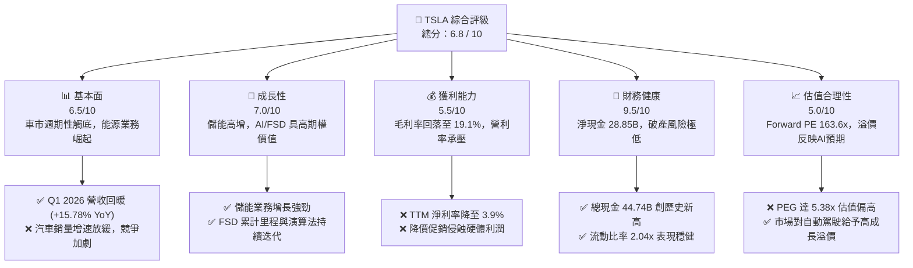

# TSLA 基本面深度分析報告
> **報告日期**：2026-06-08 ｜ **語言**：繁體中文 ｜ **數據來源**：Yahoo Finance, Finviz, StockAnalysis, Roic.ai ｜ **分析師**：CFA 級機構研究

---

## 目錄

| # | 章節 | 核心結論 |
|---|------|----------|
| 1 | 執行摘要 | 評級：**買入 (長線 AI/能源驅動，短期車市轉型陣痛)** ｜ 目標價：**$420.00** |
| 2 | 公司概覽與商業模式 | 護城河評估：**極深 (AI 數據飛輪、垂直整合與超充網絡)** |
| 3 | 損益表深度分析 | Q1 2026 營收回升 15.78% YoY，但營利率承壓於 4.20% 的歷史低位 |
| 4 | 資產負債表分析 | 淨現金高達 **$28.85B**，Debt/Equity 僅 18.74%，抗風險能力極強 |
| 5 | 現金流量深度分析 | TTM FCF 達 **$5.25B**，資本配置高度向 AI 研發與 Capex 傾斜 |
| 6 | 獲利能力與資本效率 | TTM ROE 降至 4.9%，ROIC (6.64%) 暫時低於 WACC (12.30%) |
| 7 | 估值深度分析 | Forward P/E 163.6x 溢價顯著，DCF 基準估值為 **$420.00** |
| 8 | 成長催化劑 | 能源儲能 (Megapack) 爆發式增長，FSD V12 與 Robotaxi 為長線核心 |
| 9 | 風險矩陣 | 核心風險：電動車價格戰持續、FSD 監管與商業化進度不及預期 |
| 10 | 投資建議 | 適合長線成長型投資者，分批佈局，關鍵監控毛利率與儲能裝機量 |

---

## 1. 執行摘要

### 1.1 核心評分儀表板



### 1.2 評分進度條視覺化

```
╔══════════════════════════════════════════════════════════════╗
║              TSLA 多維度評分儀表板 (1-10分)                 ║
╠══════════════════════════════════════════════════════════════╣
║ 基本面強度  6.5 ▓▓▓▓▓▓▓▓▓▓▓▓▓░░░░░░░  ★★★☆☆           ║
║ 成長動能    7.0 ▓▓▓▓▓▓▓▓▓▓▓▓▓▓░░░░░░  ★★★★☆           ║
║ 獲利品質    5.5 ▓▓▓▓▓▓▓▓▓▓▓░░░░░░░░░  ★★★☆☆           ║
║ 財務健康    9.5 ▓▓▓▓▓▓▓▓▓▓▓▓▓▓▓▓▓▓▓░  ★★★★★           ║
║ 估值合理性  5.0 ▓▓▓▓▓▓▓▓▓▓░░░░░░░░░░  ★★☆☆☆           ║
║ 護城河深度  9.0 ▓▓▓▓▓▓▓▓▓▓▓▓▓▓▓▓▓▓░░  ★★★★★           ║
║ 管理層執行  8.0 ▓▓▓▓▓▓▓▓▓▓▓▓▓▓▓▓░░░░  ★★★★☆           ║
║ 技術創新力  9.5 ▓▓▓▓▓▓▓▓▓▓▓▓▓▓▓▓▓▓▓░  ★★★★★           ║
╠══════════════════════════════════════════════════════════════╣
║ 綜合總分    6.8 ▓▓▓▓▓▓▓▓▓▓▓▓▓░░░░░░░  🏆 觀望中尋找買點    ║
╚══════════════════════════════════════════════════════════════╝
```

### 1.3 五大投資論點與三大核心風險

| 類型 | 項目 | 具體依據 | 信心度 |
|------|------|----------|--------|
| 🟢 **投資論點①** | **能源儲能業務爆發** | 2025 年儲能裝機量與營收快速增長，Megapack 毛利率優於汽車，成為第二成長曲線。 | 🟢 極高 |
| 🟢 **投資論點②** | **自動駕駛 (FSD) 商業化** | FSD V12 採用端到端神經網絡，累計行駛里程呈指數級增長，Robotaxi 具備萬億級市場潛力。 | 🟢 高 |
| 🟢 **投資論點③** | **無與倫比的資產負債表** | 擁有 $44.74B 總現金與 $28.85B 淨現金，能支撐高額 R&D ($6.95B TTM) 與資本支出。 | 🟢 極高 |
| 🟢 **投資論點④** | **下一代平價車型平台** | 預計於 2026-2027 年推出的平價車型 (Model 2) 將大幅降低生產成本，重啟銷量增長。 | 🟡 中等 |
| 🟢 **投資論點⑤** | **超充網絡 (NACS) 壟斷地位** | 北美超充標準統一，特斯拉超充網絡轉化為高利潤率的基礎設施服務收入。 | 🟢 高 |
| 🟡 **風險①** | **汽車毛利率持續