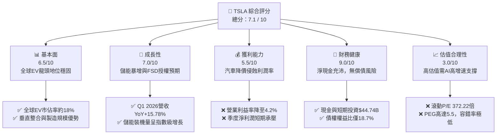

# TSLA 基本面深度分析報告

> **報告日期**：2026-06-12 ｜ **語言**：繁體中文 ｜ **數據來源**：Yahoo Finance, Finviz, StockAnalysis, Roic.ai ｜ **分析師**：CFA 級機構研究

---

## 目錄

| # | 章節 | 核心結論 |
|---|------|----------|
| 1 | [執行摘要](#1-執行摘要) | 評級：**持有（Hold / 逢低佈局）**，12個月基準目標價 **$420.00** |
| 2 | [公司概覽與商業模式](#2-公司概覽與商業模式) | 汽車毛利承壓，能源與軟體服務（FSD）正成為核心護城河與第二增長曲線 |
| 3 | [損益表深度分析](#3-損益表深度分析) | 營收重回雙位數增長（Q1 '26 YoY +15.78%），但利潤率受降價影響處於歷史低位 |
| 4 | [資產負債表分析](#4-資產負債表分析) | 淨現金高達 **$28.85B**，資產結構極其穩健，抗風險與資本擴張能力強大 |
| 5 | [現金流量深度分析](#5-現金流量深度分析) | 資本支出維持高位（TTM ~$11.28B），自由現金流轉化率因 AI 基礎建設投入而短期受壓 |
| 6 | [獲利能力與資本效率](#6-獲利能力與資本效率) | 杜邦分解顯示 ROE 降至 **4.9%** 歷史低點；當前 ROIC（7.36%）低於 WACC（12.40%），處於資本重組與價值蓄勢期 |
| 7 | [估值深度分析](#7-估值深度分析) | 滾動 P/E 達 **372.2x**，市場溢價主要來自非汽車業務（AI/Robotaxi/儲能）的期權定價 |
| 8 | [成長催化劑](#8-成長催化劑) | FSD V12 全球推廣、Megapack 產能釋放與下一代平價車型（$25,000）為三大核心動能 |
| 9 | [風險矩陣](#9-風險矩陣) | 機構級風險評估：定價權喪失、AI 落地延遲與地緣政治供應鏈風險為主要痛點 |
| 10 | [投資建議](#10-投資建議) | 提供多情境目標價、交易觸發點與關鍵監控指標，適合高風險承受度之長線成長型投資人 |

---

## 1. 執行摘要

### 1.1 核心評分儀表板



### 1.2 評分進度條視覺化

```
╔══════════════════════════════════════════════════════════════╗
║                TSLA 多維度評分儀表板 (1-10分)                 ║
╠══════════════════════════════════════════════════════════════╣
║ 基本面強度  6.5 ▓▓▓▓▓▓▓▓▓▓▓▓▓▓▓░░░░░░░  ★★★☆☆           ║
║ 成長動能    7.0 ▓▓▓▓▓▓▓▓▓▓▓▓▓▓▓▓░░░░░░  ★★★★☆           ║
║ 獲利品質    5.5 ▓▓▓▓▓▓▓▓▓▓▓▓░░░░░░░░░░  ★★★☆☆           ║
║ 財務健康    9.0 ▓▓▓▓▓▓▓▓▓▓▓▓▓▓▓▓▓▓▓▓▓░░  ★★★★★           ║
║ 估值合理性  3.0 ▓▓▓▓▓▓░░░░░░░░░░░░░░░░░░  ★☆☆☆☆           ║
