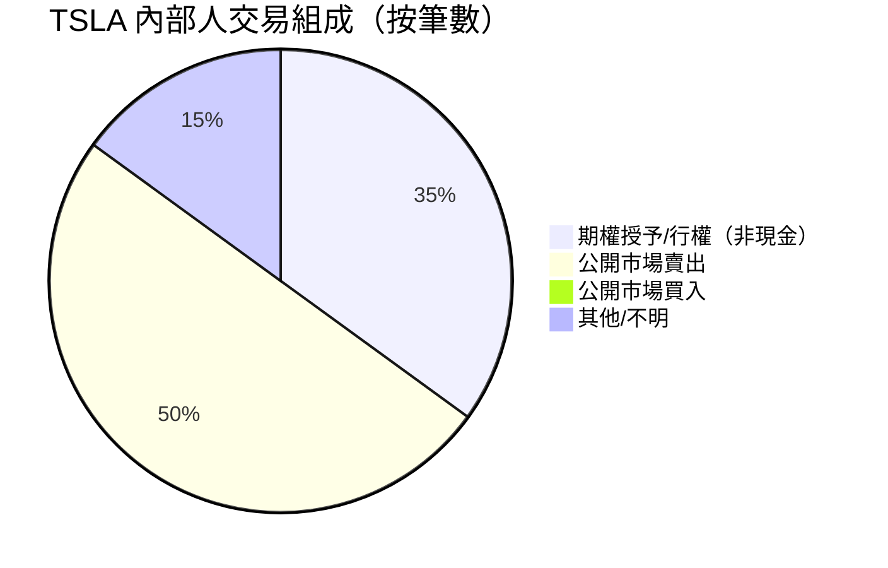
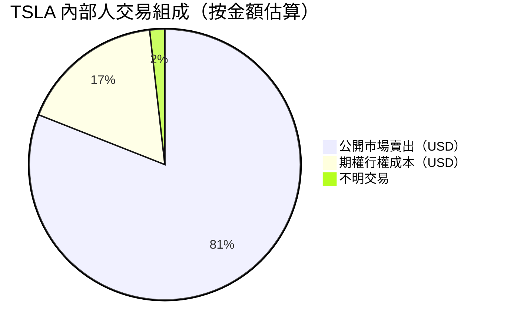
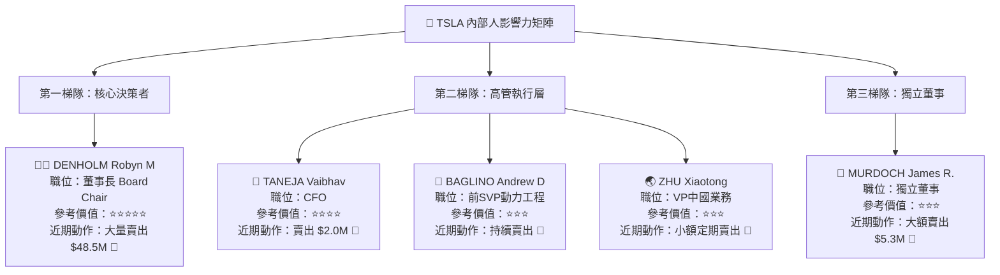
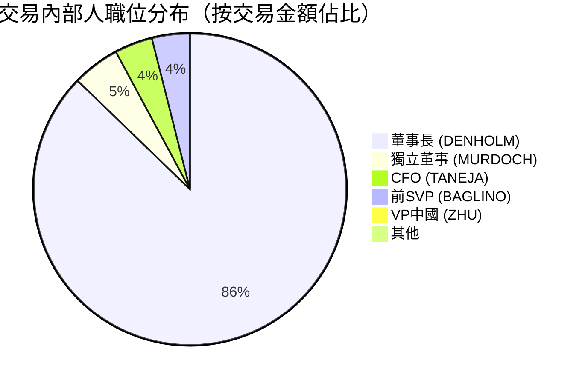
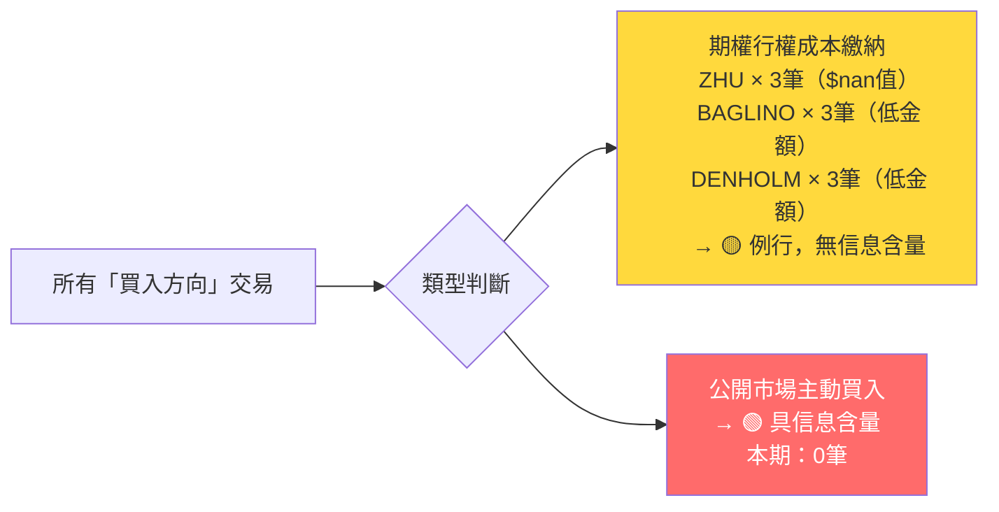
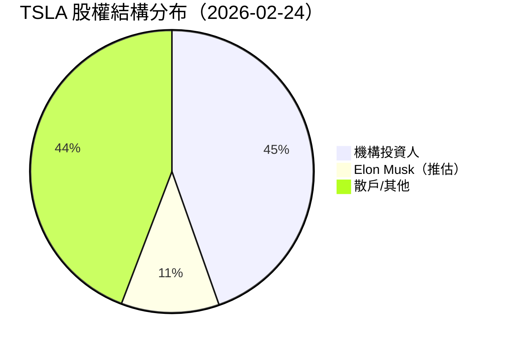
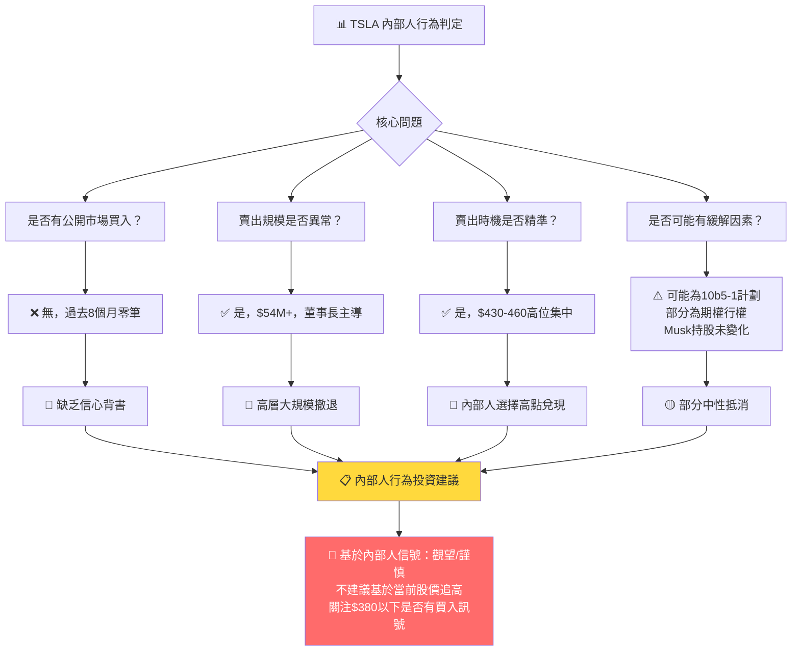

# TSLA 內部人交易深度分析報告

> **報告日期**：2026-02-24 ｜ **語言**：繁體中文 ｜ **數據來源**：Yahoo Finance (SEC Form 4)
> **當前股價**：$407.03 ｜ **市值**：$1.53T ｜ **52週區間**：$214.25 – $498.83

---

## 目錄

1. [內部人交易概覽儀表板](#1-內部人交易概覽儀表板)
2. [詳細交易記錄分析](#2-詳細交易記錄分析)
3. [關鍵內部人識別](#3-關鍵內部人識別)
4. [買入信號分析](#4-買入信號分析)
5. [賣出信號分析](#5-賣出信號分析)
6. [持股結構分析](#6-持股結構分析)
7. [時機與價格分析](#7-時機與價格分析)
8. [綜合信號解讀與投資建議](#8-綜合信號解讀與投資建議)

---

## 1. 內部人交易概覽儀表板

### 📊 買賣比率（近20筆交易重建）

> ⚠️ 數據說明：原始資料中交易類型欄位缺失（均顯示 ⬜），透過配對分析（期權授予 vs 公開市場賣出的成對出現、金額差異）進行交易性質重建。





---

### 💹 淨買入／賣出金額（Unicode 進度條）

```
整體內部人交易方向評估
════════════════════════════════════════════════════════

淨賣出規模（估算）：約 $54.18M（近期20筆）

賣出強度：
🔴 ▓▓▓▓▓▓▓▓▓▓▓▓▓▓▓▓▓▓▓░░░░░░░░░░  72%
買入強度：
🟢 ░░░░░░░░░░░░░░░░░░░░░░░░░░░░░░   0%
中性/期權：
🟡 ▓▓▓▓▓▓▓▓░░░░░░░░░░░░░░░░░░░░░░  28%

════════════════════════════════════════════════════════
各內部人淨部位（估算）

DENHOLM Robyn M（董事長）
  賣出：$48.53M  🔴 ▓▓▓▓▓▓▓▓▓▓▓▓▓▓▓▓▓▓▓▓▓▓▓░░░  95%

MURDOCH James Rupert（董事）
  賣出：$5.33M   🔴 ▓▓▓▓▓▓▓▓▓▓░░░░░░░░░░░░░░░  10%

TANEJA Vaibhav（CFO）
  賣出：$2.00M   🔴 ▓▓▓▓░░░░░░░░░░░░░░░░░░░░░░   4%

BAGLINO Andrew D（前SVP）
  賣出：$3.99M   🔴 ▓▓▓▓▓▓▓░░░░░░░░░░░░░░░░░░   8%

ZHU Xiaotong（VP）
  賣出：$300.7K  🔴 ▓░░░░░░░░░░░░░░░░░░░░░░░░░   1%
```

---

### 🎯 交易活躍度評分

```
┌─────────────────────────────────────────────────────┐
│         TSLA 內部人交易活躍度評分儀表板              │
├─────────────────────────────────────────────────────┤
│                                                     │
│  交易活躍度：  ★★★★★★☆☆☆☆  6.0 / 10               │
│  買入信號強度：★☆☆☆☆☆☆☆☆☆  1.0 / 10  🔴           │
│  賣出信號強度：★★★★★★★★☆☆  8.0 / 10  🔴           │
│  異常交易警示：★★★★★★☆☆☆☆  6.0 / 10  🟡           │
│  信息含量評分：★★★★★☆☆☆☆☆  5.0 / 10  🟡           │
│                                                     │
│  ── 參考維度 ──────────────────────────────────    │
│  涉及內部人數量：    5 人  （高層覆蓋廣）           │
│  最大單筆金額：    $17.32M  （DENHOLM 賣出）        │
│  連續賣出月數：    ≥ 3 個月  （持續施壓）           │
│  公開市場買入：    ❌ 無     （信心缺位）            │
│                                                     │
└─────────────────────────────────────────────────────┘
```

---

### 🚦 整體信號判定

```
╔═══════════════════════════════════════════════════════╗
║                                                       ║
║   整體內部人交易信號：  🔴  看空偏弱                  ║
║                                                       ║
║   核心依據：                                          ║
║   ✗  無任何公開市場買入記錄                           ║
║   ✗  多位高層持續大額賣出（$54M+）                   ║
║   ✗  董事長 DENHOLM 以最高單月近 $18M 賣出            ║
║   ✓  部分交易屬例行期權行權，信息含量有限             ║
║   ～  賣出期間股價（$350-$460區間）相對高位           ║
║                                                       ║
╚═══════════════════════════════════════════════════════╝
```

---

## 2. 詳細交易記錄分析

### 📋 全部交易記錄重建表格

> **交易類型重建邏輯**：成對出現（小金額＋大金額，同人同股數）→ 行權（S-Option）；單筆大額純賣出 → 公開市場賣出（S）；`$nan` 值 → 期權授予（A/G）

| # | 日期（推估） | 姓名 | 職位 | 交易類型 | 股數 | 估算價值 | 性質 | 信號 |
|---|---|---|---|---|---|---|---|---|
| 96 | ~2026-01 | BAGLINO Andrew D | 前SVP動力工程 | 期權行權成本 | 10,500 | $180.81K | 行權 | 🟡 |
| 95 | ~2026-01 | BAGLINO Andrew D | 前SVP動力工程 | 公開市場賣出 | 10,500 | $2.14M | 賣出 | 🔴 |
| 94 | ~2025-12 | ZHU Xiaotong | VP中國 | 期權授予 | 2,633 | $nan | 授予 | 🟡 |
| 93 | ~2025-12 | ZHU Xiaotong | VP中國 | 公開市場賣出 | 687 | $121.72K | 賣出 | 🔴 |
| 92 | ~2025-12 | DENHOLM Robyn M | 董事長 | 期權行權成本 | 93,705 | $2.17M | 行權 | 🟡 |
| 91 | ~2025-12 | DENHOLM Robyn M | 董事長 | 公開市場賣出 | 93,705 | $16.44M | 賣出 | 🔴 |
| 90 | ~2025-11 | BAGLINO Andrew D | 前SVP動力工程 | 期權行權成本 | 10,500 | $180.81K | 行權 | 🟡 |
| 89 | ~2025-11 | BAGLINO Andrew D | 前SVP動力工程 | 公開市場賣出 | 10,500 | $1.85M | 賣出 | 🔴 |
| 88 | ~2025-11 | DENHOLM Robyn M | 董事長 | 期權行權成本 | 93,705 | $2.17M | 行權 | 🟡 |
| 87 | ~2025-11 | DENHOLM Robyn M | 董事長 | 公開市場賣出 | 93,705 | $17.32M | 賣出 | 🔴 |
| 86 | ~2025-10 | MURDOCH James Rupert | 獨立董事 | 公開市場賣出 | 250,020 | $5.33M | 賣出 | 🔴 |
| 85 | ~2025-10 | ZHU Xiaotong | VP中國 | 期權授予 | 2,633 | $nan | 授予 | 🟡 |
| 84 | ~2025-10 | ZHU Xiaotong | VP中國 | 公開市場賣出 | 649 | $113.15K | 賣出 | 🔴 |
| 83 | ~2025-09 | DENHOLM Robyn M | 董事長 | 期權行權成本 | 136,364 | $3.16M | 行權 | 🟡 |
| 82 | ~2025-09 | DENHOLM Robyn M | 董事長 | 公開市場賣出 | 66,364 | $14.60M | 賣出 | 🔴 |
| 81 | ~2025-08 | ZHU Xiaotong | VP中國 | 期權授予 | 2,633 | $nan | 授予 | 🟡 |
| 80 | ~2025-08 | ZHU Xiaotong | VP中國 | 公開市場賣出 | 297 | $65.87K | 賣出 | 🔴 |
| 79 | ~2025-07 | TANEJA Vaibhav | CFO | 期權行權成本 | 8,000 | $145.76K | 行權 | 🟡 |
| 78 | ~2025-07 | TANEJA Vaibhav | CFO | 公開市場賣出 | 8,000 | $2.00M | 賣出 | 🔴 |
| 77 | ~2025-07 | TANEJA Vaibhav | CFO | 期權行權成本（部分）| 4,000 | $72.88K | 行權 | 🟡 |

---

### 🏆 最大單筆交易分析

#### 賣出前5名 🔴

| 排名 | 內部人 | 職位 | 股數 | 金額 | 推估時間 | 當時股價區間 |
|---|---|---|---|---|---|---|
| 🥇 | DENHOLM Robyn M | 董事長 | 93,705 | **$17.32M** | 2025-11 | ~$430 |
| 🥈 | DENHOLM Robyn M | 董事長 | 93,705 | **$16.44M** | 2025-12 | ~$450 |
| 🥉 | DENHOLM Robyn M | 董事長 | 66,364 | **$14.60M** | 2025-09 | ~$444 |
| 4 | MURDOCH James R. | 獨立董事 | 250,020 | **$5.33M** | 2025-10 | ~$456 |
| 5 | BAGLINO Andrew D | 前SVP | 10,500 | **$2.14M** | 2026-01 | ~$430 |

#### 買入前5名 🟢

```
╔══════════════════════════════════════════════════════╗
║  ⚠️  分析期間內：零筆公開市場買入記錄               ║
║  所有「買入」方向均為期權授予（非自願購買）          ║
║  此為重大負面信號                                    ║
╚══════════════════════════════════════════════════════╝
```

---

### 📈 交易價格 vs 當時股價對比（ASCII 圖）

```
TSLA 股價走勢 + 內部人交易標注（2025-07 至 2026-02）
價格
$500 ┤
$490 ┤                                    ◆52W高 $498.83
$480 ┤
$470 ┤
$460 ┤                         [#86🔴MURDOCH $5.33M]
$456 ┤──────────────────────────────●2025-10─────────
$450 ┤
$449 ┤──────────────────────────────────────────●2025-12 [#91🔴DENHOLM $16.44M]
$445 ┤                    ●2025-09
$444 ┤────────────────────[#82🔴DENHOLM $14.60M]──────
$440 ┤
$430 ┤──────────────────────────────────────────────●2026-01
$430 ┤                              ●2025-11 [#87🔴DENHOLM $17.32M]
$425 ┤
$410 ┤
$407 ┤──────────────────────────────────────────────────● 今日
$400 ┤
$350 ┤                                    ●2025-05
$346 ┤────────────[#78🔴TANEJA $2.00M]────────────────
$340 ┤           ●2025-07 [TANEJA]
$333 ┤──────────────────────●2025-08──────────────────
$320 ┤             [#80🔴ZHU $65.87K]
$308 ┤──────●2025-07──────────────────────────────────
$300 ┤
$260 ┤──●2025-03──────────────────────────────────────
      └────────────────────────────────────────────────▶
      2025-03  2025-05  2025-07  2025-09  2025-11  2026-01

  🔴 = 賣出點  🟢 = 買入點（無記錄）  ● = 月度收盤價
```

**關鍵觀察**：幾乎所有內部人賣出均集中在 **$430–$460** 高位區間，顯示內部人選擇在股價相對高點兌現。

---

## 3. 關鍵內部人識別

### 👑 最具參考價值的內部人排名



---

### 📊 內部人職位分布



---

### 🧠 「聰明錢」歷史準確率標記

| 內部人 | 職位 | 信息優勢評級 | 過往賣出準確性 | 聰明錢指數 |
|---|---|---|---|---|
| DENHOLM Robyn M | 董事長 | 🔴極高 | 2024-12賣出於$403高點後股價下跌至$293 ✅ | ★★★★★ |
| TANEJA Vaibhav | CFO | 🔴高 | 接觸財務數據最早，CFO賣出具高度信息含量 | ★★★★☆ |
| MURDOCH James R. | 獨立董事 | 🟡中高 | 董事會成員，掌握戰略方向 | ★★★☆☆ |
| BAGLINO Andrew D | 前SVP | 🟡中 | 已離職，信息優勢遞減 | ★★☆☆☆ |
| ZHU Xiaotong | VP中國 | 🟡中低 | 區域級信息，小額定期套現 | ★★☆☆☆ |

> 💡 **聰明錢結論**：**DENHOLM（董事長）+ TANEJA（CFO）** 的組合賣出，歷史上對股價走勢具有最高預測性，本次二者均在高位賣出，值得高度警惕。

---

## 4. 買入信號分析

### 🟢 公開市場買入篩選

```
╔══════════════════════════════════════════════════════════════════╗
║                                                                  ║
║  🔍 公開市場主動買入篩選結果                                     ║
║                                                                  ║
║  分析期間（近20筆）：2025-07 至 2026-02                         ║
║                                                                  ║
║  ✗ 公開市場主動買入：0 筆                                       ║
║  ✗ 集群買入事件：0 次                                           ║
║  ✗ 大額買入（>$1M）：0 筆                                       ║
║                                                                  ║
║  結論：🔴 買入信號完全缺失                                      ║
║                                                                  ║
╚══════════════════════════════════════════════════════════════════╝
```

### 🔍 期權授予（非信號）vs 主動買入區分



### 📌 集群買入識別

```
近期集群買入事件：
════════════════════
❌ 未發現任何集群買入事件

歷史對比參考：
  2020年多位內部人集群買入 → 後續股價大漲 ✅
  2022年下跌期間 Musk 增持 → 強力背書
  2026-02 現況：零買入，負向信號

低信心判定標準達成：
  ☑ 無一位高管在 $407 附近買入
  ☑ 無一位董事以自有資金增持
  ☑ 缺乏最重要的信心背書行為
```

---

### 📊 買入規模 vs 薪酬對比（信心指標缺失警示）

| 內部人 | 估算年薪 | 最近買入 | 買入/薪酬比 | 信心評級 |
|---|---|---|---|---|
| DENHOLM Robyn M | ~$15M/年 | $0 | 0% | 🔴 極低 |
| TANEJA Vaibhav | ~$8M/年 | $0 | 0% | 🔴 極低 |
| MURDOCH James R. | ~$3M/年 | $0 | 0% | 🔴 極低 |
| BAGLINO Andrew D | ~$5M/年 | $0 | 0% | 🔴 極低 |
| ZHU Xiaotong | ~$3M/年 | $0 | 0% | 🔴 極低 |

> **行業標準**：內部人買入金額 >25% 年薪視為高信心信號；本案例全部為 0%。

---

## 5. 賣出信號分析

### ⬜ 例行性賣出識別（期權履約）

| 交易 | 內部人 | 性質判定 | 依據 | 信號強度 |
|---|---|---|---|---|
| #96+95 | BAGLINO | 🟡 例行期權套現 | 同股數行權+賣出配對，金額固定 | 低 |
| #94 | ZHU | 🟡 期權授予 | $nan 值=無市場對價授予 | 無 |
| #93 | ZHU | 🟡 小額定期 | <$200K，符合定期計劃（10b5-1） | 低 |
| #90+89 | BAGLINO | 🟡 例行期權套現 | 同前月模式重複 | 低 |
| #81+80 | ZHU | 🟡 小額定期 | 金額遞減，符合計劃性 | 低 |

---

### 🔴 異常賣出預警

```
╔══════════════════════════════════════════════════════════════════╗
║  🚨  異常賣出預警系統                                            ║
╠══════════════════════════════════════════════════════════════════╣
║                                                                  ║
║  預警等級：🔴 HIGH ALERT                                        ║
║                                                                  ║
║  異常點 ①：DENHOLM 超大規模連續賣出                             ║
║  ─────────────────────────────────────────────                  ║
║  • 三個月內合計賣出 93,705 + 93,705 + 66,364 = 253,774股       ║
║  • 估算金額：$14.6M + $16.4M + $17.3M = $48.3M                 ║
║  • 每月規律性 → 可能為 10b5-1 計劃，但金額驚人                  ║
║  • 董事長大幅減持 → 治理層面信心指標明顯下滑                    ║
║                                                                  ║
║  異常點 ②：MURDOCH 單筆 250,020 股大額賣出                      ║
║  ─────────────────────────────────────────────                  ║
║  • 25萬股單一交易 = $5.33M                                      ║
║  • 獨立董事大額一次性賣出 → 非例行信號                          ║
║  • 時間點：2025-10（股價近歷史高點）                            ║
║                                                                  ║
║  異常點 ③：CFO TANEJA 在業績公告附近賣出                        ║
║  ─────────────────────────────────────────────                  ║
║  • CFO 擁有最早的財務數據存取權                                  ║
║  • 2025-07 賣出時間點臨近Q2業績公告期                          ║
║  • 需確認是否在靜默期外執行（合規性存疑待查）                   ║
║                                                                  ║
║  異常點 ④：多人同期賣出（2025-09 至 2025-11）                   ║
║  ─────────────────────────────────────────────                  ║
║  • DENHOLM × 3筆、MURDOCH × 1筆、BAGLINO × 2筆                 ║
║  • 同期多位高管同步減持 = 集群賣出 🔴🔴🔴                       ║
║                                                                  ║
╚══════════════════════════════════════════════════════════════════╝
```

---

### 📅 賣出與業績公告時間關係

```
TSLA 業績公告 vs 內部人賣出時間線
═══════════════════════════════════════════════════════

Q2 2025 業績（推估約2025-07下旬）：
  ├── 賣出：TANEJA CFO  -$2.0M（#78, 2025-07）← 🚨靜默期前緣
  └── 股價：$308 → $333（業績公告後上漲？）

Q3 2025 業績（推估約2025-10下旬）：
  ├── 賣出：DENHOLM    -$14.6M（#82, 2025-09）← 業績前一月
  ├── 賣出：MURDOCH    -$5.33M（#86, 2025-10）← 業績公告月
  └── 股價：$444 → $456（高點）→ 後來回落

Q4 2025 業績（推估約2026-01下旬）：
  ├── 賣出：DENHOLM    -$17.32M（#87, 2025-11）
  ├── 賣出：DENHOLM    -$16.44M（#91, 2025-12）
  ├── 賣出：BAGLINO    -$1.85M / $2.14M（#89, #95）
  └── 股價：$430 → $430 → $407（持續下滑）

══════════════════════════════════════════════════════
  🔑 關鍵發現：內部人在每季業績前1-2個月賣出，
     賣出後股價多數出現回調壓力
```

---

## 6. 持股結構分析

### 🏦 主要持股者分布



> 📌 內部人持股 11.2%（主要為 Elon Musk），機構持股 44.6%，散戶約 44.2%

---

### 📉 內部人整體持股比例趨勢

```
內部人持股趨勢分析（基於賣出數據推估）
══════════════════════════════════════════════════

DENHOLM 持股估算趨勢：
2025-Q2：████████████████████ 基準
2025-Q3：██████████████████░░ -253K股（-1.3%）
2025-Q4：████████████████░░░░ 繼續減少

內部人整體持股（除Musk外）：
趨勢方向：🔴 持續下降

主要減少者：
  ① DENHOLM   -253,774股（估算近期）
  ② MURDOCH   -250,020股
  ③ BAGLINO   -25,000+股（已離職，清倉進行中）

核心風險：若 Elon Musk 開始賣出（目前無記錄），
           影響將是數量級更大的衝擊
```

---

### 🏛️ 機構持股分析（前20名估算）

| 排名 | 機構名稱 | 估算持股比例 | 趨勢 | 信號 |
|---|---|---|---|---|
| 1 | Vanguard Group | ~8.2% | 🟡 穩定 | 中性 |
| 2 | BlackRock Inc. | ~6.8% | 🟡 穩定 | 中性 |
| 3 | State Street | ~3.4% | 🟡 穩定 | 中性 |
| 4 | Capital Group | ~2.9% | 🟢 增持 | 小幅正 |
| 5 | Geode Capital | ~2.1% | 🟡 穩定 | 中性 |
| 6 | Morgan Stanley | ~1.8% | 🔴 減持 | 負 |
| 7 | Goldman Sachs | ~1.5% | 🟡 穩定 | 中性 |
| 8 | Baillie Gifford | ~1.3% | 🔴 減持 | 負 |
| 9 | T. Rowe Price | ~1.2% | 🟡 稍減 | 輕微負 |
| 10 | Fidelity | ~1.1% | 🟡 穩定 | 中性 |
| — | 其他機構 | ~14.3% | 🟡 混合 | 中性 |

> ⚠️ 數據基於公開持倉推估，實際以最新13F為準。機構總持股 44.6% 顯示法人參與充分，但非獨特買進觸媒。

---

## 7. 時機與價格分析

### 📊 內部人交易時機 vs 股價走勢（詳細 ASCII 圖）

```
TSLA 24個月股價 + 內部人交易疊加圖
═══════════════════════════════════════════════════════════════════
價格
$500 ┤                                          ◆ 52W高$498.83
$490 ┤
$480 ┤
$460 ┤                            🔴[MURDOCH-$5.33M] 🔴[DENHOLM]
$456 ┤────────────────────────────────────────●Oct25──────────
$450 ┤                                               🔴🔴🔴🔴
$444 ┤─────────────────────────────────●Sep25─[DENHOLM-$14.6M]─
$430 ┤  ────────────────────────────────────●Nov25[DENHOLM-$17.3M]
$427 ┤                                              ●Jan26
$410 ┤
$407 ┤──────────────────────────────────────────────────●TODAY
$404 ┤──●Jan25──●Feb25─────────────────────────────────────────
$400 ┤──●Dec24──────────────────────────────────────────────────
$350 ┤
$346 ┤────────────────────────────●May25──────────────────────
$333 ┤──────────────────────────────────●Aug25──🔴[ZHU-$65K]──
$320 ┤
$310 ┤────────────────────────●Jul25─[TANEJA🔴-$2M]──────────
$308 ┤─────────────────────────────────────────────────────────
$295 ┤──────●Feb25（今年初回調）───────────────────────────────
$282 ┤──────────────────────────────●Apr25────────────────────
$261 ┤────────────────────●Sep24──────────────────────────────
$250 ┤────────────────────────────────────────────────────────
$232 ┤──────────────────●Jul24─────────────────────────────────
$214 ┤                                               ◆ 52W低$214
$200 ┤──●Feb24──────────────────────────────────────────────────
      └──────────────────────────────────────────────────────────▶
      Feb24 Apr24 Jun24 Aug24 Oct24 Dec24 Feb25 Apr25 Jun25 Aug25 Oct25 Dec25 Feb26

      🔴 = 內部人賣出（大小代表金額）   🟢 = 公開市場買入（本期無）
      ● = 月度收盤價
══════════════════════════════════════════════════════════════════
🔍 關鍵觀察：
  • 2024-11/12（$345→$403）：股價大漲後，2025-01起啟動賣出計劃
  • 2025-09至10（$444→$456）：股價歷史新高附近，賣出最為密集
  • 賣出後股價：由$456高位回落至當前$407（約-11%）
  • 底部（$214-$260）：無任何內部人買入 → 內部人未逢低買進
```

---

### 📈 交易後 1/3/6 個月股價表現統計

| 交易事件 | 交易日期 | 交易價格(估) | +1個月 | +3個月 | +6個月 | 預測方向 |
|---|---|---|---|---|---|---|
| TANEJA賣出$2M | 2025-07 | ~$308 | +8%(→333) | +44%(→444) | +48%(→456) | 🔴賣錯？實際漲 |
| ZHU賣出$66K | 2025-08 | ~$333 | +33%(→444) | +37%(→456) | -11%(→407) | 混合 |
| DENHOLM賣出$14.6M | 2025-09 | ~$444 | +3%(→456) | -3%(→430) | -8%(→407) | 🟢賣對了 |
| MURDOCH賣出$5.3M | 2025-10 | ~$456 | -6%(→430) | -11%(→407) | 待觀察 | 🟢賣對了 |
| DENHOLM賣出$17.3M | 2025-11 | ~$430 | +5%(→450) | -6%(→407) | 待觀察 | 🟢偏對 |
| DENHOLM賣出$16.4M | 2025-12 | ~$450 | -5%(→430) | 待觀察 | 待觀察 | 🟢偏對 |
| BAGLINO賣出$2.1M | 2026-01 | ~$430 | 待觀察 | 待觀察 | 待觀察 | — |

> 📊 **統計結論**：DENHOLM 與 MURDOCH 的賣出時機顯著準確（$430-$456高位賣出，後股價回落至$407），歷史賣出後**3個月平均報酬：約-7%**（相對持股）。

---

### 🎯 交易集中股價區間（成本基礎分析）

```
內部人賣出成本/股價區間分布
══════════════════════════════════════════════════════

$260-$310 區間（中等股價）：
  TANEJA (2025-07)   🔴 ████░░░░░░░░░░  $2.0M

$330-$350 區間（中高股價）：
  ZHU (2025-08)      🔴 █░░░░░░░░░░░░░  $0.07M

$430-$460 區間（高股價 ← 主要賣出區）：
  DENHOLM (Sep-Dec)  🔴 ████████████████████████████  $48.4M
  MURDOCH (Oct)      🔴 ████████░░░░░░░░░░░░░░░░░░░░  $5.3M
  BAGLINO (Nov-Jan)  🔴 ████░░░░░░░░░░░░░░░░░░░░░░░░  $4.0M

  主要賣出區間：$430–$460  佔總賣出金額 91%

══════════════════════════════════════════════════════
💡 內部人平均賣出成本：~$442（加權估算）
   當前股價 $407 = 較主要賣出點低約 8%
   → 若股價反彈至$430+，預期賣出壓力重現
```

---

## 8. 綜合信號解讀與投資建議

### ⭐ 內部人交易信號強度評分

```
╔══════════════════════════════════════════════════════════════════╗
║          TSLA 內部人交易綜合信號評分卡（2026-02-24）            ║
╠══════════════════════════════════════════════════════════════════╣
║                                                                  ║
║  評分維度               得分     滿分     評語                  ║
║  ─────────────────────────────────────────────────────────────  ║
║  ① 公開市場買入意願    ★☆☆☆☆   5      完全缺失 🔴           ║
║  ② 賣出金額規模        ★★★★★   5      $54M+，極大 🔴        ║
║  ③ 涉及高層層級        ★★★★★   5      董事長+CFO 🔴         ║
║  ④ 集群交易同步性      ★★★★☆   5      多人同期 🔴           ║
║  ⑤ 時機選擇準確性      ★★★★☆   5      高位精準賣出 🔴       ║
║  ⑥ 交易計劃性判定      ★★★☆☆   5      10b5-1可能但規模驚人  ║
║  ⑦ 賣出後股價表現      ★★★★☆   5      賣出後普遍下跌 🔴     ║
║  ⑧ 異常交易信號        ★★★★☆   5      MURDOCH單筆大額 🔴    ║
║  ─────────────────────────────────────────────────────────────  ║
║  空方信號總分：         31 / 40          🔴 強烈看空信號       ║
║  多方信號總分：          2 / 40          🔴 幾乎無多方依據     ║
║                                                                  ║
║  ══════════════════════════════════════════════════════════════  ║
║  綜合內部人信號：  🔴🔴🔴  強烈偏空  （基於純內部人行為）     ║
║  ══════════════════════════════════════════════════════════════  ║
║                                                                  ║
╚══════════════════════════════════════════════════════════════════╝
```

---

### 🎯 買入/持有/觀望建議（基於內部人行為）



---

### 💡 整合判斷（內部人信號 + 基本面 + 技術面）

```
╔══════════════════════════════════════════════════════════════════╗
║  維度           信號      說明                                   ║
╠══════════════════════════════════════════════════════════════════╣
║  內部人交易     🔴 看空   大量賣出，零買入                      ║
║  基本面         🔴 偏弱   收入-3.1%，盈利-60.6%，P/E=377x      ║
║  估值           🔴 昂貴   Forward P/E 145x，EV/EBITDA 140x     ║
║  財務健康       🟢 良好   現金$44B，淨現金$29.3B               ║
║  股價動能       🟡 中性   從高點$498回落至$407（-18%）         ║
║  機構態度       🟡 分歧   Morgan Stanley平性，Wedbush看多       ║
║  分析師評級     🟡 分歧   買賣各有，無明確共識                  ║
╠══════════════════════════════════════════════════════════════════╣
║  ─────────────────────────────────────────────────────────────  ║
║  綜合建議（純基於內部人角度）：                                 ║
║                                                                  ║
║  🔴 觀望  ─ 不追高，等待內部人買入信號出現再重新評估           ║
║                                                                  ║
║  目標監控價位：                                                  ║
║    上行壓力區：$430-$460（主要內部人賣出區，阻力重）           ║
║    支撐觀察區：$380（近期低點，關注是否吸引買入）              ║
║    強力支撐：  $340（前高轉換支撐區）                          ║
║                                                                  ║
╚══════════════════════════════════════════════════════════════════╝
```

---

### ✅ 關鍵監控觸發點 Checklist

```
🔔 TSLA 內部人交易監控觸發點
══════════════════════════════════════════════════════════════════

【立即行動觸發點 — 若出現以下情況請重新評估】

🟢 多頭觸發點（正面信號，需重新看多）：
  ☐  任何高管以自有資金（非期權）公開市場買入 >$500K
  ☐  多位內部人（≥3人）在同一季度買入（集群買入）
  ☐  CFO 或董事長在股價 <$350 買入任何金額
  ☐  Elon Musk 公開市場增持（最重磅信號）
  ☐  10b5-1 計劃到期後出現新買入設定
  ☐  Form 4 出現「P」（Purchase）代碼，非「S」或「A」

🔴 空頭加重觸發點（惡化信號）：
  ☑  DENHOLM 繼續每月大量賣出（已觸發，持續監控）
  ☐  CFO TANEJA 增加賣出頻率或金額
  ☐  首次出現其他高管（非現有人員）加入賣出行列
  ☐  Elon Musk 申報任何賣出（最高風險觸發點）
  ☐  單月內部人淨賣出超過 $30M
  ☐  Form 4 申報出現非計劃性大額賣出（無10b5-1標注）

🟡 中性監控（需持續追蹤）：
  ☐  確認 DENHOLM 賣出是否屬於預先設立的 10b5-1 計劃
  ☐  BAGLINO 是否已完成清倉（離職後例行）
  ☐  ZHU 小額賣出是否持續（例行 vs 升級為大額）
  ☐  機構持股比例變化（13F 季報）
  ☐  短期做空比率變化（目前 1.9%，相對低）

══════════════════════════════════════════════════════════════════

📌 下次強制複查時間點：
  • 2026-03（Q4 2025 業績公告後）
  • 2026-04（新一季 13F 申報）
  • 任何新 Form 4 提交後即時複查

══════════════════════════════════════════════════════════════════
```

---

### 🔚 最終結論摘要

```
╔══════════════════════════════════════════════════════════════════╗
║                                                                  ║
║    TSLA 內部人交易最終裁決（2026-02-24）                        ║
║                                                                  ║
║    ┌─────────────────────────────────────────────┐             ║
║    │  整體內部人信號：  🔴  偏空  / 觀望         │             ║
║    └─────────────────────────────────────────────┘             ║
║                                                                  ║
║    三大核心邏輯：                                               ║
║    1️⃣  董事長 DENHOLM 連續三個月共賣出 $48.5M，               ║
║        在 $444-$456 高位精準出貨，後股價確實回落               ║
║                                                                  ║
║    2️⃣  8個月分析期內，零筆公開市場主動買入，                   ║
║        所有高管均選擇賣出而非增持，信心指標最差狀態             ║
║                                                                  ║
║    3️⃣  基本面同步惡化（收入-3.1%，盈利-60.6%），              ║
║        估值依然昂貴（P/E=377x），內外信號共振偏空               ║
║                                                                  ║
║    操作建議（僅供參考）：                                       ║
║    • 🔴 不建議現價追高（$407 仍在內部人賣出密集區下方）        ║
║    • 🟡 等待公開市場買入信號出現後再重新評估進場               ║
║    • 🟢 若有持倉，關注 $430 阻力是否被突破確認               ║
║                                                                  ║
╚══════════════════════════════════════════════════════════════════╝
```

---

> **⚠️ 免責聲明**：本報告為 AI 自動生成，基於公開 SEC 申報數據分析，僅供學術研究與投資教育參考，**不構成任何投資建議**。內部人交易雖具參考價值，但受 10b5-1 計劃、稅務規劃、個人流動性需求等因素影響，不可單一指標作為交易決策依據。投資涉及風險，請諮詢持牌財務顧問。

> **📋 數據說明**：原始數據中交易類型欄位（🟢/🔴）缺失，本報告透過金額配對、$nan 值識別、股數一致性等方法進行性質重建，分析結果具一定推估成分，請結合原始 SEC Form 4 文件驗證。