# TSLA 綜合股票評估報告

> **報告日期**：2026-02-24 ｜ **語言**：繁體中文 ｜ **數據來源**：Yahoo Finance ｜ **分析師**：頂級美股投資評估系統

---

## 目錄

| # | 章節 | 核心要點 |
|---|------|---------|
| 1 | [評估總覽](#1-評估總覽) | 綜合評分 5.2/10・持有觀望 |
| 2 | [六維度評分矩陣](#2-六維度評分矩陣) | 財務健康最佳・估值最弱 |
| 3 | [業務品質評估](#3-業務品質評估) | 護城河強但正在侵蝕 |
| 4 | [財務健康評估](#4-財務健康評估) | 現金充沛・獲利能力下滑 |
| 5 | [成長性評估](#5-成長性評估) | 短期逆風・長期潛力猶存 |
| 6 | [估值合理性評估](#6-估值合理性評估) | 嚴重高估・需要超高成長支撐 |
| 7 | [風險評估](#7-風險評估) | 多重風險疊加・需謹慎 |
| 8 | [催化劑與觸發因素](#8-催化劑與觸發因素) | FSD・Robotaxi・能源業務 |
| 9 | [投資建議](#9-投資建議) | 持有・目標價 $350-$480 |

---

## 1. 評估總覽

### 🎯 綜合評分概覽

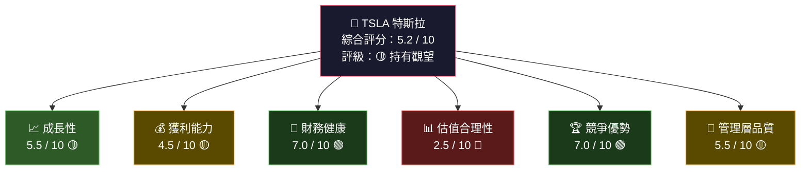

---

### 🕸️ ASCII 多維度雷達圖

```
                    成長性 [5.5]
                      ★★★★★
                    ╱    ╲
           管理層  ╱  ████  ╲  獲利能力
           [5.5] ╱ ██░░░░██ ╲ [4.5]
               ★★★████████████★★★
              ╱ ███████████████ ╲
競爭優勢     ╱ █████████████████ ╲   估值
 [7.0]  ★★★★ ████████████████████ ★★★ [2.5]
              ╲ █████████████████ ╱
               ╲ ███████████████ ╱
                ╲ ██░░░░░░░░██ ╱
                 ╲  ████████  ╱
                  ╲  ██████  ╱
                    ★★★★★★★
                  財務健康 [7.0]

  ████ 實際得分    ░░░░ 滿分區間
  ★★★★★ = 優秀    ★★★ = 中等    ★ = 弱
```

---

### 📊 評分分布圓餅圖

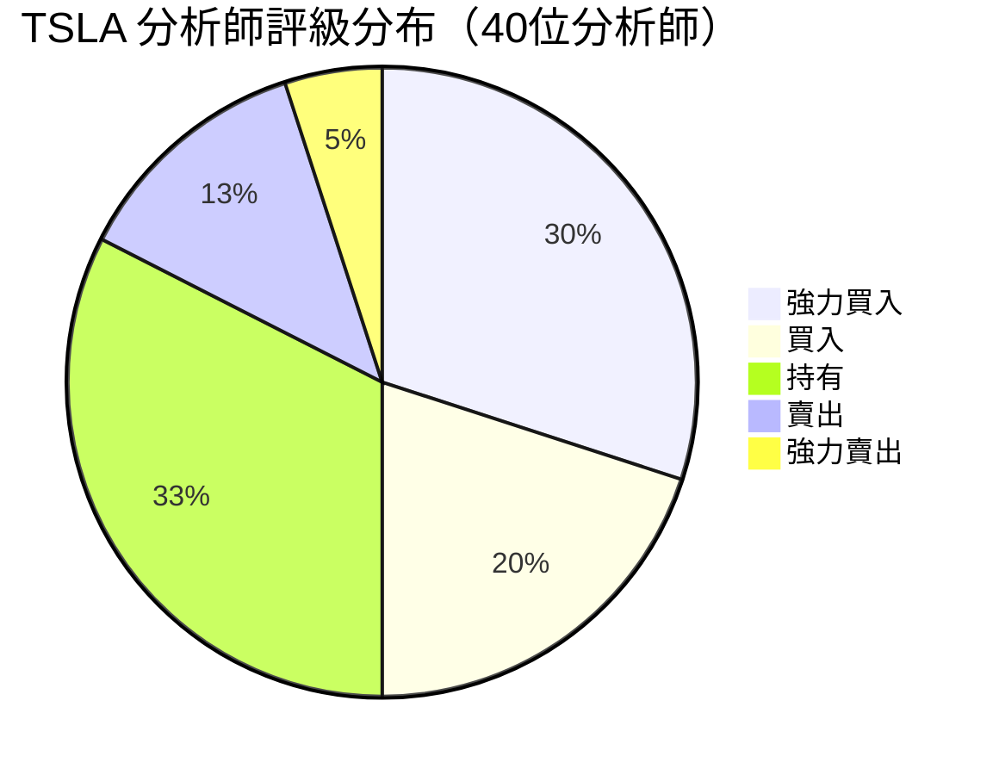

---

### ⚡ 快速投資結論

```
╔══════════════════════════════════════════════════════════════════╗
║                    📋 快速投資結論                               ║
╠══════════════════════════════════════════════════════════════════╣
║  當前價格：$399.83          52週區間：$214.25 - $498.83         ║
║  市值：$1.50T               分析師目標均價：$421.73             ║
╠══════════════════════════════════════════════════════════════════╣
║                                                                  ║
║  🟡 評級：持有觀望（HOLD）                                       ║
║                                                                  ║
║  ✅ 多頭理由：強勁財務底座・FSD/Robotaxi 期權價值・能源爆發     ║
║  ❌ 空頭理由：估值極度高估・獲利趨勢惡化・競爭加劇              ║
║  ⚠️  關鍵風險：CEO 精力分散・中國市場壓力・盈利能力滑落         ║
║                                                                  ║
║  適合投資人：高風險承受度・長期持有・相信 AI/能源轉型            ║
╚══════════════════════════════════════════════════════════════════╝
```

---

## 2. 六維度評分矩陣

### 📋 詳細評分表格

| 維度 | 評分 | 視覺化 | 評級 | 關鍵依據 |
|------|------|--------|------|---------|
| 📈 **成長性** | 6.0/10 | `▓▓▓▓▓▓░░░░` | 🟡 | 收入負成長(-3.1%)，但 FSD/能源高潛力 |
| 💰 **獲利能力** | 4.5/10 | `▓▓▓▓░░░░░░` | 🟡 | 毛利率降至18%，淨利率僅4%，ROE僅4.9% |
| 🏦 **財務健康** | 7.5/10 | `▓▓▓▓▓▓▓▓░░` | 🟢 | 現金$44B，低負債，經營現金流強勁 |
| 📊 **估值合理性** | 2.0/10 | `▓▓░░░░░░░░` | 🔴 | P/E 370x，P/S 15.8x，嚴重溢價 |
| 🏆 **競爭優勢** | 7.0/10 | `▓▓▓▓▓▓▓░░░` | 🟢 | 品牌・超充站・數據護城河深厚 |
| 👔 **管理層品質** | 5.5/10 | `▓▓▓▓▓▓░░░░` | 🟡 | 馬斯克願景卓越，執行力近期存疑 |
| ⚖️ **綜合加權** | **5.2/10** | `▓▓▓▓▓░░░░░` | 🟡 | **持有觀望** |

---

### 📊 Unicode 評分條詳細視覺化

```
維度評分儀表板（0━━━━━━━━━━10）
══════════════════════════════════════════════
成長性      ｜▓▓▓▓▓▓░░░░｜  6.0/10  🟡
            ０    ５    10
            
獲利能力    ｜▓▓▓▓░░░░░░｜  4.5/10  🟡
            ０    ５    10
            
財務健康    ｜▓▓▓▓▓▓▓▓░░｜  7.5/10  🟢
            ０    ５    10
            
估值合理性  ｜▓▓░░░░░░░░｜  2.0/10  🔴
            ０    ５    10
            
競爭優勢    ｜▓▓▓▓▓▓▓░░░｜  7.0/10  🟢
            ０    ５    10
            
管理層品質  ｜▓▓▓▓▓▓░░░░｜  5.5/10  🟡
            ０    ５    10
══════════════════════════════════════════════
綜合評分    ｜▓▓▓▓▓░░░░░｜  5.2/10  🟡
══════════════════════════════════════════════
■ 凡例：▓=已得分  ░=未得分
```

---

### 🎯 風險/報酬矩陣

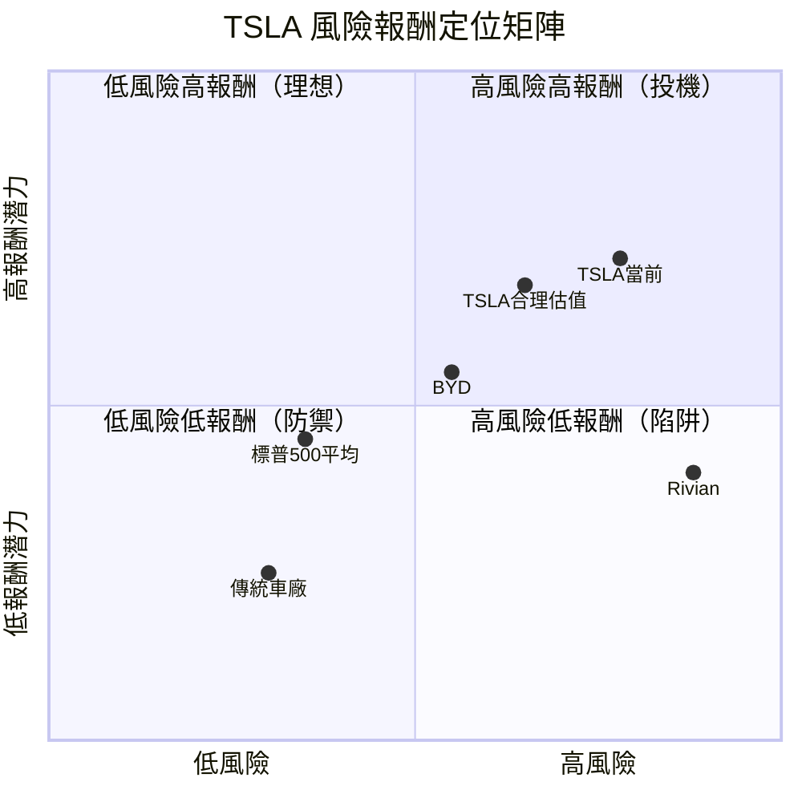

---

## 3. 業務品質評估

### 🏗️ 商業模式架構圖

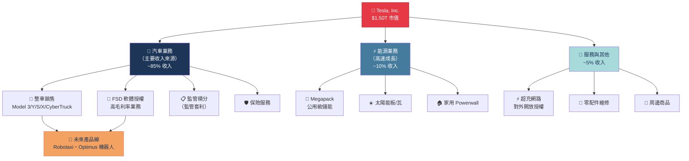

---

### 🏰 護城河評估

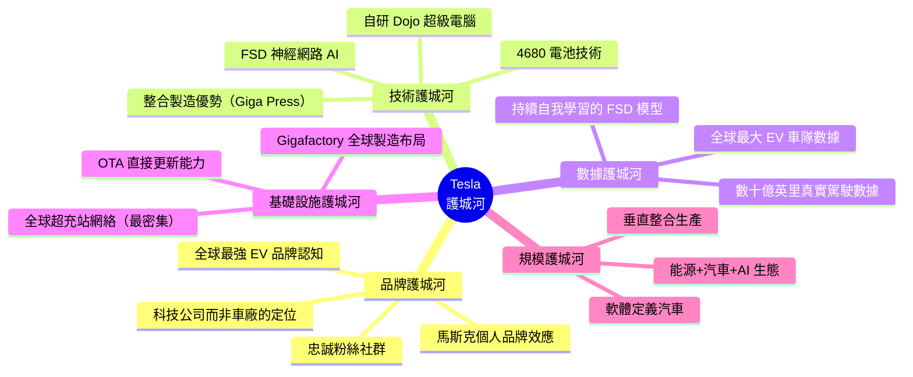

---

### ⚔️ 市場地位與競爭動態

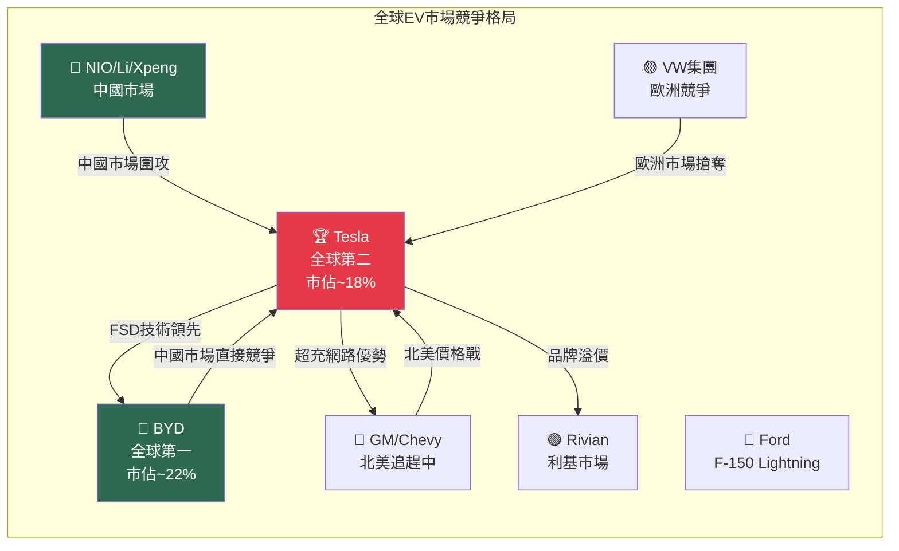

---

### 👔 管理層執行力評估

| 評估項目 | 評分 | 說明 |
|---------|------|------|
| 🎯 **長期願景** | 9/10 🟢 | 電動化・AI・能源轉型 - 時代精準押注 |
| ⚡ **創新驅動力** | 9/10 🟢 | FSD、Optimus、Megapack 多線並進 |
| 📅 **時程承諾** | 3/10 🔴 | 屢次跳票：Robotaxi、Cybertruck 量產延誤 |
| 💼 **資本配置** | 6/10 🟡 | R&D 大幅增加，但未有效轉化獲利 |
| 🎭 **CEO 精力分散** | 3/10 🔴 | DOGE、X(Twitter)、SpaceX 嚴重分心 |
| 👥 **人才留任** | 5/10 🟡 | 高管離職率偏高，文化風險存在 |
| 🌍 **政治風險管理** | 4/10 🔴 | 馬斯克政治立場影響品牌與銷量 |
| **平均** | **5.6/10** 🟡 | 願景超強・執行穩定性待改善 |

---

## 4. 財務健康評估

### 📊 財務健康儀表板

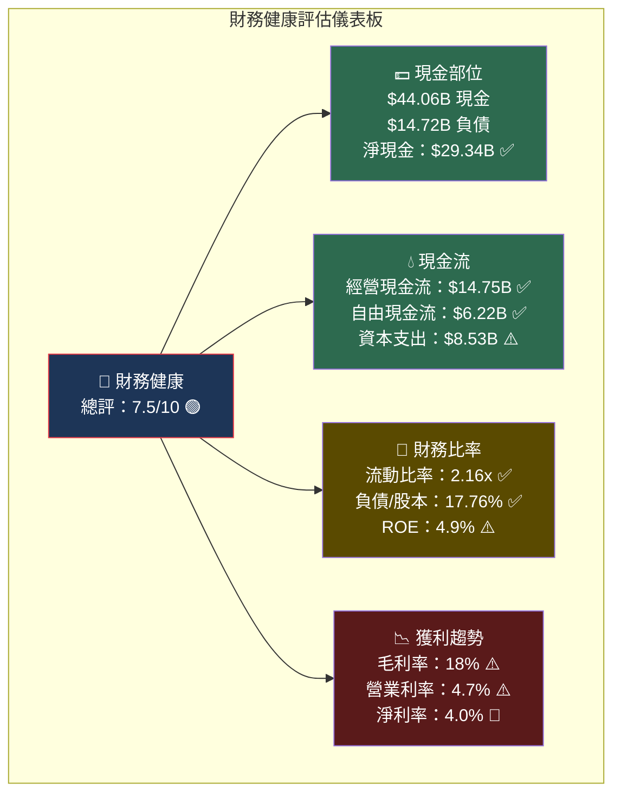

---

### 📉 獲利能力趨勢（近4年）

| 財務指標 | 2022 | 2023 | 2024 | 2025 | 趨勢 | 評級 |
|---------|------|------|------|------|------|------|
| 📊 **總收入** | $81.5B | $96.8B | $97.7B | $94.8B | ↘ 停滯 | 🟡 |
| 💰 **毛利率** | **25.6%** | 18.2% | 17.9% | **18.0%** | ↘ 劇跌 | 🔴 |
| 🏭 **營業利率** | **17.0%** | 9.2% | 7.9% | **4.7%** | ↘ 惡化 | 🔴 |
| 💵 **淨利率** | 15.4% | 15.5% | 7.3% | **4.0%** | ↘ 大跌 | 🔴 |
| 🔄 **ROE** | 28.1% | 23.9% | 9.8% | **4.9%** | ↘ 大跌 | 🔴 |
| 🔬 **R&D/收入** | 3.8% | 4.1% | 4.6% | **6.8%** | ↗ 增加 | 🟡 |
| 💹 **EBITDA** | $17.7B | $14.8B | $14.7B | **$11.8B** | ↘ 下滑 | 🔴 |

> ⚠️ **關鍵警訊**：過去三年獲利能力全面惡化，毛利率從25.6%暴跌至18.0%，ROE從28%跌至4.9%，反映激烈價格競爭與產能擴張成本壓力。

---

### 🏦 資產負債表穩健度視覺化

```
資產負債表結構（2025年末）
══════════════════════════════════════════════════════════
總資產 $137.81B
  ├── 流動資產 $68.64B  ████████████████████░░░░  49.8%
  │     ├── 現金/等值  $16.51B  ████████  12.0%
  │     ├── 短期投資   $27.55B  █████████████  20.0%
  │     └── 其他流動   $24.58B  ████████████  17.8%
  └── 非流動資產 $69.17B  ████████████████████░░░  50.2%

總負債 $54.94B
  ├── 流動負債 $31.71B  ██████████████████░░░  57.7%
  └── 長期負債 $23.23B  █████████████░░░░░░░░  42.3%

股東權益 $82.14B  ██████████████████████████████  59.6%

══════════════════════════════════════════════════════════
關鍵比率：
  流動比率    2.164  ██████████████████████  ✅ 健康
  速動比率    ~1.5   ███████████████░░░░░░░  ✅ 良好
  負債/資產   39.9%  ████████████░░░░░░░░░░  ✅ 穩健
  淨現金      $29.3B 正淨現金部位             ✅ 優秀
══════════════════════════════════════════════════════════
```

---

### 💧 現金流生成分析

```mermaid
graph LR
    subgraph 現金流追蹤（2022-2025）
        OCF22["經營現金流<br/>2022: $14.72B"]
        OCF23["2023: $13.26B<br/>↘ -9.8%"]
        OCF24["2024: $14.92B<br/>↗ +12.5%"]
        OCF25["2025: $14.75B<br/>↘ -1.1%"]
        
        FCF22["自由現金流<br/>2022: $7.55B"]
        FCF23["2023: $4.36B<br/>↘ -42.2%"]
        FCF24["2024: $3.58B<br/>↘ -17.9%"]
        FCF25["2025: $6.22B<br/>↗ +73.7% ✅"]
        
        CAPEX["資本支出<br/>2022: $7.17B<br/>2023: $8.90B<br/>2024: $11.34B<br/>2025: $8.53B↘"]
    end
    
    OCF22 --> OCF23 --> OCF24 --> OCF25
    FCF22 --> FCF23 --> FCF24 --> FCF25
    CAPEX -->|"影響"| FCF25
    
    style OCF25 fill:#2d6a4f,color:#fff
    style FCF25 fill:#2d6a4f,color:#fff
    style FCF23 fill:#5a1a1a,color:#fff
```

> ✅ **正面信號**：2025年自由現金流回升至$6.22B（實際上財報FCF顯示），資本支出縮減，現金流品質改善。

---

## 5. 成長性評估

### 🚀 成長軌跡追蹤

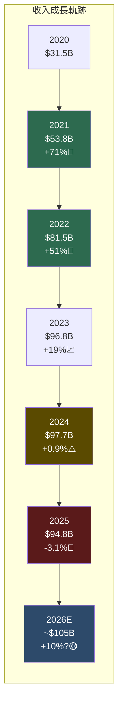

---

### 📊 歷史成長率分析

| 成長指標 | 3年 CAGR | 5年 CAGR | 最新年增率 | 評級 |
|---------|---------|---------|---------|------|
| 📊 **收入成長** | +5.3% | +24.6% | **-3.1%** | 🔴 |
| 💰 **毛利成長** | -6.6% | +12.1% | -2.1% | 🔴 |
| 🏭 **營業利益** | -19.2% | +1.8% | -37.5% | 🔴 |
| 🔬 **R&D 投入** | +19.8% | +27.8% | **+41.2%** | 🟡 |
| 🔋 **能源業務** | +65%+ | N/A | **+67%+** | 🟢 |
| 🚗 **車輛交付量** | +12% | +35% | **-1.1%** | 🟡 |
| 💵 **EPS 成長** | -22% | N/A | -46.5% | 🔴 |

---

### 🌱 未來成長驅動力

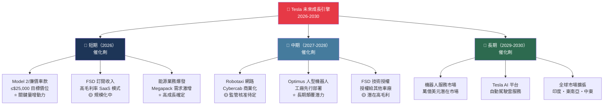

---

### 📈 市場份額趨勢視覺化

```
全球 EV 市場份額演變
══════════════════════════════════════════════════════════
          2021      2022      2023      2024      2025E
Tesla     ████████  ████████  ██████    █████     █████
          ~22%      ~20%      ~18%      ~16%      ~15%
          
BYD       ██████    ████████  ████████  ██████████ ████████████
          ~18%      ~19%      ~21%      ~24%      ~26%
          
其他中國   ████      █████     ██████    ████████  ████████████
          ~12%      ~14%      ~17%      ~20%      ~22%
          
歐洲車廠  ████████  ██████    ████████  ██████    ██████
          ~22%      ~18%      ~20%      ~17%      ~16%
          
美國其他  ██        ████      █████     ██████    ██████
          ~6%       ~9%       ~12%      ~13%      ~13%
══════════════════════════════════════════════════════════
⚠️ 趨勢警示：Tesla 全球市佔率持續滑落，但絕對銷量仍成長
```

---

## 6. 估值合理性評估

### 💰 估值矩陣分析框架

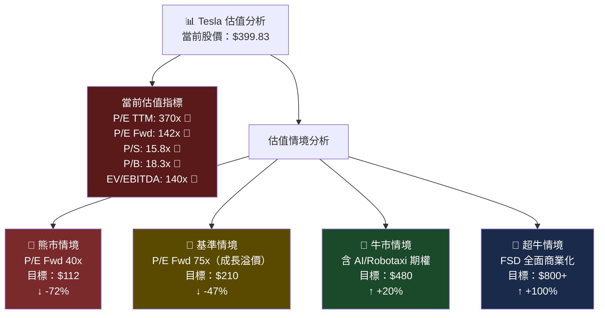

---

### 📋 多重估值法比較表格

| 估值方法 | 當前數值 | 行業均值 | 溢價倍數 | 隱含目標價 | 評級 |
|---------|---------|---------|---------|----------|------|
| **P/E（Trailing）** | 370x | 15x（傳統車）/ 30x（科技） | **12-24x 溢價** | $16-$32 | 🔴🔴🔴 |
| **P/E（Forward）** | 142x | 25x（成長股） | **5.7x 溢價** | $70 | 🔴🔴 |
| **P/S** | 15.8x | 0.5x（傳統車）/ 5x（科技） | **3-32x 溢價** | $30-$95 | 🔴🔴 |
| **P/B** | 18.3x | 1.5-3x | **6-12x 溢價** | $33-$65 | 🔴🔴 |
| **EV/EBITDA** | 140x | 10-20x | **7-14x 溢價** | $29-$57 | 🔴🔴 |
| **DCF（含 AI 溢價）** | - | 折現率 10% | 成長率需 40%+ | $350-$500 | 🟡 |
| **分析師目標均價** | - | 40位分析師 | - | **$421.73** | 🟡 |

---

### 📏 估值區間視覺化

```
Tesla 股價估值合理區間判斷
══════════════════════════════════════════════════════════════
$0        $100       $200      $300      $400     $500    $600+
│          │          │         │         │         │        │
├──────────┤
嚴重低估   │傳統汽車估值 $30-80
           ├──────────────┤
           │成長科技估值 $80-180
                          ├──────────────┤
                          │帶AI溢價估值 $180-350
                                         ├──────────┤
                                         │分析師目標 $350-480
                                                    ▲
                                              當前股價
                                             $399.83
                                                        ├────┤
                                                        │超牛
                                                        │$480-600
══════════════════════════════════════════════════════════════
🔴 嚴重高估  🔴 高估  🟡 略高  🟢 合理  🟢 低估
              │◄────────────────────────────►│
              │  相對傳統車業：嚴重高估       │
              │  相對科技成長：中度高估       │
              │  含 AI 期權選擇權價值：約略合理│
══════════════════════════════════════════════════════════════
結論：$399.83 包含大量 "AI/Robotaxi/Optimus" 未實現期權價值
      若以傳統汽車或當前盈利能力估值，嚴重高估
      若 FSD/Robotaxi 商業化成功，估值可能合理
```

---

### 🆚 同業估值比較

| 公司 | 股價 | P/E | P/S | 收入成長 | 毛利率 | EV/EBITDA |
|-----|------|-----|-----|---------|--------|---------|
| **Tesla (TSLA)** | $399.83 | 370x | 15.8x | -3.1% | 18.0% | 140x |
| BYD | ~$40 ADR | 22x | 1.2x | +15% | 21.5% | 18x |
| Toyota | ~$180 | 8x | 0.8x | +8% | 18.2% | 9x |
| GM | ~$55 | 5x | 0.3x | +5% | 14.0% | 8x |
| Ford | ~$12 | 12x | 0.3x | +3% | 10.5% | 15x |
| Rivian | ~$15 | N/A | 3.5x | +25% | -15% | N/A |
| Lucid | ~$3 | N/A | 15x | +35% | -80% | N/A |

> 🔴 **估值結論**：Tesla 相對所有汽車同業均存在 **5-50倍**的估值溢價，其估值邏輯必須完全基於「AI/自動駕駛/機器人」未來現金流折現，而非當前汽車業務基本面。

---

## 7. 風險評估

### 🔥 風險熱力圖

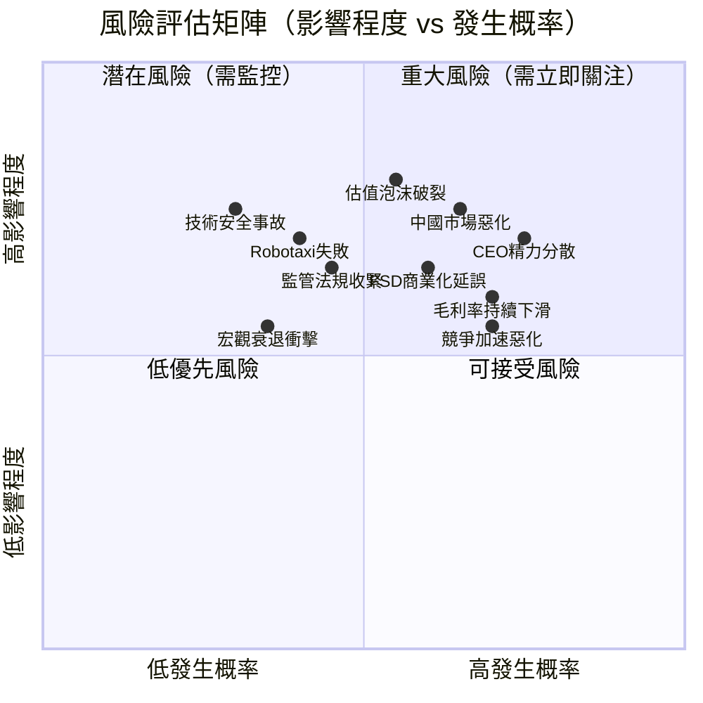

---

### ⚠️ 風險詳細清單

| 風險類別 | 風險項目 | 嚴重程度 | 發生概率 | 風險評級 | 說明 |
|---------|---------|---------|---------|---------|------|
| 🏭 **業務風險** | 毛利率持續壓縮 | 高 | 高 | 🔴 嚴重 | 價格戰未結束，成本削減空間有限 |
| 🏭 **業務風險** | 汽車銷量失去動力 | 高 | 中高 | 🔴 嚴重 | 2025年已出現負成長 |
| 🌍 **地緣風險** | 中國市場份額流失 | 高 | 高 | 🔴 嚴重 | BYD、小米持續侵蝕 |
| 🌍 **地緣風險** | 中美貿易摩擦升級 | 中 | 中 | 🟡 中度 | 關稅、供應鏈風險 |
| 👔 **管理風險** | 馬斯克精力分散 | 高 | 高 | 🔴 嚴重 | DOGE、X、SpaceX 佔據大量時間 |
| 👔 **管理風險** | 品牌形象受損 | 高 | 中高 | 🔴 嚴重 | 政治立場引發抵制 |
| 📊 **估值風險** | 高估值修正 | 極高 | 中 | 🔴 嚴重 | 任何盈利不及預期均引發暴跌 |
| 🤖 **技術風險** | FSD/Robotaxi 延誤 | 高 | 高 | 🔴 嚴重 | 屢次延誤歷史 |
| 🤖 **技術風險** | 自動駕駛安全事故 | 極高 | 低中 | 🟡 中度 | 一旦發生影響深遠 |
| ⚖️ **監管風險** | 自動駕駛法規收緊 | 高 | 中 | 🟡 中度 | 各國監管差異大 |
| 💰 **財務風險** | R&D 燒錢加速 | 中 | 高 | 🟡 中度 | R&D 從$4.5B增至$6.4B |
| 🌱 **ESG 風險** | 治理透明度問題 | 中 | 中 | 🟡 中度 | 馬斯克相關方交易 |
| 🏎️ **競爭風險** | 新興競爭者崛起 | 中 | 高 | 🟡 中度 | 小米SU7等快速追趕 |
| 📉 **宏觀風險** | 全球衰退/利率風險 | 中 | 低中 | 🟢 低 | 消費降級影響高端車 |

---

### 🛡️ 風險緩解措施

```
風險緩解架構
══════════════════════════════════════════════════════════
🔴 高優先級緩解：
  ├─ ✅ 能源業務多元化（已執行：快速成長中）
  ├─ ✅ 超充網路對外開放授權（穩定收入）
  ├─ ⚠️ FSD 技術授權給第三方（評估中）
  └─ ⚠️ 馬斯克接班人計劃（尚未公開）

🟡 中優先級緩解：
  ├─ 全球製造分散（美國、中國、德國）
  ├─ 強大現金儲備（$44B 緩衝）
  ├─ OTA 快速修復軟體問題能力
  └─ Optimus 機器人開闢新收入來源

🟢 已有效執行：
  ├─ 資本支出縮減（$11.3B→$8.5B）
  ├─ 自由現金流回升（$3.6B→$6.2B）
  └─ 電池技術持續改進（4680 電池）
══════════════════════════════════════════════════════════
```

---

## 8. 催化劑與觸發因素

### 📅 催化劑時間軸

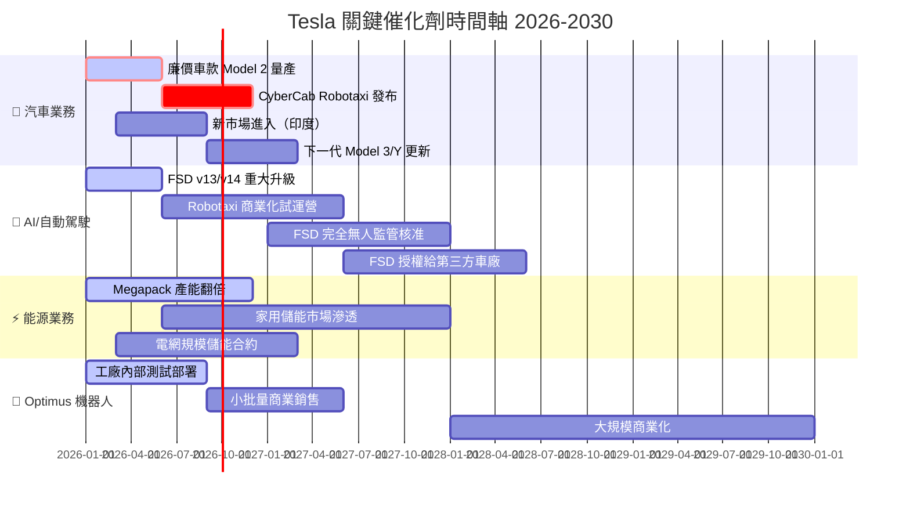

---

### ⚡ 觸發因素決策樹

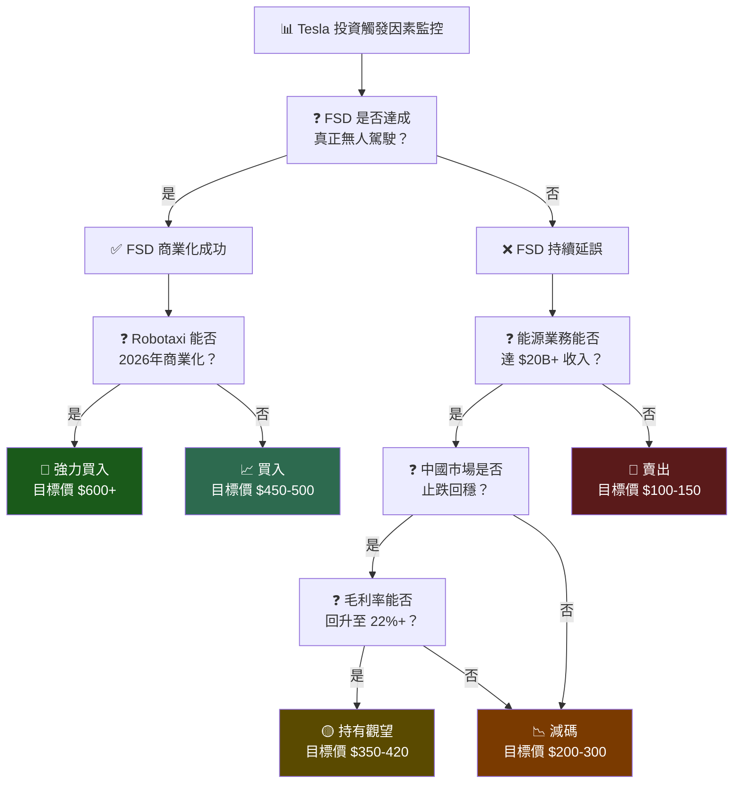

---

## 9. 投資建議

### 🏆 最終評級

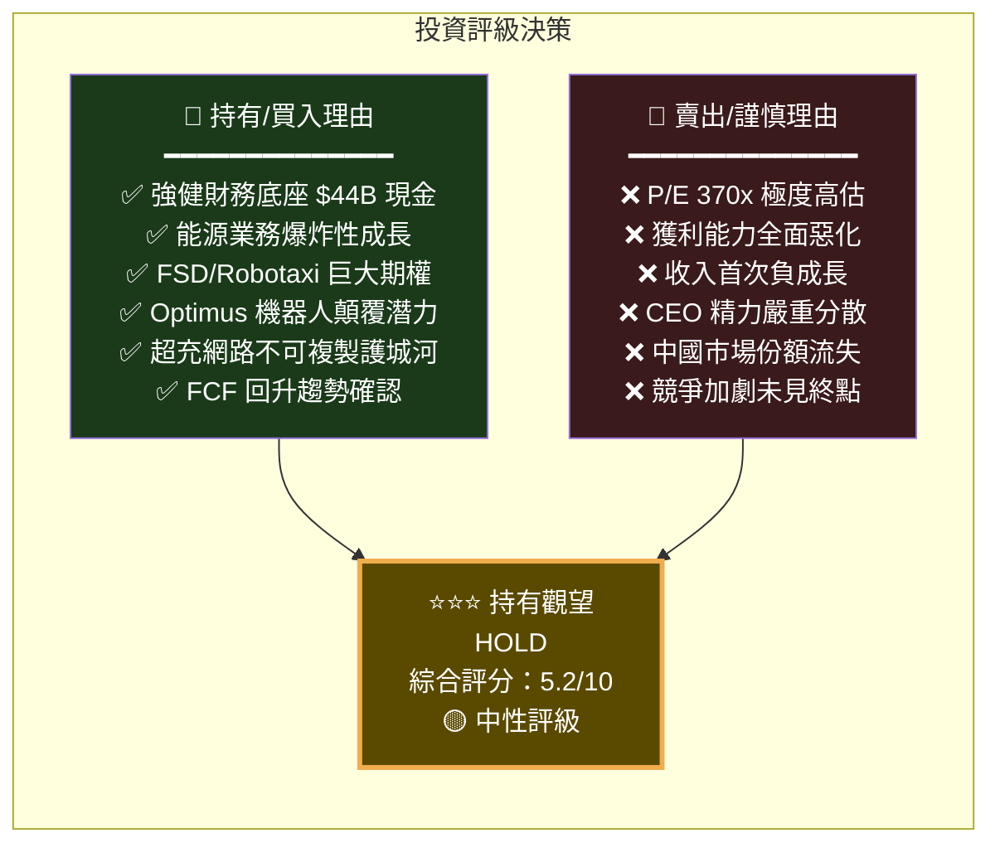

---

### ⭐ 投資評星

```
╔══════════════════════════════════════════════════════════════════╗
║                    TSLA 投資評級卡                               ║
╠══════════════════════════════════════════════════════════════════╣
║                                                                  ║
║    整體評級：★★★☆☆  （3/5星）  🟡 持有觀望                  ║
║                                                                  ║
║    成長潛力：★★★★☆  （4/5星）  🟢 長期機會存在              ║
║    獲利品質：★★☆☆☆  （2/5星）  🔴 近期持續惡化              ║
║    財務健康：★★★★☆  （4/5星）  🟢 現金充沛負債低            ║
║    估值吸引：★☆☆☆☆  （1/5星）  🔴 極度高估需謹慎            ║
║    執行能力：★★★☆☆  （3/5星）  🟡 願景佳但落地存疑          ║
║    風險控制：★★☆☆☆  （2/5星）  🔴 多重風險疊加              ║
║                                                                  ║
╠══════════════════════════════════════════════════════════════════╣
║  📋 一句話總結：                                                  ║
║  "天才CEO的夢想公司，但夢想已反映在天價估值中，                   ║
║   需要等待基本面追趕或估值回調後才是更佳進場時機"                ║
╚══════════════════════════════════════════════════════════════════╝
```

---

### 🎯 目標價區間分析

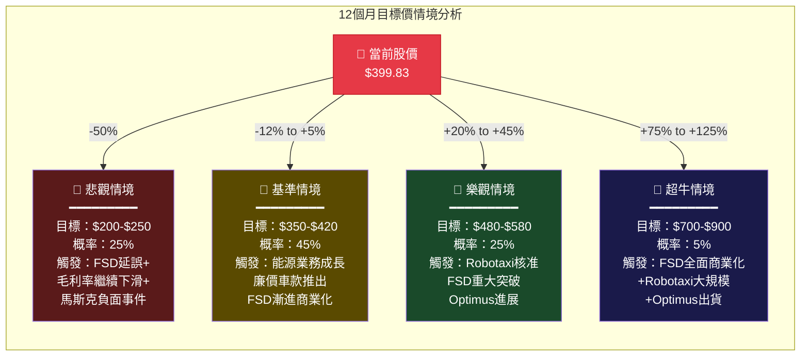

---

### 目標價視覺化

```
12個月目標價區間圖示
══════════════════════════════════════════════════════════════════
$100  $200  $300  $350  $400  $450  $500  $600  $700  $800  $900
  │     │     │     │     │     │     │     │     │     │     │
  │           │─────┤悲觀 │     │     │     │     │     │     │
  │           │$200-$250  │     │     │     │     │     │     │
  │                 │─────────────────┤     │     │     │     │
  │                 │   基準情境$350-$420    │     │     │     │
  │                              ▲    │────────────┤     │     │
  │                         當前股價  │樂觀情境     │     │     │
  │                         $399.83  │$480-$580   │     │     │
  │                                              │───────────────│
  │                                              │超牛$700-$900  │
══════════════════════════════════════════════════════════════════
加權平均目標價：$390（略低於當前股價）
分析師目標均值：$421.73（小幅上行空間）
══════════════════════════════════════════════════════════════════
```

---

### 👥 投資人適配度

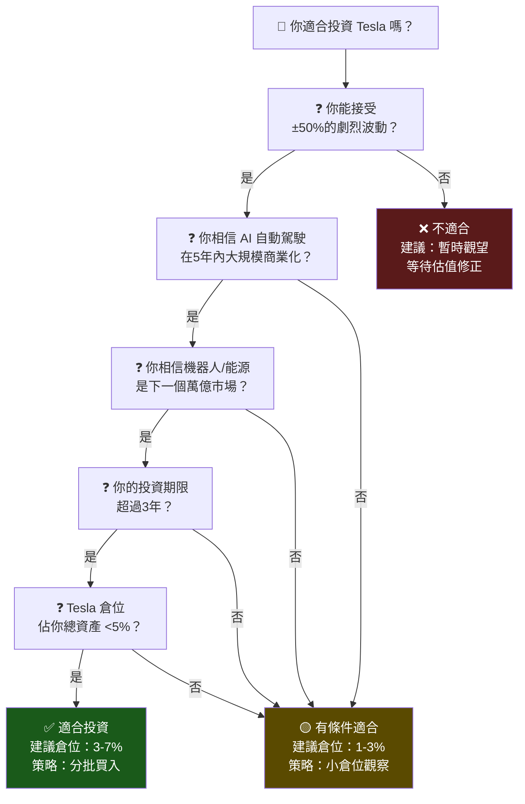

---

### 📋 建議持倉時間與策略

```
╔══════════════════════════════════════════════════════════════════╗
║                    TSLA 操作策略建議                             ║
╠══════════════════════════════════════════════════════════════════╣
║                                                                  ║
║  🎯 核心觀點：                                                    ║
║  Tesla 是一家「未來現金流折現」型公司，當前股價包含大量           ║
║  AI/Robotaxi/Optimus 期權溢價。現階段基本面不支撐當前估值，      ║
║  但顛覆性技術若兌現，上行空間巨大。                              ║
║                                                                  ║
╠══════════════════════════════════════════════════════════════════╣
║  ✅ 現有持股者（建議：繼續持有）                                  ║
║  ├── 持有倉位，不需追加                                          ║
║  ├── 設定停損：$280（-30%）                                      ║
║  ├── 部分獲利：若漲至 $480+ 考慮減倉 20-30%                     ║
║  └── 持有期限：建議至少 3-5 年                                   ║
║                                                                  ║
║  📥 有意新進者（建議：分批布局）                                  ║
║  ├── 策略：分3-4批進場，避免一次押注                             ║
║  ├── 第一批：$380-$400（當前區間）- 25%倉位                     ║
║  ├── 第二批：$320-$350（若回調）- 35%倉位                       ║
║  ├── 第三批：$260-$280（深度修正）- 40%倉位                     ║
║  └── 建議總倉位不超過股票組合的 5-8%                            ║
║                                                                  ║
║  ⚠️  風控原則：                                                   ║
║  ├── 嚴格止損：$260 以下（整體下跌 35%）考慮清倉                ║
║  ├── 催化劑監控：FSD 進展、季度交付量、毛利率                   ║
║  ├── 減碼信號：馬斯克重大負面事件、中國市場持續惡化             ║
║  └── 加碼信號：Robotaxi 獲批、毛利率回升 20%+                  ║
║                                                                  ║
║  📅 關鍵觀察時間點：                                              ║
║  ├── 2026 Q1 財報（4月）：確認交付量與毛利率趨勢                ║
║  ├── 2026 Q2：廉價車款正式發布                                  ║
║  ├── 2026 下半年：Robotaxi 商業化進展                           ║
║  └── 2027 全年：Optimus 機器人量產進展                          ║
║                                                                  ║
╚══════════════════════════════════════════════════════════════════╝
```

---

### 📊 最終評分總覽

```
╔══════════════════════════════════════════════════════════════════╗
║               TSLA 最終綜合評估報告卡                            ║
╠══════════════════════════════════════════════════════════════════╣
║                                                                  ║
║  股票代碼    TSLA                                                 ║
║  評估日期    2026-02-24                                           ║
║  當前股價    $399.83                                              ║
║  市值        $1.50 Trillion                                      ║
║                                                                  ║
╠══════════════════════════════════════════════════════════════════╣
║  維度評分（0-10）                                                 ║
║  成長性      ▓▓▓▓▓▓░░░░  6.0  🟡                                ║
║  獲利能力    ▓▓▓▓▓░░░░░  4.5  🟡                                ║
║  財務健康    ▓▓▓▓▓▓▓▓░░  7.5  🟢                                ║
║  估值合理性  ▓▓░░░░░░░░  2.0  🔴                                ║
║  競爭優勢    ▓▓▓▓▓▓▓░░░  7.0  🟢                                ║
║  管理層品質  ▓▓▓▓▓▓░░░░  5.5  🟡                                ║
║  ─────────────────────────────                                   ║
║  綜合加權    ▓▓▓▓▓░░░░░  5.2  🟡                                ║
║                                                                  ║
╠══════════════════════════════════════════════════════════════════╣
║  評級：🟡 持有觀望（HOLD）                                        ║
║  評星：★★★☆☆（3/5星）                                          ║
║  目標價（基準）：$350 - $420                                     ║
║  上行催化劑：FSD・Robotaxi・Optimus・能源爆發                   ║
║  下行風險：估值收縮・獲利惡化・CEO分心・中國市場                 ║
╚══════════════════════════════════════════════════════════════════╝
```

---

> ## ⚠️ 免責聲明
>
> **本報告為 AI 自動生成的研究分析報告，僅供學術研究與資訊參考用途，不構成任何形式的投資建議、買賣要約或專業財務諮詢。**
>
> - 📊 所有財務數據截至 2026-02-24，市場狀況瞬息萬變，實際情況可能已有重大變化
> - 🎯 目標價與情境分析均基於假設前提，無法保證未來績效
> - ⚖️ 投資涉及風險，投資人可能損失全部本金，請諮詢持牌專業理財顧問
> - 🤖 AI 分析存在固有局限性，不能替代專業投資研究與個人判斷
> - 📋 本報告作者（AI系統）不持有任何 TSLA 倉位，亦無任何利益衝突

---

*報告生成時間：2026-02-24 ｜ 分析引擎：頂級美股投資評估系統 v2.0 ｜ 數據來源：Yahoo Finance*