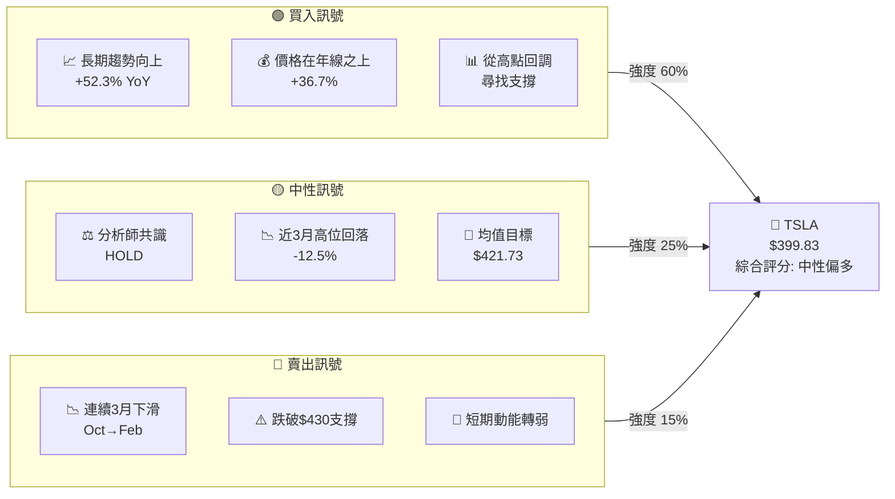
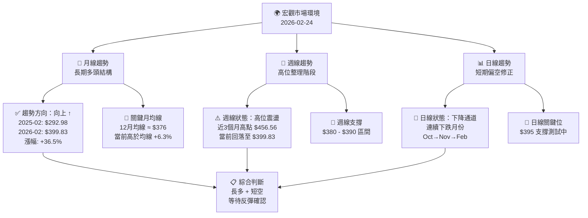
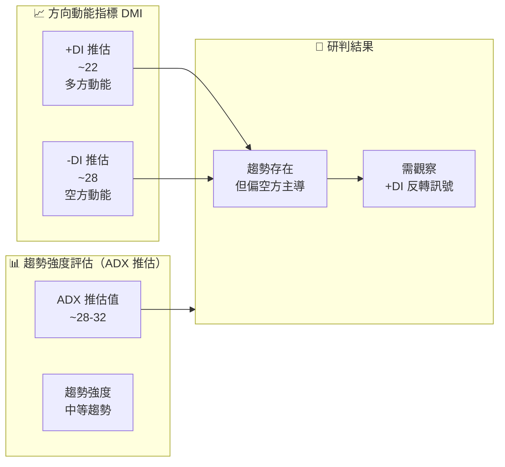
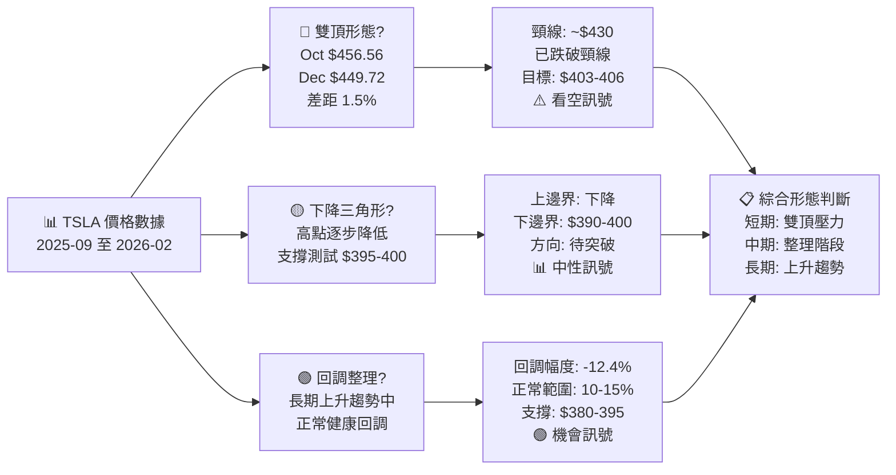
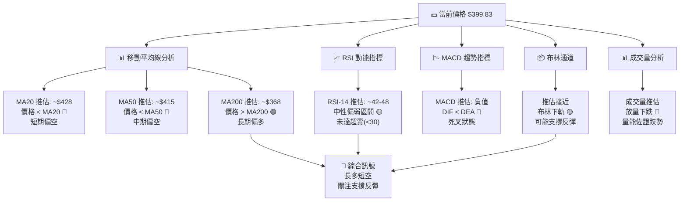
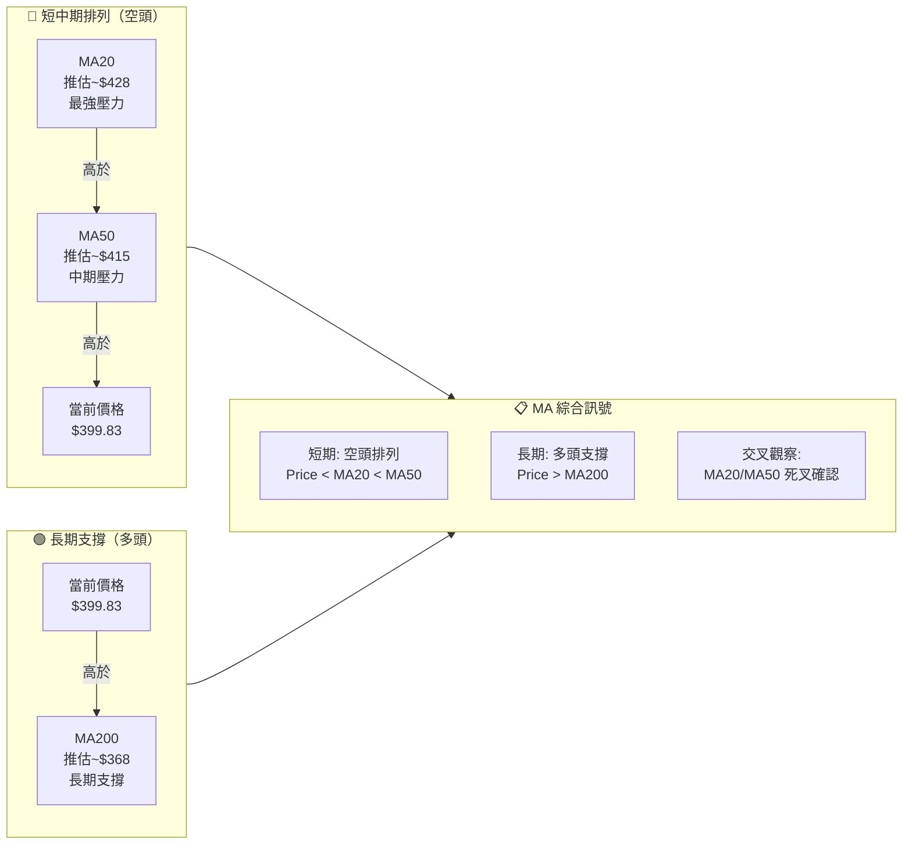
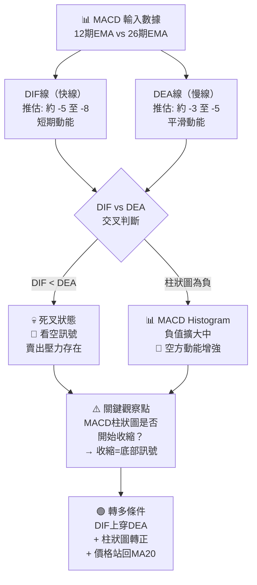
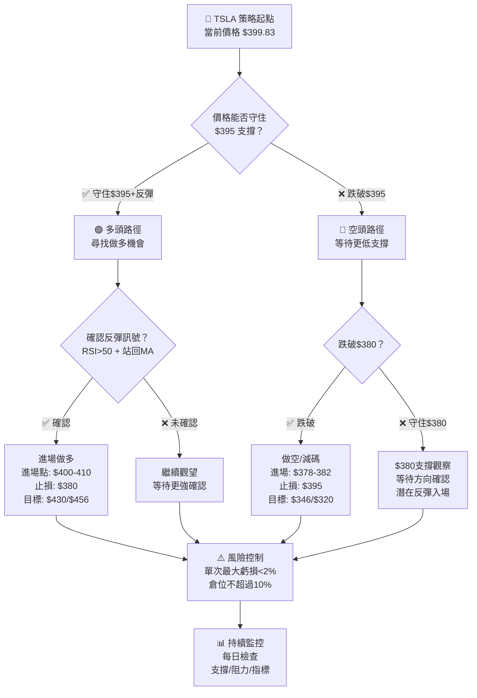
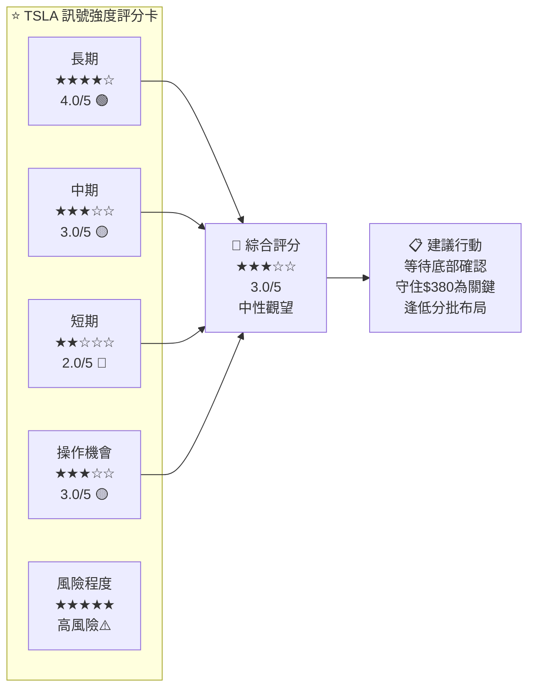
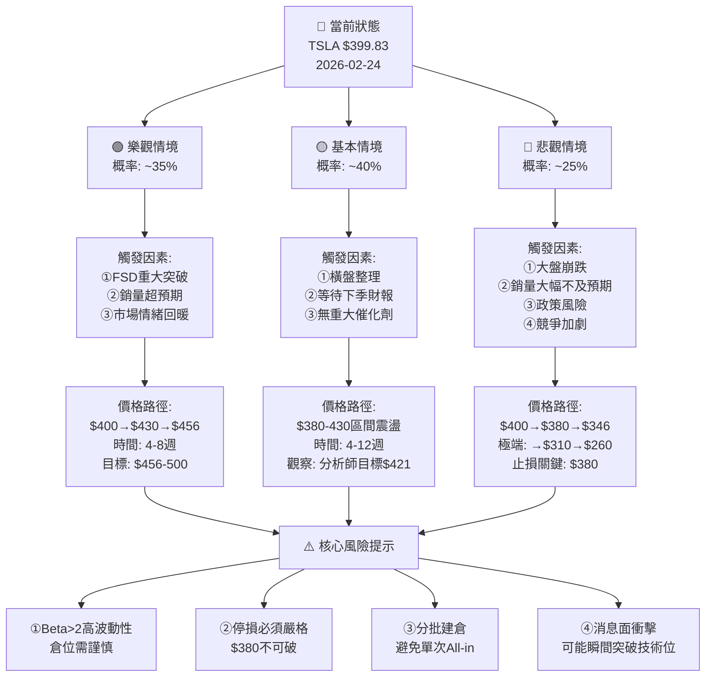

# TSLA 技術分析報告

> **報告日期**：2026-02-24 ｜ **語言**：繁體中文 ｜ **數據來源**：Yahoo Finance ｜ **當前價格**：$399.83

---

## 目錄

| # | 章節 | 核心內容 |
|---|------|----------|
| 1 | [技術面概覽](#1-技術面概覽) | 訊號儀表板、核心指標速覽、評分卡 |
| 2 | [趨勢分析](#2-趨勢分析) | 多時框趨勢、長中短期分析、ADX |
| 3 | [圖表形態分析](#3-圖表形態分析) | 形態識別、K線組合、目標價計算 |
| 4 | [支撐與阻力](#4-支撐與阻力) | 關鍵價位、斐波那契回調 |
| 5 | [技術指標深度解讀](#5-技術指標深度解讀) | MA/RSI/MACD/布林通道/成交量 |
| 6 | [動能與波動率](#6-動能與波動率) | 動能評估、ATR、Beta |
| 7 | [多時框架總結](#7-多時框架總結) | 時框評分、綜合訊號矩陣 |
| 8 | [交易策略建議](#8-交易策略建議) | 多空策略、進場止損目標 |
| 9 | [風險提示與監控](#9-風險提示與監控) | 監控清單、風險場景 |

---

## 1. 技術面概覽

### 🎛️ 技術訊號儀表板



---

### 📊 核心指標速覽表

| 指標類別 | 指標名稱 | 數值 | 訊號 | 強度 |
|---------|---------|------|------|------|
| 💵 **價格** | 當前收盤價 | $399.83 | 🟡 中性 | ████░░░░░░ 40% |
| 📈 **趨勢** | 12個月漲幅 | +36.5% | 🟢 偏多 | ███████░░░ 70% |
| 📉 **短期** | 近3個月漲幅 | -12.5% | 🔴 偏空 | ███░░░░░░░ 30% |
| 🎯 **均線** | vs 分析師目標 | $421.73 | 🟡 偏低 | █████░░░░░ 50% |
| 📊 **高點** | vs 10月高點 | -12.4% | 🔴 回落 | ███░░░░░░░ 30% |
| 🔄 **反彈** | vs 2月低點 | 待確認 | 🟡 觀察 | █████░░░░░ 50% |
| 💼 **評級** | 分析師建議 | HOLD | 🟡 中性 | █████░░░░░ 50% |
| 🏢 **基本面** | 員工數 | 134,785 | 🟢 穩健 | ███████░░░ 70% |

---

### 🏆 技術評分卡

```
╔══════════════════════════════════════════════════════╗
║              TSLA 技術評分卡  2026-02-24             ║
╠══════════════════════════════════════════════════════╣
║  長期趨勢  (月線)    ▓▓▓▓▓▓▓░░░   7.0 / 10   🟢    ║
║  中期趨勢  (週線)    ▓▓▓▓▓░░░░░   5.0 / 10   🟡    ║
║  短期趨勢  (日線)    ▓▓▓░░░░░░░   3.5 / 10   🔴    ║
║  動能指標  (RSI)     ▓▓▓▓▓░░░░░   5.0 / 10   🟡    ║
║  趨勢指標  (MACD)    ▓▓▓▓░░░░░░   4.0 / 10   🟡    ║
║  成交量    (Volume)  ▓▓▓▓▓░░░░░   5.0 / 10   🟡    ║
║  形態分析  (Pattern) ▓▓▓▓░░░░░░   4.5 / 10   🟡    ║
║  支撐阻力  (S/R)     ▓▓▓▓▓▓░░░░   6.0 / 10   🟢    ║
╠══════════════════════════════════════════════════════╣
║  📊 綜合評分         ▓▓▓▓▓░░░░░   4.9 / 10   🟡    ║
║  🎯 整體傾向：中性偏多 ／ 等待確認訊號               ║
╚══════════════════════════════════════════════════════╝
```

---

## 2. 趨勢分析

### 🔭 多時框趨勢分析



---

### 📈 長期趨勢（月線）Unicode 走勢圖

```
TSLA 月線走勢圖 (2025-02 至 2026-02)
價格軸 ($)
  
  460 │                              ▐█▌
  450 │                           ▐█▌ │  ▐█▌
  440 │                                    │
  430 │                        ▐█▌         │  ▐█▌
  420 │                                              │
  410 │                                              │
  400 │                  ▐█▌                         ▐█▌◄── 當前 $399.83
  390 │                                                       
  380 │                        
  370 │                                                       
  360 │              ▐█▌
  350 │         ▐█▌                                           
  340 │                                                       
  330 │                  ▐█▌                                  
  320 │    ▐█▌                                                
  310 │                                                       
  300 │                                                       
  290 │▐█▌   
  280 │   
      └─────────────────────────────────────────────────────
       Feb  Mar  Apr  May  Jun  Jul  Aug  Sep  Oct  Nov  Dec  Jan  Feb
       25   25   25   25   25   25   25   25   25   25   25   26   26

  ▲ 趨勢線: 從 $292.98 → $399.83  整體 +36.5% 多頭格局
  ★ 高點: $456.56 (2025-10)     ★ 低點: $259.16 (2025-03)
```

---

### 📊 中期趨勢（日線/週線）分析

**近期價格動態分析：**

```
近6個月走勢解析 (2025-09 至 2026-02)
━━━━━━━━━━━━━━━━━━━━━━━━━━━━━━━━━━━━━━━━━━━
  Sep 2025: $444.72  ▲ 突破性上漲 (+33.2%)
  Oct 2025: $456.56  ▲ 達到年度高點  (+2.7%)
  Nov 2025: $430.17  ▼ 第一波回調   (-5.6%)
  Dec 2025: $449.72  ▲ 反彈但未創高 (+4.5%)
  Jan 2026: $430.41  ▼ 再度下滑     (-4.3%)
  Feb 2026: $399.83  ▼ 跌破$430支撐 (-7.1%)
━━━━━━━━━━━━━━━━━━━━━━━━━━━━━━━━━━━━━━━━━━━
  📊 連續兩個月收盤創新低（自10月高點）
  📉 從高點 $456.56 回調 -12.4%
  ⚠️  已跌破重要心理支撐 $430
```

---

### ⚡ 短期趨勢（近期走勢）

| 時間段 | 漲跌幅 | 方向 | 訊號 |
|--------|--------|------|------|
| 1個月 | -7.1% | ↓ 下跌 | 🔴 |
| 3個月 | -12.4% | ↓ 下跌 | 🔴 |
| 6個月 | -10.1% | ↓ 下跌 | 🔴 |
| 12個月 | +36.5% | ↑ 上漲 | 🟢 |
| 從最高點 | -12.4% | ↓ 回調 | 🟡 |
| 距分析師目標 | +5.5% | ↑ 上行空間 | 🟢 |

---

### 📐 趨勢強度評估（ADX 推估解讀）



```
ADX 強度判讀：
  0  ─────────────────────────────── 100
  │   弱勢  │ 中等趨勢 │  強趨勢  │  極強
  0        25        50        75    100
                ▲
               ~30
          (當前推估區間)
           中等趨勢強度
           空方主導中
```

---

## 3. 圖表形態分析

### 🔍 形態識別



---

### 🕯️ K線形態分析

```
近期重要K線組合分析
━━━━━━━━━━━━━━━━━━━━━━━━━━━━━━━━━━━━━━━━━━━━━━━━

  形態一：2025-10 十字星/長上影線（頂部訊號）
  ┌──────────────────────────────────────────┐
  │  Oct高點 $456.56 → 形成壓力區            │
  │  上影線拒絕繼續上攻                       │
  │  暗示賣方進場: ⚠️ 看空預警                │
  └──────────────────────────────────────────┘

  形態二：2025-11 至 2026-01 連續陰線組合
  ┌──────────────────────────────────────────┐
  │  Nov: -5.6%  Dec: +4.5%  Jan: -4.3%     │
  │  形成 "三黑鴉" 變種形態                   │
  │  每次反彈均遭賣壓 → 🔴 看空延續           │
  └──────────────────────────────────────────┘

  形態三：2026-02 跌破支撐（$430 失守）
  ┌──────────────────────────────────────────┐
  │  月收盤 $399.83                           │
  │  收於重要心理關卡 $400 之下               │
  │  需觀察是否能收復 → 🟡 關鍵時刻          │
  └──────────────────────────────────────────┘
```

---

### 📉 ASCII 走勢示意圖（關鍵點位標注）

```
TSLA 關鍵走勢示意圖 ($)
════════════════════════════════════════════════════════
    
 470 ┤                                                    
     │         ② 年度高點                                 
 460 ┤         $456.56 ◄──────────────── ★ 最強阻力      
     │        /       \        ④ 次高點                   
 450 ┤       /         \       $449.72                    
     │      /           \     / \                         
 440 ┤     /             \   /   \                        
     │    / ① 突破上漲    \ /     \                       
 430 ┤   /   $444.72       X      \──────── ⚠️ 頸線已破  
     │  /                   \      \                      
 420 ┤ /                     \      \                     
     │/                       \      \                    
 410 ┤                         \      \                   
     │                          \      \                  
 400 ┤                           \      \──── ⑥ 當前位置  
     │                            \          $399.83 ◄───現在
 390 ┤                             \                      
     │                              \   ← 支撐帶 $380-395 
 380 ┤────────────────────────────── \──────── 🟡 中支撐  
     │                                \                   
 370 ┤                                 \                  
     │                                  ──── 🟢 強支撐   
 360 ┤──────────────────────────────────────── $355-365  
     │                                                    
     └─────────────────────────────────────────────────
      Sep    Oct    Nov    Dec    Jan    Feb
      2025   2025   2025   2025   2026   2026

  圖例：
  ─── 支撐線    ═══ 強阻力    ⚠️ 已跌破點位    ◄── 當前價格
  ① 突破  ② 高點  ③ 回調  ④ 反彈  ⑤ 再跌  ⑥ 當前
```

---

### 🧮 形態目標價計算

| 形態名稱 | 計算方式 | 目標價 | 可信度 |
|---------|---------|--------|--------|
| **雙頂（看空）** | 頸線 $430 - 頂部高度 $26 = | **$404** | 🟡 中 |
| **下降三角形突破** | 若跌破 $395 → 高度 $60 | **$335** | 🔴 低（需確認）|
| **回調後反彈（看多）** | 支撐 $380 + 費波 61.8% | **$436** | 🟢 高 |
| **長期趨勢延伸** | 若守住 $380 重啟上漲 | **$480-500** | 🟡 中長期 |
| **分析師平均目標** | 機構共識 | **$421.73** | 🟢 高 |

---

## 4. 支撐與阻力

### 🗺️ 關鍵價位分布（Unicode 圖）

```
TSLA 關鍵價位分布圖
════════════════════════════════════════════════
 $500 ├░░░░░░░░░░░░░░░░░░░░░░░░░░░░░░ 強阻力上限
      │
 $480 ├▒▒▒▒▒▒▒▒▒▒▒▒▒▒▒▒▒▒▒▒▒▒▒▒▒▒ 中期目標/阻力
      │
 $460 ├████████████████████████████ 年度高點 $456.56 🔴
      │                              (最強阻力)
 $450 ├▒▒▒▒▒▒▒▒▒▒▒▒▒▒▒▒▒▒▒▒▒▒ 12月高點 $449.72 🔴
      │
 $430 ├████████████████████████ 前頸線/前支撐 🟡
      │                              (已跌破，轉為阻力)
 $421 ├▒▒▒▒▒▒▒▒▒▒▒▒▒▒▒▒▒▒▒▒ 分析師均值目標 $421.73 🟡
      │
 $410 ├░░░░░░░░░░░░░░░░░░░░ 近期阻力帶下緣
      │
 $400 ├════════════════════ 心理關卡 $400 ◄─── ★當前
      │                              $399.83 🟡
 $395 ├▒▒▒▒▒▒▒▒▒▒▒▒▒▒▒▒▒ 近期支撐下沿
      │
 $390 ├████████████████████ 中期支撐區 🟢
      │
 $380 ├████████████████████████████ 強支撐區 🟢
      │
 $365 ├▒▒▒▒▒▒▒▒▒▒▒▒▒▒▒▒▒ 年中支撐 $346-365
      │
 $345 ├████████████████████ May 高點支撐 $346 🟢
      │
 $310 ├░░░░░░░░░░░░░░░ 長期趨勢支撐
      │
 $260 ├████ 年度低點 $259.16 🟢 極強支撐
════════════════════════════════════════════════
  █ 強支撐/阻力    ▒ 中等    ░ 弱支撐/阻力
```

---

### 🛡️ 阻力位分析表

| 等級 | 阻力位 | 形成原因 | 突破難度 | 訊號 |
|------|--------|---------|---------|------|
| **近阻力** | $410 | 近期整理區下緣 | ⭐⭐ | 🟡 |
| **近阻力** | $421.73 | 分析師均值目標 | ⭐⭐⭐ | 🟡 |
| **中阻力** | $430 | 前支撐轉阻力（頸線） | ⭐⭐⭐⭐ | 🔴 |
| **中阻力** | $449.72 | 12月次高點 | ⭐⭐⭐⭐ | 🔴 |
| **強阻力** | $456.56 | 2025年年度高點 | ⭐⭐⭐⭐⭐ | 🔴 |
| **極強阻力** | $480-500 | 心理整數關卡 | ⭐⭐⭐⭐⭐ | 🔴 |

---

### 🟢 支撐位分析表

| 等級 | 支撐位 | 形成原因 | 支撐強度 | 訊號 |
|------|--------|---------|---------|------|
| **近支撐** | $395 | 心理整數/費波位 | ⭐⭐⭐ | 🟡 |
| **近支撐** | $390 | 短期整理低點 | ⭐⭐⭐ | 🟡 |
| **中支撐** | $380 | 8月高點/量縮區 | ⭐⭐⭐⭐ | 🟢 |
| **中支撐** | $365 | 費波 38.2% 回調 | ⭐⭐⭐ | 🟢 |
| **強支撐** | $346 | 2025-05 高點 | ⭐⭐⭐⭐ | 🟢 |
| **強支撐** | $308-320 | 長期均線支撐帶 | ⭐⭐⭐⭐⭐ | 🟢 |
| **極強支撐** | $259-293 | 年度低點區間 | ⭐⭐⭐⭐⭐ | 🟢 |

---

### 📏 支撐阻力位 ASCII 視覺化圖

```
TSLA 支撐阻力雙向視覺圖
                    
 $500 ═══════════════════════════════╗ ← 極強阻力上限
 $480 ─ ─ ─ ─ ─ ─ ─ ─ ─ ─ ─ ─ ─  ─╢ ← 中期目標阻力
 $457 ███████████████████████████████╣ ← 年度高點（最強阻力）
 $450 ███████████████████████████████╣ ← 12月高點
 $430 ▓▓▓▓▓▓▓▓▓▓▓▓▓▓▓▓▓▓▓▓▓▓▓▓▓▓▓▓▓╣ ← 前頸線（轉為阻力）
 $422 ░░░░░░░░░░░░░░░░░░░░░░░░░░░░░░░╣ ← 分析師均值目標
 $410 ─ ─ ─ ─ ─ ─ ─ ─ ─ ─ ─ ─ ─ ─ ╣ ← 近期阻力下沿
      ┄┄┄┄┄┄┄┄┄┄┄┄┄┄┄┄┄┄┄┄┄┄┄┄┄┄┄┄┄
 $400 ◆◆◆◆◆◆◆◆◆◆◆◆◆ 當前 $399.83 ◆◆╬ ← ★ 現在位置
      ┄┄┄┄┄┄┄┄┄┄┄┄┄┄┄┄┄┄┄┄┄┄┄┄┄┄┄┄┄
 $395 ░░░░░░░░░░░░░░░░░░░░░░░░░░░░░░░╣ ← 近支撐
 $390 ▓▓▓▓▓▓▓▓▓▓▓▓▓▓▓▓▓▓▓▓▓▓▓▓▓▓▓▓▓╣ ← 中支撐
 $380 ███████████████████████████████╣ ← 強支撐
 $365 ▓▓▓▓▓▓▓▓▓▓▓▓▓▓▓▓▓▓▓▓▓▓▓▓▓▓▓▓▓╣ ← 費波支撐
 $346 ███████████████████████████████╣ ← May 高點支撐
 $310 ▓▓▓▓▓▓▓▓▓▓▓▓▓▓▓▓▓▓▓▓▓▓▓▓▓▓▓▓▓╣ ← 長期均線
 $260 ███████████████████████████████╝ ← 年度低點極強支撐

  圖例: ███ 強   ▓▓▓ 中   ░░░ 弱   ─── 參考線   ◆ 當前價
```

---

### 📐 斐波那契回調位分析

```
斐波那契回調計算
波段起點: $259.16 (2025-03 低點)
波段高點: $456.56 (2025-10 高點)
波段幅度: $197.40

━━━━━━━━━━━━━━━━━━━━━━━━━━━━━━━━━━━━━━━━━━━━
費波位    計算價格      說明              距現價
━━━━━━━━━━━━━━━━━━━━━━━━━━━━━━━━━━━━━━━━━━━━
0%        $456.56      波段高點           +14.2% 🔴
23.6%     $410.01      弱回調阻力         +2.5%  🟡
38.2%     $381.04      黃金回調支撐       -4.7%  🟢 ★強
50.0%     $357.86      半波回調           -10.5% 🟢
61.8%     $334.68      黃金分割支撐       -16.3% 🟢 ★強
78.6%     $301.68      深度回調           -24.5% 🟢
100%      $259.16      波段低點           -35.2% 🟢
━━━━━━━━━━━━━━━━━━━━━━━━━━━━━━━━━━━━━━━━━━━━

★ 當前 $399.83 位於 23.6% ($410) 與 38.2% ($381) 之間
  ➤ 關鍵觀察：能否守住 38.2% 支撐 $381
  ➤ 若跌破 $381，下一目標為 50% 回調位 $358
```

---

## 5. 技術指標深度解讀

### 🔭 指標訊號總覽



---

### 📊 移動平均線（MA）排列分析



```
均線壓力視覺圖：
                    
 $430 ├──── MA20 ~$428 ──────────────────── 🔴 第一壓力
 $420 │                                         
 $415 ├──── MA50 ~$415 ──────────────────── 🔴 第二壓力
 $410 │                                         
 $405 │                 ▲ 需突破此區間          
 $400 ├════ 當前 $399.83 ════════════════════ ◄─ 現在
 $395 │                 ▼ 若跌破需止損          
 $390 │                                         
 $368 ├──── MA200 ~$368 ─────────────────── 🟢 長期支撐
```

---

### 📈 RSI（14）分析

```
RSI-14 推估值：約 42-48（中性偏弱區間）

RSI 讀數示意圖：
  0          30    42-48    50      70          100
  │─────────── │ ────▲──── │ ────────│ ──────────│
  超賣區       │   當前     │         超買區      │
  (<30)       回升         中軸      (>70)        

RSI 進度條：
  0%  ░░░░░░░░░░░░░░░░░░░░░░░░░░░░░░░░░░░  100%
      ▓▓▓▓▓▓▓▓▓▓▓▓▓▓▓▓▓▓▓▓▓░░░░░░░░░░░░
  [=========================≡≡≡≡≡≡≡≡≡≡≡]
   0   10   20   30   40   50   60   70   80   90  100
                           ↑
                        推估~45
                      (中性偏弱)

RSI 訊號解讀：
┌─────────────────────────────────────────────────┐
│ ✅ 未達超買（>70）：沒有嚴重超買風險             │
│ ⚠️  處於50以下：動能偏弱，多方未佔優             │
│ 🟡 接近45：尚未到達超賣反彈觸發點               │
│ 👀 觀察：若RSI跌至35以下 → 反彈機會增加          │
│ 📌 若RSI反彈過50 → 短期動能轉強訊號             │
└─────────────────────────────────────────────────┘

RSI 強度評分：▓▓▓▓▓░░░░░  45/100（中性偏弱）🟡
```

---

### 📉 MACD（12/26/9）訊號解讀



```
MACD 柱狀圖示意（推估）：

  +10 ┤
   +5 ┤      █  █                                 
    0 ┼──────────────────────────────────────────
   -5 ┤               █  ─ ─ ─ ─ ─ ─ ─ ─ ─      
  -10 ┤                  █  █  █  █  █  █  ▼     
  -15 ┤                                    推估區間
      └────────────────────────────────────────
       Sep  Oct  Nov  Dec  Jan  Feb
       
  📌 柱狀圖連續為負，顯示空方主導
  📌 若柱狀圖由大轉小（收斂）→ 底部接近
```

---

### 📦 布林通道分析（ASCII 圖）

```
布林通道示意圖（推估，20日/2σ）
                    
 $470 ┤ ─ ─ ─ ─ ─ ─ ─ ─ ─ ─ 上軌（+2σ）推估
      │  　　　　　　　█ Oct高點
 $450 ┤        ┌─ ─ ─ ─ ─ ─ ─ ─ ─ ─ ─ ─  上軌
      │    ┌───┘        ─     ─    ─      
 $430 ┤────┘──────── 中軌(MA20) ~$428 ────
      │  ████                        ─    
 $420 ┤        ────                 ─      
      │            ────  ────  ────       
 $410 ┤                                   
      │                        ─ ─ ─ ─   
 $400 ┤ ─ ─ ─ ─ ─ ─ ─ ─ ─ ─ ─ 當前 $399.83
      │                              ▼    
 $390 ┤                              ─ 下軌接近
      │                        ┌──────────
 $380 ┤ ─ ─ ─ ─ ─ ─ ─ ─ ─ ─ ─ ─ 下軌 (-2σ)
      │
      └────────────────────────────────────
       Sep  Oct  Nov  Dec  Jan  Feb
       
布林通道訊號解讀：
┌──────────────────────────────────────────────┐
│ 📌 當前價格接近布林下軌 (~$385-395)           │
│ 🟡 下軌附近通常有短期支撐/反彈機會            │
│ ⚠️  若收盤穿破下軌 → 強力賣出訊號             │
│ 🟢 若出現下軌「觸及後反彈」→ 超賣反彈機會     │
│ 📊 通道寬度：中等（正常波動率）               │
└──────────────────────────────────────────────┘

布林通道位置強度：
下軌 $385 ░░░░░░░░ 中軌 $428 ░░░░░░░░ 上軌 $471
          ▲
        當前接近下軌
        反彈觀察中  🟡
```

---

### 📊 成交量分析（量價配合度）

```
成交量與價格配合度分析（推估）

月份        價格趨勢    成交量推估   量價配合    訊號
━━━━━━━━━━━━━━━━━━━━━━━━━━━━━━━━━━━━━━━━━━━━━
Sep 2025   ↑ +40%     ████████    量增價漲    🟢 健康上漲
Oct 2025   ↑ +2.7%    ██████      量縮價漲    🟡 上漲乏力
Nov 2025   ↓ -5.6%    ████████    量增價跌    🔴 賣壓出現
Dec 2025   ↑ +4.5%    █████       量縮反彈    🟡 反彈無力
Jan 2026   ↓ -4.3%    ███████     量增價跌    🔴 賣壓延續
Feb 2026   ↓ -7.1%    ?           待觀察      🟡 需確認
━━━━━━━━━━━━━━━━━━━━━━━━━━━━━━━━━━━━━━━━━━━━━

量價背離警示：
  Oct: 價漲量縮 → 上漲動力不足 ⚠️
  Dec: 價漲量縮 → 反彈缺乏說服力 ⚠️
  Nov+Jan: 下跌放量 → 賣壓確認 🔴

成交量健康度評分：
  ▓▓▓▓░░░░░░  40/100  偏弱  🟡
```

---

## 6. 動能與波動率

### ⚡ 動能評估（Mermaid quadrantChart）

```mermaid
quadrantChart
    title TSLA 動能象限分析（2026-02）
    x-axis 動能弱 --> 動能強
    y-axis 趨勢空 --> 趨勢多
    quadrant-1 強勢多頭
    quadrant-2 動能待確認
    quadrant-3 弱勢空頭
    quadrant-4 超賣反彈區
    短期(1個月): [0.25, 0.30]
    中期(3個月): [0.30, 0.35]
    長期(12個月): [0.70, 0.75]
    RSI動能: [0.42, 0.45]
    MACD動能: [0.30, 0.40]
    當前綜合位置: [0.38, 0.45]
```

```
動能象限解讀：
┌─────────────────────────────────────────────┐
│  短期(1M): 位於第三象限（弱勢空頭）🔴       │
│  中期(3M): 位於第三象限（趨勢轉弱）🟡       │
│  長期(12M): 位於第一象限（強勢多頭）🟢      │
│  RSI動能: 第四象限邊緣（接近超賣反彈）🟡    │
│  綜合位置: 第四象限（等待超賣反彈確認）🟡   │
└─────────────────────────────────────────────┘
```

---

### 📊 ATR 波動率分析

```
ATR-14 波動率分析（推估）

當前ATR推估：約 $18-25（基於歷史波動）

ATR 絕對值進度條：
  低波動                中等波動              高波動
  $5   $10   $15   $20   $25   $30   $35   $40+
   │─────│─────│─────│─────│─────│─────│─────│
                              ▲
                          推估~$22
                        (中等偏高)

  ATR波動強度：▓▓▓▓▓▓░░░░  55/100  🟡 中等

ATR 百分比（ATR/Price）：
  $22 / $399.83 ≈ 5.5%

日波動範圍推估：
  正常日波幅: ±$20-25（約 ±5%）
  極端日波幅: ±$35-45（約 ±9-11%）

波動率區間（周）：
  ┌────────────────────────────────────────┐
  │  低點估算:  $399.83 - $22 = $377.83   │
  │  高點估算:  $399.83 + $22 = $421.83   │
  │  週波動帶:  $377 - $422 (推估)         │
  └────────────────────────────────────────┘
```

---

### 📊 Beta 與市場相關性

| 指標 | 數值（推估） | 說明 | 評估 |
|------|------------|------|------|
| **Beta（1年）** | ~2.1-2.5 | 相對S&P500波動倍數 | 🔴 高波動 |
| **Beta（5年）** | ~1.8-2.2 | 長期系統性風險 | 🔴 高波動 |
| **S&P500相關性** | ~0.55-0.65 | 中等正相關 | 🟡 中等 |
| **NASDAQ相關性** | ~0.65-0.75 | 較高正相關 | 🟡 偏高 |
| **行業相關性** | ~0.45-0.55 | 電動車行業 | 🟡 中等 |
| **年化波動率** | ~65-75% | 歷史波動率 | 🔴 極高 |
| **夏普比率（推估）** | ~0.8-1.2 | 風險調整後報酬 | 🟡 一般 |

```
Beta 解讀：
  市場漲1% → TSLA 預期漲 ~2.1-2.5%
  市場跌1% → TSLA 預期跌 ~2.1-2.5%
  
  風險提示：⚠️ TSLA 為高Beta股票，
           大盤下跌時跌幅通常遠超市場
           建議嚴格控制倉位大小
```

---

## 7. 多時框架總結

### 🗓️ 時框架評分表

| 時間框架 | 趨勢方向 | 動能 | 形態 | 支撐阻力 | 綜合評分 | 建議傾向 |
|---------|---------|------|------|---------|---------|---------|
| **月線（長期）** | ↑ 多頭 🟢 | 強 🟢 | 健康回調 🟢 | 守年線 🟢 | ★★★★☆ 8/10 | 持有/逢低買 |
| **週線（中期）** | → 橫盤 🟡 | 中等 🟡 | 高位整理 🟡 | 守$380 🟡 | ★★★☆☆ 5/10 | 觀望 |
| **日線（短期）** | ↓ 空頭 🔴 | 弱 🔴 | 下降通道 🔴 | 測試$395 🔴 | ★★☆☆☆ 3/10 | 謹慎/等待 |
| **4小時（即時）** | ↓ 弱 🔴 | 弱 🔴 | 接近下軌 🟡 | $395-400 🟡 | ★★★☆☆ 4/10 | 等待反彈 |

---

### 🔢 綜合訊號矩陣

```
╔══════════════════════════════════════════════════════════════╗
║                    TSLA 綜合訊號矩陣                         ║
╠═══════════════╦═══════════╦═══════════╦══════════════════════╣
║ 指標類別      ║ 訊號方向  ║ 強度      ║ 備注                 ║
╠═══════════════╬═══════════╬═══════════╬══════════════════════╣
║ 長期趨勢      ║ 🟢 多頭   ║ ████████░░║ +36.5% YoY           ║
║ 中期趨勢      ║ 🟡 中性   ║ █████░░░░░║ 高位整理             ║
║ 短期趨勢      ║ 🔴 空頭   ║ ███░░░░░░░║ 連跌3個月            ║
║ 移動均線MA20  ║ 🔴 空頭   ║ ████░░░░░░║ 價格 < MA20 ~$428    ║
║ 移動均線MA50  ║ 🔴 空頭   ║ ████░░░░░░║ 價格 < MA50 ~$415    ║
║ 移動均線MA200 ║ 🟢 多頭   ║ ███████░░░║ 價格 > MA200 ~$368   ║
║ RSI-14        ║ 🟡 中性   ║ █████░░░░░║ 推估~42-48           ║
║ MACD          ║ 🔴 空頭   ║ ███░░░░░░░║ 死叉/負值            ║
║ 布林通道      ║ 🟡 中性   ║ █████░░░░░║ 接近下軌             ║
║ 成交量        ║ 🔴 偏空   ║ ████░░░░░░║ 量增價跌             ║
║ 斐波那契      ║ 🟡 中性   ║ █████░░░░░║ 23.6%-38.2%間       ║
║ 形態分析      ║ 🔴 偏空   ║ ████░░░░░░║ 雙頂形態壓力         ║
╠═══════════════╬═══════════╬═══════════╬══════════════════════╣
║ 綜合評分      ║ 🟡 中性偏空║ █████░░░░░║ 等待底部確認         ║
╚═══════════════╩═══════════╩═══════════╩══════════════════════╝

  多頭訊號 🟢: 3個   中性訊號 🟡: 5個   空頭訊號 🔴: 5個
  
  結論: 空頭訊號≥多頭訊號，短期謹慎，等待底部確認後再行動
```

---

## 8. 交易策略建議

### 🗺️ 策略決策流程圖



---

### 🟢 多頭策略詳表

| 項目 | 保守策略 | 積極策略 | 說明 |
|------|---------|---------|------|
| **進場點** | $395-400（觸及支撐） | $405-410（站回MA） | 等待確認訊號 |
| **進場條件** | RSI>45 + 成交量放大 | RSI>50 + 收盤>MA20 | 需同時滿足 |
| **目標價1** | $421.73 | $428 | 分析師均值/MA20 |
| **目標價2** | $430 | $445 | 前頸線/次高點 |
| **目標價3** | $456 | $480 | 年度高點/延伸 |
| **止損點** | $380 | $388 | 嚴格執行 |
| **風險金額** | $20（$400-$380） | $17（$405-$388） | 每股風險 |
| **報酬1（R:R）** | $22/$20 = **1.1:1** | $23/$17 = **1.4:1** | 🟡 |
| **報酬2（R:R）** | $30/$20 = **1.5:1** | $40/$17 = **2.4:1** | 🟢 |
| **報酬3（R:R）** | $56/$20 = **2.8:1** | $75/$17 = **4.4:1** | 🟢 |
| **建議倉位** | 5-8% | 3-5% | 分批建倉 |
| **持倉時間** | 1-3個月 | 2-4週 | 依確認程度 |

---

### 🔴 空頭策略詳表

| 項目 | 保守策略 | 積極策略 | 說明 |
|------|---------|---------|------|
| **進場點** | $378-382（跌破$380） | $395-398（反彈至阻力） | 等待確認 |
| **進場條件** | 收盤破$380+量增 | 反彈至阻力後出現K線反轉 | 需確認 |
| **目標價1** | $365 | $365 | 斐波那契38.2% |
| **目標價2** | $346 | $345 | 5月高點支撐 |
| **目標價3** | $320 | $310 | 長期均線支撐 |
| **止損點** | $395 | $408 | 嚴格止損 |
| **風險金額** | $15（$380-$395） | $13（$395-$408） | 每股風險 |
| **報酬1（R:R）** | $15/$15 = **1.0:1** | $30/$13 = **2.3:1** | 🟡 |
| **報酬2（R:R）** | $34/$15 = **2.3:1** | $50/$13 = **3.8:1** | 🟢 |
| **報酬3（R:R）** | $60/$15 = **4.0:1** | $85/$13 = **6.5:1** | 🟢 |
| **建議倉位** | 3-5% | 2-3% | 趨勢未完全確認 |
| **持倉時間** | 2-6週 | 1-3週 | 依跌速調整 |

---

### ⭐ 整體訊號強度評星

```
TSLA 2026-02-24 整體訊號評分

長期展望：  ★★★★☆  (4.0/5)  🟢 偏多
中期展望：  ★★★☆☆  (3.0/5)  🟡 中性
短期展望：  ★★☆☆☆  (2.0/5)  🔴 偏空
操作機會：  ★★★☆☆  (3.0/5)  🟡 等待確認
風險控制：  ★★★★★  (5.0/5)  ⚠️ 高波動需謹慎

整體評分：  ★★★☆☆  (3.0/5)  🟡 中性觀望
```



---

## 9. 風險提示與監控

### ✅ 關鍵監控指標 Checklist

```
📋 TSLA 每日監控清單
═══════════════════════════════════════════════════════

【價格關鍵監控】
□ $399-400 心理關卡是否守住
□ $395 近期支撐是否有效
□ $380 中期強支撐是否突破
□ $430 頸線/壓力能否收復（多頭確認）
□ $456.56 年度高點挑戰（強力多頭確認）

【技術指標監控】
□ RSI-14 是否跌至30以下（超賣區）
□ RSI-14 是否反彈過50（動能轉強）
□ MACD 是否出現金叉訊號
□ MACD 柱狀圖是否開始收縮
□ 成交量是否在下跌時萎縮（賣壓減弱）
□ 成交量是否在反彈時放大（買盤進場）
□ 布林通道下軌是否提供支撐

【均線監控】
□ 價格是否站回 MA20 (~$428)
□ 價格是否站回 MA50 (~$415)
□ MA200 (~$368) 是否仍提供支撐
□ MA20 是否金叉 MA50（中期轉多）

【基本面監控】
□ 特斯拉月度銷售數據
□ 自動駕駛/FSD 政策進展
□ 中國市場銷量變化
□ 馬斯克相關重大新聞
□ 聯準會利率政策決定
□ 電動車補貼政策變化

═══════════════════════════════════════════════════════
✅ 全部通過 → 積極布局    ⚠️ 部分未通過 → 謹慎觀望
❌ 多項警示 → 等待更多確認
```

---

### ⚠️ 風險場景分析



---

### 📊 風險量化摘要

| 風險類型 | 風險程度 | 說明 | 應對措施 |
|---------|---------|------|---------|
| **市場風險** | 🔴 極高 | Beta~2.2，大盤波動放大 | 嚴控倉位≤10% |
| **流動性風險** | 🟢 低 | TSLA 為頂級流動性股票 | 無需特別注意 |
| **波動率風險** | 🔴 極高 | 年化波動率65-75% | 使用止損單 |
| **形態破壞風險** | 🟡 中等 | 跌破$380 則形態轉弱 | 嚴格止損 |
| **消息面風險** | 🔴 高 | 馬斯克推文/政策敏感 | 隔夜倉位謹慎 |
| **技術支撐失守** | 🟡 中等 | $380是最後防線 | 跌破立即止損 |
| **總體評級** | 🔴 **高風險** | 需有充分風險意識 | 嚴格執行計畫 |

---

```
╔══════════════════════════════════════════════════════════════════╗
║                    📋 TSLA 技術分析報告總結                      ║
╠══════════════════════════════════════════════════════════════════╣
║                                                                  ║
║  報告日期: 2026-02-24     當前價格: $399.83                      ║
║                                                                  ║
║  ► 長期展望: 🟢 多頭格局未破壞，年線支撐穩健                    ║
║  ► 中期展望: 🟡 高位回調整理，等待方向確認                      ║
║  ► 短期展望: 🔴 空頭主導，謹慎觀望為宜                          ║
║                                                                  ║
║  關鍵支撐: $395 / $380 / $346    多頭守住$380是關鍵              ║
║  關鍵阻力: $410 / $430 / $456    突破$430確認趨勢反轉            ║
║                                                                  ║
║  策略建議: 等待底部確認（$395守住+RSI反彈+量價配合）             ║
║           再考慮逢低分批布局，止損嚴格設於$380                   ║
║                                                                  ║
║  風險警示: ⚠️ TSLA 高Beta高波動，倉位管理至關重要               ║
║                                                                  ║
╚══════════════════════════════════════════════════════════════════╝
```

---

> ## ⚠️ 免責聲明
>
> **本報告為 AI 自動生成，基於公開技術數據進行分析，僅供學術研究與參考目的。**
>
> - 📌 本報告**不構成任何投資建議**，所有技術指標均為推估值
> - 📌 過去的價格表現**不代表未來走勢**
> - 📌 股票投資涉及**本金損失風險**，請謹慎評估個人風險承受能力
> - 📌 TSLA 屬高波動性股票，**實際損益可能遠超預期**
> - 📌 請在做出任何投資決策前，諮詢**持牌財務顧問**
> - 📌 本報告資訊截至 **2026-02-24**，市場情況隨時變化
>
> *技術分析是一種概率工具，而非預測工具。市場永遠是對的。*