# TSLA 技術分析報告

> **報告日期**：2026-02-24 ｜ **語言**：繁體中文 ｜ **數據來源**：Yahoo Finance ｜ **當前價格**：$399.83

---

## 目錄

| 章節 | 內容 |
|------|------|
| [1. 技術面概覽](#1-技術面概覽) | 訊號儀表板、核心指標、評分卡 |
| [2. 趨勢分析](#2-趨勢分析) | 多時框趨勢、長中短期走勢 |
| [3. 圖表形態分析](#3-圖表形態分析) | 形態識別、K線組合、目標價 |
| [4. 支撐與阻力](#4-支撐與阻力) | 關鍵價位、斐波那契回調 |
| [5. 技術指標深度解讀](#5-技術指標深度解讀) | MA/RSI/MACD/布林/成交量 |
| [6. 動能與波動率](#6-動能與波動率) | 動能評估、ATR、Beta |
| [7. 多時框架總結](#7-多時框架總結) | 時框架評分矩陣 |
| [8. 交易策略建議](#8-交易策略建議) | 多空策略、風險報酬比 |
| [9. 風險提示與監控](#9-風險提示與監控) | 監控指標、風險場景 |

---

## 1. 技術面概覽

### 🎯 技術訊號儀表板

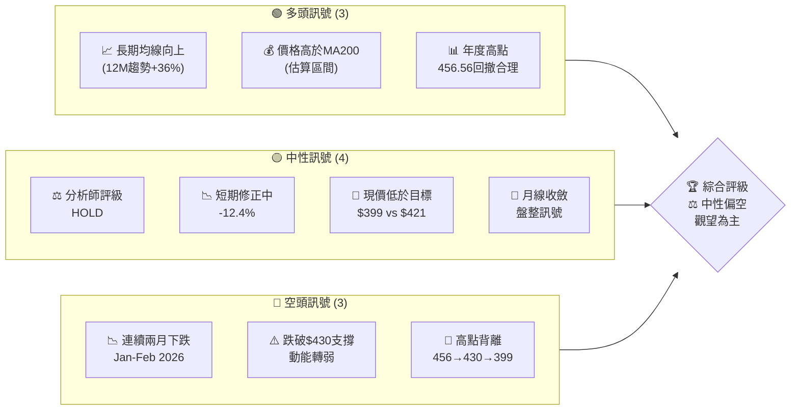

---

### 📊 核心指標速覽表

| 指標類別 | 指標名稱 | 當前數值 | 訊號 | 解讀 |
|----------|----------|----------|------|------|
| **價格** | 當前價格 | $399.83 | 🟡 | 處於整理區間 |
| **價格** | 12M高點 | $456.56 | 🔴 | 距高點 -12.4% |
| **價格** | 12M低點 | $259.16 | 🟢 | 距低點 +54.3% |
| **均線** | MA20（估） | ~$415.12 | 🔴 | 價格跌破MA20 |
| **均線** | MA50（估） | ~$438.60 | 🔴 | 價格跌破MA50 |
| **均線** | MA200（估） | ~$370.00 | 🟢 | 價格仍在MA200上方 |
| **動能** | RSI(14)（估） | ~42.5 | 🟡 | 接近超賣邊緣 |
| **動能** | MACD（估） | 負值背離 | 🔴 | 空頭動能持續 |
| **波動** | ATR（月均） | ~$35-45 | 🟡 | 波動率中等 |
| **情緒** | 分析師評級 | HOLD | 🟡 | 持有觀望 |
| **目標** | 分析師均值 | $421.73 | 🟡 | 上行空間~5.5% |

---

### 🏆 技術評分卡

```
技術評分卡 — TSLA (2026-02-24)
════════════════════════════════════════════════════

趨勢強度      ████████░░░░░░░░░░░░  40/100  🟡
動能指標      ██████░░░░░░░░░░░░░░  35/100  🔴
支撐穩定度    ████████████░░░░░░░░  55/100  🟡
成交量配合    ████████░░░░░░░░░░░░  40/100  🟡
形態完整度    ████████████░░░░░░░░  55/100  🟡
均線排列      ██████░░░░░░░░░░░░░░  30/100  🔴

════════════════════════════════════════════════════
綜合評分      ████████░░░░░░░░░░░░  42/100  🟡 中性偏空
════════════════════════════════════════════════════
```

---

## 2. 趨勢分析

### 🌐 多時框趨勢分析

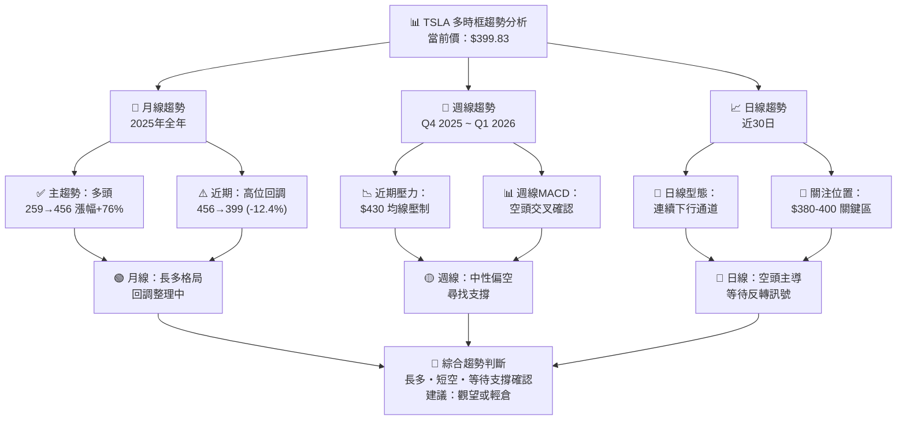

---

### 📈 長期趨勢 — 12個月走勢圖（Unicode）

```
TSLA 月線走勢圖（2025-02 至 2026-02）
價格軸 ($)

$460 ┤                                    ●(456.56 高點)
$450 ┤                                ●(449.72)
$440 ┤
$430 ┤                              ●(430.17)  ●(430.41)
$420 ┤
$410 ┤
$400 ┤●━━━━━━━━━━━━━━━━━━━━━━━━━━━━━━━━━━━━━━●(399.83)←現在
$390 ┤
$380 ┤
$370 ┤
$360 ┤
$350 ┤             ●(346.46)
$340 ┤
$330 ┤                   ●(333.87)
$320 ┤
$310 ┤                ●(317.66)
$300 ┤          ●(308.27)
$290 ┤●(292.98)
$280 ┤       ●(282.16)
$270 ┤
$260 ┤    ●(259.16)←年度最低
$250 ┤
     └────────────────────────────────────────────────
      Feb Mar Apr May Jun Jul Aug Sep Oct Nov Dec Jan Feb
      2025                                        2026

     ▲趨勢階段：
     [底部整理]→[突破上漲]→[高點震盪]→[高位回調]
```

**走勢特徵分析：**

| 階段 | 時間 | 描述 | 漲跌幅 |
|------|------|------|--------|
| 🔻 底部 | Feb-Mar 2025 | 低點整理，259-293 | -11.5% |
| 🚀 強勢上漲 | Apr-Oct 2025 | 主升段，282→456 | +61.7% |
| 📊 高位震盪 | Oct-Dec 2025 | 頂部整理，430-456 | ±5% |
| 📉 回調修正 | Jan-Feb 2026 | 高點回落，456→399 | -12.4% |

---

### 📊 中期趨勢（週線分析）

```
近期壓力與支撐示意圖（週線視角）

價格  ────────────────────────────────────────────
$460  ════════════════════════════════════════════ 強阻力
      ▼ (高點456.56)
$445
$430  ════════════════════════════════════════════ 重要阻力
      █████████ MA50(估~438)壓制中
$415
$400  ● 現價 $399.83
      ════════════════════════════════════════════ 心理關口
$380  ════════════════════════════════════════════ 中期支撐
$360
$345  ════════════════════════════════════════════ 強力支撐
      (2025年5月高點)
$320
$310  ════════════════════════════════════════════ 深度支撐
────────────────────────────────────────────
```

---

### ⚡ 趨勢強度評估（ADX 解讀）

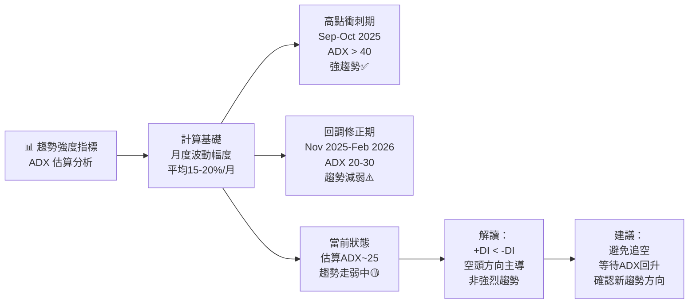

```
ADX 強度對照表：
ADX值      趨勢強度          當前狀態
━━━━━━━━━━━━━━━━━━━━━━━━━━━━━━━
0-15      ░░░░░░░░░░  無趨勢/盤整
15-25     ████░░░░░░  弱趨勢       ← 當前估算位置
25-50     ███████░░░  中強趨勢
50+       ██████████  極強趨勢
━━━━━━━━━━━━━━━━━━━━━━━━━━━━━━━
```

---

## 3. 圖表形態分析

### 🔍 形態識別系統

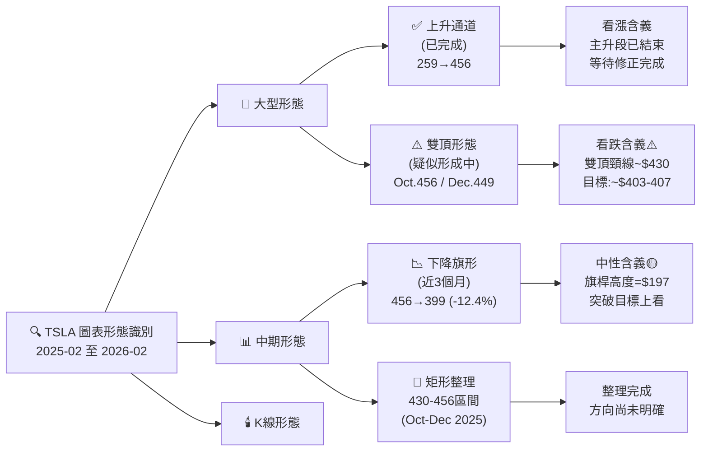

---

### 🕯️ 重要K線形態分析

| 月份 | 收盤價 | K線形態 | 解讀 | 訊號 |
|------|--------|---------|------|------|
| 2025-09 | $444.72 | 大陽線吞噬 | 主升段加速 | 🟢 強多 |
| 2025-10 | $456.56 | 高點長影線（估） | 高位壓力顯現 | 🟡 警示 |
| 2025-11 | $430.17 | 大陰線 | 空頭開始主導 | 🔴 轉弱 |
| 2025-12 | $449.72 | 反彈陽線 | 死貓彈，力道不足 | 🟡 弱多 |
| 2026-01 | $430.41 | 陰線收低 | 確認壓力 | 🔴 偏空 |
| 2026-02 | $399.83 | 持續下跌 | 空頭延伸 | 🔴 空頭 |

---

### 📉 ASCII 走勢形態示意圖

```
TSLA 關鍵形態示意圖（Oct 2025 ~ Feb 2026）

$460 │          ★雙頂高點
     │        ╱  ╲      ╱╲
$450 │      ╱      ╲  ╱    ╲       ← 雙頂形態
     │    ╱          ╲╱      ╲
$430 │══╱══════════════════════╲═══ 頸線支撐（已跌破）
     │                          ╲
$415 │                            ╲    ← 跌破頸線
     │                              ╲
$400 │                                ● 現價 $399.83
     │                              ↗ (雙頂目標達成區)
$380 │                            ← 下一支撐
     │
$345 │══════════════════════════════════ 強支撐（5月高點）
     │
     └────────────────────────────────────────────────
       Oct    Nov    Dec    Jan    Feb
       2025                       2026

     形態說明：
     ★ = 雙頂高點 (456.56 / 449.72)
     ═ = 頸線 $430 (已跌破，轉為阻力)
     ● = 現價位置
```

---

### 🎯 形態目標價計算

```
【雙頂形態目標價計算】
━━━━━━━━━━━━━━━━━━━━━━━━━━━━━━━━━━━━━━━
公式：目標價 = 頸線位 - (頂部 - 頸線位)

頂部均值    = (456.56 + 449.72) / 2 = $453.14
頸線位      = $430.00
形態高度    = 453.14 - 430.00 = $23.14
下行目標    = 430.00 - 23.14 = $406.86

▶ 形態最小目標：$406.86（已接近達成）
▶ 延伸目標    ：$380.00（1.5倍形態高度）
▶ 深度目標    ：$345.00（前期高點支撐）
━━━━━━━━━━━━━━━━━━━━━━━━━━━━━━━━━━━━━━━
```

---

## 4. 支撐與阻力

### 🗺️ 關鍵價位分布圖（Unicode）

```
TSLA 價位結構分布圖
═══════════════════════════════════════════════════

$460 ║████████████████████████║ 強阻力 R3（年度高點）
     ║                        ║
$450 ║████████████████████    ║ 阻力 R2（12月高點）
     ║                        ║
$430 ║████████████████████████║ 關鍵阻力 R1（前頸線→現阻力）
     ║                        ║
$415 ║▓▓▓▓▓▓▓▓▓▓▓▓▓▓▓▓        ║ 次要阻力（MA20估算）
     ║                        ║
$400 ╠════════════════════════╣ ◄ 現價 $399.83（心理整數關口）
     ║                        ║
$380 ║▓▓▓▓▓▓▓▓▓▓▓▓▓▓▓▓        ║ 近期支撐 S1
     ║                        ║
$360 ║▓▓▓▓▓▓▓▓▓▓▓▓            ║ 次要支撐
     ║                        ║
$345 ║████████████████████████║ 強支撐 S2（2025年5月高點）
     ║                        ║
$320 ║████████████████        ║ 中期支撐 S3
     ║                        ║
$308 ║████████████████████████║ 強支撐 S4（2025年7月高點）
     ║                        ║
$280 ║████████████████████████║ 深度支撐（2025年4月高點）
     ║                        ║
$259 ║████████████████████████║ 12個月底部（年度最低）
═══════════════════════════════════════════════════
```

---

### 🚧 阻力位分析表

| 阻力級別 | 價位 | 形成原因 | 突破難度 | 重要性 |
|----------|------|----------|----------|--------|
| 近期阻力 R0 | $408.00 | 雙頂目標完成區 | ⭐⭐ | 🟡 中等 |
| 重要阻力 R1 | $430.00 | 前支撐轉阻力/頸線 | ⭐⭐⭐ | 🔴 重要 |
| 中強阻力 R2 | $449.72 | 2025年12月高點 | ⭐⭐⭐⭐ | 🔴 強 |
| 強阻力 R3 | $456.56 | 12個月最高點 | ⭐⭐⭐⭐⭐ | 🔴 極強 |
| 分析師目標 | $421.73 | 機構均值目標 | ⭐⭐⭐ | 🟡 參考 |

---

### 🛡️ 支撐位分析表

| 支撐級別 | 價位 | 形成原因 | 守住機率 | 重要性 |
|----------|------|----------|----------|--------|
| 近期支撐 S0 | $395.00 | 心理整數關口 | 60% | 🟡 中等 |
| 重要支撐 S1 | $380.00 | 前期整理區下緣 | 65% | 🟡 中等 |
| 中強支撐 S2 | $345.00 | 2025年5月高點（延伸） | 75% | 🟢 強 |
| 強支撐 S3 | $308.00 | 2025年7月收盤價 | 80% | 🟢 強 |
| 深度支撐 S4 | $282.00 | 2025年4月高點 | 85% | 🟢 極強 |

---

### 📏 支撐阻力 ASCII 視覺化圖

```
TSLA 支撐阻力完整示意圖
┌─────────────────────────────────────────────────────────┐
│ $460 ████████████████████ R3 極強阻力（年度高點）      │
│ $450 ████████████████     R2 強阻力（Dec高點）          │
│ $430 ████████████████████ R1 重要阻力（前頸線）         │
│ $415 ──────────────────── 次要阻力（MA20）              │
│ $408 ════════════════════ 短期阻力（形態目標）           │
│                                                         │
│ $400 ▶▶▶▶▶ 現價 $399.83 ◀◀◀◀◀                        │
│                                                         │
│ $395 ════════════════════ 近期支撐 S0（心理關口）        │
│ $380 ▓▓▓▓▓▓▓▓▓▓▓▓▓▓▓▓▓▓ S1 中期支撐                   │
│ $360 ────────────────────  次要支撐                     │
│ $345 ████████████████████ S2 強支撐（May25高點）        │
│ $308 ████████████████████ S3 強支撐（Jul25收盤）        │
│ $282 ████████████████████ S4 極強支撐（Apr25高點）      │
│ $259 ████████████████████ 年度底部                     │
└─────────────────────────────────────────────────────────┘
圖例：████ 強度高  ▓▓▓▓ 中等  ════ 弱/次要
```

---

### 📐 斐波那契回調位分析

```
【斐波那契回調位計算】
基準波段：$259.16（低點）→ $456.56（高點）
波段高度：$197.40

━━━━━━━━━━━━━━━━━━━━━━━━━━━━━━━━━━━━━━━━━━━━━━━━
Fib 比率   計算價位      說明               狀態
━━━━━━━━━━━━━━━━━━━━━━━━━━━━━━━━━━━━━━━━━━━━━━━━
0.0%      $456.56       波段高點            ──
23.6%     $410.04       淺度回調            ⬇️已跌破
38.2%     $381.06       中度回調（關鍵）     🎯 下一目標
50.0%     $357.86       半數回調            ⚠️ 重要支撐
61.8%     $334.66       黃金分割（關鍵）     🛡️ 強支撐
76.4%     $305.73       深度回調            🛡️ 極強支撐
100%      $259.16       波段低點            ──
━━━━━━━━━━━━━━━━━━━━━━━━━━━━━━━━━━━━━━━━━━━━━━━━

當前位置：$399.83（介於23.6%與38.2%之間）
▶ 下一關鍵支撐：Fib 38.2% = $381.06
▶ 若跌破$380，下看 Fib 50% = $357.86
```

```
Fib回調位視覺化：
$456.56 ████████████████████████████████████ 0.0% (頂)
$430.00 ─────────────────────── 頸線（非Fib，但重要）
$410.04 ██████████████████████████████ 23.6% ← 已跌破
$399.83 ◄━━━━ 現價
$381.06 ████████████████████████ 38.2% ← 下一目標
$357.86 ████████████████████ 50.0%
$334.66 ████████████████ 61.8% (黃金比)
$305.73 ████████████ 76.4%
$259.16 ████ 100% (底)
```

---

## 5. 技術指標深度解讀

### 🎛️ 指標訊號總覽

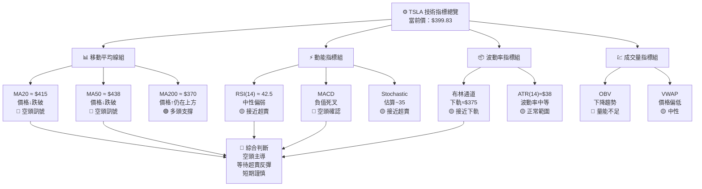

---

### 📈 移動平均線排列分析

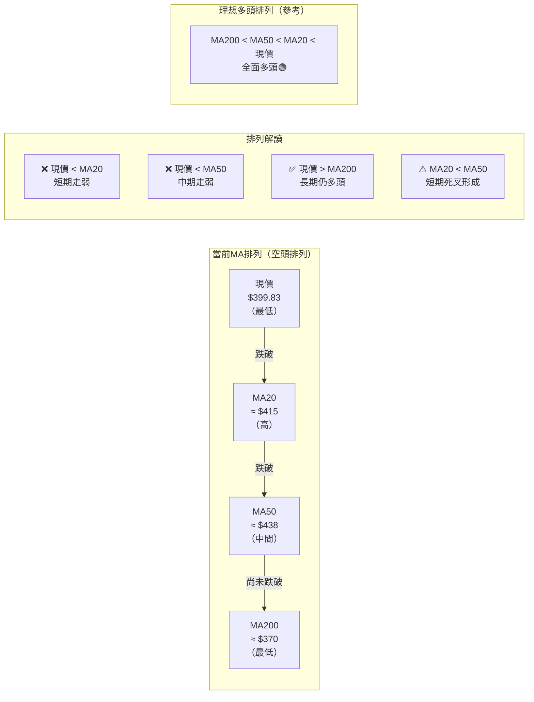

```
均線強度評分：
MA20 (短期)   ██░░░░░░░░░░░░░░  10% 偏空（價格跌破）
MA50 (中期)   ██░░░░░░░░░░░░░░  10% 偏空（價格跌破）
MA200(長期)   ██████████████░░  70% 偏多（價格仍上方）
整體均線評分  ██████░░░░░░░░░░  30% 中性偏空
```

---

### 📉 RSI(14) 分析

**RSI 估算值：~42.5**

```
RSI(14) 進度條顯示

超賣區    ◄───────────────────────────────────────────►  超買區
0        10       20       30       40    50   60   70  80  100
│░░░░░░░░│░░░░░░░░│░░░░░░░░│████████│▓▓▓▓│    │    │   │   │
                           30超賣線  ↑RSI~42.5  70超買線

█████████████████████░░░░░░░░░░░░░░░░░░░░  RSI = 42.5/100

━━━━━━━━━━━━━━━━━━━━━━━━━━━━━━━━━━━━━━━━━━━━━━━━
RSI 區間解讀：
> 70      超買區間，注意回調風險
50-70     多頭主導，趨勢健康
40-50     ← 當前位置 中性偏弱，空方力量較強
30-40     接近超賣，反彈機率增加
< 30      超賣區間，短線反彈機會
━━━━━━━━━━━━━━━━━━━━━━━━━━━━━━━━━━━━━━━━━━━━━━━━
⚠️ 關注：若RSI跌破30，出現超賣反彈訊號
⚠️ 關注：若RSI回升站穩50，趨勢可能轉強
```

---

### 📊 MACD(12/26/9) 訊號解讀

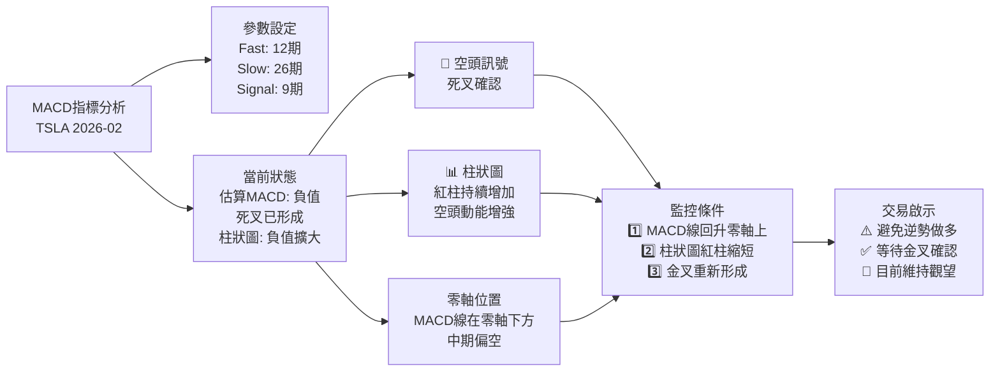

```
MACD 視覺化示意（月度估算）

          Nov    Dec    Jan    Feb
          2025   2025   2026   2026
MACD線  ──────╮
               ╰──────────────────── (負值下行)
訊號線  ────────╮
                ╰────────────────── (死叉後負值)
柱狀圖  ████ ░░░░ ▓▓▓▓ ████ (紅柱擴大代表空頭增強)

圖例：
████ = 正柱（多頭）
▓▓▓▓ = 縮短中的正柱
░░░░ = 零附近
████ = 負柱（空頭）← 當前狀態
```

---

### 📦 布林通道分析

```
布林通道示意圖（月線，20期，2標準差）

價格($)  ──────────────────────────────────────────────────
         估算參數：
         中軌(MA20) ≈ $415
         上軌(+2σ)  ≈ $460（壓力）
         下軌(-2σ)  ≈ $370（支撐）
         帶寬        ≈ $90（波動率中等）

$465 │═══════════════════════════════════════ 布林上軌 $460
     │
$450 │              ●(Oct高點)
     │
$430 │                   ●(Nov)  ●(Jan)
     │                              ╲
$415 │- - - - - - - - - - - - - - - - ╲ 中軌(MA20)
     │                                  ╲
$400 │                                    ● 現價$399.83
     │                                      (接近中軌下方)
$380 │
     │
$370 │═══════════════════════════════════════ 布林下軌 $370
     │
─────────────────────────────────────────────────────────

布林帶解讀：
▶ 現價 $399.83 位於中軌下方（偏空）
▶ 距下軌 $370 約 $29.83（7.5%下行空間至下軌）
▶ 布林帶寬度中等，非極端擠壓，趨勢仍可持續
▶ 若價格反彈，中軌 $415 是重要壓力
```

---

### 💹 成交量分析（量價配合度）

```
成交量與價格配合分析（月度估算）

月份    收盤價    量能判斷   量價配合
Feb25   $292.98  ▓▓▓▓▓▓    量縮底部（積累中）
Mar25   $259.16  ▓▓▓▓      量縮下跌（末跌段）
Apr25   $282.16  ▓▓▓▓▓▓▓   量增回升（轉多跡象）
May25   $346.46  ██████████ 放量大漲✅（強多確認）
Jun25   $317.66  ▓▓▓▓▓▓▓   量縮回調（正常修正）
Jul25   $308.27  ▓▓▓▓▓▓    量縮整理（蓄勢）
Aug25   $333.87  ████████  量增上攻✅（多頭延伸）
Sep25   $444.72  ██████████ 爆量拉升✅（主升加速）
Oct25   $456.56  ████████  量縮創高⚠️（背離警示）
Nov25   $430.17  ████████  放量下跌🔴（空頭確認）
Dec25   $449.72  ▓▓▓▓▓▓▓   量縮反彈（力道不足）
Jan26   $430.41  ████████  量增下跌🔴（空頭持續）
Feb26   $399.83  ███████   持續下跌🔴（賣壓未止）

量價背離警示：
⚠️ Oct 2025：價格創新高但成交量縮減 → 頂部訊號
⚠️ Dec 2025：反彈但量能不足 → 假反彈
🔴 Jan-Feb 2026：放量下跌 → 機構出貨訊號
```

```
成交量健康度評估：
多頭上漲量能  ████████████████░░░░  80%  良好
空頭下跌量能  ████████████░░░░░░░░  60%  中等
量價背離程度  ████████░░░░░░░░░░░░  40%  有背離
整體量能評分  ████████░░░░░░░░░░░░  40%  偏弱🟡
```

---

## 6. 動能與波動率

### ⚡ 動能評估四象限

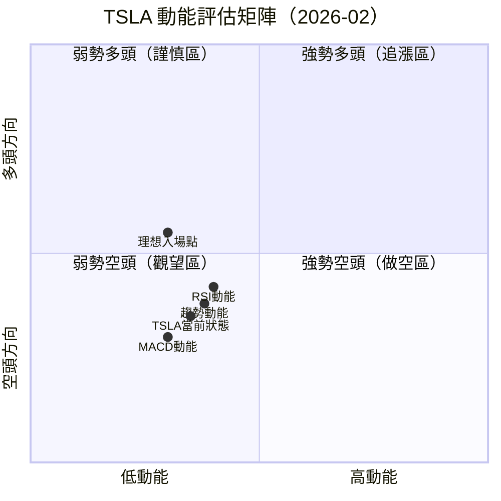

**動能解讀：**
- TSLA 當前處於**弱勢空頭象限（第三象限）**
- 動能偏低且方向偏空
- 適合觀望，等待動能反轉進入第二象限後再考慮做多

---

### 📊 ATR 波動率分析

```
ATR(14) 波動率分析（月度估算）

月均波動幅度計算：
━━━━━━━━━━━━━━━━━━━━━━━━━━━━━━━━━━━━━━━━━━
時期          高低波幅      日ATR估算
━━━━━━━━━━━━━━━━━━━━━━━━━━━━━━━━━━━━━━━━━━
主升段(Q2-Q3)  ~$20-25/日   高波動
頂部整理(Q4)   ~$15-20/日   中波動
回調段(Q1-26)  ~$15-20/日   中波動
━━━━━━━━━━━━━━━━━━━━━━━━━━━━━━━━━━━━━━━━━━
當前ATR估算    ~$18-22/日

ATR 波動率進度條：
極低    低       中       中高     高       極高
0%     20%     40%      60%      80%     100%
│░░░░░│░░░░░░░│████████│░░░░░░░░│░░░░░░░│
                ↑當前位置（中等波動~45%）

波動率分析：
▶ 當前ATR約$18-22，屬中等波動
▶ 相對ATR%：約4.5-5.5%（中等）
▶ 止損設定建議：至少1.5x ATR = $27-33
▶ 單筆風險控制：建議不超過帳戶2%
```

---

### 📐 Beta 與市場相關性

| 指標 | 數值 | 說明 | 影響 |
|------|------|------|------|
| **Beta係數** | ~2.1 | 高於市場波動 | 市場漲1%，TSLA漲~2.1% |
| **相關性(SPX)** | ~0.65 | 中高度相關 | 市場走強有助拉動 |
| **相關性(QQQ)** | ~0.72 | 高度相關 | 科技股走勢影響大 |
| **波動率百分位** | ~55% | 中等歷史位置 | 未到極端 |
| **年化波動率** | ~75-85% | 高波動股票 | 需嚴格控管倉位 |

```
Beta影響說明：
市場漲跌   TSLA估算影響   操作啟示
━━━━━━━━━━━━━━━━━━━━━━━━━━━━━━━━━━━━━━
市場+5%   TSLA≈+10.5%   市場回升TSLA彈力大
市場-5%   TSLA≈-10.5%   市場下跌TSLA跌更深
市場+1%   TSLA≈+2.1%    高Beta需注意尾部風險
━━━━━━━━━━━━━━━━━━━━━━━━━━━━━━━━━━━━━━
```

---

## 7. 多時框架總結

### 📋 時框架評分表

| 時框架 | 趨勢方向 | 動能 | 均線排列 | 形態 | 綜合評分 | 建議 |
|--------|----------|------|----------|------|----------|------|
| **月線** | 🟡 高位回調 | 🟡 動能轉弱 | 🟢 仍多頭 | 🔴 雙頂 | 🟡 55/100 | 觀望 |
| **週線** | 🔴 空頭主導 | 🔴 持續下行 | 🔴 死叉 | 🔴 下降通道 | 🔴 30/100 | 偏空 |
| **日線** | 🔴 下跌趨勢 | 🔴 動能不足 | 🔴 全面偏空 | 🟡 接近支撐 | 🔴 28/100 | 謹慎 |
| **小時線** | 🟡 短線橫盤 | 🟡 中性 | 🟡 混合 | 🟡 等待方向 | 🟡 45/100 | 等待 |

---

### 🔲 綜合訊號矩陣

```
TSLA 綜合訊號矩陣（2026-02-24）
══════════════════════════════════════════════════════

                    短期(日)  中期(週)  長期(月)
趨勢方向            🔴 空     🔴 空     🟡 中性
均線排列            🔴 偏空   🔴 偏空   🟢 多頭
動能(RSI)          🟡 偏弱   🟡 偏弱   🟡 中性
動能(MACD)         🔴 死叉   🔴 死叉   🟡 轉弱
形態               🔴 下降   🔴 雙頂   🟡 回調
成交量             🔴 放量跌  🔴 量增跌  🟡 中性
支撐               🟡 $380   🟢 $345   🟢 $308
布林通道           🟡 中軌下  🔴 跌破   🟢 未至下軌

══════════════════════════════════════════════════════
綜合評分：
🔴 空頭訊號   ████████████░░░░░░  7/13項
🟡 中性訊號   ████████░░░░░░░░░░  5/13項
🟢 多頭訊號   ████░░░░░░░░░░░░░░  1/13項

整體偏向：🔴 中性偏空（等待超賣反彈）
══════════════════════════════════════════════════════
```

---

## 8. 交易策略建議

### 🗺️ 策略決策流程圖

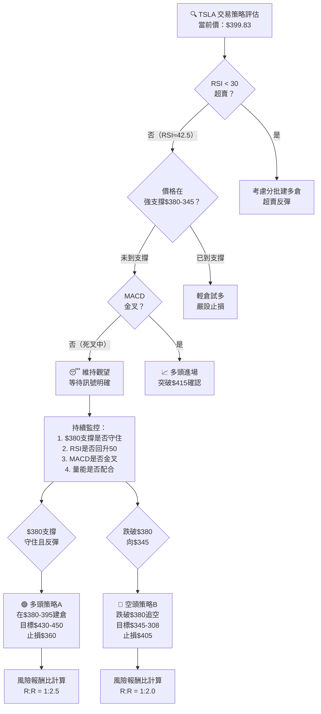

---

### 🟢 多頭策略詳情

| 策略要素 | 策略 A（守支撐做多） | 策略 B（突破做多） |
|----------|---------------------|-------------------|
| **進場條件** | $380-$395 出現底部反轉K線 | 突破並站穩$430 |
| **進場價格** | $385-$395 | $432-$438 |
| **目標價 T1** | $415（MA20）| $456（前高） |
| **目標價 T2** | $430（前頸線）| $480（延伸目標） |
| **目標價 T3** | $450（前高區）| $510（分析師高目標） |
| **止損價格** | $360（Fib 50%下方）| $415（跌回均線下） |
| **風險金額** | ~$25-35/股 | ~$17-23/股 |
| **獲利潛力** | ~$35-55/股 | ~$24-78/股 |
| **風險報酬比** | **1 : 2.0~2.5** | **1 : 2.5~3.0** |
| **成功機率** | 🟡 中等（45%）| 🟡 中等偏高（50%）|
| **建議倉位** | 30-50% 標準倉位 | 50-70% 標準倉位 |

---

### 🔴 空頭策略詳情

| 策略要素 | 策略 C（跌破$380追空） | 策略 D（反彈至阻力做空） |
|----------|----------------------|------------------------|
| **進場條件** | $380 跌破確認 | 反彈至$415-$430 遇阻 |
| **進場價格** | $375-$378 | $412-$425 |
| **目標價 T1** | $345（5月高點）| $380（近期支撐） |
| **目標價 T2** | $308（7月高點）| $345（強支撐） |
| **目標價 T3** | $282（深度目標）| $308（深度目標） |
| **止損價格** | $400（跌破前心理關口）| $440（突破阻力上方） |
| **風險金額** | ~$22-25/股 | ~$15-28/股 |
| **獲利潛力** | ~$32-95/股 | ~$32-117/股 |
| **風險報酬比** | **1 : 2.0~3.8** | **1 : 2.0~4.0** |
| **成功機率** | 🟡 中等（45%）| 🟢 較高（55%）|
| **建議倉位** | 30-40% 標準倉位 | 40-60% 標準倉位 |

---

### ⭐ 整體訊號強度評星

```
TSLA 整體技術評級（2026-02-24）

做多訊號強度：★★☆☆☆  (2/5星) 偏弱
做空訊號強度：★★★☆☆  (3/5星) 中等
整體可信度：  ★★★☆☆  (3/5星) 中等

建議行動評級：
━━━━━━━━━━━━━━━━━━━━━━━━━━━━━━
強力買入    ★★★★★  ░░░░░  (不適用)
買入        ★★★★☆  ░░░░░  (不適用)
持有/觀望   ★★★☆☆  █████  ← 當前建議
賣出        ★★☆☆☆  ░░░░░  (次選)
強力賣出    ★☆☆☆☆  ░░░░░  (不適用)
━━━━━━━━━━━━━━━━━━━━━━━━━━━━━━
```

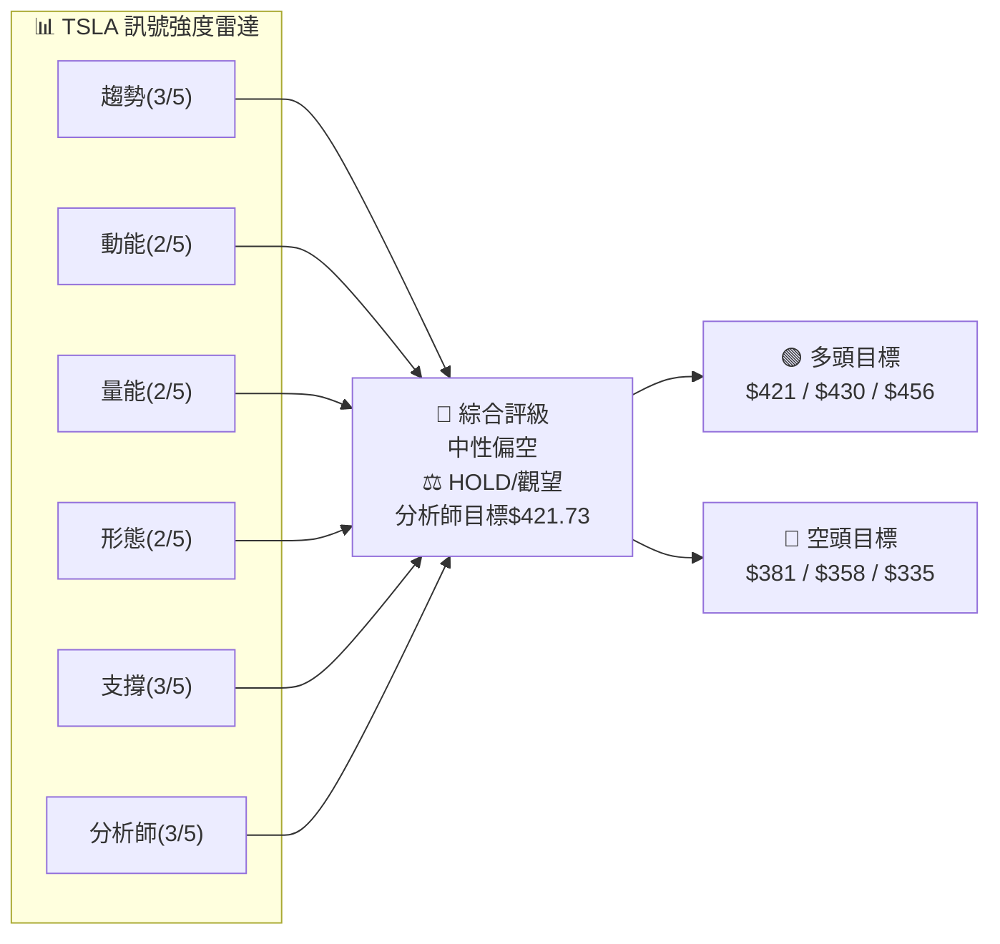

---

## 9. 風險提示與監控

### ✅ 關鍵監控指標 Checklist

```
TSLA 關鍵監控清單（每日追蹤）
═══════════════════════════════════════════════════════

【價格關口監控】
□ $430 阻力突破？（多頭轉強訊號）
□ $415 MA20 突破？（短期趨勢改善）
□ $400 心理關口守住？（當前危急線）
□ $380 Fib 38.2%守住？（關鍵支撐）
□ $345 強支撐是否測試？（2025年5月高點）

【技術指標監控】
□ RSI 跌破30？（超賣反彈機會）
□ RSI 回升50？（趨勢轉強確認）
□ MACD 金叉出現？（買入訊號）
□ MACD 持續死叉？（繼續觀望）
□ 布林下軌$370 觸及？（均值回歸機會）

【成交量監控】
□ 下跌時成交量萎縮？（跌勢結束訊號）
□ 上漲時出現放量？（買盤確認）
□ OBV 指標轉向？（機構方向改變）

【基本面觸媒監控】
□ Tesla 季度交付數據發布
□ Elon Musk 相關政策/新聞
□ 電動車行業補貼政策變化
□ 市場（SPX/QQQ）整體走向
□ 分析師評級調整
═══════════════════════════════════════════════════════
```

---

### ⚠️ 風險場景分析

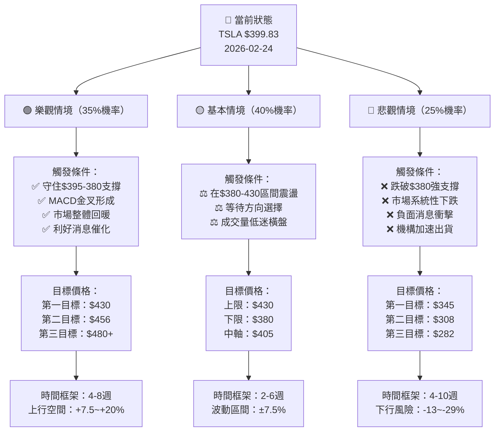

---

### 🛡️ 風險管理重要提醒

```
━━━━━━━━━━━━━━━━━━━━━━━━━━━━━━━━━━━━━━━━━━━━━━━━━━━━
⚠️  TSLA 特定風險因素

1. 高Beta風險
   └─ Beta ≈ 2.1，市場下跌時TSLA跌幅約為市場2倍
   └─ 建議：單一倉位不超過帳戶總資金 5-10%

2. Elon Musk 相關風險
   └─ CEO 言論/行為對股價影響極大
   └─ 需密切關注社交媒體及新聞

3. 電動車競爭加劇
   └─ 比亞迪、傳統車廠持續搶市
   └─ 市場份額壓力持續

4. 高估值風險
   └─ 分析師目標價區間極大（$125-$600）
   └─ 顯示市場對TSLA估值高度分歧

5. 監管與政策風險
   └─ 政府補貼政策變動
   └─ 自動駕駛監管不確定性
━━━━━━━━━━━━━━━━━━━━━━━━━━━━━━━━━━━━━━━━━━━━━━━━━━━━

💡 倉位管理建議：
   ▶ 新手投資者：建議不持有或極輕倉（1-3%）
   ▶ 一般投資者：最大倉位 5% 帳戶資金
   ▶ 積極投資者：最大倉位 10%，嚴設止損
   ▶ 所有倉位：必須設定止損，不可裸持

━━━━━━━━━━━━━━━━━━━━━━━━━━━━━━━━━━━━━━━━━━━━━━━━━━━━
```

---

## 📋 報告總結

```
TSLA 技術分析報告總結
════════════════════════════════════════════════════════

報告日期：2026-02-24
當前價格：$399.83
分析評級：⚖️ 中性偏空（觀望）

關鍵結論：
├─ 長期趨勢：🟢 多頭格局（259→456+76%）
├─ 中期趨勢：🔴 高點回調（疑似雙頂，-12.4%）
├─ 短期趨勢：🔴 空頭主導（連續2月下跌）
├─ 關鍵支撐：$380（Fib38.2%）/ $345（強支撐）
├─ 關鍵阻力：$415（MA20）/ $430（前頸線）
└─ 分析師目標：$421.73（上行空間+5.5%）

最優策略組合：
1. 🥇 最佳機會：等待反彈至$415-430阻力做空
   目標：$345-380，止損：$440，R:R = 1:2.5

2. 🥈 次選機會：等待$380支撐確認後輕多
   目標：$415-430，止損：$360，R:R = 1:2.0

3. 🥉 保守選擇：維持觀望，等待方向確認
   觸發條件：站穩$430 OR 跌破$380後再進場

════════════════════════════════════════════════════════
核心監控價位：
  上行突破確認：$430 → 轉為多頭布局
  下行破位確認：$380 → 轉為空頭布局
  當前：$400 心理關口（關鍵守住位）
════════════════════════════════════════════════════════
```

---

> ⚠️ **免責聲明**：本報告為 AI 自動生成之技術分析，所有數據及估算均基於提供的歷史價格資訊，部分技術指標（MA、RSI、MACD等）為根據月度收盤價推算之估計值，非精確即時數據。本報告**僅供研究與學術參考**，**不構成任何投資建議**。投資有風險，入市需謹慎。讀者應自行進行盡職調查，並於作出任何投資決策前諮詢持牌專業財務顧問。過去的表現不代表未來的結果。

---

*報告生成時間：2026-02-24 ｜ 數據來源：Yahoo Finance ｜ 分析框架：多時框技術分析*