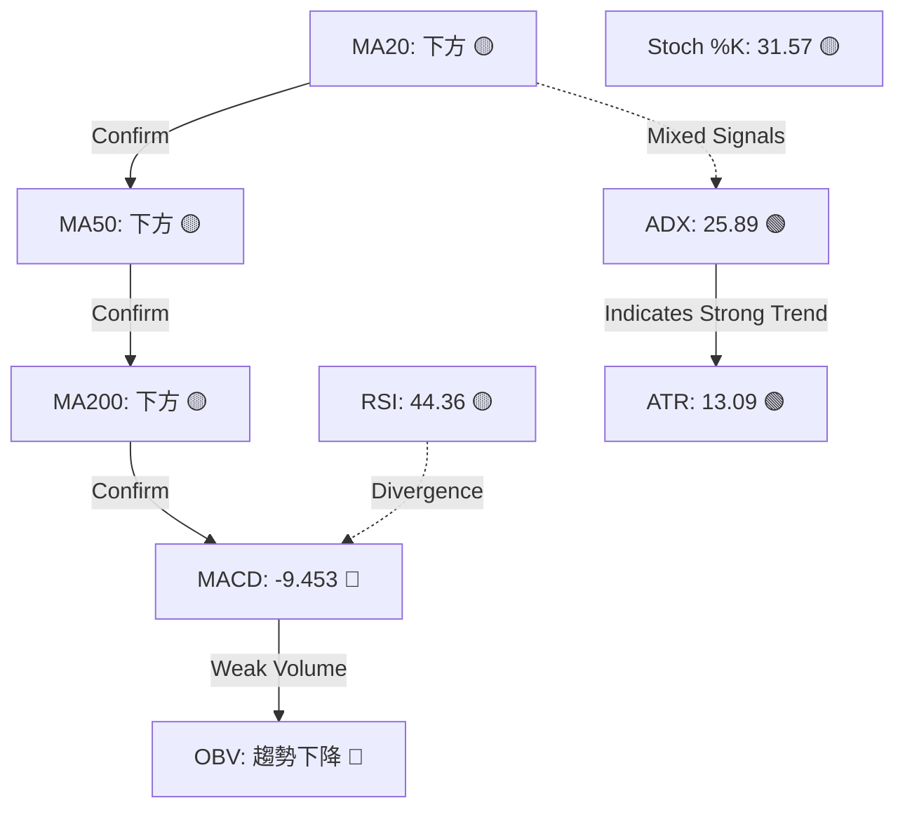
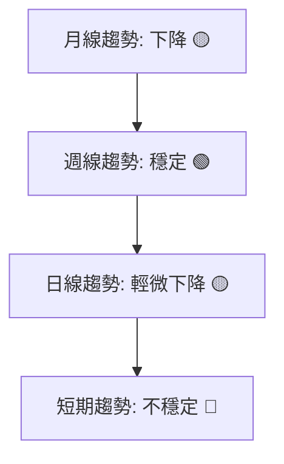
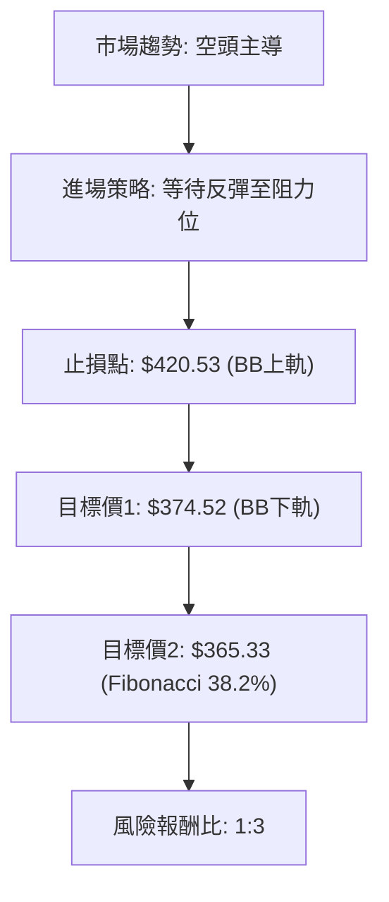
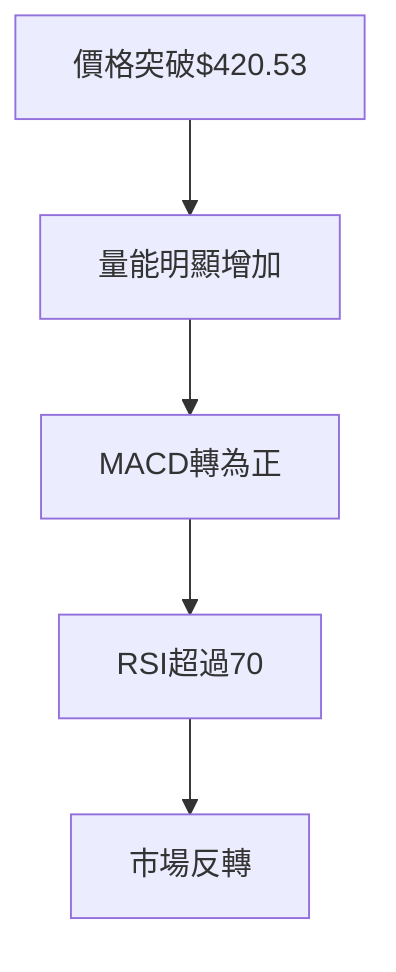

# TSLA 技術分析報告
> **報告日期**：2026-03-24 ｜ **語言**：繁體中文 ｜ **數據來源**：Yahoo Finance

## 目錄
1. 技術面概覽
2. 趨勢分析（多時框架）
3. 圖表形態分析
4. 支撐與阻力（精確數值）
5. 技術指標深度解讀
6. 量價分析
7. 多時框架訊號總結
8. 交易策略建議（精確數值）
9. 風險提示與監控

## 1. 技術面概覽
### 技術訊號儀表板


### 核心指標速覽表
| 指標   | 值        | 訊號         |
| ------ | --------- | ------------ |
| MA20   | $397.53   | 🟡 下方       |
| MA50   | $414.19   | 🟡 下方       |
| MA200  | $394.63   | 🟡 下方       |
| RSI(14)| 44.36     | 🟡 中性       |
| MACD   | -9.453    | 🔴 看空       |
| Stoch %K | 31.57   | 🟡 中性       |
| ADX(14) | 25.89    | 🟢 強趨勢     |
| ATR(14) | $13.09   | 🟢 高波動     |
| OBV    | 降低趨勢  | 🔴 量能疲弱   |

### 技術綜合評分
▓▓▓▓▓▓░░░░ (6/10)

### 52週價格位置分析
目前價格位於52週的58.5%位置，介於年度高點與低點之間，顯示中性偏空的市場情緒。

## 2. 趨勢分析（多時框架）
### 多時框趨勢判斷


### ADX 趨勢強度解讀
目前ADX值為25.89，顯示市場存在一定的趨勢強度。然而，負向指標(-DI)大於正向指標(+DI)，顯示目前趨勢為空頭主導。

### 均線排列
目前MA20、MA50及MA200均位於價格下方，顯示中長期趨勢看空。均線未形成明顯的多頭或空頭排列，顯示市場方向不明確。

### 長/中/短期趨勢
長期：▓▓▓▓░░░░░░ (4/10)  
中期：▓▓▓▓▓▓░░░░ (6/10)  
短期：▓▓▓░░░░░░░ (3/10)

## 3. 圖表形態分析
### 形態識別


### ASCII 走勢示意圖
```
   ⬆︎   ⬆︎   ⬆︎
  ┌───┬───┬───┐
  │   │   │   │   ^ 支撐位 $374.52
  ├───┼───┼───┤
  │   │   │   │   ^ 當前價 $380.85
  ├───┼───┼───┤
  │   │   │   │   ^ 阻力位 $397.53
  └───┴───┴───┘
```

### 形態目標價計算
無明顯圖表形態，未能計算目標價。

### 近期重要 K 線組合分析
最近一週的K線顯示壓力測試，價格試圖突破但未能持續。

## 4. 支撐與阻力（精確數值）
### 支撐阻力位 ASCII 視覺化圖
```
   ⬆︎   ⬆︎   ⬆︎
  ┌───┬───┬───┐
  │   │   │   │   ^ 強支撐位 $354.19
  ├───┼───┼───┤
  │   │   │   │   ^ 中支撐位 $365.33
  ├───┼───┼───┤
  │   │   │   │   ^ 近支撐位 $374.52
  └───┴───┴───┘
```

### 阻力位表格
| 種類     | 價位      | 依據       |
| -------- | --------- | ---------- |
| 近端阻力 | $397.53   | MA20       |
| 中端阻力 | $414.19   | MA50       |
| 強阻力   | $420.53   | BB上軌    |

### 支撐位表格
| 種類     | 價位      | 依據       |
| -------- | --------- | ---------- |
| 近端支撐 | $374.52   | BB下軌    |
| 中端支撐 | $365.33   | Fibonacci 38.2% |
| 強支撐   | $354.19   | Fibonacci 50% |

### 斐波那契回調位計算表格
| 百分比   | 價位      |
| -------- | --------- |
| 38.2%    | $365.33   |
| 50%      | $354.19   |
| 61.8%    | $342.08   |

### 布林通道上下軌作為動態支撐阻力分析
價格目前接近布林下軌，可能存在反彈的機會，但需注意下軌突破可能導致進一步下跌。

## 5. 技術指標深度解讀
### 指標訊號彙整
```mermaid
graph TD
    A[RSI "44.36: 中性偏空"]
    B[MACD "-9.453: 看空"]
    C[Stoch "31.57: 中性"]
    D[BB "%B: 0.14 - 接近下軌"]
    A -->|Confirm| B
    B -->|Confirm| C
    C -.->|No Strong Signal| D
```

### RSI(14) 分析
RSI值為44.36, 處於中性範圍但偏向超賣，顯示賣壓未完全釋放。🟡
RSI底背離顯示可能的強度回升。
▓▓▓▓▓▓▓░░░ (7/10)

### MACD(12/26/9) 分析
```mermaid
graph LR
    A[MACD Line "-9.453"]
    B[Signal Line "-7.849"]
    C[Histogram "-1.604"]
    A -->|Below| B
    B -->|Negative Histogram| C
```
MACD持續在零軌下方運行，顯示市場存在持續的賣壓。MACD與Signal Line之間的差距正在擴大，表示下跌動能增強。🔴

### Stochastic(14,3,3) 分析
Stoch %K值為31.57，%D值為14.16，顯示市場在短期內超賣，可能存在反彈的機會，但整體趨勢偏空。🟡

### 布林通道(20,2σ) 分析
```
   ⬆︎   ⬆︎   ⬆︎
  ┌───┬───┬───┐
  │   │   │   │   ^ 上軌 $420.53
  ├───┼───┼───┤
  │   │ X │   │   ^ 中軌 $397.53
  ├───┼───┼───┤
  │   │   │   │   ^ 下軌 $374.52
  └───┴───┴───┘
```
價格目前靠近下軌，顯示可能的超賣情況，但需警惕下軌突破的風險。

### ATR(14) 分析
當前ATR值為13.09，顯示相對較高的市場波動性。這對於設置合適的止損和目標價位非常重要。

## 6. 量價分析
### OBV 趨勢分析
OBV顯示下降趨勢，與價格走勢一致，暗示下跌趨勢有量能支持。🔴

### 成交量與價格配合度分析
在近期的價格回調中，成交量有所增加，這可能是賣壓增強的信號。

### 量能評分
▓▓░░░░░░░░ (2/10)

### 量能異常信號識別
近期無明顯的量能異常信號，市場交易相對平穩。

## 7. 多時框架訊號總結
### 時框架評分表格
| 時框架 | 趨勢  | 動能  | 成交量 | 綜合  |
| ------ | ----- | ----- | ----- | ----- |
| 月線   | 🟡     | 🔴     | 🔴     | 🔴     |
| 週線   | 🟢     | 🟡     | 🟡     | 🟡     |
| 日線   | 🟡     | 🟡     | 🟡     | 🟡     |

### 訊號一致性
大多數指標顯示市場處於壓力之下，趨勢和量能均顯示看空信號。

## 8. 交易策略建議（精確數值）
### 策略選擇流程圖


### 多頭策略
無推薦多頭策略，市場趨勢與動能均不支持。

### 空頭策略
| 進場點  | 止損點  | 目標價1  | 目標價2  | 風險報酬比 |
| ------- | ------- | ------- | ------- | ---------- |
| $397.53 | $420.53 | $374.52 | $365.33 | 1:3        |

### 盤整策略
考慮在$397.53至$374.52之間進行範圍交易，若價格突破此範圍，應重新評估市場狀況。

### 倉位管理建議
建議保持較低的倉位（不超過總投資組合的10%），以降低風險。

### 整體技術訊號強度
★☆☆☆☆ (1/5)

## 9. 風險提示與監控
### 關鍵失效條件
- 價格穩定上破$420.53，顯示可能的趨勢反轉。
- RSI突破70，顯示超買情況，可能導致短期回調。

### 近期催化劑事件
應密切關注即將發布的財報，以及任何可能影響電動車行業的法規變更。

### 風險場景


> **免責聲明**：本報告為 AI 自動生成，僅供研究參考，不構成投資建議。