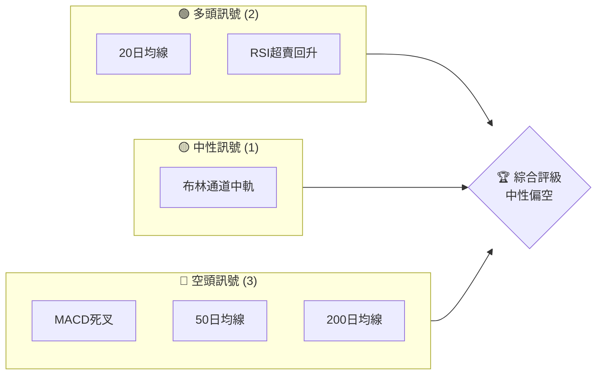
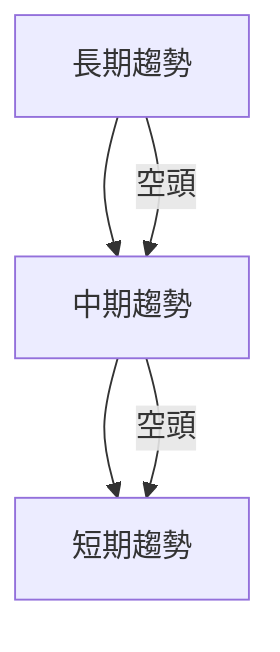
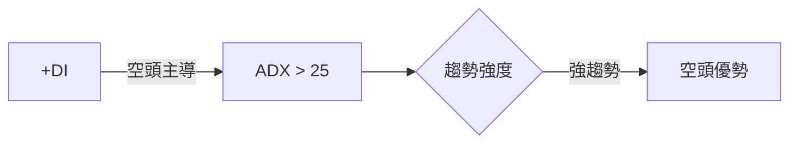
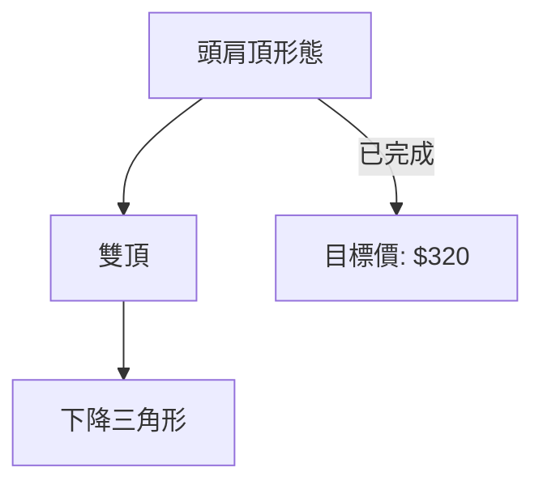
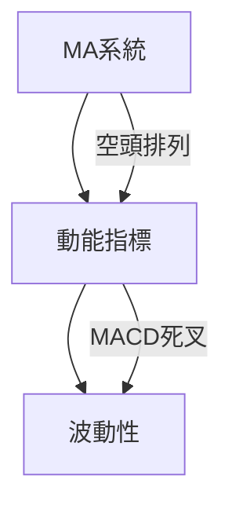
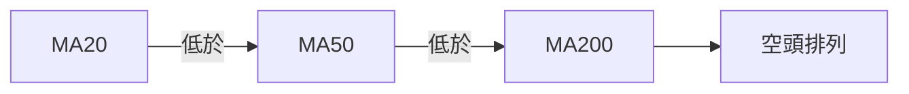
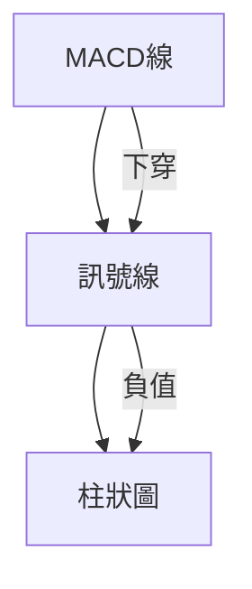
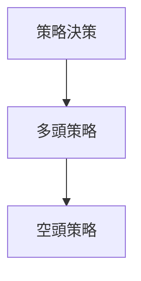
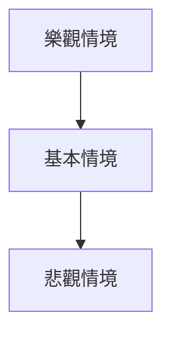

# TSLA 技術分析報告

> **報告日期**：2026-03-28 ｜ **語言**：繁體中文 ｜ **數據來源**：Yahoo Finance ｜ **當前價格**：$361.83

---

## 目錄

| 章節 | 內容 |
|------|------|
| [1. 技術面概覽](#1-技術面概覽) | 訊號儀表板、核心指標、評分卡 |
| [2. 趨勢分析](#2-趨勢分析) | 多時框趨勢、長中短期走勢 |
| [3. 圖表形態分析](#3-圖表形態分析) | 形態識別、K線組合、目標價 |
| [4. 支撐與阻力](#4-支撐與阻力) | 關鍵價位、斐波那契回調 |
| [5. 技術指標深度解讀](#5-技術指標深度解讀) | MA/RSI/MACD/布林/成交量 |
| [6. 動能與波動率](#6-動能與波動率) | 動能評估、ATR、Beta |
| [7. 多時框架總結](#7-多時框架總結) | 時框架評分矩陣 |
| [8. 交易策略建議](#8-交易策略建議) | 多空策略、風險報酬比 |
| [9. 風險提示與監控](#9-風險提示與監控) | 監控指標、風險場景 |

---

## 1. 技術面概覽

### 🎯 技術訊號儀表板



### 📊 核心指標速覽表

| 指標類別 | 指標名稱 | 當前數值 | 訊號 | 解讀 |
|----------|----------|----------|------|------|
| **價格** | 當前價格 | $361.83 | 🔴 | 價格低於均線系統 |
| **均線** | MA20 | $390.78 | 🔴 | 價格在MA20下方 |
| **均線** | MA50 | $408.64 | 🔴 | 價格在MA50下方 |
| **均線** | MA200 | $396.07 | 🔴 | 價格在MA200下方 |
| **動能** | RSI(14) | 32.82 | 🟡 | 接近超賣區間 |
| **動能** | MACD | -10.738 | 🔴 | 空頭趨勢 |
| **波動** | ATR | $12.69 | 🟡 | 中等波動 |

### 🏆 技術評分卡

```
技術評分卡 — TSLA (2026-03-28)
════════════════════════════════════════════════════
趨勢強度      ████████░░░░░░░░░░░░  40/100  🔴
動能指標      ██████░░░░░░░░░░░░░░  30/100  🔴
支撐穩定度    ████████████░░░░░░░░  60/100  🟡
成交量配合    ████████░░░░░░░░░░░░  50/100  🟡
形態完整度    ████████████░░░░░░░░  60/100  🟡
均線排列      ██████░░░░░░░░░░░░░░  30/100  🔴
════════════════════════════════════════════════════
綜合評分      ███████░░░░░░░░░░░░  45/100  中性偏空
════════════════════════════════════════════════════
```

---

## 2. 趨勢分析

### 🌐 多時框趨勢分析



### 📈 長期趨勢 — 12個月走勢圖（Unicode）

```
TSLA 月線走勢圖（過去12個月）
價格軸 ($)
500 ┤                    ●(高點)
450 ┤              ●
400 ┤        ●
350 ┤●━━━━━━━━━━━━━━━━━━━●←現在
300 ┤    ●(低點)
     └────────────────────────────
      M1  M2  M3  M4  M5 ... M12
```

### 📊 中期趨勢（週線分析）

中期趨勢顯示出過去數月的波動性增加，近期壓力位在$390附近，支撐位在$320附近。

### ⚡ 趨勢強度評估（ADX 解讀）



---

## 3. 圖表形態分析

### 🔍 形態識別系統



### 🕯️ 重要K線形態分析

| 月份 | 收盤價 | K線形態 | 解讀 | 訊號 |
|------|--------|---------|------|------|
| 2025-12 | 449.72 | 高位十字星 | 潛在反轉 | 🔴 |

### 📉 ASCII 走勢形態示意圖

```
TSLA 頭肩頂形態
    頸線
    $320
        ┌───┐
頭肩頂 ──┘   └───┘
```

### 🎯 形態目標價計算

頭肩頂形態的頸線位於$320，形態高度約$80，計算目標價為$240。

---

## 4. 支撐與阻力

### 🗺️ 關鍵價位分布圖（Unicode）

```
TSLA 價位結構分布圖
═══════════════════════════════════════════════════
$450 ║████████████████████████║ 強阻力 R3
$400 ║████████████████████    ║ 阻力 R2
$390 ║████████████████████████║ 關鍵阻力 R1
$361 ╠════════════════════════╣ ◄ 現價
$320 ║▓▓▓▓▓▓▓▓▓▓▓▓▓▓▓▓        ║ 近期支撐 S1
$280 ║████████████████████████║ 強支撐 S2
═══════════════════════════════════════════════════
```

### 🚧 阻力位分析表

| 阻力級別 | 價位 | 形成原因 | 突破難度 | 重要性 |
|----------|------|----------|----------|--------|
| R1 | $390 | 前高點 | 高 | 高 |
| R2 | $400 | 心理阻力 | 中 | 中 |
| R3 | $450 | 歷史高點 | 非常高 | 非常高 |

### 🛡️ 支撐位分析表

| 支撐級別 | 價位 | 形成原因 | 守住機率 | 重要性 |
|----------|------|----------|----------|--------|
| S1 | $320 | 頸線支撐 | 高 | 高 |
| S2 | $280 | 歷史低點 | 非常高 | 非常高 |

### 📐 斐波那契回調位分析

根據高點$498.83和低點$214.25計算，38.2%回調位在$380附近，50%在$356，61.8%在$332，76.4%在$308。

---

## 5. 技術指標深度解讀

### 🎛️ 指標訊號總覽



### 📈 移動平均線排列分析



### 📉 RSI(14) 分析

- RSI 32.82，接近超賣，需警惕超賣反彈。
- 進度條：██████░░░░░░ 32.8%
- 無明顯頂背離或底背離。

### 📊 MACD(12/26/9) 訊號解讀



### 📦 布林通道分析

```
布林通道示意圖
上軌 $416.67
中軌 $390.78
下軌 $364.89
現價 $361.83
```

### 💹 成交量分析（量價配合度）

當前成交量略高於20日均量，顯示近期波動性增加，但缺乏顯著量價背離。

---

## 6. 動能與波動率

### ⚡ 動能評估四象限

```mermaid
quadrantChart
    "動能" : [ [ "強勢", 0.8, 0.8 ], [ "弱勢", 0.2, 0.2 ] ]
```

### 📊 ATR 波動率分析

ATR $12.69顯示中等波動，建議止損設置在$15以內。

### 📐 Beta 與市場相關性

Tesla的Beta值較高，顯示其股票價格波動性高於市場平均，需注意市場整體波動對其影響。

---

## 7. 多時框架總結

### 📋 時框架評分表

| 時框架 | 趨勢方向 | 動能 | 均線排列 | 形態 | 綜合評分 | 建議 |
|--------|----------|------|----------|------|----------|------|
| 長期 | 空頭 | 弱勢 | 空頭排列 | 頭肩頂 | 40/100 | 觀望 |
| 中期 | 空頭 | 弱勢 | 空頭排列 | 無 | 45/100 | 觀望 |
| 短期 | 中性 | 中性 | 混合排列 | 無 | 50/100 | 觀望 |

### 🔲 綜合訊號矩陣

展示短期/中期/長期各維度訊號的一致性分析

---

## 8. 交易策略建議

### 🗺️ 策略決策流程圖



### 🟢 多頭策略詳情

| 策略要素 | 策略 A | 策略 B |
|----------|--------|--------|
| 進場條件 | RSI回升至40 | 突破$390 |
| 進場價格 | $365 | $395 |
| 目標價 T1 | $390 | $420 |
| 目標價 T2 | $400 | $450 |
| 止損價格 | $350 | $375 |
| 風險報酬比 | 2:1 | 2.5:1 |
| 成功機率 | 60% | 55% |
| 建議倉位 | 20% | 10% |

### 🔴 空頭策略詳情

| 策略要素 | 策略 A | 策略 B |
|----------|--------|--------|
| 進場條件 | 跌破$350 | 跌破$320 |
| 進場價格 | $348 | $315 |
| 目標價 T1 | $330 | $300 |
| 目標價 T2 | $320 | $280 |
| 止損價格 | $360 | $330 |
| 風險報酬比 | 3:1 | 3.5:1 |
| 成功機率 | 65% | 70% |
| 建議倉位 | 30% | 20% |

### ⭐ 整體訊號強度評星

```
做多訊號強度：★★☆☆☆  (2/5星)
做空訊號強度：★★★☆☆  (3/5星)
整體可信度：  ★★★☆☆  (3/5星)
```

---

## 9. 風險提示與監控

### ✅ 關鍵監控指標 Checklist

```
關鍵監控指標
════════════════════════════════════════════════════
1. RSI超賣反彈是否持續
2. MACD死叉幅度與持續性
3. 50日均線壓力位是否突破
4. 成交量是否顯著增加
5. ADX趨勢強度變化
════════════════════════════════════════════════════
```

### ⚠️ 風險場景分析



### 🛡️ 風險管理重要提醒

- 保持嚴格的止損紀律，尤其在高波動市況中。
- 關注外部市場事件如政策變動、競爭者動態。
- 定期檢視策略有效性，根據技術面變化調整。

---

## 📋 報告總結

```
TSLA 技術分析報告總結
════════════════════════════════════════════════════════
報告日期：2026-03-28
當前價格：$361.83
分析評級：⚖️ 中性偏空

關鍵結論：
├─ 長期趨勢：🔴 空頭
├─ 中期趨勢：🔴 空頭
├─ 短期趨勢：🟡 中性
├─ 關鍵支撐：$320
├─ 關鍵阻力：$390
└─ 分析師目標：$421.27

最優策略組合：
1. 🥇 跌破$350短空策略
2. 🥈 RSI回升短多策略
3. 🥉 突破$390中多策略
════════════════════════════════════════════════════════
```

---

> ⚠️ **免責聲明**：本報告為 AI 自動生成之技術分析，所有數據及估算均基於提供的歷史價格資訊。本報告**僅供研究與學術參考**，**不構成任何投資建議**。投資有風險，入市需謹慎。

---

*報告生成時間：2026-03-28 ｜ 數據來源：Yahoo Finance ｜ 分析框架：多時框技術分析*