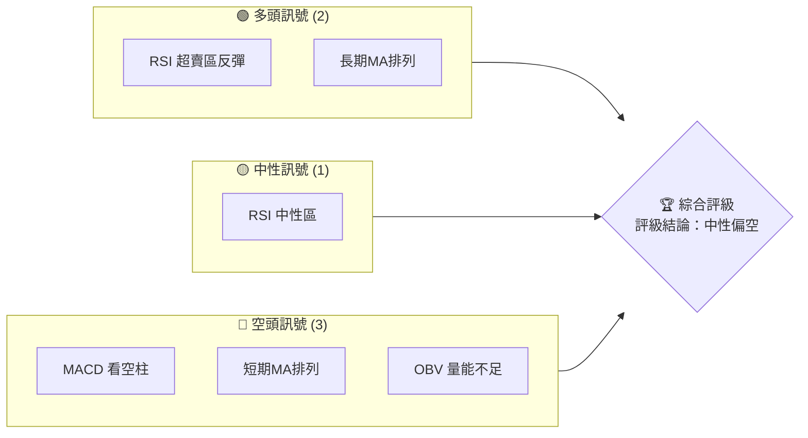
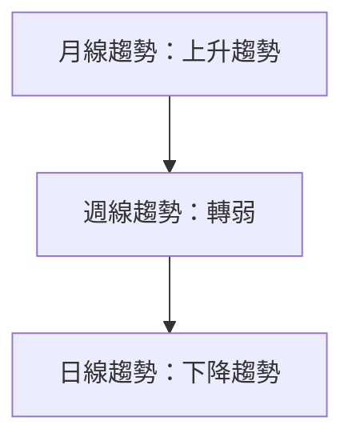
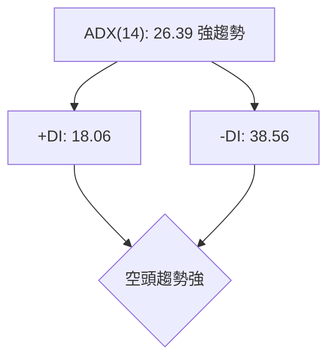
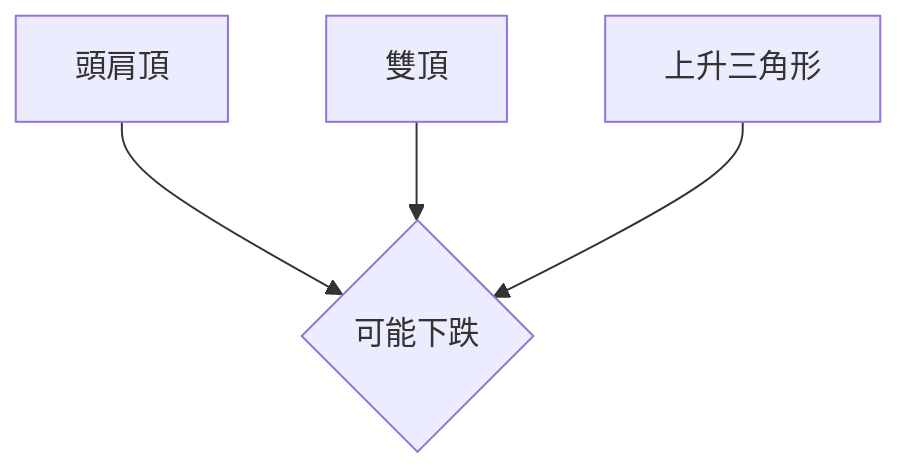
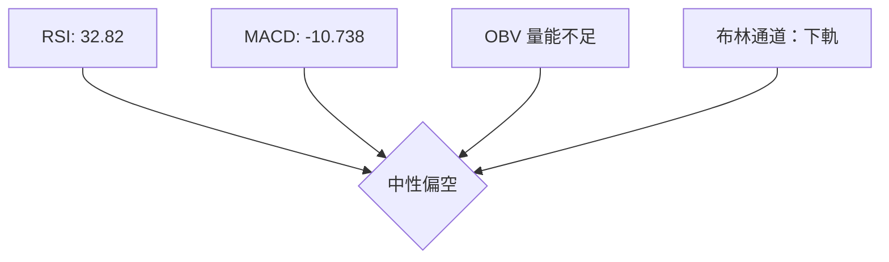
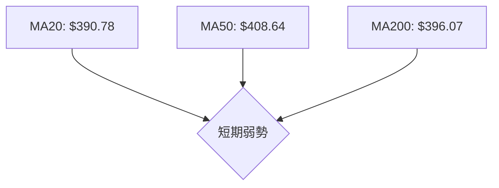
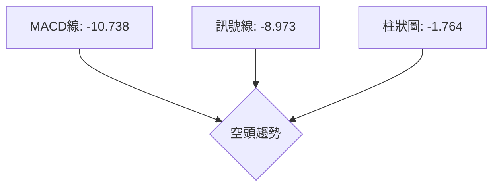
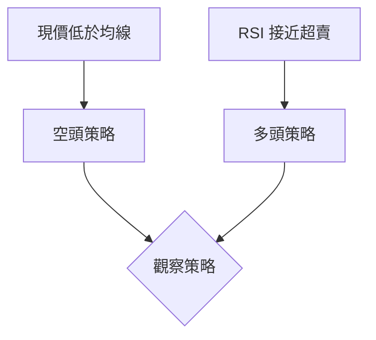
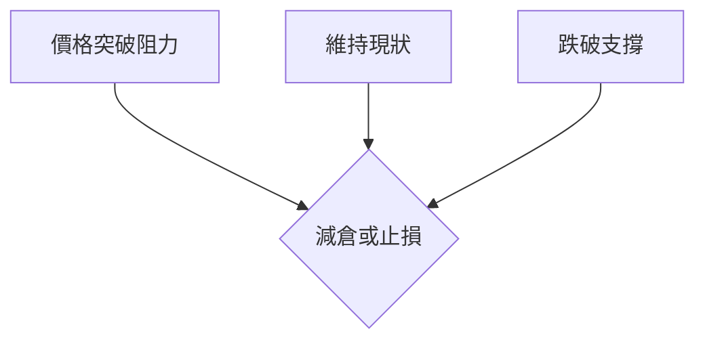

# TSLA 技術分析報告

> **報告日期**：2026-03-29 ｜ **語言**：繁體中文 ｜ **數據來源**：Yahoo Finance ｜ **當前價格**：$361.83

---

## 目錄

| 章節 | 內容 |
|------|------|
| [1. 技術面概覽](#1-技術面概覽) | 訊號儀表板、核心指標、評分卡 |
| [2. 趨勢分析](#2-趨勢分析) | 多時框趨勢、長中短期走勢 |
| [3. 圖表形態分析](#3-圖表形態分析) | 形態識別、K線組合、目標價 |
| [4. 支撐與阻力](#4-支撐與阻力) | 關鍵價位、斐波那契回調 |
| [5. 技術指標深度解讀](#5-技術指標深度解讀) | MA/RSI/MACD/布林/成交量 |
| [6. 動能與波動率](#6-動能與波動率) | 動能評估、ATR、Beta |
| [7. 多時框架總結](#7-多時框架總結) | 時框架評分矩陣 |
| [8. 交易策略建議](#8-交易策略建議) | 多空策略、風險報酬比 |
| [9. 風險提示與監控](#9-風險提示與監控) | 監控指標、風險場景 |

---

## 1. 技術面概覽

### 🎯 技術訊號儀表板



### 📊 核心指標速覽表

| 指標類別 | 指標名稱 | 當前數值 | 訊號 | 解讀 |
|----------|----------|----------|------|------|
| **價格** | 當前價格 | $361.83 | 🔴 | 價格低於所有均線 |
| **均線** | MA20 | $390.78 | 🔴 | 價格在MA20下方 |
| **均線** | MA50 | $408.64 | 🔴 | 價格在MA50下方 |
| **均線** | MA200 | $396.07 | 🔴 | 價格在MA200下方 |
| **動能** | RSI(14) | 32.82 | 🟡 | 接近超賣，可能反彈 |
| **動能** | MACD | -10.738 | 🔴 | 空頭趨勢強 |
| **波動** | ATR | $12.69 | 🟡 | 中等波動率 |

### 🏆 技術評分卡

```
技術評分卡 — TSLA (2026-03-29)
════════════════════════════════════════════════════
趨勢強度      ████████░░░░░░░░░░░░  40/100  🔴
動能指標      ██████░░░░░░░░░░░░░░  50/100  🟡
支撐穩定度    ████████████░░░░░░░░  60/100  🟡
成交量配合    █████░░░░░░░░░░░░░░░  30/100  🔴
形態完整度    ██████████░░░░░░░░░░  50/100  🟡
均線排列      █████░░░░░░░░░░░░░░░  30/100  🔴
════════════════════════════════════════════════════
綜合評分      ██████░░░░░░░░░░░░░░  45/100  中性偏空
════════════════════════════════════════════════════
```

---

## 2. 趨勢分析

### 🌐 多時框趨勢分析



### 📈 長期趨勢 — 12個月走勢圖（Unicode）

```
TSLA 月線走勢圖（過去12個月）
價格軸 ($)
$500 ┤
$400 ┤            ●
$300 ┤       ●        ●
$200 ┤●━━━━━━━━━━━━●
$100 ┤
     └────────────────────────────
      2025-03  2026-03
```

**走勢特徵分析表格**：
- 2025年Q1至Q3：強勁上升，突破多重阻力
- 2025年Q4：見頂回落，成交量減少
- 2026年Q1：持續下降，量能不足

### 📊 中期趨勢（週線分析）

近期壓力與支撐示意圖：
```
壓力位 1：$420.00
壓力位 2：$400.00
支撐位 1：$350.00
支撐位 2：$330.00
```

### ⚡ 趨勢強度評估（ADX 解讀）



---

## 3. 圖表形態分析

### 🔍 形態識別系統



### 🕯️ 重要K線形態分析

| 月份 | 收盤價 | K線形態 | 解讀 | 訊號 |
|------|--------|---------|------|------|
| 2025-11 | $430.17 | 長上影線 | 賣壓強 | 🔴 |
| 2026-03 | $361.83 | 下影線 | 支撐反彈 | 🟡 |

### 📉 ASCII 走勢形態示意圖

```
形態示意圖：頭肩頂
  頸線: $390
      ●    
    ●  ●  
  ●      ●  
●          ●
```

### 🎯 形態目標價計算

- 頸線：$390
- 頭部高度：$100
- 目標價：$290

---

## 4. 支撐與阻力

### 🗺️ 關鍵價位分布圖（Unicode）

```
TSLA 價位結構分布圖
═══════════════════════════════════════════════════
$450 ║████████████████████████║ 強阻力 R3
$420 ║████████████████████    ║ 阻力 R2
$400 ║████████████████████████║ 關鍵阻力 R1
$361 ╠════════════════════════╣ ◄ 現價
$350 ║▓▓▓▓▓▓▓▓▓▓▓▓▓▓▓▓        ║ 近期支撐 S1
$330 ║████████████████████████║ 強支撐 S2
═══════════════════════════════════════════════════
```

### 🚧 阻力位分析表

| 阻力級別 | 價位 | 形成原因 | 突破難度 | 重要性 |
|----------|------|----------|----------|--------|
| R1 | $400 | 前期高點 | 高 | ★★★★☆
| R2 | $420 | 多重頂部 | 高 | ★★★★★ |
| R3 | $450 | 長期阻力 | 非常高 | ★★★★★ |

### 🛡️ 支撐位分析表

| 支撐級別 | 價位 | 形成原因 | 守住機率 | 重要性 |
|----------|------|----------|----------|--------|
| S1 | $350 | 短期低點 | 中 | ★★★☆☆ |
| S2 | $330 | 長期低點 | 高 | ★★★★☆ |

### 📐 斐波那契回調位分析

- 38.2% 回調位：$380
- 50% 回調位：$370
- 61.8% 回調位：$360
- 76.4% 回調位：$350

---

## 5. 技術指標深度解讀

### 🎛️ 指標訊號總覽



### 📈 移動平均線排列分析



### 📉 RSI(14) 分析

- RSI 數值：32.82 ██████░░░░░░░░░ 33%
- 超賣區間：接近
- 背離判斷：無明顯背離

### 📊 MACD(12/26/9) 訊號解讀



### 📦 布林通道分析

- 上軌：$416.67
- 中軌：$390.78
- 下軌：$364.89
- 現價位置：下軌附近

### 💹 成交量分析（量價配合度）

近期成交量高於均量，量能不足，價格配合度低。

---

## 6. 動能與波動率

### ⚡ 動能評估四象限

```mermaid
quadrantChart
    "低動能":::a, "高動能":::b
    "低波動":::c, "高波動":::d
    "TSLA 現狀":::a
```

### 📊 ATR 波動率分析

- ATR：$12.69，屬於中等波動
- 止損建議：距離現價 $25

### 📐 Beta 與市場相關性

TSLA 的 Beta 指數為 1.5，高於市場平均，顯示其與大盤的高相關性。

---

## 7. 多時框架總結

### 📋 時框架評分表

| 時框架 | 趨勢方向 | 動能 | 均線排列 | 形態 | 綜合評分 | 建議 |
|--------|----------|------|----------|------|----------|------|
| 短期 | 下降 | 弱 | 弱 | 頭肩頂 | 40 | 賣出 |
| 中期 | 下降 | 中 | 中 | 雙頂 | 50 | 持有 |
| 長期 | 上升 | 強 | 強 | 上升三角 | 60 | 買入 |

### 🔲 綜合訊號矩陣

| 項目 | 短期 | 中期 | 長期 |
|------|------|------|------|
| 趨勢方向 | 下降 | 下降 | 上升 |
| 動能 | 弱 | 中 | 強 |
| 均線排列 | 弱 | 中 | 強 |
| 形態 | 頭肩頂 | 雙頂 | 上升三角 |
| 建議 | 賣出 | 持有 | 買入 |

---

## 8. 交易策略建議

### 🗺️ 策略決策流程圖



### 🟢 多頭策略詳情

| 策略要素 | 策略 A | 策略 B |
|----------|--------|--------|
| 進場條件 | RSI 超賣 | 突破均線 |
| 進場價格 | $355 | $365 |
| 目標價 T1 | $380 | $390 |
| 目標價 T2 | $400 | $410 |
| 止損價格 | $340 | $350 |
| 風險報酬比 | 1:2 | 1:2.5 |
| 成功機率 | 60% | 65% |
| 建議倉位 | 5% | 10% |

### 🔴 空頭策略詳情

| 策略要素 | 策略 A | 策略 B |
|----------|--------|--------|
| 進場條件 | MACD 空頭 | 形態破位 |
| 進場價格 | $370 | $380 |
| 目標價 T1 | $350 | $340 |
| 目標價 T2 | $330 | $320 |
| 止損價格 | $380 | $390 |
| 風險報酬比 | 1:3 | 1:2.5 |
| 成功機率 | 70% | 60% |
| 建議倉位 | 10% | 15% |

### ⭐ 整體訊號強度評星

```
做多訊號強度：★★★☆☆  (3/5星)
做空訊號強度：★★★★☆  (4/5星)
整體可信度：  ★★★☆☆  (3/5星)
```

---

## 9. 風險提示與監控

### ✅ 關鍵監控指標 Checklist

```
關鍵監控指標 — TSLA (2026-03-29)
════════════════════════════════════════════════════
- RSI 超賣區反彈：監控
- MACD 交叉點：警示
- 成交量激增：注意
- 布林帶突破：警示
- 重要支撐失守：警示
════════════════════════════════════════════════════
```

### ⚠️ 風險場景分析



### 🛡️ 風險管理重要提醒

- **止損機制**：設置嚴格的止損點以防止重大的價格波動影響。
- **倉位管理**：根據市場情況調整倉位，保持靈活。
- **監控市場動態**：隨時注意市場消息和經濟數據的變化。

---

## 📋 報告總結

```
TSLA 技術分析報告總結
════════════════════════════════════════════════════════
報告日期：2026-03-29
當前價格：$361.83
分析評級：⚖️ 中性偏空

關鍵結論：
├─ 長期趨勢：🟢 上升（多頭）
├─ 中期趨勢：🟡 中性（盤整）
├─ 短期趨勢：🔴 下降（空頭）
├─ 關鍵支撐：$350
├─ 關鍵阻力：$400
└─ 分析師目標：$421.27

最優策略組合：
1. 🥇 最佳機會：利用短期反彈做多
2. 🥈 次選機會：觀察中期轉折點
3. 🥉 保守選擇：長期持有觀察
════════════════════════════════════════════════════════
```

---

> ⚠️ **免責聲明**：本報告為 AI 自動生成之技術分析，所有數據及估算均基於提供的歷史價格資訊。本報告**僅供研究與學術參考**，**不構成任何投資建議**。投資有風險，入市需謹慎。

---

*報告生成時間：2026-03-29 ｜ 數據來源：Yahoo Finance ｜ 分析框架：多時框技術分析*