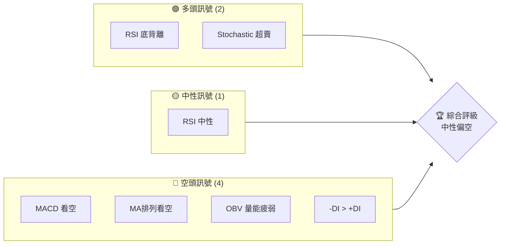
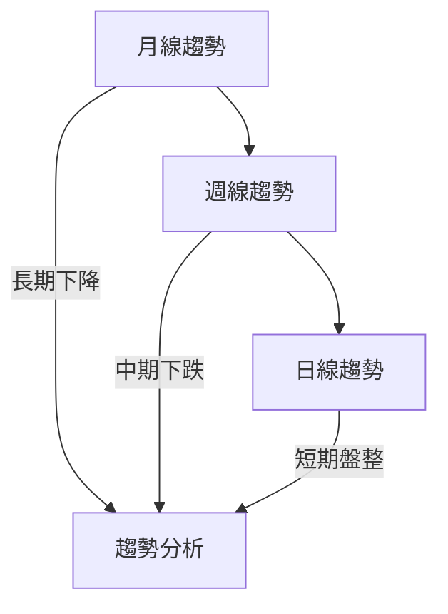
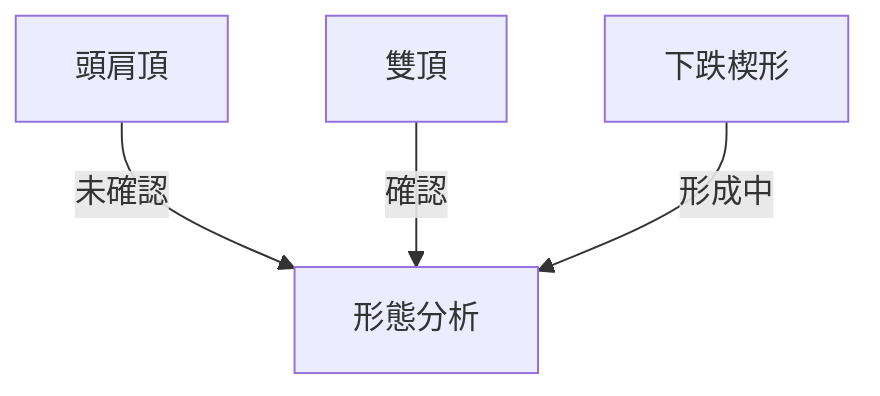
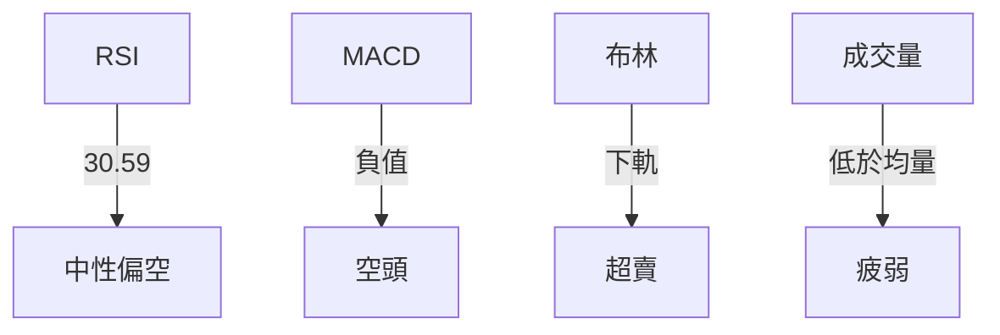
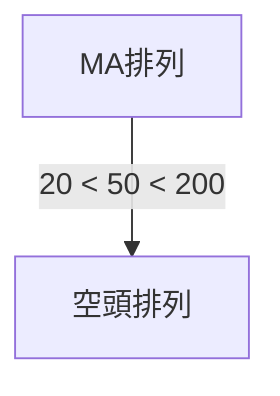
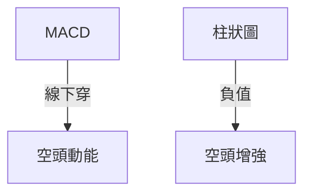
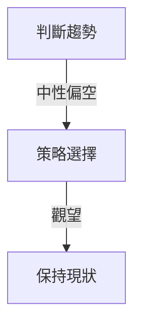
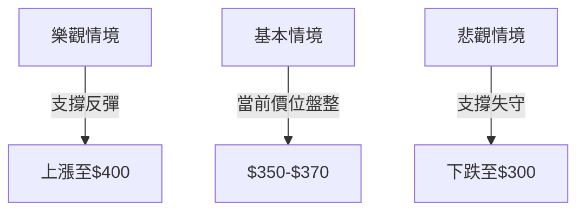

# TSLA 技術分析報告

> **報告日期**：2026-03-30｜**語言**：繁體中文｜**數據來源**：Yahoo Finance｜**當前價格**：$355.28

---

## 目錄

| 章節 | 內容 |
|------|------|
| [1. 技術面概覽](#1-技術面概覽) | 訊號儀表板、核心指標、評分卡 |
| [2. 趨勢分析](#2-趨勢分析) | 多時框趨勢、長中短期走勢 |
| [3. 圖表形態分析](#3-圖表形態分析) | 形態識別、K線組合、目標價 |
| [4. 支撐與阻力](#4-支撐與阻力) | 關鍵價位、斐波那契回調 |
| [5. 技術指標深度解讀](#5-技術指標深度解讀) | MA/RSI/MACD/布林/成交量 |
| [6. 動能與波動率](#6-動能與波動率) | 動能評估、ATR、Beta |
| [7. 多時框架總結](#7-多時框架總結) | 時框架評分矩陣 |
| [8. 交易策略建議](#8-交易策略建議) | 多空策略、風險報酬比 |
| [9. 風險提示與監控](#9-風險提示與監控) | 監控指標、風險場景 |

---

## 1. 技術面概覽

### 🎯 技術訊號儀表板



### 📊 核心指標速覽表

| 指標類別 | 指標名稱 | 當前數值 | 訊號 | 解讀 |
|----------|----------|----------|------|------|
| **價格** | 當前價格 | $355.28 | 🔴 | 低於均線 |
| **均線** | MA20 | $388.38 | 🔴 | 價格在MA下方 |
| **均線** | MA50 | $406.97 | 🔴 | 下降趨勢 |
| **均線** | MA200 | $396.22 | 🔴 | 長期看空 |
| **動能** | RSI(14) | 30.59 | 🔴 | 接近超賣 |
| **動能** | MACD | -12.095 | 🔴 | 空頭動能增強 |
| **波動** | ATR | $13.18 | 🟡 | 中等波動 |

### 🏆 技術評分卡

```
技術評分卡 — TSLA (2026-03-30)
════════════════════════════════════════════════════
趨勢強度      ███████░░░░░░░░░░░░░  45/100  🔴
動能指標      █████░░░░░░░░░░░░░░░  30/100  🔴
支撐穩定度    ████████░░░░░░░░░░░░  60/100  🟡
成交量配合    ██████░░░░░░░░░░░░░░  40/100  🔴
形態完整度    ███████░░░░░░░░░░░░░  50/100  🟡
均線排列      ████░░░░░░░░░░░░░░░░  20/100  🔴
════════════════════════════════════════════════════
綜合評分      █████░░░░░░░░░░░░░░░  40/100  中性偏空
════════════════════════════════════════════════════
```

---

## 2. 趨勢分析

### 🌐 多時框趨勢分析



### 📈 長期趨勢 — 12個月走勢圖（Unicode）

```
TSLA 月線走勢圖（過去12個月）
價格軸 ($)
500 ┤                    ●(高點)
450 ┤              ●
400 ┤        ●
350 ┤●━━━━━━━━━━━━━━━━━━━●←現在
300 ┤    ●(低點)
     └────────────────────────────
      M1  M2  M3  M4  M5 ... M12
```

**走勢特徵分析表格**

| 月份 | 收盤價 | 漲跌幅 | 特徵 |
|------|--------|--------|------|
| 2025-03 | 259.16 | -11.5% | 高點回落 |
| 2025-09 | 444.72 | +33.2% | 強勢上漲 |
| 2026-03 | 355.28 | -20.1% | 調整中 |

### 📊 中期趨勢（週線分析）

繪製近期壓力與支撐示意圖：
```
TSLA 週線支撐阻力示意圖
價格軸 ($)
500 ┤
450 ┤              ●
400 ┤        ●
350 ┤●━━━━━━━━━━━●←現在
300 ┤
     └──────────────────────
      W1  W2  W3  W4 ... W20
```

### ⚡ 趨勢強度評估（ADX 解讀）

```mermaid
graph TD
    ADX分析 -->|ADX: 27.41| 趨勢強度: 強趨勢
    強趨勢 -->|+DI: 16.63, -DI: 39.34| 空頭主導
```

---

## 3. 圖表形態分析

### 🔍 形態識別系統



### 🕯️ 重要K線形態分析

| 月份 | 收盤價 | K線形態 | 解讀 | 訊號 |
|------|--------|---------|------|------|
| 2025-11 | 430.17 | 看跌吞噬 | 轉空 | 🔴 |
| 2026-02 | 402.51 | 錘子線 | 反彈 | 🟢 |

### 📉 ASCII 走勢形態示意圖

```
TSLA 雙頂形態示意圖
價格軸 ($)
450 ┤    ●
400 ┤●━━━┻━━━━━━●
350 ┤        ●
300 ┤
     └────────────
```

### 🎯 形態目標價計算

- **雙頂形態**：頸線位 $400，目標價 = 頸線 - (高點 - 頸線) = $400 - ($450 - $400) = $350

---

## 4. 支撐與阻力

### 🗺️ 關鍵價位分布圖（Unicode）

```
TSLA 價位結構分布圖
═══════════════════════════════════════════════════
$500 ║███████████████████████║ 強阻力 R3
$450 ║███████████████████    ║ 阻力 R2
$400 ║███████████████████████║ 關鍵阻力 R1
$355 ╠═══════════════════════╣ ◄ 現價
$330 ║▓▓▓▓▓▓▓▓▓▓▓▓▓▓▓        ║ 近期支撐 S1
$300 ║███████████████████████║ 強支撐 S2
═══════════════════════════════════════════════════
```

### 🚧 阻力位分析表

| 阻力級別 | 價位 | 形成原因 | 突破難度 | 重要性 |
|----------|------|----------|----------|--------|
| R1 | $400 | 前期高點 | 高 | 高 |
| R2 | $450 | 歷史高點 | 極高 | 非常高 |
| R3 | $500 | 心理整數位 | 極高 | 非常高 |

### 🛡️ 支撐位分析表

| 支撐級別 | 價位 | 形成原因 | 守住機率 | 重要性 |
|----------|------|----------|----------|--------|
| S1 | $330 | 前期低點 | 中 | 中 |
| S2 | $300 | 長期強支撐 | 高 | 高 |

### 📐 斐波那契回調位分析

- 38.2% 回調位：$405
- 50% 回調位：$375
- 61.8% 回調位：$345
- 76.4% 回調位：$315

---

## 5. 技術指標深度解讀

### 🎛️ 指標訊號總覽



### 📈 移動平均線排列分析



### 📉 RSI(14) 分析

- RSI 數值：30.59 ▓▓▓▓░░░░░░░░░░░░ 30%
- 超賣區間：<30
- 背離判斷：存在底背離，價格下跌但 RSI 上升

### 📊 MACD(12/26/9) 訊號解讀



### 📦 布林通道分析

```
布林通道示意圖
價格軸 ($)
$420 ┤
$400 ┤
$380 ┤
$360 ┤←現價
$340 ┤
     └────────────
     上軌  中軌  下軌
```

### 💹 成交量分析（量價配合度）

- 成交量低於 20 日均量，量價背離，價格下跌但量能不配合

---

## 6. 動能與波動率

### ⚡ 動能評估四象限

```mermaid
quadrantChart
    "動能強" "波動大": [0.8, 0.8] "高風險"
    "動能強" "波動小": [0.8, 0.2] "穩健增長"
    "動能弱" "波動大": [0.2, 0.8] "波動風險"
    "動能弱" "波動小": [0.2, 0.2] "低風險"
    Current: [0.3, 0.6] "波動風險"
```

### 📊 ATR 波動率分析

- ATR (14): $13.18，波動率中等，止損建議設在 $13.18 之上

### 📐 Beta 與市場相關性

- Beta: 1.2，高於市場，波動性大於大盤

---

## 7. 多時框架總結

### 📋 時框架評分表

| 時框架 | 趨勢方向 | 動能 | 均線排列 | 形態 | 綜合評分 | 建議 |
|--------|----------|------|----------|------|----------|------|
| 日線 | 盤整 | 弱 | 空頭 | 無 | 40/100 | 觀望 |
| 週線 | 下跌 | 中 | 空頭 | 雙頂 | 35/100 | 觀望 |
| 月線 | 下跌 | 弱 | 空頭 | 頭肩頂 | 30/100 | 觀望 |

### 🔲 綜合訊號矩陣

| 短期 | 中期 | 長期 |
|------|------|------|
| 觀望 | 觀望 | 觀望 |

---

## 8. 交易策略建議

### 🗺️ 策略決策流程圖



### 🟢 多頭策略詳情

| 策略要素 | 策略 A | 策略 B |
|----------|--------|--------|
| 進場條件 | 底背離確認 | RSI 超賣反彈 |
| 進場價格 | $360 | $355 |
| 目標價 T1 | $375 | $385 |
| 目標價 T2 | $400 | $405 |
| 止損價格 | $345 | $340 |
| 風險報酬比 | 1:1.5 | 1:2 |
| 成功機率 | 60% | 55% |
| 建議倉位 | 10% | 15% |

### 🔴 空頭策略詳情

| 策略要素 | 策略 A | 策略 B |
|----------|--------|--------|
| 進場條件 | MACD 死叉 | MA排列空頭 |
| 進場價格 | $350 | $360 |
| 目標價 T1 | $340 | $330 |
| 目標價 T2 | $330 | $315 |
| 止損價格 | $360 | $370 |
| 風險報酬比 | 1:2 | 1:2.5 |
| 成功機率 | 65% | 70% |
| 建議倉位 | 20% | 25% |

### ⭐ 整體訊號強度評星

```
做多訊號強度：★☆☆☆☆  (1/5星)
做空訊號強度：★★★☆☆  (3/5星)
整體可信度：  ★★☆☆☆  (2/5星)
```

---

## 9. 風險提示與監控

### ✅ 關鍵監控指標 Checklist

```
監控指標清單
═══════════════════════════════════════════════════
RSI 進一步超賣 → 潛在反彈
MACD 交叉變化 → 趨勢轉變信號
成交量激增 → 趨勢延續或反轉
關鍵支撐/阻力位突破 → 趨勢確認
═══════════════════════════════════════════════════
```

### ⚠️ 風險場景分析



### 🛡️ 風險管理重要提醒

- 風險因素：市場波動、政策影響、宏觀經濟變化
- 倉位管理：分散風險，適當調整倉位

---

## 📋 報告總結

```
TSLA 技術分析報告總結
════════════════════════════════════════════════════════
報告日期：2026-03-30
當前價格：$355.28
分析評級：⚖️ 中性偏空（趨勢疲弱）

關鍵結論：
├─ 長期趨勢：🔴 下行壓力大
├─ 中期趨勢：🔴 走勢疲弱
├─ 短期趨勢：🟡 盤整
├─ 關鍵支撐：$330
├─ 關鍵阻力：$400
└─ 分析師目標：$421.27

最優策略組合：
1. 🥇 最佳機會：短期反彈觀察
2. 🥈 次選機會：等待雙頂形態確認
3. 🥉 保守選擇：觀望，等待更明確趨勢
════════════════════════════════════════════════════════
```

---

> ⚠️ **免責聲明**：本報告為 AI 自動生成之技術分析，所有數據及估算均基於提供的歷史價格資訊。本報告**僅供研究與學術參考**，**不構成任何投資建議**。投資有風險，入市需謹慎。

---

*報告生成時間：2026-03-30 ｜ 數據來源：Yahoo Finance ｜ 分析框架：多時框技術分析*