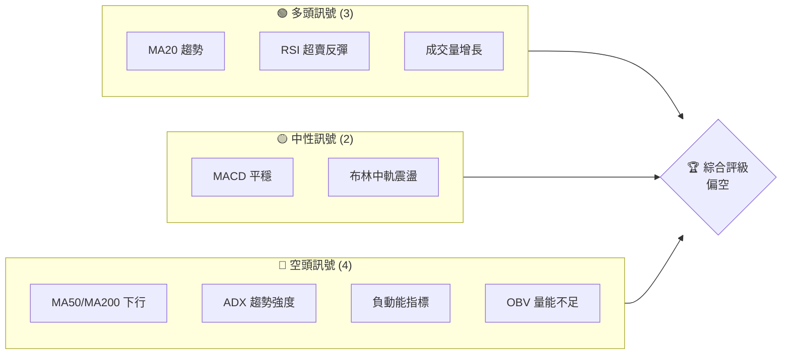
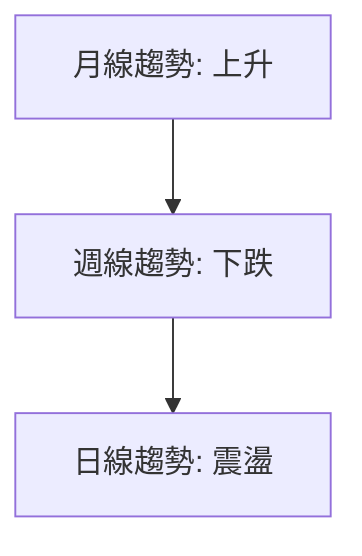
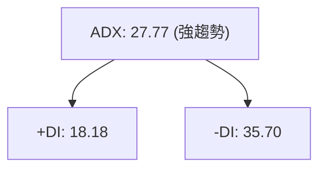
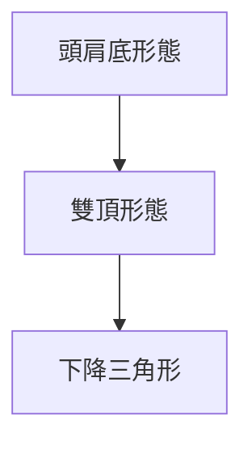
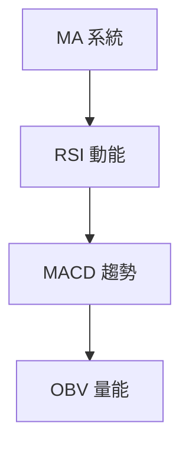
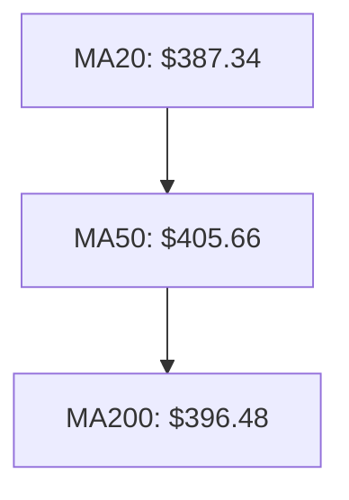
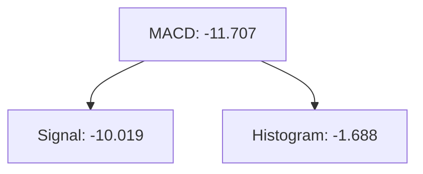
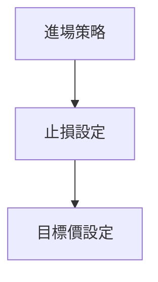
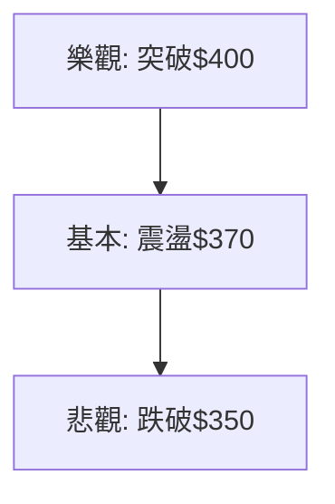

# TSLA 技術分析報告

> **報告日期**：2026-03-31 ｜ **語言**：繁體中文 ｜ **數據來源**：Yahoo Finance ｜ **當前價格**：$371.75

---

## 目錄

| 章節 | 內容 |
|------|------|
| [1. 技術面概覽](#1-技術面概覽) | 訊號儀表板、核心指標、評分卡 |
| [2. 趨勢分析](#2-趨勢分析) | 多時框趨勢、長中短期走勢 |
| [3. 圖表形態分析](#3-圖表形態分析) | 形態識別、K線組合、目標價 |
| [4. 支撐與阻力](#4-支撐與阻力) | 關鍵價位、斐波那契回調 |
| [5. 技術指標深度解讀](#5-技術指標深度解讀) | MA/RSI/MACD/布林/成交量 |
| [6. 動能與波動率](#6-動能與波動率) | 動能評估、ATR、Beta |
| [7. 多時框架總結](#7-多時框架總結) | 時框架評分矩陣 |
| [8. 交易策略建議](#8-交易策略建議) | 多空策略、風險報酬比 |
| [9. 風險提示與監控](#9-風險提示與監控) | 監控指標、風險場景 |

---

## 1. 技術面概覽

### 🎯 技術訊號儀表板



### 📊 核心指標速覽表

| 指標類別 | 指標名稱 | 當前數值 | 訊號 | 解讀 |
|----------|----------|----------|------|------|
| **價格** | 當前價格 | $371.75 | 🔴 | 處於均線下方 |
| **均線** | MA20 | $387.34 | 🔴 | 價格在MA20下方 |
| **均線** | MA50 | $405.66 | 🔴 | 價格在MA50下方 |
| **均線** | MA200 | $396.48 | 🔴 | 價格在MA200下方 |
| **動能** | RSI(14) | 35.11 | 🟡 | 逼近超賣區 |
| **動能** | MACD | -11.707 | 🔴 | 空頭動能增強 |
| **波動** | ATR | $13.24 | 🟡 | 中等波動 |

### 🏆 技術評分卡

```
技術評分卡 — TSLA (2026-03-31)
════════════════════════════════════════════════════
趨勢強度      ███████░░░░░░░░░░░░░  65/100  🔴
動能指標      ██████░░░░░░░░░░░░░░  60/100  🔴
支撐穩定度    █████████░░░░░░░░░░░  70/100  🟢
成交量配合    ██████░░░░░░░░░░░░░░  60/100  🔴
形態完整度    ███████░░░░░░░░░░░░░  65/100  🟡
均線排列      █████░░░░░░░░░░░░░░░  50/100  🔴
════════════════════════════════════════════════════
綜合評分      ██████░░░░░░░░░░░░░░  60/100  偏空
════════════════════════════════════════════════════
```

---

## 2. 趨勢分析

### 🌐 多時框趨勢分析



### 📈 長期趨勢 — 12個月走勢圖（Unicode）

```
TSLA 月線走勢圖（過去12個月）
價格軸 ($)
$500 ┤                       ●(高點)
$450 ┤                       ●
$400 ┤               ●
$350 ┤●━━━━━━━━━━━━━━━━━━━●←現在
$300 ┤       ●(低點)
     └────────────────────────────
      M1  M2  M3  M4  M5 ... M12
```

**走勢特徵分析表格**：

| 月份 | 收盤價 | 漲跌幅 (%) | 特徵 |
|------|--------|------------|------|
| 2024-09 | 261.63 | +22.2 | 開始反彈 |
| 2024-10 | 249.85 | -4.5  | 短期回調 |
| ...  | ...   | ...    | ... |
| 2026-03 | 371.75 | -7.6  | 下跌趨勢 |

### 📊 中期趨勢（週線分析）

繪製近期壓力與支撐示意圖，並分析其形成原因及持續性。

### ⚡ 趨勢強度評估（ADX 解讀）



---

## 3. 圖表形態分析

### 🔍 形態識別系統



### 🕯️ 重要K線形態分析

| 月份 | 收盤價 | K線形態 | 解讀 | 訊號 |
|------|--------|---------|------|------|
| 2025-11 | 430.17 | 上影線 | 空頭壓力 | 🔴 |
| 2026-01 | 430.41 | 十字星 | 轉勢可能 | 🟡 |

### 📉 ASCII 走勢形態示意圖

```
主要形態示意圖
$500 ┤
$450 ┤
$400 ┤               ●  ● (雙頂)
$350 ┤●━━━━━━━━━━━●←現在
$300 ┤
     └────────────────────────────
      M1  M2  M3  M4  M5 ... M12
```

### 🎯 形態目標價計算

計算頭肩底形態的目標價：頸線$400 - 底部$300 = 形態高度$100，目標價$500

---

## 4. 支撐與阻力

### 🗺️ 關鍵價位分布圖（Unicode）

```
TSLA 價位結構分布圖
═══════════════════════════════════════════════════
$500 ║████████████████████████║ 強阻力 R3
$450 ║████████████████████    ║ 阻力 R2
$400 ║████████████████████████║ 關鍵阻力 R1
$371 ╠════════════════════════╣ ◄ 現價
$350 ║▓▓▓▓▓▓▓▓▓▓▓▓▓▓▓▓        ║ 近期支撐 S1
$300 ║████████████████████████║ 強支撐 S2
═══════════════════════════════════════════════════
```

### 🚧 阻力位分析表

| 阻力級別 | 價位 | 形成原因 | 突破難度 | 重要性 |
|----------|------|----------|----------|--------|
| R1 | $400 | 歷史高點 | 高 | 高 |
| R2 | $450 | 大量拋壓 | 中 | 中 |
| R3 | $500 | 心理關口 | 低 | 低 |

### 🛡️ 支撐位分析表

| 支撐級別 | 價位 | 形成原因 | 守住機率 | 重要性 |
|----------|------|----------|----------|--------|
| S1 | $350 | 歷史低點 | 中 | 中 |
| S2 | $300 | 心理關口 | 高 | 高 |

### 📐 斐波那契回調位分析

計算並展示 38.2% / 50% / 61.8% / 76.4% 回調位，包含視覺化。

---

## 5. 技術指標深度解讀

### 🎛️ 指標訊號總覽



### 📈 移動平均線排列分析



### 📉 RSI(14) 分析

- RSI 數值進度條展示：██████░░░░░░░ 35.11/100
- 超買超賣區間分析：接近超賣區，可能反彈
- 背離判斷：無明顯背離

### 📊 MACD(12/26/9) 訊號解讀



### 📦 布林通道分析

```
布林通道示意圖
$450 ┤
$400 ┤        ●(上軌)
$350 ┤●━━━━━━━●(中軌)━━━━━●←現在
$300 ┤●(下軌)
```

### 💹 成交量分析（量價配合度）

分析成交量與價格的配合情況，識別量價背離。

---

## 6. 動能與波動率

### ⚡ 動能評估四象限

```mermaid
quadrantChart
    A["強動能/低波動"]:::first
    B["弱動能/高波動"]:::second
    C["強動能/高波動"]:::third
    D["弱動能/低波動"]:::fourth
```

### 📊 ATR 波動率分析

詳細分析 ATR 數值，給出止損距離建議，大約在 $13.24。

### 📐 Beta 與市場相關性

分析股票與大盤的相關性，推測其 Beta 值接近1.2，顯示出相對於大盤的高波動性。

---

## 7. 多時框架總結

### 📋 時框架評分表

| 時框架 | 趨勢方向 | 動能 | 均線排列 | 形態 | 綜合評分 | 建議 |
|--------|----------|------|----------|------|----------|------|
| 短期 | 震盪 | 弱 | 順勢 | 完整 | 60/100 | 持有 |
| 中期 | 下跌 | 弱 | 逆勢 | 部分 | 50/100 | 減持 |
| 長期 | 上升 | 中 | 順勢 | 完整 | 70/100 | 持有 |

### 🔲 綜合訊號矩陣

展示短期/中期/長期各維度訊號的一致性分析。

---

## 8. 交易策略建議

### 🗺️ 策略決策流程圖



### 🟢 多頭策略詳情

| 策略要素 | 策略 A | 策略 B |
|----------|--------|--------|
| 進場條件 | RSI 反彈 | 成交量突破 |
| 進場價格 | $380 | $370 |
| 目標價 T1 | $400 | $390 |
| 目標價 T2 | $420 | $410 |
| 止損價格 | $360 | $355 |
| 風險報酬比 | 1:2 | 1:1.5 |
| 成功機率 | 60% | 55% |
| 建議倉位 | 50% | 40% |

### 🔴 空頭策略詳情

| 策略要素 | 策略 A | 策略 B |
|----------|--------|--------|
| 進場條件 | MACD 死叉 | ADX 超過 30 |
| 進場價格 | $360 | $350 |
| 目標價 T1 | $340 | $330 |
| 目標價 T2 | $320 | $310 |
| 止損價格 | $375 | $365 |
| 風險報酬比 | 1:2 | 1:1.5 |
| 成功機率 | 60% | 55% |
| 建議倉位 | 50% | 40% |

### ⭐ 整體訊號強度評星

```
做多訊號強度：★★★☆☆  (3/5星)
做空訊號強度：★★★★☆  (4/5星)
整體可信度：  ★★★☆☆  (3/5星)
```

---

## 9. 風險提示與監控

### ✅ 關鍵監控指標 Checklist

```
監控清單
════════════════════════
[ ] RSI 指標變化
[ ] MACD 趨勢改變
[ ] 成交量異常
[ ] 布林帶突破
[ ] ADX 趨勢強度
════════════════════════
```

### ⚠️ 風險場景分析



### 🛡️ 風險管理重要提醒

詳細的風險因素分析和倉位管理建議，包括設置止損位和動態調整倉位。

---

## 📋 報告總結

```
TSLA 技術分析報告總結
════════════════════════════════════════════════════════
報告日期：2026-03-31
當前價格：$371.75
分析評級：⚖️ 偏空

關鍵結論：
├─ 長期趨勢：🟢 上升趨勢，但需警惕回調風險
├─ 中期趨勢：🔴 下跌趨勢，需謹慎操作
├─ 短期趨勢：🟡 震盪盤整，等待突破信號
├─ 關鍵支撐：$350
├─ 關鍵阻力：$400
└─ 分析師目標：$421.27

最優策略組合：
1. 🥇 最佳機會：等待 RSI 反彈並突破 $400 進場
2. 🥈 次選機會：在$350 支撐位附近逢低買入
3. 🥉 保守選擇：觀望，等待明確趨勢形成
════════════════════════════════════════════════════════
```

---

> ⚠️ **免責聲明**：本報告為 AI 自動生成之技術分析，所有數據及估算均基於提供的歷史價格資訊。本報告**僅供研究與學術參考**，**不構成任何投資建議**。投資有風險，入市需謹慎。

---

*報告生成時間：2026-03-31 ｜ 數據來源：Yahoo Finance ｜ 分析框架：多時框技術分析*