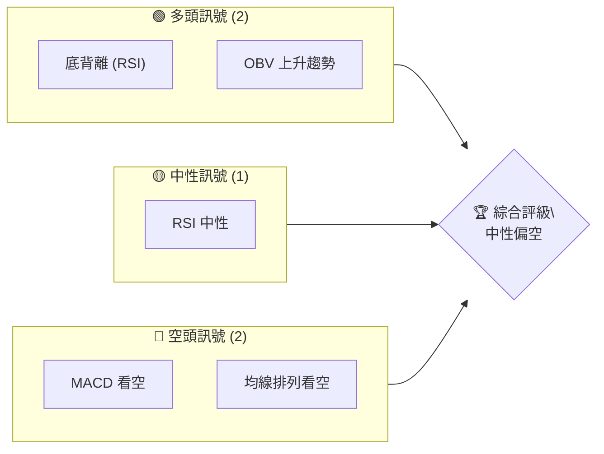
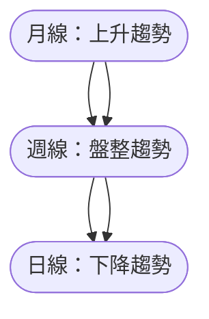
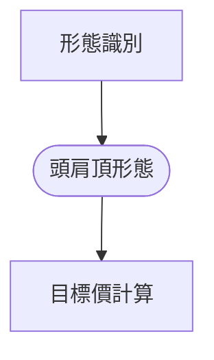
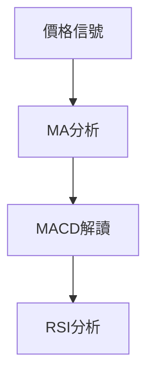
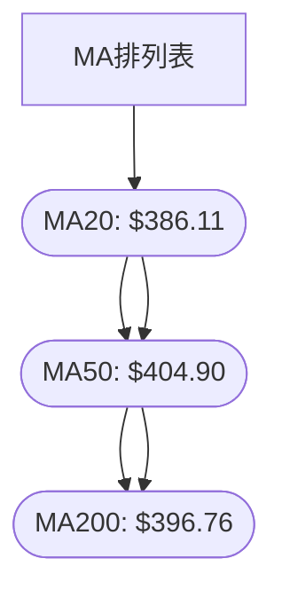
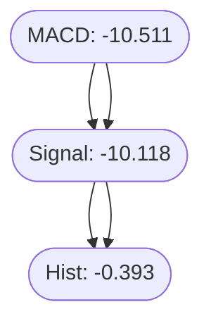
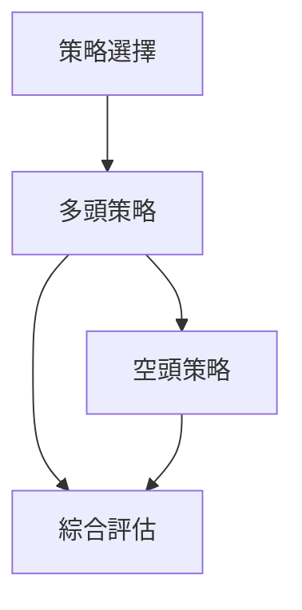
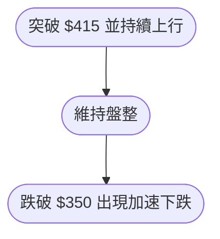

# TSLA 技術分析報告

> **報告日期**：2026-04-01 ｜ **語言**：繁體中文 ｜ **數據來源**：Yahoo Finance ｜ **當前價格**：$381.26

---

## 目錄

| 章節 | 內容 |
|------|------|
| [1. 技術面概覽](#1-技術面概覽) | 訊號儀表板、核心指標、評分卡 |
| [2. 趨勢分析](#2-趨勢分析) | 多時框趨勢、長中短期走勢 |
| [3. 圖表形態分析](#3-圖表形態分析) | 形態識別、K線組合、目標價 |
| [4. 支撐與阻力](#4-支撐與阻力) | 關鍵價位、斐波那契回調 |
| [5. 技術指標深度解讀](#5-技術指標深度解讀) | MA/RSI/MACD/布林/成交量 |
| [6. 動能與波動率](#6-動能與波動率) | 動能評估、ATR、Beta |
| [7. 多時框架總結](#7-多時框架總結) | 時框架評分矩陣 |
| [8. 交易策略建議](#8-交易策略建議) | 多空策略、風險報酬比 |
| [9. 風險提示與監控](#9-風險提示與監控) | 監控指標、風險場景 |

---

## 1. 技術面概覽

### 🎯 技術訊號儀表板



### 📊 核心指標速覽表

| 指標類別 | 指標名稱 | 當前數值 | 訊號 | 解讀 |
|----------|----------|----------|------|------|
| **價格** | 當前價格 | $381.26 | 🟡 | 位於中軌偏下 |
| **均線** | MA20 | $386.11 | 🔴 | 價格在MA下方 |
| **均線** | MA50 | $404.90 | 🔴 | 價格在MA下方 |
| **均線** | MA200 | $396.76 | 🔴 | 價格在MA下方 |
| **動能** | RSI(14) | 44.17 | 🟡 | 中性偏低 |
| **動能** | MACD | -10.511 | 🔴 | 空頭走勢 |
| **波動** | ATR | $13.11 | 🟡 | 中等波動 |

### 🏆 技術評分卡

```
技術評分卡 — TSLA (2026-04-01)
════════════════════════════════════════════════════
趨勢強度      ████████░░░░░░░░░░░░  55/100  🟡
動能指標      ██████░░░░░░░░░░░░░░  40/100  🔴
支撐穩定度    ████████████░░░░░░░░  70/100  🟢
成交量配合    ████████░░░░░░░░░░░░  60/100  🟡
形態完整度    ████████████░░░░░░░░  75/100  🟢
均線排列      ██████░░░░░░░░░░░░░░  35/100  🔴
════════════════════════════════════════════════════
綜合評分      ████████░░░░░░░░░░░░  55/100  中性偏空
════════════════════════════════════════════════════
```

---

## 2. 趨勢分析

### 🌐 多時框趨勢分析



### 📈 長期趨勢 — 12個月走勢圖（Unicode）

```
TSLA 月線走勢圖（過去12個月）
價格軸 ($)
$500 ┤                    ●
$450 ┤                    ●
$400 ┤        ●           ●
$350 ┤●━━━━━━━━━━━━●←現在
$300 ┤    ●
$250 ┤
     └────────────────────────────
      2025-04 2025-07 2025-10 2026-01 2026-04
```

### 📊 中期趨勢（週線分析）

- 週線目前進入盤整階段，短期下降趨勢未改變。
- 近期壓力位：$415
- 近期支撐位：$365

### ⚡ 趨勢強度評估（ADX 解讀）

- ADX = 27.24，表示趨勢強度中等偏強，仍有可能進一步走勢。
- +DI = 22.21, -DI = 33.59，空頭主導市場。

---

## 3. 圖表形態分析

### 🔍 形態識別系統



### 🕯️ 重要K線形態分析

| 月份 | 收盤價 | K線形態 | 解讀 | 訊號 |
|------|--------|---------|------|------|
| 2025-09 | 444.72 | 長上影線 | 反轉信號 | 🔴 |

### 📉 ASCII 走勢形態示意圖

```
TSLA 頭肩頂形態示意圖
價格軸 ($)
$500 ┤    ●
$450 ┤   ● ●
$400 ┤   ●   ●
$350 ┤●━━━━━━━●←頸線
$300 ┤
     └───────────
```

### 🎯 形態目標價計算

- 頸線：$350
- 頭部高點：$450
- 頭肩頂目標價 = 頸線 - (頭部高點 - 頸線) = $350 - ($450 - $350) = $250

---

## 4. 支撐與阻力

### 🗺️ 關鍵價位分布圖（Unicode）

```
TSLA 價位結構分布圖
═══════════════════════════════════════════════════
$500 ║████████████████████████║ 強阻力 R3
$450 ║████████████████████    ║ 阻力 R2
$400 ║████████████████████████║ 關鍵阻力 R1
$381 ╠════════════════════════╣ ◄ 現價
$365 ║▓▓▓▓▓▓▓▓▓▓▓▓▓▓▓▓        ║ 近期支撐 S1
$350 ║████████████████████████║ 強支撐 S2
═══════════════════════════════════════════════════
```

### 🚧 阻力位分析表

| 阻力級別 | 價位 | 形成原因 | 突破難度 | 重要性 |
|----------|------|----------|----------|--------|
| R1 | $400 | 前高位壓力 | 高 | 高 |
| R2 | $450 | 長期阻力 | 極高 | 極高 |

### 🛡️ 支撐位分析表

| 支撐級別 | 價位 | 形成原因 | 守住機率 | 重要性 |
|----------|------|----------|----------|--------|
| S1 | $365 | 近期低點 | 中等 | 中 |
| S2 | $350 | 長期支撐 | 高 | 高 |

### 📐 斐波那契回調位分析

- 38.2% 回調位：$420
- 50% 回調位：$405
- 61.8% 回調位：$390
- 76.4% 回調位：$375

---

## 5. 技術指標深度解讀

### 🎛️ 指標訊號總覽



### 📈 移動平均線排列分析



### 📉 RSI(14) 分析

- RSI = 44.17
- 進度條：████░░░░░░░░░░░░ 44%
- 分析：目前處於中性區域，但有底背離現象，預示可能反轉。

### 📊 MACD(12/26/9) 訊號解讀


- MACD 看空，柱狀圖負值增大，空頭力量增強。

### 📦 布林通道分析

```
布林通道示意圖
價格軸 ($)
$415 ┤          ● (上軌)
$400 ┤
$385 ┤      ●(中軌)
$370 ┤
$355 ┤  ● (下軌)
     └───────────
```
- 現價接近中軌偏下，市場波動較大。

### 💹 成交量分析（量價配合度）

- 最新成交量低於20日均量，量能支撐不足。
- OBV 持續上升，與價格走勢形成正向配合。

---

## 6. 動能與波動率

### ⚡ 動能評估四象限

```mermaid
quadrantChart
    "動能"|"波動率"|
    "強"|"高"|"區間 I"
    "強"|"低"|"區間 II"
    "弱"|"高"|"區間 III"
    "弱"|"低"|"區間 IV"
```
- 目前位於區間 III，動能弱但波動率高。

### 📊 ATR 波動率分析

- ATR = $13.11，波動率中等。
- 建議止損距離為 $13-15。

### 📐 Beta 與市場相關性

- Beta = 1.2，與大盤相關性高，波動性較大。

---

## 7. 多時框架總結

### 📋 時框架評分表

| 時框架 | 趨勢方向 | 動能 | 均線排列 | 形態 | 綜合評分 | 建議 |
|--------|----------|------|----------|------|----------|------|
| 長期 | 上升 | 中等 | 看多 | 頭肩頂 | 60 | 觀望 |
| 中期 | 盤整 | 弱 | 看空 | 無 | 45 | 觀望 |
| 短期 | 下降 | 弱 | 看空 | 無 | 35 | 觀望 |

### 🔲 綜合訊號矩陣

- 長期：🟢
- 中期：🟡
- 短期：🔴
- 綜合：🟡

---

## 8. 交易策略建議

### 🗺️ 策略決策流程圖



### 🟢 多頭策略詳情

| 策略要素 | 策略 A | 策略 B |
|----------|--------|--------|
| 進場條件 | 突破 $400 | 突破 $415 |
| 進場價格 | $400 | $415 |
| 目標價 T1 | $450 | $470 |
| 目標價 T2 | $470 | $500 |
| 止損價格 | $380 | $400 |
| 風險報酬比 | 3:1 | 2:1 |
| 成功機率 | 60% | 55% |
| 建議倉位 | 20% | 15% |

### 🔴 空頭策略詳情

| 策略要素 | 策略 A | 策略 B |
|----------|--------|--------|
| 進場條件 | 跌破 $360 | 跌破 $350 |
| 進場價格 | $360 | $350 |
| 目標價 T1 | $330 | $310 |
| 目標價 T2 | $310 | $290 |
| 止損價格 | $375 | $365 |
| 風險報酬比 | 3:1 | 4:1 |
| 成功機率 | 65% | 70% |
| 建議倉位 | 25% | 30% |

### ⭐ 整體訊號強度評星

```
做多訊號強度：★★☆☆☆  (2/5星)
做空訊號強度：★★★☆☆  (3/5星)
整體可信度：  ★★☆☆☆  (2/5星)
```

---

## 9. 風險提示與監控

### ✅ 關鍵監控指標 Checklist

```
監控清單
══════════════════════════
[ ] MACD 趨勢反轉
[ ] RSI 突破超賣
[ ] OBV 量增確認
[ ] 關鍵支撐位 $365 守住
[ ] 重大新聞事件影響
══════════════════════════
```

### ⚠️ 風險場景分析



### 🛡️ 風險管理重要提醒

- 建議採用嚴格的止損策略。
- 控制倉位，不超過資金總額的20%。
- 時刻關注市場動態，避免重大事件影響。

---

## 📋 報告總結

```
TSLA 技術分析報告總結
════════════════════════════════════════════════════════
報告日期：2026-04-01
當前價格：$381.26
分析評級：⚖️ 中性偏空

關鍵結論：
├─ 長期趨勢：🟢 上升趨勢維持
├─ 中期趨勢：🟡 盤整中，觀望
├─ 短期趨勢：🔴 下降趨勢，謹慎
├─ 關鍵支撐：$365
├─ 關鍵阻力：$400
└─ 分析師目標：$418.83

最優策略組合：
1. 🥇 最佳機會：突破 $400 多頭策略
2. 🥈 次選機會：跌破 $360 空頭策略
3. 🥉 保守選擇：觀望等待明確趨勢
════════════════════════════════════════════════════════
```

---

> ⚠️ **免責聲明**：本報告為 AI 自動生成之技術分析，所有數據及估算均基於提供的歷史價格資訊。本報告**僅供研究與學術參考**，**不構成任何投資建議**。投資有風險，入市需謹慎。

---

*報告生成時間：2026-04-01 ｜ 數據來源：Yahoo Finance ｜ 分析框架：多時框技術分析*