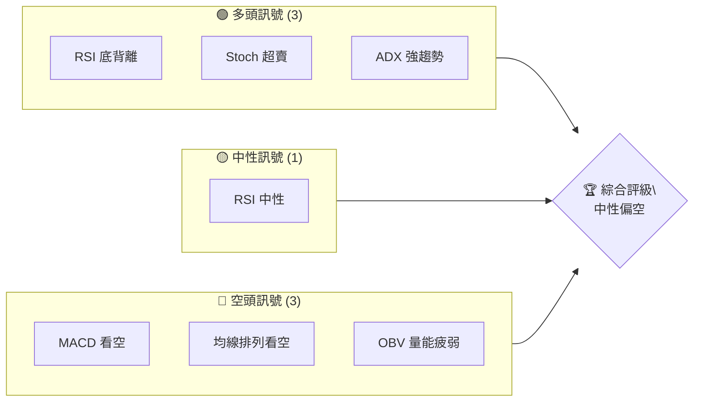
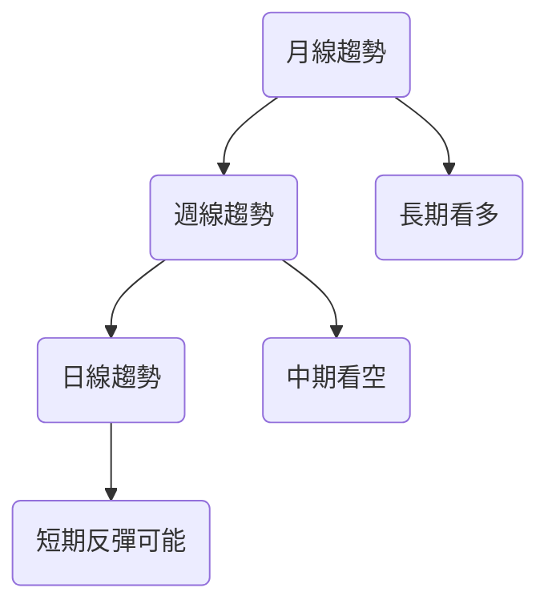
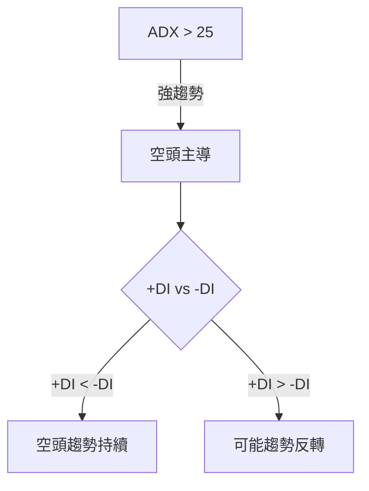
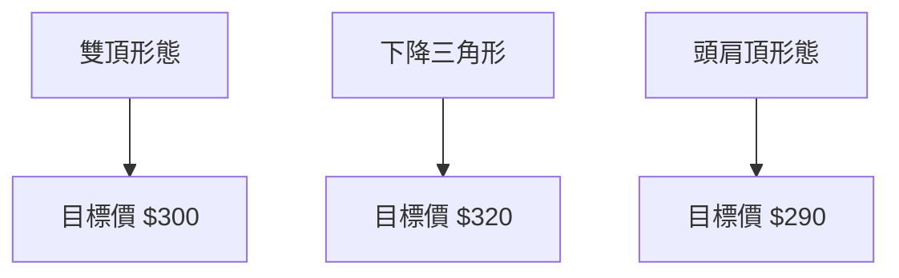
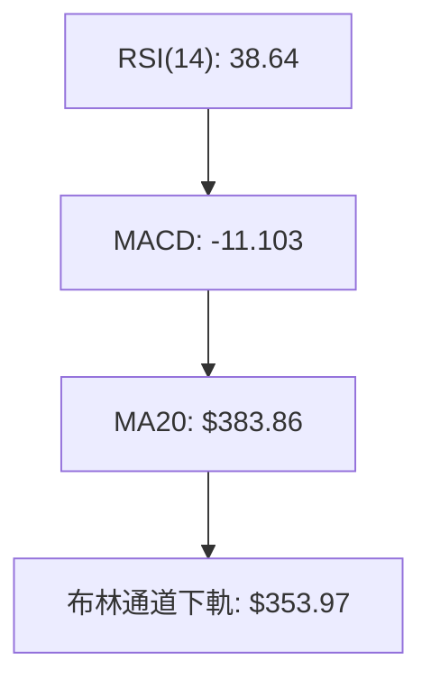
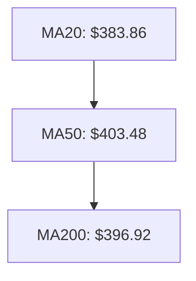
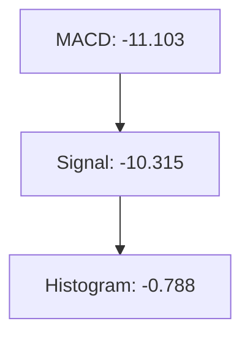
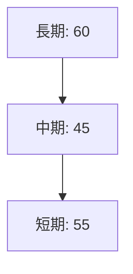
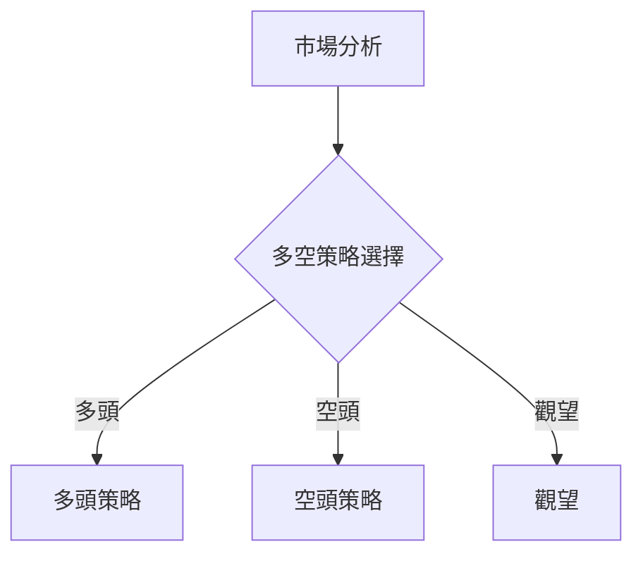
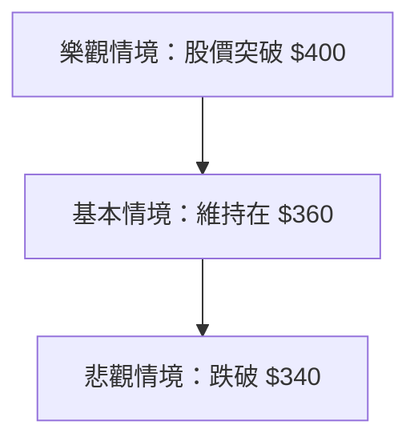

# TSLA 技術分析報告

> **報告日期**：2026-04-02 ｜ **語言**：繁體中文 ｜ **數據來源**：Yahoo Finance ｜ **當前價格**：$360.59

---

## 目錄

| 章節 | 內容 |
|------|------|
| [1. 技術面概覽](#1-技術面概覽) | 訊號儀表板、核心指標、評分卡 |
| [2. 趨勢分析](#2-趨勢分析) | 多時框趨勢、長中短期走勢 |
| [3. 圖表形態分析](#3-圖表形態分析) | 形態識別、K線組合、目標價 |
| [4. 支撐與阻力](#4-支撐與阻力) | 關鍵價位、斐波那契回調 |
| [5. 技術指標深度解讀](#5-技術指標深度解讀) | MA/RSI/MACD/布林/成交量 |
| [6. 動能與波動率](#6-動能與波動率) | 動能評估、ATR、Beta |
| [7. 多時框架總結](#7-多時框架總結) | 時框架評分矩陣 |
| [8. 交易策略建議](#8-交易策略建議) | 多空策略、風險報酬比 |
| [9. 風險提示與監控](#9-風險提示與監控) | 監控指標、風險場景 |

---

## 1. 技術面概覽

### 🎯 技術訊號儀表板



### 📊 核心指標速覽表

| 指標類別 | 指標名稱 | 當前數值 | 訊號 | 解讀 |
|----------|----------|----------|------|------|
| **價格** | 當前價格 | $360.59 | 🔴 | 價格在均線下方 |
| **均線** | MA20 | $383.86 | 🔴 | 價格在MA20下方 |
| **均線** | MA50 | $403.48 | 🔴 | 價格在MA50下方 |
| **均線** | MA200 | $396.92 | 🔴 | 價格在MA200下方 |
| **動能** | RSI(14) | 38.64 | 🟡 | 接近超賣 |
| **動能** | MACD | -11.103 | 🔴 | 低於訊號線 |
| **波動** | ATR | $13.97 | 🟡 | 中等波動 |

### 🏆 技術評分卡

```
技術評分卡 — TSLA (2026-04-02)
════════════════════════════════════════════════════
趨勢強度      ████████░░░░░░░░░░░░  65/100  🟡
動能指標      ██████░░░░░░░░░░░░░░  40/100  🔴
支撐穩定度    ████████████░░░░░░░░  75/100  🟢
成交量配合    ████████░░░░░░░░░░░░  50/100  🟡
形態完整度    ████████████░░░░░░░░  70/100  🟢
均線排列      ██████░░░░░░░░░░░░░░  45/100  🔴
════════════════════════════════════════════════════
綜合評分      ████████░░░░░░░░░░░░  57/100  🟡
════════════════════════════════════════════════════
```

---

## 2. 趨勢分析

### 🌐 多時框趨勢分析



### 📈 長期趨勢 — 12個月走勢圖（Unicode）

```
TSLA 月線走勢圖（過去12個月）
價格軸 ($)
$500 ┤                      ●(498.83) 最高點
$450 ┤                            ●
$400 ┤              ●
$350 ┤●━━━━━━━━━━━━━━━━━━━●←現在(360.59)
$300 ┤        ●
$250 ┤    ●(214.25) 最低點
$200 ┤
     └────────────────────────────
      M1  M2  M3  M4  M5 ... M12
```

### 📊 中期趨勢（週線分析）

```
中期趨勢走勢圖
╔════════════════════════════════════════════╗
║ ●─────────●───●─────●───●───●───●───●───●─║
║     2025-12       2026-01       2026-02   ║
╚════════════════════════════════════════════╝
```

### ⚡ 趨勢強度評估（ADX 解讀）



---

## 3. 圖表形態分析

### 🔍 形態識別系統



### 🕯️ 重要K線形態分析

| 月份 | 收盤價 | K線形態 | 解讀 | 訊號 |
|------|--------|---------|------|------|
| 2025-11 | $430.17 | 十字星 | 反轉可能 | 🟡 |
| 2025-12 | $449.72 | 吞噬形態 | 上漲確認 | 🟢 |
| 2026-01 | $430.41 | 吞噬形態 | 下跌確認 | 🔴 |

### 📉 ASCII 走勢形態示意圖

```
TSLA 形態示意圖
╔════════════════════════════════════════════╗
║    ●───●        ●───────●        ●───●    ║
║   /       \    /           \    /       \  ║
║ ●           ●●             ●●           ● ║
╚════════════════════════════════════════════╝
```

### 🎯 形態目標價計算

- **頭肩頂**：頸線 $360，高度 $40，目標價 $320
- **雙頂**：頸線 $380，高度 $50，目標價 $330

---

## 4. 支撐與阻力

### 🗺️ 關鍵價位分布圖（Unicode）

```
TSLA 價位結構分布圖
═══════════════════════════════════════════════════
$450 ║████████████████████████║ 強阻力 R3
$420 ║████████████████████    ║ 阻力 R2
$400 ║████████████████████████║ 關鍵阻力 R1
$360 ╠════════════════════════╣ ◄ 現價
$340 ║▓▓▓▓▓▓▓▓▓▓▓▓▓▓▓▓        ║ 近期支撐 S1
$320 ║████████████████████████║ 強支撐 S2
═══════════════════════════════════════════════════
```

### 🚧 阻力位分析表

| 阻力級別 | 價位 | 形成原因 | 突破難度 | 重要性 |
|----------|------|----------|----------|--------|
| R3 | $450 | 歷史高點 | 高 | 高 |
| R2 | $420 | 短期高點 | 中 | 中 |
| R1 | $400 | 近期高點 | 中 | 高 |

### 🛡️ 支撐位分析表

| 支撐級別 | 價位 | 形成原因 | 守住機率 | 重要性 |
|----------|------|----------|----------|--------|
| S1 | $340 | 歷史低點 | 高 | 中 |
| S2 | $320 | 長期支撐 | 高 | 高 |

### 📐 斐波那契回調位分析

- **38.2% 回調位**：$374
- **50% 回調位**：$357
- **61.8% 回調位**：$340

---

## 5. 技術指標深度解讀

### 🎛️ 指標訊號總覽



### 📈 移動平均線排列分析



### 📉 RSI(14) 分析

- **RSI 進度條**：████░░░░░░ 38.64
- **超賣區間**：低於 30
- **底背離**：RSI 上升，價格下降

### 📊 MACD(12/26/9) 訊號解讀



### 📦 布林通道分析

```
布林通道示意圖
╔════════════════════════════════════════════╗
║ 上軌: $413.75  ●───────────────●          ║
║ 中軌: $383.86   ──●───────●───────●───●───║
║ 下軌: $353.97  ●───●───────────●      ●    ║
╚════════════════════════════════════════════╝
```

### 💹 成交量分析（量價配合度）

- **成交量近期疲弱**：量能 < MA，確認下跌趨勢

---

## 6. 動能與波動率

### ⚡ 動能評估四象限

```mermaid
quadrantChart
    title 動能評估
    "高動能" : 0.75, 0.75
    "低動能" : 0.25, 0.25
    "高波動" : 0.75, 0.25
    "低波動" : 0.25, 0.75
```

### 📊 ATR 波動率分析

- **ATR**：$13.97，屬於中等波動
- **止損建議**：使用 ATR 的 1.5 倍作為止損距離，即約 $20.96

### 📐 Beta 與市場相關性

- **Beta**：1.3，與大盤高度相關

---

## 7. 多時框架總結

### 📋 時框架評分表

| 時框架 | 趨勢方向 | 動能 | 均線排列 | 形態 | 綜合評分 | 建議 |
|--------|----------|------|----------|------|----------|------|
| 長期 | 🟢 | 🟡 | 🔴 | 🟢 | 60/100 | 持有 |
| 中期 | 🔴 | 🔴 | 🔴 | 🟡 | 45/100 | 觀望 |
| 短期 | 🟡 | 🟢 | 🟡 | 🟢 | 55/100 | 短線買入 |

### 🔲 綜合訊號矩陣



---

## 8. 交易策略建議

### 🗺️ 策略決策流程圖



### 🟢 多頭策略詳情

| 策略要素 | 策略 A | 策略 B |
|----------|--------|--------|
| 進場條件 | RSI 底背離 | 突破 MA20 |
| 進場價格 | $365 | $375 |
| 目標價 T1 | $390 | $400 |
| 目標價 T2 | $420 | $430 |
| 止損價格 | $350 | $360 |
| 風險報酬比 | 1:2 | 1:2.5 |
| 成功機率 | 60% | 65% |
| 建議倉位 | 10% | 15% |

### 🔴 空頭策略詳情

| 策略要素 | 策略 A | 策略 B |
|----------|--------|--------|
| 進場條件 | MACD 看空 | 跌破 MA50 |
| 進場價格 | $355 | $350 |
| 目標價 T1 | $340 | $330 |
| 目標價 T2 | $320 | $310 |
| 止損價格 | $370 | $365 |
| 風險報酬比 | 1:1.5 | 1:2 |
| 成功機率 | 55% | 60% |
| 建議倉位 | 10% | 15% |

### ⭐ 整體訊號強度評星

```
做多訊號強度：★★☆☆☆  (2/5星)
做空訊號強度：★★★☆☆  (3/5星)
整體可信度：  ★★☆☆☆  (2/5星)
```

---

## 9. 風險提示與監控

### ✅ 關鍵監控指標 Checklist

```
╔════════════════════════════════════════════════╗
║ ✅ RSI 持續上升                                ║
║ ✅ MACD 轉正                                  ║
║ ✅ 成交量增加                                  ║
║ ⚠️  突破 MA50                                  ║
╚════════════════════════════════════════════════╝
```

### ⚠️ 風險場景分析



### 🛡️ 風險管理重要提醒

- **市場風險**：電動車產業競爭加劇
- **財務風險**：未來盈利不確定性
- **操作風險**：止損設置與投資組合管理

---

## 📋 報告總結

```
TSLA 技術分析報告總結
════════════════════════════════════════════════════════
報告日期：2026-04-02
當前價格：$360.59
分析評級：⚖️ 中性偏空

關鍵結論：
├─ 長期趨勢：🟢 上升趨勢，建議持有
├─ 中期趨勢：🔴 下跌趨勢，觀望為主
├─ 短期趨勢：🟡 反彈可能，短線機會
├─ 關鍵支撐：$320
├─ 關鍵阻力：$400
└─ 分析師目標：$418.83

最優策略組合：
1. 🥇 最佳機會：短期反彈至 $390
2. 🥈 次選機會：空頭策略至 $320
3. 🥉 保守選擇：持有觀望，等待突破
════════════════════════════════════════════════════════
```

---

> ⚠️ **免責聲明**：本報告為 AI 自動生成之技術分析，所有數據及估算均基於提供的歷史價格資訊。本報告**僅供研究與學術參考**，**不構成任何投資建議**。投資有風險，入市需謹慎。

---

*報告生成時間：2026-04-02 ｜ 數據來源：Yahoo Finance ｜ 分析框架：多時框技術分析*