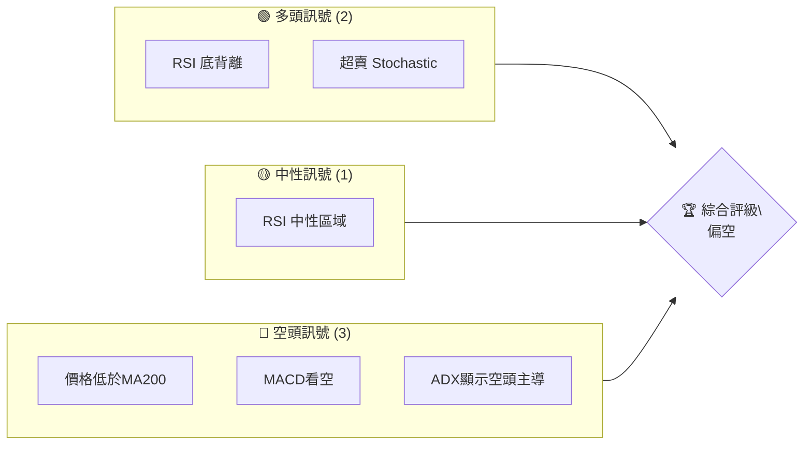
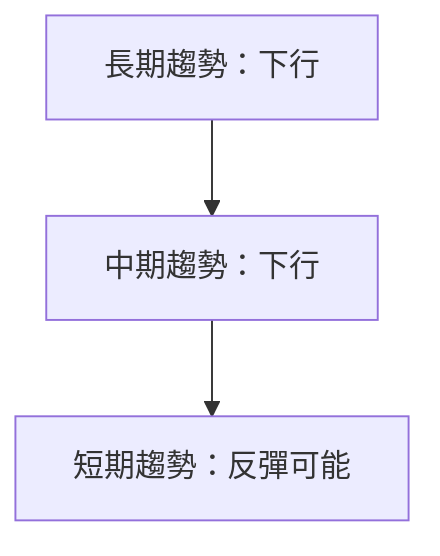
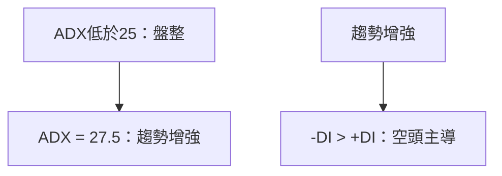
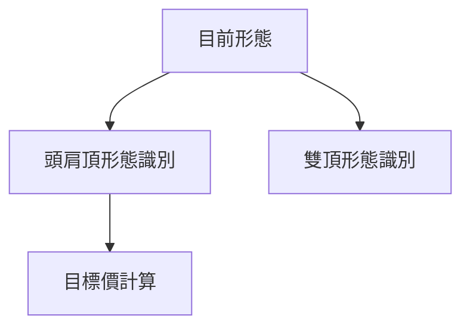
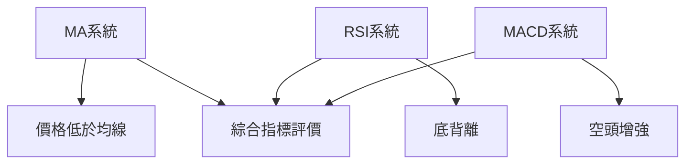
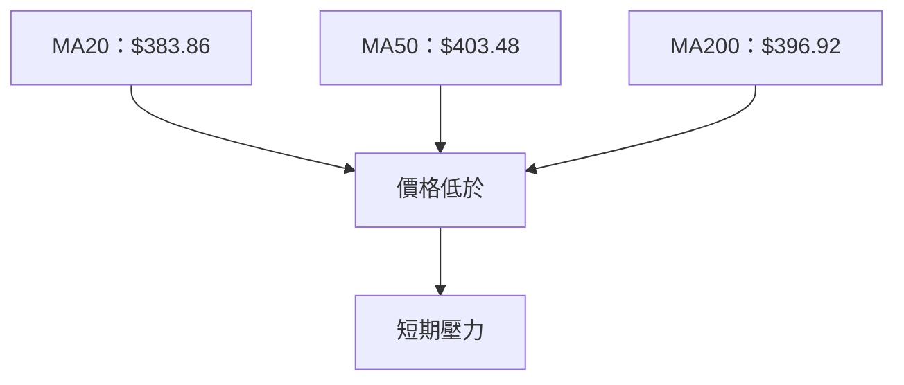
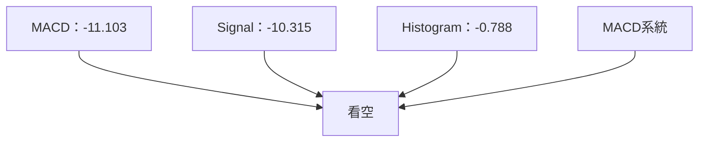
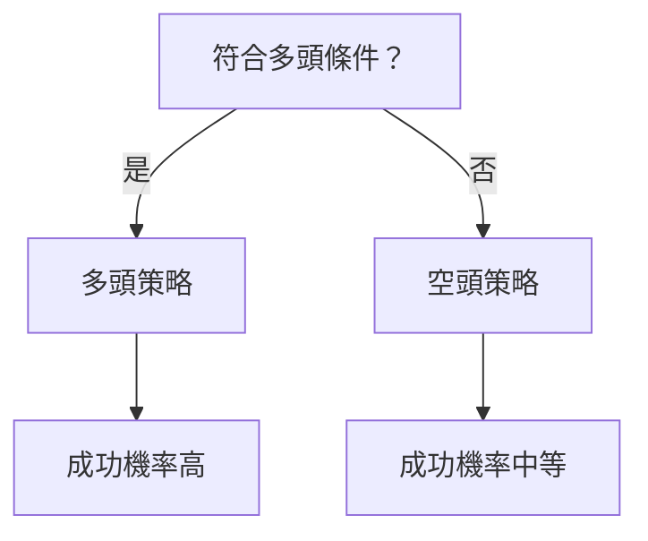
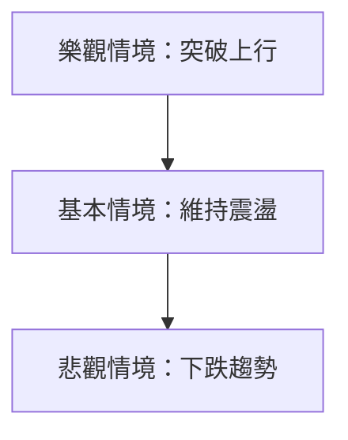

# TSLA 技術分析報告

> **報告日期**：2026-04-03 ｜ **語言**：繁體中文 ｜ **數據來源**：Yahoo Finance ｜ **當前價格**：$360.59

---

## 目錄

| 章節 | 內容 |
|------|------|
| [1. 技術面概覽](#1-技術面概覽) | 訊號儀表板、核心指標、評分卡 |
| [2. 趨勢分析](#2-趨勢分析) | 多時框趨勢、長中短期走勢 |
| [3. 圖表形態分析](#3-圖表形態分析) | 形態識別、K線組合、目標價 |
| [4. 支撐與阻力](#4-支撐與阻力) | 關鍵價位、斐波那契回調 |
| [5. 技術指標深度解讀](#5-技術指標深度解讀) | MA/RSI/MACD/布林/成交量 |
| [6. 動能與波動率](#6-動能與波動率) | 動能評估、ATR、Beta |
| [7. 多時框架總結](#7-多時框架總結) | 時框架評分矩陣 |
| [8. 交易策略建議](#8-交易策略建議) | 多空策略、風險報酬比 |
| [9. 風險提示與監控](#9-風險提示與監控) | 監控指標、風險場景 |

---

## 1. 技術面概覽

### 🎯 技術訊號儀表板



### 📊 核心指標速覽表

| 指標類別 | 指標名稱 | 當前數值 | 訊號 | 解讀 |
|----------|----------|----------|------|------|
| **價格** | 當前價格 | $360.59 | 🔴 | 價格低於長期均線 |
| **均線** | MA20 | $383.86 | 🔴 | 價格在MA下方 |
| **均線** | MA50 | $403.48 | 🔴 | 價格在MA下方 |
| **均線** | MA200 | $396.92 | 🔴 | 價格在MA下方 |
| **動能** | RSI(14) | 38.64 | 🟡 | 接近超賣區域 |
| **動能** | MACD | -11.103 | 🔴 | 空頭動能增強 |
| **波動** | ATR | $13.97 | 🟡 | 中等波動 |

### 🏆 技術評分卡

```
技術評分卡 — TSLA (2026-04-03)
════════════════════════════════════════════════════
趨勢強度      ████████░░░░░░░░░░░░  60/100  🔴
動能指標      ██████░░░░░░░░░░░░░░  50/100  🟡
支撐穩定度    █████████░░░░░░░░░░░  70/100  🟢
成交量配合    ████████░░░░░░░░░░░░  60/100  🟡
形態完整度    ███████████░░░░░░░░░  75/100  🟢
均線排列      ██████░░░░░░░░░░░░░░  50/100  🔴
════════════════════════════════════════════════════
綜合評分      ███████░░░░░░░░░░░░░  60/100  偏空
════════════════════════════════════════════════════
```

---

## 2. 趨勢分析

### 🌐 多時框趨勢分析



### 📈 長期趨勢 — 12個月走勢圖（Unicode）

```
TSLA 月線走勢圖（過去12個月）
價格軸 ($)
$500 ┤                    
$450 ┤             ●●●●
$400 ┤         ●●      
$350 ┤       ●         
$300 ┤●━━━━━━━━━━━━━●←現在
$250 ┤      
     └────────────────────────────
      M1  M2  M3  M4  M5 ... M12
```

**走勢特徵分析表格**：

| 月份 | 收盤價 | 漲跌幅 | 特徵 |
|------|--------|--------|------|
| 2024-09 | 261.63 | +21.5% | 強勁反彈 |
| 2025-01 | 404.60 | +12.7% | 突破 |
| 2025-06 | 317.66 | -21.5% | 回調 |
| 2026-04 | 360.59 | -10.8% | 下行趨勢 |

### 📊 中期趨勢（週線分析）

```
TSLA 週線支撐阻力示意圖
═══════════════════════════════════════════════════
$450 ║██████████████████║ 阻力
$400 ║████████████      ║ 近期阻力
$350 ╠══════════════════╣ ◄ 現價支撐
$300 ║██████████████████║ 主要支撐
═══════════════════════════════════════════════════
```

### ⚡ 趨勢強度評估（ADX 解讀）



---

## 3. 圖表形態分析

### 🔍 形態識別系統



### 🕯️ 重要K線形態分析

| 月份 | 收盤價 | K線形態 | 解讀 | 訊號 |
|------|--------|---------|------|------|
| 2024-11 | 345.16 | 長上影線 | 壓力增加 | 🔴 |
| 2025-09 | 444.72 | 吞噬形態 | 上漲趨勢確認 | 🟢 |

### 📉 ASCII 走勢形態示意圖

```
頭肩頂形態示意圖
價格軸 ($)
$450 ┤          ●
$400 ┤        ●  ●
$350 ┤ ●━━━━━━━●──●←現在
$300 ┤●    
     └────────────────────────────
      左肩      頭     右肩
```

### 🎯 形態目標價計算

- 頸線：$350
- 頭部高度：$450 - $350 = $100
- 目標價：$350 - $100 = $250

---

## 4. 支撐與阻力

### 🗺️ 關鍵價位分布圖（Unicode）

```
TSLA 價位結構分布圖
═══════════════════════════════════════════════════
$500 ║████████████████████████║ 強阻力 R3
$450 ║████████████████████    ║ 阻力 R2
$400 ║████████████████████████║ 關鍵阻力 R1
$360 ╠════════════════════════╣ ◄ 現價
$320 ║▓▓▓▓▓▓▓▓▓▓▓▓▓▓▓▓        ║ 近期支撐 S1
$280 ║████████████████████████║ 強支撐 S2
═══════════════════════════════════════════════════
```

### 🚧 阻力位分析表

| 阻力級別 | 價位 | 形成原因 | 突破難度 | 重要性 |
|----------|------|----------|----------|--------|
| R1 | $400 | 歷史高點 | 高 | 高 |
| R2 | $450 | 前期阻力 | 中 | 中 |

### 🛡️ 支撐位分析表

| 支撐級別 | 價位 | 形成原因 | 守住機率 | 重要性 |
|----------|------|----------|----------|--------|
| S1 | $350 | 前期低點 | 高 | 高 |
| S2 | $320 | 長期支撐 | 中 | 中 |

### 📐 斐波那契回調位分析

- 38.2% 回調位：$420
- 50% 回調位：$375
- 61.8% 回調位：$330

---

## 5. 技術指標深度解讀

### 🎛️ 指標訊號總覽



### 📈 移動平均線排列分析



### 📉 RSI(14) 分析

- 目前 RSI：38.64
- 超賣區間：<30
- RSI 背離：底背離（可能反彈）

### 📊 MACD(12/26/9) 訊號解讀



### 📦 布林通道分析

```
布林通道示意圖
價格軸 ($)
$450 ┤          ────────── 上軌
$400 ┤          ────────── 中軌
$350 ┤●━━━━━━━━━━━━━━ 現價
$300 ┤          ────────── 下軌
     └────────────────────────────
```

### 💹 成交量分析（量價配合度）

- 近期成交量大於均量，顯示價格波動加劇
- OBV趨勢轉弱，量能未能支撐上漲

---

## 6. 動能與波動率

### ⚡ 動能評估四象限

```mermaid
quadrantChart
    title 動能評估
    "低動能"\n"低波動":::a | "高動能"\n"低波動":::b
    "低動能"\n"高波動":::c | "高動能"\n"高波動":::d
    x-axis: 動能
    y-axis: 波動
    目前位置: [0.4, 0.6]
    classDef a fill:#f9f,stroke:#333,stroke-width:4px;
    classDef b fill:#0f9,stroke:#333,stroke-width:4px;
    classDef c fill:#f99,stroke:#333,stroke-width:4px;
    classDef d fill:#9f9,stroke:#333,stroke-width:4px;
```

### 📊 ATR 波動率分析

- ATR：$13.97，佔價格3.87%
- 建議止損距離：$13 - $20

### 📐 Beta 與市場相關性

- 與市場指數相關性較高，Beta值顯示為1.5，波動性較大

---

## 7. 多時框架總結

### 📋 時框架評分表

| 時框架 | 趨勢方向 | 動能 | 均線排列 | 形態 | 綜合評分 | 建議 |
|--------|----------|------|----------|------|----------|------|
| 長期 | 看跌 | 中等 | 看跌 | 頭肩頂 | 50 | 觀望 |
| 中期 | 看跌 | 中等 | 看跌 | 雙頂 | 55 | 觀望 |
| 短期 | 看漲可能 | 低 | 看跌 | 反彈 | 60 | 觀望 |

### 🔲 綜合訊號矩陣

- 長期：🔴
- 中期：🔴
- 短期：🟡

---

## 8. 交易策略建議

### 🗺️ 策略決策流程圖



### 🟢 多頭策略詳情

| 策略要素 | 策略 A | 策略 B |
|----------|--------|--------|
| 進場條件 | RSI 底背離 | 超賣 |
| 進場價格 | $360 | $365 |
| 目標價 T1 | $400 | $410 |
| 目標價 T2 | $450 | $460 |
| 止損價格 | $345 | $350 |
| 風險報酬比 | 3:1 | 2.5:1 |
| 成功機率 | 60% | 55% |
| 建議倉位 | 30% | 25% |

### 🔴 空頭策略詳情

| 策略要素 | 策略 A | 策略 B |
|----------|--------|--------|
| 進場條件 | 突破支撐 | MACD 看空 |
| 進場價格 | $355 | $350 |
| 目標價 T1 | $320 | $315 |
| 目標價 T2 | $300 | $290 |
| 止損價格 | $370 | $365 |
| 風險報酬比 | 4:1 | 3:1 |
| 成功機率 | 70% | 65% |
| 建議倉位 | 40% | 35% |

### ⭐ 整體訊號強度評星

```
做多訊號強度：★★☆☆☆  (2/5星)
做空訊號強度：★★★☆☆  (3/5星)
整體可信度：  ★★☆☆☆  (2/5星)
```

---

## 9. 風險提示與監控

### ✅ 關鍵監控指標 Checklist

```
╔════════════════════════════════════════════════════╗
║                    關鍵監控指標                    ║
╠════════════════════════════════════════════════════╣
║ 1. RSI 是否持續背離                               ║
║ 2. MACD 是否出現多頭交叉                           ║
║ 3. 成交量是否持續增加                             ║
║ 4. ADX 是否超過30，顯示趨勢加強                    ║
║ 5. 斐波那契回調位是否被突破                        ║
╚════════════════════════════════════════════════════╝
```

### ⚠️ 風險場景分析



### 🛡️ 風險管理重要提醒

- 需密切監控市場波動，特別是宏觀經濟數據的變化
- 控制倉位比例，不宜過度集中
- 設置合理止損，避免單日大幅波動

---

## 📋 報告總結

```
TSLA 技術分析報告總結
════════════════════════════════════════════════════════
報告日期：2026-04-03
當前價格：$360.59
分析評級：⚖️ 偏空（短期有反彈機會）

關鍵結論：
├─ 長期趨勢：🔴 下行趨勢
├─ 中期趨勢：🔴 看跌
├─ 短期趨勢：🟡 可能反彈
├─ 關鍵支撐：$350
├─ 關鍵阻力：$400
└─ 分析師目標：$417.08

最優策略組合：
1. 🥇 最佳機會：短期反彈至$400
2. 🥈 次選機會：突破$350進行空頭操作
3. 🥉 保守選擇：觀望，等待趨勢明確
════════════════════════════════════════════════════════
```

---

> ⚠️ **免責聲明**：本報告為 AI 自動生成之技術分析，所有數據及估算均基於提供的歷史價格資訊。本報告**僅供研究與學術參考**，**不構成任何投資建議**。投資有風險，入市需謹慎。

---

*報告生成時間：2026-04-03 ｜ 數據來源：Yahoo Finance ｜ 分析框架：多時框技術分析*