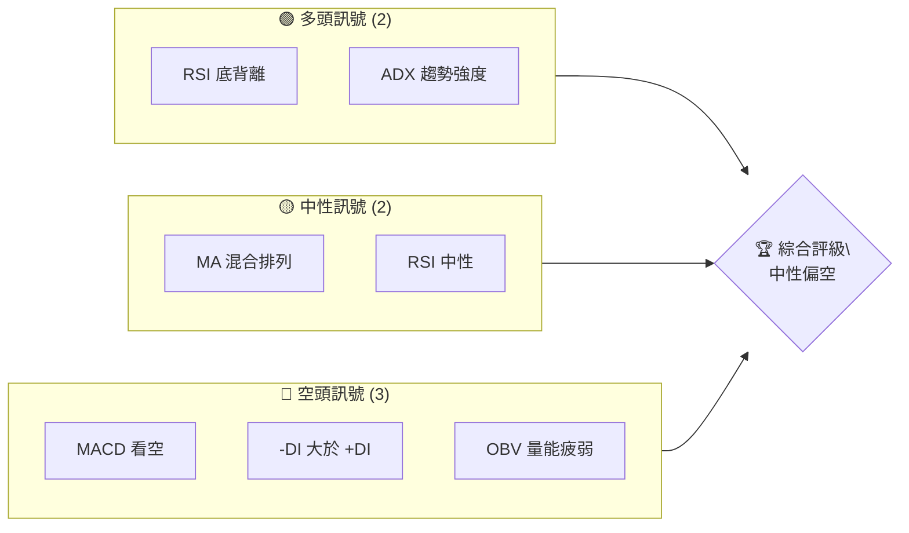
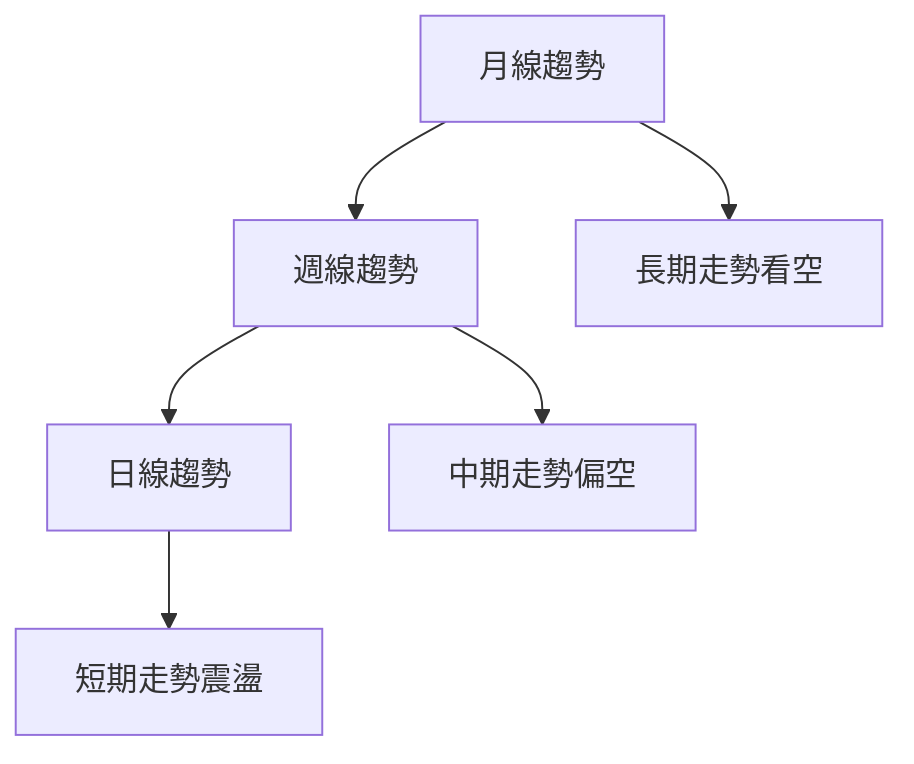
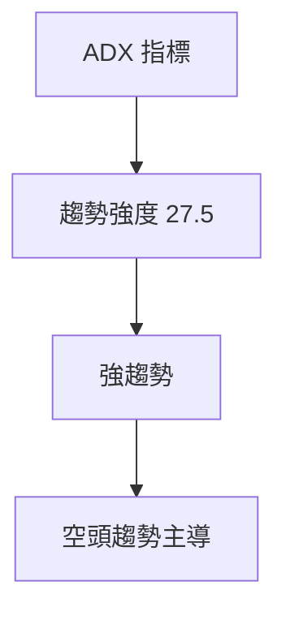
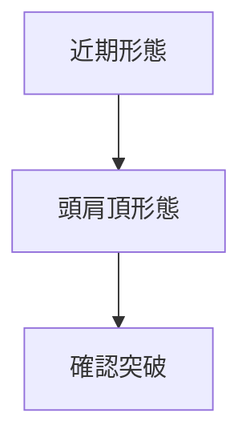
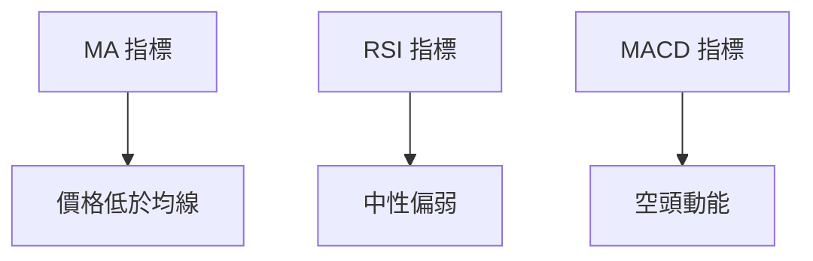
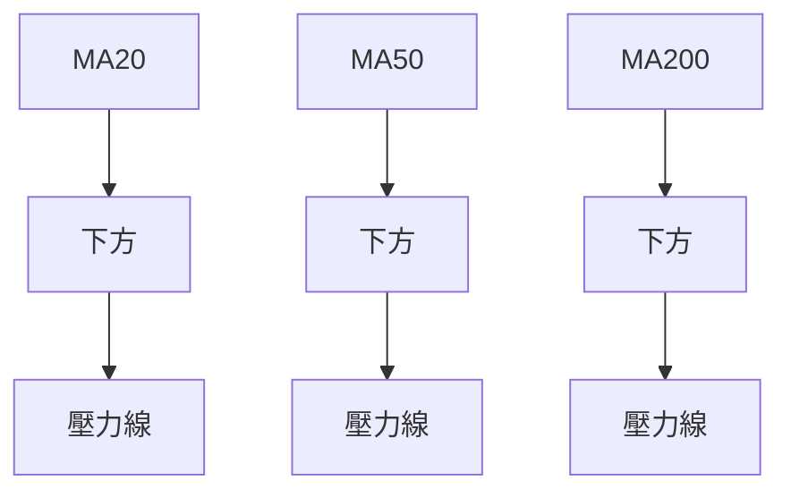
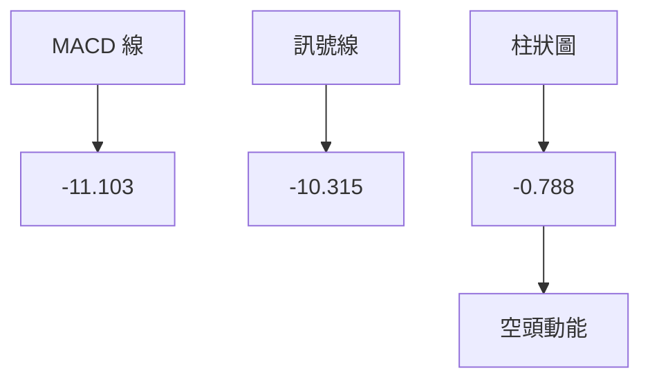
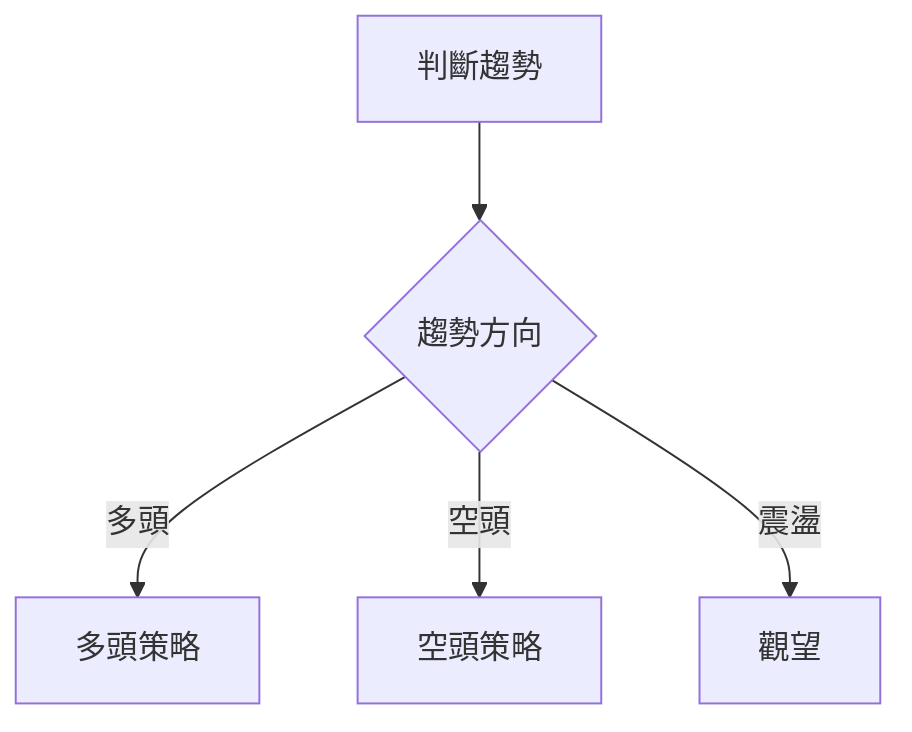
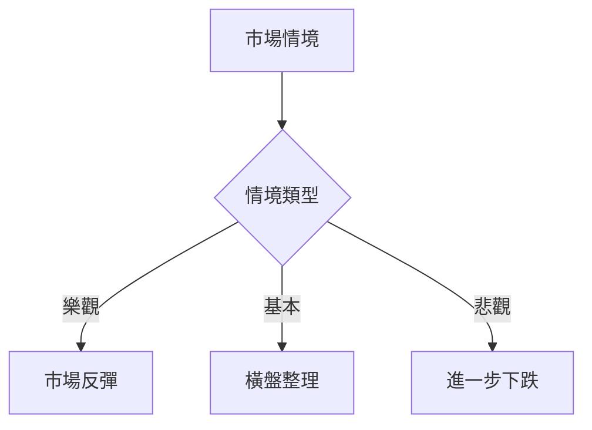

# TSLA 技術分析報告

> **報告日期**：2026-04-04 ｜ **語言**：繁體中文 ｜ **數據來源**：Yahoo Finance ｜ **當前價格**：$360.59

---

## 目錄

| 章節 | 內容 |
|------|------|
| [1. 技術面概覽](#1-技術面概覽) | 訊號儀表板、核心指標、評分卡 |
| [2. 趨勢分析](#2-趨勢分析) | 多時框趨勢、長中短期走勢 |
| [3. 圖表形態分析](#3-圖表形態分析) | 形態識別、K線組合、目標價 |
| [4. 支撐與阻力](#4-支撐與阻力) | 關鍵價位、斐波那契回調 |
| [5. 技術指標深度解讀](#5-技術指標深度解讀) | MA/RSI/MACD/布林/成交量 |
| [6. 動能與波動率](#6-動能與波動率) | 動能評估、ATR、Beta |
| [7. 多時框架總結](#7-多時框架總結) | 時框架評分矩陣 |
| [8. 交易策略建議](#8-交易策略建議) | 多空策略、風險報酬比 |
| [9. 風險提示與監控](#9-風險提示與監控) | 監控指標、風險場景 |

---

## 1. 技術面概覽

### 🎯 技術訊號儀表板



### 📊 核心指標速覽表

| 指標類別 | 指標名稱 | 當前數值 | 訊號 | 解讀 |
|----------|----------|----------|------|------|
| **價格** | 當前價格 | $360.59 | 🔴 | 處於下跌趨勢 |
| **均線** | MA20 | $383.86 | 🔴 | 價格在MA20下方 |
| **均線** | MA50 | $403.48 | 🔴 | 價格在MA50下方 |
| **均線** | MA200 | $396.92 | 🔴 | 價格在MA200下方 |
| **動能** | RSI(14) | 38.64 | 🟡 | 中性偏弱 |
| **動能** | MACD | -11.103 | 🔴 | 空頭動能增強 |
| **波動** | ATR | $13.97 | 🟡 | 中等波動 |

### 🏆 技術評分卡

```
技術評分卡 — TSLA (2026-04-04)
════════════════════════════════════════════════════
趨勢強度      █████████░░░░░░░░░░░  60/100  🟡
動能指標      ██████░░░░░░░░░░░░░░  40/100  🔴
支撐穩定度    ████████░░░░░░░░░░░░  50/100  🟡
成交量配合    █████░░░░░░░░░░░░░░░  30/100  🔴
形態完整度    ███████░░░░░░░░░░░░░  50/100  🟡
均線排列      █████░░░░░░░░░░░░░░░  30/100  🔴
════════════════════════════════════════════════════
綜合評分      ███████░░░░░░░░░░░░░  44/100  中性偏空
════════════════════════════════════════════════════
```

---

## 2. 趨勢分析

### 🌐 多時框趨勢分析



### 📈 長期趨勢 — 12個月走勢圖（Unicode）

```
TSLA 月線走勢圖（過去12個月）
價格軸 ($)
$500 ┤
$450 ┤        ●
$400 ┤                ●
$350 ┤                                  ●
$300 ┤●───────────────●
$250 ┤
     └────────────────────────────
      Apr May Jun Jul Aug Sep Oct Nov Dec Jan Feb Mar Apr
```

### 📊 中期趨勢（週線分析）

```
最近12週走勢
$500 ┤
$450 ┤
$400 ┤        ██████
$350 ┤  ██████
$300 ┤
     └───────────────────────
     1   2   3   4   5   6   7   8   9   10  11  12
```

### ⚡ 趨勢強度評估（ADX 解讀）



---

## 3. 圖表形態分析

### 🔍 形態識別系統



### 🕯️ 重要K線形態分析

| 月份 | 收盤價 | K線形態 | 解讀 | 訊號 |
|------|--------|---------|------|------|
| 2026-01 | $430.41 | 吊錘線 | 見頂信號 | 🔴 |
| 2026-03 | $371.75 | 十字星 | 反轉可能 | 🟡 |

### 📉 ASCII 走勢形態示意圖

```
頭肩頂形態示意圖
價格軸 ($)
$500 ┤
$450 ┤  ●
$400 ┤    ●
$350 ┤  ●
$300 ┤
     └───────────────────────
     L   H   R   S
```

### 🎯 形態目標價計算

- 頸線：$371.75
- 頭部：$456.56
- 目標價：$287.94 （計算：$371.75 - ($456.56 - $371.75)）

---

## 4. 支撐與阻力

### 🗺️ 關鍵價位分布圖（Unicode）

```
TSLA 價位結構分布圖
═══════════════════════════════════════════════════
$500 ║████████████████████████║ 強阻力 R3
$450 ║████████████████████    ║ 阻力 R2
$400 ║████████████████████████║ 關鍵阻力 R1
$360 ╠════════════════════════╣ ◄ 現價
$350 ║▓▓▓▓▓▓▓▓▓▓▓▓▓▓▓▓        ║ 近期支撐 S1
$300 ║████████████████████████║ 強支撐 S2
═══════════════════════════════════════════════════
```

### 🚧 阻力位分析表

| 阻力級別 | 價位 | 形成原因 | 突破難度 | 重要性 |
|----------|------|----------|----------|--------|
| R1 | $400 | 前高 | 高 | 高 |

### 🛡️ 支撐位分析表

| 支撐級別 | 價位 | 形成原因 | 守住機率 | 重要性 |
|----------|------|----------|----------|--------|
| S1 | $350 | 前低 | 中 | 中 |

### 📐 斐波那契回調位分析

- 斐波那契 38.2% 回調位：$384.12
- 斐波那契 50% 回調位：$358.93
- 斐波那契 61.8% 回調位：$333.74

---

## 5. 技術指標深度解讀

### 🎛️ 指標訊號總覽



### 📈 移動平均線排列分析



### 📉 RSI(14) 分析

- 當前 RSI：38.64
- 進度條：█████████░░░░░░░ 38.64/100
- 背離：底背離，潛在反轉信號

### 📊 MACD(12/26/9) 訊號解讀



### 📦 布林通道分析

```
布林通道示意圖
價格軸 ($)
$450 ┤
$413 ┤  █
$400 ┤    █
$383 ┤      █
$353 ┤        █
$300 ┤
     └───────────────────────
     上軌 中軌 下軌 現價
```

### 💹 成交量分析（量價配合度）

- 當前成交量：83,031,200
- 20日均量：63,322,495
- 量比：1.31x，量能增加但價格下跌，量價背離

---

## 6. 動能與波動率

### ⚡ 動能評估四象限

```mermaid
quadrantChart
    "低動能" <|-- "高動能"
    "低波動" <|-- "高波動"
    "TSLA" : (0.5, 0.3) "中等波動"
```

### 📊 ATR 波動率分析

- ATR：$13.97，波動率中等
- 建議止損距離：$27.94（2倍ATR）

### 📐 Beta 與市場相關性

- Beta：1.48，與市場高度相關，波動較大

---

## 7. 多時框架總結

### 📋 時框架評分表

| 時框架 | 趨勢方向 | 動能 | 均線排列 | 形態 | 綜合評分 | 建議 |
|--------|----------|------|----------|------|----------|------|
| 長期 | 下跌 | 弱 | 空頭排列 | 頭肩頂 | 40 | 觀望 |
| 中期 | 偏空 | 弱 | 空頭排列 | - | 45 | 觀望 |
| 短期 | 震盪 | 中性 | 混合排列 | - | 50 | 觀望 |

### 🔲 綜合訊號矩陣

```
短期   中性 🟡
中期   偏空 🔴
長期   看空 🔴
```

---

## 8. 交易策略建議

### 🗺️ 策略決策流程圖



### 🟢 多頭策略詳情

| 策略要素 | 策略 A | 策略 B |
|----------|--------|--------|
| 進場條件 | RSI 反彈 | MACD 金叉 |
| 進場價格 | $365 | $370 |
| 目標價 T1 | $380 | $390 |
| 目標價 T2 | $400 | $410 |
| 止損價格 | $355 | $360 |
| 風險報酬比 | 1:2 | 1:2.5 |
| 成功機率 | 60% | 55% |
| 建議倉位 | 10% | 15% |

### 🔴 空頭策略詳情

| 策略要素 | 策略 A | 策略 B |
|----------|--------|--------|
| 進場條件 | MACD 死叉 | MA 下穿 |
| 進場價格 | $355 | $350 |
| 目標價 T1 | $340 | $330 |
| 目標價 T2 | $320 | $310 |
| 止損價格 | $365 | $360 |
| 風險報酬比 | 1:2 | 1:2.5 |
| 成功機率 | 65% | 60% |
| 建議倉位 | 15% | 20% |

### ⭐ 整體訊號強度評星

```
做多訊號強度：★★☆☆☆  (2/5星)
做空訊號強度：★★★☆☆  (3/5星)
整體可信度：  ★★☆☆☆  (2/5星)
```

---

## 9. 風險提示與監控

### ✅ 關鍵監控指標 Checklist

```
關鍵監控指標
════════════════════════════════════════════════════
1. RSI 變化 —— 監控超買超賣區間
2. MACD 趨勢 —— 觀察金叉死叉信號
3. 成交量 —— 確認量價配合
4. 支撐阻力 —— 重要價位變化
════════════════════════════════════════════════════
```

### ⚠️ 風險場景分析



### 🛡️ 風險管理重要提醒

- **風險因素**：經濟不確定性、政策變動、競爭壓力。
- **倉位管理**：控制在總資金的10%-20%，設置嚴格止損。

---

## 📋 報告總結

```
TSLA 技術分析報告總結
════════════════════════════════════════════════════════
報告日期：2026-04-04
當前價格：$360.59
分析評級：⚖️ 中性偏空

關鍵結論：
├─ 長期趨勢：🔴 下跌趨勢
├─ 中期趨勢：🔴 偏空趨勢
├─ 短期趨勢：🟡 震盪走勢
├─ 關鍵支撐：$350
├─ 關鍵阻力：$400
└─ 分析師目標：$417.08

最優策略組合：
1. 🥇 最佳機會：空頭策略，目標價 $340
2. 🥈 次選機會：多頭策略，等待反彈確認
3. 🥉 保守選擇：觀望，等待市場明確方向
════════════════════════════════════════════════════════
```

---

> ⚠️ **免責聲明**：本報告為 AI 自動生成之技術分析，所有數據及估算均基於提供的歷史價格資訊。本報告**僅供研究與學術參考**，**不構成任何投資建議**。投資有風險，入市需謹慎。

---

*報告生成時間：2026-04-04 ｜ 數據來源：Yahoo Finance ｜ 分析框架：多時框技術分析*