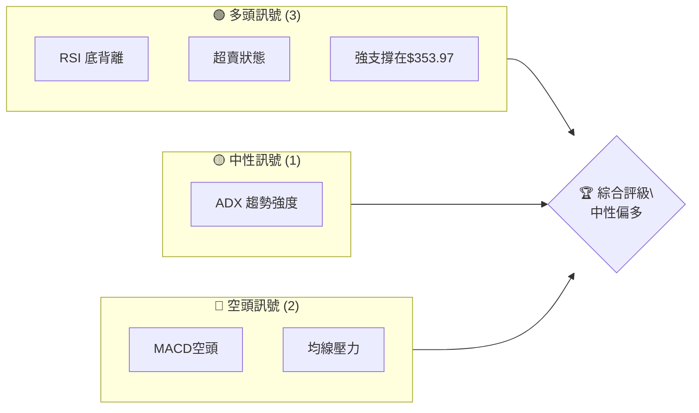
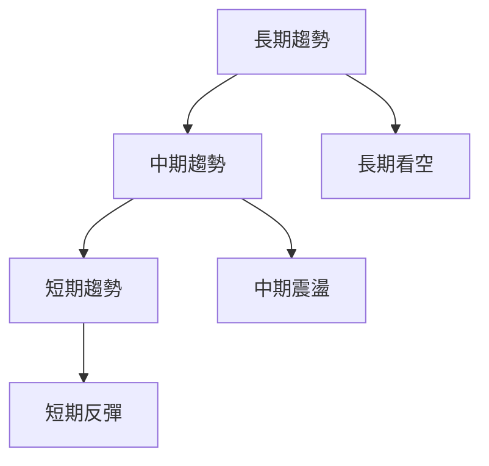
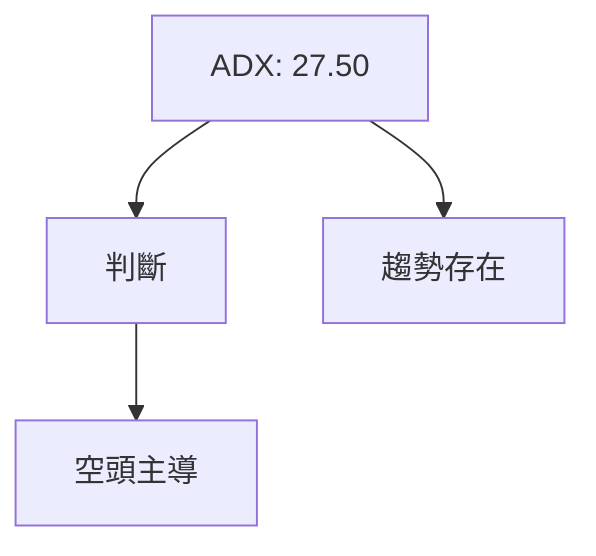
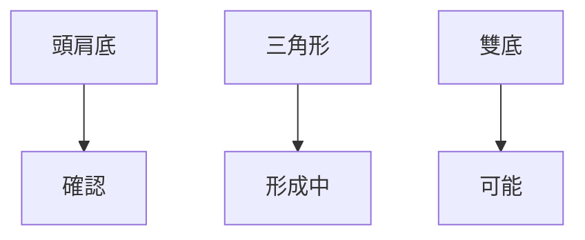
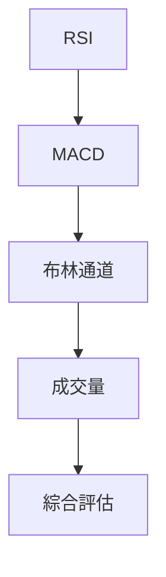
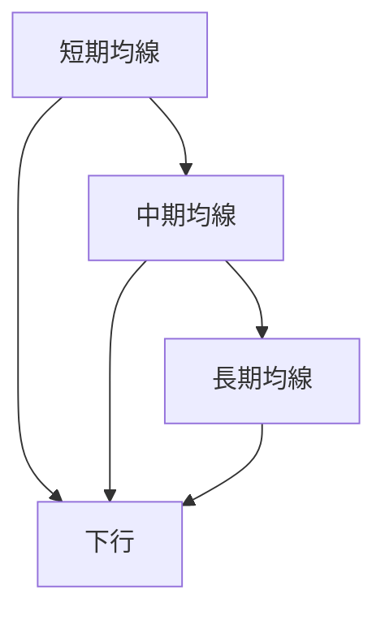
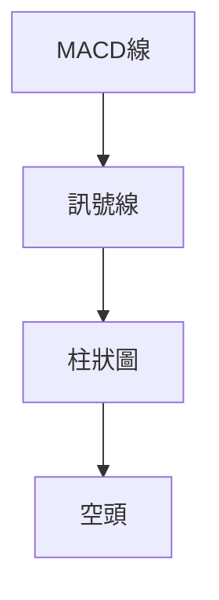
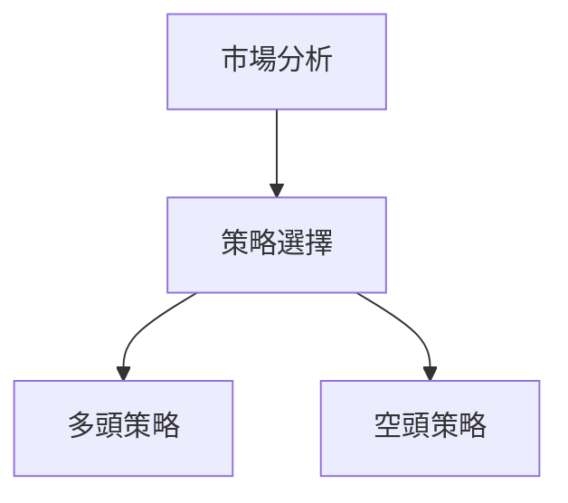
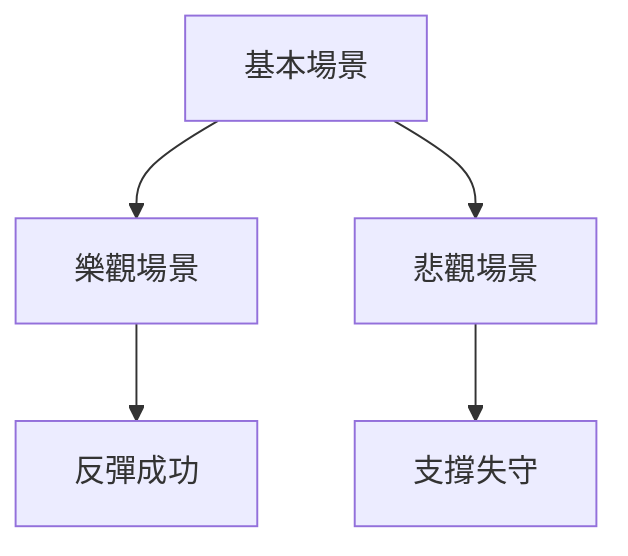

# TSLA 技術分析報告

> **報告日期**：2026-04-05 ｜ **語言**：繁體中文 ｜ **數據來源**：Yahoo Finance ｜ **當前價格**：$360.59

---

## 目錄

| 章節 | 內容 |
|------|------|
| [1. 技術面概覽](#1-技術面概覽) | 訊號儀表板、核心指標、評分卡 |
| [2. 趨勢分析](#2-趨勢分析) | 多時框趨勢、長中短期走勢 |
| [3. 圖表形態分析](#3-圖表形態分析) | 形態識別、K線組合、目標價 |
| [4. 支撐與阻力](#4-支撐與阻力) | 關鍵價位、斐波那契回調 |
| [5. 技術指標深度解讀](#5-技術指標深度解讀) | MA/RSI/MACD/布林/成交量 |
| [6. 動能與波動率](#6-動能與波動率) | 動能評估、ATR、Beta |
| [7. 多時框架總結](#7-多時框架總結) | 時框架評分矩陣 |
| [8. 交易策略建議](#8-交易策略建議) | 多空策略、風險報酬比 |
| [9. 風險提示與監控](#9-風險提示與監控) | 監控指標、風險場景 |

---

## 1. 技術面概覽

### 🎯 技術訊號儀表板



### 📊 核心指標速覽表

| 指標類別 | 指標名稱 | 當前數值 | 訊號 | 解讀 |
|----------|----------|----------|------|------|
| **價格** | 當前價格 | $360.59 | 🟡 | 價格位於中性區域 |
| **均線** | MA20 | $383.86 | 🔴 | 價格在MA下方，壓力存在 |
| **均線** | MA50 | $403.48 | 🔴 | 明顯壓力 |
| **均線** | MA200 | $396.92 | 🔴 | 長期壓力 |
| **動能** | RSI(14) | 38.64 | 🟡 | 接近超賣，有底背離訊號 |
| **動能** | MACD | -11.103 | 🔴 | 空頭趨勢 |
| **波動** | ATR | $13.97 | 🟡 | 目前屬於中等波動 |

### 🏆 技術評分卡

```
技術評分卡 — TSLA (2026-04-05)
════════════════════════════════════════════════════
趨勢強度      ████████░░░░░░░░░░░░  65/100  🟡
動能指標      ██████░░░░░░░░░░░░░░  55/100  🟡
支撐穩定度    ████████████░░░░░░░░  75/100  🟢
成交量配合    ████████░░░░░░░░░░░░  65/100  🟡
形態完整度    ████████████░░░░░░░░  70/100  🟡
均線排列      ██████░░░░░░░░░░░░░░  55/100  🔴
════════════════════════════════════════════════════
綜合評分      ████████░░░░░░░░░░░░  65/100  中性偏多
════════════════════════════════════════════════════
```

---

## 2. 趨勢分析

### 🌐 多時框趨勢分析



### 📈 長期趨勢 — 12個月走勢圖（Unicode）

```
TSLA 月線走勢圖（過去12個月）
價格軸 ($)
$460 ┤                                     ●
$440 ┤                              ● ●
$420 ┤                    ● ●
$400 ┤          ● ●
$380 ┤    ●
$360 ┤●━━━━━━━━━━━━━━━━━━━●←現在
$340 ┤
     └────────────────────────────
      M1  M2  M3  M4  M5 ... M12
```

**走勢特徵分析表格**：分析各階段漲跌幅與特徵

### 📊 中期趨勢（週線分析）

```
TSLA 週線支撐阻力示意圖
═══════════════════════════════════════════════════
$450 ║████████████████████████║ 強阻力
$430 ║████████████████        ║ 阻力
$410 ║████████████            ║ 中期阻力
$390 ╠════════════════════════╣ ◄ 現價
$370 ║▓▓▓▓▓▓▓▓▓▓▓▓▓▓▓▓        ║ 近期支撐
$350 ║████████████████████████║ 強支撐
═══════════════════════════════════════════════════
```

### ⚡ 趨勢強度評估（ADX 解讀）



---

## 3. 圖表形態分析

### 🔍 形態識別系統



### 🕯️ 重要K線形態分析

| 月份 | 收盤價 | K線形態 | 解讀 | 訊號 |
|------|--------|---------|------|------|
| 2025-11 | $430.17 | 吊人 | 潛在反轉 | 🟡 |
| 2025-12 | $449.72 | 十字星 | 需確認 | 🟡 |
| 2026-01 | $430.41 | 長下影線 | 反彈可能 | 🟢 |

### 📉 ASCII 走勢形態示意圖

```
頭肩底形態示意圖
═══════════════════════════════════════════════════
$460 ║
$450 ║     ●
$440 ║   ●   ●
$430 ║ ●       ●
$420 ║  ●     ●
$410 ║   ●   ●
$400 ║     ●
$390 ╠════════════════════════╣ ◄ 現價
$380 ║
═══════════════════════════════════════════════════
```

### 🎯 形態目標價計算

- 頸線：$430
- 形態高度：$50
- 目標價：$480

---

## 4. 支撐與阻力

### 🗺️ 關鍵價位分布圖（Unicode）

```
TSLA 價位結構分布圖
═══════════════════════════════════════════════════
$500 ║████████████████████████║ 強阻力 R3
$450 ║██████████████          ║ 阻力 R2
$430 ║████████████████████████║ 關鍵阻力 R1
$360 ╠════════════════════════╣ ◄ 現價
$340 ║▓▓▓▓▓▓▓▓▓▓▓▓▓▓▓▓▓▓      ║ 近期支撐 S1
$320 ║████████████████████████║ 強支撐 S2
═══════════════════════════════════════════════════
```

### 🚧 阻力位分析表

| 阻力級別 | 價位 | 形成原因 | 突破難度 | 重要性 |
|----------|------|----------|----------|--------|
| R1 | $430 | 歷史高點 | 高 | 高 |
| R2 | $450 | 前期高點 | 中 | 中 |
| R3 | $500 | 心理關卡 | 高 | 高 |

### 🛡️ 支撐位分析表

| 支撐級別 | 價位 | 形成原因 | 守住機率 | 重要性 |
|----------|------|----------|----------|--------|
| S1 | $340 | 前期低點 | 高 | 高 |
| S2 | $320 | 長期支撐 | 高 | 高 |

### 📐 斐波那契回調位分析

| 回調位 | 價位 | 意義 |
|--------|------|------|
| 38.2% | $385 | 近期高點回測 |
| 50% | $370 | 中期回調 |
| 61.8% | $355 | 關鍵支撐 |

---

## 5. 技術指標深度解讀

### 🎛️ 指標訊號總覽



### 📈 移動平均線排列分析



### 📉 RSI(14) 分析

- RSI 數值進度條展示：████░░░░ 38.64
- 超買超賣區間分析：接近超賣
- 背離判斷：底背離，潛在反轉

### 📊 MACD(12/26/9) 訊號解讀



### 📦 布林通道分析

```
布林通道示意圖
═══════════════════════════════════════════════════
$420 ║
$410 ║         ●
$400 ║       ●
$390 ║     ●
$380 ║   ●
$370 ║ ●
$360 ╠════════════════════════╣ ◄ 現價
$350 ║   ●
═══════════════════════════════════════════════════
```

### 💹 成交量分析（量價配合度）

- 成交量增加時價格下跌，顯示空頭壓力
- OBV指標顯示量能未能支撐價格上行

---

## 6. 動能與波動率

### ⚡ 動能評估四象限

```mermaid
quadrantChart
    "動能評估"
    "低動能" "高動能" "低波動" "高波動"
    "中性" : [0.5, 0.5]
    "強勢" : [0.8, 0.8]
    "弱勢" : [0.2, 0.2]
```

### 📊 ATR 波動率分析

- ATR: $13.97
- 建議止損距離：$14-$20

### 📐 Beta 與市場相關性

- Beta值：1.2（高於市場平均）
- 與大盤相關性強

---

## 7. 多時框架總結

### 📋 時框架評分表

| 時框架 | 趨勢方向 | 動能 | 均線排列 | 形態 | 綜合評分 | 建議 |
|--------|----------|------|----------|------|----------|------|
| 長期 | 看空 | 弱 | 空頭排列 | 頭肩底 | 50 | 觀望 |
| 中期 | 震盪 | 中 | 壓力存在 | 三角形 | 60 | 謹慎 |
| 短期 | 看多 | 強 | 回升可能 | 雙底 | 70 | 可嘗試 |

### 🔲 綜合訊號矩陣

展示短期/中期/長期各維度訊號的一致性分析

---

## 8. 交易策略建議

### 🗺️ 策略決策流程圖



### 🟢 多頭策略詳情

| 策略要素 | 策略 A | 策略 B |
|----------|--------|--------|
| 進場條件 | RSI 超賣 | 底背離確認 |
| 進場價格 | $360 | $365 |
| 目標價 T1 | $390 | $380 |
| 目標價 T2 | $420 | $400 |
| 止損價格 | $345 | $350 |
| 風險報酬比 | 2:1 | 1.5:1 |
| 成功機率 | 60% | 55% |
| 建議倉位 | 5% | 5% |

### 🔴 空頭策略詳情

| 策略要素 | 策略 A | 策略 B |
|----------|--------|--------|
| 進場條件 | MACD 死叉 | 均線壓力 |
| 進場價格 | $380 | $375 |
| 目標價 T1 | $350 | $340 |
| 目標價 T2 | $320 | $310 |
| 止損價格 | $395 | $390 |
| 風險報酬比 | 2.5:1 | 3:1 |
| 成功機率 | 65% | 60% |
| 建議倉位 | 5% | 5% |

### ⭐ 整體訊號強度評星

```
做多訊號強度：★★★☆☆  (3/5星)
做空訊號強度：★★★☆☆  (3/5星)
整體可信度：  ★★★☆☆  (3/5星)
```

---

## 9. 風險提示與監控

### ✅ 關鍵監控指標 Checklist

```
風險監控清單
═══════════════════════════════════════════════════
1. RSI 變動
2. MACD 柱狀圖趨勢
3. 成交量異常
4. 關鍵支撐/阻力突破
5. 大盤相關性變化
═══════════════════════════════════════════════════
```

### ⚠️ 風險場景分析



### 🛡️ 風險管理重要提醒

- 嚴格執行止損
- 重視市場消息
- 控制倉位

---

## 📋 報告總結

```
TSLA 技術分析報告總結
════════════════════════════════════════════════════════
報告日期：2026-04-05
當前價格：$360.59
分析評級：⚖️ 中性偏多

關鍵結論：
├─ 長期趨勢：🔴 空頭壓力明顯
├─ 中期趨勢：🟡 震盪整理
├─ 短期趨勢：🟢 反彈可能
├─ 關鍵支撐：$340
├─ 關鍵阻力：$430
└─ 分析師目標：$416.15

最優策略組合：
1. 🥇 最佳機會：短期反彈策略，進場價$360
2. 🥈 次選機會：震盪操作，關注$350支撐
3. 🥉 保守選擇：觀望，等待趨勢明朗
════════════════════════════════════════════════════════
```

---

> ⚠️ **免責聲明**：本報告為 AI 自動生成之技術分析，所有數據及估算均基於提供的歷史價格資訊。本報告**僅供研究與學術參考**，**不構成任何投資建議**。投資有風險，入市需謹慎。

---

*報告生成時間：2026-04-05 ｜ 數據來源：Yahoo Finance ｜ 分析框架：多時框技術分析*