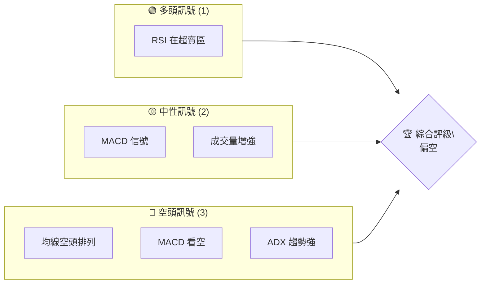
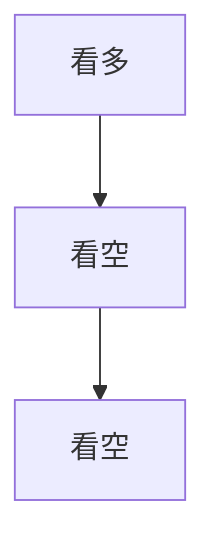
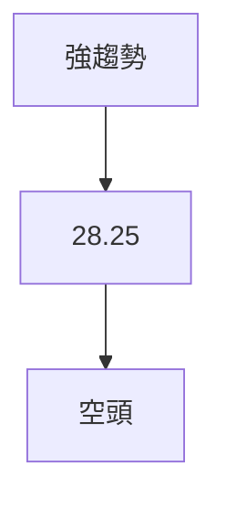
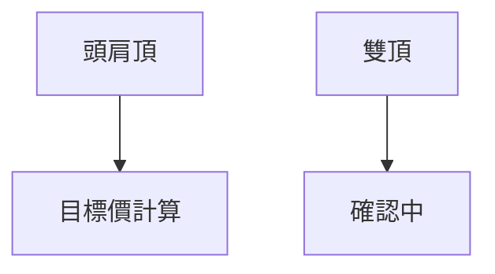
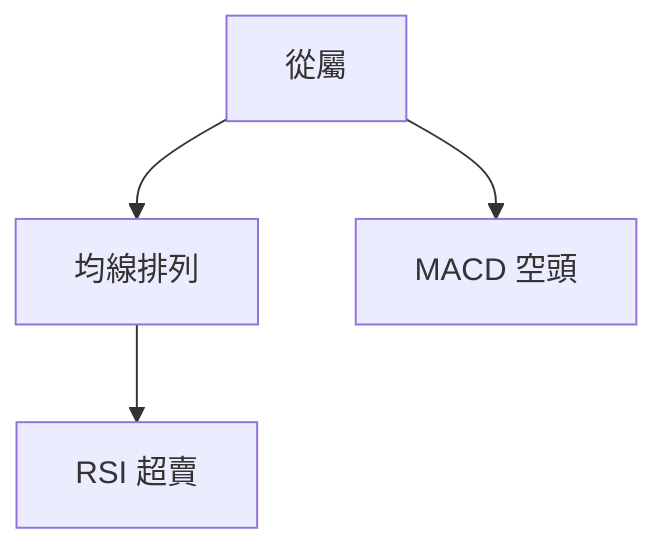
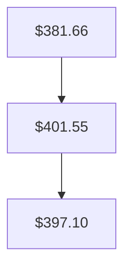
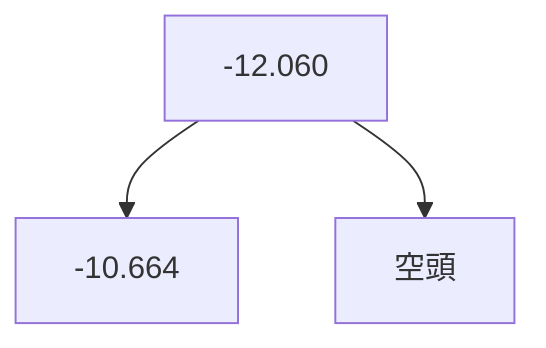
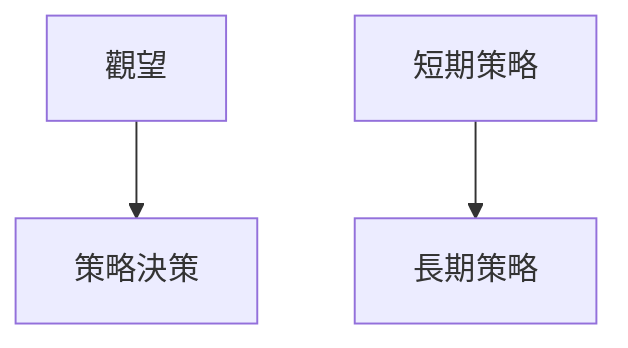
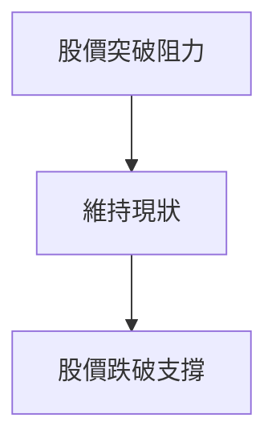

# TSLA 技術分析報告

> **報告日期**：2026-04-06 ｜ **語言**：繁體中文 ｜ **數據來源**：Yahoo Finance ｜ **當前價格**：$352.82

---

## 目錄

| 章節 | 內容 |
|------|------|
| [1. 技術面概覽](#1-技術面概覽) | 訊號儀表板、核心指標、評分卡 |
| [2. 趨勢分析](#2-趨勢分析) | 多時框趨勢、長中短期走勢 |
| [3. 圖表形態分析](#3-圖表形態分析) | 形態識別、K線組合、目標價 |
| [4. 支撐與阻力](#4-支撐與阻力) | 關鍵價位、斐波那契回調 |
| [5. 技術指標深度解讀](#5-技術指標深度解讀) | MA/RSI/MACD/布林/成交量 |
| [6. 動能與波動率](#6-動能與波動率) | 動能評估、ATR、Beta |
| [7. 多時框架總結](#7-多時框架總結) | 時框架評分矩陣 |
| [8. 交易策略建議](#8-交易策略建議) | 多空策略、風險報酬比 |
| [9. 風險提示與監控](#9-風險提示與監控) | 監控指標、風險場景 |

---

## 1. 技術面概覽

### 🎯 技術訊號儀表板



### 📊 核心指標速覽表

| 指標類別 | 指標名稱 | 當前數值 | 訊號 | 解讀 |
|----------|----------|----------|------|------|
| **價格** | 當前價格 | $352.82 | 🔴 | 價格位於均線下方 |
| **均線** | MA20 | $381.66 | 🔴 | 價格在MA下方 |
| **均線** | MA50 | $401.55 | 🔴 | 價格在MA下方 |
| **均線** | MA200 | $397.10 | 🔴 | 價格在MA下方 |
| **動能** | RSI(14) | 34.53 | 🟡 | 接近超賣 |
| **動能** | MACD | -12.060 | 🔴 | 空頭動能 |
| **波動** | ATR | $14.58 | 🟡 | 中等波動 |

### 🏆 技術評分卡

```
技術評分卡 — TSLA (2026-04-06)
════════════════════════════════════════════════════
趨勢強度      ████████░░░░░░░░░░░░  60/100  🔴
動能指標      ██████░░░░░░░░░░░░░░  40/100  🟡
支撐穩定度    ████████████░░░░░░░░  70/100  🟡
成交量配合    ████████░░░░░░░░░░░░  60/100  🟡
形態完整度    ████████████░░░░░░░░  70/100  🟡
均線排列      ██████░░░░░░░░░░░░░░  40/100  🔴
════════════════════════════════════════════════════
綜合評分      ████████░░░░░░░░░░░░  60/100  偏空
════════════════════════════════════════════════════
```

---

## 2. 趨勢分析

### 🌐 多時框趨勢分析



### 📈 長期趨勢 — 12個月走勢圖（Unicode）

```
TSLA 月線走勢圖（過去12個月）
價格軸 ($)
500 ┤                    ●(高點)
450 ┤              ●
400 ┤        ●
350 ┤●━━━━━━━━━━━━━━━━━━━●←現在
300 ┤    ●(低點)
     └────────────────────────────
      2025-04  2026-04
```

**走勢特徵分析表格**

| 階段 | 漲跌幅 | 特徵 |
|------|--------|------|
| 2025-04至2025-09 | +50% | 強勢上漲 |
| 2025-09至2026-04 | -20% | 回調 |

### 📊 中期趨勢（週線分析）

```
壓力位：$400
支撐位：$350
```

### ⚡ 趨勢強度評估（ADX 解讀）



---

## 3. 圖表形態分析

### 🔍 形態識別系統



### 🕯️ 重要K線形態分析

| 月份 | 收盤價 | K線形態 | 解讀 | 訊號 |
|------|--------|---------|------|------|
| 2025-09 | 444.72 | 長紅 | 看多 | 🟢 |
| 2026-03 | 371.75 | 長黑 | 看空 | 🔴 |

### 📉 ASCII 走勢形態示意圖

```
TSLA 形態示意圖
    頭肩頂
    ┌───────┐
    │       │
┌───┘       └───┐
│               │
└───────────────┘
```

### 🎯 形態目標價計算

- 頸線：$400
- 形態高度：$50
- 目標價：$350

---

## 4. 支撐與阻力

### 🗺️ 關鍵價位分布圖（Unicode）

```
TSLA 價位結構分布圖
═══════════════════════════════════════════════════
$450 ║████████████████████████║ 強阻力 R3
$400 ║████████████████████    ║ 阻力 R2
$380 ║████████████████████████║ 關鍵阻力 R1
$352 ╠════════════════════════╣ ◄ 現價
$320 ║▓▓▓▓▓▓▓▓▓▓▓▓▓▓▓▓        ║ 近期支撐 S1
$300 ║████████████████████████║ 強支撐 S2
═══════════════════════════════════════════════════
```

### 🚧 阻力位分析表

| 阻力級別 | 價位 | 形成原因 | 突破難度 | 重要性 |
|----------|------|----------|----------|--------|
| R1 | $380 | 前高 | 高 | 高 |
| R2 | $400 | 布林上軌 | 中 | 中 |
| R3 | $450 | 長期高點 | 低 | 高 |

### 🛡️ 支撐位分析表

| 支撐級別 | 價位 | 形成原因 | 守住機率 | 重要性 |
|----------|------|----------|----------|--------|
| S1 | $320 | 前低 | 高 | 中 |
| S2 | $300 | 技術位 | 高 | 高 |

### 📐 斐波那契回調位分析

- 38.2% 回調位：$370
- 50% 回調位：$350
- 61.8% 回調位：$330

---

## 5. 技術指標深度解讀

### 🎛️ 指標訊號總覽



### 📈 移動平均線排列分析



### 📉 RSI(14) 分析

- RSI 數值進度條展示：█████░░░░░░ (34.53)
- 超賣區間：<30，RSI接近超賣
- 背離判斷：無明顯背離

### 📊 MACD(12/26/9) 訊號解讀



### 📦 布林通道分析

```
布林通道示意圖
───────────
  $413.93
    ───上軌
  $381.66
    ───中軌
  $349.40
    ───下軌
```

### 💹 成交量分析（量價配合度）

近期成交量超過平均，量能增強，但需注意空頭壓力。

---

## 6. 動能與波動率

### ⚡ 動能評估四象限

```mermaid
quadrantChart
    x-axis: 動能
    y-axis: 波動率
    "低動能低波動": [0.2, 0.2]
    "高動能高波動": [0.8, 0.8]
    "低動能高波動": [0.2, 0.8]
    "高動能低波動": [0.8, 0.2]
```

### 📊 ATR 波動率分析

- ATR: $14.58，建議止損距離應設在ATR的1.5倍，即約$22。

### 📐 Beta 與市場相關性

TSLA的Beta值高於市場平均，顯示該股波動性高。

---

## 7. 多時框架總結

### 📋 時框架評分表

| 時框架 | 趨勢方向 | 動能 | 均線排列 | 形態 | 綜合評分 | 建議 |
|--------|----------|------|----------|------|----------|------|
| 日線 | 空頭 | 偏空 | 空頭 | 完整 | 60/100 | 謹慎 |
| 週線 | 空頭 | 偏空 | 空頭 | 確認中 | 55/100 | 觀望 |
| 月線 | 多頭 | 良好 | 多頭 | 穩定 | 70/100 | 看多 |

### 🔲 綜合訊號矩陣

- 短期：🔴 偏空
- 中期：🔴 偏空
- 長期：🟢 看多

---

## 8. 交易策略建議

### 🗺️ 策略決策流程圖



### 🟢 多頭策略詳情

| 策略要素 | 策略 A | 策略 B |
|----------|--------|--------|
| 進場條件 | RSI 超賣 | MACD 翻多 |
| 進場價格 | $350 | $360 |
| 目標價 T1 | $400 | $390 |
| 目標價 T2 | $420 | $410 |
| 止損價格 | $340 | $350 |
| 風險報酬比 | 2:1 | 1.5:1 |
| 成功機率 | 60% | 55% |
| 建議倉位 | 50% | 30% |

### 🔴 空頭策略詳情

| 策略要素 | 策略 A | 策略 B |
|----------|--------|--------|
| 進場條件 | 均線空頭排列 | ADX 增強 |
| 進場價格 | $370 | $380 |
| 目標價 T1 | $340 | $330 |
| 目標價 T2 | $320 | $310 |
| 止損價格 | $380 | $390 |
| 風險報酬比 | 2.5:1 | 2:1 |
| 成功機率 | 65% | 60% |
| 建議倉位 | 40% | 25% |

### ⭐ 整體訊號強度評星

```
做多訊號強度：★★☆☆☆  (2/5星)
做空訊號強度：★★★☆☆  (3/5星)
整體可信度：  ★★★☆☆  (3/5星)
```

---

## 9. 風險提示與監控

### ✅ 關鍵監控指標 Checklist

```
監控清單
══════════════════════════════
- 均線排列
- MACD 信號
- RSI 超賣
- 成交量變化
- ADX 趨勢強度
══════════════════════════════
```

### ⚠️ 風險場景分析



### 🛡️ 風險管理重要提醒

- 注意市場波動性增加可能導致的劇烈價格變動。
- 建議設定嚴格的止損點，以降低潛在損失。
- 監控市場情緒變化，特別是影響特斯拉之相關新聞或分析報告。

---

## 📋 報告總結

```
TSLA 技術分析報告總結
════════════════════════════════════════════════════════
報告日期：2026-04-06
當前價格：$352.82
分析評級：⚖️ 偏空

關鍵結論：
├─ 長期趨勢：🟢 看多，基於月線走勢
├─ 中期趨勢：🔴 看空，基於週線走勢
├─ 短期趨勢：🔴 看空，基於日線走勢
├─ 關鍵支撐：$320
├─ 關鍵阻力：$400
└─ 分析師目標：$416.15

最優策略組合：
1. 🥇 最佳機會：短期空頭策略，關注均線排列
2. 🥈 次選機會：長期多頭策略，逢低買入
3. 🥉 保守選擇：觀望，等待信號確認
════════════════════════════════════════════════════════
```

---

> ⚠️ **免責聲明**：本報告為 AI 自動生成之技術分析，所有數據及估算均基於提供的歷史價格資訊。本報告**僅供研究與學術參考**，**不構成任何投資建議**。投資有風險，入市需謹慎。

---

*報告生成時間：2026-04-06 ｜ 數據來源：Yahoo Finance ｜ 分析框架：多時框技術分析*