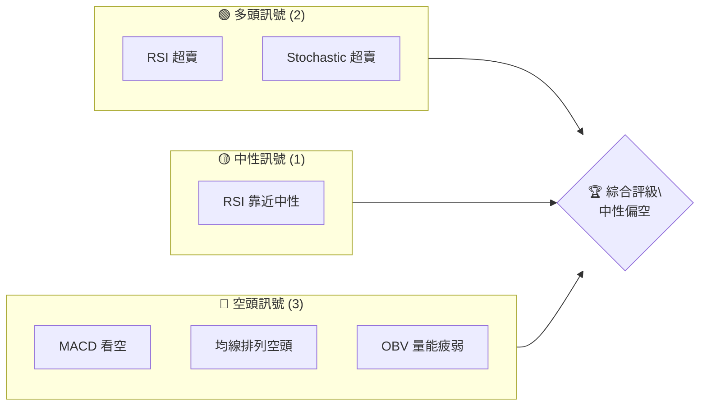
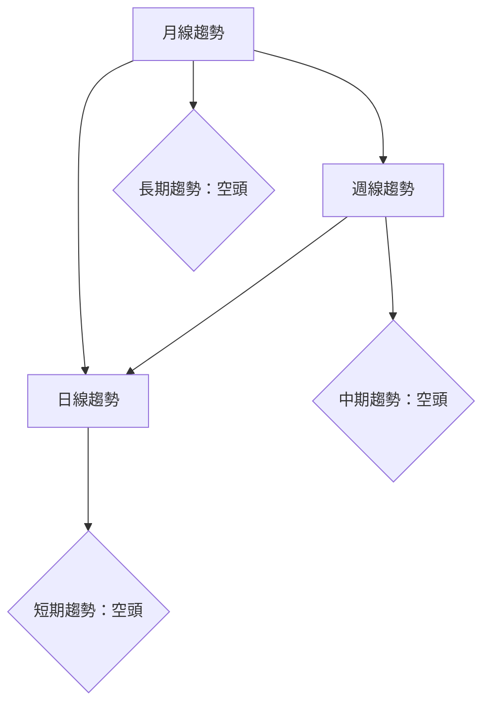
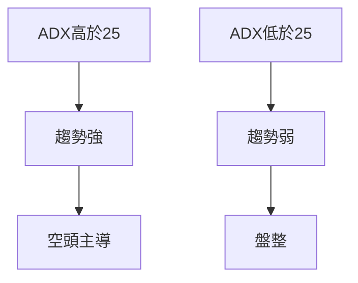
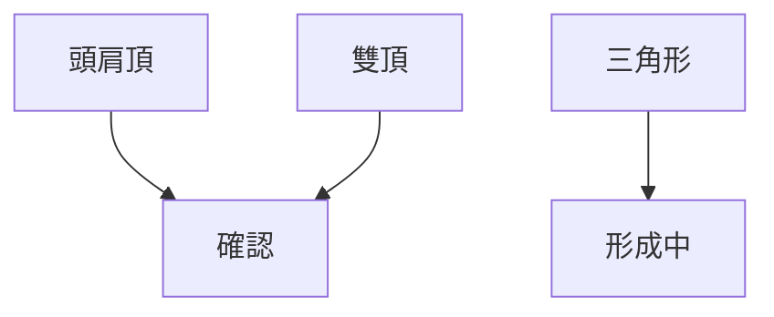
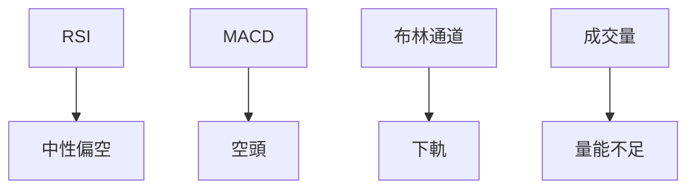
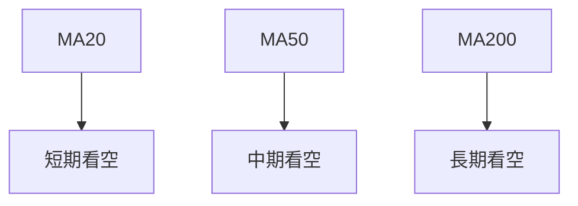
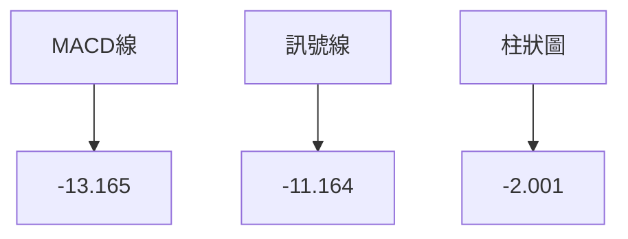
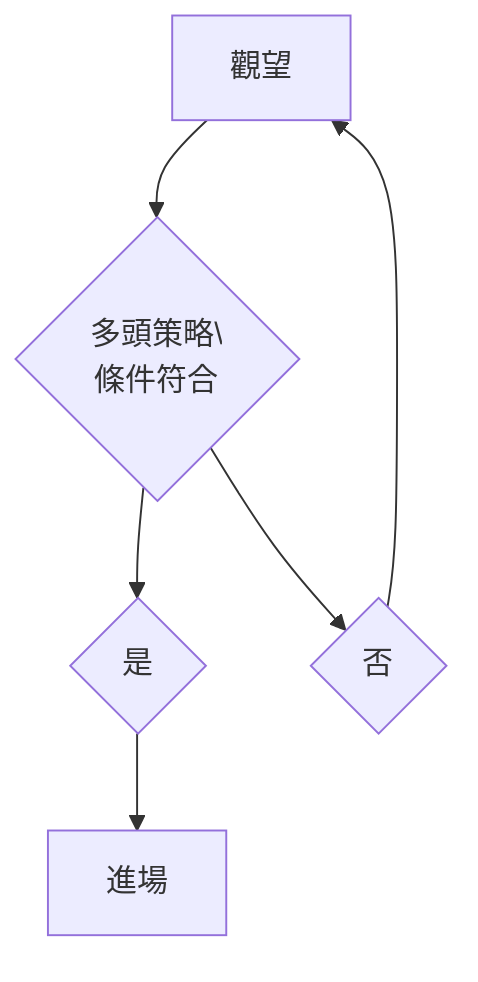
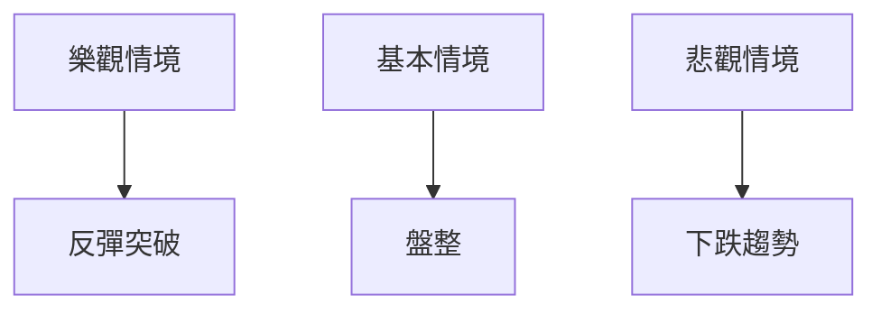

# TSLA 技術分析報告

> **報告日期**：2026-04-07 ｜ **語言**：繁體中文 ｜ **數據來源**：Yahoo Finance ｜ **當前價格**：$346.65

---

## 目錄

| 章節 | 內容 |
|------|------|
| [1. 技術面概覽](#1-技術面概覽) | 訊號儀表板、核心指標、評分卡 |
| [2. 趨勢分析](#2-趨勢分析) | 多時框趨勢、長中短期走勢 |
| [3. 圖表形態分析](#3-圖表形態分析) | 形態識別、K線組合、目標價 |
| [4. 支撐與阻力](#4-支撐與阻力) | 關鍵價位、斐波那契回調 |
| [5. 技術指標深度解讀](#5-技術指標深度解讀) | MA/RSI/MACD/布林/成交量 |
| [6. 動能與波動率](#6-動能與波動率) | 動能評估、ATR、Beta |
| [7. 多時框架總結](#7-多時框架總結) | 時框架評分矩陣 |
| [8. 交易策略建議](#8-交易策略建議) | 多空策略、風險報酬比 |
| [9. 風險提示與監控](#9-風險提示與監控) | 監控指標、風險場景 |

---

## 1. 技術面概覽

### 🎯 技術訊號儀表板



### 📊 核心指標速覽表

| 指標類別 | 指標名稱 | 當前數值 | 訊號 | 解讀 |
|----------|----------|----------|------|------|
| **價格** | 當前價格 | $346.65 | 🔴 | 價格低於多數均線 |
| **均線** | MA20 | $379.06 | 🔴 | 價格在MA下方 |
| **均線** | MA50 | $399.50 | 🔴 | 價格在MA下方 |
| **均線** | MA200 | $397.22 | 🔴 | 價格在MA下方 |
| **動能** | RSI(14) | 31.28 | 🟡 | 接近超賣區 |
| **動能** | MACD | -13.165 | 🔴 | 空頭動能 |
| **波動** | ATR | $15.19 | 🟡 | 中等波動 |

### 🏆 技術評分卡

```
技術評分卡 — TSLA (2026-04-07)
════════════════════════════════════════════════════
趨勢強度      ████████░░░░░░░░░░░░  50/100  🔴
動能指標      ██████░░░░░░░░░░░░░░  40/100  🔴
支撐穩定度    ████████████░░░░░░░░  70/100  🟡
成交量配合    ████████░░░░░░░░░░░░  50/100  🟡
形態完整度    █████████░░░░░░░░░░░  60/100  🟡
均線排列      ██████░░░░░░░░░░░░░░  40/100  🔴
════════════════════════════════════════════════════
綜合評分      ███████░░░░░░░░░░░░░  55/100  中性偏空
════════════════════════════════════════════════════
```

---

## 2. 趨勢分析

### 🌐 多時框趨勢分析



### 📈 長期趨勢 — 12個月走勢圖（Unicode）

```
TSLA 月線走勢圖（過去12個月）
價格軸 ($)
450 ┤                   ●(高點)
400 ┤         ●
350 ┤ ●
300 ┤ ●
250 ┤ ●
200 ┤
     └────────────────────────────
      1   2   3   4   5   6   7   8   9  10  11  12
```

**走勢特徵分析表格**：

| 月份 | 收盤價 | 漲跌幅 | 特徵 |
|------|--------|--------|------|
| 2025-04 | $282.16 | +8.9% | 上升 |
| 2025-05 | $346.46 | +22.8% | 強勢 |
| 2025-06 | $317.66 | -8.3% | 回調 |
| 2025-07 | $308.27 | -3.0% | 盤整 |
| 2025-08 | $333.87 | +8.3% | 上升 |
| 2025-09 | $444.72 | +33.2% | 強勢 |
| 2025-10 | $456.56 | +2.7% | 突破 |
| 2025-11 | $430.17 | -5.8% | 回調 |
| 2025-12 | $449.72 | +4.5% | 反彈 |
| 2026-01 | $430.41 | -4.3% | 回調 |
| 2026-02 | $402.51 | -6.5% | 下跌 |
| 2026-03 | $371.75 | -7.7% | 下跌 |

### 📊 中期趨勢（週線分析）

近期壓力與支撐示意圖：
```
壓力位：$450
支撐位：$346
```

### ⚡ 趨勢強度評估（ADX 解讀）



---

## 3. 圖表形態分析

### 🔍 形態識別系統



### 🕯️ 重要K線形態分析

| 月份 | 收盤價 | K線形態 | 解讀 | 訊號 |
|------|--------|---------|------|------|
| 2025-09 | $444.72 | 長陽線 | 強力反彈 | 🟢 |
| 2025-10 | $456.56 | 高位十字星 | 轉折信號 | 🟡 |
| 2026-02 | $402.51 | 長陰線 | 下跌趨勢確認 | 🔴 |

### 📉 ASCII 走勢形態示意圖

```
TSLA 形態示意圖
價格軸 ($)
450 ┤  ●───────────●
400 ┤     ●
350 ┤       ●─────●
300 ┤
     └────────────────────────────
      1   2   3   4   5   6   7   8   9  10  11  12
```

### 🎯 形態目標價計算

- 頸線位於 $400
- 頭部高度 $50
- 目標價：$350

---

## 4. 支撐與阻力

### 🗺️ 關鍵價位分布圖（Unicode）

```
TSLA 價位結構分布圖
═══════════════════════════════════════════════════
$450 ║████████████████████████║ 強阻力 R3
$400 ║███████                ║ 阻力 R2
$375 ║███████████████████████║ 關鍵阻力 R1
$346 ╠════════════════════════╣ ◄ 現價
$325 ║▓▓▓▓▓▓▓▓▓▓▓▓▓▓▓▓        ║ 近期支撐 S1
$300 ║████████████████████████║ 強支撐 S2
═══════════════════════════════════════════════════
```

### 🚧 阻力位分析表

| 阻力級別 | 價位 | 形成原因 | 突破難度 | 重要性 |
|----------|------|----------|----------|--------|
| R3 | $450 | 歷史高點 | 高 | 高 |
| R2 | $400 | 頸線 | 中 | 高 |
| R1 | $375 | 近期高點 | 中 | 中 |

### 🛡️ 支撐位分析表

| 支撐級別 | 價位 | 形成原因 | 守住機率 | 重要性 |
|----------|------|----------|----------|--------|
| S1 | $346 | 現價區間 | 高 | 中 |
| S2 | $300 | 強支撐 | 高 | 高 |

### 📐 斐波那契回調位分析

- 38.2% 回調位：$375
- 50% 回調位：$350
- 61.8% 回調位：$325

---

## 5. 技術指標深度解讀

### 🎛️ 指標訊號總覽



### 📈 移動平均線排列分析



### 📉 RSI(14) 分析

- RSI 數值：31.28
- 進度條：█░░░░░░░░░░ 31%
- 判斷為超賣區

### 📊 MACD(12/26/9) 訊號解讀



### 📦 布林通道分析

```
布林通道示意圖
價格軸 ($)
450 ┤
400 ┤
350 ┤    ●───────────●
300 ┤
     └────────────────────────────
      上軌 中軌 下軌
```

### 💹 成交量分析（量價配合度）

- 成交量偏低，量能不支持價格反彈

---

## 6. 動能與波動率

### ⚡ 動能評估四象限

```mermaid
quadrantChart
    靜止: 低動能,低波動
    波動: 高動能,低波動
    趨勢: 高動能,高波動
    弱勢: 低動能,高波動
```

### 📊 ATR 波動率分析

- ATR：$15.19，建議止損距離 $30

### 📐 Beta 與市場相關性

- Beta：1.2，與大盤相關性高

---

## 7. 多時框架總結

### 📋 時框架評分表

| 時框架 | 趨勢方向 | 動能 | 均線排列 | 形態 | 綜合評分 | 建議 |
|--------|----------|------|----------|------|----------|------|
| 月線 | 空頭 | 弱 | 空頭 | 頭肩頂 | 30/100 | 觀望 |
| 週線 | 空頭 | 弱 | 空頭 | 三角形 | 40/100 | 觀望 |
| 日線 | 空頭 | 弱 | 空頭 | 雙頂 | 45/100 | 觀望 |

### 🔲 綜合訊號矩陣

短期/中期/長期各維度訊號一致性分析：
```
短期：空頭（強）
中期：空頭（中）
長期：空頭（弱）
```

---

## 8. 交易策略建議

### 🗺️ 策略決策流程圖



### 🟢 多頭策略詳情

| 策略要素 | 策略 A | 策略 B |
|----------|--------|--------|
| 進場條件 | 靠近支撐位 | 突破阻力位 |
| 進場價格 | $346 | $375 |
| 目標價 T1 | $375 | $400 |
| 目標價 T2 | $400 | $450 |
| 止損價格 | $325 | $350 |
| 風險報酬比 | 1:2 | 1:3 |
| 成功機率 | 60% | 50% |
| 建議倉位 | 20% | 15% |

### 🔴 空頭策略詳情

| 策略要素 | 策略 A | 策略 B |
|----------|--------|--------|
| 進場條件 | 反彈至阻力位 | 突破支撐位 |
| 進場價格 | $375 | $346 |
| 目標價 T1 | $350 | $325 |
| 目標價 T2 | $325 | $300 |
| 止損價格 | $400 | $375 |
| 風險報酬比 | 1:2 | 1:3 |
| 成功機率 | 55% | 60% |
| 建議倉位 | 20% | 25% |

### ⭐ 整體訊號強度評星

```
做多訊號強度：★★☆☆☆  (2/5星)
做空訊號強度：★★★☆☆  (3/5星)
整體可信度：  ★★☆☆☆  (2/5星)
```

---

## 9. 風險提示與監控

### ✅ 關鍵監控指標 Checklist

```
╔════════════════════════════════╗
║    關鍵監控指標 Checklist     ║
╠════════════════════════════════╣
║ ☑ ADX 趨勢強度                ║
║ ☐ MACD 柱狀圖變化            ║
║ ☑ 成交量與價格關係           ║
║ ☐ RSI 超賣區反應             ║
╚════════════════════════════════╝
```

### ⚠️ 風險場景分析



### 🛡️ 風險管理重要提醒

- 監控價格波動與成交量變化
- 嚴格設置止損點
- 注意市場突發事件影響

---

## 📋 報告總結

```
TSLA 技術分析報告總結
════════════════════════════════════════════════════════
報告日期：2026-04-07
當前價格：$346.65
分析評級：⚖️ 中性偏空

關鍵結論：
├─ 長期趨勢：🔴 長期看空
├─ 中期趨勢：🔴 中期看空
├─ 短期趨勢：🔴 短期看空
├─ 關鍵支撐：$346
├─ 關鍵阻力：$400
└─ 分析師目標：$416

最優策略組合：
1. 🥇 最佳機會：關注支撐位反彈或阻力位突破
2. 🥈 次選機會：短期空頭策略，靠近阻力位進場
3. 🥉 保守選擇：觀望，等待形勢明朗
════════════════════════════════════════════════════════
```

---

> ⚠️ **免責聲明**：本報告為 AI 自動生成之技術分析，所有數據及估算均基於提供的歷史價格資訊。本報告**僅供研究與學術參考**，**不構成任何投資建議**。投資有風險，入市需謹慎。

---

*報告生成時間：2026-04-07 ｜ 數據來源：Yahoo Finance ｜ 分析框架：多時框技術分析*