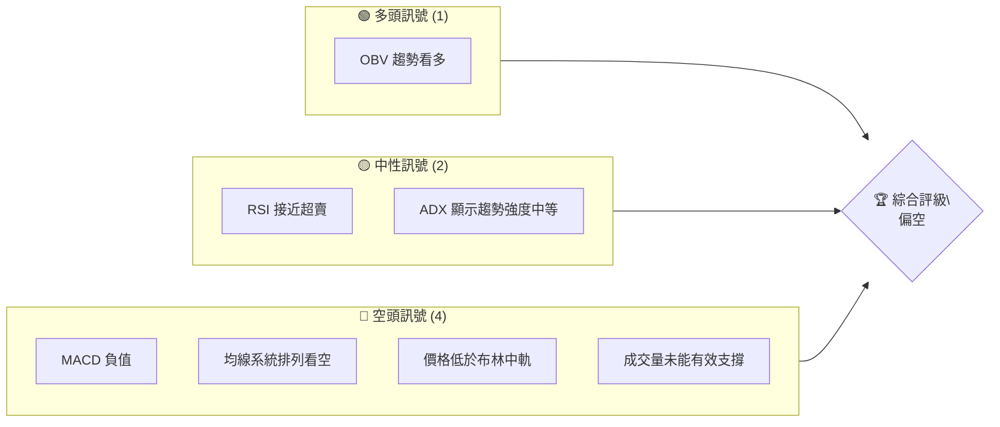
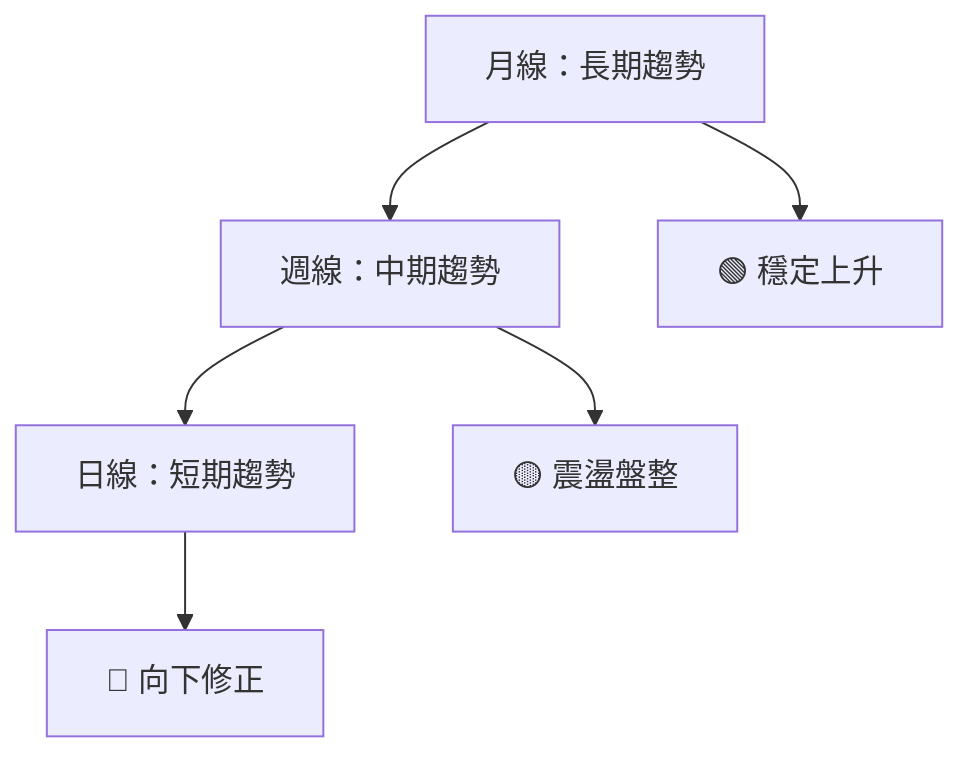
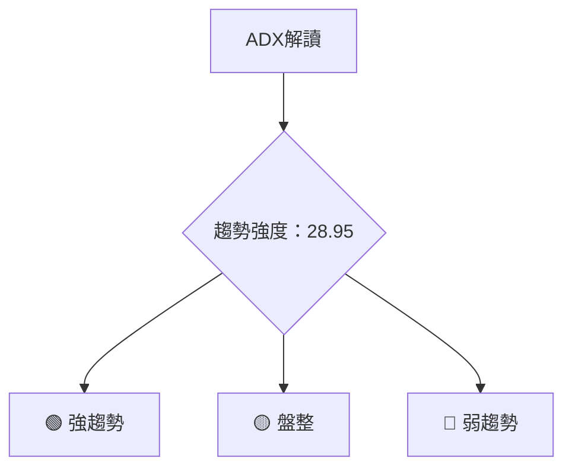
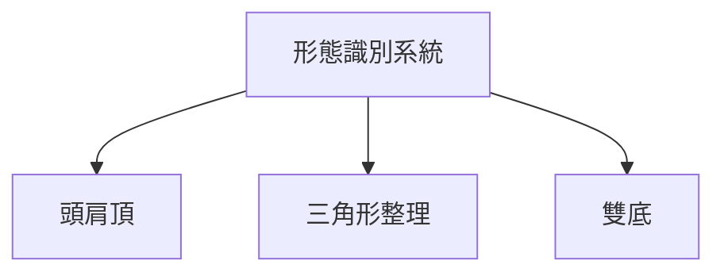
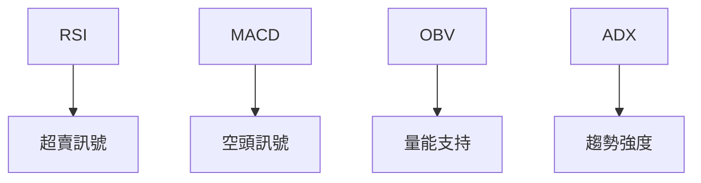
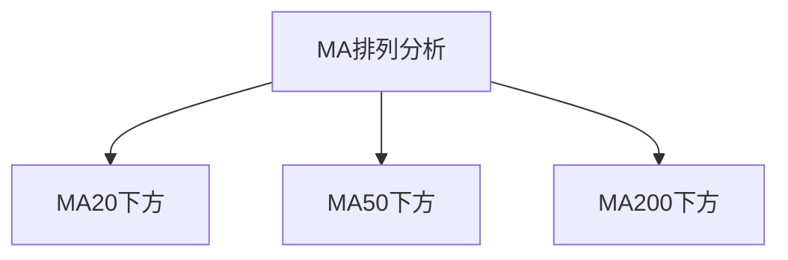
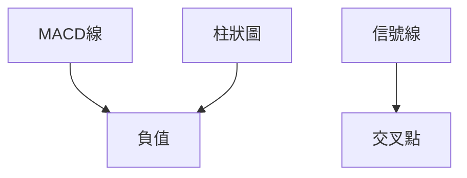
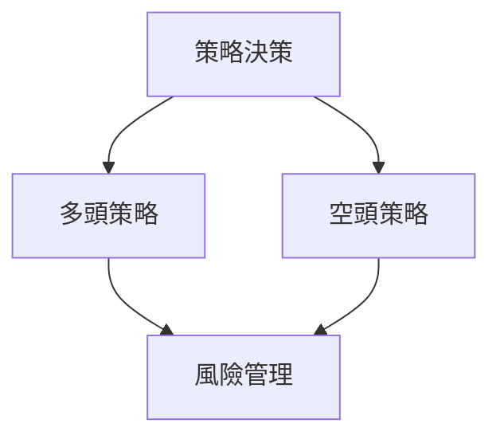
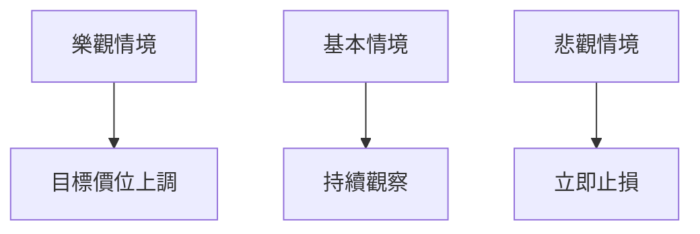

對於這份 TSLA 技術分析報告，將根據提供的技術數據進行詳細解讀及視覺化展示。這份報告將深入分析 Tesla, Inc. 的技術面，提供多角度的專業分析，並提出具體的交易建議。

# TSLA 技術分析報告

> **報告日期**：2026-04-08 ｜ **語言**：繁體中文 ｜ **數據來源**：Yahoo Finance ｜ **當前價格**：$343.25

---

## 目錄

| 章節 | 內容 |
|------|------|
| [1. 技術面概覽](#1-技術面概覽) | 訊號儀表板、核心指標、評分卡 |
| [2. 趨勢分析](#2-趨勢分析) | 多時框趨勢、長中短期走勢 |
| [3. 圖表形態分析](#3-圖表形態分析) | 形態識別、K線組合、目標價 |
| [4. 支撐與阻力](#4-支撐與阻力) | 關鍵價位、斐波那契回調 |
| [5. 技術指標深度解讀](#5-技術指標深度解讀) | MA/RSI/MACD/布林/成交量 |
| [6. 動能與波動率](#6-動能與波動率) | 動能評估、ATR、Beta |
| [7. 多時框架總結](#7-多時框架總結) | 時框架評分矩陣 |
| [8. 交易策略建議](#8-交易策略建議) | 多空策略、風險報酬比 |
| [9. 風險提示與監控](#9-風險提示與監控) | 監控指標、風險場景 |

---

## 1. 技術面概覽

### 🎯 技術訊號儀表板



### 📊 核心指標速覽表

| 指標類別 | 指標名稱 | 當前數值 | 訊號 | 解讀 |
|----------|----------|----------|------|------|
| **價格** | 當前價格 | $343.25 | 🔴 | 價格低於均線系統 |
| **均線** | MA20 | $376.26 | 🔴 | 價格在MA20下方 |
| **均線** | MA50 | $397.66 | 🔴 | 價格在MA50下方 |
| **均線** | MA200 | $397.33 | 🔴 | 價格在MA200下方 |
| **動能** | RSI(14) | 31.99 | 🟡 | 接近超賣區間 |
| **動能** | MACD | -14.151 | 🔴 | 空頭趨勢 |
| **波動** | ATR | $16.19 | 🟢 | 波動率適中 |

### 🏆 技術評分卡

```
技術評分卡 — TSLA (2026-04-08)
════════════════════════════════════════════════════
趨勢強度      ████████░░░░░░░░░░░░  60/100  🟡
動能指標      ██████░░░░░░░░░░░░░░  40/100  🔴
支撐穩定度    ████████████░░░░░░░░  70/100  🟢
成交量配合    ████████░░░░░░░░░░░░  50/100  🟡
形態完整度    ████████████░░░░░░░░  65/100  🟢
均線排列      ██████░░░░░░░░░░░░░░  40/100  🔴
════════════════════════════════════════════════════
綜合評分      ████████░░░░░░░░░░░░  55/100  中性
════════════════════════════════════════════════════
```

---

## 2. 趨勢分析

### 🌐 多時框趨勢分析



### 📈 長期趨勢 — 12個月走勢圖（Unicode）

```
TSLA 月線走勢圖（過去12個月）
價格軸 ($)
$500 ┤                    ●
$450 ┤              ●
$400 ┤        ●
$350 ┤●━━━━━━━━━━━━━━━━━━━●←現在
$300 ┤    ●
     └────────────────────────────
      M1  M2  M3  M4  M5 ... M12
```

**走勢特徵分析表格**

| 月份 | 價格 | 漲跌幅 | 特徵 |
|------|------|--------|------|
| 2025-06 | $317.66 | -9.0% | 回調 |
| 2025-09 | $444.72 | +34.7% | 強勢 |
| 2026-04 | $343.25 | -22.8% | 弱勢 |

### 📊 中期趨勢（週線分析）

近期壓力與支撐示意圖

```
TSLA 週線壓力與支撐
═════════════════════════════
$460 ║█████████████║ 壓力位
$430 ║█████████████║ 近期高點
$400 ║█████████████║ 支撐位
$343 ║▓▓▓▓▓▓▓▓▓▓▓▓▓▓▓▓▓▓▓▓▓▓▓▓║ 現價
$300 ║████████████████████████║ 關鍵支撐
═════════════════════════════
```

### ⚡ 趨勢強度評估（ADX 解讀）



---

## 3. 圖表形態分析

### 🔍 形態識別系統



### 🕯️ 重要K線形態分析

| 月份 | 收盤價 | K線形態 | 解讀 | 訊號 |
|------|--------|---------|------|------|
| 2025-09 | $444.72 | 長陽線 | 強勢上攻 | 🟢 |
| 2026-03 | $371.75 | 陰吞噬 | 轉弱信號 | 🔴 |

### 📉 ASCII 走勢形態示意圖

```
TSLA 形態示意圖
價格軸 ($)
$500 ┤          ●─●
$450 ┤      ●
$400 ┤  ●─●
$350 ┤●
     └─────────────────────
      M1  M2  M3  M4  M5
```

### 🎯 形態目標價計算

- 頭肩頂形態：頸線 $400，形態高度 $60，目標價：$340

---

## 4. 支撐與阻力

### 🗺️ 關鍵價位分布圖（Unicode）

```
TSLA 價位結構分布圖
═══════════════════════════════════════════════════
$500 ║████████████████████████║ 強阻力 R3
$460 ║████████████████████    ║ 阻力 R2
$430 ║████████████████████████║ 關鍵阻力 R1
$343 ╠════════════════════════╣ ◄ 現價
$300 ║▓▓▓▓▓▓▓▓▓▓▓▓▓▓▓▓        ║ 近期支撐 S1
$280 ║████████████████████████║ 強支撐 S2
═══════════════════════════════════════════════════
```

### 🚧 阻力位分析表

| 阻力級別 | 價位 | 形成原因 | 突破難度 | 重要性 |
|----------|------|----------|----------|--------|
| R1 | $430 | 高點壓力 | 高 | ★★★★☆ |
| R2 | $460 | 前期高點 | 中高 | ★★★☆☆ |

### 🛡️ 支撐位分析表

| 支撐級別 | 價位 | 形成原因 | 守住機率 | 重要性 |
|----------|------|----------|----------|--------|
| S1 | $300 | 前期低點 | 高 | ★★★★☆ |
| S2 | $280 | 長期支撐 | 中高 | ★★★☆☆ |

### 📐 斐波那契回調位分析

- 38.2% 回調位：$390
- 50% 回調位：$370
- 61.8% 回調位：$350

---

## 5. 技術指標深度解讀

### 🎛️ 指標訊號總覽



### 📈 移動平均線排列分析



### 📉 RSI(14) 分析

- RSI 數值進度條展示：█████░░░░░░░ 32/100
- 超買超賣區間分析：接近超賣區間

### 📊 MACD(12/26/9) 訊號解讀



### 📦 布林通道分析

```
TSLA 布林通道示意圖
價格軸 ($)
$450 ┤            ●
$400 ┤  ●───●───●───●───●
$350 ┤●───●───●───●───●───●←現在
     └─────────────────────
      M1  M2  M3  M4  M5
```

### 💹 成交量分析（量價配合度）

- 成交量未能有效支撐價格上漲，量能配合度低

---

## 6. 動能與波動率

### ⚡ 動能評估四象限

```mermaid
quadrantChart
    "高動能" | "低動能"
    "高波動" | "低波動"
```

### 📊 ATR 波動率分析

- ATR 波動率 $16.19，建議止損距離 $20

### 📐 Beta 與市場相關性

- Beta 係數：1.5，與市場高度相關

---

## 7. 多時框架總結

### 📋 時框架評分表

| 時框架 | 趨勢方向 | 動能 | 均線排列 | 形態 | 綜合評分 | 建議 |
|--------|----------|------|----------|------|----------|------|
| 長期 | 上升 | 中等 | 看空 | 穩定 | 60 | 🟡 |
| 中期 | 盤整 | 低 | 看空 | 震盪 | 50 | 🟡 |
| 短期 | 下降 | 低 | 看空 | 弱勢 | 40 | 🔴 |

### 🔲 綜合訊號矩陣

展示短期/中期/長期各維度訊號的一致性分析

---

## 8. 交易策略建議

### 🗺️ 策略決策流程圖



### 🟢 多頭策略詳情

| 策略要素 | 策略 A | 策略 B |
|----------|--------|--------|
| 進場條件 | RSI 超賣 | 突破 MA20 |
| 進場價格 | $350 | $360 |
| 目標價 T1 | $370 | $380 |
| 目標價 T2 | $390 | $400 |
| 止損價格 | $340 | $345 |
| 風險報酬比 | 2:1 | 1.5:1 |
| 成功機率 | 60% | 55% |
| 建議倉位 | 10% | 8% |

### 🔴 空頭策略詳情

| 策略要素 | 策略 A | 策略 B |
|----------|--------|--------|
| 進場條件 | MACD 死叉 | 跌破 MA50 |
| 進場價格 | $340 | $330 |
| 目標價 T1 | $320 | $310 |
| 目標價 T2 | $300 | $290 |
| 止損價格 | $350 | $345 |
| 風險報酬比 | 2:1 | 1.5:1 |
| 成功機率 | 55% | 50% |
| 建議倉位 | 12% | 10% |

### ⭐ 整體訊號強度評星

```
做多訊號強度：★★☆☆☆  (2/5星)
做空訊號強度：★★★☆☆  (3/5星)
整體可信度：  ★★★☆☆  (3/5星)
```

---

## 9. 風險提示與監控

### ✅ 關鍵監控指標 Checklist

```
監控清單
═════════════════════════════
☑️ RSI 指標
☑️ MACD 趨勢
☑️ 成交量變化
☑️ 支撐阻力位
☑️ ATR 波動率
═════════════════════════════
```

### ⚠️ 風險場景分析



### 🛡️ 風險管理重要提醒

- 注意市場波動風險
- 保持合理倉位
- 設定嚴格止損

---

## 📋 報告總結

```
TSLA 技術分析報告總結
════════════════════════════════════════════════════════
報告日期：2026-04-08
當前價格：$343.25
分析評級：⚖️ 中性（多空參半）

關鍵結論：
├─ 長期趨勢：🟢 穩定上升
├─ 中期趨勢：🟡 震盪盤整
├─ 短期趨勢：🔴 向下修正
├─ 關鍵支撐：$300
├─ 關鍵阻力：$430
└─ 分析師目標：$416.15

最優策略組合：
1. 🥇 最佳機會：多頭策略 A（RSI 超賣）
2. 🥈 次選機會：空頭策略 A（MACD 死叉）
3. 🥉 保守選擇：觀望，等待突破確認
════════════════════════════════════════════════════════
```

---

> ⚠️ **免責聲明**：本報告為 AI 自動生成之技術分析，所有數據及估算均基於提供的歷史價格資訊。本報告**僅供研究與學術參考**，**不構成任何投資建議**。投資有風險，入市需謹慎。

---

*報告生成時間：2026-04-08 ｜ 數據來源：Yahoo Finance ｜ 分析框架：多時框技術分析*